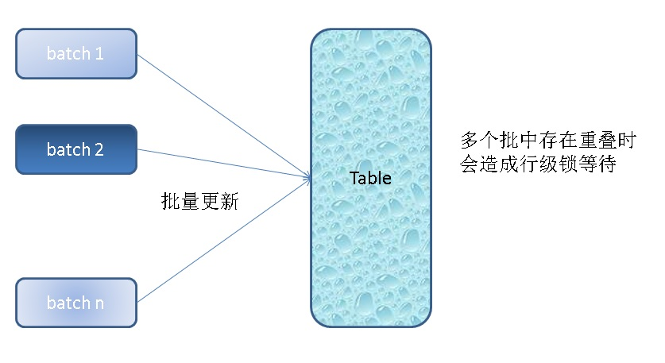
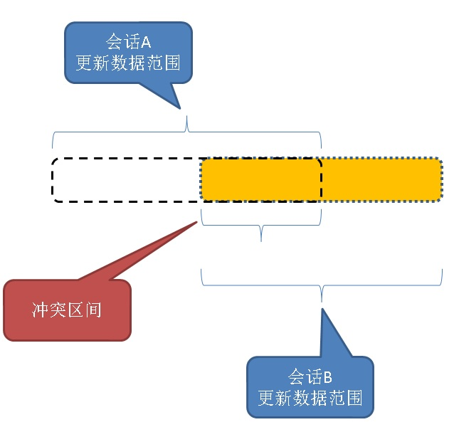

## PostgreSQL skip locked与CTE妙用 - 解决并发批量更新锁冲突带来的锁等待，提高处理吞吐  
                                                               
### 作者                                                               
digoal                                                               
                                                               
### 日期                                                               
2018-03-14                                                             
                                                               
### 标签                                                               
PostgreSQL , 锁等待 , 行锁 , 批量更新 , 并发 , CTE , skip locked , for update   
                                                               
----                                                               
                                                               
## 背景      
在用户画像系统中，有一个非常常见的需求是给用户贴标签，更新用户的标签，删除用户的标签。  
  
一个用户通常身上会有若干个标签，PostgreSQL支持数组类型，支持GIN倒排索引，已经有大量的用户使用PostgreSQL的数组和倒排索引来构建用户画像系统。  
  
我们知道在数据库中数据相关的锁，最小粒度就是行级别了，目前还没有列级别的锁。  
  
更新用户画像可能会带来一些锁冲突，举个例子：  
  
```  
create table t_label(  
  uid int primary key,   -- 用户ID  
  tag int[], -- 用户标签数组  
  mod_time   -- 最后的修改时间  
);  
```  
  
假设用户标签中包含关注店铺的信息，每天刷一次标签（表示用户取消了哪些店铺的关注，增加了哪些店铺的关注），分成多个并行的批量任务来刷。  
  
不同的任务，可能会操纵同一个用户，也就是同一条记录。那么就出现了任务之间的锁等待。  
  
batch1  
  
```  
update t_label set tag=remove(t_label.tag, t1.tag) from t_batch1 t1 where t_label.uid=t1.uid;  
```  
  
batch2  
  
```  
update t_label set tag=remove(t_label.tag, t1.tag) from t_batch2 t1 where t_label.uid=t1.uid;  
```  
  
  
  
以上两个BATCH就有可能出现冲突。  
  
  
  
如何解决呢？  
  
## 思路  
PostgreSQL提供了skip locked的功能，可以锁住一些行，同时跳过不可持锁（也就是别人已经持锁）的行。从而避免冲突。  
  
也就是说我们在更新一批数据时，完全可以只更新能锁到的记录，而锁不到的记录，我们可以在更新完后再次发起更新请求。  
  
那么就意味着，我们需要记录下来哪些已更新，哪些未更新，使用PostgreSQL的CTE语法，可以简单的实现这个目的。  
  
步骤：  
  
1、从BATCH中提取UID，并锁住目标表可以锁的行  
  
2、更新锁住的行  
  
3、从BATCH中删除已更新的行  
  
重复以上动作，知道BATCH中没有任何记录。  
  
  
## 例子  
1、创建目标表  
  
```  
postgres=# create table t_dest(id int primary key, info text, crt_time timestamp);  
CREATE TABLE  
```  
  
2、创建两个BATCH表，用于批量更新目标表  
  
```  
postgres=# create table t_batch1 (id int primary key, info text, crt_time timestamp);  
CREATE TABLE  
  
postgres=# create table t_batch2 (id int primary key, info text, crt_time timestamp);  
CREATE TABLE  
```  
  
3、往目标表写入一批数据  
  
```  
postgres=# insert into t_dest select generate_series(1,100000) , 'test', now();  
INSERT 0 100000  
```  
  
4、往BATCH表写入数据，同时确保两批BATCH的数据有重叠的ID。也就是人为的产生BATCH更新的行锁冲突。  
  
```  
postgres=# insert into t_batch1 select generate_series(100,10000) , 'test', now();  
INSERT 0 9901  
postgres=# insert into t_batch2 select generate_series(5000,11000) , 'test', now();  
INSERT 0 6001  
```  
  
5、使用CTE语法来更新，避免了冲突  
  
```  
postgres=# begin;  
BEGIN  
postgres=#   
with tmp as (select t1.id,t2.info,t2.crt_time from t_dest t1 join t_batch1 t2 on (t1.id=t2.id) for update skip locked) ,   -- 加锁，并跳过不能锁的行，并记录下被锁的记录  
     tmp1 as (update t_dest set info=tmp.info,crt_time=tmp.crt_time from tmp where t_dest.id=tmp.id returning t_dest.id)   -- 更新已加锁的那些记录  
     delete from t_batch1 where exists (select 1 from tmp1 where tmp1.id=t_batch1.id);                                     -- 删除已更新的记录  
  
DELETE 9901  
```  
  
在第一个BATCH更新未提交时，发起第二个BATCH更新，第二个BATCH更新了能够加锁的行，没有加锁的行保留在batch2表中  
  
```  
postgres=#   
with tmp as (select t1.id,t2.info,t2.crt_time from t_dest t1 join t_batch2 t2 on (t1.id=t2.id) for update skip locked) ,   
tmp1 as (update t_dest set info=tmp.info,crt_time=tmp.crt_time from tmp where t_dest.id=tmp.id returning t_dest.id)   
delete from t_batch2 where exists (select 1 from tmp1 where tmp1.id=t_batch2.id);  
  
DELETE 1000  
```  
  
提交第一个BATCH  
  
```  
postgres=# end;  
COMMIT  
```  
  
再次发起第二个BATCH的更新，剩余的行业被更新了  
  
```  
postgres=#   
with tmp as (select t1.id,t2.info,t2.crt_time from t_dest t1 join t_batch2 t2 on (t1.id=t2.id) for update skip locked) ,   
tmp1 as (update t_dest set info=tmp.info,crt_time=tmp.crt_time from tmp where t_dest.id=tmp.id returning t_dest.id)   
delete from t_batch2 where exists (select 1 from tmp1 where tmp1.id=t_batch2.id);  
  
DELETE 5001  
```  
  
最后，我们查看BATCH表，已全部清空，表示更新完毕。  
  
```  
postgres=# select * from t_batch1;  
 id | info | crt_time   
----+------+----------  
(0 rows)  
  
postgres=# select * from t_batch2;  
 id | info | crt_time   
----+------+----------  
(0 rows)  
```  
  
## 小结  
批量更新数据，如果业务逻辑上不去避免冲突的话，并发操作时，很容易造成行锁冲突。为了解决这个问题，本文使用了skip locked的加锁方法，同时结合CTE语法，可以实现高并发的批量数据DML操作。  
  
用途，对于没有先后顺序的批量更新，非常适用，例如本例提到的增加、删除标签。  
  
对于有前后顺序，并且需要保证整个BATCH DML操作原子性的场景，本文提到的方法不适用。  
  
## 参考
https://www.postgresql.org/docs/devel/static/sql-select.html  
  
https://www.postgresql.org/docs/devel/static/queries-with.html   
  
<a rel="nofollow" href="http://info.flagcounter.com/h9V1"  ></a>  
  
