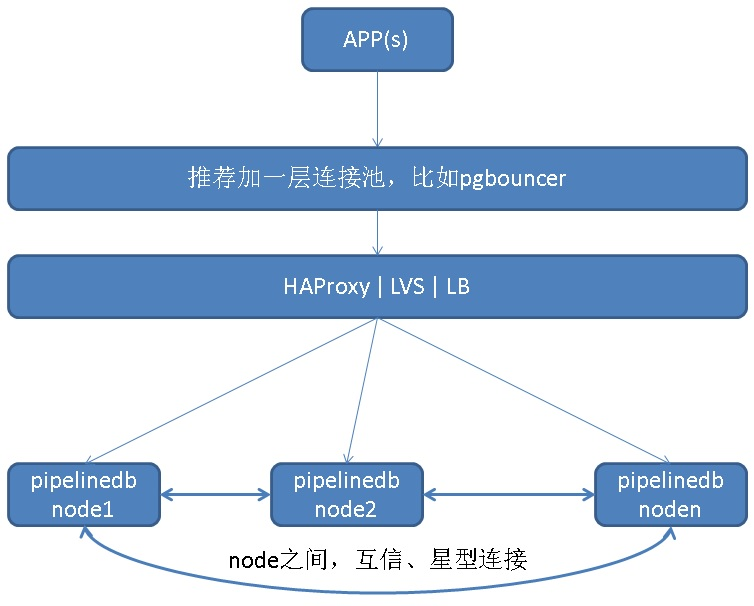
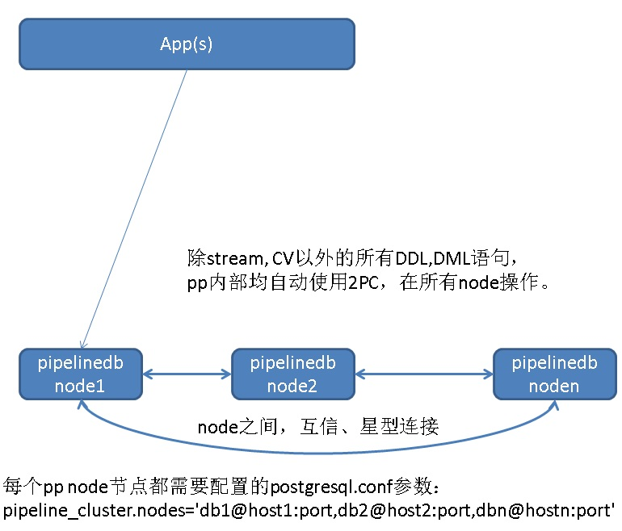
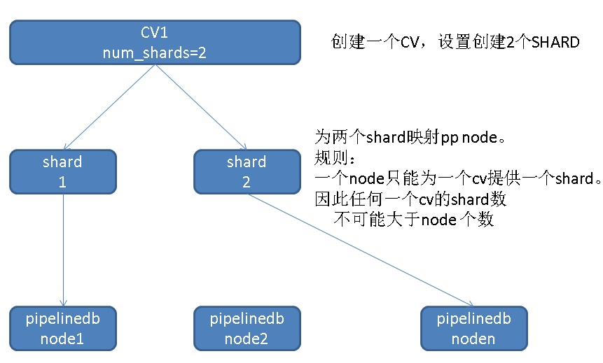
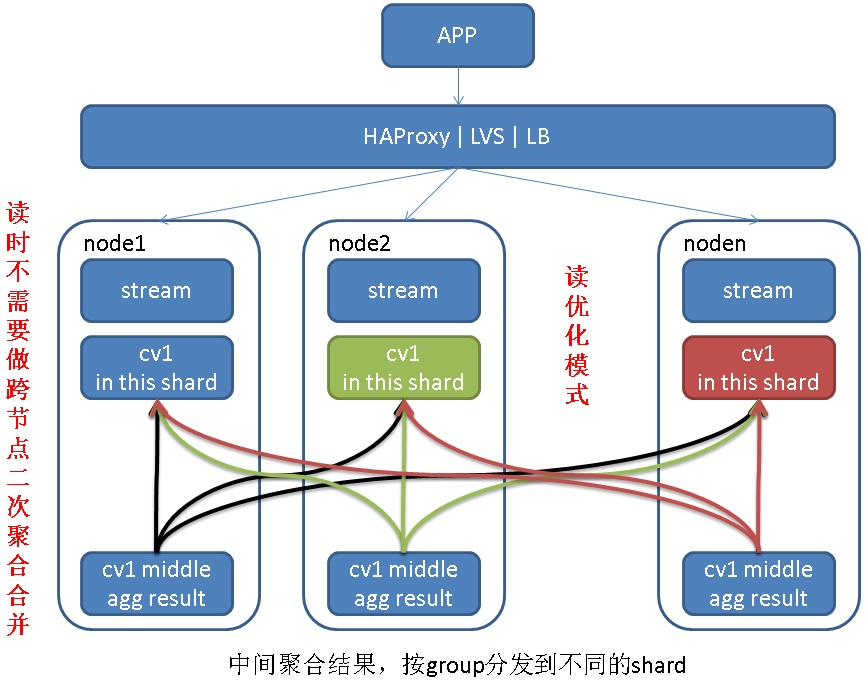
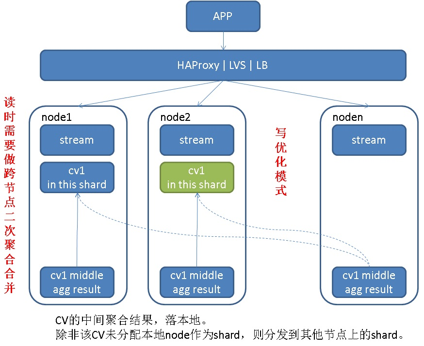
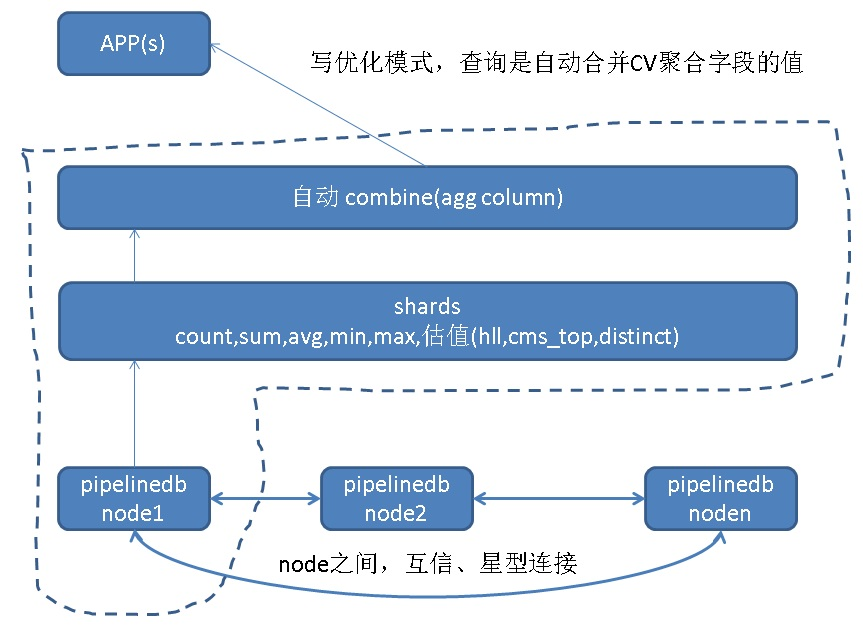
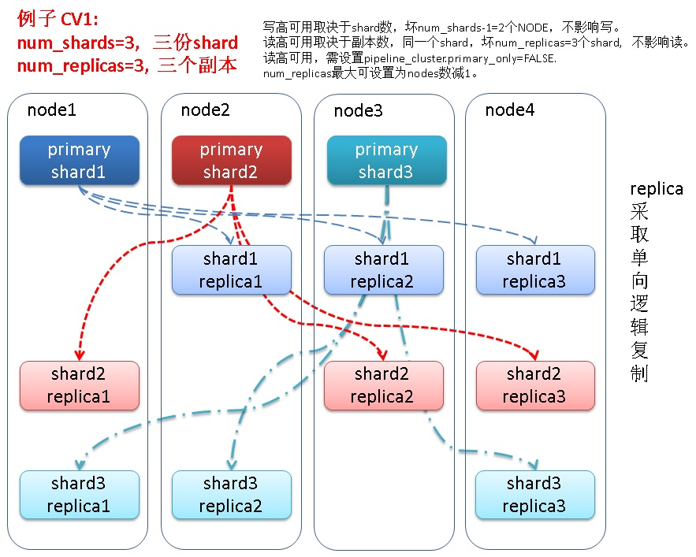

## PostgreSQL 流计算插件pipelinedb sharding 集群版原理介绍 - 一个全功能的分布式流计算引擎   
                                                                   
### 作者                                                                   
digoal                                                                   
                                                                   
### 日期                                                                   
2018-03-14                                                                 
                                                                   
### 标签                                                                   
PostgreSQL , pipelinedb , 流计算 , sharding , 水平扩展     
                                                                   
----                                                                   
                                                                   
## 背景          
pipelinedb cluster定位为一个分布式流式计算引擎。拥有强大的分布式计算能力，扩展能力，高可用能力，负载均衡能力，读优化和写优化能力，数据自动合并能力。       
    
## pipelinedb cluster架构    
    
    
    
为了达到无master的架构，pipelinedb集群的所有节点间互相信任通信，实现CV中间聚合结果的数据自动分发，除STREAM，CV以外的其他普通数据DML DDL的全分发以及2PC提交。    
    
由于是无master架构，客户端连接任意pipelinedb shared节点都可以。    
    
CV以外的其他DML DDL操作，2PC模式，所有节点执行。保证所有节点有完整的非CV，stream数据。    
    
    
    
建议应用程序通过连接池连到HAPROXY或其他负载均衡软件，然后再连接各个pipelinedb node。实现最大吞吐。建议使用HAPROXY或LVS来实现负载均衡，当然现在的jdbc , libpq或其他驱动很多都支持了负载均衡的配置。    
    
使用pgbouncer来实现连接池的功能，pgbouncer纯C开发，是目前PostgreSQL比较高效的一款连接池。    
    
    
## shard, node概念    
node指PP的数据节点。    
    
shard是逻辑概念，在创建cv时，需要指定这个CV需要开启多少个shard。    
    
注意，为了达到最高横向扩展效率，对于同一个CV，每个NODE只负责它一个SHARD。因此一个CV最多可以创建多少SHARD呢？（当然是不能超过NODE个数了）    
    
    
    
定义一个CV跨多少个SHARD的两种方法:    
    
```    
CREATE CONTINUOUS VIEW v WITH (num_shards=8) AS    
  SELECT x::integer, COUNT(*) FROM stream GROUP BY x;    
    
    
CREATE CONTINUOUS VIEW v WITH (shard_factor=50) AS    
  SELECT x::integer, COUNT(*) FROM stream GROUP BY x;    
```    
    
当使用shard_factor设置时，实际上给出的是一个百分比值，取值1-100，因此对于16个node的集群，50的意思就是8个shard。    
    
在CV创建时，会生成元数据（CV在哪里，分片策略是什么（读优化还是写优化），等），元数据结构如下：    
    
```    
\d pipeline_cluster.shards    
  View "pipeline_cluster.shards"    
     Column      |   Type   | Modifiers    
-----------------+----------+-----------    
 shard           | text     |    
 owner           | text     |    
 continuous_view | text     |    
 shard_id        | smallint |    
 shard_type      | text     |    
 sharding_policy | text     |    
 is_local        | boolean  |    
 balanced        | boolean  |    
 reachable       | boolean  |    
```    
    
## 数据路由策略    
创建CV时，使用sharding_policy指定数据路由策略。    
    
### 读优化    
    
一个CV中，同一个聚合分组的数据会路由到某一个节点，读取时不需要二次合并。但是写入可能会涉及数据重分发（当然这个动作是pipelinedb shard节点透明的完成的，应用不感知，只是写性能肯定有所下降）    
    
注意网络上分发的是聚合后的数据，即一批聚合后的结果（不同的分组，分发到对应的shard）。    
    
What this means is that only the aggregate result of incoming rows actually needs to be routed. This is designed to both minimize network overhead and distribute work.    
    
    
    
    
```    
INSERT INTO stream (x) VALUES (0), (0), (0), (0), (0);    
```    
    
Assuming that the worker process reads these five rows all at once fast enough, only the aggregate row (0, 5) would be routed to the grouping’s designated node, and subsequently combined with on-disk data as usual.    
    
```    
CREATE CONTINUOUS VIEW v0 WITH (sharding_policy='read_optimized') AS    
  SELECT x::integer, COUNT(*) FROM stream GROUP BY x;    
```    
    
### 写优化    
    
每个shard管自己的CV，因此同一个维度的数据可能出现在多个SHARD中。写性能达到最大吞吐。    
    
仅仅当本地节点不包含目标CV的任何shard时，才需要分发聚合后的部分结果。（关注一下代码：是一批中间结果打散随机分发到所有shard，还是随机选一个shard，将整一批中间结果全部发给这个shard？）    
    
Routing is then only necessary if a node that produces a partial aggregate result for a given group does not have any shards for the group’s continuous view.     
    
    
    
```    
CREATE CONTINUOUS VIEW v1 WITH (sharding_policy='write_optimized') AS    
  SELECT x::integer, COUNT(*) FROM stream GROUP BY x;    
```    
    
### 读合并    
    
采用写优化模式时，为了保证数据的完整性，读时需要合并。因此PIPELINEDB需要支持所有的CV都具备合并能力，包括count,avg,sum等常见指标，以及CMS-TOP，HLL等概率指标数据类型的合并，还好这些概率类型目前都是支持同类UNION的。    
    
    
    
    
```    
CREATE CONTINUOUS VIEW v WITH (sharding_policy='write_optimized', shards=16) AS    
  SELECT x::integer, AVG(y::integer) FROM stream GROUP BY x;    
```    
    
Since it uses a write_optimized grouping policy, multiple local copies for each grouped average may exist. At read time, these groups would be combined with no loss of information, producing a finalized result with exactly one row per group.    
    
http://docs.pipelinedb.com/aggregates.html#combine    
    
## HA、分片负载均衡    
http://enterprise.pipelinedb.com/docs/high-availability.html    
  
    
  
1、写高可用取决于primary shard数，坏num_shards-1=2个NODE，不影响写。  
  
2、读高可用取决于副本数，同一个shard，坏num_replicas=3个shard,  不影响读。  
  
3、读高可用，需设置pipeline_cluster.primary_only=FALSE.   
  
4、replica shard不能与primary shard在同一个NODE上，所以num_replicas最大可设置为nodes数减1。    
    
内部使用PostgreSQL的异步逻辑订阅功能(logical decoding)，实现cv结果的多副本，在创建cv时通过num_replicas指定每个shard的副本数。    
    
注意这里使用的是异步复制，所以在创建CV时，num_shards=3表示有3个primary shard，num_replicas=2表示每个primary shard有2个副本。    
    
```    
CREATE CONTINUOUS VIEW v WITH (num_shards=3, num_replicas=2) AS    
  SELECT x::integer, COUNT(*) FROM stream GROUP BY x;    
```    
  
注意，如果创建CV时未设置num_replicas，则使用pipeline_cluster.num_replicas参数的值。  
  
### 读负载均衡  
当设置了多个副本时，可以实现分片读负载均衡：    
    
1、读负载均衡：设置pipeline_cluster.primary_only=false（默认为false，即允许读replica shard），会把replica shard纳入读负载均衡的节点，例如一个primary shard有3个replica shard，那么实际上读可以在4个shard中进行负载均衡。  需要注意的是，PP的replica是采用异步的逻辑复制模式，数据可能存在延迟，读负载均衡可能导致不一致的结果。  
    
### 节点异常处理机制  
1、读，只要设置了pipeline_cluster.primary_only=false，并且num_replicas大于等于1，那么primary shard所在的NODE挂掉时，会去读replica shard。  
  
读高可用取决于副本数，同一个shard，坏num_replicas=3个shard,  不影响读。  
  
读高可用，需设置pipeline_cluster.primary_only=FALSE.     
  
2、读，当primary shard以及对应的所有replica shard都不可用时，实际上就真的不可用了，至少这个SHARD的数据是读不出来了。  
  
但是通过设置pipeline_cluster.skip_unavailable=true，可以跳过不可用的shard，也就是说返回部分数据。  
  
3、写，当某个primary shard不可用时，会将数据写入到其他可用的primary shard。除非所有的primary shard都不可用，这次聚合的中间结果才会丢弃。  
  
写高可用取决于primary shard数，坏num_shards-1=2个NODE，不影响写，不会丢数据。  
  
当所有primary shard都不可用时，如果集群中还有可用的NODE(即CV设置的num_shards小于PP集群的节点数时)，那么这个NODE会继续计算，但是结果会被丢弃（因为没有任何可用的PRIMARY SHARD）。  
  
4、写，如果cv采用了读优化模式，那么如果有primary shard异常，虽然数据可以正常路由到其他的primary shard，但是打乱了读优化模式下的cv group数据分布，会导致数据不平衡。读不平衡的CV，同时又不进行COMBINE，就会读到不一致的结果。如何解决请看后面的平衡章节。  
  
### 什么时候可能丢数据？  
当primary shard所在的NODE挂掉，并且这个NODE不可能再恢复时，那么可能导致数据丢失。（由于replica shard是异步的逻辑复制，所以不能保证数据不丢失，而且replica是用来提高读负载均衡能力的，也未设计为FAILOVER节点，即单向复制）  
  
1、如何防止数据丢失？  
  
为NODE所在的PostgreSQL实例实施高可用，备份策略。要做到0丢失，可以使用实例级多副本的方法，或者共享存储多副本的方法。例子：     
  
[《PostgreSQL 10 on ECS 实施 流复制备库镜像+自动快照备份+自动备份验证+自动清理备份与归档》](../201711/20171129_02.md)    
  
[《PostgreSQL 10 + PostGIS + Sharding(pg_pathman) + MySQL(fdw外部表) on ECS 部署指南(适合新用户)》](../201710/20171018_01.md)    
  
只要primary node的数据不丢失，就不会有数据丢失。  
  
2、读时，如何跳过不可用的shard（指某个shard的primary shard以及所有的replica shard都不可用），输出部分结果？  
  
```  
pipeline_cluster.skip_unavailable = true  
  
查询时，可以跳过不可用的shard，返回不完整的CV结果。  
```  
  
### 读优化模式数据rebalance  
在读优化模式下（read_optimized），当有primary shard异常时，正常来说应该分发到这个primary shard的cv group，可能会先写到其他的primary shard，保证写正常进行同时保证数据的完整性。  
  
但是由于读优化模式下，读CV时，不做数据COMBINE，所以这部分数据会存在但是“读不到”。  
  
pipeline_cluster.shards元数据表的balanced列，如果为false，表示这个shard的数据需要rebalance。如果你发现读优化模式的shard balanced列为false，就需要手工rebalance了。  
  
写优化模式pipeline_cluster.shards.balanced永远是true的，因为写优化模式下，不需要rebalance，查询时会combine agg column。  
  
Pipelinedb cluster版，未来会考虑自动在后台对读优化模式的cv，进行检测，发现需要rebalance时，自动进行rebalance，确保查询的全局一致性。(当然，这是个偶发问题，暂时看来还没有非常完美的解决方案)  
  
内核优化建议：  
  
对于读优化模式，可以先查看一下是否需要rebalance，如果需要，则查询时使用combine进行查询，同时通知rebalance任务，开启异步的rebalance。  
  
## 渊源    
pipelinedb与citus有一定的渊源，cluster版本，应该借鉴了很多citus pg_shard插件的设计理念，甚至可能有大量代码复用。    
    
https://www.citusdata.com/product    
    
https://github.com/citusdata/pg_shard    
    
https://github.com/citusdata/citus    
    
    
## 小结    
pipelinedb cluster定位是一个分布式流式计算引擎。支持了良好的计算扩展性、可靠性、负载均衡能力，同一个CV支持跨SHARD计算，支持读优化模式，支持写优化模式，同时支持写优化模式的自动合并聚合计算结果，是一个非常棒的分布式流计算引擎。      
    
通过分发中间聚合结果，优化了网络开销。     
    
在读可用性方面，CV通过内部逻辑订阅实现多副本，解决了读高可用与负载均衡的问题。  
  
在写可用性方面，任意primary shard都可以接受数据存储（读时combine），所以写本身就是高可用的。  
  
## 参考    
http://enterprise.pipelinedb.com/docs/index.html    
    
http://docs.pipelinedb.com/aggregates.html#combine    
    
https://www.citusdata.com/product    
    
    
<a rel="nofollow" href="http://info.flagcounter.com/h9V1"  ></a>    
    
  
  
  
  
  
## [digoal's 大量PostgreSQL文章入口](https://github.com/digoal/blog/blob/master/README.md "22709685feb7cab07d30f30387f0a9ae")
  
