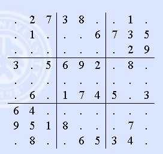

## PostgreSQL 生成任意基数数独 - 1  
                                                           
### 作者                                                           
digoal                                                           
                                                           
### 日期                                                           
2018-03-19                                                         
                                                           
### 标签                                                           
PostgreSQL , 数独    
                                                           
----                                                           
                                                           
## 背景    
不知道什么时候开始数独游戏风靡起来了，数独游戏由一个N*N的矩阵组成，N必须是一个可以被开根的数值，例如4,9,16,25等。  
  
任意一个像素，必须在三个方向上保证值唯一。这三个方向分别是X,Y,BOX。XY很好理解就是纵横的一条线（X,Y的像素个数就是N）。BOX指这个像素所在的BOX（BOX是由 (N的平方根)*(N的平方根) 个像素组成的矩阵）。  
  
如图，一个9*9个像素的数独。（我把基数称为3）  
  
  
  
16*16的数独，16行，16列。同时分成4*4个BOX。（我把基数称为4）  
  
那么如何生成一个有解的数独呢？  
  
这个方法可行吗？  
  
以下方法是按从左到右，从上到下的顺序来生成随机数的，看起来可行，实际上大多数情况下都无法生成有解数独，因为前面还比较容易满足条件，后面基本上就无法满足条件了。  
  
```  
create or replace function gen_sudoku(  
  dim int  -- 基数  
) returns int[] as $$  
declare  
  res int[];   
  vloops int := 2 * (dim^5);  
  vloop int :=0;  
  ovloops int := 2 * (dim^5);  
  ovloop int :=0;  
  rand int;  
begin  
  -- 初始化矩阵  
  select array( select (select array_agg(0) from generate_series(1,(dim^2)::int)) from generate_series(1,(dim^2)::int)) into res;  
    
  loop  
        -- 无法生成并返回  
	if ovloop >= ovloops then  
	  raise notice '已循环%次，可能无法生成数独。', ovloop;  
	  return res;  
	end if;  
	ovloop := ovloop+1;  
  
  <<outer>>  
  for x in 1..dim^2 loop  
    raise notice 'start again %', ovloop;  
    for y in 1..dim^2 loop  
      vloop := 0;  
      loop  
        -- 生成随机值  
	rand := 1+(random()*((dim^2)-1))::int;  
  
        -- 这轮循环无法生成并返回  
	if vloop >= vloops then  
	  -- raise notice '1  %此数已循环%次，可能无法生成数独。', rand, vloop;  
	  -- return res;  
	  exit outer;  
	end if;  
	vloop := vloop+1;  
  
        -- 横向验证  
        perform 1 where array(select res[x][generate_series(1,(dim^2)::int)]) && array[rand];  
	if found then  
	  --raise notice '2  %此数已循环%次，可能无法生成数独。%', rand, vloop, array(select res[x][generate_series(1,(dim^2)::int)]) ;  
	  continue;  
	end if;  
	  
	-- 纵向验证  
        perform 1 where array(select res[generate_series(1,(dim^2)::int)][y]) && array[rand];  
	if found then  
	  --raise notice '3  %此数已循环%次，可能无法生成数独。%', rand, vloop, array(select res[generate_series(1,(dim^2)::int)][y]);  
	  continue;  
	end if;  
	  
	-- BOX验证  
        perform 1 where array(select res[xx][yy] from (select generate_series(((((x-1)/dim)::int)*dim)+1, ((((x-1)/dim)::int)*dim)+dim) xx) t1, (select generate_series(((((y-1)/dim)::int)*dim)+1, ((((y-1)/dim)::int)*dim)+dim) yy) t2) && array[rand];  
	if found then  
	  --raise notice '4  %此数已循环%次，可能无法生成数独。%', rand, vloop, array(select res[xx][yy] from (select generate_series(((((x-1)/dim)::int)*dim)+1, ((((x-1)/dim)::int)*dim)+dim) xx) t1, (select generate_series(((((y-1)/dim)::int)*dim)+1, ((((y-1)/dim)::int)*dim)+dim) yy) t2);  
	  continue;  
	end if;  
	  
	-- 通过验证  
	res[x][y] := rand;  
	raise notice 'res[%][%] %', x, y, rand;  
	-- 跳出循环  
	exit;  
      end loop;  
    end loop;  
  end loop;  
  end loop;  
  return res;  
end;  
$$ language plpgsql strict;  
```  
  
以上方法最大的问题是，因为是左右，前后顺序在生成数独，实际上越到后面，会导致可以填充的满足XYB约束值越少，甚至没有。  
  
为了尽可能的每次填充的值都有较大概率，可以在生成顺序上进行调整，不使用从左到右，从上到下的方法。  
  
而是每一步都选择在XYB方向上还有最大概率（即最多没有填充的值）的像素。（我不清楚下围棋先占4个角，是不是也是同样的道理？）  
  
## 如何找到每个像素在XYB维度上还有多少个未填充的值？  
输入一个矩阵，得到另一个矩阵，表示当前位置在XYB轴的未填充值的个数。（非空值的xyb返回x,y,0,0,0）因为非空值不需要再填充它，所以无所谓。  
  
1、首先要创建一个类型，包括数独矩阵的 X,Y坐标。以及这个坐标的横、竖、BOX三个方向上的剩余未填充值的个数。  
  
```  
create type xyb as (  
 ax int, -- 横坐标  
 ay int, -- 纵坐标  
 x int,  -- 横向还有多少未填充像素  
 y int,  -- 竖向还有多少未填充像素  
 b int   -- BOX内还有多少未填充像素  
);  
```  
  
2、编写一个函数，用来计算一个为完成数独矩阵，其每一个像素的XYB值。  
  
```  
create or replace function comp_xyb(  
  int[],   -- 包含一些值的数独二维矩阵，当像素值为0时，表示这个值没有填充  
  int      -- 数独的基数（比如2,3，。。。），3就是常见的9*9数独，4就是16*16数独。   
)   
returns xyb[]   -- 返回一个复合类型的数组矩阵，矩阵像素和输入矩阵一样，每个像素表示这个像素在XYB轴上还有多少个没有填充的值（没有填充的值用0表示）  
as $$   
declare  
  dims int := ($2)^2;   -- 基数的平方，表示行、列、BOX的像素个数。也是每个方向上的矩阵标记上限  
  res xyb[];            -- 结果  
  
  vx int;  -- 横向还有多少未填充像素  
  vy int;  -- 竖向还有多少未填充像素  
  vb int;  -- BOX内还有多少未填充像素  
  
  lx int;  -- box的X方向矩阵下标  
  ux int;  -- box的X方向矩阵上标  
  ly int;  -- box的Y方向矩阵下标  
  uy int;  -- box的Y方向矩阵上标  
begin  
  -- 初始化矩阵  
  select array (  
    select array( select format('(%s,%s,0,0,0)', x, y) from generate_series(1,dims) t(y))   
      from (select generate_series(1, dims) x) t   
    )  
  into res;   
  
  -- X坐标  
  for x in 1..dims loop  
    -- Y坐标  
    for y in 1..dims loop  
        
      -- 如果这个像素的值不等于0，说明已经是一个已经填充过的像素，返回0,0,0  
      if ($1)[x][y] <> 0 then  
        -- 不计算已填充了非0值的像素  
	continue;  
      else  
        -- x，计算X方向有多少个未填充的像素  
	select sum(case arr when 0 then 1 else 0 end) from   
	  (select ($1)[x][generate_series(1, dims)] as arr) t   
	into vx;  
	  
	-- y，计算Y方向有多少个未填充的像素  
	select sum(case arr when 0 then 1 else 0 end) from   
	  (select ($1)[generate_series(1, dims)][y] as arr) t   
	into vy;  
	  
	-- b，计算BOX内有多少个未填充的像素  
	-- x下限  
	  lx := ((x-1)/$2)::int * $2 + 1;  
	-- x上限  
	  ux := ((x-1)/$2)::int * $2 + $2;  
	-- y下限  
	  ly := ((y-1)/$2)::int * $2 + 1;  
	-- y上限  
	  uy := ((y-1)/$2)::int * $2 + $2;  
        -- 计算BOX内有多少个未填充的像素  
	select sum(case arr when 0 then 1 else 0 end) from   
	  (select ($1)[xx][yy] as arr from   
	    (select generate_series(lx,ux) xx) t1, (select generate_series(ly,uy) yy) t2  
	  ) t into vb;  
          
	-- 将XYB的值，写入结果变量的对应像素中  
	res[x][y] := format('(%s,%s,%s,%s,%s)',x,y,vx,vy,vb)::xyb;  
      end if;  
    end loop;  
  end loop;  
  return res;  
end;  
$$ language plpgsql strict immutable;  
```  
  
3、用法举例  
  
计算以下2为基数，4*4的矩阵的xyb值  
  
```  
{1,2,3,4},  
{0,1,1,0},  
{0,1,1,0},  
{0,1,1,0}  
```  
  
```  
postgres=# select array(select (comp_xyb('{{1,2,3,4},{0,1,1,0},{0,1,1,0},{0,1,1,0}}', 2))[x][generate_series(1,4)]) from generate_series(1,4) t(x);  
                           array                             
-----------------------------------------------------------  
 {"(1,1,0,0,0)","(1,2,0,0,0)","(1,3,0,0,0)","(1,4,0,0,0)"}  
 {"(2,1,2,3,1)","(2,2,0,0,0)","(2,3,0,0,0)","(2,4,2,3,1)"}  
 {"(3,1,2,3,2)","(3,2,0,0,0)","(3,3,0,0,0)","(3,4,2,3,2)"}  
 {"(4,1,2,3,2)","(4,2,0,0,0)","(4,3,0,0,0)","(4,4,2,3,2)"}  
(4 rows)  
```  
  
使用unnest可以解开，按XYB三个方向总大小排序，再按某个方向最大排序，从而做到逐级收敛，真正每一次填充的像素，都是具备最大概率的像素。  
  
```  
postgres=# select * from 
unnest(
  comp_xyb('{{1,2,3,4},{0,1,1,0},{0,1,1,0},{0,1,1,0}}', 2)
) t 
where 
  t.x+t.y+t.b <> 0
order by 
  (t.x+t.y+t.b) desc, 
  greatest(t.x,t.y,t.b) desc;  

 ax | ay | x | y | b 
----+----+---+---+---
  3 |  1 | 2 | 3 | 2
  3 |  4 | 2 | 3 | 2
  4 |  1 | 2 | 3 | 2
  4 |  4 | 2 | 3 | 2
  2 |  1 | 2 | 3 | 1
  2 |  4 | 2 | 3 | 1
(6 rows) 
```  
  
通过这个SQL得到了某个像素，这个像素的XYB方向上，还有最多的像素没有被填充。  
  
因此这个像素如果生成一个随机值的话，违反数独的约束（或者叫冲突）的概率是最小的。  
  
```  
postgres=# select * from 
unnest(
  comp_xyb('{{1,2,3,4},{0,1,1,0},{0,1,1,0},{0,1,1,0}}', 2)
) t 
where 
  t.x+t.y+t.b <> 0
order by 
  (t.x+t.y+t.b) desc, 
  greatest(t.x,t.y,t.b) desc 
limit 1;  

 ax | ay | x | y | b 
----+----+---+---+---
  3 |  1 | 2 | 3 | 2
(1 row)
```  
  
用AX,ZY坐标值，往矩阵的这个像素填充符合数独条件的随机值，可以大幅提高构造可解数独的概率。  
  
## 小结  
本文先介绍如何得到这样的一个像素，填充一个值进行，这个值的取值区间应该是最大的（最不会与数独的游戏规则违背），从而更大可能的生成一个完整可解的数独。  
  
下面一篇文章再介绍如何生成一个N*N的数独。  
  
## 参考  
http://poj.org/problem?id=3074  
  
NP完全问题近似求解。   
   
[《PostgreSQL 生成任意基数数独 - 1》](../201803/20180319_01.md)     
    
[《PostgreSQL 生成任意基数数独 - 2》](../201803/20180320_01.md)     
    
[《PostgreSQL 生成任意基数数独 - 3》](../201803/20180320_02.md)  
  
  
<a rel="nofollow" href="http://info.flagcounter.com/h9V1"  ></a>  
  
  
  
  
  
  
## [digoal's 大量PostgreSQL文章入口](https://github.com/digoal/blog/blob/master/README.md "22709685feb7cab07d30f30387f0a9ae")
  
