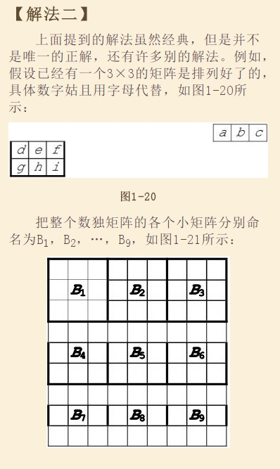
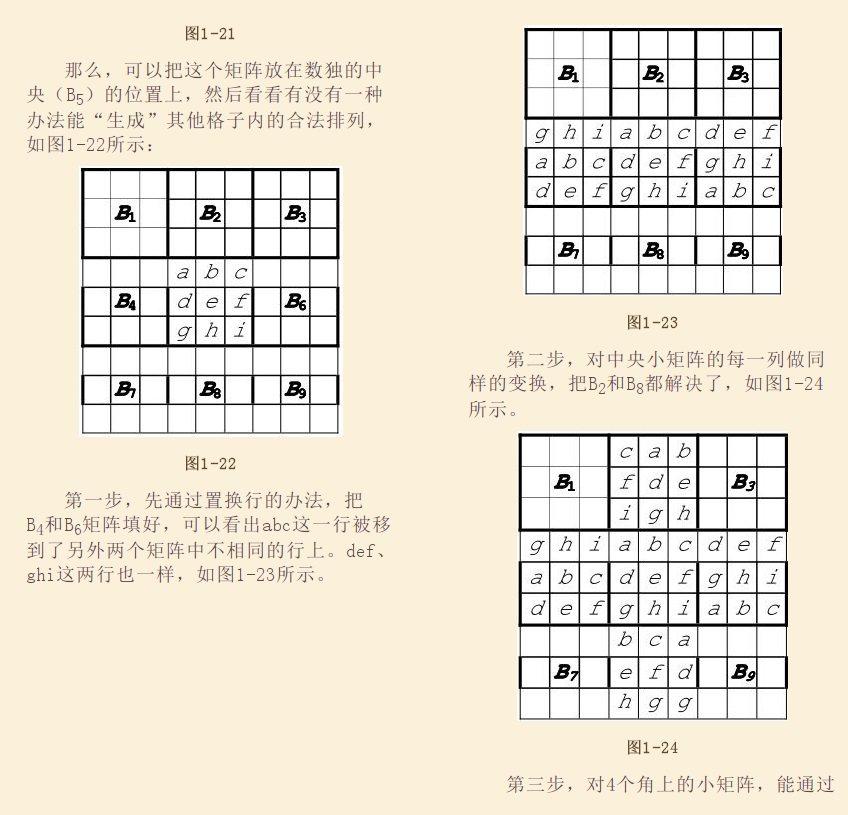
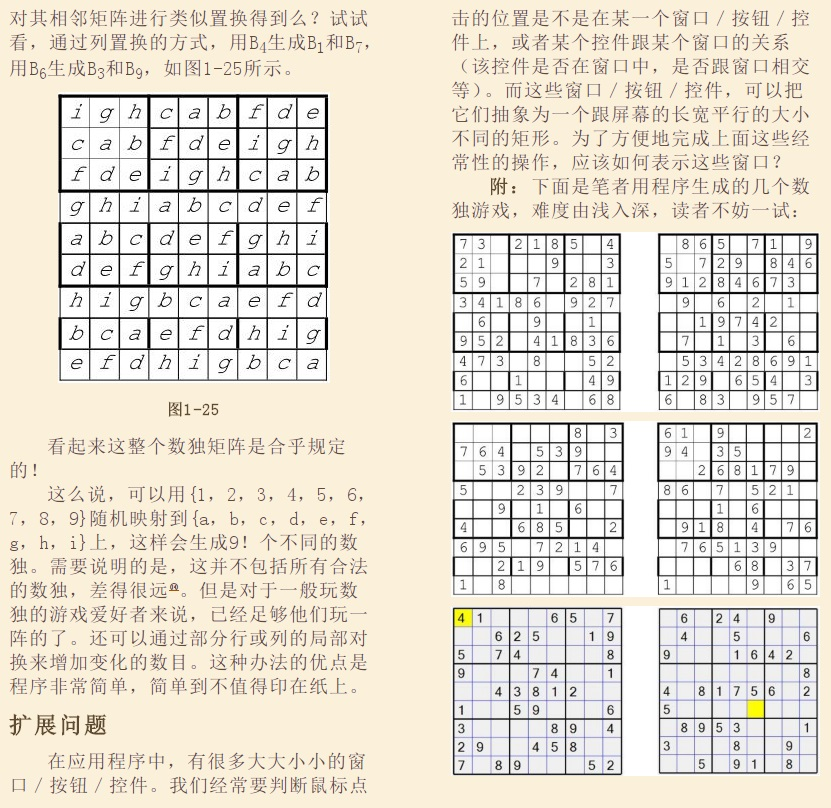

## PostgreSQL 生成任意基数数独 - 3     
                                                               
### 作者                                                               
digoal                                                               
                                                               
### 日期                                                               
2018-03-20                                                             
                                                               
### 标签                                                               
PostgreSQL , 数独        
                                                               
----                                                               
                                                               
## 背景    
使用随机填充的方法，很难生成一个有解的数独。  
  
[《PostgreSQL 生成任意基数数独 - 2》](../201803/20180320_01.md)     
  
本文使用了《编程之美》中提到的另一种生成随机数独的方法，模板+映射法。  
  
  
  
  
  
  
  
首先要生成一个模板，然后根据这个模板，我们可以旋转、正反换面，一共生成8个模板。  
  
模板生成好之后，把1-9的数字映射进去，即可得到有效的数独。  
  
## 例子  
  
1、生成有解数独模板  
  
```  
create or replace function gen_sudoku_template()   
returns setof text[] as $$  
declare  
  res text[];  -- 结果  
begin  
  -- 初始种子模板  
  create TEMP table if not exists tmp_sudoku(id int, c1 "char", c2 "char", c3 "char", c4 "char", c5 "char", c6 "char", c7 "char", c8 "char", c9 "char");  
  truncate tmp_sudoku;  
  insert into tmp_sudoku values  
  (1, 'i','g','h','c','a','b','f','d','e'),  
  (2, 'c','a','b','f','d','e','i','g','h'),  
  (3, 'f','d','e','i','g','h','c','a','b'),  
  (4, 'g','h','i','a','b','c','d','e','f'),  
  (5, 'a','b','c','d','e','f','g','h','i'),  
  (6, 'd','e','f','g','h','i','a','b','c'),  
  (7, 'h','i','g','b','c','a','e','f','d'),  
  (8, 'b','c','a','e','f','d','h','i','g'),  
  (9, 'e','f','d','h','i','g','b','c','a');  
  
  -- 返回初始模板  
  select array_agg(array[c1,c2,c3,c4,c5,c6,c7,c8,c9] order by id) into res from tmp_sudoku ;  
  return next res;  
  
  -- 调转顺序，得到反面  
  select array_agg(array[c9,c8,c7,c6,c5,c4,c3,c2,c1] order by id) into res from tmp_sudoku ;  
  return next res;  
  
  
  -- 旋转3次  
  
  -- 旋转90度，得到另一个模板。  
  
select array[  
  array_agg(c1 order by id desc),   
  array_agg(c2 order by id desc),   
  array_agg(c3 order by id desc),   
  array_agg(c4 order by id desc),   
  array_agg(c5 order by id desc),   
  array_agg(c6 order by id desc),   
  array_agg(c7 order by id desc),   
  array_agg(c8 order by id desc),   
  array_agg(c9 order by id desc)  
  ] into res from tmp_sudoku;  
  
  return next res;  
  
  -- 调转顺序，得到反面  
  
select array[  
  array_agg(c1 order by id),   
  array_agg(c2 order by id),   
  array_agg(c3 order by id),   
  array_agg(c4 order by id),   
  array_agg(c5 order by id),   
  array_agg(c6 order by id),   
  array_agg(c7 order by id),   
  array_agg(c8 order by id),   
  array_agg(c9 order by id)  
  ] into res from tmp_sudoku;  
  
  return next res;  
  
  -- 旋转90度，得到另一个模板。  
  select array_agg(array[c9,c8,c7,c6,c5,c4,c3,c2,c1] order by id desc) into res from tmp_sudoku ;  
  return next res;  
  
  -- 调转顺序，得到反面  
  select array_agg(array[c1,c2,c3,c4,c5,c6,c7,c8,c9] order by id desc) into res from tmp_sudoku ;  
  return next res;  
  
  -- 旋转90度，得到另一个模板。  
  
select array[  
  array_agg(c9 order by id desc),   
  array_agg(c8 order by id desc),   
  array_agg(c7 order by id desc),   
  array_agg(c6 order by id desc),   
  array_agg(c5 order by id desc),   
  array_agg(c4 order by id desc),   
  array_agg(c3 order by id desc),   
  array_agg(c2 order by id desc),   
  array_agg(c1 order by id desc)  
  ] into res from tmp_sudoku;  
  
  return next res;  
  
  -- 调转顺序，得到反面  
  
select array[  
  array_agg(c9 order by id),   
  array_agg(c8 order by id),   
  array_agg(c7 order by id),   
  array_agg(c6 order by id),   
  array_agg(c5 order by id),   
  array_agg(c4 order by id),   
  array_agg(c3 order by id),   
  array_agg(c2 order by id),   
  array_agg(c1 order by id)  
  ] into res from tmp_sudoku;  
  
  return next res;  
  
-- 总共输出8个模板。  
return;  
end;  
$$ language plpgsql strict;  
```  
   
通过以上函数，得到模板如下  
  
```  
                                                                                  gen_sudoku_template                                                                                    
---------------------------------------------------------------------------------------------------------------------------------------------------------------------------------------  
 {{i,g,h,c,a,b,f,d,e},{c,a,b,f,d,e,i,g,h},{f,d,e,i,g,h,c,a,b},{g,h,i,a,b,c,d,e,f},{a,b,c,d,e,f,g,h,i},{d,e,f,g,h,i,a,b,c},{h,i,g,b,c,a,e,f,d},{b,c,a,e,f,d,h,i,g},{e,f,d,h,i,g,b,c,a}}  
 {{e,d,f,b,a,c,h,g,i},{h,g,i,e,d,f,b,a,c},{b,a,c,h,g,i,e,d,f},{f,e,d,c,b,a,i,h,g},{i,h,g,f,e,d,c,b,a},{c,b,a,i,h,g,f,e,d},{d,f,e,a,c,b,g,i,h},{g,i,h,d,f,e,a,c,b},{a,c,b,g,i,h,d,f,e}}  
 {{e,b,h,d,a,g,f,c,i},{f,c,i,e,b,h,d,a,g},{d,a,g,f,c,i,e,b,h},{h,e,b,g,d,a,i,f,c},{i,f,c,h,e,b,g,d,a},{g,d,a,i,f,c,h,e,b},{b,h,e,a,g,d,c,i,f},{c,i,f,b,h,e,a,g,d},{a,g,d,c,i,f,b,h,e}}  
 {{i,c,f,g,a,d,h,b,e},{g,a,d,h,b,e,i,c,f},{h,b,e,i,c,f,g,a,d},{c,f,i,a,d,g,b,e,h},{a,d,g,b,e,h,c,f,i},{b,e,h,c,f,i,a,d,g},{f,i,c,d,g,a,e,h,b},{d,g,a,e,h,b,f,i,c},{e,h,b,f,i,c,d,g,a}}  
 {{a,c,b,g,i,h,d,f,e},{g,i,h,d,f,e,a,c,b},{d,f,e,a,c,b,g,i,h},{c,b,a,i,h,g,f,e,d},{i,h,g,f,e,d,c,b,a},{f,e,d,c,b,a,i,h,g},{b,a,c,h,g,i,e,d,f},{h,g,i,e,d,f,b,a,c},{e,d,f,b,a,c,h,g,i}}  
 {{e,f,d,h,i,g,b,c,a},{b,c,a,e,f,d,h,i,g},{h,i,g,b,c,a,e,f,d},{d,e,f,g,h,i,a,b,c},{a,b,c,d,e,f,g,h,i},{g,h,i,a,b,c,d,e,f},{f,d,e,i,g,h,c,a,b},{c,a,b,f,d,e,i,g,h},{i,g,h,c,a,b,f,d,e}}  
 {{a,g,d,c,i,f,b,h,e},{c,i,f,b,h,e,a,g,d},{b,h,e,a,g,d,c,i,f},{g,d,a,i,f,c,h,e,b},{i,f,c,h,e,b,g,d,a},{h,e,b,g,d,a,i,f,c},{d,a,g,f,c,i,e,b,h},{f,c,i,e,b,h,d,a,g},{e,b,h,d,a,g,f,c,i}}  
 {{e,h,b,f,i,c,d,g,a},{d,g,a,e,h,b,f,i,c},{f,i,c,d,g,a,e,h,b},{b,e,h,c,f,i,a,d,g},{a,d,g,b,e,h,c,f,i},{c,f,i,a,d,g,b,e,h},{h,b,e,i,c,f,g,a,d},{g,a,d,h,b,e,i,c,f},{i,c,f,g,a,d,h,b,e}}  
(8 rows)  
```  
  
2、随机映射，生成有解数独  
  
```  
create or replace function gen_rand_sudoku() returns int[] as $$  
declare  
  tmp text[];  
  res int[];  
  num int;  
  ch text;  
begin  
  -- 从以上的8个模板中，随机采用一个模板  
  select arr into tmp from  
    (select arr from gen_sudoku_template() arr order by random() limit 1) t;  
    
  -- 随机映射   
  for num,ch in   
    select row_number() over(order by random()), val from (values ('a'),('b'),('c'),('d'),('e'),('f'),('g'),('h'),('i')) as t(val)  
  loop  
    tmp := ( replace(tmp::text, ch::text, num::text) )::text[];  
  end loop;  
    
  res := tmp::int[];  
  return res;  
end;  
$$ language plpgsql strict;  
```  
  
例子，生成随机的数独如下。  
  
```  
postgres=# select * from gen_rand_sudoku();  
NOTICE:  relation "tmp_sudoku" already exists, skipping  
                                                                                    gen_rand_sudoku                                                                                      
---------------------------------------------------------------------------------------------------------------------------------------------------------------------------------------  
 {{4,2,7,1,6,8,5,3,9},{1,6,8,5,3,9,4,2,7},{5,3,9,4,2,7,1,6,8},{2,7,4,6,8,1,3,9,5},{6,8,1,3,9,5,2,7,4},{3,9,5,2,7,4,6,8,1},{7,4,2,8,1,6,9,5,3},{8,1,6,9,5,3,7,4,2},{9,5,3,7,4,2,8,1,6}}  
(1 row)  
  
postgres=# select * from gen_rand_sudoku();  
NOTICE:  relation "tmp_sudoku" already exists, skipping  
                                                                                    gen_rand_sudoku                                                                                      
---------------------------------------------------------------------------------------------------------------------------------------------------------------------------------------  
 {{7,3,5,8,2,6,1,4,9},{1,4,9,7,3,5,8,2,6},{8,2,6,1,4,9,7,3,5},{5,7,3,6,8,2,9,1,4},{9,1,4,5,7,3,6,8,2},{6,8,2,9,1,4,5,7,3},{3,5,7,2,6,8,4,9,1},{4,9,1,3,5,7,2,6,8},{2,6,8,4,9,1,3,5,7}}  
(1 row)  
```  
    
3、验证一个完整的数独是否解答正确  
  
返回有序数组  
  
```  
create or replace function sort_arr(anyarray) returns anyarray as $$    
  select array(select unnest($1) order by unnest);  
$$ language sql strict;  
```  
  
```  
create or replace function check_sudoku(int[]) returns boolean as $$  
declare  
  dim int := sqrt(array_length($1,1));  -- 输入数独的基数  
  dims int := dim^2;                    -- 输入数独的边长（即可填值的范围）  
  sorted_val int[];                     -- 排好序的数组，用于验证  
  res int[] := $1;                      -- 输入值  
  chk_val  int[];                       -- 临时存储每一边的数组  
begin  
  -- 有序数组，用于校验   
  select sort_arr(array(select generate_series(1,dims))) into sorted_val;      
  raise notice '%', sorted_val;  
  
  -- 验证每一个元素所在XYB维度是否满足数独的规则，严格来说，应该验证两个数组是否相等。  
  for x in 1..dims loop  
    for y in 1..dims loop    
      -- 横向验证      
      perform 1 where sort_arr(array(select res[x][generate_series(1,dims)]))::int[] = sorted_val;      
      if not found then      
        raise notice '%, %', sorted_val, sort_arr(array(select res[x][generate_series(1,dims)]))::int[];  
	return false;     
      end if;      
            
      -- 纵向验证      
      perform 1 where sort_arr(array(select res[generate_series(1,dims)][y]))::int[] = sorted_val;      
      if not found then      
        raise notice '%, %', sorted_val, sort_arr(array(select res[generate_series(1,dims)][y]))::int[];  
        return false;      
      end if;      
            
      -- BOX验证      
      perform 1 where     
        sort_arr(array(    
          select res[xx][yy] from     
            (select generate_series(((((x-1)/dim)::int)*dim)+1, ((((x-1)/dim)::int)*dim)+dim) xx) t1,     
            (select generate_series(((((y-1)/dim)::int)*dim)+1, ((((y-1)/dim)::int)*dim)+dim) yy) t2    
        ))::int[] = sorted_val;      
      if not found then      
        raise notice '%, %', sorted_val, sort_arr(array(    
          select res[xx][yy] from     
            (select generate_series(((((x-1)/dim)::int)*dim)+1, ((((x-1)/dim)::int)*dim)+dim) xx) t1,     
            (select generate_series(((((y-1)/dim)::int)*dim)+1, ((((y-1)/dim)::int)*dim)+dim) yy) t2    
        ))::int[];  
	return false;    
      end if;    
    end loop;  
  end loop;  
  
  return true;  
  
end;  
$$ language plpgsql strict;  
```  
  
例子  
  
```  
postgres=# select check_sudoku(sudoku), sudoku from gen_rand_sudoku() sudoku;  
NOTICE:  relation "tmp_sudoku" already exists, skipping  
NOTICE:  {1,2,3,4,5,6,7,8,9}  
 check_sudoku |                                                                                        sudoku                                                                                           
--------------+---------------------------------------------------------------------------------------------------------------------------------------------------------------------------------------  
 t            | {{7,5,1,8,2,4,3,9,6},{8,2,4,3,9,6,7,5,1},{3,9,6,7,5,1,8,2,4},{5,1,7,2,4,8,9,6,3},{2,4,8,9,6,3,5,1,7},{9,6,3,5,1,7,2,4,8},{1,7,5,4,8,2,6,3,9},{4,8,2,6,3,9,1,7,5},{6,3,9,1,7,5,4,8,2}}  
(1 row)  
  
postgres=# select check_sudoku(sudoku), sudoku from gen_rand_sudoku() sudoku;  
NOTICE:  relation "tmp_sudoku" already exists, skipping  
NOTICE:  {1,2,3,4,5,6,7,8,9}  
 check_sudoku |                                                                                        sudoku                                                                                           
--------------+---------------------------------------------------------------------------------------------------------------------------------------------------------------------------------------  
 t            | {{4,5,3,8,7,6,2,9,1},{2,9,1,4,5,3,8,7,6},{8,7,6,2,9,1,4,5,3},{3,4,5,6,8,7,1,2,9},{1,2,9,3,4,5,6,8,7},{6,8,7,1,2,9,3,4,5},{5,3,4,7,6,8,9,1,2},{9,1,2,5,3,4,7,6,8},{7,6,8,9,1,2,5,3,4}}  
(1 row)  
  
  
postgres=# select check_sudoku('{{8,2,1,6,9,3,7,5,4},{6,9,3,7,5,4,8,2,1},{7,5,4,8,2,1,6,9,3},{2,1,8,9,3,6,5,4,7},{9,3,6,5,4,7,2,1,8},{5,4,7,2,1,8,9,3,6},{1,8,2,3,6,9,4,7,5},{3,6,9,4,7,5,1,8,2},{4,7,5,1,8,2,3,6,0}}'::int[]);  
NOTICE:  {1,2,3,4,5,6,7,8,9}  
NOTICE:  {1,2,3,4,5,6,7,8,9}, {0,1,2,3,4,5,6,7,8}  
 check_sudoku   
--------------  
 f  
(1 row)  
```  
  
4、生成随机可解数独，抹去N个值。  
  
```  
create or replace function gen_sudoku_question(int) returns setof int[] as $$   
declare   
  sudo int[] := gen_rand_sudoku();    -- 生成一个随机有解数独  
  tmp int[];  
  dims int := array_length(sudo, 1);  -- 数独任意一边的长度  
  rand int;                           -- 随机位置  
  n int;                              -- 替换N个数值计数  
begin  
  return next sudo;  
  
  loop  
    -- 随机开始位置  
    rand := 1 + (random()*(dims^2 - 1))::int;  
      
    select array_agg(arr) from  
      (  
        select   
          array_agg(case when g=rand then 0 else o end order by g) arr  
        from   
          (select row_number() over() g, unnest as o from  unnest(sudo)) t  
        group by (g-1)/dims  
      ) t  
    into tmp;   
  
    sudo := tmp;  
  
    select count(*) into n from unnest(sudo) t where t=0;  
    if n >= $1 then  
      return next sudo;  
      return;  
    end if;  
    n := n+1;  
  end loop;  
end;  
$$ language plpgsql strict;  
```  
  
例子  
  
```  
postgres=# select gen_sudoku_question(20);  
NOTICE:  relation "tmp_sudoku" already exists, skipping  
                                                                                  gen_sudoku_question                                                                                    
---------------------------------------------------------------------------------------------------------------------------------------------------------------------------------------  
 {{6,4,9,1,2,8,5,3,7},{5,3,7,6,4,9,1,2,8},{1,2,8,5,3,7,6,4,9},{9,6,4,8,1,2,7,5,3},{7,5,3,9,6,4,8,1,2},{8,1,2,7,5,3,9,6,4},{4,9,6,2,8,1,3,7,5},{3,7,5,4,9,6,2,8,1},{2,8,1,3,7,5,4,9,6}}  
 {{6,4,9,1,2,8,5,3,0},{5,0,7,6,4,0,1,2,8},{0,2,0,5,3,7,6,4,0},{9,6,4,8,1,0,0,5,0},{0,5,3,9,0,4,8,1,2},{8,0,0,7,5,3,0,6,4},{4,9,6,2,8,1,0,7,5},{3,7,5,0,0,0,2,8,1},{0,8,1,3,7,0,4,9,6}}  
(2 rows)  
  
postgres=# select gen_sudoku_question(50);  
NOTICE:  relation "tmp_sudoku" already exists, skipping  
                                                                                  gen_sudoku_question                                                                                    
---------------------------------------------------------------------------------------------------------------------------------------------------------------------------------------  
 {{6,9,1,3,7,8,4,2,5},{4,2,5,6,9,1,3,7,8},{3,7,8,4,2,5,6,9,1},{1,6,9,8,3,7,5,4,2},{5,4,2,1,6,9,8,3,7},{8,3,7,5,4,2,1,6,9},{9,1,6,7,8,3,2,5,4},{2,5,4,9,1,6,7,8,3},{7,8,3,2,5,4,9,1,6}}  
 {{0,0,0,3,7,8,4,0,5},{4,0,5,0,0,0,0,7,8},{0,7,0,4,0,5,0,0,1},{0,0,9,8,0,7,5,4,0},{0,0,0,0,0,0,0,0,7},{8,3,0,0,0,2,0,0,9},{0,0,0,0,0,0,2,0,0},{0,5,4,0,1,6,0,0,0},{7,0,3,2,0,0,0,0,0}}  
(2 rows)  
```  
   
格式化  
  
```
postgres=# select (row_number() over ()-1)/9 as group, * from (select regexp_split_to_table(rtrim(ltrim(gen_sudoku_question(20)::text, '{{'),'}}'),'},{') ) t;
NOTICE:  relation "tmp_sudoku" already exists, skipping
 group | regexp_split_to_table 
-------+-----------------------
     0 | 3,2,1,4,8,7,9,6,5
     0 | 4,8,7,9,6,5,3,2,1
     0 | 9,6,5,3,2,1,4,8,7
     0 | 2,1,3,8,7,4,6,5,9
     0 | 8,7,4,6,5,9,2,1,3
     0 | 6,5,9,2,1,3,8,7,4
     0 | 1,3,2,7,4,8,5,9,6
     0 | 7,4,8,5,9,6,1,3,2
     0 | 5,9,6,1,3,2,7,4,8
     1 | 3,2,1,0,8,7,9,6,5
     1 | 4,8,7,9,6,5,3,2,1
     1 | 9,0,0,3,2,1,4,8,7
     1 | 2,1,3,0,0,4,6,0,9
     1 | 8,7,4,6,5,0,2,1,0
     1 | 6,0,9,0,1,0,8,0,4
     1 | 1,3,2,7,4,0,0,9,6
     1 | 7,4,0,0,0,6,0,3,2
     1 | 5,9,6,1,3,2,7,0,0
(18 rows)
```
  
输入参数1-81，数值越大，难度越高。   
  
## 小结  
使用模板+映射的方法，生成数独效率大幅提高。  
  
PostgreSQL的语法、plpgsql功能非常丰富，处理起来还是不错的。  
  
对接plpython, pljava, plR, plv8, ....等，可以在数据库内部实现更加复杂的逻辑。  
  
https://www.postgresql.org/docs/devel/static/external-pl.html  
  
https://www.postgresql.org/docs/devel/static/external-projects.html   
  
如果要生成16*16的数独，方法类似。   
    
## 参考    
[《PostgreSQL 生成任意基数数独 - 1》](../201803/20180319_01.md)     
    
[《PostgreSQL 生成任意基数数独 - 2》](../201803/20180320_01.md)     
  
[《PostgreSQL 生成任意基数数独 - 3》](../201803/20180320_02.md)  
    
  
<a rel="nofollow" href="http://info.flagcounter.com/h9V1"  ></a>  
  
  
  
  
  
  
## [digoal's 大量PostgreSQL文章入口](https://github.com/digoal/blog/blob/master/README.md "22709685feb7cab07d30f30387f0a9ae")
  
