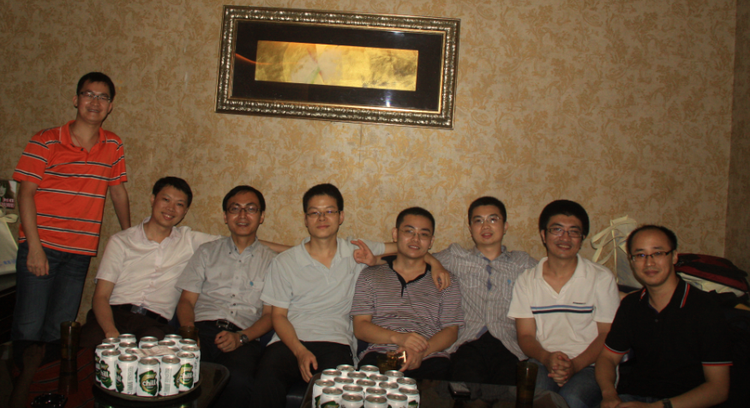
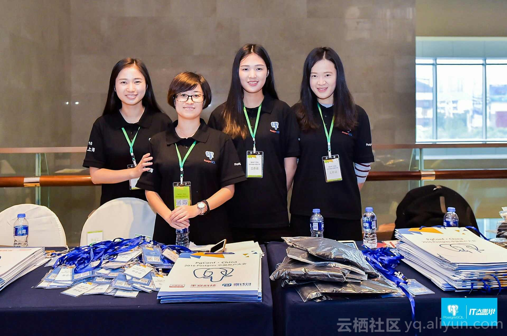

## 我和大象 - 感恩、感谢、加油、腾飞
              
### 作者              
digoal              
              
### 日期              
2018-03-22              
              
### 标签              
PostgreSQL , OSCAR     
              
----              
              
## 背景        
http://www.idcquan.com/Special/OSCAR2018/index.html  
  
由中国信息通信研究院主办、中国通信标准化协会支持的"OSCAR云计算开源产业大会"于2018年3月21日－22日在国家会议中心举行。  
  
非常有幸获得了“OSCAR尖峰开源人物”奖项。  
  
  
  
奖项不敢自居，荣誉属于所有为开源PG社区作出贡献的大象们。  
  
## 回眸青春10年  
  
- 时间调回2006年。当时有一个非常火的学习网站：播布客，里面有很多免费的学习视频，Linux, Oracle等。我就是从那时开始接触数据库的，看视频、看官方文档、做实验、反复试错、到后来的现学现卖，视频录制。（感谢上天安排，当时工作自由时间非常多，另外喜得一子，老婆回家带娃去了，独自一人在杭，把所有时间都花在了学校上面。）  
  
- 2007，打开分享之门（现学现卖，录制了一些Oracle的学习视频，感谢播布客网站，应该是第一个免费传播IT技术的网站）。  
  
- 2008，邂逅PostgreSQL。这是我换工作的那1年，面试时领导问我知不知道什么是PostgreSQL愿不愿意来搞PG，我一脸懵逼（因为当时只是自学了一些Oracle），然后他解释说PG坏了一个节点，数据库可以继续工作（就是当时skype开源的PLproxy代理，实现的PG分布式数据库架构，真的很可惜这个方案没能在国内推广起来）。  
  
  后来得知当时雅虎在使用PostgreSQL，修改PG的源码版，支撑了雅虎的搜索引擎。而当时领导也与雅虎中国的技术老大何伟平老师神交已久，在新项目中选型了PG数据库，就这样把我“忽悠”进去了。事实证明这个选择是没错的，有Oracle的基础，对于学习PostgreSQL非常有帮助（当然个人的努力必不可少）。2012年左右公司所有的数据库（包括核心库在内）全部从Oracle迁移到了PostgreSQL（总算没有耽误公司在纳斯达克上市的审计）。  
  
- 2011，带着PG的浓浓学院风，在美丽的暨南大学，成立了PostgreSQL中国社区。懵懵懂懂成为PG社区创始人之一。（一群有情有义的年轻人在暨南大学举办了第一次PG中国社区用户会，宣布PG中国社区成立。第一届PG社区主席Galy自掏腰包办的会议，有情怀。）  
  
     
   
    
  
- 2015，加入阿里云，云端开源数据库百花齐放，PG成为其中一员。  
  
  [“RDS PostgreSQL”](https://www.aliyun.com/product/rds/postgresql)  
  
  [“PG Oracle兼容版 - PPAS”](https://www.aliyun.com/product/rds/ppas)  
  
  [“PG MPP OLAP版本 HDB PG”](https://www.aliyun.com/product/gpdb)  
  
- 一些小小的贡献  
  
  从加入成立PG社区开始，组织了一些分享会议，撰写了一些技术文章（[github: digoal](https://github.com/digoal/blog/blob/master/README.md)）（书籍正在筹划中）  
  
    
  
    
  
  在QQ、微信、邮箱渠道帮助网友、企业解决了一些技术问题。我依旧会开放我的微信，欢迎有任何PG的问题与我交流。  
  
    
  
  参加各种IT媒体的分享活动，翻译一些国外技术文档。  
  
  输出了一些在线、线下的培训和视频。  
  
所有这些都离不开公司、领导、社会各界、朋友和家人的支持。感谢你们。  
  
## PG社区的大变化  
2011年开始，社区坚持每年举办一次全国大会，经过社区众大象们的努力，一年比一年红火。  
  
- 规模，从2011，60人。到2016，400现场  +  2000在线。  
  
- 组织结构，从2011，7人核心组。到2016，媒体、会务、翻译、微信、微博推广、常委、主席、分舵的成立。  
  
- 参会者，从2011，爱好者，数据库公司。到2016，爱好者，企业，高校，数据库公司，数据库支持公司，行业软件开发商、云厂商。  
  
- 形式，从2011，全国大会、bbs。到2017，全国大会、象行中国，象牙塔校园行，公益培训，在线分享、视频、公众号、微博、BBS。  
  
- 2015，PG中国社区大学成立，有幸成为第一届“校长”。任重道远，努力，加油!   
  
    
  
- 2017，中国开源软件推进联盟PG分会成立，意味着PG中国社区成功进入组织了。  
  
    
  
在所有PGer的努力之下，社区发生了翻天覆地的变化。  
  
相信2018 ~ 未来，开源会改变世界。加油大象，腾飞吧。  
  
  
  
## 活动图片  
  
### 1、历届PG全国大会图片  
  
  
  
  
  
  
  
  
  
  
  
### 2、一些线下沙龙图片  
  
  
  
  
  
### 3、一些象牙塔活动图片  
  
  
   
### 4、一年比一年火爆的云栖大会PG专场  
  
  
  
  
  
  
  
## 可爱的PGer们  
感谢PG社区背后的企业、个人、高校、媒体等。  
  
### 1、翻译英文书籍的泥鳅、Francs  
  
  
  
### 2、PostgreSQL 中文文档翻译志愿者们  
  
https://github.com/postgres-cn/pgdoc-cn  
  
最辛苦的是提供第一版中文官方文档的何伟平(laser)老师  
  
### 3、可爱的志愿者们，每一次活动，都离不开志愿者们的帮助  
  
  
  
### 4、漂亮又爱学习PG的妹纸们，这么多漂亮妹子，你还有什么理由不来和大象一起玩耍呢。  
  
  
  
  
   
### 5、为了PG社区操碎了心的主席 少聪   
   
  
  
  
  
## PG背后的代码贡献者们  
PostgreSQL的发展离不开核心的代码贡献者们，为他们点赞。  
  
https://www.postgresql.org/community/contributors/  
  
  
  
PG社区2006年的全球峰会大合照，有没有发现我们武汉大学的彭老师也在里面，第一位将PostgreSQL引入大学数据库教科书<PostgreSQL 数据库内核分析>的前辈。   
   
向他们致敬。   
  
## 参考  
  
### 1、阿里云PostgreSQL生态系列产品小广告  
  
[“RDS PostgreSQL”](https://www.aliyun.com/product/rds/postgresql)  
  
[“PG Oracle兼容版 - PPAS”](https://www.aliyun.com/product/rds/ppas)  
  
[“PG MPP OLAP版本 HDB PG”](https://www.aliyun.com/product/gpdb)  
  
### 2、PG大学(象牙塔)公益培训活动，不定期展开，请关注PG社区公众号。  
  
  
  
### 3、PG认证考试（兼容Oracle版本PPAS、以及社区版本均有认证。）    
  
https://www.enterprisedb.com/training/postgres-certification  
  
### 4、PG资料分享(PostgreSQL作为开源的全栈数据库，在Oracle兼容性，空间数据管理、OLTP+OLAP复杂场景等方面能力出众，大量案例、实践等你来开启。)  
  
[《PG资料大全PDF》](../201801/20180121_01.md)    
  
实际上，它只是PG武功秘籍的目录啦^_^.    
  
  
  
### 5、[我的GIT](https://github.com/digoal/blog/blob/master/README.md)  
  
呼吁更多的技术人，拥抱开源，开放心态，多多分享。  
  
公益是一辈子的事，I'm digoal, JUST DO IT。  
  
  
  
