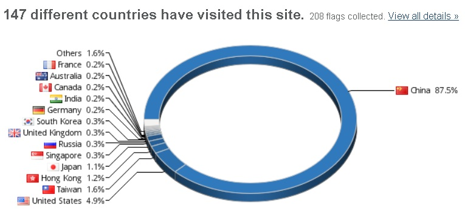
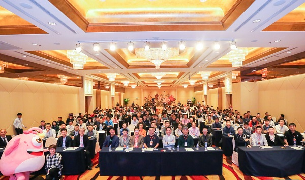
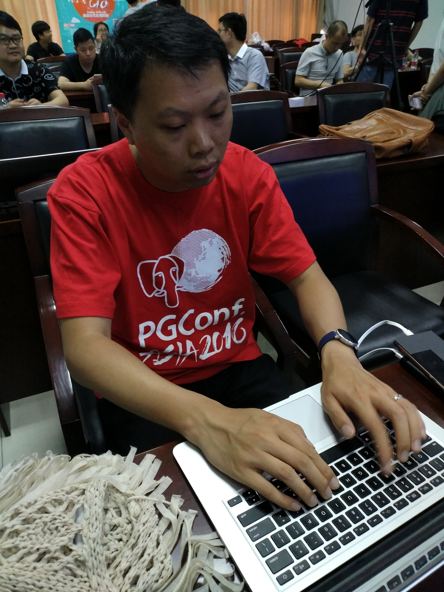

## 我和大象 - 感恩、感谢、加油、腾飞  
                
### 作者                
digoal                
                
### 日期                
2018-03-22                
                
### 标签                
PostgreSQL , OSCAR       
                
----                
                
## 背景          
http://www.idcquan.com/Special/OSCAR2018/index.html    
    
由中国信息通信研究院主办、中国通信标准化协会支持的"OSCAR云计算开源产业大会"于2018年3月21日－22日在国家会议中心举行。    
    
非常有幸获得了“OSCAR尖峰开源人物”奖项。    
    
    
    
奖项不敢自居，荣誉属于所有为开源PG社区作出贡献的大象们。    
    
## 回眸青春10年    
    
- 时间调回2006年。当时有一个非常火的学习网站：播布客，里面有很多免费的学习视频，Linux, Oracle等。我就是从那时开始接触数据库的，看视频、看官方文档、做实验、反复试错、到后来的现学现卖，视频录制。（感谢上天安排，当时工作自由时间非常多，另外喜得一子，老婆回家带娃去了，独自一人在杭，把所有时间都花在了学习上面。）    
    
- 2007，打开分享之门（现学现卖，录制了一些Oracle的学习视频，感谢播布客网站，应该是第一个免费传播IT技术的网站）。    
    
- 2008，邂逅PostgreSQL。这是我换工作的那1年，面试时领导问我知不知道什么是PostgreSQL愿不愿意来搞PG，我一脸懵逼（因为当时只是自学了一些Oracle），然后他解释说PG坏了一个节点，数据库可以继续工作（就是当时skype开源的PLproxy代理，实现的PG分布式数据库架构，真的很可惜这个方案没能在国内推广起来）。    
    
  后来得知当时雅虎在使用PostgreSQL，修改PG的源码版，支撑了雅虎的搜索引擎。而当时领导也与雅虎中国的技术老大何伟平老师神交已久，在新项目中选型了PG数据库，就这样把我“忽悠”进去了。事实证明这个选择是没错的，有Oracle的基础，对于学习PostgreSQL非常有帮助（当然个人的努力必不可少）。2012年左右公司所有的数据库（包括核心库在内）全部从Oracle迁移到了PostgreSQL（总算没有耽误公司在纳斯达克上市的审计）。    
    
- 2011，带着PG的浓浓学院风，在美丽的暨南大学，成立了PostgreSQL中国社区。懵懵懂懂成为PG社区创始人之一。（一群有情有义的年轻人在暨南大学举办了第一次PG中国社区用户会，宣布PG中国社区成立。第一届PG社区主席Galy自掏腰包办的会议，有情怀。）    
    
       
     
      
    
- 2015，加入了 [褚霸](http://blog.yufeng.info/) 带领的阿里云全球顶级数据库团队（ 霸爷的口头禅是这样的：[祝玩得开心](http://blog.yufeng.info/) ），云端开源数据库百花齐放，PG成为其中一员。RDS PG内核团队兄弟们给力，PG云化后，维护成本大幅降低。15年开始在阿里内部普及PG，把PG推广到各个BU。由于PG的特性可以TOUCH到业务的痛点，15年开始到17年，在大部分BU都有了PG的客户（高德、淘宝、天猫、阿里云、优酷、阿里妈妈、B2B、新零售、公共平台、安全部、飞猪、YUNOS、物联网、智慧城市、蚂蚁、菜鸟、未来酒店、等等。。。技术为业务服务，PG开始在各个业务线使用）。功能点覆盖到全文检索、ADHoc的复杂查询（任意字段过滤）、基于OSS的冷热存储分离、时空数据搜索、时序、流计算、用户画像、图式关系搜索、导航、等场景。      
    
  RDS PG内核团队兄弟们就是给力，除了RDS PG，我们还推出了Greenplum开源版本GPDB在云端的版本[“PG MPP OLAP版本 HDB PG”](https://www.aliyun.com/product/gpdb) , PostgreSQL兼容Oracle的商用版本[“PG Oracle兼容版 - PPAS”](https://www.aliyun.com/product/rds/ppas) 。 计算存储分离版本PolarDB for PostgreSQL。  
    
  [“RDS PostgreSQL”](https://www.aliyun.com/product/rds/postgresql)    
    
  [“PG Oracle兼容版 - PPAS”](https://www.aliyun.com/product/rds/ppas)    
    
  [“PG MPP OLAP版本 HDB PG”](https://www.aliyun.com/product/gpdb)    
  
  PG在阿里的推广离不开内核团队小伙伴们的给力支持。    
    
- 一些小小的贡献    
    
  从加入成立PG社区开始，组织了一些分享会议，撰写了一些技术文章（[github: digoal](https://github.com/digoal/blog/blob/master/README.md)）（书籍正在筹划中）    
    
      
    
      
    
  在QQ、微信、邮箱渠道帮助网友、企业解决了一些技术问题。我依旧会开放我的微信，欢迎有任何PG的问题与我交流。    
    
      
    
  参加各种IT媒体的分享活动，翻译一些国外技术文档。    
    
  输出了一些在线、线下的培训和视频。（PG大学(象牙塔)公益培训）    
     
  沉淀了一些PG的解决方案，推动了PG在金融、传统企业、互联网、电商、政府、物流、娱乐等行业的落地。    
    
所有这些都离不开公司、领导、社会各界、朋友和家人的支持。感谢你们。    
  
**接下来，继续努力，比如把象牙塔搞好，把PG的认证搞起来，提炼更多的PG案例（比如在Oracle兼容性方面、空间数据处理方面），让PG技术普及起来，为业务服务，产生更大的社会价值。**  
    
## PG社区的大变化    
2011年开始，社区坚持每年举办一次全国大会，经过社区众大象们的努力，一年比一年红火。    
    
- 规模，从2011，60人。到2016，400现场  +  2000在线。    
    
- 组织结构，从2011，7人核心组。到2016，媒体、会务、翻译、微信、微博推广、常委、主席、分舵的成立。    
    
- 参会者，从2011，爱好者，数据库公司。到2016，爱好者，企业，高校，数据库公司，数据库支持公司，行业软件开发商、云厂商。    
    
- 形式，从2011，全国大会、bbs。到2017，全国大会、象行中国，象牙塔校园行，公益培训，在线分享、视频、公众号、微博、BBS、微信群、QQ群等(希望加入PG技术交流微信群的同学，可以联系我)。    
    
- 2015，PG中国社区大学成立，有幸成为第一届“校长”。任重道远，努力，加油!     
    
      
    
- 2017，中国开源软件推进联盟PG分会成立，意味着PG中国社区成功进入组织了。    
    
      
    
在所有PGer的努力之下，社区发生了翻天覆地的变化。    
    
相信2018 ~ 未来，开源会改变世界。加油大象，腾飞。    
    
    
    
## 活动图片    
    
### 1、历届PG全国大会图片    
    
    
    
    
    
    
    
    
    
    
    
### 2、一些线下沙龙图片    
    
    
    
    
    
### 3、一些象牙塔活动图片    
    
    
  
  
     
### 4、一年比一年火爆的云栖大会PG专场    
    
    
    
    
    
    
  
### 5、内容一年比一年多元化  
除了咱们PG生态的分享，也得到了众多兄弟社区GPDB社区、[蟑螂数据库社区](https://www.cockroachlabs.com/)、MONGO社区、REDIS社区、MYSQL社区的支持。  
    
## 可爱的PGer们    
感谢PG社区背后的企业、个人、高校、媒体等。    
    
### 1、翻译英文书籍的泥鳅、Francs    
    
    
    
### 2、PostgreSQL 中文文档翻译志愿者们    
    
https://github.com/postgres-cn/pgdoc-cn    
    
最辛苦的是提供第一版中文官方文档的何伟平(laser)老师    
    
### 3、每一次活动，都离不开志愿者们的帮助    
    
    
    
### 4、漂亮又爱学习PG的妹纸们，这么多漂亮妹子，你还有什么理由不来和大象一起玩耍呢。    
    
    
    
    
     
### 5、为了PG社区操碎了心的主席 少聪     
     
    
    
    
  
主席在百忙之中，坚持每周发布的 [PG云栖周刊](https://yq.aliyun.com/publication/8)。 快来订阅。   
     
### 6、维护PG微博、微信公众号、BBS、微信群、QQ群的帅哥美女们。    
    
感谢Francs, 媛媛, 阿弟以及背后的志愿者团队。     
  
### 7、各个PG分舵  
    
## PG背后的代码贡献者们    
PostgreSQL的发展离不开核心的代码贡献者们，为他们点赞。    
    
https://www.postgresql.org/community/contributors/    
    
    
    
PG社区2006年的全球峰会大合照，有没有发现我们武汉大学的彭老师也在里面，第一位将PostgreSQL引入大学数据库教科书<PostgreSQL 数据库内核分析>的前辈。     
     
向他们致敬。     
    
## 参考    
    
### 1、阿里云PostgreSQL生态系列产品小广告    
    
[“RDS PostgreSQL”](https://www.aliyun.com/product/rds/postgresql)    
    
[“PG Oracle兼容版 - PPAS”](https://www.aliyun.com/product/rds/ppas)    
  
配合ADAM，从Oracle迁移PPAS，兼容性评估报告到代码转换、数据增量迁移比对、应用割接，管你多复杂的Oracle库，来个评估报告先。  
  
免费下载使用：  
  
https://www.aliyun.com/product/adam    
    
[“PG MPP OLAP版本 HDB PG”](https://www.aliyun.com/product/gpdb)    
    
### 2、PG大学(象牙塔)公益培训活动，不定期展开，请关注PG社区公众号。    
    
    
    
### 3、[PG认证考试](https://www.enterprisedb.com/training/postgres-certification)   
    
从初级到高级，兼容Oracle版本PPAS、以及社区PostgreSQL版本均有认证。(认证不重要，重要的是系统的学习它。)      
    
    
    
### 4、PG资料分享(PostgreSQL作为开源的全栈数据库，在Oracle兼容性，空间数据管理、OLTP+OLAP复杂场景等方面能力出众，大量案例、实践等你来开启。)    
    
[《PG资料大全PDF》](../201801/20180121_01.md)      
    
它只是PG武功秘籍的目录啦^_^.      
    
    
    
### 5、[我的GIT](https://github.com/digoal/blog/blob/master/README.md)    
    
呼吁更多的技术人，拥抱开源，开放心态，多多分享。    
    
公益是一辈子的事，I'm digoal, JUST DO IT。    
    
    
    
  
  
  
  
  
## [digoal's 大量PostgreSQL文章入口](https://github.com/digoal/blog/blob/master/README.md "22709685feb7cab07d30f30387f0a9ae")
  
