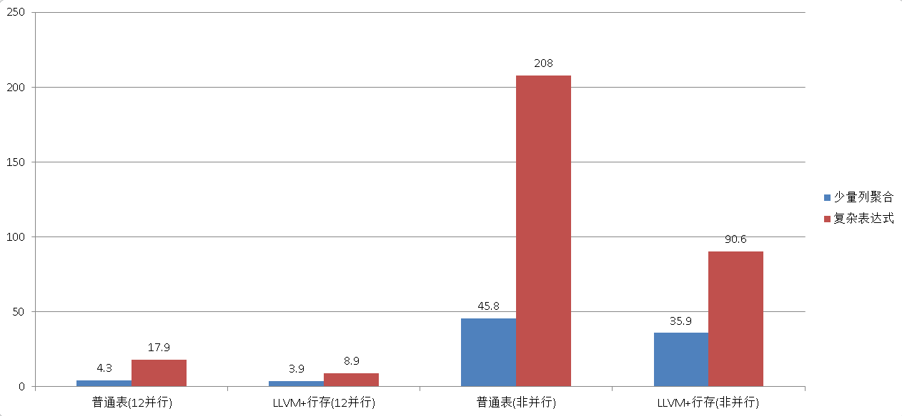

## PostgreSQL 11 preview - JIT接口放开   
              
### 作者              
digoal              
              
### 日期              
2018-03-23              
              
### 标签              
PostgreSQL , LLVM , JIT , 向量计算         
              
----              
              
## 背景         
LLVM对大量数据运算(比如说where条件中过滤大量的数据，聚合计算大量的数据等)的效率提升非常的明显。  
  
  
  
原理参考  
  
[《分析加速引擎黑科技 - LLVM、列存、多核并行、算子复用 大联姻 - 一起来开启PostgreSQL的百宝箱》](../201612/20161216_01.md)    
  
PostgreSQL 11的JIT接口正在进行打磨，完善。借助LLVM，更多的并行计算的完善，PostgreSQL 11又会有一个质的飞越。解决企业OLTP和OLAP混合使用的需求。做到一个产品，解决小事务和大数据量密集计算的混合需求。  
  
https://git.postgresql.org/gitweb/?p=postgresql.git;a=commit;h=2a0faed9d7028e3830998bd6ca900be651274e27  
  
```  
Add expression compilation support to LLVM JIT provider.  
author	Andres Freund <andres@anarazel.de>	  
Tue, 20 Mar 2018 17:20:46 +0800 (02:20 -0700)  
committer	Andres Freund <andres@anarazel.de>	  
Fri, 23 Mar 2018 05:45:59 +0800 (14:45 -0700)  
commit	2a0faed9d7028e3830998bd6ca900be651274e27  
tree	0ab54ad8ac5c5d97d7a4dcee4c2d99c7959af2f6	tree | snapshot  
parent	7ced1d1247286399df53823eb76cacaf6d7fdb22	commit | diff  
Add expression compilation support to LLVM JIT provider.  
  
In addition to the interpretation of expressions (which back  
evaluation of WHERE clauses, target list projection, aggregates  
transition values etc) support compiling expressions to native code,  
using the infrastructure added in earlier commits.  
  
To avoid duplicating a lot of code, only support emitting code for  
cases that are likely to be performance critical. For expression steps  
that aren't deemed that, use the existing interpreter.  
  
The generated code isn't great - some architectural changes are  
required to address that. But this already yields a significant  
speedup for some analytics queries, particularly with WHERE clauses  
filtering a lot, or computing multiple aggregates.  
  
Author: Andres Freund  
Tested-By: Thomas Munro  
Discussion: https://postgr.es/m/20170901064131.tazjxwus3k2w3ybh@alap3.anarazel.de  
  
Disable JITing for VALUES() nodes.  
  
VALUES() nodes are only ever executed once. This is primarily helpful  
for debugging, when forcing JITing even for cheap queries.  
  
Author: Andres Freund  
Discussion: https://postgr.es/m/20170901064131.tazjxwus3k2w3ybh@alap3.anarazel.de  
```  
  
## 参考  
[《分析加速引擎黑科技 - LLVM、列存、多核并行、算子复用 大联姻 - 一起来开启PostgreSQL的百宝箱》](../201612/20161216_01.md)    
  
[《PostgreSQL VOPS 向量计算 + DBLINK异步并行 - 单实例 10亿 聚合计算跑进2秒》](../201802/20180210_01.md)    
  
  
<a rel="nofollow" href="http://info.flagcounter.com/h9V1"  ></a>  
  
  
  
  
  
  
## [digoal's 大量PostgreSQL文章入口](https://github.com/digoal/blog/blob/master/README.md "22709685feb7cab07d30f30387f0a9ae")
  
