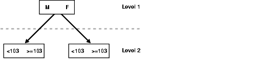

## PostgreSQL Oracle 兼容性之 - INDEX SKIP SCAN (递归查询变态优化) 非驱动列索引扫描优化    
        
### 作者        
digoal        
        
### 日期        
2018-03-23       
        
### 标签        
PostgreSQL , Oracle , index skip scan , 非驱动列条件 , 递归查询 , 子树         
        
----        
        
## 背景       
对于输入条件在复合索引中为非驱动列的，如何高效的利用索引扫描？    
    
在Oracle中可以使用index skip scan来实现这类CASE的高效扫描：    
    
INDEX跳跃扫描一般用在WHERE条件里面没有使用到引导列，但是用到了引导列以外的其他列，并且引导列的DISTINCT值较少的情况。    
    
在这种情况下，数据库把这个复合索引逻辑上拆散为多个子索引，依次搜索子索引中非引导列的WHERE条件里面的值。    
    
使用方法如下:    
    
```    
/*+ INDEX_SS ( [ @ qb_name ] tablespec [ indexspec [ indexspec ]... ] ) */    
```    
    
The INDEX_SS hint instructs the optimizer to perform an index skip scan for the specified table. If the statement uses an index range scan, then Oracle scans the index entries in ascending order of their indexed values. In a partitioned index, the results are in ascending order within each partition.Each parameter serves the same purpose as in "INDEX Hint". For example:    
    
```    
SELECT /*+ INDEX_SS(e emp_name_ix) */ last_name FROM employees e WHERE first_name = 'Steven';    
```    
    
下面是来自ORACLE PERFORMANCE TUNING里的原文：    
    
Index skip scans improve index scans by nonprefix columns. Often, scanning index blocks is faster than scanning table data blocks.    
    
Skip scanning lets a composite index be split logically into smaller subindexes. In skip scanning, the initial column of the composite index is not specified in the query. In other words, it is skipped.    
    
The number of logical subindexes is determined by the number of distinct values in the initial column. Skip scanning is advantageous if there are few distinct values in the leading column of the composite index and many distinct values in the nonleading key of the index.    
    
Example 13-5 Index Skip Scan    
    
Consider, for example, a table     
    
```    
employees(    
sex,     
employee_id,    
address    
)     
```    
    
with a composite index on     
    
```    
(sex, employee_id).     
```    
    
Splitting this composite index would result in two logical subindexes, one for M and one for F.    
    
For this example, suppose you have the following index data:    
    
```    
('F',98)('F',100)('F',102)('F',104)('M',101)('M',103)('M',105)    
```    
    
The index is split logically into the following two subindexes:    
    
The first subindex has the keys with the value F.    
    
The second subindex has the keys with the value M    
    
    
    
The column sex is skipped in the following query:    
    
```    
SELECT * FROM employeesWHERE employee_id = 101;    
```    
    
A complete scan of the index is not performed, but the subindex with the value F is searched first, followed by a search of the subindex with the value M.    
    
## PostgreSQL 非skip scan    
PostgreSQL支持非驱动列的索引扫描，但是需要扫描整个索引。    
    
例子    
    
1、创建测试表    
    
```    
postgres=# create table t(id int, c1 int);    
CREATE TABLE    
```    
    
2、写入1000万测试数据    
    
```    
postgres=# insert into t select random()*1 , id from generate_series(1,10000000) id;    
INSERT 0 10000000    
```    
    
3、创建多列索引    
    
```    
postgres=# create index idx_t on t(id,c1);    
CREATE INDEX    
```    
    
4、非驱动列查询测试如下    
    
### index only scan    
    
```    
postgres=# explain (analyze,verbose,timing,costs,buffers) select * from t where c1=1;    
                                                                QUERY PLAN                                                                     
-------------------------------------------------------------------------------------------------------------------------------------------    
 Index Only Scan using idx_t on public.t  (cost=10000000000.43..10000105164.89 rows=1 width=8) (actual time=0.043..152.288 rows=1 loops=1)    
   Output: id, c1    
   Index Cond: (t.c1 = 1)    
   Heap Fetches: 0    
   Buffers: shared hit=27326    
 Execution time: 152.328 ms    
(6 rows)    
```    
    
### index scan    
    
```    
postgres=# explain (analyze,verbose,timing,costs,buffers) select * from t where c1=1;    
                                                      QUERY PLAN                                                           
-----------------------------------------------------------------------------------------------------------------------    
 Index Scan using idx_t on public.t  (cost=0.43..105165.99 rows=1 width=8) (actual time=0.022..151.845 rows=1 loops=1)    
   Output: id, c1    
   Index Cond: (t.c1 = 1)    
   Buffers: shared hit=27326    
 Execution time: 151.881 ms    
(5 rows)    
```    
    
### bitmap scan    
    
```    
postgres=# explain (analyze,verbose,timing,costs,buffers) select * from t where c1=1;    
                                                       QUERY PLAN                                                           
------------------------------------------------------------------------------------------------------------------------    
 Bitmap Heap Scan on public.t  (cost=105164.88..105166.00 rows=1 width=8) (actual time=151.731..151.732 rows=1 loops=1)    
   Output: id, c1    
   Recheck Cond: (t.c1 = 1)    
   Heap Blocks: exact=1    
   Buffers: shared hit=27326    
   ->  Bitmap Index Scan on idx_t  (cost=0.00..105164.88 rows=1 width=0) (actual time=151.721..151.721 rows=1 loops=1)    
         Index Cond: (t.c1 = 1)    
         Buffers: shared hit=27325    
 Execution time: 151.777 ms    
(9 rows)    
```    
    
### seq scan(全表扫描)    
    
```    
postgres=# explain (analyze,verbose,timing,costs,buffers) select * from t where c1=1;    
                                               QUERY PLAN                                                    
---------------------------------------------------------------------------------------------------------    
 Seq Scan on public.t  (cost=0.00..169248.41 rows=1 width=8) (actual time=0.014..594.535 rows=1 loops=1)    
   Output: id, c1    
   Filter: (t.c1 = 1)    
   Rows Removed by Filter: 9999999    
   Buffers: shared hit=44248    
 Execution time: 594.568 ms    
(6 rows)    
```    
    
使用索引扫，因为不需要FILTER，同时扫描的BLOCK更少，所以性能比全表扫略好。但是还是扫了整个索引的PAGE，所以并不能算skip scan。    
    
那么如何让PostgreSQL支持index skip scan呢？    
    
## PostgreSQL skip scan    
实际上原理和Oracle类似，可以输入驱动列条件，然后按多个条件扫描，这样就能达到SKIP SCAN的效果。（即多颗子树扫描）。    
    
同样也更加适合于驱动列DISTINCT值较少的情况。    
    
用PostgreSQL的递归查询语法可以实现这样的加速效果。这种方法也被用于获取count(distinct), distinct值等。    
    
[《distinct xx和count(distinct xx)的变态递归优化方法 - 索引收敛(skip scan)扫描》](../201611/20161128_02.md)      
    
例如，我们通过这个方法，可以快速的得到驱动列的唯一值    
    
    
```    
with recursive skip as (      
  (      
    select min(t.id) as id from t where t.id is not null      
  )      
  union all      
  (      
    select (select min(t.id) as id from t where t.id > s.id and t.id is not null)       
      from skip s where s.id is not null      
  )  -- 这里的where s.id is not null 一定要加,否则就死循环了.      
)       
select id from skip ;    
```    
    
然后封装到如下SQL，实现skip scan的效果    
    
```    
explain (analyze,verbose,timing,costs,buffers) select * from t where id in    
(    
with recursive skip as (      
  (      
    select min(t.id) as id from t where t.id is not null      
  )      
  union all      
  (      
    select (select min(t.id) as id from t where t.id > s.id and t.id is not null)       
      from skip s where s.id is not null      
  )  -- 这里的where s.id is not null 一定要加,否则就死循环了.      
)       
select id from skip     
) and c1=1    
union all     
select * from t where id is null and c1=1;    
```    
    
或者    
    
```    
explain (analyze,verbose,timing,costs,buffers) select * from t where id = any(array    
(    
with recursive skip as (      
  (      
    select min(t.id) as id from t where t.id is not null      
  )      
  union all      
  (      
    select (select min(t.id) as id from t where t.id > s.id and t.id is not null)       
      from skip s where s.id is not null      
  )  -- 这里的where s.id is not null 一定要加,否则就死循环了.      
)       
select id from skip     
)) and c1=1    
union all     
select * from t where id is null and c1=1;    
```    
    
看执行计划：    
    
效果好多了    
    
```    
    
                                                                                       QUERY PLAN                                                                                            
-----------------------------------------------------------------------------------------------------------------------------------------------------------------------------------------    
 Append  (cost=55.00..215.22 rows=2 width=8) (actual time=0.127..0.138 rows=1 loops=1)    
   Buffers: shared hit=21    
   ->  Nested Loop  (cost=55.00..213.64 rows=1 width=8) (actual time=0.126..0.127 rows=1 loops=1)    
         Output: t.id, t.c1    
         Buffers: shared hit=18    
         ->  HashAggregate  (cost=54.57..55.58 rows=101 width=4) (actual time=0.108..0.109 rows=3 loops=1)    
               Output: skip.id    
               Group Key: skip.id    
               Buffers: shared hit=11    
               ->  CTE Scan on skip  (cost=51.29..53.31 rows=101 width=4) (actual time=0.052..0.102 rows=3 loops=1)    
                     Output: skip.id    
                     Buffers: shared hit=11    
                     CTE skip    
                       ->  Recursive Union  (cost=0.46..51.29 rows=101 width=4) (actual time=0.050..0.099 rows=3 loops=1)    
                             Buffers: shared hit=11    
                             ->  Result  (cost=0.46..0.47 rows=1 width=4) (actual time=0.049..0.049 rows=1 loops=1)    
                                   Output: $1    
                                   Buffers: shared hit=4    
                                   InitPlan 3 (returns $1)    
                                     ->  Limit  (cost=0.43..0.46 rows=1 width=4) (actual time=0.045..0.046 rows=1 loops=1)    
                                           Output: t_3.id    
                                           Buffers: shared hit=4    
                                           ->  Index Only Scan using idx_t on public.t t_3  (cost=0.43..205165.21 rows=10000033 width=4) (actual time=0.045..0.045 rows=1 loops=1)    
                                                 Output: t_3.id    
                                                 Index Cond: (t_3.id IS NOT NULL)    
                                                 Heap Fetches: 0    
                                                 Buffers: shared hit=4    
                             ->  WorkTable Scan on skip s  (cost=0.00..4.88 rows=10 width=4) (actual time=0.015..0.015 rows=1 loops=3)    
                                   Output: (SubPlan 2)    
                                   Filter: (s.id IS NOT NULL)    
                                   Rows Removed by Filter: 0    
                                   Buffers: shared hit=7    
                                   SubPlan 2    
                                     ->  Result  (cost=0.46..0.47 rows=1 width=4) (actual time=0.018..0.019 rows=1 loops=2)    
                                           Output: $3    
                                           Buffers: shared hit=7    
                                           InitPlan 1 (returns $3)    
                                             ->  Limit  (cost=0.43..0.46 rows=1 width=4) (actual time=0.018..0.018 rows=0 loops=2)    
                                                   Output: t_2.id    
                                                   Buffers: shared hit=7    
                                                   ->  Index Only Scan using idx_t on public.t t_2  (cost=0.43..76722.42 rows=3333344 width=4) (actual time=0.017..0.017 rows=0 loops=2)    
                                                         Output: t_2.id    
                                                         Index Cond: ((t_2.id > s.id) AND (t_2.id IS NOT NULL))    
                                                         Heap Fetches: 0    
                                                         Buffers: shared hit=7    
         ->  Index Only Scan using idx_t on public.t  (cost=0.43..1.56 rows=1 width=8) (actual time=0.005..0.005 rows=0 loops=3)    
               Output: t.id, t.c1    
               Index Cond: ((t.id = skip.id) AND (t.c1 = 1))    
               Heap Fetches: 0    
               Buffers: shared hit=7    
   ->  Index Only Scan using idx_t on public.t t_1  (cost=0.43..1.56 rows=1 width=8) (actual time=0.010..0.010 rows=0 loops=1)    
         Output: t_1.id, t_1.c1    
         Index Cond: ((t_1.id IS NULL) AND (t_1.c1 = 1))    
         Heap Fetches: 0    
         Buffers: shared hit=3    
 Execution time: 0.256 ms    
(56 rows)    
```    
    
从150多毫秒，降低到了0.256毫秒    
    
## 数据结构设计优化  
因为通常来说这种数据在关系上来说，我们可以使用外键把这个驱动列剥离出来。     
    
例如驱动列为分组ID，我们再设计一个以分组ID为PK的表。     
    
```  
create table tbl_grp (  
  id int primary key,   
  info text,  
  crt_time timestamp  
);  
  
create table tbl_feedlog (  
  id int8 primary key,  
  gid int references tbl_grp(id),  
  c1 int,  
  info text,  
  crt_time timestamp  
);  
```  
  
创建了一个复合索引，驱动列为GID  
  
```  
create index idx_tbl_feedlog_1 on tbl_feedlog (gid,c1);  
```  
  
非驱动列查询c1，用前面的方法，我们需要写CTE，很长。  
  
现在有了foreign table，我们可以直接用它，遍历驱动列。  
  
```  
select * from tbl_feedlog where c1=100 and gid=any(array(select id from tbl_grp))  
union all  
select * from tbl_feedlog where c1=100 and gid is null;  
```  
  
```  
postgres=# explain select * from tbl_feedlog where c1=100 and gid=any(array(select id from tbl_grp))  
union all  
select * from tbl_feedlog where c1=100 and gid is null;  
                                                QUERY PLAN                                                  
----------------------------------------------------------------------------------------------------------  
 Append  (cost=28.63..34.69 rows=2 width=56)  
   ->  Index Scan using idx_tbl_feedlog_1 on tbl_feedlog  (cost=28.63..32.30 rows=1 width=56)  
         Index Cond: ((gid = ANY ($0)) AND (c1 = 100))  
         InitPlan 1 (returns $0)  
           ->  Bitmap Heap Scan on tbl_grp  (cost=7.18..28.48 rows=1130 width=4)  
                 ->  Bitmap Index Scan on tbl_grp_pkey  (cost=0.00..6.90 rows=1130 width=0)  
   ->  Index Scan using idx_tbl_feedlog_1 on tbl_feedlog tbl_feedlog_1  (cost=0.15..2.37 rows=1 width=56)  
         Index Cond: ((gid IS NULL) AND (c1 = 100))  
(8 rows)  
```  
  
性能验证，完美：  
  
```  
postgres=# insert into tbl_grp select generate_series(0,999);  
INSERT 0 1000  
  
postgres=# insert into tbl_feedlog select id, random()*999, id, 'test', now() from generate_series(1,10000000) t(id);  
postgres=# insert into tbl_feedlog select id, null, id, 'test', now() from generate_series(10000001,10100000) t(id);  
```  
  
4毫秒 vs 200毫秒  
  
```  
优化方法  
  
postgres=# explain (analyze,verbose,timing,costs,buffers) select * from tbl_feedlog where c1=100 and gid=any(array(select id from tbl_grp))  
union all  
select * from tbl_feedlog where c1=100 and gid is null;  
                                                                        QUERY PLAN                                                                           
-----------------------------------------------------------------------------------------------------------------------------------------------------------  
 Append  (cost=26.31..45.11 rows=2 width=29) (actual time=2.239..3.767 rows=1 loops=1)  
   Buffers: shared hit=3035  
   ->  Index Scan using idx_tbl_feedlog_1 on public.tbl_feedlog  (cost=26.31..42.44 rows=1 width=29) (actual time=2.239..3.760 rows=1 loops=1)  
         Output: tbl_feedlog.id, tbl_feedlog.gid, tbl_feedlog.c1, tbl_feedlog.info, tbl_feedlog.crt_time  
         Index Cond: ((tbl_feedlog.gid = ANY ($0)) AND (tbl_feedlog.c1 = 100))  
         Buffers: shared hit=3032  
         InitPlan 1 (returns $0)  
           ->  Index Only Scan using tbl_grp_pkey on public.tbl_grp  (cost=0.28..25.88 rows=1000 width=4) (actual time=0.026..0.245 rows=1000 loops=1)  
                 Output: tbl_grp.id  
                 Heap Fetches: 1000  
                 Buffers: shared hit=9  
   ->  Index Scan using idx_tbl_feedlog_1 on public.tbl_feedlog tbl_feedlog_1  (cost=0.43..2.65 rows=1 width=29) (actual time=0.006..0.006 rows=0 loops=1)  
         Output: tbl_feedlog_1.id, tbl_feedlog_1.gid, tbl_feedlog_1.c1, tbl_feedlog_1.info, tbl_feedlog_1.crt_time  
         Index Cond: ((tbl_feedlog_1.gid IS NULL) AND (tbl_feedlog_1.c1 = 100))  
         Buffers: shared hit=3  
 Planning time: 0.195 ms  
 Execution time: 3.805 ms  
(17 rows)  
  
传统方法  
  
postgres=# explain (analyze,verbose,timing,costs,buffers) select * from tbl_feedlog where c1=100;  
                                                                   QUERY PLAN                                                                     
------------------------------------------------------------------------------------------------------------------------------------------------  
 Index Scan using idx_tbl_feedlog_1 on public.tbl_feedlog  (cost=0.43..133248.85 rows=1 width=29) (actual time=107.331..199.335 rows=1 loops=1)  
   Output: id, gid, c1, info, crt_time  
   Index Cond: (tbl_feedlog.c1 = 100)  
   Buffers: shared hit=52088  
 Planning time: 0.164 ms  
 Execution time: 199.366 ms  
(6 rows)  
```  
  
## 内核层面优化    
    
与Oracle做法类似，或者说与递归的做法类似。    
    
使用这种方法来改进优化器，可以达到index skip scan的效果，而且不用改写SQL。    
    
## 参考    
    
[《distinct xx和count(distinct xx)的变态递归优化方法 - 索引收敛(skip scan)扫描》](../201611/20161128_02.md)      
    
<a rel="nofollow" href="http://info.flagcounter.com/h9V1"  ></a>    
  
  
  
  
  
## [digoal's 大量PostgreSQL文章入口](https://github.com/digoal/blog/blob/master/README.md "22709685feb7cab07d30f30387f0a9ae")
  
