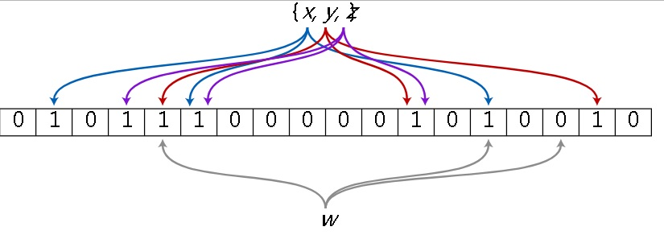

## PostgreSQL 11 preview - BRIN索引接口功能扩展(BLOOM FILTER、min max分段)      
                  
### 作者                  
digoal                  
                  
### 日期                  
2018-03-23                  
                  
### 标签                  
PostgreSQL , brin索引 , bloom filter , min max 分段    
                  
----                  
                  
## 背景             
BRIN索引是PG的一种块索引接口，存储指定连续数据块内被索引字段的元数据。  
  
https://www.postgresql.org/docs/devel/static/brin.html  
  
目前BRIN存储的元数据包括被索引字段在每个指定连续数据块区间的MIN,MAX值。所以对于比较分散的数据实际上效果是很差的，对于数据分布比较有时序属性的（或者说线性相关性很好）的字段，效果特别赞。  
  
[《HTAP数据库 PostgreSQL 场景与性能测试之 24 - (OLTP) 物联网 - 时序数据并发写入(含时序索引BRIN)》](../201711/20171107_25.md)    
  
[《PostgreSQL BRIN索引的pages_per_range选项优化与内核代码优化思考》](../201708/20170824_01.md)    
  
[《万亿级电商广告 - brin黑科技带你(最低成本)玩转毫秒级圈人(视觉挖掘姊妹篇) - 阿里云RDS PostgreSQL, HybridDB for PostgreSQL最佳实践》](../201708/20170823_01.md)    
  
[《PostGIS空间索引(GiST、BRIN、R-Tree)选择、优化 - 阿里云RDS PostgreSQL最佳实践》](../201708/20170820_01.md)    
  
[《自动选择正确索引访问接口(btree,hash,gin,gist,sp-gist,brin,bitmap...)的方法》](../201706/20170617_01.md)    
  
[《PostgreSQL 并行写入堆表，如何保证时序线性存储 - BRIN索引优化》](../201706/20170611_02.md)    
  
[《PostgreSQL 10.0 preview 功能增强 - BRIN 索引更新smooth化》](../201704/20170405_01.md)    
  
[《PostgreSQL 聚集存储 与 BRIN索引 - 高并发行为、轨迹类大吞吐数据查询场景解说》](../201702/20170219_01.md)    
  
[《PostgreSQL 物联网黑科技 - 瘦身几百倍的索引(BRIN index)》](../201604/20160414_01.md)    
  
[《PostgreSQL 9.5 new feature - lets BRIN be used with R-Tree-like indexing strategies For "inclusion" opclasses》](../201505/20150526_01.md)    
  
[《PostgreSQL 9.5 new feature - BRIN (block range index) index》](../201504/20150419_01.md)    
  
目前BRIN存在的可以改进的点：  
  
当数据分布与HEAP存储的 线性相关性很差时，效果不好。如何改进呢？  
  
多段MIN,MAX可能是一个非常有效果的改进方法，举个例子，我们有一个非常大的小区，有很多栋房子，然后每一栋房子我们保存了年龄最小和年龄最大的住户，比如说真实的分布是每栋楼都包含少部分是1-35岁，1个80岁的。  
  
现在要找一位40岁的住户，如果是BRIN索引，会把所有的楼栋都返回给你原因是每栋楼的范围都是1-80岁。  
  
如果使用多段存储，那么应该是1-35, 80。这样的话使用BRIN索引找40岁的住户直接返回0条记录。  
  
1、现在PostgreSQL 11马上要提交的PATCH，就包含了multi min max的优化  
  
https://commitfest.postgresql.org/17/1348/    
  
2、第二个改进是引入了BRIN的BLOOM FILTER，我们知道BLOOM FILTER用少量的BIT位表示某被索引值是否存在，存在则设定这些BIT为1，如果对应的BITS不全为1，则说明没有这条记录。但是为了节约空间，BIT存在冲撞，例如某个值的BITS可能被其他一个或多个值的BITS覆盖。  
  
那么就会出现一种情况，索引告诉你包含某个值，并不一定真的包含。但是索引告诉你不包含某个值，那就肯定不包含。  
   
  
  
所以  
  
```  
select * from tbl where a=? and b=? and c=? or d=?  
```  
  
bloom会告诉你一个较大的结果集，然后再回HEAP表，使用FILTER过滤不满足条件的记录。  
  
https://en.wikipedia.org/wiki/Bloom_filter  
  
https://www.postgresql.org/docs/devel/static/bloom.html  
  
目前使用bloom插件可以创建BLOOM索引，而PostgreSQL 11，会把这个功能加入BRIN索引接口中。  
  
## min max 分段  
这个是POC里面的例子，可以看到使用分段MIN MAX后，BRIN索引的过滤性好了很多。  

PATCH连接  
  
https://commitfest.postgresql.org/17/1348/    
  
https://www.postgresql.org/message-id/flat/c1138ead-7668-f0e1-0638-c3be3237e812@2ndquadrant.com#c1138ead-7668-f0e1-0638-c3be3237e812@2ndquadrant.com  
  
To illustrate the improvement, consider this table:  
  
```  
    create table a (val float8) with (fillfactor = 90);  
    insert into a select i::float from generate_series(1,10000000) s(i);  
    update a set val = 1 where random() < 0.01;  
    update a set val = 10000000 where random() < 0.01;  
```  
  
Which means the column 'val' is almost perfectly correlated with the  
position in the table (which would be great for BRIN minmax indexes),  
but then 1% of the values is set to 1 and 10.000.000. That means pretty  
much every range will be [1,10000000], which makes this BRIN index  
mostly useless, as illustrated by these explain plans:  
  
```  
    create index on a using brin (val) with (pages_per_range = 16);  
  
    explain analyze select * from a where val = 100;  
                                  QUERY PLAN  
    --------------------------------------------------------------------  
     Bitmap Heap Scan on a  (cost=54.01..10691.02 rows=8 width=8)  
                            (actual time=5.901..785.520 rows=1 loops=1)  
       Recheck Cond: (val = '100'::double precision)  
       Rows Removed by Index Recheck: 9999999  
       Heap Blocks: lossy=49020  
       ->  Bitmap Index Scan on a_val_idx  
             (cost=0.00..54.00 rows=3400 width=0)  
             (actual time=5.792..5.792 rows=490240 loops=1)  
             Index Cond: (val = '100'::double precision)  
     Planning time: 0.119 ms  
     Execution time: 785.583 ms  
    (8 rows)  
  
    explain analyze select * from a where val between 100 and 10000;  
                                  QUERY PLAN  
    ------------------------------------------------------------------  
     Bitmap Heap Scan on a  (cost=55.94..25132.00 rows=7728 width=8)  
                      (actual time=5.939..858.125 rows=9695 loops=1)  
       Recheck Cond: ((val >= '100'::double precision) AND  
                      (val <= '10000'::double precision))  
       Rows Removed by Index Recheck: 9990305  
       Heap Blocks: lossy=49020  
       ->  Bitmap Index Scan on a_val_idx  
             (cost=0.00..54.01 rows=10200 width=0)  
             (actual time=5.831..5.831 rows=490240 loops=1)  
             Index Cond: ((val >= '100'::double precision) AND  
                          (val <= '10000'::double precision))  
     Planning time: 0.139 ms  
     Execution time: 871.132 ms  
    (8 rows)  
```  
  
Obviously, the queries do scan the whole table and then eliminate most  
of the rows in "Index Recheck". Decreasing pages_per_range does not  
really make a measurable difference in this case - it eliminates maybe  
10% of the rechecks, but most pages still have very wide minmax range.  
  
With the patch, it looks about like this:  
  
```  
    create index on a using brin (val float8_minmax_multi_ops)  
                            with (pages_per_range = 16);  
  
    explain analyze select * from a where val = 100;  
                                  QUERY PLAN  
    -------------------------------------------------------------------  
     Bitmap Heap Scan on a  (cost=830.01..11467.02 rows=8 width=8)  
                            (actual time=7.772..8.533 rows=1 loops=1)  
       Recheck Cond: (val = '100'::double precision)  
       Rows Removed by Index Recheck: 3263  
       Heap Blocks: lossy=16  
       ->  Bitmap Index Scan on a_val_idx  
             (cost=0.00..830.00 rows=3400 width=0)  
             (actual time=7.729..7.729 rows=160 loops=1)  
             Index Cond: (val = '100'::double precision)  
     Planning time: 0.124 ms  
     Execution time: 8.580 ms  
    (8 rows)  
  
  
    explain analyze select * from a where val between 100 and 10000;  
                                 QUERY PLAN  
    ------------------------------------------------------------------  
     Bitmap Heap Scan on a  (cost=831.94..25908.00 rows=7728 width=8)  
                        (actual time=9.318..23.715 rows=9695 loops=1)  
       Recheck Cond: ((val >= '100'::double precision) AND  
                      (val <= '10000'::double precision))  
       Rows Removed by Index Recheck: 3361  
       Heap Blocks: lossy=64  
       ->  Bitmap Index Scan on a_val_idx  
             (cost=0.00..830.01 rows=10200 width=0)  
             (actual time=9.274..9.274 rows=640 loops=1)  
             Index Cond: ((val >= '100'::double precision) AND  
                          (val <= '10000'::double precision))  
     Planning time: 0.138 ms  
     Execution time: 36.100 ms  
    (8 rows)  
```  
  
## bloom filter  
  
https://www.postgresql.org/docs/devel/static/bloom.html  
  
## 参考    
    
https://commitfest.postgresql.org/17/1348/    
  
https://www.postgresql.org/message-id/flat/c1138ead-7668-f0e1-0638-c3be3237e812@2ndquadrant.com#c1138ead-7668-f0e1-0638-c3be3237e812@2ndquadrant.com  
  
  
<a rel="nofollow" href="http://info.flagcounter.com/h9V1"  ></a>  
  
  
  
  
  
  
## [digoal's 大量PostgreSQL文章入口](https://github.com/digoal/blog/blob/master/README.md "22709685feb7cab07d30f30387f0a9ae")
  
