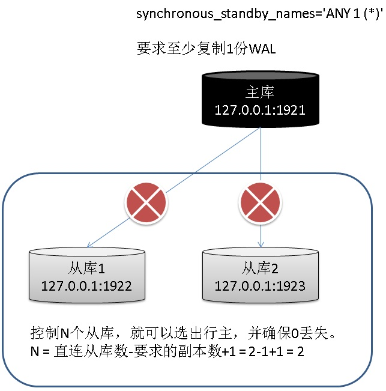
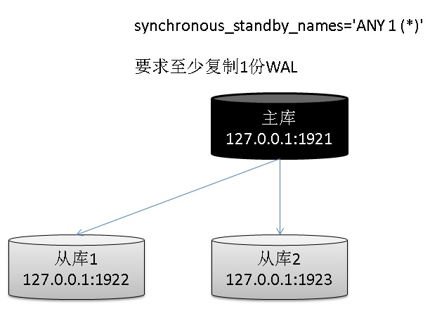
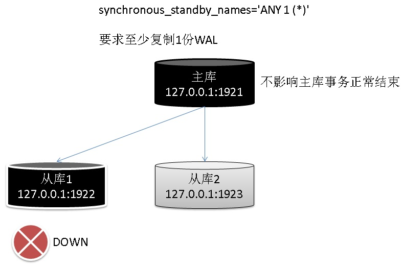
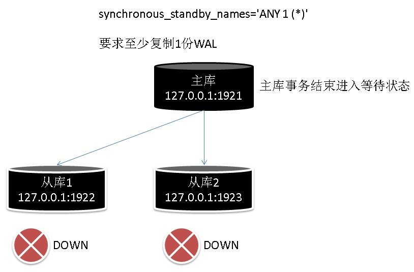
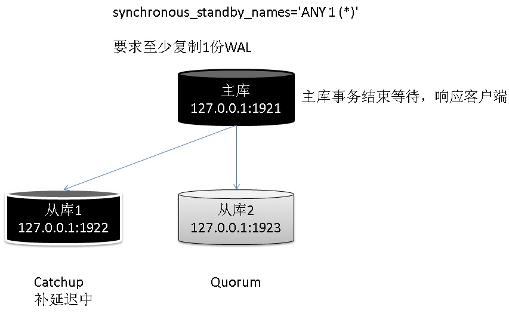
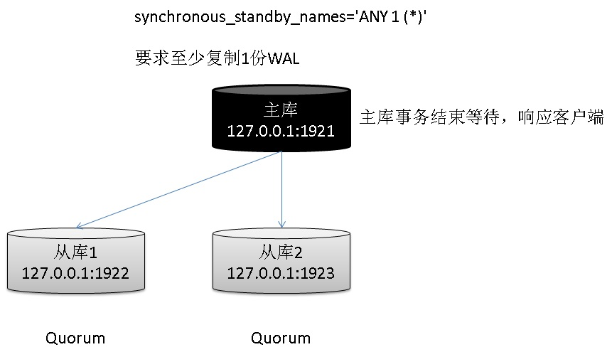
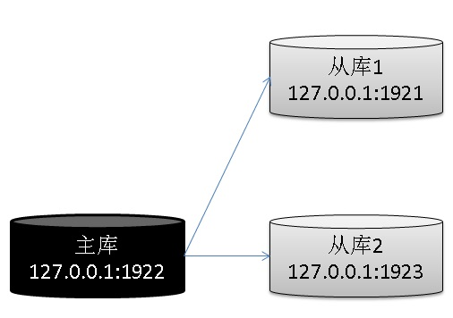
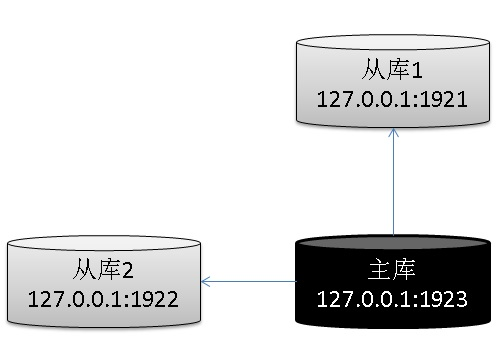
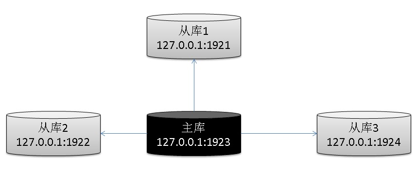
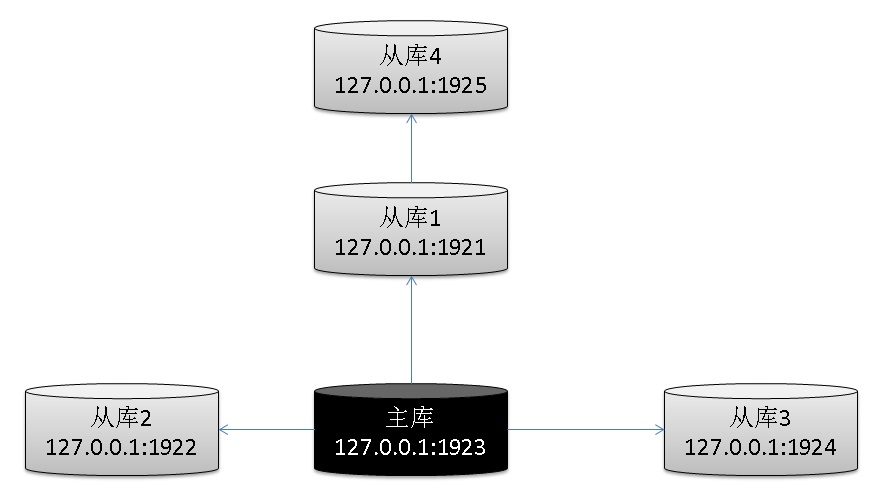

## PostgreSQL 一主多从(多副本,强同步)简明手册 - 配置、压测、监控、切换、防脑裂、修复、0丢失 - 珍藏级 
                            
### 作者                            
digoal                            
                            
### 日期                            
2018-03-25                            
                            
### 标签                            
PostgreSQL , 多副本 , 一主多从 , 流复制        
                            
----                            
                            
## 背景     
PostgreSQL物理流复制有几个特点  
  
1、延迟及低，毫不畏惧大事务  
  
2、支持断点续传  
  
3、支持多副本  
  
4、配置简单，看本文  
  
5、备库与主库物理完全一致，并支持只读  
  
所以大多数用户都会使用流复制来搭建只读备库，容灾，备份节点，HA等。  
  
本文主要介绍一下PostgreSQL一主多从的配置，以及多副本强同步的配置。  
  
## 1 准备硬件环境  
假设我们需要构建一个1主2备的环境，那么需要3台主机。如果你需要用这个环境来实现高可用，则有几种方案。  
  
1、PROXY或DNS方案  
  
PROXY或DNS需要另外准备，这里不多说，目的就是让DNS连接到  
  
2、VIP漂移方案  
  
不管用哪套方案，只要做HA，就需要仲裁，即管理整个集群的节点。它主要负责切换主节点，漂移VIP或通知PROXY\DNS指向新主节点。  
  
  
3、如果做到0丢失，防脑裂。(我们需要一个约定，只要客户端还没有收到事务结束的状态，这个事务是unknown的，也就是说回滚或者已提交都是可以接受的。)  
  
只要控制了大于或等于（一会PG中参数指定“同步备库数 - 同步副本数 + 1”）个节点，再选择新的主节点(选出它们中WAL位点最新的作为新主节点)，则绝对不可能出现脑裂的问题，也不会丢失数据。  
  
[《PG多节点(quorum based), 0丢失 HA(failover,switchover)方案》](../201706/20170612_02.md)    
  
  
  
例如：  
  
```  
总共有5个从库，如果配置如下  
  
synchronous_standby_names = 'ANY 2 (*)'  
  
那么需要控制 5-2+1=4个或以上从库，如果需要切换，就可以认为绝对不会出现脑裂或丢数据的情况。  
  
因为冻结了4个从库后，主库剩下的从库只有1个，就无法满足2个副本，所以不可能再提交并返回用户事务状态。  
  
目前只能冻结从库的replay，无法冻结receiver  
 pg_catalog | pg_wal_replay_pause           | void                     |                     | normal  
 pg_catalog | pg_wal_replay_resume          | void                     |                     | normal  
如果可以直接冻结receiver就完美了，切换时很好用  
```  
  
我们把重点放在如何构建一种多从，如何设置多副本强同步上。  
  
硬件：  
  
3台物理机，万兆互联，同一局域网最好，如果你要做跨机房容灾，就不要在乎同一局域网了（只要保证足够大的带宽可以实现主备流复制的延迟较低就可以）。  
  
由于我这里写文档用的是测试环境，用单台虚拟机(56核，224GB MEM，3TB DISK)代替，读者请关注监听端口，不同的端口代表不同的库。（在三主机中，根据本文的配置，更换一下IP+PORT即可）  
  
  
  
```  
主库     127.0.0.1 : 1921  
从库1    127.0.0.1 : 1922  
从库2    127.0.0.1 : 1923  
```  
  
## 2 准备软件环境  
CentOS 7.x x64  
  
PostgreSQL 10  
  
可以参考如下任意文档进行部署  
  
[《PostgreSQL 10 + PostGIS + Sharding(pg_pathman) + MySQL(fdw外部表) on ECS 部署指南(适合新用户)》](../201710/20171018_01.md)    
  
[《PostgreSQL on Linux 最佳部署手册》](../201611/20161121_01.md)    
  
准备两个大目录，分别存放数据文件和WAL REDO文件.  
  
```  
/dev/vdc1       1.5T  554G  902G  39% /data02   # wal redo  
/dev/vdb1       1.5T  275G  1.2T  19% /data01   # datafile  
```  
  
```  
mkdir /data01/pg  
mkdir /data02/pg  
chown postgres:postgres /data01/pg  
chown postgres:postgres /data02/pg  
```  
  
如果你是在三台物理机上部署，请确保三台物理机之间可以相互访问它们的数据库监听端口。（否则怎么基于网络做流复制呀.）  
  
## 3 初始化主库  
1、创建一个配置文件，方便我们切换主备的连接环境。  
  
```  
su - postgres  
  
vi env.sh  
  
export PS1="$USER@`/bin/hostname -s`-> "    
export PGPORT=$1  
# export PGPORT=1921  
export PGDATA=/data01/pg/pg_root$PGPORT    
export LANG=en_US.utf8    
export PGHOME=/usr/pgsql-10  
export LD_LIBRARY_PATH=$PGHOME/lib:/lib64:/usr/lib64:/usr/local/lib64:/lib:/usr/lib:/usr/local/lib:$LD_LIBRARY_PATH    
export DATE=`date +"%Y%m%d%H%M"`    
export PATH=$PGHOME/bin:$PATH:.    
export MANPATH=$PGHOME/share/man:$MANPATH    
export PGHOST=$PGDATA    
export PGUSER=postgres    
export PGDATABASE=postgres    
alias rm='rm -i'    
alias ll='ls -lh'    
unalias vi   
```  
  
2、连接到主库，初始化数据库  
  
```  
su - postgres  
. ./env.sh 1921  
  
initdb -D $PGDATA -U postgres -E UTF8 --locale=en_US.utf8 -X /data02/pg/pg_wal_$PGPORT  
```  
  
## 4 配置主库  
```  
su - postgres  
. ./env.sh 1921  
```  
  
1、配置postgresql.conf  
  
```  
vi $PGDATA/postgresql.conf  
  
修改如下配置  
  
listen_addresses = '0.0.0.0'  
port = 1921   ## 主库监听端口  
max_connections = 5000  
superuser_reserved_connections = 13  
unix_socket_directories = '.'  
tcp_keepalives_idle = 60  
tcp_keepalives_interval = 10  
tcp_keepalives_count = 10  
shared_buffers = 24GB  
huge_pages = try  
work_mem = 4MB  
maintenance_work_mem = 1GB  
dynamic_shared_memory_type = posix  
shared_preload_libraries = 'pg_stat_statements'  
vacuum_cost_delay = 0  
bgwriter_delay = 10ms  
bgwriter_lru_maxpages = 1000  
bgwriter_lru_multiplier = 5.0  
effective_io_concurrency = 0  
max_worker_processes = 128  
wal_level = replica  
synchronous_commit = remote_write  
full_page_writes = on  
wal_buffers = 64MB  
wal_writer_delay = 10ms  
checkpoint_timeout = 30min  
max_wal_size = 48GB  
min_wal_size = 12GB  
checkpoint_completion_target = 0.1  
archive_mode = on  
archive_command = '/bin/date'  
max_wal_senders = 8  
wal_keep_segments = 4096  
wal_sender_timeout = 15s  
hot_standby = on  
max_standby_archive_delay = 600s  
max_standby_streaming_delay = 600s  
wal_receiver_status_interval = 1s  
hot_standby_feedback = off  
wal_receiver_timeout = 30s  
wal_retrieve_retry_interval = 5s  
random_page_cost = 1.1  
log_destination = 'csvlog'  
logging_collector = on  
log_directory = 'log'  
log_filename = 'postgresql-%a.log'  
log_truncate_on_rotation = on  
log_rotation_age = 1d  
log_rotation_size = 0  
log_checkpoints = on  
log_connections = on  
log_disconnections = on  
log_error_verbosity = verbose  
log_line_prefix = '%m [%p] '  
log_lock_waits = on  
log_statement = 'ddl'  
log_timezone = 'PRC'  
autovacuum = on  
log_autovacuum_min_duration = 0  
autovacuum_max_workers = 8  
autovacuum_freeze_max_age = 950000000  
autovacuum_multixact_freeze_max_age = 1100000000  
autovacuum_vacuum_cost_delay = 0  
datestyle = 'iso, mdy'  
timezone = 'PRC'  
lc_messages = 'en_US.utf8'  
lc_monetary = 'en_US.utf8'  
lc_numeric = 'en_US.utf8'  
lc_time = 'en_US.utf8'  
default_text_search_config = 'pg_catalog.english'  
# wal_log_hints = on    # 如果你需要用pg_rewind修复WAL的时间线差异, 需要开启它, 但是开启它会导致写wal变多, 请斟酌
```  
  
2、启动主库  
  
```  
pg_ctl start  
```  
  
3、创建流复制角色  
  
```  
psql  
psql (10.3)  
Type "help" for help.  
  
postgres=# create role rep login encrypted password 'REpliCa12343231_-1!' replication;  
CREATE ROLE  
```  
  
4、配置数据库防火墙pg_hba.conf  
  
```  
vi $PGDATA/pg_hba.conf  
  
追加到配置文件末尾  
  
# 多主机应该这样配置, 如果你在可信任网络中，也可以配置为truse代替md5，那么就不需要密码认证了  
# host replication rep 主机1IP/32 md5  
# host replication rep 主机2IP/32 md5  
# host replication rep 主机3IP/32 md5  
  
# 我的测试环境配置  
host replication rep 127.0.0.1/32 md5  
host all all 0.0.0.0/0 md5  
```  
  
5、使配置生效  
  
```  
pg_ctl reload  
server signaled  
```  
  
6、生成流复制配置模板  
  
```  
cp $PGHOME/share/recovery.conf.sample $PGDATA/  
cd $PGDATA  
mv recovery.conf.sample recovery.done  
  
vi recovery.done  
  
recovery_target_timeline = 'latest'  
standby_mode = on  
primary_conninfo = 'host=127.0.0.1 port=1921 user=rep password=REpliCa12343231_-1!'  
# host 主库ip, port 主库监听端口, user 流复制用户名, password 流复制角色rep的密码  
```  
  
## 5 创建流复制从库1  
  
```  
su - postgres  
. ./env.sh 1922  
```  
  
1、使用流复制用户创建从库1  
  
```  
pg_basebackup -D /data01/pg/pg_root1922 -F p --waldir=/data02/pg/pg_wal_1922 -h 127.0.0.1 -p 1921 -U rep  
Password:   输入rep用户的密码  
WARNING:  skipping special file "./.s.PGSQL.1921"  
```  
  
2、配置postgresql.conf（多主机环境可选项），因为我的测试环境是一台主机启动3个库，需要避免监听端口冲突  
  
```  
cd $PGDATA  
vi postgresql.conf  
port = 1922   
```  
  
3、配置流复制配置文件recovery.conf  
  
```  
cd $PGDATA  
mv recovery.done recovery.conf  
```  
  
4、启动从库1  
  
```  
pg_ctl start  
```  
  
## 6 创建流复制从库2  
  
```  
su - postgres  
. ./env.sh 1923  
```  
  
1、使用流复制用户创建从库2  
  
```  
pg_basebackup -D /data01/pg/pg_root1923 -F p --waldir=/data02/pg/pg_wal_1923 -h 127.0.0.1 -p 1921 -U rep  
Password:   输入rep用户的密码  
WARNING:  skipping special file "./.s.PGSQL.1921"  
```  
  
2、配置postgresql.conf（多主机环境可选项），因为我的测试环境是一台主机启动3个库，需要避免监听端口冲突  
  
```  
cd $PGDATA  
vi postgresql.conf  
port = 1923  
```  
  
3、配置流复制配置文件recovery.conf  
  
```  
cd $PGDATA  
mv recovery.done recovery.conf  
```  
  
4、启动从库2  
  
```  
pg_ctl start  
```  
  
## 7 配置多副本强同步  
1、配置主节点  
  
```  
psql -h 127.0.0.1 -p 1921 -U postgres postgres  
psql (10.3)  
Type "help" for help.  
  
postgres=# alter system set synchronous_standby_names='ANY 1 (*)';  
ALTER SYSTEM  
postgres=# select pg_reload_conf();  
 pg_reload_conf   
----------------  
 t  
(1 row)  
```  
  
2、配置从库1 (这样确保激活从库1后，它也要求多副本强同步)  
  
```  
psql -h 127.0.0.1 -p 1922 -U postgres postgres  
psql (10.3)  
Type "help" for help.  
  
postgres=# alter system set synchronous_standby_names='ANY 1 (*)';  
ALTER SYSTEM  
postgres=# select pg_reload_conf();  
 pg_reload_conf   
----------------  
 t  
(1 row)  
```  
  
3、配置从库2 (这样确保激活从库2后，它也要求多副本强同步)  
  
```  
psql -h 127.0.0.1 -p 1923 -U postgres postgres  
psql (10.3)  
Type "help" for help.  
  
postgres=# alter system set synchronous_standby_names='ANY 1 (*)';  
ALTER SYSTEM  
postgres=# select pg_reload_conf();  
 pg_reload_conf   
----------------  
 t  
(1 row)  
```  
  
## 7 压测，观察主从延迟  
### 1 高并发小事务压测  
创建1024个表，使用merge insert写入200亿数据。      
  
连接到主节点执行如下：  
      
1、建表      
      
```      
do language plpgsql $$      
declare      
begin      
  execute 'drop table if exists test';      
  execute 'create table test(id int8 primary key, info text, crt_time timestamp)';      
        
  for i in 0..1023 loop      
    execute format('drop table if exists test%s', i);      
    execute format('create table test%s (like test including all)', i);      
  end loop;      
end;      
$$;      
```      
  
2、创建动态数据写入函数     
      
```      
create or replace function dyn_pre(int8) returns void as $$      
declare      
  suffix int8 := mod($1,1024);      
begin      
  execute format('execute p%s(%s)', suffix, $1);      
  exception when others then      
    execute format('prepare p%s(int8) as insert into test%s values($1, md5(random()::text), now()) on conflict(id) do update set info=excluded.info,crt_time=excluded.crt_time', suffix, suffix);      
    execute format('execute p%s(%s)', suffix, $1);      
end;      
$$ language plpgsql strict;      
```      
  
3、创建压测脚本，使用merge insert写入200亿数据。       
      
```      
vi test.sql      
      
\set id random(1,20000000000)      
select dyn_pre(:id);      
```      
      
4、写入压测      
      
```      
pgbench -M prepared -n -r -P 1 -f ./test.sql -h 127.0.0.1 -p 1921 -U postgres postgres -c 56 -j 56 -T 1200000      
```   
  
性能如下，（在不使用多副本同步复制（```synchronous_commit = local```）时，性能约8.6万tps，同步复制因为需要等从库的FEED BACK，所以RT有一定的影响。）   
  
```  
progress: 166.0 s, 72845.6 tps, lat 0.769 ms stddev 1.235  
progress: 167.0 s, 71348.9 tps, lat 0.774 ms stddev 1.475  
progress: 168.0 s, 69103.7 tps, lat 0.822 ms stddev 1.912  
progress: 169.0 s, 71369.3 tps, lat 0.785 ms stddev 1.279  
progress: 170.0 s, 71994.7 tps, lat 0.778 ms stddev 1.475  
progress: 171.0 s, 72761.9 tps, lat 0.770 ms stddev 1.260  
progress: 172.0 s, 69511.8 tps, lat 0.806 ms stddev 2.059  
progress: 173.0 s, 71999.7 tps, lat 0.778 ms stddev 1.303  
progress: 174.0 s, 72752.9 tps, lat 0.770 ms stddev 1.392  
progress: 175.0 s, 71915.5 tps, lat 0.776 ms stddev 1.339  
progress: 176.0 s, 73192.6 tps, lat 0.768 ms stddev 1.371  
progress: 177.0 s, 68944.8 tps, lat 0.812 ms stddev 1.821  
progress: 178.0 s, 72611.7 tps, lat 0.771 ms stddev 1.250  
progress: 179.0 s, 72492.1 tps, lat 0.773 ms stddev 1.293  
progress: 180.0 s, 74471.1 tps, lat 0.752 ms stddev 1.216  
progress: 181.0 s, 67790.2 tps, lat 0.826 ms stddev 2.087  
progress: 182.0 s, 72486.8 tps, lat 0.773 ms stddev 1.298  
progress: 183.0 s, 74707.1 tps, lat 0.750 ms stddev 1.216  
progress: 184.0 s, 75784.9 tps, lat 0.739 ms stddev 1.267  
progress: 185.0 s, 71072.0 tps, lat 0.788 ms stddev 1.860  
progress: 186.0 s, 75719.3 tps, lat 0.739 ms stddev 1.277  
progress: 187.0 s, 75638.9 tps, lat 0.740 ms stddev 1.309  
```  
  
5、观察主备延迟  
  
```  
psql -h 127.0.0.1 -p 1921 -U postgres postgres  
  
postgres=# select pg_size_pretty(pg_wal_lsn_diff(pg_current_wal_flush_lsn(),write_lsn)) delay_wal_size,* from pg_stat_replication ;  
-[ RECORD 1 ]----+------------------------------  
delay_wal_size   | 5440 bytes  ## 从库1 wal的延迟  
pid              | 9107  
usesysid         | 206200  
usename          | rep  
application_name | walreceiver  
client_addr      | 127.0.0.1  
client_hostname  |   
client_port      | 50174  
backend_start    | 2018-03-26 16:05:26.404767+08  
backend_xmin     |   
state            | streaming  
sent_lsn         | 4B/93790ED0  
write_lsn        | 4B/93790130  
flush_lsn        | 4B/93790130  
replay_lsn       | 4B/93789F60  
write_lag        | 00:00:00.000055  ## 计算的延迟时间，非常小  
flush_lag        | 00:00:00.000128  
replay_lag       | 00:00:00.001399  
sync_priority    | 1  
sync_state       | quorum  
-[ RECORD 2 ]----+------------------------------  
delay_wal_size   | 8328 bytes  ## 从库2 wal的延迟  
pid              | 9064  
usesysid         | 206200  
usename          | rep  
application_name | walreceiver  
client_addr      | 127.0.0.1  
client_hostname  |   
client_port      | 50166  
backend_start    | 2018-03-26 16:02:51.03693+08  
backend_xmin     |   
state            | streaming  
sent_lsn         | 4B/9378FB98  
write_lsn        | 4B/9378F5E8  
flush_lsn        | 4B/9378F5E8  
replay_lsn       | 4B/93788590  
write_lag        | 00:00:00.000224   ## 计算的延迟时间，非常小  
flush_lag        | 00:00:00.000224  
replay_lag       | 00:00:00.001519  
sync_priority    | 1  
sync_state       | quorum  
```  
  
6、观察iotop    
  
```  
# iotop  
  
Total DISK READ :       0.00 B/s | Total DISK WRITE :     236.99 M/s  
Actual DISK READ:       0.00 B/s | Actual DISK WRITE:     210.50 M/s  
  TID  PRIO  USER     DISK READ  DISK WRITE  SWAPIN     IO>    COMMAND 
 9106 be/4 postgres    0.00 B/s   50.95 M/s  0.00 % 27.36 % postgres: wal receiver process   streaming 4C/6BC37028  
 9063 be/4 postgres    0.00 B/s   50.69 M/s  0.00 % 26.05 % postgres: wal receiver process   streaming 4C/6BC39900  
 9632 be/4 postgres    0.00 B/s   46.15 K/s  0.00 %  4.17 % postgres: autovacuum worker process   postgres       
 9230 be/4 postgres    0.00 B/s 1692.27 K/s  0.00 %  3.94 % postgres: postgres postgres 127.0.0.1(50218) SELECT  
 9217 be/4 postgres    0.00 B/s 1784.58 K/s  0.00 %  3.79 % postgres: postgres postgres 127.0.0.1(50210) idle    
 9198 be/4 postgres    0.00 B/s 1884.58 K/s  0.00 %  3.70 % postgres: postgres postgres 127.0.0.1(50198) SELECT  
 9270 be/4 postgres    0.00 B/s 1746.12 K/s  0.00 %  3.69 % postgres: postgres postgres 127.0.0.1(50286) SELECT  
 9202 be/4 postgres    0.00 B/s 1723.04 K/s  0.00 %  3.67 % postgres: postgres postgres 127.0.0.1(50200) SELECT  
 9172 be/4 postgres    0.00 B/s 1592.27 K/s  0.00 %  3.52 % postgres: postgres postgres 127.0.0.1(50184) idle    
 9245 be/4 postgres    0.00 B/s 2046.11 K/s  0.00 %  3.51 % postgres: postgres postgres 127.0.0.1(50236) SELECT  
 9226 be/4 postgres    0.00 B/s 1861.50 K/s  0.00 %  3.45 % postgres: postgres postgres 127.0.0.1(50216) SELECT  
 9249 be/4 postgres    0.00 B/s 1399.97 K/s  0.00 %  3.39 % postgres: postgres postgres 127.0.0.1(50244) SELECT  
 9252 be/4 postgres    0.00 B/s 1784.58 K/s  0.00 %  3.35 % postgres: postgres postgres 127.0.0.1(50250) SELECT  
 9247 be/4 postgres    0.00 B/s 1938.42 K/s  0.00 %  3.35 % postgres: postgres postgres 127.0.0.1(50240) SELECT  
 9274 be/4 postgres    0.00 B/s 1853.81 K/s  0.00 %  3.34 % postgres: postgres postgres 127.0.0.1(50294) SELECT  
 9211 be/4 postgres    0.00 B/s 1907.65 K/s  0.00 %  3.32 % postgres: postgres postgres 127.0.0.1(50206) SELECT  
 9248 be/4 postgres    0.00 B/s 1753.81 K/s  0.00 %  3.32 % postgres: postgres postgres 127.0.0.1(50242) BIND    
 9273 be/4 postgres    0.00 B/s 1838.42 K/s  0.00 %  3.32 % postgres: postgres postgres 127.0.0.1(50292) SELECT  
 9244 be/4 postgres    0.00 B/s 1523.04 K/s  0.00 %  3.31 % postgres: postgres postgres 127.0.0.1(50234) SELECT  
```  
  
### 2 高并发大事务压测  
创建1024个表，大批量INSERT。      
  
连接到主节点执行如下：  
      
1、建表      
      
```      
do language plpgsql $$      
declare      
begin      
  execute 'drop table if exists test';      
  execute 'create table test(id int8, info text, crt_time timestamp)';      
        
  for i in 0..1023 loop      
    execute format('drop table if exists test%s', i);      
    execute format('create table test%s (like test including all)', i);      
  end loop;      
end;      
$$;      
```      
  
2、创建动态数据写入函数     
      
```      
create or replace function dyn_pre(int8) returns void as $$      
declare      
  suffix int8 := mod($1,1024);      
begin      
  execute format('execute p%s(%s)', suffix, $1);      
  exception when others then      
    execute format('prepare p%s(int8) as insert into test%s select generate_series(1,10000), %L, now()', suffix, suffix, 'postgres: wal receiver process   streaming 4C/6BC37028');      
    execute format('execute p%s(%s)', suffix, $1);      
end;      
$$ language plpgsql strict;      
```      
  
3、创建压测脚本，批量写入，每批写入1万条。       
      
```      
vi test.sql      
      
\set id random(1,20000000000)      
select dyn_pre(:id);      
```      
      
4、写入压测，开启批量写之后，每秒写入峰值达到了200万行。  
  
```  
progress: 48.0 s, 168.0 tps, lat 329.783 ms stddev 36.013  
progress: 49.0 s, 168.0 tps, lat 334.085 ms stddev 31.487  
progress: 50.0 s, 143.0 tps, lat 363.151 ms stddev 43.855  
progress: 51.0 s, 168.0 tps, lat 345.992 ms stddev 42.808  
progress: 52.0 s, 168.0 tps, lat 356.376 ms stddev 31.336  
progress: 53.0 s, 117.0 tps, lat 387.883 ms stddev 61.924  
progress: 54.0 s, 203.1 tps, lat 333.567 ms stddev 97.568  
progress: 55.0 s, 176.0 tps, lat 324.117 ms stddev 36.841  
progress: 56.0 s, 137.0 tps, lat 356.819 ms stddev 34.533  
progress: 57.0 s, 174.0 tps, lat 331.817 ms stddev 46.634  
progress: 58.0 s, 172.0 tps, lat 329.905 ms stddev 32.809  
progress: 59.0 s, 168.0 tps, lat 315.655 ms stddev 27.721  
progress: 60.0 s, 149.0 tps, lat 411.454 ms stddev 91.748  
progress: 61.0 s, 159.0 tps, lat 338.382 ms stddev 49.510  
progress: 62.0 s, 126.0 tps, lat 404.776 ms stddev 92.685  
```  
  
5、观察主备延迟，发送WAL有一定延迟，但是并不影响写入。  
  
```  
postgres=# select pg_size_pretty(pg_wal_lsn_diff(pg_current_wal_flush_lsn(),write_lsn)) delay_wal_size,* from pg_stat_replication ;  
-[ RECORD 1 ]----+------------------------------  
delay_wal_size   | 57 MB  ## 延迟了57 MB，但是仅提交是需要等WAL的位点，所以并不影响  
pid              | 9107  
usesysid         | 206200  
usename          | rep  
application_name | walreceiver  
client_addr      | 127.0.0.1  
client_hostname  |   
client_port      | 50174  
backend_start    | 2018-03-26 16:05:26.404767+08  
backend_xmin     |   
state            | streaming  
sent_lsn         | 4E/58040000  
write_lsn        | 4E/56000000  
flush_lsn        | 4E/56000000  
replay_lsn       | 4D/19D00ED0  
write_lag        | 00:00:00.251625  
flush_lag        | 00:00:00.251625  
replay_lag       | 00:00:28.018643  
sync_priority    | 1  
sync_state       | quorum  
-[ RECORD 2 ]----+------------------------------  
delay_wal_size   | 41 MB  
pid              | 9064  
usesysid         | 206200  
usename          | rep  
application_name | walreceiver  
client_addr      | 127.0.0.1  
client_hostname  |   
client_port      | 50166  
backend_start    | 2018-03-26 16:02:51.03693+08  
backend_xmin     |   
state            | streaming  
sent_lsn         | 4E/58012000  
write_lsn        | 4E/57000000  
flush_lsn        | 4E/57000000  
replay_lsn       | 4D/1A47B998  
write_lag        | 00:00:00.069438  
flush_lag        | 00:00:00.069438  
replay_lag       | 00:00:27.856028  
sync_priority    | 1  
sync_state       | quorum  
```  
  
6、观察IO使用情况，显然现在磁盘读写都达到了1GB/s多，同时两个备库的流复制接收进程，也达到了400多MB/s的写。同时观察到有一些进程在提交事务时，正在等待commit wal record的位点同步到至少一个从库。  
  
```  
iotop   
Total DISK READ :      23.10 K/s | Total DISK WRITE :    1415.20 M/s  
Actual DISK READ:      23.10 K/s | Actual DISK WRITE:    1342.53 M/s  
  TID  PRIO  USER     DISK READ  DISK WRITE  SWAPIN     IO>    COMMAND  
 9063 be/4 postgres   23.10 K/s  431.26 M/s  0.00 % 38.41 % postgres: wal receiver process   streaming 4F/A0000000           
 9106 be/4 postgres    0.00 B/s  415.86 M/s  0.00 % 35.86 % postgres: wal receiver process   streaming 4F/9F000000           
  941 be/3 root        0.00 B/s  311.89 K/s  0.00 % 26.99 % [jbd2/vdc1-8]  
10281 be/4 root        0.00 B/s    0.00 B/s  0.00 % 17.40 % [kworker/u112:0]              
 8918 be/4 postgres    0.00 B/s   95.19 M/s  0.00 % 10.89 % postgres: wal writer process  
10255 be/4 postgres    0.00 B/s   18.53 M/s  0.00 %  5.24 % postgres: postgres postgres 127.0.0.1(50610) SELECT  
10188 be/4 postgres    0.00 B/s   17.63 M/s  0.00 %  4.32 % postgres: postgres postgres 127.0.0.1(50540) SELECT waiting for 4F/A192D6F8  
10250 be/4 postgres    0.00 B/s   11.20 M/s  0.00 %  4.22 % postgres: postgres postgres 127.0.0.1(50600) SELECT  
10191 be/4 postgres    0.00 B/s   11.91 M/s  0.00 %  4.10 % postgres: postgres postgres 127.0.0.1(50542) SELECT waiting for 4F/A1881A48  
10230 be/4 postgres    0.00 B/s   31.88 M/s  0.00 %  3.42 % postgres: postgres postgres 127.0.0.1(50566) SELECT  
10254 be/4 postgres    0.00 B/s   15.70 M/s  0.00 %  3.27 % postgres: postgres postgres 127.0.0.1(50608) SELECT waiting for 4F/A1942CA8  
10236 be/4 postgres    0.00 B/s    3.20 M/s  0.00 %  2.61 % postgres: postgres postgres 127.0.0.1(50572) SELECT  
10234 be/4 postgres    0.00 B/s   14.05 M/s  0.00 %  2.58 % postgres: postgres postgres 127.0.0.1(50568) SELECT waiting for 4F/A0BAC028  
10259 be/4 postgres    0.00 B/s    3.17 M/s  0.00 %  2.48 % postgres: postgres postgres 127.0.0.1(50618) SELECT  
10269 be/4 postgres    0.00 B/s    3.19 M/s  0.00 %  2.48 % postgres: postgres postgres 127.0.0.1(50638) SELECT  
10194 be/4 postgres    0.00 B/s    5.54 M/s  0.00 %  2.46 % postgres: postgres postgres 127.0.0.1(50544) SELECT waiting for 4F/A0DA0EB8  
10186 be/4 postgres    0.00 B/s    3.22 M/s  0.00 %  2.45 % postgres: postgres postgres 127.0.0.1(50538) SELECT  
10260 be/4 postgres    0.00 B/s    3.14 M/s  0.00 %  2.45 % postgres: postgres postgres 127.0.0.1(50620) SELECT  
10169 be/4 postgres    0.00 B/s    3.17 M/s  0.00 %  2.42 % postgres: postgres postgres 127.0.0.1(50528) SELECT  
10213 be/4 postgres    0.00 B/s    3.14 M/s  0.00 %  2.39 % postgres: postgres postgres 127.0.0.1(50558) SELECT  
10176 be/4 postgres    0.00 B/s    3.15 M/s  0.00 %  2.38 % postgres: postgres postgres 127.0.0.1(50532) SELECT  
10262 be/4 postgres    0.00 B/s    3.18 M/s  0.00 %  2.36 % postgres: postgres postgres 127.0.0.1(50624) SELECT  
10241 be/4 postgres    0.00 B/s    3.40 M/s  0.00 %  2.35 % postgres: postgres postgres 127.0.0.1(50582) SELECT  
10265 be/4 postgres    0.00 B/s    3.12 M/s  0.00 %  2.33 % postgres: postgres postgres 127.0.0.1(50630) SELECT  
10172 be/4 postgres    0.00 B/s    3.12 M/s  0.00 %  2.33 % postgres: postgres postgres 127.0.0.1(50530) SELECT  
10246 be/4 postgres    0.00 B/s    3.14 M/s  0.00 %  2.33 % postgres: postgres postgres 127.0.0.1(50592) SELECT  
10243 be/4 postgres    0.00 B/s    3.14 M/s  0.00 %  2.33 % postgres: postgres postgres 127.0.0.1(50586) SELECT  
```  
  
7、关闭压测，瞬间追平  
  
```  
postgres=# select pg_size_pretty(pg_wal_lsn_diff(pg_current_wal_flush_lsn(),write_lsn)) delay_wal_size,* from pg_stat_replication ;  
-[ RECORD 1 ]----+------------------------------  
delay_wal_size   | 0 bytes  
pid              | 9107  
usesysid         | 206200  
usename          | rep  
application_name | walreceiver  
client_addr      | 127.0.0.1  
client_hostname  |   
client_port      | 50174  
backend_start    | 2018-03-26 16:05:26.404767+08  
backend_xmin     |   
state            | streaming  
sent_lsn         | 51/70F46070  
write_lsn        | 51/70F46070  
flush_lsn        | 51/70F46070  
replay_lsn       | 4F/3420CF60  
write_lag        | 00:00:00.00009  
flush_lag        | 00:00:00.000194  
replay_lag       | 00:01:02.852602  
sync_priority    | 1  
sync_state       | quorum  
-[ RECORD 2 ]----+------------------------------  
delay_wal_size   | 0 bytes  
pid              | 9064  
usesysid         | 206200  
usename          | rep  
application_name | walreceiver  
client_addr      | 127.0.0.1  
client_hostname  |   
client_port      | 50166  
backend_start    | 2018-03-26 16:02:51.03693+08  
backend_xmin     |   
state            | streaming  
sent_lsn         | 51/70F46070  
write_lsn        | 51/70F46070  
flush_lsn        | 51/70F46070  
replay_lsn       | 4F/38846D10  
write_lag        | 00:00:00.000089  
flush_lag        | 00:00:00.000198  
replay_lag       | 00:01:02.58513  
sync_priority    | 1  
sync_state       | quorum  
```  
  
## 8 模拟挂掉1台从库  
  
  
1、关闭从库1  
  
```  
pg_ctl stop -m fast -D /data01/pg/pg_root1922  
```  
  
2、从主节点观察从库状态  
  
```  
postgres=# select pg_size_pretty(pg_wal_lsn_diff(pg_current_wal_flush_lsn(),write_lsn)) delay_wal_size,* from pg_stat_replication ;  
-[ RECORD 1 ]----+------------------------------  
delay_wal_size   | 0 bytes  
pid              | 9107  
usesysid         | 206200  
usename          | rep  
application_name | walreceiver  
client_addr      | 127.0.0.1  
client_hostname  |   
client_port      | 50174  
backend_start    | 2018-03-26 16:05:26.404767+08  
backend_xmin     |   
state            | streaming  
sent_lsn         | 51/7117F428  
write_lsn        | 51/7117F428  
flush_lsn        | 51/7117F428  
replay_lsn       | 51/7117F428  
write_lag        |   
flush_lag        |   
replay_lag       |   
sync_priority    | 1  
sync_state       | quorum  
```  
  
3、因为还有一个从库，可以继续读写主库  
  
```  
pgbench -M prepared -n -r -P 1 -f ./test.sql -h 127.0.0.1 -p 1921 -U postgres postgres -c 56 -j 56 -T 1200000      
progress: 1.0 s, 157.9 tps, lat 283.577 ms stddev 68.653  
progress: 2.0 s, 198.1 tps, lat 289.255 ms stddev 50.272  
progress: 3.0 s, 203.0 tps, lat 269.144 ms stddev 31.036  
progress: 4.0 s, 235.0 tps, lat 259.014 ms stddev 24.828  
progress: 5.0 s, 210.0 tps, lat 263.051 ms stddev 30.233  
```  
  
6、观察剩余的1个从库的延迟  
  
```  
postgres=# select pg_size_pretty(pg_wal_lsn_diff(pg_current_wal_flush_lsn(),write_lsn)) delay_wal_size,* from pg_stat_replication ;  
-[ RECORD 1 ]----+------------------------------  
delay_wal_size   | 53 MB  
pid              | 9107  
usesysid         | 206200  
usename          | rep  
application_name | walreceiver  
client_addr      | 127.0.0.1  
client_hostname  |   
client_port      | 50174  
backend_start    | 2018-03-26 16:05:26.404767+08  
backend_xmin     |   
state            | streaming  
sent_lsn         | 52/78498000  
write_lsn        | 52/76000000  
flush_lsn        | 52/76000000  
replay_lsn       | 51/E2B88798  
write_lag        | 00:00:00.132428  
flush_lag        | 00:00:00.132428  
replay_lag       | 00:00:09.864225  
sync_priority    | 1  
sync_state       | quorum  
```  
  
## 9 模拟挂掉2台从库  
  
  
1、关闭第二台从库  
  
```  
pg_ctl stop -m fast -D /data01/pg/pg_root1923  
```  
  
2、可以看到批量写的压测进程TPS跌到0了，因为所有事务提交都处于等待状态  
  
```  
progress: 58.0 s, 0.0 tps, lat -nan ms stddev -nan  
progress: 59.0 s, 0.0 tps, lat -nan ms stddev -nan  
progress: 60.0 s, 0.0 tps, lat -nan ms stddev -nan  
progress: 61.0 s, 0.0 tps, lat -nan ms stddev -nan  
progress: 62.0 s, 0.0 tps, lat -nan ms stddev -nan  
progress: 63.0 s, 0.0 tps, lat -nan ms stddev -nan  
progress: 64.0 s, 0.0 tps, lat -nan ms stddev -nan  
progress: 65.0 s, 0.0 tps, lat -nan ms stddev -nan  
progress: 66.0 s, 0.0 tps, lat -nan ms stddev -nan  
```  
  
3、此时观察主库的从库状态，两个从库已经下线了  
  
```  
postgres=# select pg_size_pretty(pg_wal_lsn_diff(pg_current_wal_flush_lsn(),write_lsn)) delay_wal_size,* from pg_stat_replication ;  
(0 rows)  
```  
  
4、观察当前的会话状态，批量写的事务结束状态被冻结，等待同步提交结束才能返回客户端事务结束的状态。  
  
```  
postgres=# select usename,datname,wait_event_type,wait_event,query from pg_stat_activity ;  
 usename  | datname  | wait_event_type |     wait_event      |                                      query                                        
----------+----------+-----------------+---------------------+---------------------------------------------------------------------------------  
          |          | Activity        | AutoVacuumMain      |   
 postgres |          | Activity        | LogicalLauncherMain |   
 postgres | postgres | IPC             | SyncRep             | select dyn_pre($1);  
 postgres | postgres |                 |                     | select usename,datname,wait_event_type,wait_event,query from pg_stat_activity ;  
 postgres | postgres | IPC             | SyncRep             | select dyn_pre($1);  
 postgres | postgres | IPC             | SyncRep             | select dyn_pre($1);  
 postgres | postgres | IPC             | SyncRep             | select dyn_pre($1);  
 postgres | postgres | IPC             | SyncRep             | select dyn_pre($1);  
 postgres | postgres | IPC             | SyncRep             | select dyn_pre($1);  
 postgres | postgres | IPC             | SyncRep             | select dyn_pre($1);  
 postgres | postgres | IPC             | SyncRep             | select dyn_pre($1);  
 postgres | postgres | IPC             | SyncRep             | select dyn_pre($1);  
 postgres | postgres | IPC             | SyncRep             | select dyn_pre($1);  
 postgres | postgres | IPC             | SyncRep             | select dyn_pre($1);  
 postgres | postgres | IPC             | SyncRep             | select dyn_pre($1);  
 postgres | postgres | IPC             | SyncRep             | select dyn_pre($1);  
 postgres | postgres | IPC             | SyncRep             | select dyn_pre($1);  
 postgres | postgres | IPC             | SyncRep             | select dyn_pre($1);  
 postgres | postgres | IPC             | SyncRep             | select dyn_pre($1);  
 postgres | postgres | IPC             | SyncRep             | select dyn_pre($1);  
 postgres | postgres | IPC             | SyncRep             | select dyn_pre($1);  
 postgres | postgres | IPC             | SyncRep             | select dyn_pre($1);  
......  
```  
  
5、在top中也可以看到其状态，正在等待的WAL COMMIT RECORD的位点  
  
```  
11530 postgres  20   0 25.247g   8744   4024 S   0.0  0.0   0:05.85 postgres: postgres postgres 127.0.0.1(50650) SELECT waiting for 54/48223A48  
11531 postgres  20   0 25.247g   8748   4024 S   0.0  0.0   0:06.12 postgres: postgres postgres 127.0.0.1(50652) SELECT waiting for 54/4A8CB450  
11535 postgres  20   0 25.247g   8744   4024 S   0.0  0.0   0:06.15 postgres: postgres postgres 127.0.0.1(50654) SELECT waiting for 54/484E8280  
11538 postgres  20   0 25.247g   8704   4024 S   0.0  0.0   0:06.15 postgres: postgres postgres 127.0.0.1(50656) SELECT waiting for 54/4A8AE1D8  
11542 postgres  20   0 25.247g   8744   4024 S   0.0  0.0   0:06.26 postgres: postgres postgres 127.0.0.1(50658) SELECT waiting for 54/4828C590  
11545 postgres  20   0 25.247g   8664   4024 S   0.0  0.0   0:06.11 postgres: postgres postgres 127.0.0.1(50660) SELECT waiting for 54/4A92D238  
11546 postgres  20   0 25.247g   8748   4024 S   0.0  0.0   0:06.52 postgres: postgres postgres 127.0.0.1(50662) SELECT waiting for 54/48F44E18  
11549 postgres  20   0 25.247g   8584   4024 S   0.0  0.0   0:06.27 postgres: postgres postgres 127.0.0.1(50664) SELECT waiting for 54/47E12960  
11551 postgres  20   0 25.247g   8668   4024 S   0.0  0.0   0:06.38 postgres: postgres postgres 127.0.0.1(50666) SELECT waiting for 54/4A492EC8  
11556 postgres  20   0 25.247g   8724   4024 S   0.0  0.0   0:06.34 postgres: postgres postgres 127.0.0.1(50668) SELECT waiting for 54/47E09540  
11558 postgres  20   0 25.247g   8676   4024 S   0.0  0.0   0:06.07 postgres: postgres postgres 127.0.0.1(50670) SELECT waiting for 54/4A1F0CB8  
11561 postgres  20   0 25.247g   8648   4024 S   0.0  0.0   0:06.03 postgres: postgres postgres 127.0.0.1(50672) SELECT waiting for 54/48C08120  
11564 postgres  20   0 25.247g   8624   4024 S   0.0  0.0   0:05.98 postgres: postgres postgres 127.0.0.1(50674) SELECT waiting for 54/48AE6110  
11568 postgres  20   0 25.247g   8652   4024 S   0.0  0.0   0:05.83 postgres: postgres postgres 127.0.0.1(50676) SELECT waiting for 54/48B4FB18  
11571 postgres  20   0 25.247g   8756   4024 S   0.0  0.0   0:06.24 postgres: postgres postgres 127.0.0.1(50678) SELECT waiting for 54/4A905DD8  
11575 postgres  20   0 25.247g   8708   4024 S   0.0  0.0   0:06.40 postgres: postgres postgres 127.0.0.1(50680) SELECT waiting for 54/4A7F4228  
11578 postgres  20   0 25.247g   8664   4024 S   0.0  0.0   0:06.13 postgres: postgres postgres 127.0.0.1(50682) SELECT waiting for 54/4A487990  
......  
```  
  
## 10 模拟从库恢复  
1、启动从库  
  
```  
pg_ctl start -D /data01/pg/pg_root1922  
  
  
  
pg_ctl start -D /data01/pg/pg_root1923  
```  
  
2、可以看到启动后，从库开始从上一个检查点开始恢复。  
  
```  
12388 postgres  20   0 25.238g   3228   1324 R  98.3  0.0   0:52.31 postgres: startup process   recovering 000000010000005200000014  
12401 postgres  20   0 25.238g   3228   1324 R  97.4  0.0   0:17.52 postgres: startup process   recovering 00000001000000510000000F  
```  
  
3、从主节点观察从库状态  
  
其中一个从库追平  
  
  
  
```  
postgres=# select pg_size_pretty(pg_wal_lsn_diff(pg_current_wal_flush_lsn(),write_lsn)) delay_wal_size,* from pg_stat_replication ;  
-[ RECORD 1 ]----+------------------------------  
delay_wal_size   | 0 bytes  
pid              | 12396  
usesysid         | 206200  
usename          | rep  
application_name | walreceiver  
client_addr      | 127.0.0.1  
client_hostname  |   
client_port      | 50758  
backend_start    | 2018-03-26 16:52:19.321112+08  
backend_xmin     |   
state            | streaming  
sent_lsn         | 56/956AB438  
write_lsn        | 56/956AB438  
flush_lsn        | 56/956AB438  
replay_lsn       | 54/A36CDE38  
write_lag        | 00:00:00.000083  
flush_lag        | 00:00:00.000146  
replay_lag       | 00:01:17.75422  
sync_priority    | 1  
sync_state       | quorum  
```  
  
有一个从库追平后，由于我们配置的同步提交只需要1个副本即可，所以1个从库追平后，等待就解除了，开始继续批量写入  
  
```  
progress: 267.0 s, 0.0 tps, lat -nan ms stddev -nan  
progress: 268.0 s, 0.0 tps, lat -nan ms stddev -nan  
progress: 269.0 s, 137.1 tps, lat 90422.766 ms stddev 108453.563  
progress: 270.0 s, 210.0 tps, lat 270.240 ms stddev 26.268  
progress: 271.0 s, 205.0 tps, lat 270.547 ms stddev 26.334  
progress: 272.0 s, 210.0 tps, lat 279.882 ms stddev 29.748  
progress: 273.0 s, 208.0 tps, lat 262.075 ms stddev 25.902  
progress: 274.0 s, 208.0 tps, lat 270.541 ms stddev 28.560  
progress: 275.0 s, 167.9 tps, lat 275.042 ms stddev 27.207  
progress: 276.0 s, 57.0 tps, lat 1029.869 ms stddev 154.074  
progress: 277.0 s, 209.0 tps, lat 291.212 ms stddev 67.857  
progress: 278.0 s, 201.0 tps, lat 282.762 ms stddev 31.040  
progress: 279.0 s, 195.0 tps, lat 277.304 ms stddev 47.745  
progress: 280.0 s, 230.0 tps, lat 273.271 ms stddev 32.877  
```  
  
当第二个从库也进入stream状态后，开始追  
  
```  
postgres=# select pg_size_pretty(pg_wal_lsn_diff(pg_current_wal_flush_lsn(),write_lsn)) delay_wal_size,* from pg_stat_replication ;  
-[ RECORD 1 ]----+------------------------------  
delay_wal_size   | 7992 MB  
pid              | 13012  
usesysid         | 206200  
usename          | rep  
application_name | walreceiver  
client_addr      | 127.0.0.1  
client_hostname  |   
client_port      | 50760  
backend_start    | 2018-03-26 16:54:39.246404+08  
backend_xmin     |   
state            | catchup    ## 状态为追  
sent_lsn         | 54/A31A0000  
write_lsn        | 54/A2000000  
flush_lsn        | 54/A2000000  
replay_lsn       | 54/6D037C78  
write_lag        | 00:00:05.308718  
flush_lag        | 00:00:05.308718  
replay_lag       | 00:00:05.308718  
sync_priority    | 1  
sync_state       | potential    ## 这个节点还没有追平，所以是待定状态  
-[ RECORD 2 ]----+------------------------------  
delay_wal_size   | 0 bytes  
pid              | 12396  
usesysid         | 206200  
usename          | rep  
application_name | walreceiver  
client_addr      | 127.0.0.1  
client_hostname  |   
client_port      | 50758  
backend_start    | 2018-03-26 16:52:19.321112+08  
backend_xmin     |   
state            | streaming   ## 状态为streaming  
sent_lsn         | 56/957C9D80  
write_lsn        | 56/957C9D80  
flush_lsn        | 56/957C9D80  
replay_lsn       | 55/30982DC0  
write_lag        | 00:00:00.00009  
flush_lag        | 00:00:00.000147  
replay_lag       | 00:01:28.262611  
sync_priority    | 1  
sync_state       | quorum   ## 同步状态为quorum  
```  
  
第二个从库很快就追平了  
  
  
  
```  
postgres=# select pg_size_pretty(pg_wal_lsn_diff(pg_current_wal_flush_lsn(),write_lsn)) delay_wal_size,* from pg_stat_replication ;  
-[ RECORD 1 ]----+------------------------------  
delay_wal_size   | 0 bytes  
pid              | 13012  
usesysid         | 206200  
usename          | rep  
application_name | walreceiver  
client_addr      | 127.0.0.1  
client_hostname  |   
client_port      | 50760  
backend_start    | 2018-03-26 16:54:39.246404+08  
backend_xmin     |   
state            | streaming  
sent_lsn         | 56/957E21E0  
write_lsn        | 56/957E21E0  
flush_lsn        | 56/957E21E0  
replay_lsn       | 55/501B2D28  
write_lag        | 00:00:00.000071  
flush_lag        | 00:00:00.000126  
replay_lag       | 00:00:38.590875  
sync_priority    | 1  
sync_state       | quorum  ## 追平后，就是quorum状态了  
-[ RECORD 2 ]----+------------------------------  
delay_wal_size   | 0 bytes  
pid              | 12396  
usesysid         | 206200  
usename          | rep  
application_name | walreceiver  
client_addr      | 127.0.0.1  
client_hostname  |   
client_port      | 50758  
backend_start    | 2018-03-26 16:52:19.321112+08  
backend_xmin     |   
state            | streaming  
sent_lsn         | 56/957E21E0  
write_lsn        | 56/957E21E0  
flush_lsn        | 56/957E21E0  
replay_lsn       | 56/F12A2D0  
write_lag        | 00:00:00.00018  
flush_lag        | 00:00:00.000227  
replay_lag       | 00:01:46.434071  
sync_priority    | 1  
sync_state       | quorum  
```  
  
## 11 正常情况下的主备切换  
  
  
1、继续批量写入压测  
  
```  
pgbench -M prepared -n -r -P 1 -f ./test.sql -h 127.0.0.1 -p 1921 -U postgres postgres -c 56 -j 56 -T 1200000  
```  
  
2、正常关闭主库  
  
```  
pg_ctl stop -m fast -D /data01/pg/pg_root1921  
```  
  
3、检查从库1、2哪个位点最新  
  
从库1接收到的WAL位点以及回放到的位点  
  
```  
psql -h 127.0.0.1 -p 1922  
psql (10.3)  
Type "help" for help.  
  
postgres=# select pg_last_wal_receive_lsn();  
 pg_last_wal_receive_lsn   
-------------------------  
 57/60000098  
(1 row)  
  
postgres=# select pg_last_wal_replay_lsn();  
 pg_last_wal_replay_lsn   
------------------------  
 57/60000098  
(1 row)  
```  
  
从库2接收到的WAL位点以及回放到的位点  
  
```  
psql -h 127.0.0.1 -p 1923  
psql (10.3)  
Type "help" for help.  
  
postgres=# select pg_last_wal_receive_lsn();  
 pg_last_wal_receive_lsn   
-------------------------  
 57/60000098  
(1 row)  
  
postgres=# select pg_last_wal_replay_lsn();  
 pg_last_wal_replay_lsn   
------------------------  
 57/60000098  
(1 row)  
```  
  
使用pg_waldump也能观察到对应wal文件已经到达这个位置  
  
```  
pg_waldump /data02/pg/pg_wal_1923/000000010000005700000060  
rmgr: XLOG        len (rec/tot):    106/   106, tx:          0, lsn: 57/60000028, prev 57/5F0D6468, desc: CHECKPOINT_SHUTDOWN redo 57/60000028; tli 1; prev tli 1; fpw true; xid 0:2205203730; oid 217962; multi 1; offset 0; oldest xid 2136558886 in DB 1; oldest multi 1 in DB 13805; oldest/newest commit timestamp xid: 0/0; oldest running xid 0; shutdown  
pg_waldump: FATAL:  error in WAL record at 57/60000028: invalid record length at 57/60000098: wanted 24, got 0  
```  
  
4、激活最新从库作为新主库  
  
激活pg_last_wal_receive_lsn最大的，如果有多个，则选择其中pg_last_wal_replay_lsn最大的。  
  
例如激活从库1(可以使用promote，或者写trigger file。使用promote很方便)  
  
```  
pg_ctl promote -D /data01/pg/pg_root1922  
waiting for server to promote.... done  
server promoted  
```  
  
5、另一个从库作为新主库的从库  
  
修改recovery.conf的新主库连接信息  
  
```  
vi /data01/pg/pg_root1923/recovery.conf   
  
primary_conninfo = 'host=127.0.0.1 port=1922 user=rep password=REpliCa12343231_-1!'  
```  
  
重启这个从库  
  
```  
pg_ctl stop -m fast -D /data01/pg/pg_root1923  
  
pg_ctl start -D /data01/pg/pg_root1923  
```  
  
6、老的主库，作为新的主库的从库  
  
修改recovery.conf的新主库连接信息  
  
```  
mv /data01/pg/pg_root1921/recovery.done /data01/pg/pg_root1921/recovery.conf   
vi /data01/pg/pg_root1921/recovery.conf   
  
primary_conninfo = 'host=127.0.0.1 port=1922 user=rep password=REpliCa12343231_-1!'  
```  
  
启动老主库  
  
```  
pg_ctl start -D /data01/pg/pg_root1921  
```  
  
7、观察新的主库的两个从库是否正常  
  
```  
psql -h 127.0.0.1 -p 1922  
  
postgres=# select pg_size_pretty(pg_wal_lsn_diff(pg_current_wal_flush_lsn(),write_lsn)) delay_wal_size,* from pg_stat_replication ;  
-[ RECORD 1 ]----+------------------------------  
delay_wal_size   | 0 bytes  
pid              | 13925  
usesysid         | 206200  
usename          | rep  
application_name | walreceiver  
client_addr      | 127.0.0.1  
client_hostname  |   
client_port      | 47660  
backend_start    | 2018-03-26 17:26:49.093754+08  
backend_xmin     |   
state            | streaming  
sent_lsn         | 57/600018B0  
write_lsn        | 57/600018B0  
flush_lsn        | 57/600018B0  
replay_lsn       | 57/600018B0  
write_lag        |   
flush_lag        |   
replay_lag       |   
sync_priority    | 1  
sync_state       | quorum  
-[ RECORD 2 ]----+------------------------------  
delay_wal_size   | 0 bytes  
pid              | 13906  
usesysid         | 206200  
usename          | rep  
application_name | walreceiver  
client_addr      | 127.0.0.1  
client_hostname  |   
client_port      | 47658  
backend_start    | 2018-03-26 17:22:08.461081+08  
backend_xmin     |   
state            | streaming  
sent_lsn         | 57/600018B0  
write_lsn        | 57/600018B0  
flush_lsn        | 57/600018B0  
replay_lsn       | 57/600018B0  
write_lag        |   
flush_lag        |   
replay_lag       |   
sync_priority    | 1  
sync_state       | quorum  
```  
  
8、连接到新的主库进行批量写入压测  
  
```  
pgbench -M prepared -n -r -P 1 -f ./test.sql -h 127.0.0.1 -p 1922 -U postgres postgres -c 56 -j 56 -T 1200000   
```  
  
9、观察新的主库压测时的从库延迟  
  
```  
postgres=# select pg_size_pretty(pg_wal_lsn_diff(pg_current_wal_flush_lsn(),write_lsn)) delay_wal_size,* from pg_stat_replication ;  
-[ RECORD 1 ]----+------------------------------  
delay_wal_size   | 18 MB  
pid              | 13925  
usesysid         | 206200  
usename          | rep  
application_name | walreceiver  
client_addr      | 127.0.0.1  
client_hostname  |   
client_port      | 47660  
backend_start    | 2018-03-26 17:26:49.093754+08  
backend_xmin     |   
state            | streaming  
sent_lsn         | 57/E219E0C0  
write_lsn        | 57/E1000000  
flush_lsn        | 57/E1000000  
replay_lsn       | 57/BBFD57A0  
write_lag        | 00:00:00.23305  
flush_lag        | 00:00:00.23305  
replay_lag       | 00:00:03.917973  
sync_priority    | 1  
sync_state       | quorum  
-[ RECORD 2 ]----+------------------------------  
delay_wal_size   | 66 MB  
pid              | 13906  
usesysid         | 206200  
usename          | rep  
application_name | walreceiver  
client_addr      | 127.0.0.1  
client_hostname  |   
client_port      | 47658  
backend_start    | 2018-03-26 17:22:08.461081+08  
backend_xmin     |   
state            | streaming  
sent_lsn         | 57/E042E000  
write_lsn        | 57/DE000000  
flush_lsn        | 57/DE000000  
replay_lsn       | 57/B75E03D0  
write_lag        | 00:00:00.602368  
flush_lag        | 00:00:00.602368  
replay_lag       | 00:00:04.278079  
sync_priority    | 1  
sync_state       | quorum  
```  
  
## 12 异常情况下的主备切换  
  
  
异常情况，指不知道主库在什么状况下的切换。本例要防止数据丢失，防止脑裂的话需要控制2个从库  
  
```  
如果总共有5个从库，如果配置如下  
  
synchronous_standby_names = 'ANY 2 (*)'  
  
那么需要控制 5-2+1=4个或以上从库，如果需要切换，就可以认为绝对不会出现脑裂或丢数据的情况。  
  
因为冻结了4个从库后，主库剩下的从库只有1个，就无法满足2个副本，所以不可能再提交并返回用户事务状态。  
```  
  
1、继续批量写入压测  
  
```  
pgbench -M prepared -n -r -P 1 -f ./test.sql -h 127.0.0.1 -p 1922 -U postgres postgres -c 56 -j 56 -T 1200000  
```  
  
2、控制2个从库(控制足够数量的从库（关闭），目前没有好的方法能够冻结它接收新的WAL，只能冻结replay，所以我们使用关闭的手段先。)  
  
关闭从库1  
  
```  
pg_ctl stop -m fast -D /data01/pg/pg_root1921  
```  
  
关闭从库2  
  
```  
pg_ctl stop -m fast -D /data01/pg/pg_root1923  
```  
  
观察到压测HANG住，事务正在等待至少1个从库响应已接收到至少一份REDO副本的FEEDBACK。  
  
```  
progress: 74.0 s, 22.0 tps, lat 282.421 ms stddev 26.183  
progress: 75.0 s, 0.0 tps, lat -nan ms stddev -nan  
progress: 76.0 s, 0.0 tps, lat -nan ms stddev -nan  
progress: 77.0 s, 0.0 tps, lat -nan ms stddev -nan  
progress: 78.0 s, 0.0 tps, lat -nan ms stddev -nan  
progress: 79.0 s, 0.0 tps, lat -nan ms stddev -nan  
progress: 80.0 s, 0.0 tps, lat -nan ms stddev -nan  
```  
  
3、检查从库1、2哪个位点最新  
  
因为数据库已经关闭了，可以通过pg_waldump来观察位点。  
  
从库1位点```5A/52D7DF60```  
  
```  
ll -rth /data02/pg/pg_wal_1921|tail -n 3  
drwx------ 2 postgres postgres 232K Mar 26 17:41 archive_status  
-rw------- 1 postgres postgres  16M Mar 26 17:41 000000020000005A00000052  
-rw------- 1 postgres postgres  16M Mar 26 17:41 000000020000005A00000053  
  
pg_waldump /data02/pg/pg_wal_1921/000000020000005A00000053|tail -n 3  
pg_waldump: FATAL:  could not find a valid record after 5A/53000000  
  
  
pg_waldump /data02/pg/pg_wal_1921/000000020000005A00000052|tail -n 3  
pg_waldump: FATAL:  error in WAL record at 5A/52D7DF60: invalid magic number 0000 in log segment 000000000000005A00000052, offset 14147584  
rmgr: Heap        len (rec/tot):    127/   127, tx: 2205214610, lsn: 5A/52D7DE60, prev 5A/52D7DDE0, desc: INSERT off 63, blkref #0: rel 1663/13806/217026 blk 5741  
rmgr: Heap        len (rec/tot):    127/   127, tx: 2205214606, lsn: 5A/52D7DEE0, prev 5A/52D7DE60, desc: INSERT off 68, blkref #0: rel 1663/13806/217350 blk 4813  
rmgr: Heap        len (rec/tot):    127/   127, tx: 2205214617, lsn: 5A/52D7DF60, prev 5A/52D7DEE0, desc: INSERT off 59, blkref #0: rel 1663/13806/217074 blk 5101  
```  
  
从库2位点```5B/11000000```  
  
```  
ll -rth /data02/pg/pg_wal_1923|tail -n 3  
-rw------- 1 postgres postgres  16M Mar 26 17:41 000000020000005B00000010  
drwx------ 2 postgres postgres 248K Mar 26 17:41 archive_status  
-rw------- 1 postgres postgres  16M Mar 26 17:41 000000020000005B00000011  
  
pg_waldump /data02/pg/pg_wal_1923/000000020000005B00000011|tail -n 3  
pg_waldump: FATAL:  could not find a valid record after 5B/11000000  
  
  
pg_waldump /data02/pg/pg_wal_1923/000000020000005B00000010|tail -n 3  
rmgr: Heap        len (rec/tot):    127/   127, tx: 2205217476, lsn: 5B/10FFFE18, prev 5B/10FFFD98, desc: INSERT off 7, blkref #0: rel 1663/13806/213270 blk 5397  
rmgr: Heap        len (rec/tot):    127/   127, tx: 2205217465, lsn: 5B/10FFFE98, prev 5B/10FFFE18, desc: INSERT off 35, blkref #0: rel 1663/13806/215400 blk 5142  
rmgr: Heap        len (rec/tot):    127/   127, tx: 2205217482, lsn: 5B/10FFFF18, prev 5B/10FFFE98, desc: INSERT off 55, blkref #0: rel 1663/13806/216612 blk 5638  
```  
  
选择从库2作为新的主库  
  
4、激活最新从库作为新主库  
  
```  
mv /data01/pg/pg_root1923/recovery.conf /data01/pg/pg_root1923/recovery.done  
  
pg_ctl start -D /data01/pg/pg_root1923  
```  
  
5、另一个从库作为新主库的从库  
  
```  
vi /data01/pg/pg_root1921/recovery.conf  
  
primary_conninfo = 'host=127.0.0.1 port=1923 user=rep password=REpliCa12343231_-1!'  
  
pg_ctl start -D /data01/pg/pg_root1921  
```  
  
6、关闭老的主库，可以使用pg_rewind连接到新主库修正它(但是我们一开始需要设置参数```wal_log_hints = on```，同时需要使用超级用户连接新主库进行修复)  
  
详见  
  
[《PostgreSQL primary-standby failback tools : pg_rewind》](../201503/20150325_03.md)    
  
[《PostgreSQL 9.5 new feature - pg_rewind fast sync Split Brain Primary & Standby》](../201503/20150325_02.md)    
  
[《PostgreSQL 9.5 add pg_rewind for Fast align for PostgreSQL unaligned primary & standby》](../201503/20150325_01.md)    
  
首先确保新主库已启动正常。  
  
```  
 psql -h 127.0.0.1 -p 1923  
psql (10.3)  
Type "help" for help.  
  
postgres=# \x  
Expanded display is on.  
postgres=# select pg_size_pretty(pg_wal_lsn_diff(pg_current_wal_flush_lsn(),write_lsn)) delay_wal_size,* from pg_stat_replication ;  
(0 rows)  
```  
  
使用pg_rewind修复老主库  
  
```  
pg_rewind -D /data01/pg/pg_root1922 --source-server='host=127.0.0.1 port=1923 user=postgres password=pwd'  
```  
  
7、配置老主库变从库，将新主库作为它的主库  
  
```  
cd /data01/pg/pg_root1922  
  
mv recovery.done recovery.conf  
  
vi recovery.conf  
  
primary_conninfo = 'host=127.0.0.1 port=1923 user=rep password=REpliCa12343231_-1!'  
  
pg_ctl stop -m fast -D /data01/pg/pg_root1922  
pg_ctl start -D /data01/pg/pg_root1922  
```  
  
8、如果无法使用pg_rewind修复老的主库，那么需要重建它。  
  
```  
rm -rf /data01/pg/pg_root1922  
rm -rf /data02/pg/pg_wal_1922  
```  
  
```  
pg_basebackup -D /data01/pg/pg_root1922 -F p --waldir=/data02/pg/pg_wal_1922 -h 127.0.0.1 -p 1923 -U rep  
could not identify current directory: No such file or directory  
Password:  输入rep用户的密码  
WARNING:  skipping special file "./.s.PGSQL.1923"  
拷贝中  
```  
  
```  
cd /data01/pg/pg_root1922  
  
mv recovery.done recovery.conf  
  
vi recovery.conf  
  
primary_conninfo = 'host=127.0.0.1 port=1923 user=rep password=REpliCa12343231_-1!'  
  
vi postgresql.conf  
port=1922  
  
pg_ctl start -D /data01/pg/pg_root1922  
```  
  
## 13 新增从库  
  
  
新增一个从库，假设我这里使用端口为1924作为新的一个从库。  
  
1、修改主库的pg_hba.conf，允许新增从库的主机访问它  
  
```  
vi /data01/pg/pg_root1923/pg_hba.conf  
  
  
追加到配置文件末尾  
  
# 多主机应该这样配置, 如果你在可信任网络中，也可以配置为truse代替md5，那么就不需要密码认证了  
# host replication rep 主机1IP/32 md5  
# host replication rep 主机2IP/32 md5  
# host replication rep 主机3IP/32 md5  
# host replication rep 主机4IP/32 md5  
  
生效配置  
  
pg_ctl reload /data01/pg/pg_root1923  
```  
  
2、（假设PostgreSQL软件、目录都已部署好）  
  
注意操作系统启动PostgreSQL的用户为普通用户，你的pgdata, pg_wal目录必须为空目录，并且有写权限。或者你可以不建目录，但是OS的这个用户需要有目标父目录的写权限。  
  
```  
pg_basebackup -D /data01/pg/pg_root1924 -F p --waldir=/data02/pg/pg_wal_1924 -h 127.0.0.1 -p 1923 -U rep  
could not identify current directory: No such file or directory  
Password:  输入rep用户的密码  
WARNING:  skipping special file "./.s.PGSQL.1923"  
拷贝中  
```  
  
```  
cd /data01/pg/pg_root1924  
  
mv recovery.done recovery.conf  
  
vi recovery.conf  
  
primary_conninfo = 'host=127.0.0.1 port=1923 user=rep password=REpliCa12343231_-1!'  
  
vi postgresql.conf  
port=1924  
  
pg_ctl start -D /data01/pg/pg_root1924  
```  
  
在主库上查看，可以看到已经有3个备库了。  
  
```  
postgres=# select pg_size_pretty(pg_wal_lsn_diff(pg_current_wal_flush_lsn(),write_lsn)) delay_wal_size,* from pg_stat_replication ;  
-[ RECORD 1 ]----+------------------------------  
delay_wal_size   | 0 bytes  
pid              | 15463  
usesysid         | 206200  
usename          | rep  
application_name | walreceiver  
client_addr      | 127.0.0.1  
client_hostname  |   
client_port      | 45880  
backend_start    | 2018-03-26 18:56:50.825897+08  
backend_xmin     |   
state            | streaming  
sent_lsn         | 5B/16000060  
write_lsn        | 5B/16000060  
flush_lsn        | 5B/16000060  
replay_lsn       | 5B/16000060  
write_lag        |   
flush_lag        |   
replay_lag       |   
sync_priority    | 1  
sync_state       | quorum  
-[ RECORD 2 ]----+------------------------------  
delay_wal_size   | 0 bytes  
pid              | 15437  
usesysid         | 206200  
usename          | rep  
application_name | walreceiver  
client_addr      | 127.0.0.1  
client_hostname  |   
client_port      | 45872  
backend_start    | 2018-03-26 18:52:41.027181+08  
backend_xmin     |   
state            | streaming  
sent_lsn         | 5B/16000060  
write_lsn        | 5B/16000060  
flush_lsn        | 5B/16000060  
replay_lsn       | 5B/16000060  
write_lag        |   
flush_lag        |   
replay_lag       |   
sync_priority    | 1  
sync_state       | quorum  
-[ RECORD 3 ]----+------------------------------  
delay_wal_size   | 0 bytes  
pid              | 15270  
usesysid         | 206200  
usename          | rep  
application_name | walreceiver  
client_addr      | 127.0.0.1  
client_hostname  |   
client_port      | 45840  
backend_start    | 2018-03-26 18:00:24.558369+08  
backend_xmin     |   
state            | streaming  
sent_lsn         | 5B/16000060  
write_lsn        | 5B/16000060  
flush_lsn        | 5B/16000060  
replay_lsn       | 5B/16000060  
write_lag        |   
flush_lag        |   
replay_lag       |   
sync_priority    | 1  
sync_state       | quorum  
```  
  
## 14 重搭从库  
  
参考 12章的第8个步骤。  
  
## 15 新增级联从库  
  
  
以现在的从库为上游节点，建立级联的从库  
  
比如以从库1 (1921这个) 为上游，构建它的级联从库。  
  
1、修改作为上游节点的从库的pg_hba.conf，允许新增级联从库的主机访问它  
  
```  
vi /data01/pg/pg_root1921/pg_hba.conf  
  
  
追加到配置文件末尾  
  
# 多主机应该这样配置, 如果你在可信任网络中，也可以配置为truse代替md5，那么就不需要密码认证了  
# host replication rep 主机5IP/32 md5  
  
生效配置  
  
pg_ctl reload /data01/pg/pg_root1921  
```  
  
2、新建从库（假设PostgreSQL软件、目录都已部署好）  
  
```  
pg_basebackup -D /data01/pg/pg_root1925 -F p --waldir=/data02/pg/pg_wal_1925 -h 127.0.0.1 -p 1921 -U rep  
could not identify current directory: No such file or directory  
Password:  输入rep用户的密码  
WARNING:  skipping special file "./.s.PGSQL.1921"  
拷贝中  
```  
  
```  
cd /data01/pg/pg_root1925  
  
vi recovery.conf  
  
primary_conninfo = 'host=127.0.0.1 port=1921 user=rep password=REpliCa12343231_-1!'  
# 这里连接的是上游的从库，不是主库哦，注意。  
  
vi postgresql.conf  
port=1925  
  
pg_ctl start -D /data01/pg/pg_root1925  
```  
  
在上游从库上查看，可以看到已经有1个级联从库了。  
  
```  
psql -h 127.0.0.1 -p 1921 -U postgres postgres  
  
postgres=# select pg_size_pretty(pg_wal_lsn_diff(pg_last_wal_receive_lsn(),write_lsn)) delay_wal_size,* from pg_stat_replication ;  
-[ RECORD 1 ]----+-----------------------------  
delay_wal_size   | 0 bytes  
pid              | 15513  
usesysid         | 206200  
usename          | rep  
application_name | walreceiver  
client_addr      | 127.0.0.1  
client_hostname  |   
client_port      | 51988  
backend_start    | 2018-03-26 19:04:20.89889+08  
backend_xmin     |   
state            | streaming  
sent_lsn         | 5B/16000060  
write_lsn        | 5B/16000060  
flush_lsn        | 5B/16000060  
replay_lsn       | 5B/16000060  
write_lag        |   
flush_lag        |   
replay_lag       |   
sync_priority    | 0  
sync_state       | async  
```  
  
3个直接从库，一个级联从库。总共4个从库。现在压测很有喜感，但是写入依旧有80万行/s左右。  
  
```  
pgbench -M prepared -n -r -P 1 -f ./test.sql -h 127.0.0.1 -p 1923 -U postgres postgres -c 56 -j 56 -T 1200000    
  
  
progress: 74.0 s, 84.0 tps, lat 820.490 ms stddev 81.186  
progress: 75.0 s, 28.0 tps, lat 1006.275 ms stddev 63.322  
progress: 76.0 s, 64.0 tps, lat 965.826 ms stddev 212.833  
progress: 77.0 s, 83.0 tps, lat 903.694 ms stddev 146.248  
progress: 78.0 s, 56.0 tps, lat 803.509 ms stddev 98.570  
progress: 79.0 s, 63.0 tps, lat 937.920 ms stddev 129.824  
progress: 80.0 s, 93.0 tps, lat 825.556 ms stddev 183.147  
```  
  
```  
iotop    
  
Total DISK READ :       4.31 M/s | Total DISK WRITE :    1109.59 M/s  
Actual DISK READ:       4.31 M/s | Actual DISK WRITE:    1110.52 M/s  
  TID  PRIO  USER     DISK READ  DISK WRITE  SWAPIN     IO>    COMMAND                                                
15436 be/4 postgres    0.00 B/s  153.79 M/s  0.00 % 62.86 % postgres: wal receiver process   streaming 5C/60000000  
15462 be/4 postgres    3.84 K/s  169.17 M/s  0.00 % 60.02 % postgres: wal receiver process   streaming 5C/60000000  
15269 be/4 postgres    7.69 K/s  169.17 M/s  0.00 % 57.47 % postgres: wal receiver process   streaming 5C/61000000  
15839 be/4 postgres    3.89 M/s   73.82 M/s  0.00 % 43.58 % postgres: autovacuum worker process   postgres          
15512 be/4 postgres    0.00 B/s  107.65 M/s  0.00 % 41.94 % postgres: wal receiver process   streaming 5C/5E000000  
  941 be/3 root        0.00 B/s  376.79 K/s  0.00 % 33.17 % [jbd2/vdc1-8]  
15498 be/4 root        0.00 B/s    0.00 B/s  0.00 % 28.72 % [kworker/u112:1]  
15567 be/4 postgres    0.00 B/s   19.97 M/s  0.00 % 15.37 % postgres: postgres postgres 127.0.0.1(45910) SELECT  
15432 be/4 postgres   73.05 K/s   74.87 M/s  0.00 % 14.88 % postgres: startup process   recovering 000000020000005C0000005B              
15458 be/4 postgres   19.22 K/s   83.71 M/s  0.00 %  9.03 % postgres: startup process   recovering 000000020000005C00000058  
15645 be/4 postgres    0.00 B/s   30.42 M/s  0.00 %  7.32 % postgres: postgres postgres 127.0.0.1(46004) SELECT              
15622 be/4 postgres   11.53 K/s 1907.00 K/s  0.00 %  6.81 % postgres: postgres postgres 127.0.0.1(45958) SELECT              
15639 be/4 postgres    3.84 K/s   18.34 M/s  0.00 %  6.70 % postgres: postgres postgres 127.0.0.1(45992) SELECT  
15631 be/4 postgres    3.84 K/s   10.09 M/s  0.00 %  6.47 % postgres: postgres postgres 127.0.0.1(45976) SELECT  
15577 be/4 postgres    7.69 K/s 1907.00 K/s  0.00 %  5.35 % postgres: postgres postgres 127.0.0.1(45920) SELECT              
15642 be/4 postgres    7.69 K/s 1899.32 K/s  0.00 %  5.20 % postgres: postgres postgres 127.0.0.1(45998) SELECT                          
15615 be/4 postgres    7.69 K/s 1514.84 K/s  0.00 %  5.11 % postgres: postgres postgres 127.0.0.1(45946) SELECT              
15207 be/4 postgres    3.84 K/s   66.49 M/s  0.00 %  4.48 % postgres: startup process   recovering 000000020000005C00000060  
15634 be/4 postgres    3.84 K/s 1891.63 K/s  0.00 %  1.39 % postgres: postgres postgres 127.0.0.1(45982) SELECT  
15632 be/4 postgres    0.00 B/s   13.79 M/s  0.00 %  1.38 % postgres: postgres postgres 127.0.0.1(45978) SELECT waiting for 5C/61E789D8  
15629 be/4 postgres    3.84 K/s  945.81 K/s  0.00 %  0.82 % postgres: postgres postgres 127.0.0.1(45972) SELECT  
```  
  
## 16 特殊场景隔离性说明
在多副本模式下，客户端提交事务，收到COMMIT成功消息之前，其他会话能查到本地已提交的数据吗？  
  
答案是，当然不可以（保证事务隔离性），在客户端收到COMMIT成功消息之前，其他会话是看不到这个会话在本地已提交的数据的。(即本地已提交，backend process在等待sync wal sender等待多个副本的反馈的接收WAL位点超过提交COMMIT WAL RECORD OFFSET的状态)  
  
同时，对于本地已提交状态明确的（客户端收到COMMIT或CACNEL状态），其他会话就能看到这个事务本地提交的数据了。   
  
1、会话A  
  
```
postgres=# create table tt(id int);
CREATE TABLE
postgres=# insert into tt values (1);
INSERT 0 1
postgres=# insert into tt values (2);
^CCancel request sent
WARNING:  canceling wait for synchronous replication due to user request
DETAIL:  The transaction has already committed locally, but might not have been replicated to the standby.
INSERT 0 1
postgres=# insert into tt values (3);
^CCancel request sent
WARNING:  canceling wait for synchronous replication due to user request
DETAIL:  The transaction has already committed locally, but might not have been replicated to the standby.
INSERT 0 1
postgres=# \set VERBOSITY verbose
postgres=# insert into tt values (3);
^CCancel request sent
WARNING:  01000: canceling wait for synchronous replication due to user request
DETAIL:  The transaction has already committed locally, but might not have been replicated to the standby.
LOCATION:  SyncRepWaitForLSN, syncrep.c:266
INSERT 0 1
postgres=# begin;
BEGIN
postgres=# insert into tt values (4);
INSERT 0 1
postgres=# end;
^CCancel request sent
WARNING:  01000: canceling wait for synchronous replication due to user request
DETAIL:  The transaction has already committed locally, but might not have been replicated to the standby.
LOCATION:  SyncRepWaitForLSN, syncrep.c:266
COMMIT
postgres=# select pg_backend_pid;
ERROR:  42703: column "pg_backend_pid" does not exist
LINE 1: select pg_backend_pid;
               ^
LOCATION:  errorMissingColumn, parse_relation.c:3293
postgres=# select pg_backend_pid();
 pg_backend_pid 
----------------
          43467
(1 row)

postgres=# insert into tt values (100);
WARNING:  57P01: canceling the wait for synchronous replication and terminating connection due to administrator command
DETAIL:  The transaction has already committed locally, but might not have been replicated to the standby.
LOCATION:  SyncRepWaitForLSN, syncrep.c:249
server closed the connection unexpectedly
        This probably means the server terminated abnormally
        before or while processing the request.
The connection to the server was lost. Attempting reset: Succeeded.

postgres=# select pg_backend_pid();
 pg_backend_pid 
----------------
          43781
(1 row)

postgres=# insert into tt values (101);
WARNING:  01000: canceling wait for synchronous replication due to user request
DETAIL:  The transaction has already committed locally, but might not have been replicated to the standby.
LOCATION:  SyncRepWaitForLSN, syncrep.c:266
INSERT 0 1
```
  
2、会话B  
  
```
postgres=# select * from txid_current_snapshot();
 txid_current_snapshot  
------------------------
 2482094559:2482094559:
(1 row)

postgres=# select pg_terminate_backend(43467);
 pg_terminate_backend 
----------------------
 t
(1 row)

postgres=# select * from tt;
 id  
-----
   1
   2
   3
   3
   4
 100
(6 rows)

postgres=# select pg_cancel_backend(43781);
 pg_cancel_backend 
-------------------
 t
(1 row)

postgres=# select * from tt;
 id  
-----
   1
   2
   3
   3
   4
 100
 101
(7 rows)
```  
  
## 17 同步模式 VS 异步模式 性能对比  
  
1、生成1亿TPC-B测试数据  
  
```  
pgbench -i -s 1000  
```  
  
2、多副本同步模式  
  
```  
postgres=# show synchronous_commit ;  
 synchronous_commit   
--------------------  
 remote_write  
(1 row)  
  
postgres=# show synchronous_standby_names ;  
 synchronous_standby_names   
---------------------------  
 ANY 1 (*)  
(1 row)  
```  
  
3、压测  
  
```  
pgbench -M prepared -n -r -P 1 -c 56 -j 56 -T 120  
  
transaction type: <builtin: TPC-B (sort of)>  
scaling factor: 1000  
query mode: prepared  
number of clients: 56  
number of threads: 56  
duration: 120 s  
number of transactions actually processed: 5381146  
latency average = 1.248 ms  
latency stddev = 4.118 ms  
tps = 44840.272218 (including connections establishing)  
tps = 44853.145859 (excluding connections establishing)  
script statistics:  
 - statement latencies in milliseconds:  
         0.002  \set aid random(1, 100000 * :scale)  
         0.001  \set bid random(1, 1 * :scale)  
         0.001  \set tid random(1, 10 * :scale)  
         0.001  \set delta random(-5000, 5000)  
         0.063  BEGIN;  
         0.171  UPDATE pgbench_accounts SET abalance = abalance + :delta WHERE aid = :aid;  
         0.096  SELECT abalance FROM pgbench_accounts WHERE aid = :aid;  
         0.109  UPDATE pgbench_tellers SET tbalance = tbalance + :delta WHERE tid = :tid;  
         0.118  UPDATE pgbench_branches SET bbalance = bbalance + :delta WHERE bid = :bid;  
         0.090  INSERT INTO pgbench_history (tid, bid, aid, delta, mtime) VALUES (:tid, :bid, :aid, :delta, CURRENT_TIMESTAMP);  
         0.597  END;  
```  
  
4、本地持久化，单副本模式  
  
```  
postgres@-> psql  
psql (10.3)  
Type "help" for help.  
  
postgres=# alter role postgres set synchronous_commit = local;  
ALTER ROLE  
postgres=# \q  
postgres@-> psql  
psql (10.3)  
Type "help" for help.  
  
postgres=# show synchronous_commit ;  
 synchronous_commit   
--------------------  
 local  
(1 row)  
```  
  
5、压测  
  
```  
pgbench -M prepared -n -r -P 1 -c 56 -j 56 -T 120  
  
transaction type: <builtin: TPC-B (sort of)>  
scaling factor: 1000  
query mode: prepared  
number of clients: 56  
number of threads: 56  
duration: 120 s  
number of transactions actually processed: 6684833  
latency average = 1.005 ms  
latency stddev = 1.494 ms  
tps = 55695.800213 (including connections establishing)  
tps = 55700.524316 (excluding connections establishing)  
script statistics:  
 - statement latencies in milliseconds:  
         0.002  \set aid random(1, 100000 * :scale)  
         0.001  \set bid random(1, 1 * :scale)  
         0.001  \set tid random(1, 10 * :scale)  
         0.001  \set delta random(-5000, 5000)  
         0.061  BEGIN;  
         0.133  UPDATE pgbench_accounts SET abalance = abalance + :delta WHERE aid = :aid;  
         0.096  SELECT abalance FROM pgbench_accounts WHERE aid = :aid;  
         0.108  UPDATE pgbench_tellers SET tbalance = tbalance + :delta WHERE tid = :tid;  
         0.114  UPDATE pgbench_branches SET bbalance = bbalance + :delta WHERE bid = :bid;  
         0.091  INSERT INTO pgbench_history (tid, bid, aid, delta, mtime) VALUES (:tid, :bid, :aid, :delta, CURRENT_TIMESTAMP);  
         0.400  END;  
```  
  
OLTP写场景本地持久化 VS 多副本性能对比：  
  
1、多副本模式，RT 提高了0.24毫秒，约20%     
  
2、多副本模式，TPS 下降了10855，约20%     
    
## 小结  
  
PostgreSQL的多副本复制非常的简单并且健壮。  
  
流复制有几个特点  
  
1、延迟及低，毫不畏惧大事务  
  
2、支持断点续传  
  
3、支持多副本  
  
4、配置简单，看本文  
  
5、备库与主库物理完全一致，并支持只读  
  
6、支持多级级联从库  
  
许多用户会使用流复制来搭建只读备库，容灾，备份节点，HA等。  
  
本文主要介绍了PostgreSQL一主多从的配置，以及多副本强同步的配置。  
  
如果想使用多副本实现“0数据丢失、高可用”方案，可以先实现内核层冻结receiver进程，这样可以更加容易的实现新主的选举。（否则需要使用pg_waldump来观察位点是谁的最新）。然后就可以愉快的切换到最新位点的从库，确保切换的0丢失。  
  
同时为了保证不出现脑裂，需要控制住了大于或等于（一会PG中参数指定“同步备库数 - 同步副本数 + 1”）个节点，再选择新的主节点(选出它们中WAL位点最新的作为新主节点)，则绝对不可能出现脑裂的问题，也不会丢失数据。  
  
至于使用智能DNS还是PROXY，又或者是VIP来实现业务端透明，根据你的数据库所在的环境来决定，哪个方便用哪个。VIP或者DNS的话性能应该是最好的，因为应用程序到达数据库的跳数最少。  
  
## 参考  
你可能还对如下文档感兴趣  
  
[《PostgreSQL 10 on ECS 实施 流复制备库镜像+自动快照备份+自动备份验证+自动清理备份与归档》](../201711/20171129_02.md)    
  
(它也可以代替pg_rewind来修复时间线问题，对于特别庞大的数据库非常有效。)    
  
[《PostgreSQL 10 + PostGIS + Sharding(pg_pathman) + MySQL(fdw外部表) on ECS 部署指南(适合新用户)》](../201710/20171018_01.md)    
  
[《PostgreSQL on Linux 最佳部署手册》](../201611/20161121_01.md)    
  
[《PostgreSQL - 鱼与熊掌可兼得 - 多副本0丢失与高性能兼得 - 事务级异步、同步开关》](../201712/20171207_01.md)    
  
 [《PG多节点(quorum based), 0丢失 HA(failover,switchover)方案》](../201706/20170612_02.md)    
  
[《PostgreSQL 同步流复制(高并发写入)锁瓶颈分析》](../201611/20161107_02.md)    
  
[《PostgreSQL 9.6 同步多副本 与 remote_apply事务同步级别》](../201610/20161006_02.md)    
  
[《PostgreSQL 同步流复制原理和代码浅析》](../201606/20160616_01.md)    
  
[《异步流复制模式如何保证不丢数据?》](../201705/20170504_03.md)    
  
[《PostgreSQL 流复制延迟的测试方法》](../201604/20160407_03.md)    
  
[《PostgreSQL 小改动，解决流复制遇到的pg_xlog已删除的问题(主库wal sender读归档目录文件发送给wal sender)》](../201603/20160310_02.md)    
  
  
  
  
<a rel="nofollow" href="http://info.flagcounter.com/h9V1"  ></a>  
  
  
  
  
  
  
## [digoal's 大量PostgreSQL文章入口](https://github.com/digoal/blog/blob/master/README.md "22709685feb7cab07d30f30387f0a9ae")
  
