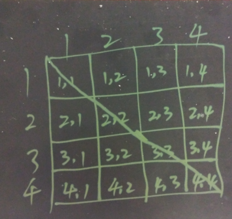

## PostgreSQL 相似文本检索与去重 - (银屑病怎么治？银屑病怎么治疗？银屑病怎么治疗好？银屑病怎么能治疗好？)    
                                                             
### 作者                                                             
digoal                                                             
                                                             
### 日期                                                             
2018-03-29                                                           
                                                             
### 标签                                                             
PostgreSQL , 相似字符串 , 全文检索 , 去重 , 相似问题 , 医疗 , plr , plpython , madlib , 文本处理   
                                                             
----                                                             
                                                             
## 背景       
在云栖社区的问答区，有一位网友提到有一个问题：      
  
```  
表里相似数据太多，想删除相似度高的数据，有什么办法能实现吗？  
例如：  
银屑病怎么治？  
银屑病怎么治疗？  
银屑病怎么治疗好？  
银屑病怎么能治疗好？  
等等  
```  
  
## 解这个问题的思路     
1\. 首先如何判断内容的相似度，PostgreSQL中提供了中文分词，pg_trgm(将字符串切成多个不重复的token,计算两个字符串的相似度) .     
  
对于本题，我建议采取中文分词的方式，首先将内容拆分成词组。      
  
2\. 在拆分成词组后，首先分组聚合，去除完全重复的数据。    
  
3\. 然后自关联生成笛卡尔(矩阵)，计算出每条记录和其他记录的相似度。相似度的算法很简单，重叠的token数量除以集合的token去重后的数量。    
  
4\. 根据相似度，去除不需要的数据。    
  
这里如果数据量非常庞大，使用专业的分析编程语言会更好例如 PL/R。      
   
## 实操的例子  
首先要安装PostgreSQL 中文分词插件    
  
(阿里云AliCloudDB PostgreSQL已包含这个插件，用法参考官方手册)    
  
```  
git clone https://github.com/jaiminpan/pg_jieba.git  
mv pg_jieba $PGSRC/contrib/  
export PATH=/home/digoal/pgsql9.5/bin:$PATH  
cd $PGSRC/contrib/pg_jieba  
make clean;make;make install  
  
git clone https://github.com/jaiminpan/pg_scws.git  
mv pg_jieba $PGSRC/contrib/  
export PATH=/home/digoal/pgsql9.5/bin:$PATH  
cd $PGSRC/contrib/pg_scws  
make clean;make;make install  
```  
  
创建插件    
  
```  
psql  
# create extension pg_jieba;  
# create extension pg_scws;  
```  
  
创建测试CASE    
  
```  
create table tdup1 (id int primary key, info text);  
create extension pg_trgm;  
insert into tdup1 values (1, '银屑病怎么治？');  
insert into tdup1 values (2, '银屑病怎么治疗？');  
insert into tdup1 values (3, '银屑病怎么治疗好？');  
insert into tdup1 values (4, '银屑病怎么能治疗好？');  
```  
  
这两种分词插件，可以任选一种。     
  
```  
postgres=# select to_tsvector('jiebacfg', info),* from tdup1 ;  
     to_tsvector     | id |         info           
---------------------+----+----------------------  
 '治':3 '银屑病':1   |  1 | 银屑病怎么治？  
 '治疗':3 '银屑病':1 |  2 | 银屑病怎么治疗？  
 '治疗':3 '银屑病':1 |  3 | 银屑病怎么治疗好？  
 '治疗':4 '银屑病':1 |  4 | 银屑病怎么能治疗好？  
(4 rows)  
  
postgres=# select to_tsvector('scwscfg', info),* from tdup1 ;  
            to_tsvector            | id |         info           
-----------------------------------+----+----------------------  
 '治':2 '银屑病':1                 |  1 | 银屑病怎么治？  
 '治疗':2 '银屑病':1               |  2 | 银屑病怎么治疗？  
 '好':3 '治疗':2 '银屑病':1        |  3 | 银屑病怎么治疗好？  
 '好':4 '治疗':3 '能':2 '银屑病':1 |  4 | 银屑病怎么能治疗好？  
(4 rows)  
```  
  
创建三个函数，      
  
计算2个数组的集合（去重后的集合）     
  
```  
postgres=# create or replace function array_union(text[], text[]) returns text[] as $$  
  select array_agg(c1) from (select c1 from unnest($1||$2) t(c1) group by c1) t;  
$$ language sql strict;  
CREATE FUNCTION  
```  
  
数组去重     
  
```  
postgres=# create or replace function array_dist(text[]) returns text[] as $$           
  select array_agg(c1) from (select c1 from unnest($1) t(c1) group by c1) t;      
$$ language sql strict;  
CREATE FUNCTION  
```  
  
计算两个数组的重叠部分（去重后的重叠部分）     
  
```  
postgres=# create or replace function array_share(text[], text[]) returns text[] as $$  
  select array_agg(unnest) from (select unnest($1) intersect select unnest($2) group by 1) t;  
$$ language sql strict;  
CREATE FUNCTION  
```  
  
笛卡尔结果是这样的：   
  
```regexp_split_to_array((regexp_replace(to_tsvector('jiebacfg',info)::text,'(:\d+)', '', 'g')),' ')``` 用于将info转换成数组。       
  
```  
postgres=# with t(c1,c2,c3) as   
(select id,info,array_dist(regexp_split_to_array((regexp_replace(to_tsvector('jiebacfg',info)::text,'(:\d+)', '', 'g')),' ')) from tdup1)   
select * from (select t1.c1 t1c1,t2.c1 t2c1,t1.c2 t1c2,t2.c2 t2c2,t1.c3 t1c3,t2.c3 t2c3,round(array_length(array_share(t1.c3,t2.c3),1)::numeric/array_length(array_union(t1.c3,t2.c3),1),2)   
simulate from t t1,t t2) t;  
 t1c1 | t2c1 |         t1c2         |         t2c2         |       t1c3        |       t2c3        | simulate   
------+------+----------------------+----------------------+-------------------+-------------------+----------  
    1 |    1 | 银屑病怎么治？       | 银屑病怎么治？       | {'银屑病','治'}   | {'银屑病','治'}   |     1.00  
    1 |    2 | 银屑病怎么治？       | 银屑病怎么治疗？     | {'银屑病','治'}   | {'银屑病','治疗'} |     0.33  
    1 |    3 | 银屑病怎么治？       | 银屑病怎么治疗好？   | {'银屑病','治'}   | {'银屑病','治疗'} |     0.33  
    1 |    4 | 银屑病怎么治？       | 银屑病怎么能治疗好？ | {'银屑病','治'}   | {'银屑病','治疗'} |     0.33  
    2 |    1 | 银屑病怎么治疗？     | 银屑病怎么治？       | {'银屑病','治疗'} | {'银屑病','治'}   |     0.33  
    2 |    2 | 银屑病怎么治疗？     | 银屑病怎么治疗？     | {'银屑病','治疗'} | {'银屑病','治疗'} |     1.00  
    2 |    3 | 银屑病怎么治疗？     | 银屑病怎么治疗好？   | {'银屑病','治疗'} | {'银屑病','治疗'} |     1.00  
    2 |    4 | 银屑病怎么治疗？     | 银屑病怎么能治疗好？ | {'银屑病','治疗'} | {'银屑病','治疗'} |     1.00  
    3 |    1 | 银屑病怎么治疗好？   | 银屑病怎么治？       | {'银屑病','治疗'} | {'银屑病','治'}   |     0.33  
    3 |    2 | 银屑病怎么治疗好？   | 银屑病怎么治疗？     | {'银屑病','治疗'} | {'银屑病','治疗'} |     1.00  
    3 |    3 | 银屑病怎么治疗好？   | 银屑病怎么治疗好？   | {'银屑病','治疗'} | {'银屑病','治疗'} |     1.00  
    3 |    4 | 银屑病怎么治疗好？   | 银屑病怎么能治疗好？ | {'银屑病','治疗'} | {'银屑病','治疗'} |     1.00  
    4 |    1 | 银屑病怎么能治疗好？ | 银屑病怎么治？       | {'银屑病','治疗'} | {'银屑病','治'}   |     0.33  
    4 |    2 | 银屑病怎么能治疗好？ | 银屑病怎么治疗？     | {'银屑病','治疗'} | {'银屑病','治疗'} |     1.00  
    4 |    3 | 银屑病怎么能治疗好？ | 银屑病怎么治疗好？   | {'银屑病','治疗'} | {'银屑病','治疗'} |     1.00  
    4 |    4 | 银屑病怎么能治疗好？ | 银屑病怎么能治疗好？ | {'银屑病','治疗'} | {'银屑病','治疗'} |     1.00  
(16 rows)  
```  
  
以上生成的实际上是一个矩阵,simulate就是矩阵中我们需要计算的相似度：    
  
  
  
我们在去重计算时不需要所有的笛卡尔积，只需要这个矩阵对角线的上部分或下部分数据即可。    
  
所以加个条件就能完成。     
  
```  
postgres=# with t(c1,c2,c3) as   
(select id,info,array_dist(regexp_split_to_array((regexp_replace(to_tsvector('jiebacfg',info)::text,'(:\d+)', '', 'g')),' ')) from tdup1)   
select * from (select t1.c1 t1c1,t2.c1 t2c1,t1.c2 t1c2,t2.c2 t2c2,t1.c3 t1c3,t2.c3 t2c3,round(array_length(array_share(t1.c3,t2.c3),1)::numeric/array_length(array_union(t1.c3,t2.c3),1),2)   
simulate from t t1,t t2 where t1.c1<>t2.c1 and t1.c1<t2.c1) t;  
 t1c1 | t2c1 |        t1c2        |         t2c2         |       t1c3        |       t2c3        | simulate   
------+------+--------------------+----------------------+-------------------+-------------------+----------  
    1 |    2 | 银屑病怎么治？     | 银屑病怎么治疗？     | {'银屑病','治'}   | {'银屑病','治疗'} |     0.33  
    1 |    3 | 银屑病怎么治？     | 银屑病怎么治疗好？   | {'银屑病','治'}   | {'银屑病','治疗'} |     0.33  
    1 |    4 | 银屑病怎么治？     | 银屑病怎么能治疗好？ | {'银屑病','治'}   | {'银屑病','治疗'} |     0.33  
    2 |    3 | 银屑病怎么治疗？   | 银屑病怎么治疗好？   | {'银屑病','治疗'} | {'银屑病','治疗'} |     1.00  
    2 |    4 | 银屑病怎么治疗？   | 银屑病怎么能治疗好？ | {'银屑病','治疗'} | {'银屑病','治疗'} |     1.00  
    3 |    4 | 银屑病怎么治疗好？ | 银屑病怎么能治疗好？ | {'银屑病','治疗'} | {'银屑病','治疗'} |     1.00  
(6 rows)  
```  
  
开始对这些数据去重，去重的第一步，明确simulate, 例如相似度大于0.5的，需要去重。     
  
```  
postgres=# with t(c1,c2,c3) as   
(select id,info,array_dist(regexp_split_to_array((regexp_replace(to_tsvector('jiebacfg',info)::text,'(:\d+)', '', 'g')),' ')) from tdup1)   
select * from (select t1.c1 t1c1,t2.c1 t2c1,t1.c2 t1c2,t2.c2 t2c2,t1.c3 t1c3,t2.c3 t2c3,round(array_length(array_share(t1.c3,t2.c3),1)::numeric/array_length(array_union(t1.c3,t2.c3),1),2)   
simulate from t t1,t t2 where t1.c1<>t2.c1 and t1.c1<t2.c1) t where simulate>0.5;  
 t1c1 | t2c1 |        t1c2        |         t2c2         |       t1c3        |       t2c3        | simulate   
------+------+--------------------+----------------------+-------------------+-------------------+----------  
    2 |    3 | 银屑病怎么治疗？   | 银屑病怎么治疗好？   | {'银屑病','治疗'} | {'银屑病','治疗'} |     1.00  
    2 |    4 | 银屑病怎么治疗？   | 银屑病怎么能治疗好？ | {'银屑病','治疗'} | {'银屑病','治疗'} |     1.00  
    3 |    4 | 银屑病怎么治疗好？ | 银屑病怎么能治疗好？ | {'银屑病','治疗'} | {'银屑病','治疗'} |     1.00  
(3 rows)  
```  
  
去重第二步，将t2c1列的ID对应的记录删掉即可。     
  
```  
delete from tdup1 where id in (with t(c1,c2,c3) as   
(select id,info,array_dist(regexp_split_to_array((regexp_replace(to_tsvector('jiebacfg',info)::text,'(:\d+)', '', 'g')),' ')) from tdup1)   
select t2c1 from (select t1.c1 t1c1,t2.c1 t2c1,t1.c2 t1c2,t2.c2 t2c2,t1.c3 t1c3,t2.c3 t2c3,round(array_length(array_share(t1.c3,t2.c3),1)::numeric/array_length(array_union(t1.c3,t2.c3),1),2)   
simulate from t t1,t t2 where t1.c1<>t2.c1 and t1.c1<t2.c1) t where simulate>0.5);  
  
例如 :   
postgres=# insert into tdup1 values (11, '白血病怎么治？');  
INSERT 0 1  
postgres=# insert into tdup1 values (22, '白血病怎么治疗？');  
INSERT 0 1  
postgres=# insert into tdup1 values (13, '白血病怎么治疗好？');  
INSERT 0 1  
postgres=# insert into tdup1 values (24, '白血病怎么能治疗好？');  
INSERT 0 1  
postgres=#   
postgres=# with t(c1,c2,c3) as                               
(select id,info,array_dist(regexp_split_to_array((regexp_replace(to_tsvector('jiebacfg',info)::text,'(:\d+)', '', 'g')),' ')) from tdup1)   
select * from (select t1.c1 t1c1,t2.c1 t2c1,t1.c2 t1c2,t2.c2 t2c2,t1.c3 t1c3,t2.c3 t2c3,round(array_length(array_share(t1.c3,t2.c3),1)::numeric/array_length(array_union(t1.c3,t2.c3),1),2)   
simulate from t t1,t t2 where t1.c1<>t2.c1 and t1.c1<t2.c1) t where simulate>0.5;  
 t1c1 | t2c1 |        t1c2        |         t2c2         |       t1c3        |       t2c3        | simulate   
------+------+--------------------+----------------------+-------------------+-------------------+----------  
    2 |    3 | 银屑病怎么治疗？   | 银屑病怎么治疗好？   | {'银屑病','治疗'} | {'银屑病','治疗'} |     1.00  
    2 |    4 | 银屑病怎么治疗？   | 银屑病怎么能治疗好？ | {'银屑病','治疗'} | {'银屑病','治疗'} |     1.00  
    3 |    4 | 银屑病怎么治疗好？ | 银屑病怎么能治疗好？ | {'银屑病','治疗'} | {'银屑病','治疗'} |     1.00  
   22 |   24 | 白血病怎么治疗？   | 白血病怎么能治疗好？ | {'治疗','白血病'} | {'治疗','白血病'} |     1.00  
   13 |   22 | 白血病怎么治疗好？ | 白血病怎么治疗？     | {'治疗','白血病'} | {'治疗','白血病'} |     1.00  
   13 |   24 | 白血病怎么治疗好？ | 白血病怎么能治疗好？ | {'治疗','白血病'} | {'治疗','白血病'} |     1.00  
(6 rows)  
  
postgres=# begin;  
BEGIN  
postgres=# delete from tdup1 where id in (with t(c1,c2,c3) as   
postgres(# (select id,info,array_dist(regexp_split_to_array((regexp_replace(to_tsvector('jiebacfg',info)::text,'(:\d+)', '', 'g')),' ')) from tdup1)   
postgres(# select t2c1 from (select t1.c1 t1c1,t2.c1 t2c1,t1.c2 t1c2,t2.c2 t2c2,t1.c3 t1c3,t2.c3 t2c3,round(array_length(array_share(t1.c3,t2.c3),1)::numeric/array_length(array_union(t1.c3,t2.c3),1),2)   
postgres(# simulate from t t1,t t2 where t1.c1<>t2.c1 and t1.c1<t2.c1) t where simulate>0.5);  
DELETE 4  
postgres=# select * from tdup1 ;  
 id |        info          
----+--------------------  
  1 | 银屑病怎么治？  
  2 | 银屑病怎么治疗？  
 11 | 白血病怎么治？  
 13 | 白血病怎么治疗好？  
(4 rows)  
```  
  
用数据库解会遇到的问题, 因为我们的JOIN filter是<>和<，用不上hashjoin。     
  
数据量比较大的情况下，耗时会非常的长。    
  
```  
postgres=# explain delete from tdup1 where id in (with t(c1,c2,c3) as   
(select id,info,array_dist(regexp_split_to_array((regexp_replace(to_tsvector('jiebacfg',info)::text,'(:\d+)', '', 'g')),' ')) from tdup1)   
select t2c1 from (select t1.c1 t1c1,t2.c1 t2c1,t1.c2 t1c2,t2.c2 t2c2,t1.c3 t1c3,t2.c3 t2c3,round(array_length(array_share(t1.c3,t2.c3),1)::numeric/array_length(array_union(t1.c3,t2.c3),1),2)   
simulate from t t1,t t2 where t1.c1<>t2.c1 and t1.c1<t2.c1) t where simulate>0.5);  
                                                      QUERY PLAN                                                        
----------------------------------------------------------------------------------------------------------------------  
 Delete on tdup1  (cost=10005260133.58..10005260215.84 rows=2555 width=34)  
   ->  Hash Join  (cost=10005260133.58..10005260215.84 rows=2555 width=34)  
         Hash Cond: (tdup1.id = "ANY_subquery".t2c1)  
         ->  Seq Scan on tdup1  (cost=0.00..61.10 rows=5110 width=10)  
         ->  Hash  (cost=10005260131.08..10005260131.08 rows=200 width=32)  
               ->  HashAggregate  (cost=10005260129.08..10005260131.08 rows=200 width=32)  
                     Group Key: "ANY_subquery".t2c1  
                     ->  Subquery Scan on "ANY_subquery"  (cost=10000002667.20..10005252911.99 rows=2886838 width=32)  
                           ->  Subquery Scan on t  (cost=10000002667.20..10005224043.61 rows=2886838 width=4)  
                                 Filter: (t.simulate > 0.5)  
                                 CTE t  
                                   ->  Seq Scan on tdup1 tdup1_1  (cost=0.00..2667.20 rows=5110 width=36)  
                                 ->  Nested Loop  (cost=10000000000.00..10005113119.99 rows=8660513 width=68)  
                                       Join Filter: ((t1.c1 <> t2.c1) AND (t1.c1 < t2.c1))  
                                       ->  CTE Scan on t t1  (cost=0.00..102.20 rows=5110 width=36)  
                                       ->  CTE Scan on t t2  (cost=0.00..102.20 rows=5110 width=36)  
(16 rows)  
```  
  
其他更优雅的方法，使用PLR或者R进行矩阵运算，得出结果后再进行筛选。      
  
PLR    
  
R    
  
或者使用MPP数据库例如Greenplum加上R和madlib可以对非常庞大的数据进行处理。      
  
MADLIB    
  
MPP    
  
## 小结    
这里用到了PG的什么特性？       
  
  
1\. 中文分词    
  
2\. 窗口查询功能    
  
(本例中没有用到，但是如果你的数据没有主键时，则需要用ctid和row_number来定位到一条唯一记录)    
  
## 参考  
[《[未完待续] PostgreSQL 全文检索 大结果集优化 - fuzzy match》](../201803/20180316_03.md)    
  
[《PostgreSQL 全文检索 - 词频统计》](../201803/20180309_02.md)    
  
[《[未完待续] PostgreSQL 流式fft傅里叶变换 (plpython + numpy + 数据库流式计算)》](../201803/20180307_01.md)    
  
[《PostgreSQL UDF实现tsvector(全文检索), array(数组)多值字段与scalar(单值字段)类型的整合索引(类分区索引) - 单值与多值类型复合查询性能提速100倍+ 案例 (含，单值+多值列合成)》](../201802/20180207_02.md)    
  
[《PostgreSQL 全文检索之 - 位置匹配 过滤语法(例如 '速度 <1> 激情')》](../201801/20180123_01.md)    
  
[《多流实时聚合 - 记录级实时快照 - JSON聚合与json全文检索的功能应用》](../201712/20171209_01.md)    
  
[《PostgreSQL - 全文检索内置及自定义ranking算法介绍 与案例》](../201712/20171206_01.md)    
  
[《用PostgreSQL 做实时高效 搜索引擎 - 全文检索、模糊查询、正则查询、相似查询、ADHOC查询》](../201712/20171205_02.md)    
  
[《HTAP数据库 PostgreSQL 场景与性能测试之 14 - (OLTP) 字符串搜索 - 全文检索》](../201711/20171107_15.md)    
  
[《HTAP数据库 PostgreSQL 场景与性能测试之 7 - (OLTP) 全文检索 - 含索引实时写入》](../201711/20171107_08.md)    
  
[《[未完待续] 流式机器学习(online machine learning) - pipelineDB with plR and plPython》](../201711/20171107_01.md)    
  
[《PostgreSQL 中英文混合分词特殊规则(中文单字、英文单词) - 中英分明》](../201711/20171104_03.md)    
  
[《在PostgreSQL中使用 plpythonu 调用系统命令》](../201710/20171023_01.md)    
  
[《多国语言字符串的加密、全文检索、模糊查询的支持》](../201710/20171020_01.md)    
  
[《全文检索 不包含 优化 - 阿里云RDS PostgreSQL最佳实践》](../201707/20170727_01.md)    
  
[《PostgreSQL 10.0 preview 功能增强 - JSON 内容全文检索》](../201703/20170312_24.md)    
  
[《PostgreSQL 中如何找出记录中是否包含编码范围内的字符，例如是否包含中文》](../201703/20170310_02.md)    
  
[《PostgreSQL Python tutorial》](../201701/20170106_06.md)    
  
[《如何解决数据库分词的拼写纠正问题 - PostgreSQL Hunspell 字典 复数形容词动词等变异还原》](../201612/20161206_01.md)    
  
[《聊一聊双十一背后的技术 - 毫秒分词算啥, 试试正则和相似度》](../201611/20161118_01.md)    
  
[《聊一聊双十一背后的技术 - 分词和搜索》](../201611/20161115_01.md)    
  
[《PostgreSQL 全文检索加速 快到没有朋友 - RUM索引接口(潘多拉魔盒)》](../201610/20161019_01.md)    
  
[《PostgreSQL 如何高效解决 按任意字段分词检索的问题 - case 1》](../201607/20160725_05.md)    
  
[《如何加快PostgreSQL结巴分词加载速度》](../201607/20160725_02.md)    
  
[《中文模糊查询性能优化 by PostgreSQL trgm》](../201605/20160506_02.md)    
  
[《PostgreSQL 行级 全文检索》](../201604/20160419_01.md)    
  
[《使用阿里云PostgreSQL zhparser中文分词时不可不知的几个参数》](../201603/20160310_01.md)    
  
[《一张图看懂MADlib能干什么》](../201511/20151111_01.md)    
  
[《PostgreSQL Greenplum 结巴分词(by plpython)》](../201508/20150824_01.md)    
  
[《NLPIR 分词准确率接近98.23%》](../201508/20150821_01.md)    
  
[《PostgreSQL chinese full text search 中文全文检索》](../201403/20140324_01.md)    
  
[《PostgreSQL 多元线性回归 - 1 MADLib Installed in PostgreSQL 9.2》](../201307/20130731_01.md)    
  
[《PostgreSQL USE plpythonu get Linux FileSystem usage》](../201307/20130722_01.md)    
  
[《PostgreSQL 使用 nlpbamboo chinesecfg 中文分词》](../201206/20120621_01.md)    
  
https://github.com/jaiminpan/pg_jieba  
  
https://github.com/jaiminpan/pg_scws  
  
http://joeconway.com/plr/  
  
https://www.postgresql.org/docs/devel/static/plpython.html  
  
http://madlib.apache.org/  
  
  
  
<a rel="nofollow" href="http://info.flagcounter.com/h9V1"  ></a>  
  
  
  
  
  
  
## [digoal's 大量PostgreSQL文章入口](https://github.com/digoal/blog/blob/master/README.md "22709685feb7cab07d30f30387f0a9ae")
  
