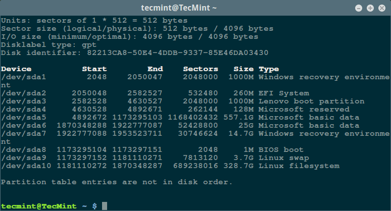
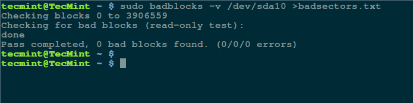
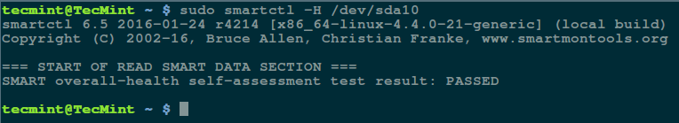

## [转载] 磁盘硬件问题(坏块)检测  
                                                           
### 作者                                                           
digoal                                                           
                                                           
### 日期                                                           
2018-03-31                                                         
                                                           
### 标签                                                           
PostgreSQL , Linux , Windows , SSD , smartctl , smartmontools , badblocks , hdparm , HD Tune   
                                                           
----                                                           
                                                           
## 背景    
Linux下面可以使用smartctl , badblocks检查是否有坏块。  
  
Win下面可以使用HD Tune。  
  
### 1 smartmontools  
  
```  
apt install smartmontools  
```  
  
https://www.aliyun.com/jiaocheng/120499.html  
  
```  
smartctl -t long /dev/sda  
```  
  
```  
3.1.5          SMART 离线测试、自测试 参数  
-t  TEST      立刻执行测试,可以和-C参数一起使用。  
  
                     TEST可以有以下几个选择:  
  
                     offline  离线测试。可以在挂载文件系统的磁盘上使用  
  
                     short   短时间测试。可以在挂载文件系统的磁盘上使用。  
  
                     long   长时间测试。可以在挂载文件系统的磁盘上使用。  
  
                     conveyance  [ATA only]传输zi测试。可以在挂载文件系统的磁盘上使用。  
  
                     select,N-M      
  
select, N+SIZE  [ATA only]有选择性测试,测试磁盘的部分LBA。N表示  
  
LBA编号,M表示结束LBA编号,SIZE表示测试的LBA  
  
范围。  
```  
  
查看健康状态  
  
```  
smartctl -s on /dev/sda  
  
smartctl -a /dev/sda  
  
smartctl -H /dev/sda  
```  
  
### 2 badblocks  
让我们从坏道和坏块的定义开始说起，它们是一块磁盘或闪存上不再能够被读写的部分，一般是由于磁盘表面特定的[物理损坏](http://www.tecmint.com/defragment-linux-system-partitions-and-directories/)或闪存晶体管失效导致的。  
  
随着坏道的继续积累，它们会对你的磁盘或闪存容量产生令人不快或破坏性的影响，甚至可能会导致硬件失效。  
  
同时还需要注意的是坏块的存在警示你应该开始考虑买块新磁盘了，或者简单地将坏块标记为不可用。  
  
因此，在这篇文章中，我们通过几个必要的步骤，使用特定的[磁盘扫描工具](http://www.tecmint.com/ncdu-a-ncurses-based-disk-usage-analyzer-and-tracker/)让你能够判断 Linux 磁盘或闪存是否存在坏道。  
  
以下就是步骤：  
  
#### 在 Linux 上使用坏块工具检查坏道  
  
坏块工具可以让用户扫描设备检查坏道或坏块。设备可以是一个磁盘或外置磁盘，由一个如 ```/dev/sdc``` 这样的文件代表。  
  
首先，通过超级用户权限执行 [fdisk](http://www.tecmint.com/fdisk-commands-to-manage-linux-disk-partitions/) 命令来显示你的所有磁盘或闪存的信息以及它们的分区信息：  
  
```  
$ sudo fdisk -l  
```  
  
列出 Linux 文件系统分区  
  
  
  
然后用如下命令检查你的 Linux 硬盘上的坏道/坏块：  
  
```  
$ sudo badblocks -v /dev/sda10 > badsectors.txt  
```  
  
在 Linux 上扫描硬盘坏道  
  
  
  
  
上面的命令中，```badblocks``` 扫描设备 ```/dev/sda10```（记得指定你的实际设备），```-v``` 选项让它显示操作的详情。另外，这里使用了输出重定向将操作结果重定向到了文件 ```badsectors.txt```。  
  
如果你在你的磁盘上发现任何坏道，卸载磁盘并像下面这样让系统不要将数据写入回报的扇区中。  
  
你需要执行 ```e2fsck```（针对 ```ext2/ext3/ext4``` 文件系统）或 ```fsck``` 命令，命令中还需要用到 ```badsectors.txt``` 文件和设备文件。  
  
```-l``` 选项告诉命令将在指定的文件 ```badsectors.txt``` 中列出的扇区号码加入坏块列表。  
  
  
```  
------------ 针对 for ext2/ext3/ext4 文件系统 ------------  
$ sudo e2fsck -l badsectors.txt /dev/sda10  
  
或  
  
------------ 针对其它文件系统 ------------  
$ sudo fsck -l badsectors.txt /dev/sda10  
```  
  
如果你使用的是ZFS，不需要FSCK来修复。ZFS是事务型文件系统，任何时刻视角都是 一致的。  
  
#### 在 Linux 上使用 Smartmontools 工具扫描坏道  
  
这个方法对带有 ```S.M.A.R.T```（自我监控分析报告技术```Self-Monitoring, Analysis and Reporting Technology```）系统的现代磁盘（```ATA/SATA``` 和 ```SCSI/SAS``` 硬盘以及固态硬盘）更加的可靠和高效。```S.M.A.R.T``` 系统能够帮助检测，报告，以及可能记录它们的健康状况，这样你就可以找出任何可能出现的硬件失效。  
  
你可以使用以下命令安装 ```smartmontools```：  
  
```  
------------ 在基于 Debian/Ubuntu 的系统上 ------------  
$ sudo apt-get install smartmontools  
  
------------ 在基于 RHEL/CentOS 的系统上 ------------  
$ sudo yum install smartmontools  
```  
  
安装完成之后，使用 ```smartctl``` 控制磁盘集成的 ```S.M.A.R.T``` 系统。你可以这样查看它的手册或帮助：  
  
```  
$ man smartctl  
$ smartctl -h  
```  
  
然后执行 ```smartctrl``` 命令并在命令中指定你的设备作为参数，以下命令包含了参数 ```-H``` 或 ```--health``` 以显示 ```SMART``` 整体健康自我评估测试结果。  
  
```  
$ sudo smartctl -H /dev/sda10  
```  
  
检查 Linux 硬盘健康  
  
  
  
  
  
上面的结果指出你的硬盘很健康，近期内不大可能发生硬件失效。  
  
要获取磁盘信息总览，使用 ```-a``` 或 ```--all``` 选项来显示关于磁盘所有的 ```SMART``` 信息，```-x``` 或 ```--xall``` 来显示所有关于磁盘的 SMART 信息以及非 SMART 信息。  
  
在这个教程中，我们涉及了有关[磁盘健康诊断](http://www.tecmint.com/defragment-linux-system-partitions-and-directories/)的重要话题，你可以下面的反馈区来分享你的想法或提问，并且记得多回来看看。  
  
via: http://www.tecmint.com/check-linux-hard-disk-bad-sectors-bad-blocks/  
  
  
  
  
### 3 hdparm  
  
检测硬盘I/O相对来说还是一个比较抽象的概念，但是对系统性能的影响还是至关重要的。  
  
使用hdparm命令检测读取速度：  
  
    hdparm命令提供了一个命令行的接口用于读取和设置IDE和SCSI硬盘参数。  
      
    安装：  
      
```  
	yum install hdparm  
```  
  
    语法：  
  
```  
        hdparm(选项)(参数)  
```  
  
    常用选项：  
  
```  
        -f: 将内存缓冲区的数据写入硬盘，并清除缓冲区；  
        -g: 显示硬盘的磁轨，磁头，磁区等参数；  
        -i: 显示硬盘的硬件规格信息，这些信息是在开机时由硬盘本身所提供；  
        -I: 直接读取硬盘所提供的硬件规格信息；  
        -t: 评估硬盘的读取效率;  
        -T: 评估硬盘快取的读取效率；  
```  
  
    参数：  
  
        设备文件：指定id驱动对应的设备文件名  
          
    实例：  
  
        使用方法很简单，```hdparm -Tt /dev/sda```  
  
```	  
[root@super python]# hdparm -Tt /dev/sda  
  
  
/dev/sda:  
 Timing cached reads:   8470 MB in  2.00 seconds = 4235.83 MB/sec          
 # 硬盘的快取读取速度，2.00秒读取了8470 MB，平均每秒读取：4235.83 MB/sec  
  
 Timing buffered disk reads: 722 MB in  3.22 seconds = 224.28 MB/sec      
 # 硬盘的读取速度：3.22秒读取了722 MB，平均每秒读取：224.28 MB/sec  
```  
  
### 4 fio  
  
[《fio测试IO性能》](../201604/20160407_01.md)    
  
### 5 HD Tune  
  
  
  
### 6 dd  
使用dd命令测试写入速度：  
  
    dd命令是一个不太专业的测速工具，如果要求的不是很严格，还是可以进行多次测试来得到一个近似值的。  
  
    安装：  
  
```  
        yum install coreutils  
```  
  
    实例：  
  
```	  
	[root@super python]# dd if=/dev/zero of=test bs=1M count=2048        # 写入一个文件名test, bytes 为1M，共2048 blocks 的文件，总共大小为：1M * 2048 = 2G  
        记录了2048+0 的读入  
        记录了2048+0 的写出  
        2147483648字节(2.1 GB)已复制，88.8786 秒，24.2 MB/秒  
          
        88.8786 秒写入了2.1 GB数据，平均：24.2 MB/秒  
```  
  
## 参考  
https://www.cnblogs.com/hukey/p/5226670.html  
  
https://linux.cn/article-7961-1.html  
  
https://www.aliyun.com/jiaocheng/120499.html  
  
https://www.smartmontools.org/wiki/FAQ  
  
[《fio测试IO性能》](../201604/20160407_01.md)      
  
<a rel="nofollow" href="http://info.flagcounter.com/h9V1"  ></a>  
  
  
  
  
  
  
## [digoal's 大量PostgreSQL文章入口](https://github.com/digoal/blog/blob/master/README.md "22709685feb7cab07d30f30387f0a9ae")
  
