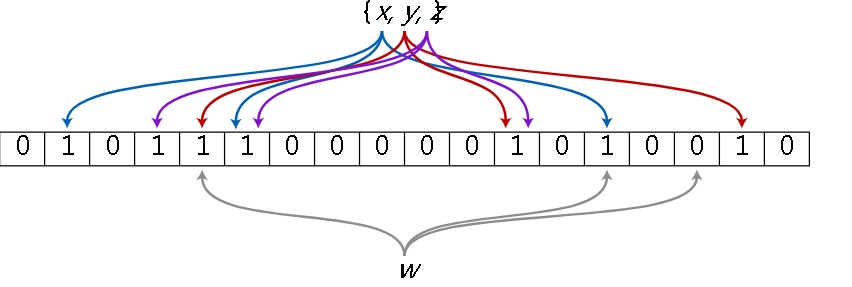

## PostgreSQL 11 preview - bloom filter 误报率评估测试及如何降低误报 - 暨bloom filter应用于HEAP与INDEX的一致性检测  
                                                                                     
### 作者                                                                                     
digoal                                                                                     
                                                                                     
### 日期                                                                                     
2018-04-09                                                                                 
                                                                                     
### 标签                                                                                     
PostgreSQL , bloom filter , 误报率 , amcheck        
                                                                                     
----                                                                                     
                                                                                     
## 背景       
bloom filter是一个空间压缩，概率数据结构，可以存储超容量的数据集，用于判断某个元素是否存在于数据集中。但是bloom filter存在一定的错误率（当判断存在时，可能不存在，因为这个元素的bits可能被set了。但是当判断发现元素不存在时就一定不存在。）  
  
例如A元素对应1,19,200,21等4个BIT，当包含A元素时，这4个BIT一定为1。但是请注意，B元素可能对应1,18,300,20000几个BIT，C元素。。。D元素等。其他元素可能包含了A元素的所有BIT，当其他元素都存在时，那么A元素的几个BIT都被填充了1，因此A元素虽然不存在，但是如果只看BIT会被误判为存在。  
  
为了降低误判率，有两方面的考量  
  
1、降低HASH冲撞  
  
2、增加bloom的SIZE，减少冲撞  
  
PostgreSQL 11提出了一个TEST插件，用于判断bloom filter的误判率。  
  
https://git.postgresql.org/gitweb/?p=postgresql.git;a=commit;h=51bc271790eb234a1ba4d14d3e6530f70de92ab5  
  
```  
Add Bloom filter implementation.  
  
A Bloom filter is a space-efficient, probabilistic data structure that  
can be used to test set membership.  Callers will sometimes incur false  
positives, but never false negatives.  The rate of false positives is a  
function of the total number of elements and the amount of memory  
available for the Bloom filter.  
  
Two classic applications of Bloom filters are cache filtering, and data  
synchronization testing.  Any user of Bloom filters must accept the  
possibility of false positives as a cost worth paying for the benefit in  
space efficiency.  
  
This commit adds a test harness extension module, test_bloomfilter.  It  
can be used to get a sense of how the Bloom filter implementation  
performs under varying conditions.  
  
This is infrastructure for the upcoming "heapallindexed" amcheck patch,  
which verifies the consistency of a heap relation against one of its  
indexes.  
  
Author: Peter Geoghegan  
Reviewed-By: Andrey Borodin, Michael Paquier, Thomas Munro, Andres Freund  
Discussion: https://postgr.es/m/CAH2-Wzm5VmG7cu1N-H=nnS57wZThoSDQU+F5dewx3o84M+jY=g@mail.gmail.com  
```  
  
## bloom filter的几个应用  
  
1、多字段任意等值组合查询。  https://www.postgresql.org/docs/devel/static/bloom.html    
  
```  
postgres=# create extension bloom ;  
CREATE EXTENSION  
postgres=# create table test_bl (c1 int, c2 int, c3 int, c4 int);  
CREATE TABLE  
postgres=# insert into test_bl select random()*1000, random()*100, random()*3200, random()*10 from generate_series(1,10000000);  
INSERT 0 10000000  
postgres=# create index idx_test_bl on test_bl using bloom (c1,c2,c3,c4) with (length=41, col1=10, col2=10, col3=10, col4=10);  
CREATE INDEX  
  
postgres=# explain (analyze,verbose,timing,costs,buffers) select * from test_bl where c2=1 and c4=1;  
                                                             QUERY PLAN                                                                
-------------------------------------------------------------------------------------------------------------------------------------  
 Bitmap Heap Scan on public.test_bl  (cost=104036.28..111840.36 rows=10322 width=16) (actual time=38.285..47.650 rows=10035 loops=1)  
   Output: c1, c2, c3, c4  
   Recheck Cond: ((test_bl.c2 = 1) AND (test_bl.c4 = 1))  
   Rows Removed by Index Recheck: 703  
   Heap Blocks: exact=7377  
   Buffers: shared hit=11043  
   ->  Bitmap Index Scan on idx_test_bl  (cost=0.00..104033.70 rows=10322 width=0) (actual time=37.269..37.269 rows=10738 loops=1)  
         Index Cond: ((test_bl.c2 = 1) AND (test_bl.c4 = 1))  
         Buffers: shared hit=3666  
 Planning Time: 0.104 ms  
 Execution Time: 48.989 ms  
(11 rows)  
  
postgres=# explain (analyze,verbose,timing,costs,buffers) select * from test_bl where c1=1;  
                                                           QUERY PLAN                                                              
---------------------------------------------------------------------------------------------------------------------------------  
 Bitmap Heap Scan on public.test_bl  (cost=79036.18..86607.87 rows=9936 width=16) (actual time=32.485..56.025 rows=9933 loops=1)  
   Output: c1, c2, c3, c4  
   Recheck Cond: (test_bl.c1 = 1)  
   Rows Removed by Index Recheck: 33342  
   Heap Blocks: exact=12922  
   Buffers: shared hit=16588  
   ->  Bitmap Index Scan on idx_test_bl  (cost=0.00..79033.70 rows=9936 width=0) (actual time=30.737..30.737 rows=43275 loops=1)  
         Index Cond: (test_bl.c1 = 1)  
         Buffers: shared hit=3666  
 Planning Time: 0.078 ms  
 Execution Time: 57.404 ms  
(11 rows)  
```  
  
2、数据一致性校验。AMCHECK：  https://www.postgresql.org/docs/devel/static/amcheck.html     
  
[《PostgreSQL 10.0 preview 功能增强 - 增加access method CHECK接口amcheck》](../201704/20170420_02.md)    
  
数据一致性校验，是要检查HEAP里面的TUPLE是否在INDEX中都存在，如果不使用BLOOM，那么可能需要对HEAP的数据按索引接口重建一遍，然后再一一比对，效率可想而知会很低下。而使用bloom filter，可以将索引中的tuple转换为bloom，然后再扫一遍HEAP即可，判断每一个HEAP TUPLE是否在bloom中都存在。如果有不存在则报错。  
  
注意AMCHECK的heapallindexed 检测也是有一定误报率的，为了控制误报，必须设置足够大的maintenance_work_mem，每个TUPLE约使用2字节（实际上9.6个BIT）只要满足这个需求，就可以将误差控制在2%左右。  
  
The summarizing structure is bound in size by maintenance_work_mem. In order to ensure that there is no more than a 2% probability of failure to detect an inconsistency for each heap tuple that should be represented in the index, approximately 2 bytes of memory are needed per tuple. As less memory is made available per tuple, the probability of missing an inconsistency slowly increases. This approach limits the overhead of verification significantly, while only slightly reducing the probability of detecting a problem, especially for installations where verification is treated as a routine maintenance task. Any single absent or malformed tuple has a new opportunity to be detected with each new verification attempt.   
  
这两类应用，为了提高效率，降低误判率。都需要考虑前面提到的几个因素：  
  
1、降低HASH冲撞  
  
2、给定足够大的BLOOM SIZE  
  
3、是不是误判率为0就最好呢？不一定，因为误判率0的情况下，BLOOM本身就会变得很大，通常控制在```1 ~ 2%```之间即可。  
  
## test_bloomfilter插件介绍  
  
```  
   1 test_bloomfilter overview  
   2 =========================  
   3   
   4 test_bloomfilter is a test harness module for testing Bloom filter library set  
   5 membership operations.  It consists of a single SQL-callable function,  
   6 test_bloomfilter(), plus a regression test that calls test_bloomfilter().  
   7 Membership tests are performed against a dataset that the test harness module  
   8 generates.  
   9   
  10 The test_bloomfilter() function displays instrumentation at DEBUG1 elog level  
  11 (WARNING when the false positive rate exceeds a 1% threshold).  This can be  
  12 used to get a sense of the performance characteristics of the Postgres Bloom  
  13 filter implementation under varied conditions.  
  14   
  15 Bitset size  
  16 -----------  
  17   
  18 The main bloomfilter.c criteria for sizing its bitset is that the false  
  19 positive rate should not exceed 2% when sufficient bloom_work_mem is available  
  20 (and the caller-supplied estimate of the number of elements turns out to have  
  21 been accurate).  A 1% - 2% rate is currently assumed to be suitable for all  
  22 Bloom filter callers.  
  23   
  24 With an optimal K (number of hash functions), Bloom filters should only have a  
  25 1% false positive rate with just 9.6 bits of memory per element.  The Postgres  
  26 implementation's 2% worst case guarantee exists because there is a need for  
  27 some slop due to implementation inflexibility in bitset sizing.  Since the  
  28 bitset size is always actually kept to a power of two number of bits, callers  
  29 can have their bloom_work_mem argument truncated down by almost half.  
  30 In practice, callers that make a point of passing a bloom_work_mem that is an  
  31 exact power of two bitset size (such as test_bloomfilter.c) will actually get  
  32 the "9.6 bits per element" 1% false positive rate.  
  33   
  34 Testing strategy  
  35 ----------------  
  36   
  37 Our approach to regression testing is to test that a Bloom filter has only a 1%  
  38 false positive rate for a single bitset size (2 ^ 23, or 1MB).  We test a  
  39 dataset with 838,861 elements, which works out at 10 bits of memory per  
  40 element.  We round up from 9.6 bits to 10 bits to make sure that we reliably  
  41 get under 1% for regression testing.  Note that a random seed is used in the  
  42 regression tests because the exact false positive rate is inconsistent across  
  43 platforms.  Inconsistent hash function behavior is something that the  
  44 regression tests need to be tolerant of anyway.  
  45   
  46 test_bloomfilter() SQL-callable function  
  47 ========================================  
  48   
  49 The SQL-callable function test_bloomfilter() provides the following arguments:  
  50   
  51 * "power" is the power of two used to size the Bloom filter's bitset.  
  52   
  53 The minimum valid argument value is 23 (2^23 bits), or 1MB of memory.  The  
  54 maximum valid argument value is 32, or 512MB of memory.  
  55   
  56 * "nelements" is the number of elements to generate for testing purposes.  
  57   
  58 * "seed" is a seed value for hashing.  
  59   
  60 A value < 0 is interpreted as "use random seed".  Varying the seed value (or  
  61 specifying -1) should result in small variations in the total number of false  
  62 positives.  
  63   
  64 * "tests" is the number of tests to run.  
  65   
  66 This may be increased when it's useful to perform many tests in an interactive  
  67 session.  It only makes sense to perform multiple tests when a random seed is  
  68 used.  
```  
  
## amcheck heapallindexed参数开启介绍  
开启bt_index_parent_check或bt_index_check检测函数的heapallindexed开关后，会检查HEAP与INDEX的一致性，确保所有HEAP TUPLE都在INDEX中（使用bloom filter,存在误差），所以结果一致是假的，但是不一致一定是真的。  
  
首先将index tuple（包括索引表达式或字段的值(toast不包含```* we don't decompress/normalize toasted values as part of fingerprinting.```)，以及对应的数据HEAP表里面的行号）转换为bloom 指纹，然后扫描heap，判断heap中的每一条记录(被索引的字段或表达式)都在INDEX中。  
  
误差与maintenance_work_mem参数相关，每条记录2 byte，例如10000000条记录(其中被索引的字段)，maintenance_work_mem设置为保证2%左右的误差。  
  
https://git.postgresql.org/gitweb/?p=postgresql.git;a=blobdiff;f=contrib/amcheck/verify_nbtree.c;h=a15fe21933b9a5b8baefedaa8f38e517d6c91877;hp=da518daea307aa6737f001d98d7aed00baf76413;hb=7f563c09f8901f6acd72cb8fba7b1bd3cf3aca8e;hpb=51bc271790eb234a1ba4d14d3e6530f70de92ab5  
  
```  
+ * Per-tuple callback from IndexBuildHeapScan, used to determine if index has  
+ * all the entries that definitely should have been observed in leaf pages of  
+ * the target index (that is, all IndexTuples that were fingerprinted by our  
+ * Bloom filter).  All heapallindexed checks occur here.  
+ *  
+ * The redundancy between an index and the table it indexes provides a good  
+ * opportunity to detect corruption, especially corruption within the table.  
+ * The high level principle behind the verification performed here is that any  
+ * IndexTuple that should be in an index following a fresh CREATE INDEX (based  
+ * on the same index definition) should also have been in the original,  
+ * existing index, which should have used exactly the same representation  
+ *  
+ * Since the overall structure of the index has already been verified, the most  
+ * likely explanation for error here is a corrupt heap page (could be logical  
+ * or physical corruption).  Index corruption may still be detected here,  
+ * though.  Only readonly callers will have verified that left links and right  
+ * links are in agreement, and so it's possible that a leaf page transposition  
+ * within index is actually the source of corruption detected here (for  
+ * !readonly callers).  The checks performed only for readonly callers might  
+ * more accurately frame the problem as a cross-page invariant issue (this  
+ * could even be due to recovery not replaying all WAL records).  The !readonly  
+ * ERROR message raised here includes a HINT about retrying with readonly  
+ * verification, just in case it's a cross-page invariant issue, though that  
+ * isn't particularly likely.  
+ *  
+ * IndexBuildHeapScan() expects to be able to find the root tuple when a  
+ * heap-only tuple (the live tuple at the end of some HOT chain) needs to be  
+ * indexed, in order to replace the actual tuple's TID with the root tuple's  
+ * TID (which is what we're actually passed back here).  The index build heap  
+ * scan code will raise an error when a tuple that claims to be the root of the  
+ * heap-only tuple's HOT chain cannot be located.  This catches cases where the  
+ * original root item offset/root tuple for a HOT chain indicates (for whatever  
+ * reason) that the entire HOT chain is dead, despite the fact that the latest  
+ * heap-only tuple should be indexed.  When this happens, sequential scans may  
+ * always give correct answers, and all indexes may be considered structurally  
+ * consistent (i.e. the nbtree structural checks would not detect corruption).  
+ * It may be the case that only index scans give wrong answers, and yet heap or  
+ * SLRU corruption is the real culprit.  (While it's true that LP_DEAD bit  
+ * setting will probably also leave the index in a corrupt state before too  
+ * long, the problem is nonetheless that there is heap corruption.)  
+ *  
+ * Heap-only tuple handling within IndexBuildHeapScan() works in a way that  
+ * helps us to detect index tuples that contain the wrong values (values that  
+ * don't match the latest tuple in the HOT chain).  This can happen when there  
+ * is no superseding index tuple due to a faulty assessment of HOT safety,  
+ * perhaps during the original CREATE INDEX.  Because the latest tuple's  
+ * contents are used with the root TID, an error will be raised when a tuple  
+ * with the same TID but non-matching attribute values is passed back to us.  
+ * Faulty assessment of HOT-safety was behind at least two distinct CREATE  
+ * INDEX CONCURRENTLY bugs that made it into stable releases, one of which was  
+ * undetected for many years.  In short, the same principle that allows a  
+ * REINDEX to repair corruption when there was an (undetected) broken HOT chain  
+ * also allows us to detect the corruption in many cases.  
+ */  
+static void  
+bt_tuple_present_callback(Relation index, HeapTuple htup, Datum *values,  
+                         bool *isnull, bool tupleIsAlive, void *checkstate)  
+{  
+   BtreeCheckState *state = (BtreeCheckState *) checkstate;  
+   IndexTuple  itup;  
+  
+   Assert(state->heapallindexed);  
+  
+   /*  
+    * Generate an index tuple for fingerprinting.  
+    *  
+    * Index tuple formation is assumed to be deterministic, and IndexTuples  
+    * are assumed immutable.  While the LP_DEAD bit is mutable in leaf pages,  
+    * that's ItemId metadata, which was not fingerprinted.  (There will often  
+    * be some dead-to-everyone IndexTuples fingerprinted by the Bloom filter,  
+    * but we only try to detect the absence of needed tuples, so that's okay.)  
+    *  
+    * Note that we rely on deterministic index_form_tuple() TOAST compression.  
+    * If index_form_tuple() was ever enhanced to compress datums out-of-line,  
+    * or otherwise varied when or how compression was applied, our assumption  
+    * would break, leading to false positive reports of corruption.  For now,  
+    * we don't decompress/normalize toasted values as part of fingerprinting.  
+    */  
+   itup = index_form_tuple(RelationGetDescr(index), values, isnull);  
+   itup->t_tid = htup->t_self;  
+  
+   /* Probe Bloom filter -- tuple should be present */  
+   if (bloom_lacks_element(state->filter, (unsigned char *) itup,  
+                           IndexTupleSize(itup)))  
+       ereport(ERROR,  
+               (errcode(ERRCODE_DATA_CORRUPTED),  
+                errmsg("heap tuple (%u,%u) from table \"%s\" lacks matching index tuple within index \"%s\"",  
+                       ItemPointerGetBlockNumber(&(itup->t_tid)),  
+                       ItemPointerGetOffsetNumber(&(itup->t_tid)),  
+                       RelationGetRelationName(state->heaprel),  
+                       RelationGetRelationName(state->rel)),  
+                !state->readonly  
+                ? errhint("Retrying verification using the function bt_index_parent_check() might provide a more specific error.")  
+                : 0));  
+  
+   state->heaptuplespresent++;  
+   pfree(itup);  
+}  
+  
```  
  
  
  
```  
+   /*  
+    * * Check whether heap contains unindexed/malformed tuples *  
+    */  
+   if (state->heapallindexed)  
+   {  
+       IndexInfo  *indexinfo = BuildIndexInfo(state->rel);  
+       HeapScanDesc scan;  
+  
+       /*  
+        * Create our own scan for IndexBuildHeapScan(), rather than getting it  
+        * to do so for us.  This is required so that we can actually use the  
+        * MVCC snapshot registered earlier in !readonly case.  
+        *  
+        * Note that IndexBuildHeapScan() calls heap_endscan() for us.  
+        */  
+       scan = heap_beginscan_strat(state->heaprel, /* relation */  
+                                   snapshot,   /* snapshot */  
+                                   0,  /* number of keys */  
+                                   NULL,   /* scan key */  
+                                   true,   /* buffer access strategy OK */  
+                                   true);  /* syncscan OK? */  
+  
+       /*  
+        * Scan will behave as the first scan of a CREATE INDEX CONCURRENTLY  
+        * behaves in !readonly case.  
+        *  
+        * It's okay that we don't actually use the same lock strength for the  
+        * heap relation as any other ii_Concurrent caller would in !readonly  
+        * case.  We have no reason to care about a concurrent VACUUM  
+        * operation, since there isn't going to be a second scan of the heap  
+        * that needs to be sure that there was no concurrent recycling of  
+        * TIDs.  
+        */  
+       indexinfo->ii_Concurrent = !state->readonly;  
+  
+       /*  
+        * Don't wait for uncommitted tuple xact commit/abort when index is a  
+        * unique index on a catalog (or an index used by an exclusion  
+        * constraint).  This could otherwise happen in the readonly case.  
+        */  
+       indexinfo->ii_Unique = false;  
+       indexinfo->ii_ExclusionOps = NULL;  
+       indexinfo->ii_ExclusionProcs = NULL;  
+       indexinfo->ii_ExclusionStrats = NULL;  
+  
+       elog(DEBUG1, "verifying that tuples from index \"%s\" are present in \"%s\"",  
+            RelationGetRelationName(state->rel),  
+            RelationGetRelationName(state->heaprel));  
+  
+       IndexBuildHeapScan(state->heaprel, state->rel, indexinfo, true,  
+                          bt_tuple_present_callback, (void *) state, scan);  
+  
+       ereport(DEBUG1,  
+               (errmsg_internal("finished verifying presence of " INT64_FORMAT " tuples from table \"%s\" with bitset %.2f%% set",  
+                                state->heaptuplespresent, RelationGetRelationName(heaprel),  
+                                100.0 * bloom_prop_bits_set(state->filter))));  
+  
+       if (snapshot != SnapshotAny)  
+           UnregisterSnapshot(snapshot);  
+  
+       bloom_free(state->filter);  
+   }  
```  
  
## test_bloomfilter使用例子  
```  
cd postgresql-11devel/src/test/modules/test_bloomfilter/  
  
USE_PGXS=1 make   
USE_PGXS=1 make install  
```  
  
```  
postgres=# create extension test_bloomfilter ;  
CREATE EXTENSION  
  
postgres=# \df test_bloomfilter   
                                                                 List of functions  
 Schema |       Name       | Result data type |                                     Argument data types                                      | Type   
--------+------------------+------------------+----------------------------------------------------------------------------------------------+------  
 public | test_bloomfilter | void             | power integer, nelements bigint, seed integer DEFAULT '-1'::integer, tests integer DEFAULT 1 | func  
(1 row)  
```  
  
```  
Testing strategy  
----------------  
  
Our approach to regression testing is to test that a Bloom filter has only a 1%  
false positive rate for a single bitset size (2 ^ 23, or 1MB).  We test a  
dataset with 838,861 elements, which works out at 10 bits of memory per  
element.  We round up from 9.6 bits to 10 bits to make sure that we reliably  
get under 1% for regression testing.  Note that a random seed is used in the  
regression tests because the exact false positive rate is inconsistent across  
platforms.  Inconsistent hash function behavior is something that the  
regression tests need to be tolerant of anyway.  
```  
  
```  
postgres=# set client_min_messages ='debug';  
SET  
postgres=# select test_bloomfilter(23,8388610);  
DEBUG:  beginning test #1...  
DEBUG:  bloom_work_mem (KB): 1024  
WARNING:  seed: 1883349013 false positives: 5303072 (0.632175%) bitset 63.21% set  
 test_bloomfilter   
------------------  
   
(1 row)  
  
postgres=# select test_bloomfilter(24,8388610);  
DEBUG:  beginning test #1...  
DEBUG:  bloom_work_mem (KB): 2048  
WARNING:  seed: 1590179470 false positives: 3299662 (0.393350%) bitset 39.34% set  
 test_bloomfilter   
------------------  
   
(1 row)  
  
postgres=# select test_bloomfilter(25,8388610);  
DEBUG:  beginning test #1...  
DEBUG:  bloom_work_mem (KB): 4096  
WARNING:  seed: 1790559261 false positives: 1233267 (0.147017%) bitset 52.77% set  
 test_bloomfilter   
------------------  
   
(1 row)  
```  
  
这里的```false positives: 1233267 (0.147017%)```就是误差率。  
  
```  
postgres=# select 1233267/8388610.0;  
        ?column?          
------------------------  
 0.14701684784487537268  
(1 row)  
```  
  
```bitset 52.77% set```，表示4MB的bits中，有52.77%的bit位被设置了。  
  
## amcheck使用例子  
  
```  
postgres=# create unlogged table test_b (c1 int, c2 int, c3 int, c4 int, c5 timestamp);  
CREATE TABLE  
  
postgres=# insert into test_b select random()*10000000, random()*10000000,random()*10000000,random()*10000000,clock_timestamp() from generate_series(1,50000000);  
INSERT 0 50000000  
  
postgres=# create index idx_test_b on test_b using btree(c2,c3,c1,c5);  
CREATE INDEX  
  
postgres=# create index idx_test_b_1 on test_b using btree(mod(c2+c3,512),c4);  
CREATE INDEX  
```  
  
需要多大的maintenance_work_mem，可以控制在2%左右的误差。maintenance_work_mem越低，越容易掩盖问题。所以至少要设置这么大：  
  
```  
postgres=# select pg_size_pretty(50000000*2::numeric);  
 pg_size_pretty   
----------------  
 95 MB  
(1 row)  
```  
  
测试  
  
```  
postgres=# set client_min_messages ='debug';  
SET  
  
postgres=# create extension amcheck;  
CREATE EXTENSION  
  
postgres=# \timing  
Timing is on.  
  
postgres=# \set VERBOSITY verbose  
  
postgres=# set client_min_messages ='debug';  
SET  
Time: 0.183 ms  
  
postgres=# select * from bt_index_parent_check('idx_test_b', true);  
  
DEBUG:  00000: verifying level 2 (true root level)  
LOCATION:  bt_check_level_from_leftmost, verify_nbtree.c:551  
DEBUG:  00000: verifying 97 items on internal block 642  
LOCATION:  bt_target_page_check, verify_nbtree.c:723  
DEBUG:  00000: verifying level 1  
LOCATION:  bt_check_level_from_leftmost, verify_nbtree.c:551  
DEBUG:  00000: verifying 637 items on internal block 3  
LOCATION:  bt_target_page_check, verify_nbtree.c:723  
DEBUG:  00000: verifying 637 items on internal block 641  
LOCATION:  bt_target_page_check, verify_nbtree.c:723  
DEBUG:  00000: verifying 637 items on internal block 1279  
LOCATION:  bt_target_page_check, verify_nbtree.c:723  
DEBUG:  00000: verifying 637 items on internal block 1916  
LOCATION:  bt_target_page_check, verify_nbtree.c:723  
DEBUG:  00000: verifying 637 items on internal block 2553  
LOCATION:  bt_target_page_check, verify_nbtree.c:723  
............  
LOCATION:  bt_target_page_check, verify_nbtree.c:723  
DEBUG:  00000: verifying 818 items on leaf block 14538  
LOCATION:  bt_target_page_check, verify_nbtree.c:723  
DEBUG:  00000: verifying 818 items on leaf block 14539  
LOCATION:  bt_target_page_check, verify_nbtree.c:723  
ERROR:  57014: canceling statement due to user request  
LOCATION:  ProcessInterrupts, postgres.c:3037  
Time: 14713.665 ms (00:14.714)  
```  
  
```  
postgres=# set client_min_messages ='debug1';  
SET  
Time: 0.178 ms  
  
bt_index_check优先查询shared buffer中的block  
  
postgres=# select * from bt_index_check('idx_test_b', true);  
DEBUG:  00000: verifying that tuples from index "idx_test_b" are present in "test_b"  
LOCATION:  bt_check_every_level, verify_nbtree.c:491  
DEBUG:  00000: finished verifying presence of 50000000 tuples from table "test_b" with bitset 47.89% set  
LOCATION:  bt_check_every_level, verify_nbtree.c:499  
 bt_index_check   
----------------  
   
(1 row)  
  
Time: 42613.222 ms (00:42.613)  
  
bt_index_parent_check坚决不使用shared buffer，而是所有数据都从磁盘读取，(但是还有一层os fs cache) 可以检查到磁盘问题。  
  
postgres=# select * from bt_index_parent_check('idx_test_b', true);  
DEBUG:  00000: verifying that tuples from index "idx_test_b" are present in "test_b"  
LOCATION:  bt_check_every_level, verify_nbtree.c:491  
DEBUG:  00000: finished verifying presence of 50000000 tuples from table "test_b" with bitset 47.90% set  
LOCATION:  bt_check_every_level, verify_nbtree.c:499  
 bt_index_parent_check   
-----------------------  
   
(1 row)  
  
Time: 45488.415 ms (00:45.488)  
```  
  
将maintenance_work_mem调小，可以看到bitsets被填充的比例也变高，虽然检测时间变快了，但是也就意味着冲撞率变高，误报率提高了。  
  
```  
postgres=# set maintenance_work_mem ='40MB';  
SET  
  
postgres=# select * from bt_index_parent_check('idx_test_b', true);  
DEBUG:  00000: verifying that tuples from index "idx_test_b" are present in "test_b"  
LOCATION:  bt_check_every_level, verify_nbtree.c:491  
DEBUG:  00000: finished verifying presence of 50000000 tuples from table "test_b" with bitset 52.53% set  
LOCATION:  bt_check_every_level, verify_nbtree.c:499  
 bt_index_parent_check   
-----------------------  
   
(1 row)  
  
Time: 35367.433 ms (00:35.367)  
  
postgres=# set maintenance_work_mem ='1MB';  
SET  
  
postgres=# select * from bt_index_parent_check('idx_test_b', true);  
DEBUG:  00000: verifying that tuples from index "idx_test_b" are present in "test_b"  
LOCATION:  bt_check_every_level, verify_nbtree.c:491  
DEBUG:  00000: finished verifying presence of 50000000 tuples from table "test_b" with bitset 99.74% set  
LOCATION:  bt_check_every_level, verify_nbtree.c:499  
 bt_index_parent_check   
-----------------------  
   
(1 row)  
  
Time: 20992.851 ms (00:20.993)  
```  
  
## 小结  
bloom filter被广泛应用于概率判断，判定一个元素是否已存在bloom指纹中。  
  
例如用来做索引和堆表的一致性判定、用来实现多列任意组合等值过滤。  
  
由于bloom filter通过bits与hash值映射来实现值是否存在的设定和判断，所以存在冲撞的可能。当某个元素实际不存在于集合中，但是其对应的BITS都被设置后，会误判为存在。而当元素被判定不存在于集合中时，绝对不存在。  
  
  
  
为了降低bloom filter的误报率  
  
1、降低HASH冲撞  
  
2、增加bloom的SIZE，减少冲撞  
  
对应amcheck的heapallindexed与bloom索引接口，设置分别为:  
  
```  
maintenance_work_mem >= 记录数*2 bytes  
```  
  
```  
bloom index  
  
woth (length, col1~col32)  
```  
  
## 参考  
  
https://git.postgresql.org/gitweb/?p=postgresql.git;a=commit;h=51bc271790eb234a1ba4d14d3e6530f70de92ab5  
  
https://www.postgresql.org/docs/devel/static/bloom.html  
  
https://git.postgresql.org/gitweb/?p=postgresql.git;a=commit;h=7f563c09f8901f6acd72cb8fba7b1bd3cf3aca8e  
  
https://www.postgresql.org/docs/devel/static/amcheck.html  
  
https://git.postgresql.org/gitweb/?p=postgresql.git;a=blobdiff;f=contrib/amcheck/verify_nbtree.c;h=a15fe21933b9a5b8baefedaa8f38e517d6c91877;hp=da518daea307aa6737f001d98d7aed00baf76413;hb=7f563c09f8901f6acd72cb8fba7b1bd3cf3aca8e;hpb=51bc271790eb234a1ba4d14d3e6530f70de92ab5  
  
[《PostgreSQL 10.0 preview 功能增强 - 增加access method CHECK接口amcheck》](../201704/20170420_02.md)    
  
[《PostgreSQL 9.6 黑科技 bloom 算法索引，一个索引支撑任意列组合查询》](../201605/20160523_01.md)    
  
<a rel="nofollow" href="http://info.flagcounter.com/h9V1"  ></a>  
  
  
  
  
  
  
## [digoal's 大量PostgreSQL文章入口](https://github.com/digoal/blog/blob/master/README.md "22709685feb7cab07d30f30387f0a9ae")
  
