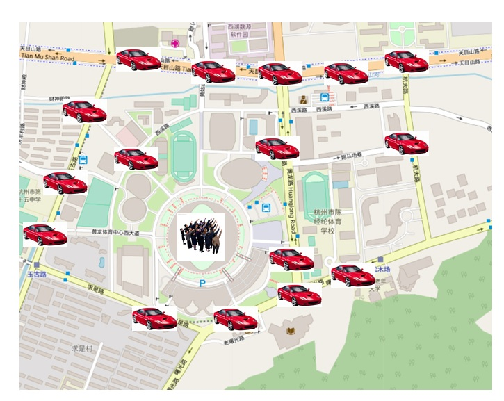

## PostgreSQL 滴滴派单 高峰区域集中打车冲突优化1 - 宇宙大爆炸理论与PostgreSQL实践      
                                                             
### 作者                                                             
digoal                                                             
                                                             
### 日期                                                             
2018-04-16                                                           
                                                             
### 标签                                                             
PostgreSQL , 大爆炸 , 冲突 , 打车集中 , 区域集中 , 锁冲突 , adlock       
                                                             
----                                                             
                                                             
## 背景         
在打车高峰时期，通常会出现某个区域打车的人特别多的情况，比如在下班时，写字楼。比如在演唱会结束时，演唱会现场。    
    
这个场景有一个特点，同一个点发出请求，按距离搜索最近的车，然后锁定车辆。    
    
在数据库中，如果大家都这么操作，会带来锁冲突的问题。我在上一篇文档中，介绍了adlock，可以大幅提高吞吐，但是还有一个隐藏的可以提升的点（而且可以提升非常多），如果所有人都是从同一个位置发起的锁定附近车辆请求，那么会出现冗余扫描+FILTER的情况。（因为A锁定了第一辆车后，B必须跳过第一辆车去锁定第二辆附近的车，然后是C必须跳过最近的前面2辆车，以此类推）并发越高，跳过的车辆越多。    
    
[《滴滴打车派单系统思考 数据库设计与实现 - 每月投入6140元, 1天最多可盈利117亿  -_-!》](../201804/20180414_03.md)      
    
怎么解决这个问题呢？    
    
未来优化3：对于同一个时刻，同一个地点，有多人打车时，如果都按同样的就近选择CAR的规则，会导致同一辆CAR被多次挑选中，本文使用了ADVISORY LOCK来避免行锁冲突。但是依旧有更好的优化，因为这种方法虽然没有了锁冲突，但是扫描依旧是从近到远的，所以    
可能并发时，一些会话存在多行扫描才找到没有被锁定的行。    有一种方法，比如，类似组提交，对同一个地点同时打车的多人，一次取多辆CAR，在程序中分配给不同的人。  还有一种方法，需要数据库内来实现，给一个离散因子，每次获取到的可能不是最近的CAR    
，满足多少米内的周边的CARs，随机挑选，但是这个随机挑选必须在INDEX中完成，必须保证在库中的index scan, heap scan都只扫一条。（类似索引的位点随机扫）       
    
## 从宇宙大爆炸开始    
    
    
宇宙大爆炸理论是说最开始宇宙是一个点，大爆炸开始后，一个点逐渐扩散，形成了现在的宇宙。    
    
滴滴打车的场景与之类似，打车高峰时，一个写字楼的人很多，集中在一个点，车辆在外围或附近，前面讲了如果大家都从这个点去计算与车辆的距离，对所有人来说，最近的车辆都是同一辆车，所以存在冲突的问题。    
    
    
    
思路是什么？    
    
把集中在写字楼一个位置的点打散，在计算离人最近的车辆时，就能够尽可能的避免冲突，从而减少filter，提高性能，提高吞吐。    
    
## 例子    
本文先举一个例子，空间数据的例子与此类似(无非就是X和Y轴都给定一个离散范围，进行离散)，下一篇文档再介绍。    
    
例如我们有1000万条记录，ID为PK，如果需求是找出与某个输入值最近的ID，并锁定它，如果它已被锁定，则锁定下一个与输入值最近的ID。    
    
例如输入值为50，    
    
优先锁定50，如果50已经被其他会话锁定了，则锁定49和51，以此类推。    
    
1、创建测试表    
    
```    
postgres=# create table a(id int primary key, info text, crt_time timestamp);    
CREATE TABLE    
```    
    
2、写入1000万测试数据    
    
```    
postgres=# insert into a select generate_series(1,10000000), 'test', now();    
```    
    
3、创建GIST索引，支持距离搜索操作符    
    
```    
postgres=# create extension btree_gist;    
CREATE EXTENSION    
postgres=# create index idx_a_1 on a using gist(id);    
```    
    
创建一个测试脚本，模拟高峰期打车的情况，（输入同一个点，去锁定离他最近的点，如果离它最近的点已经被锁定，则跳过）。我们这里同样使用pg_try_advisory_xact_lock()来实现跳过已经被锁定的记录。    
    
```    
vi test.sql    
    
select * from a where pg_try_advisory_xact_lock(id) order by id <-> 5000000 for update limit 1;    
```    
    
开启压测，可以达到约4.9万TPS    
    
```    
pgbench -M prepared -n -r -P 1 -f ./test.sql -c 56 -j 56 -T 120    
    
progress: 3.0 s, 45775.8 tps, lat 1.224 ms stddev 0.828    
progress: 4.0 s, 45571.5 tps, lat 1.229 ms stddev 0.826    
progress: 5.0 s, 49345.6 tps, lat 1.135 ms stddev 0.747    
progress: 6.0 s, 48948.0 tps, lat 1.144 ms stddev 0.856    
progress: 7.0 s, 49578.2 tps, lat 1.129 ms stddev 0.758    
```    
    
### 分析可优化的空间，filter    
    
前面介绍了，并发的从同一点去搜索附近的点，并锁定它，存在一个问题，（因为A锁定了第一辆车后，B必须跳过第一辆车去锁定第二辆附近的车，然后是C必须跳过最近的前面2辆车，以此类推）并发越高，跳过的车辆越多。    
    
通过下面的SQL可以观察到这个现象。    
    
1、会话A    
    
```    
postgres=# begin;    
BEGIN    
    
    
postgres=# explain (analyze,verbose,timing,costs,buffers) select * from a where pg_try_advisory_xact_lock(id) order by id <-> (5000000-500000+100) for update limit 1;    
                                                                QUERY PLAN                                                                    
------------------------------------------------------------------------------------------------------------------------------------------    
 Limit  (cost=0.42..0.54 rows=1 width=27) (actual time=0.096..0.097 rows=1 loops=1)    
   Output: id, info, crt_time, ((id <-> 4500100)), ctid    
   Buffers: shared hit=5    
   ->  LockRows  (cost=0.42..397168.88 rows=3333333 width=27) (actual time=0.095..0.095 rows=1 loops=1)    
         Output: id, info, crt_time, ((id <-> 4500100)), ctid    
         Buffers: shared hit=5    
         ->  Index Scan using idx_a_1 on public.a  (cost=0.42..363835.55 rows=3333333 width=27) (actual time=0.092..0.092 rows=1 loops=1)    
               Output: id, info, crt_time, (id <-> 4500100), ctid    
               Order By: (a.id <-> 4500100)    
               Filter: pg_try_advisory_xact_lock((a.id)::bigint)    
               Buffers: shared hit=4    
 Planning time: 0.111 ms    
 Execution time: 0.135 ms    
(13 rows)    
```    
    
2、会话B，在会话A没有释放锁之前，从同一个点发起请求，锁定附近的点。    
    
    
Rows Removed by Filter: 1    
    
```    
postgres=# explain (analyze,verbose,timing,costs,buffers) select * from a where pg_try_advisory_xact_lock(id) order by id <-> (5000000-500000+100) for update limit 1;    
                                                                QUERY PLAN                                                                    
------------------------------------------------------------------------------------------------------------------------------------------    
 Limit  (cost=0.42..0.54 rows=1 width=27) (actual time=0.128..0.128 rows=1 loops=1)    
   Output: id, info, crt_time, ((id <-> 4500100)), ctid    
   Buffers: shared hit=5    
   ->  LockRows  (cost=0.42..397168.88 rows=3333333 width=27) (actual time=0.127..0.127 rows=1 loops=1)    
         Output: id, info, crt_time, ((id <-> 4500100)), ctid    
         Buffers: shared hit=5    
         ->  Index Scan using idx_a_1 on public.a  (cost=0.42..363835.55 rows=3333333 width=27) (actual time=0.114..0.114 rows=1 loops=1)    
               Output: id, info, crt_time, (id <-> 4500100), ctid    
               Order By: (a.id <-> 4500100)    
               Filter: pg_try_advisory_xact_lock((a.id)::bigint)    
               Rows Removed by Filter: 1    
               Buffers: shared hit=4    
 Planning time: 0.112 ms    
 Execution time: 0.168 ms    
(14 rows)    
```    
    
可以看到，发生了FILTER，因为按距离来说，4500100才是需要被返回的，然而它已经被锁了，所以会跳过它，找到下一个可以锁的点。发生了一条FILTER。    
    
并发越多，rows removed by filter会越多，因为都是被锁定过的。造成性能影响。    
    
### 优化    
把一个点分散，例如我们把集中的点，打散到方圆1公里的平面上。（也就是说在搜索最近的车辆时，并不是拿你当前的定位来计算与车辆的距离。而是拿一个以你当前位置为中心，方圆一公里内的“随机点”来寻找这个点最近的车辆。）    
    
对于本例，我们设置一个范围值，比如把点打散到上下5千以内的一个随机点，再求离他最近的点，并锁定。    
    
```    
vi test.sql    
    
\set seed random(1,5000)    
select * from a where pg_try_advisory_xact_lock(id) order by id <-> (5000000+2500-:seed) for update limit 1;    
```    
    
压测结果    
    
```    
pgbench -M prepared -n -r -P 1 -f ./test.sql -c 56 -j 56 -T 120    
    
progress: 5.0 s, 150380.9 tps, lat 0.372 ms stddev 0.165    
progress: 6.0 s, 151711.9 tps, lat 0.369 ms stddev 0.168    
progress: 7.0 s, 152098.8 tps, lat 0.368 ms stddev 0.154    
progress: 8.0 s, 152003.3 tps, lat 0.368 ms stddev 0.156    
progress: 9.0 s, 152421.4 tps, lat 0.367 ms stddev 0.154    
progress: 10.0 s, 153108.7 tps, lat 0.366 ms stddev 0.148    
progress: 11.0 s, 151427.8 tps, lat 0.370 ms stddev 0.156    
```    
    
## 小结    
使用把集中点，按一个范围，随机打散的方法，锁定附近点的处理吞吐提升了3倍多，从4.9万提升到了15.1万。     
    
找到优化的方向，朝这个方向去优化，就会有性能的提升。这个思路对所有热点消除的应用场景都有帮助。       
    
[《滴滴打车派单系统思考 数据库设计与实现 - 每月投入6140元, 1天最多可盈利117亿  -_-!》](../201804/20180414_03.md)      
      
  
<a rel="nofollow" href="http://info.flagcounter.com/h9V1"  ></a>  
  
  
  
  
  
  
## [digoal's 大量PostgreSQL文章入口](https://github.com/digoal/blog/blob/master/README.md "22709685feb7cab07d30f30387f0a9ae")
  
