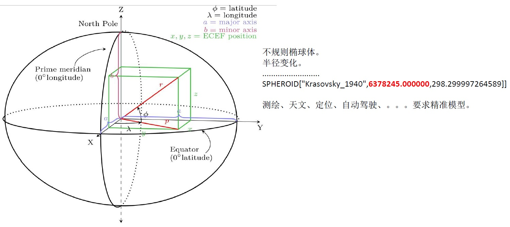

## 为什么geometry+GIST 比 geohash+BTREE更适合空间搜索 - 多出的不仅仅是20倍性能提升  
                                                               
### 作者                                                               
digoal                                                               
                                                               
### 日期                                                               
2018-04-17                                                            
                                                               
### 标签                                                               
PostgreSQL , gist , btree , 空间索引 , 范围扫描    
                                                               
----                                                               
                                                               
## 背景         
在PostgreSQL中，支持geohash, geometry, geograph三种空间存储结构。  
  
1、geohash，很多库都支持它，因为简单，将地球作为标准化的球体，展开抽象为一个平面，划分为若干个小方格，进行编码，相邻的小方格的编码前缀一样。  
  
  
  
  
  
geohash 每一个小方块的精度与编码长度有关（这个说法也不完全准确，因为是基于地球是标准球体的前提），如下:   
  
  
  
2、由于地球并非标准球体，也非标准的椭球体，所以geohash精度有硬性的缺陷，geometry与geograph类型，可以解决这个问题。  
  
  
  
对于GIS来说，首先是坐标系，有两种：一种是球坐标（地理坐标），另一种是平面坐标（投影坐标）。      
    
球坐标通常用于计算，平面坐标通常用于展示（也可以计算）。    
      
投影坐标是从球坐标投影后展开得来(用一个圆柱将地球包起来，把地球当成会发光的光源，投影后，将圆柱展开得到)，投影的范围越大，精度就越低。范围越小，  
  
计算距离，应该考虑到被计算的两点所在处的地球特性（spheroid）。这样计算得到的距离才是最精确的。      
      
geometry和geography类型的选择，建议使用geometry，既能支持球坐标系，又能支持平面坐标系。主要考虑到用户是否了解位置所在处的地理特性，选择合适的坐标系。      
      
目前用得最多的有SRID=4326球坐标，SRID为EPSG:3785的墨卡托投影坐标。    
        
再来说geometry和geography两种类型，geometry支持平面对象也支持空间对象，而geography则仅支持空间对象。      
      
geometry支持更多的函数，一些几何计算的代价更低。      
      
geography支持的函数略少，计算代价更高。但是对于跨度较大地域性的业务，就需要使用geography，因为它的精度不受制于区域。  
  
If your data is contained in a small area, you might find that choosing an appropriate       
projection and using GEOMETRY is the best solution, in terms of performance and functionality available.      
      
If your data is global or covers a continental region, you may find that GEOGRAPHY       
allows you to build a system without having to worry about projection details.       
You store your data in longitude/latitude, and use the functions that have been defined on GEOGRAPHY.      
      
If you don't understand projections, and you don't want to learn about them,       
and you're prepared to accept the limitations in functionality available in GEOGRAPHY,       
then it might be easier for you to use GEOGRAPHY than GEOMETRY.       
Simply load your data up as longitude/latitude and go from there.     
  
除了空间模型上的差异，geohash与geometry, geograph还有功能、性能上的差异。  
  
性能方面主要体现在GEOHASH的编码精度会带来一些问题：  
  
1、由于GEOHASH编码的问题，我们在搜索某一个点附近N米内的对象时，会引入空间放大，理论上我们要的是以目标点为中心，距离为半径的一个圆内的数据。  
  
  
  
如果只看前缀的话，这个放大会随着编码长度缩短而级数增加。  
  
  
  
然而，使用geometry的距离搜索，不会引入放大问题，使用GIST索引按距离排序输出加上st_dwithin约束，返回的一定是在圆圈内的数据，并且不造成额外的RECHECK FILTER。  
  
  
  
又比如在GIS北京峰会上探探的一个案例，搜索附近的10家餐馆，在POI密集的地方，一个小的BOX可就圈出几千家餐馆了，而在偏远地区，你就需要一个较大的BOX，还不一定能圈到10家餐馆。  
  
  
    
2、当我们需要搜索的是任意多边形时，GEOHASH也无法满足需求，需要进行大范围的匹配，然后再逐条进行空间计算过滤。  
  
## 几种地理数据的扫描方法  
### 1、geohash 前缀扫描，匹配在这个正方形块内的数据  
  
```  
postgres=# create table t_test(  
  id int,   
  pos text,   -- geohash  
  geo geometry  -- geometry  
);  
CREATE TABLE  
  
postgres=# insert into t_test   
select id,   
st_geohash(st_setsrid(st_point(x,y),4326), 13),   
st_setsrid(st_point(x,y),4326)   
from (  
  select id, 120+30*random() x, 68+5*random() y   
  from generate_series(1,100000) t(id)   
) t;  
INSERT 0 100000  
```  
  
```  
postgres=# select * from t_test limit 10;  
 id |      pos      |                        geo                           
----+---------------+----------------------------------------------------  
  1 | yu0j8y2pxsezp | 0101000020E61000000000625C21F25E400000510228205140  
  2 | zhsfe7t2cbtzz | 0101000020E6100000008049BE8DBA61400080CB2C5DB15140  
  3 | zhcydqptr7bkd | 0101000020E6100000000061ED403261400000A01B4B395240  
  4 | yuhdce4q6u7t6 | 0101000020E610000000808C51B6446040008055F70F005140  
  5 | yus98nqjtdf4r | 0101000020E610000000803D75C54260400080923722A75140  
  6 | zk9grxnsqxv98 | 0101000020E61000000000787897A16240008086A312BB5140  
  7 | yurhhfh33u5xm | 0101000020E61000000080C877DEB96040008031E3B7675140  
  8 | zhk5qv4vhe10k | 0101000020E610000000002A889E9D61400080CA5360605140  
  9 | zhm49th6m0h5y | 0101000020E61000000000C79D4DC361400000B456E8575140  
 10 | zh95n0wvxkpv5 | 0101000020E610000000808F92BE1561400000A9D5FCB55140  
(10 rows)  
```  
  
```  
postgres=# create index idx_t_test_1 on t_test (pos text_pattern_ops);  
CREATE INDEX  
```  
  
```  
postgres=# explain select * from t_test where pos ~ '^yuhdce4';  
                                 QUERY PLAN                                    
-----------------------------------------------------------------------------  
 Index Scan using idx_t_test_1 on t_test  (cost=0.42..2.64 rows=10 width=50)  
   Index Cond: ((pos ~>=~ 'yuhdce4'::text) AND (pos ~<~ 'yuhdce5'::text))  
   Filter: (pos ~ '^yuhdce4'::text)  
(3 rows)  
  
postgres=# explain select * from t_test where pos like 'yuhdce4%';  
                                 QUERY PLAN                                    
-----------------------------------------------------------------------------  
 Index Scan using idx_t_test_1 on t_test  (cost=0.42..2.64 rows=10 width=50)  
   Index Cond: ((pos ~>=~ 'yuhdce4'::text) AND (pos ~<~ 'yuhdce5'::text))  
   Filter: (pos ~~ 'yuhdce4%'::text)  
(3 rows)  
```  
  
### 2、geohash 范围扫描，匹配在一个连续Z空间中的一段小方格  
  
  
将二进制编码的结果填写到空间中，当将空间划分为四块时候，编码的顺序分别是左下角00，左上角01，右下脚10，右上角11，也就是类似于Z的曲线，当我们递归的将各个块分解成更小的子块时，编码的顺序是自相似的（分形），每一个子快也形成Z曲线，这种类型的曲线被称为Peano空间填充曲线。  
  
```  
postgres=# explain select * from t_test where pos ~>=~ 'yuhdce4' and pos ~<=~ 'yuhdcej';  
                                 QUERY PLAN                                   
----------------------------------------------------------------------------  
 Index Scan using idx_t_test_1 on t_test  (cost=0.42..2.64 rows=1 width=50)  
   Index Cond: ((pos ~>=~ 'yuhdce4'::text) AND (pos ~<=~ 'yuhdcej'::text))  
(2 rows)  
```  
  
### 3、经度与维度范围扫描，将经度与维度分开两个字段存储。扫描得到的是一个落在经纬度区间内的长方形区间。  
  
```  
create table t_geo (id int, x float, y float);  
  
insert into t_geo   
  select id, 120+30*random() x, 68+5*random() y   
  from generate_series(1,100000) t(id) ;  
```  
  
```  
postgres=# create index idx_t_geo_1 on t_geo (x,y);  
CREATE INDEX  
  
postgres=# explain select * from t_geo where x >= 120 and x <=124 and y >= 68 and y <=71;  
                                                                      QUERY PLAN                                                                         
-------------------------------------------------------------------------------------------------------------------------------------------------------  
 Index Scan using idx_t_geo_1 on t_geo  (cost=0.42..1029.31 rows=7810 width=20)  
   Index Cond: ((x >= '120'::double precision) AND (x <= '124'::double precision) AND (y >= '68'::double precision) AND (y <= '71'::double precision))  
(2 rows)  
```  
  
### 4、GEOMETRY GIS空间扫描  
  
gist 是基于gist的r-tree，每一层为一个BOUND，当需要搜索包含、相交、近邻时，可以快速定位到与你输入的对象 包含、相交、近邻 的对象。   
  
详细结构建本文末尾的参考部分。  
  
```  
create index idx_t_test_2 on t_test using gist (geo);  
```  
  
GIST索引不仅支持空间检索，还支持空间排序。  
  
```  
postgres=# explain select * from t_test where st_dwithin(geo, st_setsrid(st_point(121, 70), 4326), 10000) order by geo <-> st_setsrid(st_point(121, 70), 4326);  
                                                                                                                QUERY PLAN                             
-------------------------------------------------------------------------------------------------------------------------------------------------  
 Index Scan using idx_t_test_2 on t_test  (cost=0.28..29263.75 rows=6667 width=58)  
   Index Cond: (geo && '0103000020E6100000010000000500000000000000804BC3C0000000000065C3C000000000804BC3C00000000000ABC3400000000080C4C3400000000000ABC3400000000080C4C340000000000065C3C000000000804BC3C0000000000065C3C0'::geometry)  
   Order By: (geo <-> '0101000020E61000000000000000405E400000000000805140'::geometry)  
   Filter: (('0101000020E61000000000000000405E400000000000805140'::geometry && st_expand(geo, '10000'::double precision)) AND _st_dwithin(geo, '0101000020E61000000000000000405E400000000000805140'::geometry, '10000'::double precision))  
(4 rows)  
```  
  
在LBS项目中，按距离由近到远排序输出，是非常强烈的需求。  
  
## 性能对比  
GIST索引比两个字段复合索引要快很多，原因是复合索引在驱动列使用范围时，这个范围下的所有ENTRY都要被扫描。  
  
同样的测试对比如下：  
  
[《PostgreSQL 黑科技 range 类型及 gist index 20x+ speedup than Mysql index combine query》](../201206/20120607_01.md)    
  
## 小结  
1、GEOHASH，适合对精度没有要求（例如本土化，小范围的业务），并且舍得浪费计算资源的场景（因为颗粒度大，所以通过索引圈出的区域，可能有很多无效数据，需要大量RECHECK），同时GEOHASH不支持排序，所以需要额外的排序开销。  
  
2、geometry，空间索引，适合对精度要求高的场景，且节约资源。适合专业的GIS业务。geometry使用时，需要注意选择正确的坐标系。geograph则对坐标系没有要求。  
  
3、在一个对象稀疏的区域，圈出附近100个点。与在一个对象密集的区域，圈出附近100个点。使用GEOHASH完全不知所措，因为你不知道该用多大的PREFIX合适，而使用geometry+gist，非常容易且高效率的解决这个问题。  
  
```  
select * from tbl where pos ~ '^geohash_多长合适呢? 不知道' limit 100;  
```  
  
```  
select * from tbl order by geo <-> 点 limit 100;  
```  
  
在PG里面，我们同时支持geohash, geometry, geograph三种空间存储，你喜欢什么样的姿势，就用什么样样的姿势。这就是我们喜爱的PostgreSQL。  
  
## 参考  
[《geohash vs PostGIS》](../201704/20170422_01.md)    
  
[《PostgreSQL 黑科技 - 空间聚集存储, 内窥GIN, GiST, SP-GiST索引》](../201709/20170905_01.md)    
  
[《通过空间思想理解GiST索引的构造》](../201708/20170825_01.md)    
  
[《PostGIS空间索引(GiST、BRIN、R-Tree)选择、优化 - 阿里云RDS PostgreSQL最佳实践》](../201708/20170820_01.md)    
  
[《自动选择正确索引访问接口(btree,hash,gin,gist,sp-gist,brin,bitmap...)的方法》](../201706/20170617_01.md)    
  
[《深入浅出PostgreSQL B-Tree索引结构》](../201605/20160528_01.md)    
  
[《HTAP数据库 PostgreSQL 场景与性能测试之 6 - (OLTP) 空间应用 - KNN查询（搜索附近对象，由近到远排序输出）》](../201711/20171107_07.md)    
  
[《GIS附近查找性能优化 - PostGIS long lat geometry distance search tuning using gist knn function》](../201308/20130806_01.md)    
  
[《PostGIS 距离计算建议 - 投影 与 球 坐标系, geometry 与 geography 类型》](../201710/20171018_02.md)    
  
http://www.cnblogs.com/LBSer/p/3310455.html  
  
<a rel="nofollow" href="http://info.flagcounter.com/h9V1"  ></a>  
  
  
  
  
  
  
## [digoal's 大量PostgreSQL文章入口](https://github.com/digoal/blog/blob/master/README.md "22709685feb7cab07d30f30387f0a9ae")
  
