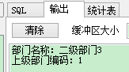
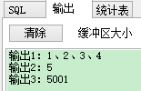
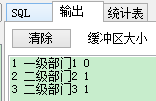
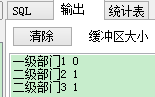

## [转载] Oracle record、varray、table和%type、%rowtype的使用详解  
                                                             
### 作者                                                             
digoal                                                             
                                                             
### 日期                                                             
2018-04-23                                                           
                                                             
### 标签                                                             
PostgreSQL , Oracle , PL/SQL   
                                                             
----                                                             
                                                             
## 背景     
## 原文  
http://www.ibloger.net/article/230.html  
  
## 1  说明  
### 1.1  RECORD  
定义记录数据类型。它类似于c语言中的结构数据类型(structure)，pl/sql提供了将几个相关的、分离的、基本数据类型的变量组成一个整体的方法，即record复合数据类型。在使用记录数据类型变量时，需要在声明部分先定义记录的组成、记录的变量，然后在执行部分引用该记录变量本身或其中的成员。  
  
定义记录数据类型的语法如下：  
  
```  
type record_name is record(  
    v1  data_type1 [not null][:=default_value],  
    v2  data_type2 [not null][:=default_value],  
    vn  data_typen [not null][:=default_value]  
);  
```  
  
### 1.2  VARRAY  
数组是具有相同数据类型的一组成员的集合。每个成员都有一个唯一的下标，它取决于成员在数组中的位置。在pl/sql中，数组数据类型是varray（variable array，即可变数组）。  
  
定义varray数据类型的语法如下：  
  
```  
type varray_nameis varray(size) of element_type [not null];  
```  
  
其中，varray_name是varray数据类型的名称，size是正整数，表示可以容纳的成员的最大数量，每个成员的数据类型是element_typeo默认时，成员可以取空值，否则需要使用not null加以限制。  
  
### 1.3  TABLE  
定义记录表（或索引表）数据类型。它与记录类型相似，但它是对记录类型的扩展。它可以处理多行记录，类似于c语言中的二维数组，使得可以在pl/sql中模仿数据库中的表。  
  
定义记录表类型的语法如下：  
  
```  
  type table name is table of element_type [not null]  
  index by [binary_integer|pls_integer|varray2];  
```  
  
关键字index by表示创建一个主键索引，以便引用记录表变量中的特定行。  
  
binary_integer的说明  
  
如语句：type numbers  is table of number index by binary_integer;其作用是，加了”index bybinary_integer ”后，numbers类型的下标就是自增长，numbers类型在插入元素时，不需要初始化，不需要每次extend增加一个空间。  
  
而如果没有这句话“indexby binary_integer”，那就得要显示对初始化，且每插入一个元素到numbers类型的table中时，都需要先extend。  
  
## 2 举例  
### 2.1  创建表结构以及数据准备  
```  
--组织机构结构表      
create table sf_org(      
    org_id int not null, --组织机构主键id      
    org_name varchar2(50),--组织机构名称      
    parent_id int--组织机构的父级      
)      
      
--一级组织机构      
insert into sf_org(org_id, org_name, parent_id) values(1, '一级部门1',0);      
      
--二级部门      
      
insert into sf_org(org_id, org_name, parent_id) values(2, '二级部门2',1);      
insert into sf_org(org_id, org_name, parent_id) values(3, '二级部门3',1);      
insert into sf_org(org_id, org_name, parent_id) values(4, '二级部门4',1);  
```  
  
### 2.2  RECORD的使用举例  
先定义一个只与sf_org表中某几个列的数据类型相同的记录数据类型type_org_record，然后声明一个该数据类型的记录变量v_org_record，最后用替换变量&org_id接受输入的雇员编码，查询并显示该雇员的这几列中的信息。注意，在使用record数据类型的变量时要用“.”运算符指定记录变量名限定词。  
  
一个记录类型的变量只能保存从数据库中查询出的一行记录，如果查询出了多行记录，就会出现错误。  
  
```  
--  RECORD的使用举例    
declare       
  type type_org_record is record(      
     v_name    sf_org.org_name%type,    
     v_parent  sf_org.parent_id%type);    
         
     v_record  type_org_record;    
begin      
  select org_name, parent_id into v_record from sf_org so      
  where so.org_id = &org_id;      
        dbms_output.put_line('部门名称：' || v_record.v_name);      
        dbms_output.put_line('上级部门编码：' || to_char(v_record.v_parent));      
end;  
```  
  
执行时会弹出一个输入框，如下图，执行完毕以后可以在输出中查看效果  
  
  
  
  
  
### 2.3   VARRAY的使用举例  
先定义一个能保存5个varchar2(25)数据类型的成员的varray数据类型org_varray_type，然后声明一个该数据类型的varray变量v_org_varray，最后用与org_varray_type数据类型同名的构造函数语法给v_org_varray变量赋予初值并显示赋值结果。  
  
注意，在引用数组中的成员时．需要在一对括号中使用顺序下标，下标从1开始而不是从0开始。  
  
```  
---  VARRAY的使用举例    
declare       
  type org_varray_type is varray(5) of varchar2(25);      
  v_arr_set org_varray_type;      
begin      
  v_arr_set := org_varray_type('1','2','3','4','5');      
  dbms_output.put_line('输出1：' || v_arr_set(1) || '、'|| v_arr_set(2) || '、'|| v_arr_set(3) || '、'|| v_arr_set(4));      
  dbms_output.put_line('输出2：' || v_arr_set(5));      
  v_arr_set(5) := '5001';      
  dbms_output.put_line('输出3：' || v_arr_set(5));      
end;  
```  
  
  
  
### 2.4  TABLE使用举例  
#### 2.4.1  存储单列多行  
这个和varray类似。但是赋值方式稍微有点不同，不能使用同名的构造函数进行赋值。具体的如下：  
  
```  
-- 存储单列多行    
declare       
  type org_table_type is table of varchar2(25)      
  index by binary_integer;      
  v_org_table org_table_type;      
begin      
  v_org_table(1) := '1';      
  v_org_table(2) := '2';      
  v_org_table(3) := '3';      
  v_org_table(4) := '4';      
  v_org_table(5) := '5';      
  dbms_output.put_line('输出1：' || v_org_table(1) || '、'|| v_org_table(2) || '、'|| v_org_table(3) || '、'|| v_org_table(4)||'、'|| v_org_table(5));      
end;  
```  
  
#### 2.4.2   存储多列多行和ROWTYPE结合使用  
采用bulkcollect可以将查询结果一次性地加载到collections中。而不是通过cursor一条一条地处理。  
  
```  
-- 存储多列多行和rowtype结合使用    
declare       
   type t_type is table of sf_org%rowtype;      
   v_type  t_type;      
 begin      
    select org_id, org_name, parent_id bulk collect into v_type from sf_org where sf_org.org_id <= 3;      
      
    for v_index in v_type.first .. v_type.last loop      
        dbms_output.put_line(v_type(v_index).org_id ||' '|| v_type(v_index).org_name ||' '|| v_type(v_index).parent_id );      
    end loop;      
 end;  
```  
  
  
  
#### 2.4.3  存储多列多行和RECORD结合使用  
采用bulkcollect可以将查询结果一次性地加载到collections中。而不是通过cursor一条一条地处理。  
  
```  
-- 存储多列多行和RECORD结合使用    
declare       
   type test_emp is record      
   (      
    c1  sf_org.org_name%type,      
    c2  sf_org.parent_id%type      
   );         
   type t_type is table of test_emp;      
   v_type  t_type;      
 begin      
    select org_name, parent_id bulk collect into v_type from sf_org where sf_org.org_id <= 3;      
      
    for v_index in v_type.first .. v_type.last loop      
        dbms_output.put_line(v_type(v_index).c1 || ' ' || v_type(v_index).c2);      
    end loop;      
 end;  
```  
  
  
  
## 3 问题  
varry和table集合不能直接对其进行查询。只能对其进行遍历。  
  
## 4 其他  
在我的Oracle 创建 split 和 splitstr 函数文章中，有包含table的查询示例图：  
  
http://www.ibloger.net/article/232.html  
  
```%TYPE```说明  
  
为了使一个变量的数据类型与另一个已经定义了的变量（尤其是表的某一列）的数据类型相一致，Oracle提供了```%TYPE```定义方式。当被参照的那个变量的数据类型改变了之后，这个新定义的变量的数据类型会自动跟随其改变，容易保持一致，也不用修改PL/SQL程序了。当不能确切地知道被参照的那个变量的数据类型时，就只能采用这种方法定义变量的数据类型。  
  
```%ROWTYP```说明  
  
如果一个表有较多的列，使用%rowtype来定义一个表示表中一行记录的变量，比分别使用```%type```来定义表示表中各个列的变量要简洁得多，并且不容易遗漏、出错。这样会增加程序的可维护性。  
  
为了使一个变量的数据类型与一个表中记录的各个列的数据类型相对应、一致，oracle提供```%rowtype```定义方式。当表的某些列的数据类型改变了之后，这个新定义的变量的数据类型会自动跟随其改变，容易保持一致，也不用修改pl/sql程序了。当不能确切地知道被参照的那个表的结构及其数据类型时，就只能采用这种方法定义变量的数据类型。  
  
<a rel="nofollow" href="http://info.flagcounter.com/h9V1"  ></a>  
  
  
  
  
  
  
## [digoal's 大量PostgreSQL文章入口](https://github.com/digoal/blog/blob/master/README.md "22709685feb7cab07d30f30387f0a9ae")
  
