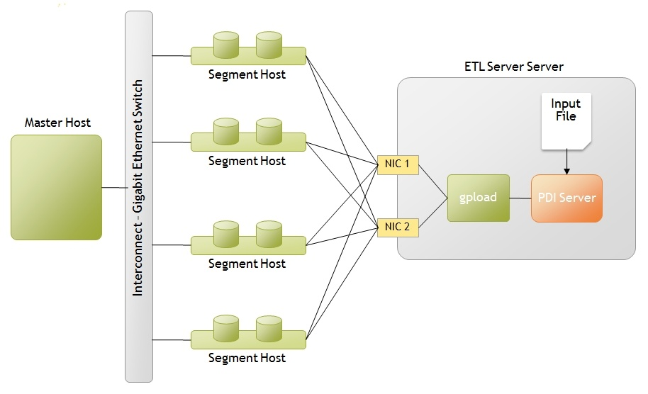
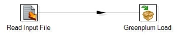
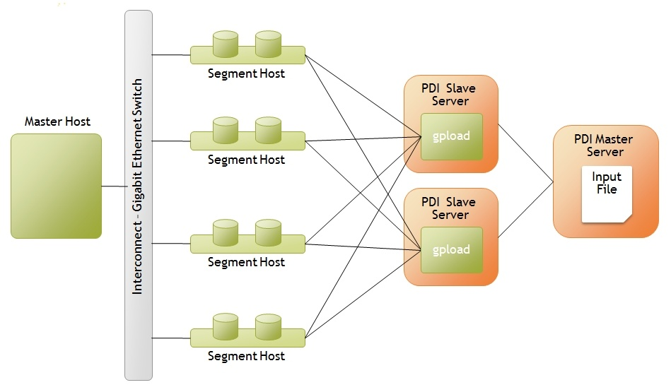
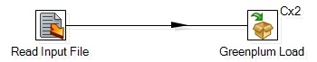

## ETL for Oracle to Greenplum (bulk) - Pentaho Data Integrator (PDI, kettle)  
  
### 作者  
digoal  
  
### 日期  
2018-05-05  
  
### 标签  
PostgreSQL , Greenplum , Oracle , ETL , Pentaho Data Integrator , PDI , kettle  
  
----  
  
## 背景  
使用pentaho，结合gpfdist, gpload，Greenplum作为目标库，ETL批量写入GPDB。  
  
## 原文  
  
https://wiki.pentaho.com/display/EAI/Greenplum+Load  
  
## 正文  
## Greenplum Load  
## Description  
The Greenplum Load step wraps the Greenplum GPLoad data loading utility. The GPLoad data loading utility is used for massively parallel data loading using Greenplum's external table parallel loading feature. Typical deployment scenarios for performing parallel loading to Greenplum include:  
  
### Single ETL Server, Multiple NICs  
  
  
This deployment highlights a scenario where you have a single ETL server with two Network Interface Cards (NICs )and you want to perform parallel data loading across the NICs. A simple transformation then to load data from the input file (located on the ETL Server) in parallel would look like the following:  
  
  
  
The Greenplum load step would be configured with a local hostname definition for each NIC on the server.  When executed, PDI will generate the necessary YAML control file:   
  
```  
VERSION: 1.0.0.1  
DATABASE: foodmart  
USER: gpadmin  
HOST: 192.168.1.42  
PORT: 5432  
GPLOAD:  
   INPUT:  
    - SOURCE:  
        LOCAL_HOSTNAME:  
          - etl1-1  
          - etl1-2  
        FILE: ['load0.dat']  
    - FORMAT: TEXT  
    - DELIMITER: ','  
    - QUOTE: ''  
    - HEADER: FALSE  
    - ERROR_LIMIT: 50  
    - ERROR_TABLE: err_customer  
   OUTPUT:  
    - TABLE: samples_customer  
    - MODE: insert  
```  
  
and the data file. gpload is executed using the following command:   
  
```  
/user/local/greenplum-db/bin/gpload -f control10.dat  
```  
  
### Multiple ETL Servers  
  
  
This scenario depicts where there are several physical ETL servers and the PDI Transformation is to be executed in clustered mode.  To setup this configuration, perform the following steps:  
  
1、Setup a cluster of three PDI servers, two slaves and one master  
  
2、Build a simple transformation reading from the input file (which needs to reside on the master node of your PDI cluster) and a Greenplum Load step  
  
3、Right-click on the Greenplum load step, select 'Clusterings...' and select the cluster you defined in step 1  
  
You should now have a transformation similar to:  
  
  
  
When executed, the PDI master will evenly distribute rows from the input file to each of the PDI slave servers which will in turn call gpload to load their portion of the data.  
  
For information on how to install and configure GPload and GPfdist, please refer to the Greenplum Administration Guide.  
  
### Options  
Option|Description  
---|---  
Step name | Name of the step.   Note: This name has to be unique in a single transformation.  
Connection | The database connection(JDBC) to which you will be loading data.  Note that you must set $PGPASSWORD in the environment where gpload executes, the password is not transfered to the gpload process from kettle.   
Target schema | The name of the Schema for the table to write data to.   
Target table | The name of the target table to write data to.   
Load method | Defines whether to actually call gpload (Automatic) after generating the configuration and data files or stop execution after the files are created (Manual) so that gpload could be run manually at a later time.   
Erase cfg/dat files after use | Configure whether or not you want the control and data files generated to be removed after execution of the transformation.   
  
### Fields Tab  
Option|Description  
---|---  
Load action | Defines the type of load you wish to perform: <br><br> INSERT - loads data into the target table. <br><br> UPDATE  - Updates the UPDATE_COLUMNS of the target table where the rows have MATCH_COLUMNS attribute values equal to those of the input data, and the optional UPDATE_CONDITION is true. <br><br> MERGE - Inserts new rows and updates existing ones.  <br><br> New rows are identified when the MATCH_COLUMNS value in the source data does not have a corresponding value in the target table. <br> If the rows do exist then the UPDATE_COLUMNS are updated. <br><br> If there are multiple new MATCH_COLUMNS values that are the same, only one new row for that value will be inserted (use UPDATE_CONDITION to filter out the rows you want to discard). MERGE is not supported on tables with a random distribution policy.  
Get Field | Click this button to retrieve a list of potential fields to load based on the input fields coming into this step.  
Edit Mapping | Click this button to open the mapping editor allowing you to change the mapping between fields from the source data file and the corresponding field the data will be written to in the target table.  
Table Field | Name of the column in the "Target Table" that maps to a "Stream field"  
Stream Field | Name of a field input stream. The data in this field will be loaded into the database column specified by "Table Field".  
Date Mask | The date mask to use of the "Stream Field" is a date type.  
Match | Boolean. Setting to "Y" indicates that the column is to be used in the "match criteria" of the join condition of the update. <br><br>The attribute value in the specified target column(s) must be equal to that of the corresponding source data column(s) in order for the row to be updated in the target table. <br><br> If an UPDATE or MERGE "Load Action" is to be performed then at least on column must specified as the "match criteria".  
Update | Boolean. If set to ""Y then the column will be updated for the rows that meet the "match criteria".  
Update condition | Optional. Specifies a Boolean condition, similar to what you would declare in a SQL WHERE clause, that must be met in order for a row in the target table to be updated or inserted, in the case of a MERGE.  
  
### Local Host Names Tab  
Option|Description  
---|---  
Port | Optional.  Specifies the specific port number that the gpfdist file distribution program should use.  If not specified and Hostname(s) are specified then the default is an available port between 8000 and 9000.   
Hostname | Optional.  Specifies the host name or IP address of the local machine on which gpload is running. If the host is using several NIC cards then the host name or IP address of each NIC card can be specified.  
  
### GP Configuration tab  
Option|Description  
---|---  
Path to the gpload | The path to where the GPload utility is installed.   
Control file | Defines the name of the GPload control file that will be generated. <br><br> Note: when executing the Greenplum Load step in a clustered configuration (multiple ETL servers), it is recommended that you use variables to create unique file names for each copy of the step.  For example: <br><br> control${Internal.Step.CopyNr}.cfg  
Error table | Defines the target table where error records will be written to.   If the table exists it will not be truncated before the load.  If the table does not exist it will be created.   
Maximum errors | Defines the maximum number of errors to allow before the load operation is aborted.  Erros are logged to the specified "Error Table".   
Log file | Specify the location for where GPload will write log information.  This information is what would be displayed in a terminal or window if gpload was executed at the command line.   
Data file | Defines the name of the Data file(s) that will be written for subsequent loading in the target tables by GPload. <br><br> Note: when executing the Greenplum Load step in a clustered configuration (multiple ETL servers), it is recommended that you use variables to create unique file names for each copy of the step.  For example: <br><br> load${Internal.Step.CopyNr}.dat  
Delimiter | Delimits the fields written to "Data file". This delimiter is then specified in the generated control file.  
Encoding | Specify the character set encoding of the data file.  Supported encodings are:  <br><br>       BIG5, EUC_CN, EUC_JP, EUC_KR, EUC_TW, GB18030, GBK, ISO-8859-1, ISO_8859_5, ISO_8859_6, ISO_8859_7, ISO_8859_8, JOHAB, KOI8, LATIN1, LATIN2, LATIN3, LATIN4, LATIN5, LATIN6, LATIN7, LATIN8, LATIN9, LATIN10, MULE_INTERNAL, SJIS, SQL_ASCII, UHC, UTF8, WIN866, WIN874, WIN1250, WIN1251, WIN1252, WIN1253, WIN1254, WIN1255, WIN1256, WIN1257, WIN1258  
  
### Example  
The attached transformation, GPLoad-localhost-variables, demonstrates how environmental variables can be used in the Greenplum Load step to defined local hosts.  
  
### Metadata Injection Support (7.x and later)  
All fields of this step support metadata injection. You can use this step with [ETL Metadata Injection](https://help.pentaho.com/Documentation/8.0/Products/Data_Integration/Transformation_Step_Reference/ETL_Metadata_Injection) to pass metadata to your transformation at runtime.  
  
## 参考
https://help.pentaho.com/Documentation/8.0/Products/Data_Integration/Transformation_Step_Reference#replacements  
  
<a rel="nofollow" href="http://info.flagcounter.com/h9V1"  ></a>  
  
  
  
  
  
  
## [digoal's 大量PostgreSQL文章入口](https://github.com/digoal/blog/blob/master/README.md "22709685feb7cab07d30f30387f0a9ae")
  
