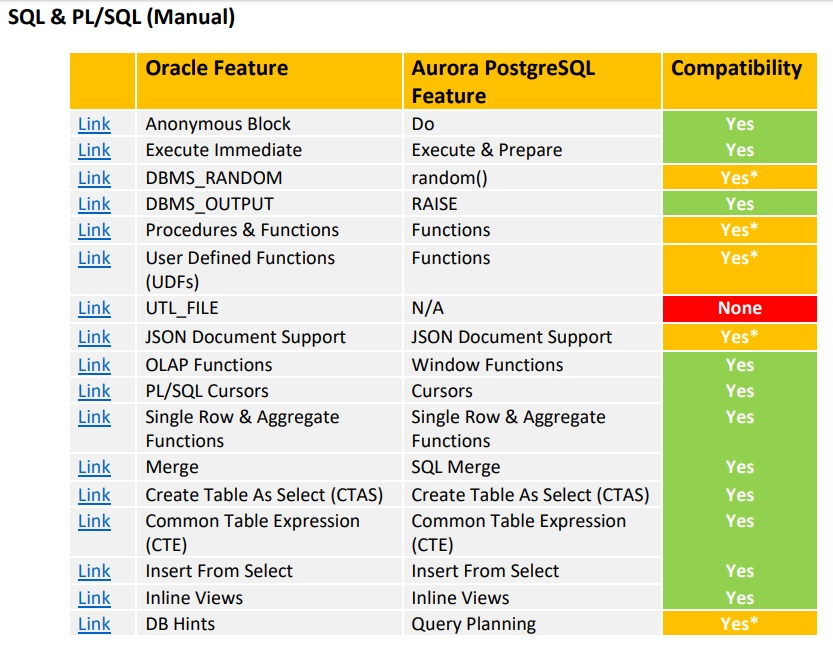
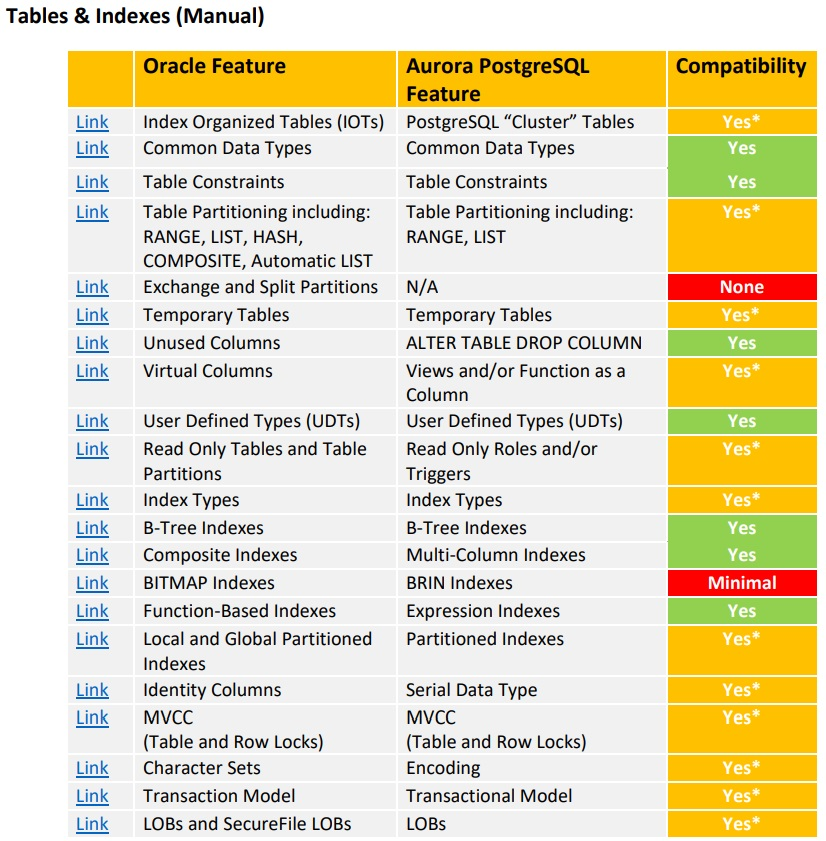
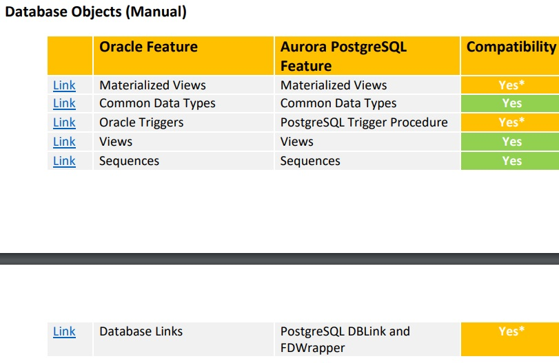
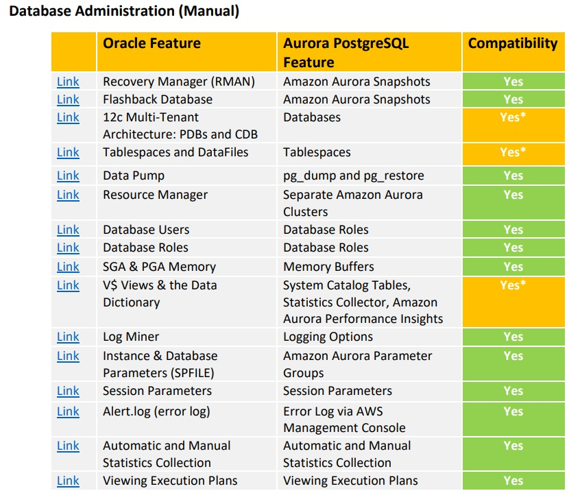

## Migration Oracle to PostgreSQL "百家"文档集    
      
### 作者      
digoal      
      
### 日期      
2018-05-05      
      
### 标签      
PostgreSQL , Oracle     
      
----      
      
## 背景     
      
## 2002 Porting from Oracle to PostgreSQL    
[《PDF Download》](20180505_06_pdf_003.pdf)    
    
### Agenda    
* SQL Syntax, Functions, Sequences, Etc.     
* Database Server General Characteristics    
* Data Types and JDBC     
* Other Considerations:     
* References:     
    
## 2008 Porting Oracle Applications to PostgreSQL    
[《PDF Download》](20180505_06_pdf_004.pdf)    
    
### Agenda    
* Porting the SQL    
* Porting Tools    
* PL/SQL vs. PL/pgSQL    
* Interfaces    
* Project Management    
  
## 2011 Oracle to Postgres Migration    
[《PDF Download》](20180505_06_pdf_001.pdf)    
    
### Agenda    
* Schema Migration    
* Data Type Migration    
* Data Migration    
* Business Logic Migration    
* Other Objects    
* Connectors / Drivers / Libraries    
* Application / SQL Migration    
* DBA Migration    
* Tools    
* Ora2pg    
  
## 2011 Migration to PostgreSQL - preparation and methodology
[《PDF Download》](20180505_06_pdf_010.pdf)  
  
### Agenda
* Oracle to PG
* Informix to PG
* MySQL to PG
* MSSQL to PG
* Replication and/or HA
* DIS
  
## 2012 Migrating Oracle queries to PostgreSQL    
推荐    
    
[《PDF Download》](20180505_06_pdf_009.pdf)    
    
### Agenda    
Why?    
How?    
Data migration    
Query conversion    
    
## 2016 PostgreSQL Porting Guide    
https://github.com/spacewalkproject/spacewalk/wiki/PostgreSQLPortingGuide    
    
### Agenda    
* General rules    
* Problems and how to solve them    
  * The VARCHAR-NULL problem    
  * The DECODE/NVL2 functions problem    
  * The NVL function problem    
  * JOIN in ANSI syntax    
  * SELECT column AS alias    
  * Default cast to integer    
  * The sysdate problem    
  * Date arithmetics    
  * Triggers must return something    
  * Triggers mustn't touch old if they are on insert    
  * Procedure call from Hibernate    
  * ORDER BY expression in DISTINCT select    
  * Rownum problem    
  * Subquery with no alias    
  * Composite type accessing    
  * Concatenating of evr    
  * Global function evr_t_as_vre_simple    
  * No autonomous transactions    
  * NUMBER to NUMERIC    
  * Calling procedures    
  * SELECT UNIQUE    
  * TO_NUMBER function    
  * TO_DATE function    
  * DELETE without FROM    
  * DUAL table    
  * MINUS keyword    
  * Bind parameter with space    
  * Portable nextval    
  * Recursion with opened cursors    
  * Anonymous procedural SQL blocks, in Python (backend)    
  * Relation (table) does not exists    
  * Inserting / writing blob in Python (backend)    
    
## 2016 Migrations to PostgreSQL (from Oracle)    
[《PDF Download》](20180505_06_pdf_005.pdf)    
    
### Agenda    
* Why migrate to PostgreSQL ?    
* Migration process - overview    
* Preliminary Migration Analysis    
* Migration challenges    
* Database Design / Architecture    
* High Availability challenges    
* Development challenges (database)    
* Database migration    
* Schema Migration    
* PL/SQL Migration    
* Data Migration    
* Migration Large Objects    
* Pg_largeobjects - Limitation    
* Migrating JSON Data    
* Development challenges (Migrating Oracle SQLs for Application)    
* SQLs Migration for application    
    
## 2016 Oracle to Postgres Migration    
[《PDF Download》](20180505_06_pdf_007.pdf)    
    
### Agenda    
* part 1    
  * Oracle Database ™    
  * how an application interacts with an RDBMS    
  * the ora2pg tool    
* part 2    
  * PostgreSQL features for DBAs and developers    
    
## 2016 PostgreSQL for Oracle DBA    
[《PDF Download》](20180505_06_pdf_008.pdf)    
    
### Agenda    
* Mind Migration    
* Some terminology    
* “Architecture”    
* Security    
* Backup and Recovery    
* High Availability / Disaster recovery    
* Other unordered stuff to consider    
    
### 其他 PostgreSQL for Oracle DBA    
https://wiki.postgresql.org/wiki/PostgreSQL_for_Oracle_DBAs    
    
[《Become a PostgreSQL DBA》](../201805/20180505_05.md)      
  
## 2017 Oracle to PostgreSQL Migrations    
[《PDF Download》](20180505_06_pdf_002.pdf)    
    
### Agenda    
* Introduction    
* Executive Summary    
* Benefits of Migrating to PostgreSQL    
* When to Migrate    
* Common Database Migration Challenges and Risks    
* Migration Life Cycle    
* Migration Service    
  * Scope of Service    
  * Identifying Migration Candidates    
* Analyzing Migration Candidates    
* Planning a Migration    
* Migrating an Application    
* Testing the Application    
* Production Deployment    
* Conclusion    
* About OpenSCG    
    
## 2018 Oracle Database 11g/12c To Amazon Aurora with PostgreSQL Compatibility (9.6.x)    
极为详细    
    
[《PDF Download》](20180505_06_pdf_006.pdf)    
  
  
  
  
  
  
  
  
    
### Agenda    
* Introduction    
* Disclaimer    
* Automatic Migration of Oracle Schema Objects Using the AWS Schema Conversion Tool    
* Migration SQL & PL/SQL (Manual)    
* Migration Tables & Indexes (Manual)    
* Migration Database Objects (Manual)    
* Migration Database Administration (Manual)    
  
## Oracle to PostgreSQL migration - automatic tool research    
http://wiki.openbravo.com/wiki/ERP_2.50:Oracle_to_PostgreSQL_migration_-_automatic_tool_research    
    
### Agenda    
* Introduction    
* Guideline compliant database    
* Database full of Oracle specific elements    
  * Syntax    
  * Data Types    
  * NULL    
  * Sequences    
  * Other Joins    
  * ```NLS * vs. LC *```    
  * ROWNUM and ROWID    
  * Things That Won’t Work Directly    
  * PL/SQL    
    * Triggers    
    * Procedures/ Functions    
* Tools    
  * ora2pg    
    * Installation    
    * Configuration    
    * Execution    
    * Results    
  * orafce    
    * Installation    
    * Results    
* Links    
* Conclusions    
  
## Oracle to Postgres Conversion    
https://wiki.postgresql.org/wiki/Oracle_to_Postgres_Conversion    
    
https://wiki.postgresql.org/wiki/Oracle    
    
### Agenda    
* What you should know before you begin    
* Transactions    
* Grammar Differences    
  * Sysdate    
  * The Dual Table    
  * ROWNUM and ROWID    
  * Sequences    
  * Decode    
  * NVL    
  * Subquery in FROM    
* Functional Differences    
  * Outer Joins    
  * CONNECT BY    
  * NO_DATA_FOUND and TOO_MANY_ROWS    
    * Data Types    
  * Empty strings and NULL values    
  * Numeric Types    
  * Date and Time    
  * CLOBs    
  * BLOBs    
* External Tools    
  
## ADAM
https://www.aliyun.com/product/adam   
  
## Sqlines
http://www.sqlines.com/oracle-to-postgresql  
  
数据库和应用迁移 ADAM，Advanced Database&Application Migration（以下简称ADAM） 是一款把数据库和应用迁移到阿里云（公共云或专有云）的产品，显著地降低了上云的技术难度和成本，尤其是Oracle数据库应用。ADAM全面评估上云可行性、成本和云存储选型，内置实施协助，数据、应用迁移等工具，确保可靠、快速上云。   
    
[《PostgreSQL , EDB EPAS PPAS(兼容Oracle) , Oracle 对比（兼容性、特性优劣势） - 企业去O,去IOE》](../201903/20190301_01.md)   
    
  
  
  
  
  
  
  
  
  
  
  
  
  
  
  
  
  
  
  
  
  
  
  
  
  
  
  
  
  
  
  
  
  
  
  
  
  
  
  
  
  
  
  
  
  
  
  
  
  
  
  
  
  
  
  
  
  
  
  
  
  
  
  
  
  
  
  
  
  
  
  
  
  
  
#### [PostgreSQL 许愿链接](https://github.com/digoal/blog/issues/76 "269ac3d1c492e938c0191101c7238216")
您的愿望将传达给PG kernel hacker、数据库厂商等, 帮助提高数据库产品质量和功能, 说不定下一个PG版本就有您提出的功能点. 针对非常好的提议，奖励限量版PG文化衫、纪念品、贴纸、PG热门书籍等，奖品丰富，快来许愿。[开不开森](https://github.com/digoal/blog/issues/76 "269ac3d1c492e938c0191101c7238216").  
  
  
#### [9.9元购买3个月阿里云RDS PostgreSQL实例](https://www.aliyun.com/database/postgresqlactivity "57258f76c37864c6e6d23383d05714ea")
  
  
#### [PostgreSQL 解决方案集合](https://yq.aliyun.com/topic/118 "40cff096e9ed7122c512b35d8561d9c8")
  
  
#### [德哥 / digoal's github - 公益是一辈子的事.](https://github.com/digoal/blog/blob/master/README.md "22709685feb7cab07d30f30387f0a9ae")
  
  

  
  
#### [PolarDB 学习图谱: 训练营、培训认证、在线互动实验、解决方案、生态合作、写心得拿奖品](https://www.aliyun.com/database/openpolardb/activity "8642f60e04ed0c814bf9cb9677976bd4")
  
  
#### [购买PolarDB云服务折扣活动进行中, 55元起](https://www.aliyun.com/activity/new/polardb-yunparter?userCode=bsb3t4al "e0495c413bedacabb75ff1e880be465a")
  
  
#### [About 德哥](https://github.com/digoal/blog/blob/master/me/readme.md "a37735981e7704886ffd590565582dd0")
  
