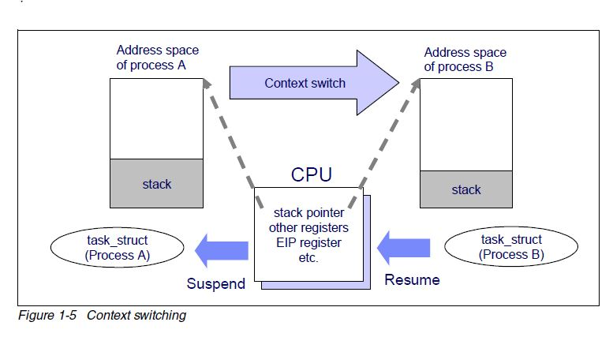

## 阿里云 RDS PostgreSQL 高并发特性 vs 社区版本 (1.6万并发: 3倍吞吐，240倍响应速度)       
                                                             
### 作者                                                             
digoal                                                             
                                                             
### 日期                                                             
2018-05-05                                                           
                                                             
### 标签                                                             
PostgreSQL , 阿里云 , 高并发 , 内置pool , Oracle shared server    
                                                             
----                                                             
                                                             
## 背景     
进程模型数据库，需要为每个会话指派独立的进程与之服务，在连接数非常多，且大都是活跃连接时，进程调度浪费或引入的开销甚至远远大于实际任务需要的开销（例如上下文切换，MEMCPY等），性能下降会较为严重。   
  
  
  
PostgreSQL与Oracle Dedicate Server一样，属于进程模型。在非常高并发的情况下，性能会下降比较厉害，通常社区版本可以通过加连接池来解决，例如pgbouncer，但是加连接池也会带来一些问题：    
    
1、绑定变量无法很好的满足，当然，PostgreSQL 11会增加类似Oracle cursor force的功能，内部将非绑定变量的SQL转换为绑定变量。    
    
[《PostgreSQL 11 preview - 强制auto prepared statment开关(自动化plan cache)(类似Oracle cursor_sharing force)》](../201803/20180325_05.md)      
    
2、连接池会使得跳数增加，增加了延迟。    
    
3、数据库防火墙配置的变化。从直接控制应用端来源，变成了连接池端来源。（除非修改连接池层的代码，做到来源IP和端口透传）    
    
Oracle为了解决性能问题，提出了shared server的概念，类似数据库端的backend process pool，一个process可能服务于多个client。    
    
PostgreSQL也可以如法炮制，比如阿里云RDS PG内核层面增加了内置的POOL。在高并发的情况下，性能好很多。    
    
## 测试CASE    
1、测试64 ~ 16384个并发    
    
2、测试TPC-B，包含5亿数据量。    
    
3、测试logged table与unlogged table    
    
4、测试对比社区PostgreSQL 10 与 阿里云PostgreSQL 10    
    
## 测试环境准备    
    
1、数据库使用huge page    
    
[《PostgreSQL Huge Page 使用建议 - 大内存主机、实例注意》](../201803/20180325_02.md)      
    
2、修改pgbench，支持超过1000个连接的测试    
    
[《PostgreSQL 11 preview - pgbench 支持大于1000链接(ppoll()代替select())》](../201803/20180325_03.md)      
    
https://commitfest.postgresql.org/18/1388/    
    
[《从PostgreSQL支持100万个连接聊起》](../201608/20160805_01.md)      
    
    
如果使用ppoll，则pstack pgbench可以看到类似如下信息    
    
```    
Thread 1 (Thread 0x7f3f4d89d840 (LWP 116621)):    
#0  0x00007f3f4ca4569d in poll () from /lib64/libc.so.6    
#1  0x00007f3f4d45a9cf in poll (__timeout=-1, __nfds=1, __fds=0x7ffcd6e13c80) at /usr/include/bits/poll2.h:46    
#2  pqSocketPoll (end_time=-1, forWrite=0, forRead=28675152, sock=<optimized out>) at fe-misc.c:1129    
#3  pqSocketCheck (conn=conn@entry=0x1b58c50, forRead=forRead@entry=1, forWrite=forWrite@entry=0, end_time=end_time@entry=-1) at fe-misc.c:1071    
#4  0x00007f3f4d45aa50 in pqWaitTimed (forRead=forRead@entry=1, forWrite=forWrite@entry=0, conn=conn@entry=0x1b58c50, finish_time=finish_time@entry=-1) at fe-misc.c:1003    
#5  0x00007f3f4d454012 in connectDBComplete (conn=0x1b58c50) at fe-connect.c:1902    
#6  PQconnectdbParams (keywords=<optimized out>, values=<optimized out>, expand_dbname=<optimized out>) at fe-connect.c:542    
#7  0x000000000040576a in doConnect ()    
#8  0x0000000000406e29 in threadRun ()    
#9  0x0000000000403a1b in main ()    
```    
    
3、修改系统配置，保证有足够的fd, proc等    
    
[《PostgreSQL 10 + PostGIS + Sharding(pg_pathman) + MySQL(fdw外部表) on ECS 部署指南(适合新用户) - 珍藏级》](../201710/20171018_01.md)      
    
4、postgresql.conf 通用配置    
    
```    
listen_addresses = '0.0.0.0'    
max_connections = 30000    
superuser_reserved_connections = 13    
unix_socket_directories = '/tmp,.'    
tcp_keepalives_idle = 60    
tcp_keepalives_interval = 10    
tcp_keepalives_count = 0    
shared_buffers = 32GB    
huge_pages = on    
maintenance_work_mem = 1GB    
dynamic_shared_memory_type = posix    
vacuum_cost_delay = 0    
bgwriter_delay = 10ms    
bgwriter_lru_maxpages = 500    
effective_io_concurrency = 0    
max_parallel_workers_per_gather = 0    
wal_level = minimal    
fsync = on    
synchronous_commit = on    
full_page_writes = on    
wal_buffers = 32MB    
checkpoint_timeout = 15min    
max_wal_size = 64GB    
min_wal_size = 16GB    
checkpoint_completion_target = 0.1    
max_wal_senders = 0    
random_page_cost = 1.2    
log_destination = 'csvlog'    
logging_collector = on    
log_truncate_on_rotation = on    
log_checkpoints = on    
log_connections = on    
log_disconnections = on    
log_error_verbosity = verbose       
log_timezone = 'PRC'    
autovacuum = on    
log_autovacuum_min_duration = 0    
autovacuum_freeze_max_age = 900000000    
autovacuum_multixact_freeze_max_age = 900000000    
autovacuum_vacuum_cost_delay = 0ms    
vacuum_freeze_min_age = 500000    
vacuum_freeze_table_age = 1500000000    
vacuum_multixact_freeze_min_age = 5000000    
vacuum_multixact_freeze_table_age = 1500000000    
datestyle = 'iso, mdy'    
timezone = 'PRC'    
lc_messages = 'en_US.utf8'    
lc_monetary = 'en_US.utf8'    
lc_numeric = 'en_US.utf8'    
lc_time = 'en_US.utf8'    
default_text_search_config = 'pg_catalog.english'    
```    
    
5、社区版本与阿里云版本的差异配置    
  
native    
    
```    
port = 1921    
```    
    
aliyun    
    
```    
port = 1999    
shared_preload_libraries = 'pg_concurrency_control.so'    
pg_concurrency_control.query_concurrency=64    
pg_concurrency_control.bigquery_concurrency=64    
pg_concurrency_control.transaction_concurrency=64    
pg_concurrency_control.autocommit_concurrency=64    
  
# 其他配置
# 函数: pg_concurrency_control_status 查看当前 DB 中的实时 SQL 排队情况
# pg_concurrency_control.control_timeout          设置排队的每个SQL(bigsql以外)最长等待时间，单位毫秒
# pg_concurrency_control.bigsql_control_timeout   设置排队的每个bigsql最长等待时间，单位毫秒
# pg_concurrency_control.timeout_action (break rollback wait)          设置SQL（bigsql除外）超时的行为
# pg_concurrency_control.bigsql_timeout_action (break rollback wait)   设置BIGSQL 超时的行为
# 解释   break --继续运行 rollback --回滚当前事务 wait --继续等待（死等）
```    
  
PS:  shared server模式的使用，也需要注意场景，如果LONG XACT的并发超过shared server的个数，则可能导致其他并行小事务获取不到空闲的shared server，堵塞其执行。   

```
例如这样就很容易模仿。

select pg_sleep(1000);
```
  
改进方法之一是将shared server的配置控制到数据库USER或者DATABASE层级。   
    
## 测试TPC-B    
TPC-B测试SQL如下    
    
scale=5000    
    
```    
\set aid random(1, 100000 * :scale)    
\set bid random(1, 1 * :scale)    
\set tid random(1, 10 * :scale)    
\set delta random(-5000, 5000)    
BEGIN;    
UPDATE pgbench_accounts SET abalance = abalance + :delta WHERE aid = :aid;    
SELECT abalance FROM pgbench_accounts WHERE aid = :aid;    
UPDATE pgbench_tellers SET tbalance = tbalance + :delta WHERE tid = :tid;    
UPDATE pgbench_branches SET bbalance = bbalance + :delta WHERE bid = :bid;    
INSERT INTO pgbench_history (tid, bid, aid, delta, mtime) VALUES (:tid, :bid, :aid, :delta, CURRENT_TIMESTAMP);    
END;    
```    
    
### logged table    
    
1、初始化    
    
```    
./pgsql11/bin/pgbench -i -s 5000    
```    
    
2、表大小    
    
```    
postgres=# \dt+    
                          List of relations    
 Schema |       Name       | Type  |  Owner   |  Size   | Description     
--------+------------------+-------+----------+---------+-------------    
 public | pgbench_accounts | table | postgres | 63 GB   |     
 public | pgbench_branches | table | postgres | 216 kB  |     
 public | pgbench_history  | table | postgres | 0 bytes |     
 public | pgbench_tellers  | table | postgres | 2200 kB |     
(4 rows)    
```    
    
3、社区版本测试脚本如下    
    
```    
vi test_native.sh    
    
#!/bin/bash    
export PGHOST=/tmp    
export PGPORT=1921    
export PGUSER=postgres    
export PGDATABASE=postgres    
    
Y=32    
for ((i=1;i<=7;i++))    
do    
X=$((Y*2))    
psql -c "vacuum freeze"    
psql -c "checkpoint"    
./pgsql11/bin/pgbench -M prepared -n -r -P 3 -c $X -j 64 -T 300 > ./test_native_$X.log 2>&1    
Y=X    
done    
    
psql -c "vacuum freeze"    
psql -c "checkpoint"    
./pgsql11/bin/pgbench -M prepared -n -r -P 3 -c 8192 -j 128 -T 600 > ./test_native_8192.log 2>&1    
    
psql -c "vacuum freeze"    
psql -c "checkpoint"    
./pgsql11/bin/pgbench -M prepared -n -r -P 3 -c 16384 -j 256 -T 600 > ./test_native_16384.log 2>&1    
```    
    
测试方法    
    
```    
chmod 700 ./test_native.sh     
nohup ./test_native.sh >/dev/null 2>&1 &    
```    
    
5、阿里云版本测试脚本如下    
    
```    
vi test_aliyun.sh    
    
#!/bin/bash    
export PGHOST=/tmp    
export PGPORT=1999    
export PGUSER=postgres    
export PGDATABASE=postgres    
    
Y=32    
for ((i=1;i<=7;i++))    
do    
X=$((Y*2))    
psql -c "vacuum freeze"    
psql -c "checkpoint"    
./pgsql11/bin/pgbench -M prepared -n -r -P 3 -c $X -j 64 -T 300 > ./test_aliyun_$X.log 2>&1    
Y=X    
done    
    
psql -c "vacuum freeze"    
psql -c "checkpoint"    
./pgsql11/bin/pgbench -M prepared -n -r -P 3 -c 8192 -j 128 -T 600 > ./test_aliyun_8192.log 2>&1    
    
psql -c "vacuum freeze"    
psql -c "checkpoint"    
./pgsql11/bin/pgbench -M prepared -n -r -P 3 -c 16384 -j 256 -T 600 > ./test_aliyun_16384.log 2>&1    
```    
    
测试方法    
    
```    
chmod 700 ./test_aliyun.sh     
nohup ./test_aliyun.sh >/dev/null 2>&1 &    
```    
    
### unlogged table    
    
1、初始化    
    
```    
./pgsql11/bin/pgbench -i -s 5000 --unlogged-tables    
```    
    
2、修改数据库配置    
    
```    
vi $PGDATA/postgresql.conf    
    
synchronous_commit = off    
    
pg_ctl reload    
```    
    
3、测试同样的脚本    
    
## 性能对比    
[《logged table测试结果详细LOG下载》](20180505_07_doc_001.tar.bz2)    
    
[《unlogged table测试结果详细LOG下载》](20180505_07_doc_002.tar.bz2)    
    
### 1 logged table对比    
    
#### 1、TPS对比    
    
连接数 | 社区版本TPS | 阿里云版本TPS | 社区版本TPS<br>(过滤首尾干扰值) | 阿里云版本TPS<br>(过滤首尾干扰值)  
---|---|---|---|---    
64 | 69216 |   67853 | 无干扰 | 无干扰   
128 | 69211 |  65712 | 无干扰 | 无干扰   
256 | 62964 |  62775 | 无干扰 | 无干扰   
512 | 44595 |  53382 | 46141 | 54988   
1024 | 35055 | 44295 | 37022 | 48679   
2048 | 26791 | 38881 | 30327 | 44358   
4096 | 24218 | 26990 | 32023 | 39086   
8192 | 7064 |  24304 | 18611 | 34316   
16384 | 5046 | 12478 | 10020 | 29499   
    
**1.6万并发时，约3倍于社区版本。**  
    
#### 2、事务整体RT对比    
    
连接数 | 社区版本RT | 阿里云版本RT    
---|---|---    
64 | 0.923 ms | 0.941 ms    
128 | 1.839 ms | 1.936 ms    
256 | 4.010 ms | 4.021 ms    
512 | 11.151 ms | 9.269 ms    
1024 | 27.475 ms | 21.070 ms    
2048 | 67.295 ms | 46.063 ms    
4096 | 127.923 ms | 104.689 ms    
8192 | 999.236 ms | 239.466 ms    
16384 | 1594.185 ms | 577.913 ms    
    
#### 3、实际SQL RT对比    
    
连接数 | 社区版本RT | 阿里云版本RT    
---|---|---    
64 | 0.428 ms | 0.465 ms    
128 | 0.698 ms | 0.734 ms    
256 | 1.784 ms | 1.658 ms    
512 | 4.736 ms | 4.378 ms    
1024 | 11.082 ms | 8.664 ms    
2048 | 37.258 ms | 8.007 ms    
4096 | 65.486 ms | 7.395 ms    
8192 | 818.411 ms | 6.472 ms    
16384 | 1183.571 ms | 4.927 ms    
  
**1.6万连接时，真实SQL响应速度约240倍于社区版本。**    
    
#### 4、RT 标准方差对比    
    
连接数 | 社区版本RT DEV | 阿里云版本RT DEV    
---|---|---    
64 | 2.960 ms | 2.863 ms    
128 | 7.559 ms | 4.914 ms    
256 | 6.595 ms | 6.090 ms    
512 | 11.810 ms | 8.704 ms    
1024 | 30.656 ms | 46.411 ms    
2048 | 88.371 ms | 68.239 ms    
4096 | 183.815 ms | 140.255 ms    
8192 | 20114.612 ms | 345.584 ms    
16384 | 2404.222 ms | 1116.238 ms    
    
#### 5、建立完所有连接的耗时对比    
    
连接数 | 社区版本 | 阿里云版本    
---|---|---    
64 | 0 s | 0 s    
128 | 0 s | 0 s    
256 | 4.8 s | 5 s    
512 | 8.9 s | 11.3 s    
1024 | 18.5 s | 27.4 s    
2048 | 36.3 s | 37.8 s    
4096 | 73.5 s | 93.6 s    
8192 | 150.9 s | 168.6 s    
16384 | 306 s | 341.8 s    
    
#### 6、释放完所有连接的耗时对比    
    
连接数 | 社区版本 | 阿里云版本    
---|---|---    
64 | 0 s | 0 s    
128 | 0 s | 0 s    
256 | 0 s | 0 s    
512 | 0 s | 0 s    
1024 | 0 s | 0 s    
2048 | 0 s | 0 s    
4096 | 0 s | 0 s    
8192 | 594 s | 9 s    
16384 | 21 s | 24 s    
    
### 2 unlogged table对比    
    
#### 1、TPS对比    
    
连接数 | 社区版本TPS | 阿里云版本TPS | 社区版本TPS<br>(过滤首尾干扰值) | 阿里云版本TPS<br>(过滤首尾干扰值)  
---|---|---|---|---    
64 | 99086 | 95932 | 无干扰 | 无干扰    
128 | 86807 | 86719 | 无干扰 | 无干扰     
256 | 69805 | 74371 | 70766 | 75143   
512 | 49147 | 59423 | 50369 | 61153   
1024 | 42295 | 45883 | 44798 | 48910   
2048 | 32147 | 38698 | 36729 | 44552    
4096 | 23556 | 27604 | 31504 | 38334    
8192 | 17037 | 24524 | 22937 | 34553  
16384 | 196 | 12668 | 1943 | 30273  
    
    
#### 2、事务整体RT对比    
    
连接数 | 社区版本RT | 阿里云版本RT    
---|---|---    
64 | 0.644 ms | 0.666 ms    
128 | 1.466 ms | 1.466 ms    
256 | 3.617 ms | 3.391 ms     
512 | 10.115 ms | 8.343 ms     
1024 | 22.761 ms | 20.864 ms    
2048 | 55.771 ms | 45.903 ms    
4096 | 130.195 ms | 107.858 ms     
8192 | 356.904 ms | 239.312 ms    
16384 | 66640.630 ms | 570.207 ms    
    
#### 3、实际SQL RT对比    
    
连接数 | 社区版本RT | 阿里云版本RT    
---|---|---    
64 | 0.475 ms | 0.501 ms     
128 | 0.934 ms | 0.854 ms     
256 | 2.109 ms | 1.842 ms     
512 | 4.656 ms | 4.587 ms    
1024 | 9.837 ms | 8.69 ms    
2048 | 36.882 ms | 7.928 ms    
4096 | 67.513 ms | 7.522 ms    
8192 | 201.208 ms | 6.536 ms    
16384 | 65428.243 ms | 4.811 ms     
    
#### 4、RT 标准方差对比    
    
连接数 | 社区版本RT DEV | 阿里云版本RT DEV    
---|---|---    
64 | 2.941 ms | 1.767 ms     
128 | 4.445 ms | 2.763 ms     
256 | 5.515 ms | 2.775 ms    
512 | 11.424 ms | 4.447 ms    
1024 | 28.950 ms | 16.575 ms    
2048 | 87.051 ms | 52.400 ms    
4096 | 200.132 ms | 149.614 ms    
8192 | 403.771 ms | 358.461 ms    
16384 | 462277.689 ms | 1161.376 ms    
    
#### 5、建立完所有连接的耗时对比    
    
连接数 | 社区版本 | 阿里云版本    
---|---|---    
64 | 0 s | 0 s     
128 | 0 s | 0 s     
256 | 4.9 s | 5.3 s    
512 | 9.4 s | 10.2 s    
1024 | 18.5 s | 20.2 s    
2048 | 37.6 s | 40 s    
4096 | 75 s | 81.3 s    
8192 | 151.6 s | 168.4 s    
16384 | 312.1 s | 341.5 s    
    
#### 6、释放完所有连接的耗时对比    
    
连接数 | 社区版本 | 阿里云版本    
---|---|---    
64 | 0 s | 0 s     
128 | 0 s | 0 s    
256 | 0 s | 0 s    
512 | 0 s | 0 s    
1024 | 0 s | 0 s    
2048 | 0 s | 0 s    
4096 | 3 s | 3 s    
8192 | 6 s | 9 s    
16384 | 3312 s | 27 s    
    
## 小结    
进程模型数据库，需要为每个会话指派独立的进程与之服务，在连接数非常多，且大都是活跃连接时，进程调度浪费或引入的开销甚至远远大于实际任务需要的开销（例如上下文切换，MEMCPY等），性能下降会较为严重。   
   
阿里云RDS PG，采用与Oracle Shared Server模式类似的方案，解决了进程模式在高并发的情况下性能下降的问题。   
  
在超过1万个活跃并发的情况下，阿里云RDS PG的TPC-B测试指标依旧能够保持15万左右的QPS (消除干扰项)，吞吐能力是社区版本的3倍。同时，在低并发的情况下，性能不减，与社区版本相当。     
  
具体测试结果分析：      
    
1、阿里云RDS PG在高并发下，TPS相比社区版本好很多，更加平稳。    
    
2、阿里云RDS PG引入了POOL机制后，响应延迟，抖动相比社区版本低了很多。    
    
3、启用POOL后，整个事务的RT，相比社区版本降低，使得整个处理吞吐得到提升。    
    
4、启用POOL机制，使得一个事务中，真正执行SQL的时间大大缩短。同时还避免了锁等待的问题。      
    
16384个连接，社区版本    
    
```    
  1.750  BEGIN;    
 21.531  UPDATE pgbench_accounts SET abalance = abalance + :delta WHERE aid = :aid;    
  0.745  SELECT abalance FROM pgbench_accounts WHERE aid = :aid;    
461.077  UPDATE pgbench_tellers SET tbalance = tbalance + :delta WHERE tid = :tid;    
700.583  UPDATE pgbench_branches SET bbalance = bbalance + :delta WHERE bid = :bid;    
  1.958  INSERT INTO pgbench_history (tid, bid, aid, delta, mtime) VALUES (:tid, :bid, :aid, :delta, CURRENT_TIMESTAMP);    
408.864  END;    
```    
    
16384个连接，阿里云版本    
    
```    
559.291  BEGIN;    
  2.359  UPDATE pgbench_accounts SET abalance = abalance + :delta WHERE aid = :aid;    
  1.223  SELECT abalance FROM pgbench_accounts WHERE aid = :aid;    
  1.191  UPDATE pgbench_tellers SET tbalance = tbalance + :delta WHERE tid = :tid;    
  2.310  UPDATE pgbench_branches SET bbalance = bbalance + :delta WHERE bid = :bid;    
  0.981  INSERT INTO pgbench_history (tid, bid, aid, delta, mtime) VALUES (:tid, :bid, :aid, :delta, CURRENT_TIMESTAMP);    
 13.695  END;    
```    
    
对比以上两个版本的事务BEGIN的耗费时间、SQL执行时间的分布：  
  
社区版本的SQL执行时间耗时更高（基本达到了500毫秒左右）；   
  
阿里云的PG版本，SQL执行时间非常短（基本都在1毫秒左右）。    
    
实际的DML SQL执行越久，持锁就越久，并发1万多时，社区版本PG出现较多WAITING状态，就可以说明问题。    
    
```    
0:00.18 postgres: postgres postgres [local] UPDATE waiting    
0:02.62 postgres: postgres postgres [local] UPDATE waiting    
0:00.15 postgres: postgres postgres [local] UPDATE waiting    
0:00.17 postgres: postgres postgres [local] UPDATE waiting    
0:00.12 postgres: postgres postgres [local] UPDATE waiting    
0:00.11 postgres: postgres postgres [local] UPDATE waiting    
..............................  
0:00.13 postgres: postgres postgres [local] COMMIT            
0:00.13 postgres: postgres postgres [local] UPDATE waiting    
0:00.13 postgres: postgres postgres [local] UPDATE waiting    
0:00.16 postgres: postgres postgres [local] UPDATE waiting    
0:00.14 postgres: postgres postgres [local] UPDATE waiting    
.....................    
```    
    
阿里云RDS PG内置POOL，不会导致SQL执行时间变长。因此有效的避免了持有资源锁的问题，是的真实的SQL RT非常的平稳。     
    
连接数 | 社区版本RT | 阿里云版本RT    
---|---|---    
64 | 0.475 ms | 0.501 ms     
128 | 0.934 ms | 0.854 ms     
256 | 2.109 ms | 1.842 ms     
512 | 4.656 ms | 4.587 ms    
1024 | 9.837 ms | 8.69 ms    
2048 | 36.882 ms | 7.928 ms    
4096 | 67.513 ms | 7.522 ms    
8192 | 201.208 ms | 6.536 ms    
16384 | 65428.243 ms | 4.811 ms     
    
5、启用POOL后，16384个连接高并发下，收尾时长缩短。从3312秒缩短到了27秒。    
    
6、进程模式，建立连接比较耗时，如果业务上需要短时间内创建大量连接，也是一个瓶颈。比如创建16384个连接，串行创建，全部建立完16384个连接大概需要花费300秒。这样的业务，建议采用业务层连接池，并且配置较少的后端连接。       
    
7、pgbench在统计TPS时，从所有连接建立完成，到所有连接退出，这之间产生的TPS。当需要建立很多连接或释放很多连接时，可能会耗时比较久，导致实际测试的性能不准，特别是在8000个连接以上时，断开连接过程中，TPS下降比较明显，并且会被统计进去，实测600秒，到1000多秒才完成统计，详见LOG。    
    
8、阿里云RDS PG内置POOL，相比外置连接池，还有一个好处是“不会影响绑定变量的使用，也不会引入新的跳数，同时不会影响数据库pg_hba.conf防火墙的配置”。    
    
**在超过1万个活跃并发的情况下，阿里云RDS PG的TPC-B测试指标依旧能够保持15万左右的QPS (消除干扰项)，吞吐能力是社区版本的3倍。真实SQL执行响应速度240倍于社区版本。同时低并发的情况下，性能不减，与社区版本相当。**    
   
欢迎使用阿里云RDS PG，我们会一如既往的优化，提高用户使用感受。这个特性将同时支持[阿里云RDS PG](https://www.aliyun.com/product/rds/postgresql)以及[RDS PPAS](https://www.aliyun.com/product/rds/ppas)两个产品。    
    
## 参考    
    
[《PostgreSQL Huge Page 使用建议 - 大内存主机、实例注意》](../201803/20180325_02.md)      
    
[《PostgreSQL 11 preview - pgbench 支持大于1000链接(ppoll()代替select())》](../201803/20180325_03.md)      
    
https://commitfest.postgresql.org/18/1388/    
    
[《PostgreSQL pgbench : 冒号处理》](../201712/20171222_01.md)      
    
[《PostgreSQL pgbench SQL RT 与 事务RT 浅析》](../201609/20160926_03.md)      
    
[《从PostgreSQL支持100万个连接聊起》](../201608/20160805_01.md)      
    
[《PostgreSQL 11 preview - 强制auto prepared statment开关(自动化plan cache)(类似Oracle cursor_sharing force)》](../201803/20180325_05.md)      
    
[《PostgreSQL 10 + PostGIS + Sharding(pg_pathman) + MySQL(fdw外部表) on ECS 部署指南(适合新用户) - 珍藏级》](../201710/20171018_01.md)      
  
除此以外阿里云RDS PG还提供了很多企业级特性，比较典型的如：   
  
1、varbitx，海量数据实时用户画像  
  
[《阿里云RDS PostgreSQL varbitx实践 - 流式标签 (阅后即焚流式批量计算) - 万亿级，任意标签圈人，毫秒响应》](../201712/20171212_01.md)    
  
[《阿里云RDS for PostgreSQL varbitx插件与实时画像应用场景介绍》](../201705/20170502_01.md)    
  
[《基于 阿里云 RDS PostgreSQL 打造实时用户画像推荐系统(varbitx)》](../201610/20161021_01.md)    
  
[《惊天性能！单RDS PostgreSQL实例 支撑 2000亿 - 实时标签透视案例 (含dblink异步并行调用)》](../201712/20171223_01.md)    
  
[《门禁广告销售系统需求剖析 与 PostgreSQL数据库实现》](../201611/20161124_01.md)    
  
2、oss二级存储，冷热数据分离存储  
  
[《打造云端流计算、在线业务、数据分析的业务数据闭环 - 阿里云RDS、HybridDB for PostgreSQL最佳实践》](../201707/20170728_01.md)    
  
[《阿里云RDS PostgreSQL OSS 外部表实践 - (dblink异步调用封装并行) 从OSS并行导入数据》](../201804/20180427_01.md)    
  
[《强制数据分布与导出prefix - 阿里云pg, hdb pg oss快速数据规整外部表导出实践案例》](../201801/20180109_01.md)    
  
[《Greenplum insert的性能(单步\批量\copy) - 暨推荐使用gpfdist、阿里云oss外部表并行导入》](../201711/20171116_01.md)    
  
[《阿里云RDS PostgreSQL OSS 外部表实践 - (dblink异步调用封装并行) 数据并行导出到OSS》](../201709/20170906_01.md)    
  
[《ApsaraDB的左右互搏(PgSQL+HybridDB+OSS) - 解决OLTP+OLAP混合需求》](../201701/20170101_02.md)    
  
<a rel="nofollow" href="http://info.flagcounter.com/h9V1"  ></a>  
  
  
  
  
  
  
## [digoal's 大量PostgreSQL文章入口](https://github.com/digoal/blog/blob/master/README.md "22709685feb7cab07d30f30387f0a9ae")
  
