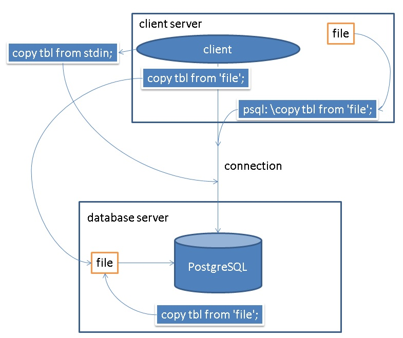

## PostgreSQL 服务端COPY和客户端COPY - 暨PG有哪些服务端操作接口
                                                           
### 作者                                                           
digoal                                                           
                                                           
### 日期                                                           
2018-05-16                                                         
                                                           
### 标签                                                           
PostgreSQL , copy , 服务端接口 , 客户端接口
                                                           
----                                                           
                                                           
## 背景 
有些朋友在使用COPY命令对数据库进行数据导入导出时，可能会发现COPY到文件时，怎么和想象的不一样，COPY到文件并没有落到指定的地方。实际上原因是COPY命令是服务端命令，COPY到某个文件实际上是COPY到数据库所在的服务器上面了，而不是客户端所在的服务器。

Oracle数据库也一样，都有服务端和客户端（协议端）概念。

PostgreSQL数据库还有哪些接口是服务端操作的，哪些接口是客户端操作的？

## 一、大对象

### 客户端接口

https://www.postgresql.org/docs/10/static/lo-interfaces.html

### 服务端接口

https://www.postgresql.org/docs/10/static/lo-funcs.html

例子

[《PostgreSQL 大对象或bytea存取pdf,jpg等文件 - PostgreSQL export regular file like pdf, word, text, doc stored in bytea type》](../201306/20130626_01.md)  

## 二、文件读写接口

### 服务端文件读(写)接口

https://www.postgresql.org/docs/10/static/functions-admin.html#FUNCTIONS-ADMIN-GENFILE

### 服务端 FILE_FDW 接口

https://www.postgresql.org/docs/10/static/file-fdw.html

## 三、COPY 数据接口
### 服务端COPY接口

https://www.postgresql.org/docs/10/static/sql-copy.html

```
copy tbl to 'filepath';

copy tbl from 'filepath';
```

这里的filepath都是指PostgreSQL数据库所在服务器的路径。

需要数据库superuser权限。

### 客户端COPY接口

1、标准输入、输出

```
copy tbl to stdout;

copy (query) to stdout;

copy tbl from stdin;
```

不需要数据库superuser权限。

通过标准输出、输入，可以实现COPY接收来自客户端的数据。

通过封装管道，则可以实现将客户端的文件加载到数据库中，或者将数据写到客户端。

```
cat file|psql -c "copy tbl from stdin"

psql -c "copy tbl to stdout" > local.csv
```

2、libpq COPY

同时数据库还支持libpq协议的COPY语法，通过libpq协议将数据导入PG，或者从PG导出到客户端。

https://www.postgresql.org/docs/10/static/libpq-copy.html

不需要数据库superuser权限。

3、psql 客户端copy接口

最后psql客户端，内部封装了copy接口，通过libpq协议的COPY接口与数据库交互。

https://www.postgresql.org/docs/10/static/app-psql.html#APP-PSQL-VARIABLES

不需要数据库superuser权限。

```

\copy { table [ ( column_list ) ] | ( query ) } { from | to } { 'filename' | program 'command' | stdin | stdout | pstdin | pstdout } [ [ with ] ( option [, ...] ) ]
    Performs a frontend (client) copy. This is an operation that runs an SQLCOPY(7) command, but instead of the server reading or writing the specified file, 
    psql reads or writes the file and routes the data between the
    server and the local file system. This means that file accessibility and privileges are those of the local user, 
    not the server, and no SQL superuser privileges are required.

    When program is specified, command is executed by psql and the data passed from or to command is routed between 
    the server and the client. Again, the execution privileges are those of the local user, not the server, and
    no SQL superuser privileges are required.

    For \copy ... from stdin, data rows are read from the same source that issued the command, continuing until \.  
    is read or the stream reaches EOF. This option is useful for populating tables in-line within a SQL script
    file. For \copy ... to stdout, output is sent to the same place as psql command output, 
    and the COPY count command status is not printed (since it might be confused with a data row). 
    To read/write psql's standard input
    or output regardless of the current command source or \o option, write from pstdin or to pstdout.

    The syntax of this command is similar to that of the SQLCOPY(7) command. All options other than the data 
    source/destination are as specified for COPY(7). Because of this, special parsing rules apply to the \copy
    meta-command. Unlike most other meta-commands, the entire remainder of the line is always taken to be 
    the arguments of \copy, and neither variable interpolation nor backquote expansion are performed in the arguments.

        Tip
        This operation is not as efficient as the SQLCOPY command because all data must pass through the client/server connection. For large amounts of data the SQL command might be preferable.
```

例子

```
服务端copy命令依赖超级用户

postgres=> copy pgbench_accounts to '/home/digoal/123.csv' with (format csv);
ERROR:  must be superuser or a member of the pg_write_server_files role to COPY to a file
HINT:  Anyone can COPY to stdout or from stdin. psql's \copy command also works for anyone.
Time: 0.588 ms


psql封装的\copy，使用libpq copy接口，不依赖超级用户
postgres=> \copy pgbench_accounts to '/home/digoal/123.csv' with (format csv);
COPY 2000000
Time: 1590.136 ms (00:01.590)

postgres=> truncate pgbench_accounts ;
TRUNCATE TABLE
Time: 180.988 ms
postgres=> \copy pgbench_accounts from '/home/digoal/123.csv' with (format csv);
COPY 2000000
Time: 5733.883 ms (00:05.734)
```
  
注意，很多人会误以为psql提供的copy和数据库服务端的copy命令一致，实际上并不是这样的，比如Greenplum提供的服务端COPY，支持log errors, reject error rows的语法，而psql的客户端copy可能并不支持（只是pg社区提供的psql客户端肯定不支持。gpdb提供的psql客户端尚不清楚）.如果你的服务端是gpdb，并且需要log errors，那么应该使用服务端COPY命令，使用stdin, stdout来进出。     
   
  
    
## 参考
  
  
<a rel="nofollow" href="http://info.flagcounter.com/h9V1"  ></a>  
  
  
  
  
  
  
## [digoal's 大量PostgreSQL文章入口](https://github.com/digoal/blog/blob/master/README.md "22709685feb7cab07d30f30387f0a9ae")
  
