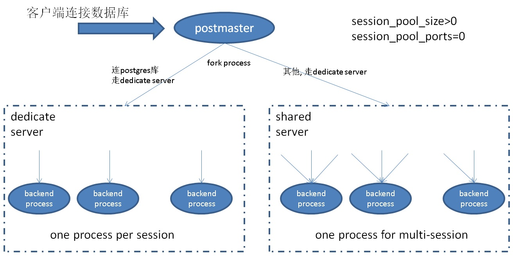
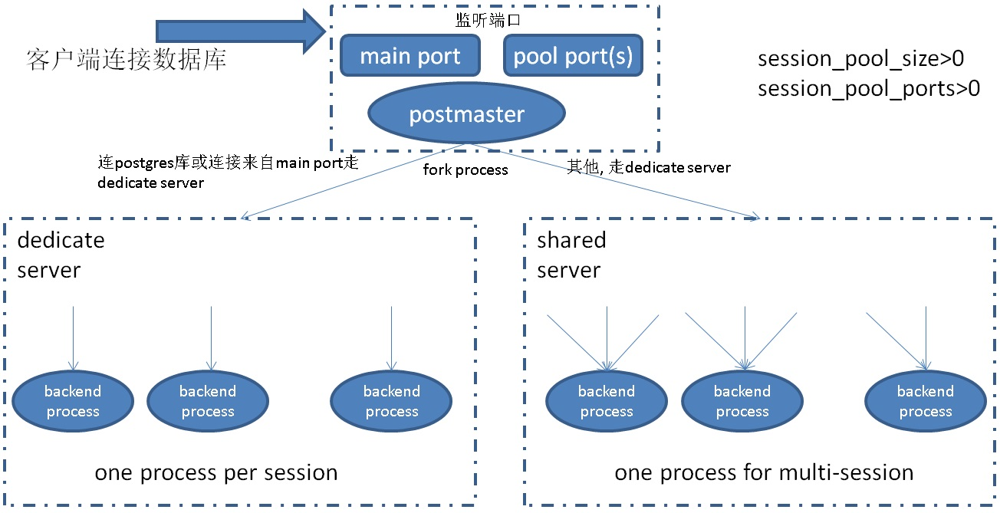

## PostgresPro buildin pool(内置连接池)版本 原理与测试  
                                                                                             
### 作者                                                                                             
digoal                                                                                             
                                                                                             
### 日期                                                                                             
2018-05-21                                                                                           
                                                                                             
### 标签                                                                                             
PostgreSQL , 内置连接池 , pgbouncer , postgrespro                                 
                                                                                             
----                                                                                             
                                                                                             
## 背景   
PostgreSQL 与Oracle dedicate server 一样采用了线程模式，在连接数非常多时，性能下降会比较严重。  
  
通常社区用户的做法是使用连接池，比如pgbouncer，但是使用PGbouncer也会引入一些使用上的不便利，比如transaction模式不能使用绑定变量等。在以下文章中做过一些较为详细的分析。  
  
[《阿里云 RDS PostgreSQL 高并发特性 vs 社区版本 (1.6万并发: 3倍吞吐，240倍响应速度)》](../201805/20180505_07.md)    
  
Postgrespro是俄罗斯的一家PG生态公司，  
  
[《透过postgrespro看PostgreSQL的附加功能》](../201709/20170913_02.md)    
  
内置连接池在他们的TODO列表有看到，最近放出了一版devel版本。  
  
  
## postgres buildin pool 版本安装  
1、下载源码,切换分支  
  
```  
git clone https://github.com/postgrespro/postgresql.builtin_pool  
cd postgresql.builtin_pool  
git checkout conn_pool  
git branch conn_pool  
```  
  
2、编译安装  
  
```  
./configure --prefix=/home/digoal/pgsql11_pool  
make -j 128  
make install  
```  
  
3、修改环境变量  
  
```  
vi env_pg11_pool.sh   
  
export PS1="$USER@`/bin/hostname -s`-> "    
export PGPORT=4001  
export PGDATA=/data01/pg/pg_root$PGPORT    
export LANG=en_US.utf8    
export PGHOME=/home/digoal/pgsql11_pool  
export LD_LIBRARY_PATH=$PGHOME/lib:/lib64:/usr/lib64:/usr/local/lib64:/lib:/usr/lib:/usr/local/lib:$LD_LIBRARY_PATH    
export DATE=`date +"%Y%m%d%H%M"`    
export PATH=$PGHOME/bin:$PATH:.    
export MANPATH=$PGHOME/share/man:$MANPATH    
export PGHOST=$PGDATA    
export PGUSER=postgres    
export PGDATABASE=postgres    
alias rm='rm -i'    
alias ll='ls -lh'    
unalias vi   
```  
  
4、设置环境变量  
  
```  
. ./env_pg11_pool.sh   
```  
  
5、初始化数据库  
  
  
```  
initdb -D $PGDATA -U postgres -E UTF8 --locale=en_US.utf8 -X /data02/pg/pg_wal_4001  
```  
  
  
6、配置数据库参数  
  
```  
cd $PGDATA  
vi postgresql.conf  
  
listen_addresses = '0.0.0.0'  
port = 4001  
max_connections = 20000  
superuser_reserved_connections = 13  
unix_socket_directories = '/tmp,.'  
tcp_keepalives_idle = 60  
tcp_keepalives_interval = 10  
tcp_keepalives_count = 10  
shared_buffers = 32GB  
maintenance_work_mem = 1GB  
dynamic_shared_memory_type = posix  
vacuum_cost_delay = 0  
bgwriter_delay = 10ms  
bgwriter_lru_maxpages = 500  
bgwriter_lru_multiplier = 5.0  
effective_io_concurrency = 0  
wal_level = minimal   
synchronous_commit = off  
full_page_writes = off  
wal_buffers = 128MB  
wal_writer_delay = 10ms  
checkpoint_timeout = 25min  
max_wal_size = 64GB  
min_wal_size = 16GB  
checkpoint_completion_target = 0.1  
max_wal_senders = 0  
random_page_cost = 1.1  
log_destination = 'csvlog'  
logging_collector = on  
log_truncate_on_rotation = on  
log_checkpoints = on  
log_error_verbosity = verbose  
log_timezone = 'PRC'  
datestyle = 'iso, mdy'  
timezone = 'PRC'  
lc_messages = 'C'  
lc_monetary = 'C'  
lc_numeric = 'C'  
lc_time = 'C'  
default_text_search_config = 'pg_catalog.english'  
```  
  
内置连接池参数如下  
  
```  
# pool 配置  
session_pool_size=56   # 最好与CPU核数一致  ，如果有很多pool ports，可以考虑设小一点。    
session_pool_ports=0   # 如果配置为0，表示shared server与dedicate server共用一个端口, port = 4001    
                       # 如果配置为1，表示port = 4001为deadcate server port，port+1 为shared server ports.     
		       # 如果配置为大于1，port+1, port+2, .... 为shared server ports.     
		       # 如果要对应用透明，建议配置为0， 但是最佳实践建议配置为大于1，比如每对user/dbname 一个port。    
		       # postgres数据库不受pool限制，一律使用dedicate server.   
```      
  
### 架构
  
  
  
  
  
  
  
  
7、启动数据库  
  
```  
pg_ctl start  
```  
  
## 连接池参数介绍  
1、pool包含两个参数  
  
```  
# pool 配置  
session_pool_size=56   # 最好与CPU核数一致  ，如果有很多pool ports，可以考虑设小一点。    
session_pool_ports=0   # 如果配置为0，表示shared server与dedicate server共用一个端口, port = 4001    
                       # 如果配置为1，表示port = 4001为deadcate server port，port+1 为shared server ports.     
		       # 如果配置为大于1，port+1, port+2, .... 为shared server ports.     
		       # 如果要对应用透明，建议配置为0， 但是最佳实践建议配置为大于1，比如每对user/dbname 一个port。    
		       # postgres数据库不受pool限制，一律使用dedicate server.   
```    
  
在guc.c里面可以看到这两个参数的介绍  
  
```  
{  
  {"session_pool_size", PGC_POSTMASTER, CONN_AUTH_SETTINGS,  
          gettext_noop("Sets number of backends serving client sessions."),  
          gettext_noop("If non-zero then session pooling will be used: "  
                       "client connections will be redirected to one of the backends and maximal number of backends is determined by this parameter."  
                       "Launched backend are never terminated even in case of no active sessions.")  
  },  
  &SessionPoolSize,  
  10, 0, INT_MAX,  
  NULL, NULL, NULL  
},  
  
  
{  
  {"session_pool_ports", PGC_POSTMASTER, CONN_AUTH_SETTINGS,  
   gettext_noop("Number of session ports = number of session pools."),  
   gettext_noop("Number of extra ports which PostgreSQL will listen to accept client session. Each such port has separate session pool."  
                "It is intended that each port corresponds to some particular database/user combination, so that all backends in this session "  
                "pool will handle connection accessing this database. If session_pool_port is non zero then postmaster will always spawn dedicated (non-pooling) "  
                " backends at the main Postgres port. If session_pool_port is zero and session_pool_size is not zero, then sessions (pooled connection) will be also "  
                "accepted at main port. Session pool ports are allocated sequentially: if Postgres main port is 5432 and session_pool_ports is 2, "  
                "then ports 5433 and 5434 will be used for connection pooling.")  
  },  
  &SessionPoolPorts,  
  0, 0, MAX_SESSION_PORTS,  
  NULL, NULL, NULL  
},  
```  
  
2、如果是postgres库，不使用pool模式，使用dedidate server模式。  
  
区分是否postgres库的代码  
  
src/backend/tcop/postgres.c  
  
```  
/* Serve all conections to "postgres" database by dedicated backends */  
if (SessionPoolSize != 0 && strcmp(dbname, "postgres") == 0)   // 连接postgres，一律使用dedicate server, 方便DBA用户上去维护 （在所有pool backend process都activate时，保证能连接数据库）   
{  
        elog(LOG, "Backend is dedicated");  
        SessionPoolSize = 0;  
        closesocket(SessionPoolSock);  
        SessionPoolSock = PGINVALID_SOCKET;  
}  
/* Assign session for this backend in case of session pooling */  
if (SessionPoolSize != 0)  
{  
        MemoryContext oldcontext;  
        ActiveSession = (SessionContext*)calloc(1, sizeof(SessionContext));  
        ActiveSession->memory = AllocSetContextCreate(TopMemoryContext,  
                                                                                                   "SessionMemoryContext",  
                                                                                                   ALLOCSET_DEFAULT_SIZES);  
        oldcontext = MemoryContextSwitchTo(ActiveSession->memory);  
        ActiveSession->id = CreateSessionId();  
        ActiveSession->port = MyProcPort;  
        ActiveSession->eventSet = FeBeWaitSet;  
        BackendPort = MyProcPort;  
        MemoryContextSwitchTo(oldcontext);  
}  
```  
  
## 测试PG内置连接池是什么模式(transaction 模式)  
  
1、创建一个普通用户与库  
  
```  
create role digoal login;  
create database digoal owner digoal;  
```  
  
  
2、目前内置连接池的POOL模式为事务级 pool。同一个backend process，某个活跃会话的事务执行结束后，对应backend process的资源即可给同一backend process上的其他session利用。   
  
3、设置为只有1个BACKEND PROCESS  
  
```  
session_pool_size=1  
  
重启数据库  
```  
  
4、创建测试表  
  
```  
create table a (id int, info text);  
  
insert into a values (1,'test');  
```  
  
5、SESISON A:  
  
查看它的backend process的pid, 同时开启一个事务  
  
```  
digoal=> select pg_backend_pid();  
 pg_backend_pid   
----------------  
          56112  
(1 row)  
  
digoal=> begin;  
BEGIN  
digoal=> select * from a;  
 id | info   
----+------  
  1 | test  
(1 row)  
```  
  
6、SESISON B:  
  
连接数据库，堵塞，因为只有1个backend process，并且这个backend process当前繁忙。  
  
```  
psql -p 4001 digoal digoal  
  
hang  
```  
  
7、SESISON A:  
  
结束会话  
  
```  
end;  
```  
  
8、SESISON B:  
  
连接成功，查看它的backend process的pid，与session a的backend process的pid一致，所以会话A与B是共用一个backend process的。  
  
```  
digoal=> select pg_backend_pid();  
 pg_backend_pid   
----------------  
          56112  
(1 row)  
```  
  
9、SESISON A:  
  
开启事务  
  
```  
digoal=> begin;  
BEGIN  
digoal=> select * from a;  
 id | info   
----+------  
  1 | test  
(1 row)  
```  
  
10、SESISON B:  
  
执行SQL处于等待状态  
  
```  
digoal=> select count(*) from pg_stat_activity ;  
  
hang  
```  
  
结论：Postgrespro pool模式为transaction模式，事务结束后，这个backend process才能给映射到这个backend process的其他会话使用。  
  
目前的版本：session一定映射到一个backend process后，就不能漂移给其他的backend process，所以以上CASE，即使我们有多个shared backend process，实际上SESSION B也不能用到其他空闲中的backend process，因为它不能漂移到其他的backend process。  
  
## postgres pool版本目前存在的一些问题  
### 问题1  
  
discard all  释放同一个backend process下的所有变量，并不是当前session自己的变量，所以会导致绑定到这个backend process的所有session的变量丢失。  
  
例如造成其他会话已经创建的prepared statements丢失，异常。  
  
测试  
  
```  
digoal=> \h discard  
Command:     DISCARD  
Description: discard session state  
Syntax:  
DISCARD { ALL | PLANS | SEQUENCES | TEMPORARY | TEMP }  
```  
  
1、SESSION A:  
  
```  
digoal=> select pg_backend_pid();  
 pg_backend_pid   
----------------  
          56112  
(1 row)  
  
digoal=> prepare p1 (int) as select * from a where id=$1;  
PREPARE  
digoal=> execute p1(1);  
 id | info   
----+------  
  1 | test  
(1 row)  
```  
  
  
2、SESSION B:  
  
```  
digoal=> select pg_backend_pid();  
 pg_backend_pid   
----------------  
          56112  
(1 row)  
  
digoal=> execute p1(1);  
ERROR:  prepared statement "p1" does not exist  
```  
  
discard all  
  
```  
digoal=> discard all;  
DISCARD ALL  
```  
  
3、SESSION A:  
  
```  
digoal=> execute p1(1);  
ERROR:  prepared statement "p1" does not exist  
```  
  
### 问题2  
ctrl_c退出会话，会导致数据库crash , recovery.  
  
这个用pgbench压测，并ctrl_c pgbench就可以发现问题  
  
  
## 配置pgbench压测支持超过1000个连接  
  
1、编译pgbench，支持超过1000个测试连接，参考如下方法  
  
[《PostgreSQL pgbench 支持100万连接》](../201805/20180516_02.md)    
  
  
用一个新的PostgreSQL编译一下pgbench，conn_pool版本的pg 11版本可能太老，没有办法融合这个pgbench的patch  
  
```  
wget https://ftp.postgresql.org/pub/snapshot/dev/postgresql-snapshot.tar.bz2  
tar -jxvf postgresql-snapshot.tar.bz2  
cd postgresql-11devel  
```  
  
patch pgbench参考 [《PostgreSQL pgbench 支持100万连接》](../201805/20180516_02.md)    
  
假设我把它编译到了  pgsql11/bin/pgbench  ，可以拷贝到conn_pool版本的bin目录中  
  
```  
cp pgsql11/bin/pgbench ./pgsql11_pool/bin/  
```  
  
用pgbench压测，可以校验一下前面提到的，如果session数超过pool的backend process数量，那么多个session 会映射到同一个backend process  
  
当discard all时，影响的是同一个backend process下的所有session  
  
测试  
  
```  
修改配置  
session_pool_size=56  
session_pool_ports=0  
  
重启数据库  
```  
  
压测，开启8000个连接。  
  
```  
pgbench -i -s 20 -U digoal digoal  
  
pgbench -M prepared -n -r -P 1 -p 4001 -c 8000 -j 8000 -T 12000 -U digoal digoal  
```  
  
压测过程中，discard all  
  
SESSION A:  
  
```  
psql -p 4001 -U digoal digoal  
  
discard all;  
```  
  
观察到pgbench 报错的自有一部分连接  
  
```  
progress: 460.0 s, 53016.7 tps, lat 38.635 ms stddev 4.520  
client 1253 aborted in command 4 (SQL) of script 0; ERROR:  prepared statement "P0_4" does not exist  
  
client 929 aborted in command 4 (SQL) of script 0; ERROR:  prepared statement "P0_4" does not exist  
  
client 873 aborted in command 4 (SQL) of script 0; ERROR:  prepared statement "P0_4" does not exist  
  
client 1264 aborted in command 4 (SQL) of script 0; ERROR:  prepared statement "P0_4" does not exist  
  
client 369 aborted in command 4 (SQL) of script 0; ERROR:  prepared statement "P0_4" does not exist  
  
client 201 aborted in command 4 (SQL) of script 0; ERROR:  prepared statement "P0_4" does not exist  
  
client 593 aborted in command 4 (SQL) of script 0; ERROR:  prepared statement "P0_4" does not exist  
  
client 152 aborted in command 4 (SQL) of script 0; ERROR:  prepared statement "P0_4" does not exist  
  
client 257 aborted in command 4 (SQL) of script 0; ERROR:  prepared statement "P0_4" does not exist  
  
client 602 aborted in command 4 (SQL) of script 0; ERROR:  prepared statement "P0_4" does not exist  
  
client 295 aborted in command 4 (SQL) of script 0; ERROR:  prepared statement "P0_4" does not exist  
  
client 518 aborted in command 4 (SQL) of script 0; ERROR:  prepared statement "P0_4" does not exist  
  
client 456 aborted in command 4 (SQL) of script 0; ERROR:  prepared statement "P0_4" does not exist  
  
client 761 aborted in command 4 (SQL) of script 0; ERROR:  prepared statement "P0_4" does not exist  
  
client 763 aborted in command 4 (SQL) of script 0; ERROR:  prepared statement "P0_4" does not exist  
  
client 90 aborted in command 4 (SQL) of script 0; ERROR:  prepared statement "P0_4" does not exist  
  
client 817 aborted in command 4 (SQL) of script 0; ERROR:  prepared statement "P0_4" does not exist  
  
client 998 aborted in command 4 (SQL) of script 0; ERROR:  prepared statement "P0_4" does not exist  
  
client 1993 aborted in command 4 (SQL) of script 0; ERROR:  prepared statement "P0_4" does not exist  
  
client 1624 aborted in command 4 (SQL) of script 0; ERROR:  prepared statement "P0_4" does not exist  
  
client 33 aborted in command 4 (SQL) of script 0; ERROR:  prepared statement "P0_4" does not exist  
  
client 1721 aborted in command 4 (SQL) of script 0; ERROR:  prepared statement "P0_4" does not exist  
  
client 1988 aborted in command 4 (SQL) of script 0; ERROR:  prepared statement "P0_4" does not exist  
  
client 1657 aborted in command 4 (SQL) of script 0; ERROR:  prepared statement "P0_4" does not exist  
  
client 1769 aborted in command 4 (SQL) of script 0; ERROR:  prepared statement "P0_4" does not exist  
  
client 1752 aborted in command 4 (SQL) of script 0; ERROR:  prepared statement "P0_4" does not exist  
  
client 1433 aborted in command 4 (SQL) of script 0; ERROR:  prepared statement "P0_4" does not exist  
  
client 1545 aborted in command 4 (SQL) of script 0; ERROR:  prepared statement "P0_4" does not exist  
  
client 1152 aborted in command 4 (SQL) of script 0; ERROR:  prepared statement "P0_4" does not exist  
  
client 1321 aborted in command 4 (SQL) of script 0; ERROR:  prepared statement "P0_4" does not exist  
  
client 1209 aborted in command 4 (SQL) of script 0; ERROR:  prepared statement "P0_4" does not exist  
  
client 1713 aborted in command 4 (SQL) of script 0; ERROR:  prepared statement "P0_4" does not exist  
  
client 1490 aborted in command 4 (SQL) of script 0; ERROR:  prepared statement "P0_4" does not exist  
  
client 537 aborted in command 4 (SQL) of script 0; ERROR:  prepared statement "P0_4" does not exist  
  
client 1040 aborted in command 4 (SQL) of script 0; ERROR:  prepared statement "P0_4" does not exist  
  
client 982 aborted in command 4 (SQL) of script 0; ERROR:  prepared statement "P0_4" does not exist  
  
progress: 461.0 s, 52332.2 tps, lat 38.882 ms stddev 4.794  
```  
  
  
## 压测  
  
注意pgbench的-j参数必须要与-c connection数量一致，否则看不出效果。  
  
1、测试CASE如下  
  
```  
TPC-B模型  
  
数据量200万，1亿。  
  
scale = 20  
  
scale = 1000  
  
连接数  
  
64,512,2048,8192,19900  
```  
  
分别测试有POOL，无POOL，对比性能以及PERF  
  
2、测试脚本  
  
```  
vi test.sh  
  
#!/bin/bash  
  
for DB in digoal postgres  
do  
  for S in 20 1000  
  do  
    for CONN in 64 512 2048 8192 19900  
    do  
      pgbench -i -s $S --unlogged-tables -U $DB $DB  
      pgbench -M prepared -n -r -c $CONN -j $CONN -T 300 -U $DB $DB >>./test.log  
    done  
  done  
done  
  
chmod 700 test.sh  
  
nohup ./test.sh >/dev/null 2>&1 &  
```  
  
3、对比 perf  
  
连接数越多，越明显的看到，无pool与有pool时的差异  
  
3\.1、无pool，进程数与连接数一致，瓶颈主要集中在XidInMVCCSnapshot  
  
```  
Samples: 889K of event 'cpu-clock', Event count (approx.): 183087710747  
Overhead  Shared Object        Symbol                                    
  69.96%  postgres             [.] XidInMVCCSnapshot                     
   9.10%  postgres             [.] TransactionIdIsInProgress             
   4.57%  [kernel]             [k] tg_load_down                          
   2.17%  [kernel]             [k] _raw_spin_unlock_irqrestore           
   1.28%  postgres             [.] TransactionIdPrecedes                 
   0.85%  [kernel]             [k] finish_task_switch              
```  
  
3\.2、有pool，进程数最多56个。完全没有XidInMVCCSnapshot瓶颈，和pgbouncer连接池看到的效果一样。  
  
```  
Samples: 1M of event 'cpu-clock', Event count (approx.): 274667629477  
Overhead  Shared Object        Symbol                                  
  29.75%  [kernel]             [k] _raw_spin_unlock_irqrestore         
   3.64%  [kernel]             [k] finish_task_switch                  
   2.55%  postgres             [.] hash_search_with_hash_value         
   1.72%  postgres             [.] GetSnapshotData                     
   0.97%  postgres             [.] LWLockAttemptLock                   
   0.82%  postgres             [.] AllocSetAlloc            
   0.82%  libc-2.17.so         [.] __memcpy_ssse3_back        
```  
  
  
4、[测试结果](20180521_03_doc_001.txt)  
  
4\.1、 200万数据量 TPC-B  
  
连接数 | 社区版本TPS | postgres buildin_pool版本TPS  
---|---|---  
64 | 54440 |   53765  
512 | 24957 |  52666  
2048 | 3301 | 51451  
8192 | 596 |  49493  
19900 | 427 | 48062  
  
4\.2、 1亿数据量 TPC-B  
  
连接数 | 社区版本TPS | postgres buildin_pool版本TPS  
---|---|---  
64 | 81460 |   84356  
512 | 72805 |  81388  
2048 | 10902 | 80029  
8192 | 7729 |  79281  
19900 | 971 | 81247  
  
5、使用POOL版本，当压测19900个连接时，同一时刻，另外开启一个pgbench，连一个线程，使用同一个POOL，看是否相互有影响？  
  
同一个pool由于一个backend process要处理多个session的请求，而且当前处于压测状态，每个session都非常繁忙，所以在pool中新建的压测线程，RT有500多毫秒。  
  
但是整体TPS的吞吐仍然在4万多。  
  
```  
pgbench -M prepared -n -r -P 1 -c 1 -j 1 -T 120 -U digoal digoal  
  
progress: 4.0 s, 0.0 tps, lat 0.000 ms stddev 0.000  
progress: 4.0 s, 0.0 tps, lat 0.000 ms stddev 0.000  
progress: 5.0 s, 2.0 tps, lat 2202.781 ms stddev 1719.566  
progress: 6.0 s, 2.0 tps, lat 473.551 ms stddev 7.536  
progress: 7.0 s, 2.0 tps, lat 469.732 ms stddev 3.142  
progress: 8.0 s, 2.0 tps, lat 522.022 ms stddev 20.761  
progress: 9.0 s, 1.0 tps, lat 560.503 ms stddev 0.000  
progress: 10.0 s, 2.0 tps, lat 578.549 ms stddev 2.200  
progress: 11.0 s, 2.0 tps, lat 500.774 ms stddev 17.558  
progress: 12.0 s, 2.0 tps, lat 511.029 ms stddev 14.090  
progress: 13.0 s, 2.0 tps, lat 483.532 ms stddev 10.664  
progress: 14.0 s, 2.0 tps, lat 500.410 ms stddev 6.650  
progress: 15.0 s, 2.0 tps, lat 472.913 ms stddev 34.858  
progress: 16.0 s, 2.0 tps, lat 484.720 ms stddev 12.692  
progress: 17.0 s, 3.0 tps, lat 495.911 ms stddev 5.532  
progress: 18.0 s, 1.0 tps, lat 463.760 ms stddev 0.000  
progress: 19.0 s, 2.0 tps, lat 526.498 ms stddev 23.234  
```  
  
6、使用POOL版本，当压测19900个连接时，同一时刻，另外开启一个pgbench，连一个线程，使用另一个空闲的POOL，或者使用dedicate server，看是否相互有影响？  
  
dedicate server，与社区版本风格一致，一个backend process对应一个会话，所以我们看到RT只有0.6毫秒左右。  
  
```  
pgbench -M prepared -n -r -P 1 -c 1 -j 1 -T 120 -U postgres postgres  
  
  
progress: 1.0 s, 1499.9 tps, lat 0.665 ms stddev 0.203  
progress: 2.0 s, 1514.0 tps, lat 0.660 ms stddev 0.187  
progress: 3.0 s, 1612.1 tps, lat 0.620 ms stddev 0.146  
progress: 4.0 s, 1567.0 tps, lat 0.638 ms stddev 0.502  
progress: 5.0 s, 1628.1 tps, lat 0.614 ms stddev 0.235  
progress: 6.0 s, 1644.0 tps, lat 0.608 ms stddev 0.143  
progress: 7.0 s, 1649.9 tps, lat 0.606 ms stddev 0.147  
progress: 8.0 s, 1635.1 tps, lat 0.611 ms stddev 0.165  
progress: 9.0 s, 1485.0 tps, lat 0.674 ms stddev 0.715  
```  
  
## 小结与BUG 
  
1\. BUG，postgres pool版本，一个backend process对应多个客户端会话（对应关系固定不变，所以在一个backend变量中可以记住所有的session 变量内容）。  
  
目前discard会导致释放整个backend的SESSION 变量。需要修订discard, 应该以虚拟session为单位释放，而不是后端为单位释放。  
  
2\. BUG，postgres pool版本，目前disconnect会导致数据库crash。需要修正disconnect.   
  
3\. postgres pool版本，目前为事务级 pool。同一个backend process，某个活跃会话的事务执行结束后，对应backend process的资源即可给同一backend process上的其他session利用。   
  
如果客户端idle in transaction很久，实际上也会占用这个backend process很久，其他会话无法使用到这个backend porocess。  
  
**阿里云的RDS PostgreSQL 高并发版本设计时避免了以上问题。**  
  
4\. postgres pool版本，session一定映射到一个backend process后，就不能漂移给其他的backend process，所以以上CASE，即使我们有多个shared backend process，实际上SESSION B也不能用到其他空闲中的backend process，因为它不能漂移到其他的backend process。  
  
改进建议，一个session 不要映射(绑定)到单一的backend process，所有backend process可以给所有的session 共享。  
  
5、内置连接池模式，相比pgbouncer这种外部连接池的好处：  
  
对业务的改造最少，例如支持prepared statement。  
  
防火墙的配置不变。  
  
应用到数据库不需要经过额外的连接池，跳数更少，RT更低。  
  
6、社区版本在高并发时，主要的瓶颈在XidInMVCCSnapshot，POOL很好的规避了这个问题。   
  
7、pool还解决了一个问题，PAGE TABLE的问题  
  
[《PostgreSQL Huge Page 使用建议 - 大内存主机、实例注意》](../201803/20180325_02.md)    
  
## 参考  
https://github.com/postgrespro/postgresql.builtin_pool  
  
[《阿里云 RDS PostgreSQL 高并发特性 vs 社区版本 (1.6万并发: 3倍吞吐，240倍响应速度)》](../201805/20180505_07.md)    
  
**postgrespro的pool设计有非常值得借鉴的地方**，阿里云 RDS PostgreSQL 高并发版本还有改进空间，可以实现更高吞吐。     
  
  
<a rel="nofollow" href="http://info.flagcounter.com/h9V1"  ></a>  
  
  
  
  
  
  
## [digoal's 大量PostgreSQL文章入口](https://github.com/digoal/blog/blob/master/README.md "22709685feb7cab07d30f30387f0a9ae")
  
