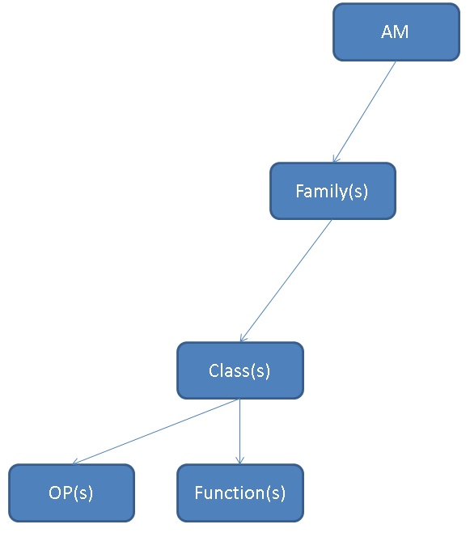

## PostgreSQL 如何确定某个opclass支持哪些操作符(支持索引)，JOIN方法，排序  
                                   
### 作者                                   
digoal                                    
                                      
### 日期                                    
2018-05-30                                                               
                                    
### 标签                                                                                                                                                    
PostgreSQL , 索引接口 , 操作符 , am , family , opclass , operator , function , order by   
                                  
----                                    
                                  
## 背景                            
PostgreSQL有很多的索引接口，同时索引接口还支持用户扩展，当扩展索引时，需要提供opclass。  
  
那么每一个扩展的opclass，支持什么操作符，支持什么JOIN方法，支持排序吗，是默认的OPCLASS吗？  
  
以btree_gin扩展包为例，它扩展了标准类型的GIN索引接口。那么扩展后支持哪些呢？  
  
```  
create extension btree_gin;  
```  
  
## 如何查询某个扩展的opclass支持哪些索引方法  
  
比如int4_ops是扩展的opclass。  
  
```  
postgres=# select * from pg_opclass where opcname='int4_ops';  
 opcmethod | opcname  | opcnamespace | opcowner | opcfamily | opcintype | opcdefault | opckeytype   
-----------+----------+--------------+----------+-----------+-----------+------------+------------  
       403 | int4_ops |           11 |       10 |      1976 |        23 | t          |          0  
       405 | int4_ops |           11 |       10 |      1977 |        23 | t          |          0  
      2742 | int4_ops |         2200 |       10 |     45744 |        23 | t          |          0  
(3 rows)  
  
关联pg_opclass.opcmethod, pg_am.oid  
(opckeytype表示索引里面存的KEY是什么类型，0表示与opcintype一致)  
  
postgres=# select oid,* from pg_am;  
 oid  | amname |  amhandler  | amtype   
------+--------+-------------+--------  
  403 | btree  | bthandler   | i  
  405 | hash   | hashhandler | i  
  783 | gist   | gisthandler | i  
 2742 | gin    | ginhandler  | i  
 4000 | spgist | spghandler  | i  
 3580 | brin   | brinhandler | i  
(6 rows)  
```  
  
int4_ops分别支持btree, hash, gin索引方法。  
  
## 如何查询某个扩展的opclass支持哪些类型  
  
```  
postgres=# select * from pg_opclass where opcname='int4_ops';  
 opcmethod | opcname  | opcnamespace | opcowner | opcfamily | opcintype | opcdefault | opckeytype   
-----------+----------+--------------+----------+-----------+-----------+------------+------------  
       403 | int4_ops |           11 |       10 |      1976 |        23 | t          |          0  
       405 | int4_ops |           11 |       10 |      1977 |        23 | t          |          0  
      2742 | int4_ops |         2200 |       10 |     45744 |        23 | t          |          0  
(3 rows)  
  
关联pg_opclass.opcintype, pg_type.oid  
  
postgres=# select oid,typname from pg_type where oid in (23);  
 oid | typname   
-----+---------  
  23 | int4  
(1 row)  
```  
  
## 如何查询某个扩展的opclass支持哪些操作符  
  
```  
postgres=# select * from pg_opclass where opcname='int4_ops';  
 opcmethod | opcname  | opcnamespace | opcowner | opcfamily | opcintype | opcdefault | opckeytype   
-----------+----------+--------------+----------+-----------+-----------+------------+------------  
       403 | int4_ops |           11 |       10 |      1976 |        23 | t          |          0  
       405 | int4_ops |           11 |       10 |      1977 |        23 | t          |          0  
      2742 | int4_ops |         2200 |       10 |     45744 |        23 | t          |          0  
(3 rows)  
  
关联pg_opclass.opcfamily, pg_amop.amopfamily  
  
postgres=# select * from pg_amop where amopfamily=45744;  
 amopfamily | amoplefttype | amoprighttype | amopstrategy | amoppurpose | amopopr | amopmethod | amopsortfamily   
------------+--------------+---------------+--------------+-------------+---------+------------+----------------  
      45744 |           23 |            23 |            1 | s           |      97 |       2742 |              0  
      45744 |           23 |            23 |            2 | s           |     523 |       2742 |              0  
      45744 |           23 |            23 |            3 | s           |      96 |       2742 |              0  
      45744 |           23 |            23 |            4 | s           |     525 |       2742 |              0  
      45744 |           23 |            23 |            5 | s           |     521 |       2742 |              0  
(5 rows)  
  
关联pg_operator.oid, pg_amop.amopopr  
  
postgres=# select oprname from pg_operator where oid in (select amopopr from pg_amop where amopfamily=45744);  
 oprname   
---------  
 <=  
 >  
 =  
 <  
 >=  
(5 rows)  
```  
  
## 如何查询某个扩展的opclass是否为默认OPCLASS  
  
```  
postgres=# select * from pg_opclass where opcname='int4_ops';  
 opcmethod | opcname  | opcnamespace | opcowner | opcfamily | opcintype | opcdefault | opckeytype   
-----------+----------+--------------+----------+-----------+-----------+------------+------------  
       403 | int4_ops |           11 |       10 |      1976 |        23 | t          |          0  
       405 | int4_ops |           11 |       10 |      1977 |        23 | t          |          0  
      2742 | int4_ops |         2200 |       10 |     45744 |        23 | t          |          0  
(3 rows)  
```  
  
opcdefault=t表示这个opcname是opcintype这个类型在opcmethod这个索引接口中的默认opclass.   
  
## 如何查询某个扩展的opclass支持哪些JOIN方法  
实际上JOIN方法与操作符有关，而操作符是否支持索引与索引接口实现有关。  
  
所以这个问题可以定义为一个索引接口支持的操作符，支持哪些JOIN方法。  
  
```  
postgres=# select * from pg_opclass where opcname='int4_ops';  
 opcmethod | opcname  | opcnamespace | opcowner | opcfamily | opcintype | opcdefault | opckeytype   
-----------+----------+--------------+----------+-----------+-----------+------------+------------  
       403 | int4_ops |           11 |       10 |      1976 |        23 | t          |          0  
       405 | int4_ops |           11 |       10 |      1977 |        23 | t          |          0  
      2742 | int4_ops |         2200 |       10 |     45744 |        23 | t          |          0  
(3 rows)  
  
关联pg_opclass.opcfamily, pg_amop.amopfamily  
  
postgres=# select * from pg_amop where amopfamily=45744;  
 amopfamily | amoplefttype | amoprighttype | amopstrategy | amoppurpose | amopopr | amopmethod | amopsortfamily   
------------+--------------+---------------+--------------+-------------+---------+------------+----------------  
      45744 |           23 |            23 |            1 | s           |      97 |       2742 |              0  
      45744 |           23 |            23 |            2 | s           |     523 |       2742 |              0  
      45744 |           23 |            23 |            3 | s           |      96 |       2742 |              0  
      45744 |           23 |            23 |            4 | s           |     525 |       2742 |              0  
      45744 |           23 |            23 |            5 | s           |     521 |       2742 |              0  
(5 rows)  
  
关联pg_operator.oid, pg_amop.amopopr  
  
postgres=# select * from pg_operator where oid in (select amopopr from pg_amop where amopfamily=45744);  
 oprname | oprnamespace | oprowner | oprkind | oprcanmerge | oprcanhash | oprleft | oprright | oprresult | oprcom | oprnegate | oprcode |   oprrest   |     oprjoin       
---------+--------------+----------+---------+-------------+------------+---------+----------+-----------+--------+-----------+---------+-------------+-----------------  
 <=      |           11 |       10 | b       | f           | f          |      23 |       23 |        16 |    525 |       521 | int4le  | scalarltsel | scalarltjoinsel  
 >       |           11 |       10 | b       | f           | f          |      23 |       23 |        16 |     97 |       523 | int4gt  | scalargtsel | scalargtjoinsel  
 =       |           11 |       10 | b       | t           | t          |      23 |       23 |        16 |     96 |       518 | int4eq  | eqsel       | eqjoinsel  
 <       |           11 |       10 | b       | f           | f          |      23 |       23 |        16 |    521 |       525 | int4lt  | scalarltsel | scalarltjoinsel  
 >=      |           11 |       10 | b       | f           | f          |      23 |       23 |        16 |    523 |        97 | int4ge  | scalargtsel | scalargtjoinsel  
(5 rows)  
```  
  
oprcanmerge是否支持MERGE JOIN。  
  
oprcanhash是否支持HASH JOIN。  
  
## 如何查询某个扩展的opclass是否支持排序  
  
```  
postgres=# select * from pg_opclass where opcname='int4_ops';  
 opcmethod | opcname  | opcnamespace | opcowner | opcfamily | opcintype | opcdefault | opckeytype   
-----------+----------+--------------+----------+-----------+-----------+------------+------------  
       403 | int4_ops |           11 |       10 |      1976 |        23 | t          |          0  
       405 | int4_ops |           11 |       10 |      1977 |        23 | t          |          0  
      2742 | int4_ops |         2200 |       10 |     45744 |        23 | t          |          0  
(3 rows)  
  
关联pg_opclass.opcfamily, pg_amop.amopfamily  
  
postgres=# select * from pg_amop where amopfamily=45744;  
 amopfamily | amoplefttype | amoprighttype | amopstrategy | amoppurpose | amopopr | amopmethod | amopsortfamily   
------------+--------------+---------------+--------------+-------------+---------+------------+----------------  
      45744 |           23 |            23 |            1 | s           |      97 |       2742 |              0  
      45744 |           23 |            23 |            2 | s           |     523 |       2742 |              0  
      45744 |           23 |            23 |            3 | s           |      96 |       2742 |              0  
      45744 |           23 |            23 |            4 | s           |     525 |       2742 |              0  
      45744 |           23 |            23 |            5 | s           |     521 |       2742 |              0  
(5 rows)  
  
  
amopsortfamily  
The B-tree operator family this entry sorts according to, if an ordering operator; zero if a search operator.  
  
0 表示这是个搜索的操作符  
  
其他表示这个是排序操作符  
```  
  
例如这个是knn排序的操作符  
  
```  
postgres=# select * from pg_amop where amopsortfamily<>0;  
 amopfamily | amoplefttype | amoprighttype | amopstrategy | amoppurpose | amopopr | amopmethod | amopsortfamily   
------------+--------------+---------------+--------------+-------------+---------+------------+----------------  
       1029 |          600 |           600 |           15 | o           |     517 |        783 |           1970  
       2594 |          604 |           600 |           15 | o           |    3289 |        783 |           1970  
       2595 |          718 |           600 |           15 | o           |    3291 |        783 |           1970  
(3 rows)  
  
postgres=# select * from pg_opclass where opcfamily=1029;  
 opcmethod |  opcname  | opcnamespace | opcowner | opcfamily | opcintype | opcdefault | opckeytype   
-----------+-----------+--------------+----------+-----------+-----------+------------+------------  
       783 | point_ops |           11 |       10 |      1029 |       600 | t          |        603  
(1 row)  
  
postgres=# select * from pg_operator where oid=517;  
 oprname | oprnamespace | oprowner | oprkind | oprcanmerge | oprcanhash | oprleft | oprright | oprresult | oprcom | oprnegate |    oprcode     | oprrest | oprjoin   
---------+--------------+----------+---------+-------------+------------+---------+----------+-----------+--------+-----------+----------------+---------+---------  
 <->     |           11 |       10 | b       | f           | f          |     600 |      600 |       701 |    517 |         0 | point_distance | -       | -  
(1 row)  
  
postgres=# select * from pg_operator where oid=3289;  
 oprname | oprnamespace | oprowner | oprkind | oprcanmerge | oprcanhash | oprleft | oprright | oprresult | oprcom | oprnegate |  oprcode   | oprrest | oprjoin   
---------+--------------+----------+---------+-------------+------------+---------+----------+-----------+--------+-----------+------------+---------+---------  
 <->     |           11 |       10 | b       | f           | f          |     604 |      600 |       701 |   3276 |         0 | dist_polyp | -       | -  
(1 row)  
  
postgres=# select * from pg_operator where oid=3291;  
 oprname | oprnamespace | oprowner | oprkind | oprcanmerge | oprcanhash | oprleft | oprright | oprresult | oprcom | oprnegate |   oprcode   | oprrest | oprjoin   
---------+--------------+----------+---------+-------------+------------+---------+----------+-----------+--------+-----------+-------------+---------+---------  
 <->     |           11 |       10 | b       | f           | f          |     718 |      600 |       701 |   1522 |         0 | dist_cpoint | -       | -  
(1 row)  
```  
  
如果创建了postgis插件，则可以看到有更多的支持距离排序的操作符，还有btree_gist，rum，pg_trgm等插件都支持距离排序。   
  
```
postgres=# create extension postgis;
CREATE EXTENSION
postgres=# create extension btree_gist;
CREATE EXTENSION
postgres=# create extension rum;
CREATE EXTENSION
postgres=# create extension pg_trgm;
CREATE EXTENSION

postgres=# select oprleft::regtype,oprright::regtype,oprresult::regtype,oprname,oprkind,oprcode from pg_operator where oid in (select amopopr  from pg_amop where amopsortfamily<>0);  
           oprleft           |          oprright           |    oprresult     | oprname | oprkind |              oprcode               
-----------------------------+-----------------------------+------------------+---------+---------+------------------------------------
 point                       | point                       | double precision | <->     | b       | point_distance
 circle                      | point                       | double precision | <->     | b       | dist_cpoint
 polygon                     | point                       | double precision | <->     | b       | dist_polyp
 geometry                    | geometry                    | double precision | <->     | b       | geometry_distance_centroid
 geometry                    | geometry                    | double precision | <#>     | b       | geometry_distance_box
 geometry                    | geometry                    | double precision | <<->>   | b       | geometry_distance_centroid_nd
 geometry                    | geometry                    | double precision | |=|     | b       | geometry_distance_cpa
 geography                   | geography                   | double precision | <->     | b       | geography_distance_knn
 interval                    | interval                    | interval         | <->     | b       | interval_dist
 oid                         | oid                         | oid              | <->     | b       | oid_dist
 time without time zone      | time without time zone      | interval         | <->     | b       | time_dist
 timestamp without time zone | timestamp without time zone | interval         | <->     | b       | ts_dist
 money                       | money                       | money            | <->     | b       | cash_dist
 date                        | date                        | integer          | <->     | b       | date_dist
 real                        | real                        | real             | <->     | b       | float4_dist
 double precision            | double precision            | double precision | <->     | b       | float8_dist
 smallint                    | smallint                    | smallint         | <->     | b       | int2_dist
 integer                     | integer                     | integer          | <->     | b       | int4_dist
 bigint                      | bigint                      | bigint           | <->     | b       | int8_dist
 timestamp with time zone    | timestamp with time zone    | interval         | <->     | b       | tstz_dist
 tsvector                    | tsquery                     | real             | <=>     | b       | public.rum_ts_distance
 timestamp without time zone | timestamp without time zone | double precision | <=>     | b       | rum_timestamp_distance
 timestamp without time zone | timestamp without time zone | double precision | <=|     | b       | rum_timestamp_left_distance
 timestamp without time zone | timestamp without time zone | double precision | |=>     | b       | rum_timestamp_right_distance
 timestamp with time zone    | timestamp with time zone    | double precision | <=>     | b       | rum_timestamptz_distance
 timestamp with time zone    | timestamp with time zone    | double precision | <=|     | b       | rum_timestamptz_left_distance
 timestamp with time zone    | timestamp with time zone    | double precision | |=>     | b       | rum_timestamptz_right_distance
 smallint                    | smallint                    | double precision | <=>     | b       | rum_int2_distance
 smallint                    | smallint                    | double precision | <=|     | b       | rum_int2_left_distance
 smallint                    | smallint                    | double precision | |=>     | b       | rum_int2_right_distance
 integer                     | integer                     | double precision | <=>     | b       | rum_int4_distance
 integer                     | integer                     | double precision | <=|     | b       | rum_int4_left_distance
 integer                     | integer                     | double precision | |=>     | b       | rum_int4_right_distance
 bigint                      | bigint                      | double precision | <=>     | b       | rum_int8_distance
 bigint                      | bigint                      | double precision | <=|     | b       | rum_int8_left_distance
 bigint                      | bigint                      | double precision | |=>     | b       | rum_int8_right_distance
 real                        | real                        | double precision | <=>     | b       | rum_float4_distance
 real                        | real                        | double precision | <=|     | b       | rum_float4_left_distance
 real                        | real                        | double precision | |=>     | b       | rum_float4_right_distance
 double precision            | double precision            | double precision | <=>     | b       | rum_float8_distance
 double precision            | double precision            | double precision | <=|     | b       | rum_float8_left_distance
 double precision            | double precision            | double precision | |=>     | b       | rum_float8_right_distance
 money                       | money                       | double precision | <=>     | b       | rum_money_distance
 money                       | money                       | double precision | <=|     | b       | rum_money_left_distance
 money                       | money                       | double precision | |=>     | b       | rum_money_right_distance
 oid                         | oid                         | double precision | <=>     | b       | rum_oid_distance
 oid                         | oid                         | double precision | <=|     | b       | rum_oid_left_distance
 oid                         | oid                         | double precision | |=>     | b       | rum_oid_right_distance
 anyarray                    | anyarray                    | double precision | <=>     | b       | rum_anyarray_distance
 text                        | text                        | real             | <->     | b       | similarity_dist
 text                        | text                        | real             | <->>    | b       | word_similarity_dist_commutator_op
(51 rows)
```
    
## 代码层面理解  
https://www.postgresql.org/docs/devel/static/xindex.html  
  
  
  
例子  
  
```
CREATE OPERATOR FAMILY integer_ops USING btree;

CREATE OPERATOR CLASS int8_ops
DEFAULT FOR TYPE int8 USING btree FAMILY integer_ops AS
  -- standard int8 comparisons
  OPERATOR 1 < ,
  OPERATOR 2 <= ,
  OPERATOR 3 = ,
  OPERATOR 4 >= ,
  OPERATOR 5 > ,
  FUNCTION 1 btint8cmp(int8, int8) ,
  FUNCTION 2 btint8sortsupport(internal) ,
  FUNCTION 3 in_range(int8, int8, int8, boolean, boolean) ;

CREATE OPERATOR CLASS int4_ops
DEFAULT FOR TYPE int4 USING btree FAMILY integer_ops AS
  -- standard int4 comparisons
  OPERATOR 1 < ,
  OPERATOR 2 <= ,
  OPERATOR 3 = ,
  OPERATOR 4 >= ,
  OPERATOR 5 > ,
  FUNCTION 1 btint4cmp(int4, int4) ,
  FUNCTION 2 btint4sortsupport(internal) ,
  FUNCTION 3 in_range(int4, int4, int4, boolean, boolean) ;

CREATE OPERATOR CLASS int2_ops
DEFAULT FOR TYPE int2 USING btree FAMILY integer_ops AS
  -- standard int2 comparisons
  OPERATOR 1 < ,
  OPERATOR 2 <= ,
  OPERATOR 3 = ,
  OPERATOR 4 >= ,
  OPERATOR 5 > ,
  FUNCTION 1 btint2cmp(int2, int2) ,
  FUNCTION 2 btint2sortsupport(internal) ,
  FUNCTION 3 in_range(int2, int2, int2, boolean, boolean) ;

ALTER OPERATOR FAMILY integer_ops USING btree ADD
  -- cross-type comparisons int8 vs int2
  OPERATOR 1 < (int8, int2) ,
  OPERATOR 2 <= (int8, int2) ,
  OPERATOR 3 = (int8, int2) ,
  OPERATOR 4 >= (int8, int2) ,
  OPERATOR 5 > (int8, int2) ,
  FUNCTION 1 btint82cmp(int8, int2) ,

  -- cross-type comparisons int8 vs int4
  OPERATOR 1 < (int8, int4) ,
  OPERATOR 2 <= (int8, int4) ,
  OPERATOR 3 = (int8, int4) ,
  OPERATOR 4 >= (int8, int4) ,
  OPERATOR 5 > (int8, int4) ,
  FUNCTION 1 btint84cmp(int8, int4) ,

  -- cross-type comparisons int4 vs int2
  OPERATOR 1 < (int4, int2) ,
  OPERATOR 2 <= (int4, int2) ,
  OPERATOR 3 = (int4, int2) ,
  OPERATOR 4 >= (int4, int2) ,
  OPERATOR 5 > (int4, int2) ,
  FUNCTION 1 btint42cmp(int4, int2) ,

  -- cross-type comparisons int4 vs int8
  OPERATOR 1 < (int4, int8) ,
  OPERATOR 2 <= (int4, int8) ,
  OPERATOR 3 = (int4, int8) ,
  OPERATOR 4 >= (int4, int8) ,
  OPERATOR 5 > (int4, int8) ,
  FUNCTION 1 btint48cmp(int4, int8) ,

  -- cross-type comparisons int2 vs int8
  OPERATOR 1 < (int2, int8) ,
  OPERATOR 2 <= (int2, int8) ,
  OPERATOR 3 = (int2, int8) ,
  OPERATOR 4 >= (int2, int8) ,
  OPERATOR 5 > (int2, int8) ,
  FUNCTION 1 btint28cmp(int2, int8) ,

  -- cross-type comparisons int2 vs int4
  OPERATOR 1 < (int2, int4) ,
  OPERATOR 2 <= (int2, int4) ,
  OPERATOR 3 = (int2, int4) ,
  OPERATOR 4 >= (int2, int4) ,
  OPERATOR 5 > (int2, int4) ,
  FUNCTION 1 btint24cmp(int2, int4) ,

  -- cross-type in_range functions
  FUNCTION 3 in_range(int4, int4, int8, boolean, boolean) ,
  FUNCTION 3 in_range(int4, int4, int2, boolean, boolean) ,
  FUNCTION 3 in_range(int2, int2, int8, boolean, boolean) ,
  FUNCTION 3 in_range(int2, int2, int4, boolean, boolean) ;
```
  
## 小结
从本例来看，使用btree_gin接口，可以实现标准类型在GIN索引中的范围扫描。   
    
## 参考  
https://www.postgresql.org/docs/10/static/catalogs.html  
  
```  
51.3. pg_am  
51.4. pg_amop  
51.5. pg_amproc  
  
51.33. pg_opclass  
51.34. pg_operator  
51.35. pg_opfamily  
```  
    
  
<a rel="nofollow" href="http://info.flagcounter.com/h9V1"  ></a>  
  
  
  
  
  
  
## [digoal's 大量PostgreSQL文章入口](https://github.com/digoal/blog/blob/master/README.md "22709685feb7cab07d30f30387f0a9ae")
  
