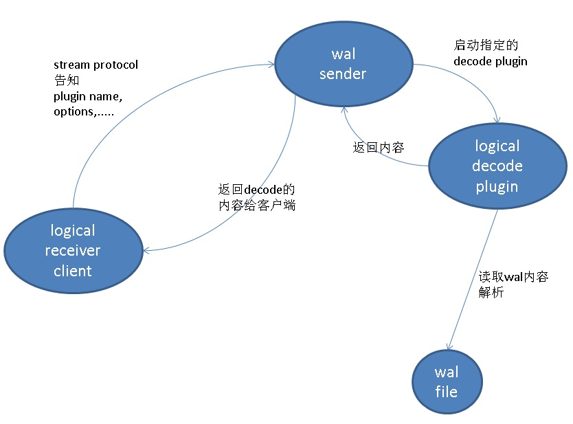

## PostgreSQL pg_recvlogical 与 test_decoding 自定义，支持source table filter, 对接kafka,es等 - PostgreSQL CDC - (wal2json + Debezium)
                                                           
### 作者                                                           
digoal                                                           
                                                           
### 日期                                                           
2018-06-01                                                         
                                                           
### 标签                                                           
PostgreSQL , pg_receivewal , pg_recvlogical   
                                                           
----                                                           
                                                           
## 背景    
pg_recvlogical 是PG提供的一个通过流复制协议，实时接收数据库逻辑变更的命令行客户端。  
  
逻辑变更内容的来源是上游数据库的wal sender进程调用logical decode plugin处理的。  
  
通过给decode plugin传递plugin option，可以实现参数的传递。  
  
PostgreSQL 9.5后引入的特性，支持通过流复制协议传递option, value.   
  
### stream protocol 协议支持option上报  
https://www.postgresql.org/docs/10/static/protocol-replication.html  
  
```  
START_REPLICATION SLOT slot_name LOGICAL XXX/XXX [ ( option_name [ option_value ] [, ...] ) ]  
Instructs server to start streaming WAL for logical replication, starting at WAL location XXX/XXX. The server can reply with an error, for example if the requested section of WAL has already been recycled. On success, server responds with a CopyBothResponse message, and then starts to stream WAL to the frontend.  
  
The messages inside the CopyBothResponse messages are of the same format documented for START_REPLICATION ... PHYSICAL.  
  
The output plugin associated with the selected slot is used to process the output for streaming.  
  
SLOT slot_name  
The name of the slot to stream changes from. This parameter is required, and must correspond to an existing logical replication slot created with CREATE_REPLICATION_SLOT in LOGICAL mode.  
  
XXX/XXX  
The WAL location to begin streaming at.  
  
option_name  
The name of an option passed to the slot's logical decoding plugin.  
  
option_value  
Optional value, in the form of a string constant, associated with the specified option.  
```  
  
所以，从9.5开始，我们可以在客户端向服务端的decode plugin传递信息，例如告诉decode plugin，想同步哪些表，哪些条件等等（当然这些需要在decode plugin中有对应逻辑）。  
  
  
  
test_decode是pg内置的一个逻辑decode插件，通过修改test_decode，可以实现需要的格式输出，例如JSON。也可以实现TABLE的过滤等。  
  
通过修改客户端pg_recvlogical 的代码，可以实现通过stream protocol上报需要过滤什么TABLE，以及写入到出标准输出、文件以外的例如kafka或者其他目标端。  
  
## pg_recvlogical  
https://www.postgresql.org/docs/10/static/app-pgrecvlogical.html  
  
```  
-o name[=value]  
--option=name[=value]  
Pass the option name to the output plugin with, if specified, the option value value. Which options exist and their effects depends on the used output plugin.  
  
  
  
-P plugin  
--plugin=plugin  
When creating a slot, use the specified logical decoding output plugin. See Chapter 48. This option has no effect if the slot already exists.  
  
  
  
-F interval_seconds  
--fsync-interval=interval_seconds  
Specifies how often pg_recvlogical should issue fsync() calls to ensure the output file is safely flushed to disk.  
  
The server will occasionally request the client to perform a flush and report the flush position to the server. This setting is in addition to that, to perform flushes more frequently.  
  
Specifying an interval of 0 disables issuing fsync() calls altogether, while still reporting progress to the server. In this case, data could be lost in the event of a crash.  
```  
  
  
## logical 代码  
https://www.postgresql.org/docs/10/static/logicaldecoding-output-plugin.html  
  
初始化decodeing  
  
src/backend/replication/logical/logical.c  
  
```  
 195 /*  
 196  * Create a new decoding context, for a new logical slot.  
 197  *  
 198  * plugin contains the name of the output plugin  
 199  * output_plugin_options contains options passed to the output plugin  
 200  * read_page, prepare_write, do_write are callbacks that have to be filled to  
 201  *      perform the use-case dependent, actual, work.  
 202  *  
 203  * Needs to be called while in a memory context that's at least as long lived  
 204  * as the decoding context because further memory contexts will be created  
 205  * inside it.  
 206  *  
 207  * Returns an initialized decoding context after calling the output plugin's  
 208  * startup function.  
 209  */  
 210 LogicalDecodingContext *  
 211 CreateInitDecodingContext(char *plugin,  
 212                           List *output_plugin_options,   // 传递参数  
 213                           bool need_full_snapshot,  
 214                           XLogPageReadCB read_page,  
 215                           LogicalOutputPluginWriterPrepareWrite prepare_write,  
 216                           LogicalOutputPluginWriterWrite do_write)  
 217 {  
```  
  
## test decoding  
解析option参数  
  
contrib/test_decoding/test_decoding.c  
  
```  
/* initialize this plugin */  
  89 static void  
  90 pg_decode_startup(LogicalDecodingContext *ctx, OutputPluginOptions *opt,  
  91                   bool is_init)  
  92 {  
  93     ListCell   *option;  
  94     TestDecodingData *data;  
  95   
  96     data = palloc0(sizeof(TestDecodingData));  
  97     data->context = AllocSetContextCreate(ctx->context,  
  98                                           "text conversion context",  
  99                                           ALLOCSET_DEFAULT_MINSIZE,  
 100                                           ALLOCSET_DEFAULT_INITSIZE,  
 101                                           ALLOCSET_DEFAULT_MAXSIZE);  
 102     data->include_xids = true;  
 103     data->include_timestamp = false;  
 104     data->skip_empty_xacts = false;  
 105     data->only_local = false;  
 106   
 107     ctx->output_plugin_private = data;  
 108   
 109     opt->output_type = OUTPUT_PLUGIN_TEXTUAL_OUTPUT;  
 110   
 111     foreach(option, ctx->output_plugin_options)  
 112     {  
 113         DefElem    *elem = lfirst(option);  
 114   
 115         Assert(elem->arg == NULL || IsA(elem->arg, String));  
 116   
 117         if (strcmp(elem->defname, "include-xids") == 0)   // 参数  
 118         {  
 119             /* if option does not provide a value, it means its value is true */  
 120             if (elem->arg == NULL)  
 121                 data->include_xids = true;  
 122             else if (!parse_bool(strVal(elem->arg), &data->include_xids))  
 123                 ereport(ERROR,  
 124                         (errcode(ERRCODE_INVALID_PARAMETER_VALUE),  
 125                   errmsg("could not parse value \"%s\" for parameter \"%s\"",  
 126                          strVal(elem->arg), elem->defname)));  
 127         }  
 128         else if (strcmp(elem->defname, "include-timestamp") == 0)  // 参数  
 129         {  
 130             if (elem->arg == NULL)  
 131                 data->include_timestamp = true;  
 132             else if (!parse_bool(strVal(elem->arg), &data->include_timestamp))  
 133                 ereport(ERROR,  
 134                         (errcode(ERRCODE_INVALID_PARAMETER_VALUE),  
 135                   errmsg("could not parse value \"%s\" for parameter \"%s\"",  
 136                          strVal(elem->arg), elem->defname)));  
 137         }  
 138         else if (strcmp(elem->defname, "force-binary") == 0)  // 参数  
 139         {  
 140             bool        force_binary;  
 141   
 142             if (elem->arg == NULL)  
 143                 continue;  
 144             else if (!parse_bool(strVal(elem->arg), &force_binary))  
 145                 ereport(ERROR,  
 146                         (errcode(ERRCODE_INVALID_PARAMETER_VALUE),  
 147                   errmsg("could not parse value \"%s\" for parameter \"%s\"",  
 148                          strVal(elem->arg), elem->defname)));  
 149   
 150             if (force_binary)  
 151                 opt->output_type = OUTPUT_PLUGIN_BINARY_OUTPUT;  
 152         }  
 153         else if (strcmp(elem->defname, "skip-empty-xacts") == 0)  // 参数  
 154         {  
 155   
 156             if (elem->arg == NULL)  
 157                 data->skip_empty_xacts = true;  
 158             else if (!parse_bool(strVal(elem->arg), &data->skip_empty_xacts))  
 159                 ereport(ERROR,  
 160                         (errcode(ERRCODE_INVALID_PARAMETER_VALUE),  
 161                   errmsg("could not parse value \"%s\" for parameter \"%s\"",  
 162                          strVal(elem->arg), elem->defname)));  
 163         }  
 164         else if (strcmp(elem->defname, "only-local") == 0)  // 参数  
 165         {  
 166   
 167             if (elem->arg == NULL)  
 168                 data->only_local = true;  
 169             else if (!parse_bool(strVal(elem->arg), &data->only_local))  
 170                 ereport(ERROR,  
 171                         (errcode(ERRCODE_INVALID_PARAMETER_VALUE),  
 172                   errmsg("could not parse value \"%s\" for parameter \"%s\"",  
 173                          strVal(elem->arg), elem->defname)));  
 174         }  
 175         else  
 176         {  
 177             ereport(ERROR,  
 178                     (errcode(ERRCODE_INVALID_PARAMETER_VALUE),  
 179                      errmsg("option \"%s\" = \"%s\" is unknown",  
 180                             elem->defname,  
 181                             elem->arg ? strVal(elem->arg) : "(null)")));  
 182         }  
 183     }  
 184 }  
 185   
```  
  
  
  
## 参考  
https://www.2ndquadrant.com/en/resources/pglogical/  
  
https://github.com/eulerto/wal2json  
  
https://github.com/debezium/postgres-decoderbufs  
  
https://debezium.io/docs/connectors/postgresql/  
  
函数接口  
  
https://www.postgresql.org/docs/devel/static/functions-admin.html#FUNCTIONS-REPLICATION  
  
https://www.postgresql.org/docs/devel/static/test-decoding.html  
  
wal2json+debezium   
  
https://github.com/fatihmehmetkose/debezium-aws-rds-config-scripts  
  
  
  
  
  
  
  
  
  
  
  
  
  
  
  
  
  
  
  
  
  
  
  
  
  
  
  
  
  
  
  
  
  
  
  
  
  
  
  
  
  
  
  
  
  
  
  
  
  
  
  
  
  
  
  
  
  
  
  
  
  
  
  
  
  
  
  
  
  
  
  
  
  
  
  
  
#### [PostgreSQL 许愿链接](https://github.com/digoal/blog/issues/76 "269ac3d1c492e938c0191101c7238216")
您的愿望将传达给PG kernel hacker、数据库厂商等, 帮助提高数据库产品质量和功能, 说不定下一个PG版本就有您提出的功能点. 针对非常好的提议，奖励限量版PG文化衫、纪念品、贴纸、PG热门书籍等，奖品丰富，快来许愿。[开不开森](https://github.com/digoal/blog/issues/76 "269ac3d1c492e938c0191101c7238216").  
  
  
#### [9.9元购买3个月阿里云RDS PostgreSQL实例](https://www.aliyun.com/database/postgresqlactivity "57258f76c37864c6e6d23383d05714ea")
  
  
#### [PostgreSQL 解决方案集合](https://yq.aliyun.com/topic/118 "40cff096e9ed7122c512b35d8561d9c8")
  
  
#### [德哥 / digoal's github - 公益是一辈子的事.](https://github.com/digoal/blog/blob/master/README.md "22709685feb7cab07d30f30387f0a9ae")
  
  

  
  
#### [PolarDB 学习图谱: 训练营、培训认证、在线互动实验、解决方案、生态合作、写心得拿奖品](https://www.aliyun.com/database/openpolardb/activity "8642f60e04ed0c814bf9cb9677976bd4")
  
  
#### [购买PolarDB云服务折扣活动进行中, 55元起](https://www.aliyun.com/activity/new/polardb-yunparter?userCode=bsb3t4al "e0495c413bedacabb75ff1e880be465a")
  
  
#### [About 德哥](https://github.com/digoal/blog/blob/master/me/readme.md "a37735981e7704886ffd590565582dd0")
  
