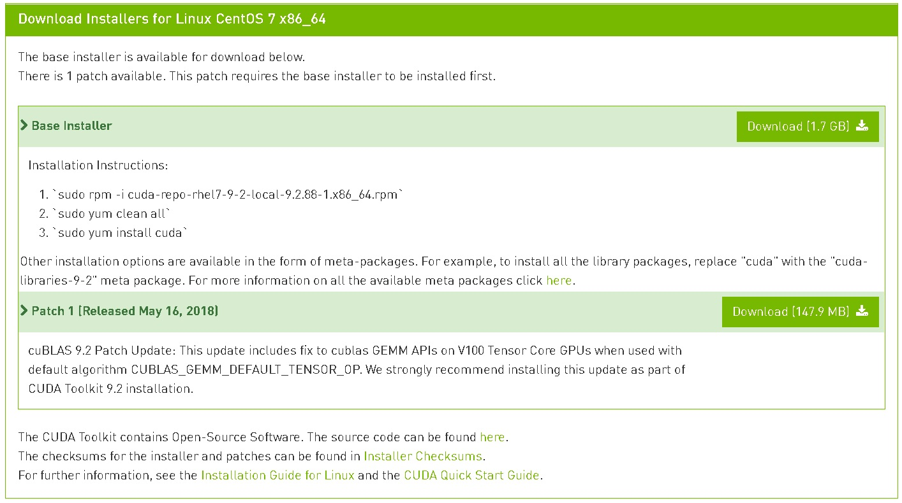
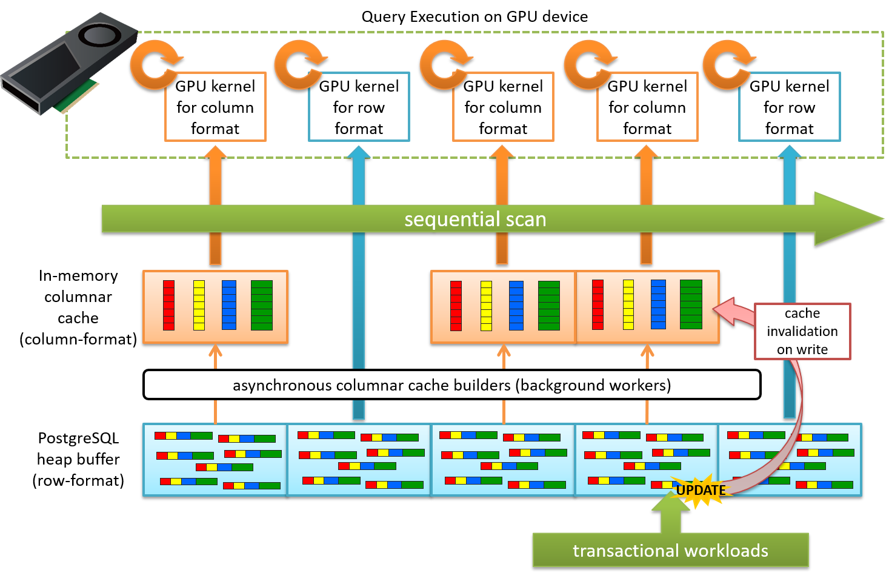
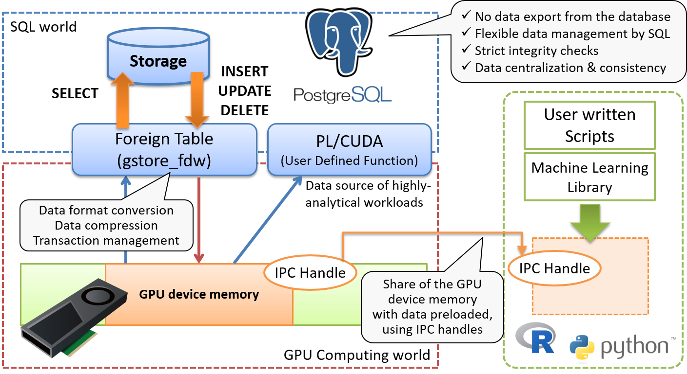
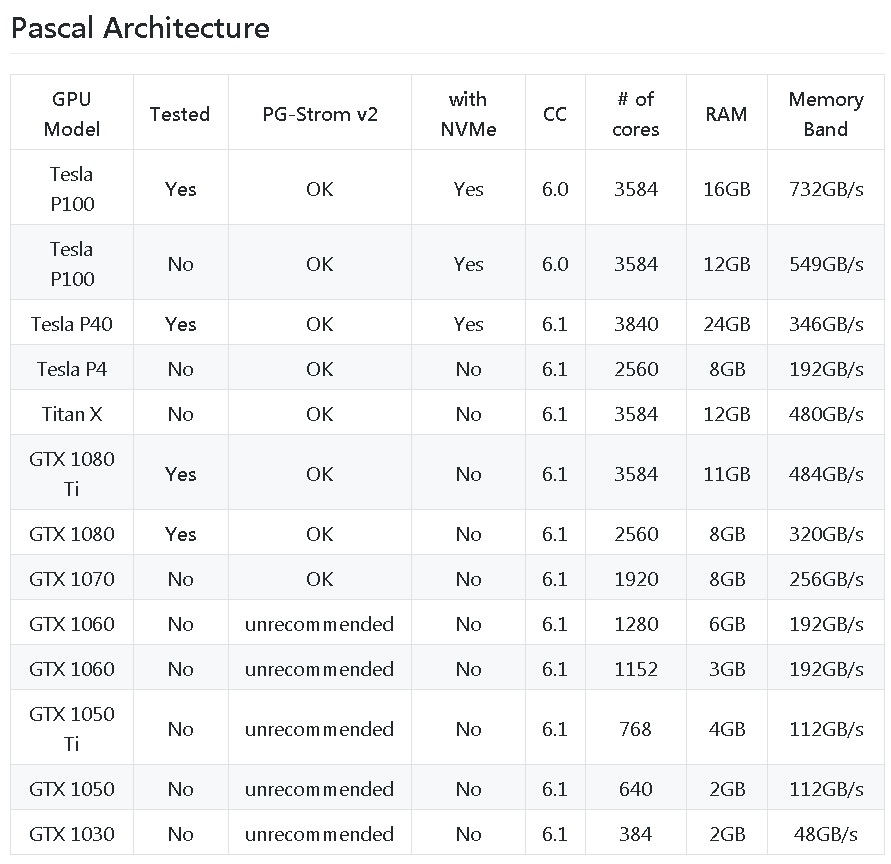
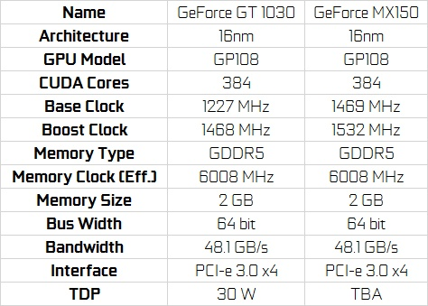

## PostgreSQL GPU 加速(HeteroDB pg_strom) (GPU计算, GPU-DIO-Nvme SSD, 列存, GPU内存缓存)  
                                                             
### 作者                                                             
digoal                                                             
                                                             
### 日期                                                             
2018-06-02                                                           
                                                             
### 标签                                                             
PostgreSQL , GPU , heteroDB , pg_strom , CUDA , nvidia , DIO , Nvme , SSD , 列存 , GPU内存缓存    
                                                             
----                                                             
                                                             
## 背景     
HeteroDB pg_strom是PG的一个GPU加速插件，目前已支持到PG 11的版本。  
  
在这些场景中可以加速查询，非常适合计算型场景（OLAP场景）  
  
1、FILTER  
  
2、聚合  
  
3、JOIN  
  
4、GROUP BY  
  
同时PG_strom还引入了一些高级特性：  
  
1、结合PG CPU并行计算，实现CPU + GPU混合并行，使得计算能力大幅提升  
  
2、GPU直接访问SSD，节约内存，同时缩短访问路径，提高了访问吞吐  
  
3、创建堆表的列存格式副本，custom scan自动识别，如果有列存副本，优先使用列存副本，提高OLAP SQL性能  
  
4、可以将经常需要计算的表，加载到GPU的内存中，GPU对这部分数据重复计算时，不需要重复从内存或磁盘加载。  
  
GPU的引入，无疑又拔高了数据库的分析能力。  
  
## 硬件配置  
  
海尔，凌越，S5000  
  
1、CPU：i7 - 8550U (4核8线程, 可睿频到4 GHz)  
  
```  
digoal@digoal-Haier5000A-> lscpu  
Architecture:          x86_64  
CPU op-mode(s):        32-bit, 64-bit  
Byte Order:            Little Endian  
CPU(s):                8  
On-line CPU(s) list:   0-7  
Thread(s) per core:    2  
Core(s) per socket:    4  
Socket(s):             1  
NUMA node(s):          1  
Vendor ID:             GenuineIntel  
CPU family:            6  
Model:                 142  
Model name:            Intel(R) Core(TM) i7-8550U CPU @ 1.80GHz  
Stepping:              10  
CPU MHz:               4000.244  
CPU max MHz:           4000.0000  
CPU min MHz:           400.0000  
BogoMIPS:              3984.00  
Virtualization:        VT-x  
L1d cache:             32K  
L1i cache:             32K  
L2 cache:              256K  
L3 cache:              8192K  
NUMA node0 CPU(s):     0-7  
Flags:                 fpu vme de pse tsc msr pae mce cx8 apic sep mtrr pge mca cmov pat pse36 clflush dts acpi mmx fxsr sse sse2 ss ht tm pbe syscall nx pdpe1gb rdtscp lm constant_tsc art arch_perfmon pebs bts rep_good nopl xtopology nonstop_tsc aperfmperf eagerfpu pni pclmulqdq dtes64 monitor ds_cpl vmx est tm2 ssse3 sdbg fma cx16 xtpr pdcm pcid sse4_1 sse4_2 x2apic movbe popcnt tsc_deadline_timer aes xsave avx f16c rdrand lahf_lm abm 3dnowprefetch epb intel_pt tpr_shadow vnmi flexpriority ept vpid fsgsbase tsc_adjust bmi1 avx2 smep bmi2 erms invpcid mpx rdseed adx smap clflushopt xsaveopt xsavec xgetbv1 ibpb ibrs stibp dtherm ida arat pln pts hwp hwp_notify hwp_act_window hwp_epp spec_ctrl intel_stibp  
```  
  
2、内存：8G DDR4-2400 * 2  
  
```  
dmidecode  
  
Handle 0x0003, DMI type 17, 40 bytes  
Memory Device  
        Array Handle: 0x0002  
        Error Information Handle: Not Provided  
        Total Width: 64 bits  
        Data Width: 64 bits  
        Size: 8192 MB  
        Form Factor: SODIMM  
        Set: None  
        Locator: ChannelA-DIMM0  
        Bank Locator: BANK 0  
        Type: DDR4  
        Type Detail: Synchronous Unbuffered (Unregistered)  
        Speed: 2400 MHz  
        Manufacturer: 859B  
        Serial Number: 190ED94E  
        Asset Tag: 9876543210  
        Part Number: CT8G4SFS824A.C8FBD1   
        Rank: 1  
        Configured Clock Speed: 2400 MHz  
        Minimum Voltage: Unknown  
        Maximum Voltage: Unknown  
        Configured Voltage: 1.2 V  
  
Handle 0x0004, DMI type 17, 40 bytes  
Memory Device  
        Array Handle: 0x0002  
        Error Information Handle: Not Provided  
        Total Width: 64 bits  
        Data Width: 64 bits  
        Size: 8192 MB  
        Form Factor: SODIMM  
        Set: None  
        Locator: ChannelB-DIMM0  
        Bank Locator: BANK 2  
        Type: DDR4  
        Type Detail: Synchronous Unbuffered (Unregistered)  
        Speed: 2400 MHz  
        Manufacturer: Samsung  
        Serial Number: 35A4CCE1  
        Asset Tag: 9876543210  
        Part Number: M471A1K43BB1-CRC      
        Rank: 1  
        Configured Clock Speed: 2400 MHz  
        Minimum Voltage: Unknown  
        Maximum Voltage: Unknown  
        Configured Voltage: 1.2 V  
```  
  
3、硬盘1：建兴 LCH-256V2S  
  
```  
smartctl -x /dev/sda  
smartctl 6.5 2016-05-07 r4318 [x86_64-linux-3.10.0-862.3.2.el7.x86_64] (local build)  
Copyright (C) 2002-16, Bruce Allen, Christian Franke, www.smartmontools.org  
  
=== START OF INFORMATION SECTION ===  
Device Model:     LITEON LCH-256V2S  
Serial Number:    002448118079  
LU WWN Device Id: 5 002303 10035169e  
Firmware Version: FC8020A  
User Capacity:    256,060,514,304 bytes [256 GB]  
Sector Size:      512 bytes logical/physical  
Rotation Rate:    Solid State Device  
Device is:        Not in smartctl database [for details use: -P showall]  
ATA Version is:   ACS-2 (minor revision not indicated)  
SATA Version is:  SATA 3.1, 6.0 Gb/s (current: 6.0 Gb/s)  
Local Time is:    Sat Jun  2 16:45:17 2018 CST  
SMART support is: Available - device has SMART capability.  
SMART support is: Enabled  
AAM feature is:   Unavailable  
APM feature is:   Unavailable  
Rd look-ahead is: Enabled  
Write cache is:   Enabled  
ATA Security is:  Disabled, frozen [SEC2]  
Write SCT (Get) Feature Control Command failed: scsi error badly formed scsi parameters  
Wt Cache Reorder: Unknown (SCT Feature Control command failed)  
```  
  
4、硬盘2：三星 SM961, m.2 2280, 256GB   
  
```  
[root@digoal-Haier5000A ~]# smartctl -x /dev/nvme0n1  
smartctl 6.5 2016-05-07 r4318 [x86_64-linux-3.10.0-862.3.2.el7.x86_64] (local build)  
Copyright (C) 2002-16, Bruce Allen, Christian Franke, www.smartmontools.org  
  
=== START OF INFORMATION SECTION ===  
Model Number:                       SAMSUNG MZVPW256HEGL-00000  
Serial Number:                      S346NY0J206053  
Firmware Version:                   CXZ7500Q  
PCI Vendor/Subsystem ID:            0x144d  
IEEE OUI Identifier:                0x002538  
Total NVM Capacity:                 256,060,514,304 [256 GB]  
Unallocated NVM Capacity:           0  
Controller ID:                      2  
Number of Namespaces:               1  
Namespace 1 Size/Capacity:          256,060,514,304 [256 GB]  
Namespace 1 Utilization:            117,392,015,360 [117 GB]  
Namespace 1 Formatted LBA Size:     512  
Local Time is:                      Sat Jun  2 16:46:53 2018 CST  
Firmware Updates (0x16):            3 Slots, no Reset required  
Optional Admin Commands (0x0017):   Security Format Frmw_DL *Other*  
Optional NVM Commands (0x001f):     Comp Wr_Unc DS_Mngmt Wr_Zero Sav/Sel_Feat  
Warning  Comp. Temp. Threshold:     70 Celsius  
Critical Comp. Temp. Threshold:     73 Celsius  
```  
  
5、GPU：MX150 满血版  
  
```  
[root@digoal-Haier5000A ~]# nvidia-smi  
Sat Jun  2 16:47:23 2018         
+-----------------------------------------------------------------------------+  
| NVIDIA-SMI 396.26                 Driver Version: 396.26                    |  
|-------------------------------+----------------------+----------------------+  
| GPU  Name        Persistence-M| Bus-Id        Disp.A | Volatile Uncorr. ECC |  
| Fan  Temp  Perf  Pwr:Usage/Cap|         Memory-Usage | GPU-Util  Compute M. |  
|===============================+======================+======================|  
|   0  GeForce MX150       On   | 00000000:01:00.0 Off |                  N/A |  
| N/A   34C    P8    N/A /  N/A |     39MiB /  2002MiB |      0%      Default |  
+-------------------------------+----------------------+----------------------+  
                                                                                 
+-----------------------------------------------------------------------------+  
| Processes:                                                       GPU Memory |  
|  GPU       PID   Type   Process name                             Usage      |  
|=============================================================================|  
|    0      3217      C   ...bgworker: PG-Strom GPU memory keeper       29MiB |  
+-----------------------------------------------------------------------------+  
```  
  
### 硬件要求  
http://heterodb.github.io/pg-strom/install/  
  
Checklist  
  
Server Hardware  
It requires generic x86_64 hardware that can run Linux operating system supported by CUDA Toolkit. We have no special requirement for CPU, storage and network devices.  
note002:HW Validation List may help you to choose the hardware.  
SSD-to-GPU Direct SQL Execution needs SSD devices which support NVMe specification, and to be installed under the same PCIe Root Complex where GPU is located on.  
  
GPU Device  
PG-Strom requires at least one GPU device on the system, which is supported by CUDA Toolkit, has computing capability 6.0 (Pascal generation) or later;  
note001:GPU Availability Matrix shows more detailed information. Check this list for the support status of SSD-to-GPU Direct SQL Execution.  
  
Operating System  
PG-Strom requires Linux operating system for x86_64 architecture, and its distribution supported by CUDA Toolkit. Our recommendation is Red Hat Enterprise Linux or CentOS version 7.x series. - SSD-to-GPU Direct SQL Execution needs Red Hat Enterprise Linux or CentOS version 7.3 or later.  
  
PostgreSQL  
PG-Strom requires PostgreSQL version 9.6 or later. PostgreSQL v9.6 renew the custom-scan interface for CPU-parallel execution or GROUP BY planning, thus, it allows cooperation of custom-plans provides by extension modules.  
  
CUDA Toolkit  
PG-Strom requires CUDA Toolkit version 9.1 or later.  
PG-Strom provides half-precision floating point type (float2), and it internally use half_t type of CUDA C, so we cannot build it with older CUDA Toolkit.  
  
## 软件配置  
1、CentOS 7.4 x64  
  
```  
[root@digoal-Haier5000A ~]# uname -a  
Linux digoal-Haier5000A.lan 3.10.0-862.3.2.el7.x86_64 #1 SMP Mon May 21 23:36:36 UTC 2018 x86_64 x86_64 x86_64 GNU/Linux  
```  
  
安装操作系统时勾选：  
  
```  
最小化  
  
网络管理模块  
  
GNOME（方便配置网络）  
  
Debugging Tools  
  
Development Tools  
```  
  
2、PostgreSQL 10.4  
  
```  
yum -y install coreutils glib2 lrzsz mpstat dstat sysstat e4fsprogs xfsprogs ntp readline-devel zlib-devel openssl-devel pam-devel libxml2-devel libxslt-devel python-devel tcl-devel gcc make smartmontools flex bison perl-devel perl-ExtUtils* openldap-devel jadetex  openjade bzip2  
  
  
wget https://ftp.postgresql.org/pub/source/v10.4/postgresql-10.4.tar.bz2  
tar -jxvf postgresql-10.4.tar.bz2   
export USE_NAMED_POSIX_SEMAPHORES=1  
LIBS=-lpthread CFLAGS="-O3" ./configure --prefix=/home/digoal/pgsql10.4  
LIBS=-lpthread CFLAGS="-O3" make world -j 16  
LIBS=-lpthread CFLAGS="-O3" make install-world  
```  
  
数据库用户环境变量配置  
  
```  
[digoal@digoal-Haier5000A ~]$ vi ~/env.sh   
  
export PS1="$USER@`/bin/hostname -s`-> "  
export PGPORT=1921  
export PGDATA=/data01/pg/pg_root$PGPORT  
export LANG=en_US.utf8  
export PGHOME=/home/digoal/pgsql10.4  
export LD_LIBRARY_PATH=$PGHOME/lib:/lib64:/usr/lib64:/usr/local/lib64:/lib:/usr/lib:/usr/local/lib:$LD_LIBRARY_PATH  
export PATH=$PGHOME/bin:$PATH:.  
export DATE=`date +"%Y%m%d%H%M"`  
export MANPATH=$PGHOME/share/man:$MANPATH  
export PGHOST=$PGDATA  
export PGUSER=postgres  
export PGDATABASE=postgres  
alias rm='rm -i'  
alias ll='ls -lh'  
unalias vi  
```  
  
3、系统配置  
  
sysctl  
  
```  
/etc/sysctl.d/99-sysctl.conf   
  
# add by digoal.zhou  
fs.aio-max-nr = 1048576  
fs.file-max = 76724600  
kernel.core_pattern= /data01/corefiles/core_%e_%u_%t_%s.%p           
# /data01/corefiles事先建好，权限777，如果是软链接，对应的目录修改为777  
kernel.sem = 4096 2147483647 2147483646 512000      
# 信号量, ipcs -l 或 -u 查看，每16个进程一组，每组信号量需要17个信号量。  
kernel.shmall = 107374182        
# 所有共享内存段相加大小限制(建议内存的80%)  
kernel.shmmax = 274877906944     
# 最大单个共享内存段大小(建议为内存一半), >9.2的版本已大幅降低共享内存的使用  
kernel.shmmni = 819200           
# 一共能生成多少共享内存段，每个PG数据库集群至少2个共享内存段  
net.core.netdev_max_backlog = 10000  
net.core.rmem_default = 262144         
# The default setting of the socket receive buffer in bytes.  
net.core.rmem_max = 4194304            
# The maximum receive socket buffer size in bytes  
net.core.wmem_default = 262144         
# The default setting (in bytes) of the socket send buffer.  
net.core.wmem_max = 4194304            
# The maximum send socket buffer size in bytes.  
net.core.somaxconn = 4096  
net.ipv4.tcp_max_syn_backlog = 4096  
net.ipv4.tcp_keepalive_intvl = 20  
net.ipv4.tcp_keepalive_probes = 3  
net.ipv4.tcp_keepalive_time = 60  
net.ipv4.tcp_mem = 8388608 12582912 16777216  
net.ipv4.tcp_fin_timeout = 5  
net.ipv4.tcp_synack_retries = 2  
net.ipv4.tcp_syncookies = 1      
# 开启SYN Cookies。当出现SYN等待队列溢出时，启用cookie来处理，可防范少量的SYN攻击  
net.ipv4.tcp_timestamps = 1      
# 减少time_wait  
net.ipv4.tcp_tw_recycle = 0      
# 如果=1则开启TCP连接中TIME-WAIT套接字的快速回收，但是NAT环境可能导致连接失败，建议服务端关闭它  
net.ipv4.tcp_tw_reuse = 1        
# 开启重用。允许将TIME-WAIT套接字重新用于新的TCP连接  
net.ipv4.tcp_max_tw_buckets = 262144  
net.ipv4.tcp_rmem = 8192 87380 16777216  
net.ipv4.tcp_wmem = 8192 65536 16777216  
net.nf_conntrack_max = 1200000  
net.netfilter.nf_conntrack_max = 1200000  
vm.dirty_background_bytes = 409600000         
#  系统脏页到达这个值，系统后台刷脏页调度进程 pdflush（或其他） 自动将(dirty_expire_centisecs/100）秒前的脏页刷到磁盘  
vm.dirty_expire_centisecs = 3000               
#  比这个值老的脏页，将被刷到磁盘。3000表示30秒。  
vm.dirty_ratio = 95                            
#  如果系统进程刷脏页太慢，使得系统脏页超过内存 95 % 时，则用户进程如果有写磁盘的操作（如fsync, fdatasync等调用），则需要主动把系统脏页刷出。  
#  有效防止用户进程刷脏页，在单机多实例，并且使用CGROUP限制单实例IOPS的情况下非常有效。    
vm.dirty_writeback_centisecs = 100              
#  pdflush（或其他）后台刷脏页进程的唤醒间隔， 100表示1秒。  
vm.mmap_min_addr = 65536  
vm.overcommit_memory = 1       
#  在分配内存时，允许少量over malloc, 如果设置为 1, 则认为总是有足够的内存，内存较少的测试环境可以使用 1 .    
vm.overcommit_ratio = 90       
#  当overcommit_memory = 2 时，用于参与计算允许指派的内存大小。  
vm.swappiness = 0              
#  关闭交换分区  
vm.zone_reclaim_mode = 0       
# 禁用 numa, 或者在vmlinux中禁止.   
net.ipv4.ip_local_port_range = 40000 65535      
# 本地自动分配的TCP, UDP端口号范围  
fs.nr_open=20480000  
# 单个进程允许打开的文件句柄上限  
```  
  
selinux  
  
```  
/etc/sysconfig/selinux  
  
SELINUX=disabled  
```  
  
firewall  
  
```  
systemctl disable firewalld  
```  
  
ulimit  
  
```  
/etc/security/limits.d/20-nproc.conf   
  
* soft    nofile  1024000  
* hard    nofile  1024000  
* soft    nproc   unlimited  
* hard    nproc   unlimited  
* soft    core    unlimited  
* hard    core    unlimited  
* soft    memlock unlimited  
* hard    memlock unlimited  
```  
  
sshd  
  
```  
/etc/ssh/sshd_config   
  
UseDNS no  
```  
  
rc.local  
  
```  
chmod +x /etc/rc.d/rc.local  
  
/etc/rc.local   
  
for ((i=0;i<8;i++))  
do  
  echo performance > /sys/devices/system/cpu/cpu${i}/cpufreq/scaling_governor  
done  
  
if test -f /sys/kernel/mm/transparent_hugepage/enabled; then    
   echo never > /sys/kernel/mm/transparent_hugepage/enabled    
fi  
```  
  
target，配置好后，进入字符串界面即可，不需要启动图形界面。  
  
```  
systemctl set-default multi-user.target  
```  
  
other  
  
```  
systemctl enable sshd  
systemctl disable libvirtd.service   
systemctl disable avahi-daemon.service     
systemctl disable cryptsetup.target  
systemctl disable systemd-udev-settle  
systemctl disable systemd-udev-trigger  
systemctl disable systemd-udevd  
```  
  
## NVME硬盘分区（用于测试gpu_direct_access_nvme）  
  
注意使用parted对齐一下, 1MiB为单位对齐   
  
[《PostgreSQL 10 + PostGIS + Sharding(pg_pathman) + MySQL(fdw外部表) on ECS 部署指南(适合新用户) - 珍藏级》](../201710/20171018_01.md)    
  
```  
mkfs.ext4 /dev/nvme0n1p3 -m 0 -O extent,uninit_bg -E lazy_itable_init=1 -T largefile -L data01  
echo "LABEL=data01 /data01     ext4        defaults,noatime,nodiratime,nodelalloc,barrier=0,data=writeback    0 0" >> /etc/fstab   
mkdir /data01  
mount -a  
mkdir /data01/pg  
chown digoal:digoal /data01/pg  
```  
  
性能还是不错的，FSYNC 8K，接近20微秒的RT。  
  
```  
digoal@digoal-Haier5000A-> pg_test_fsync   
5 seconds per test  
O_DIRECT supported on this platform for open_datasync and open_sync.  
  
Compare file sync methods using one 8kB write:  
(in wal_sync_method preference order, except fdatasync is Linux's default)  
        open_datasync                     48690.840 ops/sec      21 usecs/op  
        fdatasync                         43169.165 ops/sec      23 usecs/op  
        fsync                             39566.305 ops/sec      25 usecs/op  
        fsync_writethrough                              n/a  
        open_sync                         47421.965 ops/sec      21 usecs/op  
  
Compare file sync methods using two 8kB writes:  
(in wal_sync_method preference order, except fdatasync is Linux's default)  
        open_datasync                     25555.806 ops/sec      39 usecs/op  
        fdatasync                         31886.334 ops/sec      31 usecs/op  
        fsync                             29025.142 ops/sec      34 usecs/op  
        fsync_writethrough                              n/a  
        open_sync                         23726.243 ops/sec      42 usecs/op  
  
Compare open_sync with different write sizes:  
(This is designed to compare the cost of writing 16kB in different write  
open_sync sizes.)  
         1 * 16kB open_sync write         36906.246 ops/sec      27 usecs/op  
         2 *  8kB open_sync writes        23886.218 ops/sec      42 usecs/op  
         4 *  4kB open_sync writes        10152.480 ops/sec      98 usecs/op  
         8 *  2kB open_sync writes         4758.217 ops/sec     210 usecs/op  
        16 *  1kB open_sync writes         2323.391 ops/sec     430 usecs/op  
  
Test if fsync on non-write file descriptor is honored:  
(If the times are similar, fsync() can sync data written on a different  
descriptor.)  
        write, fsync, close               33724.404 ops/sec      30 usecs/op  
        write, close, fsync               33855.126 ops/sec      30 usecs/op  
  
Non-sync'ed 8kB writes:  
        write                            309504.352 ops/sec       3 usecs/op  
```  
  
## 安装nvidia驱动  
1、在图形界面时，下载好NVIDIA驱动软件(或者在其他电脑下载好传过去)  
  
https://www.nvidia.com/Download/index.aspx  
  
Product Type: GeForce  
  
Product Series: GeForce MX100 Series (Notebook)  
  
Product: GeForce MX150  
  
Operating System: Linux 64-bit  
  
Language: English (US)  
  
```  
LINUX X64 (AMD64/EM64T) DISPLAY DRIVER  
   
Version:	390.59  
Release Date:	2018.5.16  
Operating System:	Linux 64-bit  
Language:	English (US)  
File Size:	78.89 MB  
```  
  
2、安装EPEL  
  
```  
yum install -y https://dl.fedoraproject.org/pub/epel/epel-release-latest-7.noarch.rpm  
```  
  
3、安装dkms  
  
```  
yum install -y dkms  
```  
  
4、干掉默认的nouveau模块  
  
```  
vi /etc/modprobe.d/blacklist.conf   
  
blacklist nouveau  
options nouveau modeset=0  
```  
  
5、打包启动镜像，过滤nouveau，重启  
  
```  
mv /boot/initramfs-$(uname -r).img /boot/initramfs-$(uname -r).img.bak  
dracut -v /boot/initramfs-$(uname -r).img $(uname -r)  
  
reboot  
```  
  
重启后确认nouveau模块已未加载  
  
```  
[root@digoal-Haier5000A ~]# lsmod|grep nouveau  
[root@digoal-Haier5000A ~]#   
```  
  
6、安装nvidia驱动  
  
```  
chmod +x NVIDIA-Linux-x86_64-390.59.run  
./NVIDIA-Linux-x86_64-390.59.run  
  
选择dkms模式安装，打包到内核。不需要安装32位兼容。  
```  
  
7、重启  
  
```  
reboot  
```  
  
检查已加载nvidia驱动(安装cuda后查看可能会多一些)  
  
```  
[root@digoal-Haier5000A ~]# lsmod|grep nvi  
nvidia_drm             39676  0   
nvidia_modeset       1104417  1 nvidia_drm  
nvidia              14355766  1 nvidia_modeset  
ipmi_msghandler        46608  2 ipmi_devintf,nvidia  
drm_kms_helper        176920  2 i915,nvidia_drm  
drm                   397988  4 i915,drm_kms_helper,nvidia_drm  
i2c_core               63151  7 drm,i915,i2c_i801,i2c_hid,drm_kms_helper,i2c_algo_bit,nvidia  
```  
  
8、查看GPU命令  
  
```  
[root@digoal-Haier5000A Downloads]# nvidia-smi  
Sat Jun  2 17:19:13 2018         
+-----------------------------------------------------------------------------+  
| NVIDIA-SMI 396.26                 Driver Version: 396.26                    |  
|-------------------------------+----------------------+----------------------+  
| GPU  Name        Persistence-M| Bus-Id        Disp.A | Volatile Uncorr. ECC |  
| Fan  Temp  Perf  Pwr:Usage/Cap|         Memory-Usage | GPU-Util  Compute M. |  
|===============================+======================+======================|  
|   0  GeForce MX150       On   | 00000000:01:00.0 Off |                  N/A |  
| N/A   34C    P8    N/A /  N/A |     39MiB /  2002MiB |      0%      Default |  
+-------------------------------+----------------------+----------------------+  
                                                                                 
+-----------------------------------------------------------------------------+  
| Processes:                                                       GPU Memory |  
|  GPU       PID   Type   Process name                             Usage      |  
|=============================================================================|  
|    0      3217      C   ...bgworker: PG-Strom GPU memory keeper       29MiB |  
+-----------------------------------------------------------------------------+  
```  
  
9、Persistence-M设置命令  
  
```  
nvidia-persistenced  
```  
  
图形化设置  
  
```  
nvidia-settings  
```  
  
## 安装cuda开发SDK  
https://developer.download.nvidia.com/compute/cuda/9.2/Prod/docs/sidebar/CUDA_Quick_Start_Guide.pdf  
  
https://developer.nvidia.com/cuda-downloads  
  
尽量本地安装，因为NVIDIA网站可能未备案，YUM 远程安装可能失败。  
  
  
  
  
  
```  
rpm -ivh cuda-repo-rhel7-9-2-local-9.2.88-1.x86_64  
  
rpm -ivh cuda-repo-rhel7-9-2-local-cublas-update-1-1.0-1.x86_64  
```  
  
查看解压位置  
  
```  
[root@digoal-Haier5000A Downloads]# rpm -ql cuda-repo-rhel7-9-2-local-9.2.88-1.x86_64  
/etc/yum.repos.d/cuda-9-2-local.repo  
/var/cuda-repo-9-2-local  
/var/cuda-repo-9-2-local/7fa2af80.pub  
/var/cuda-repo-9-2-local/cuda-9-2-9.2.88-1.x86_64.rpm  
/var/cuda-repo-9-2-local/cuda-9.2.88-1.x86_64.rpm  
/var/cuda-repo-9-2-local/cuda-command-line-tools-9-2-9.2.88-1.x86_64.rpm  
/var/cuda-repo-9-2-local/cuda-compiler-9-2-9.2.88-1.x86_64.rpm  
/var/cuda-repo-9-2-local/cuda-core-9-2-9.2.88-1.x86_64.rpm  
/var/cuda-repo-9-2-local/cuda-cublas-9-2-9.2.88-1.x86_64.rpm  
/var/cuda-repo-9-2-local/cuda-cublas-dev-9-2-9.2.88-1.x86_64.rpm  
/var/cuda-repo-9-2-local/cuda-cudart-9-2-9.2.88-1.x86_64.rpm  
/var/cuda-repo-9-2-local/cuda-cudart-dev-9-2-9.2.88-1.x86_64.rpm  
/var/cuda-repo-9-2-local/cuda-cufft-9-2-9.2.88-1.x86_64.rpm  
/var/cuda-repo-9-2-local/cuda-cufft-dev-9-2-9.2.88-1.x86_64.rpm  
/var/cuda-repo-9-2-local/cuda-cuobjdump-9-2-9.2.88-1.x86_64.rpm  
/var/cuda-repo-9-2-local/cuda-cupti-9-2-9.2.88-1.x86_64.rpm  
/var/cuda-repo-9-2-local/cuda-curand-9-2-9.2.88-1.x86_64.rpm  
/var/cuda-repo-9-2-local/cuda-curand-dev-9-2-9.2.88-1.x86_64.rpm  
/var/cuda-repo-9-2-local/cuda-cusolver-9-2-9.2.88-1.x86_64.rpm  
/var/cuda-repo-9-2-local/cuda-cusolver-dev-9-2-9.2.88-1.x86_64.rpm  
/var/cuda-repo-9-2-local/cuda-cusparse-9-2-9.2.88-1.x86_64.rpm  
/var/cuda-repo-9-2-local/cuda-cusparse-dev-9-2-9.2.88-1.x86_64.rpm  
/var/cuda-repo-9-2-local/cuda-demo-suite-9-2-9.2.88-1.x86_64.rpm  
/var/cuda-repo-9-2-local/cuda-documentation-9-2-9.2.88-1.x86_64.rpm  
/var/cuda-repo-9-2-local/cuda-driver-dev-9-2-9.2.88-1.x86_64.rpm  
/var/cuda-repo-9-2-local/cuda-drivers-396.26-1.x86_64.rpm  
/var/cuda-repo-9-2-local/cuda-gdb-9-2-9.2.88-1.x86_64.rpm  
/var/cuda-repo-9-2-local/cuda-gdb-src-9-2-9.2.88-1.x86_64.rpm  
/var/cuda-repo-9-2-local/cuda-gpu-library-advisor-9-2-9.2.88-1.x86_64.rpm  
/var/cuda-repo-9-2-local/cuda-libraries-9-2-9.2.88-1.x86_64.rpm  
/var/cuda-repo-9-2-local/cuda-libraries-dev-9-2-9.2.88-1.x86_64.rpm  
/var/cuda-repo-9-2-local/cuda-license-9-2-9.2.88-1.x86_64.rpm  
/var/cuda-repo-9-2-local/cuda-memcheck-9-2-9.2.88-1.x86_64.rpm  
/var/cuda-repo-9-2-local/cuda-minimal-build-9-2-9.2.88-1.x86_64.rpm  
/var/cuda-repo-9-2-local/cuda-misc-headers-9-2-9.2.88-1.x86_64.rpm  
/var/cuda-repo-9-2-local/cuda-npp-9-2-9.2.88-1.x86_64.rpm  
/var/cuda-repo-9-2-local/cuda-npp-dev-9-2-9.2.88-1.x86_64.rpm  
/var/cuda-repo-9-2-local/cuda-nsight-9-2-9.2.88-1.x86_64.rpm  
/var/cuda-repo-9-2-local/cuda-nvcc-9-2-9.2.88-1.x86_64.rpm  
/var/cuda-repo-9-2-local/cuda-nvdisasm-9-2-9.2.88-1.x86_64.rpm  
/var/cuda-repo-9-2-local/cuda-nvgraph-9-2-9.2.88-1.x86_64.rpm  
/var/cuda-repo-9-2-local/cuda-nvgraph-dev-9-2-9.2.88-1.x86_64.rpm  
/var/cuda-repo-9-2-local/cuda-nvml-dev-9-2-9.2.88-1.x86_64.rpm  
/var/cuda-repo-9-2-local/cuda-nvprof-9-2-9.2.88-1.x86_64.rpm  
/var/cuda-repo-9-2-local/cuda-nvprune-9-2-9.2.88-1.x86_64.rpm  
/var/cuda-repo-9-2-local/cuda-nvrtc-9-2-9.2.88-1.x86_64.rpm  
/var/cuda-repo-9-2-local/cuda-nvrtc-dev-9-2-9.2.88-1.x86_64.rpm  
/var/cuda-repo-9-2-local/cuda-nvtx-9-2-9.2.88-1.x86_64.rpm  
/var/cuda-repo-9-2-local/cuda-nvvp-9-2-9.2.88-1.x86_64.rpm  
/var/cuda-repo-9-2-local/cuda-runtime-9-2-9.2.88-1.x86_64.rpm  
/var/cuda-repo-9-2-local/cuda-samples-9-2-9.2.88-1.x86_64.rpm  
/var/cuda-repo-9-2-local/cuda-toolkit-9-2-9.2.88-1.x86_64.rpm  
/var/cuda-repo-9-2-local/cuda-tools-9-2-9.2.88-1.x86_64.rpm  
/var/cuda-repo-9-2-local/cuda-visual-tools-9-2-9.2.88-1.x86_64.rpm  
/var/cuda-repo-9-2-local/nvidia-kmod-396.26-2.el7.x86_64.rpm  
/var/cuda-repo-9-2-local/repodata  
/var/cuda-repo-9-2-local/repodata/1e82ba5b81feb3fa502b8dfbb2689edb6b0f5ab8-primary.sqlite.bz2  
/var/cuda-repo-9-2-local/repodata/23b6855765efc34307fe97a18aa5ce6d951b7c06-filelists.sqlite.bz2  
/var/cuda-repo-9-2-local/repodata/54919473a10f99ff748c387d85601e4a2124fecb-other.xml.gz  
/var/cuda-repo-9-2-local/repodata/6246de73ef704c53fca5cb7d85eacb8b9f464de2-filelists.xml.gz  
/var/cuda-repo-9-2-local/repodata/99425e908b465268c4ad6a9f4e73aea633185aa4-other.sqlite.bz2  
/var/cuda-repo-9-2-local/repodata/efb5b97e11e48f4655ca99a8d8f100fc356cd7dd-primary.xml.gz  
/var/cuda-repo-9-2-local/repodata/repomd.xml  
/var/cuda-repo-9-2-local/repodata/repomd.xml.asc  
/var/cuda-repo-9-2-local/repodata/repomd.xml.key  
/var/cuda-repo-9-2-local/xorg-x11-drv-nvidia-396.26-1.el7.x86_64.rpm  
/var/cuda-repo-9-2-local/xorg-x11-drv-nvidia-devel-396.26-1.el7.x86_64.rpm  
/var/cuda-repo-9-2-local/xorg-x11-drv-nvidia-gl-396.26-1.el7.x86_64.rpm  
/var/cuda-repo-9-2-local/xorg-x11-drv-nvidia-libs-396.26-1.el7.x86_64.rpm  
  
  
[root@digoal-Haier5000A Downloads]# rpm -ql cuda-repo-rhel7-9-2-local-cublas-update-1-1.0-1.x86_64  
/etc/yum.repos.d/cuda-9-2-local-cublas-update-1.repo  
/var/cuda-repo-9-2-local-cublas-update-1  
/var/cuda-repo-9-2-local-cublas-update-1/7fa2af80.pub  
/var/cuda-repo-9-2-local-cublas-update-1/cuda-cublas-9-2-9.2.88.1-1.x86_64.rpm  
/var/cuda-repo-9-2-local-cublas-update-1/cuda-cublas-dev-9-2-9.2.88.1-1.x86_64.rpm  
/var/cuda-repo-9-2-local-cublas-update-1/repodata  
/var/cuda-repo-9-2-local-cublas-update-1/repodata/0c7614c17eab9ec65bdfa77a5bd4cffb5bfd9328-filelists.sqlite.bz2  
/var/cuda-repo-9-2-local-cublas-update-1/repodata/86df6103e53c35c9d3e20cbdcbcbc0417afbbf59-primary.xml.gz  
/var/cuda-repo-9-2-local-cublas-update-1/repodata/a989dc1ca4dcb5ac1a50426a0bb64ab4b8e61095-filelists.xml.gz  
/var/cuda-repo-9-2-local-cublas-update-1/repodata/bcb2d70b10555ac50af7b59464faaec74d9908d1-other.xml.gz  
/var/cuda-repo-9-2-local-cublas-update-1/repodata/d06871ed40ddae040e5037c481d24833d2a299ef-other.sqlite.bz2  
/var/cuda-repo-9-2-local-cublas-update-1/repodata/ebcdaf81da75b0584341bce140e865d33a7ca63c-primary.sqlite.bz2  
/var/cuda-repo-9-2-local-cublas-update-1/repodata/repomd.xml  
/var/cuda-repo-9-2-local-cublas-update-1/repodata/repomd.xml.asc  
/var/cuda-repo-9-2-local-cublas-update-1/repodata/repomd.xml.key  
```  
  
安装RPM  
  
```  
cd /var/cuda-repo-9-2-local/  
nohup yum install -y *.rpm >/tmp/install_cuda9.2.log 2>&1 &  
  
等待安装结束，再安装升级包  
  
cd /var/cuda-repo-9-2-local-cublas-update-1/  
nohup yum install -y *.rpm >/tmp/install_cuda9.2.update.log 2>&1 &  
```  
  
检查安装日志，是否全部安装成功。  
  
安装成功后，可以看到CUDA的一些命令  
  
```  
[root@digoal-Haier5000A Downloads]# nvidia-cuda-mps-  
nvidia-cuda-mps-control  nvidia-cuda-mps-server  
```  
  
## 安装pg_strom  
```  
su - digoal  
  
git clone https://github.com/heterodb/pg-strom  
  
cd pg-strom  
  
. ~/env.sh  
  
USE_PGXS=1 make  
  
USE_PGXS=1 make install  
```  
  
## 配置数据库  
1、初始化数据库集群  
  
```  
initdb -D $PGDATA -U postgres -E SQL_ASCII --locale=C  
```  
  
2、配置数据库  
  
```  
vi $PGDATA/postgresq.auto.conf  
  
listen_addresses = '0.0.0.0'  
port = 1921  
max_connections = 200  
unix_socket_directories = '/tmp,.'  
shared_buffers = 4GB  
work_mem = 32MB  
maintenance_work_mem = 128MB  
dynamic_shared_memory_type = posix  
shared_preload_libraries = 'pg_strom'  
vacuum_cost_delay = 0  
vacuum_cost_limit = 10000  
bgwriter_delay = 10ms  
bgwriter_lru_maxpages = 900  
bgwriter_lru_multiplier = 5.0  
effective_io_concurrency = 0  
max_worker_processes = 100  
max_parallel_workers_per_gather = 4  
max_parallel_workers = 8  
wal_level = minimal    
synchronous_commit = off  
full_page_writes = off  
wal_buffers = 64MB  
wal_writer_delay = 10ms  
checkpoint_timeout = 35min  
max_wal_size = 8GB  
min_wal_size = 2GB  
checkpoint_completion_target = 0.1  
max_wal_senders = 0  
random_page_cost = 1.1  
log_destination = 'csvlog'  
logging_collector = on  
log_truncate_on_rotation = on  
log_checkpoints = on  
log_connections = on  
log_disconnections = on  
log_error_verbosity = verbose    
log_timezone = 'PRC'  
log_autovacuum_min_duration = 0  
autovacuum_freeze_max_age = 1200000000  
autovacuum_multixact_freeze_max_age = 1400000000  
autovacuum_vacuum_cost_delay = 0ms  
vacuum_freeze_table_age = 1150000000  
vacuum_multixact_freeze_table_age = 1150000000  
datestyle = 'iso, mdy'  
timezone = 'PRC'  
lc_messages = 'C'  
lc_monetary = 'C'  
lc_numeric = 'C'  
lc_time = 'C'  
default_text_search_config = 'pg_catalog.english'  
```  
  
## 启动数据库  
  
```  
pg_ctl start  
```  
  
## 创建插件  
  
```  
postgres=# create extension pg_strom;  
```  
  
## 创建测试表  
1、创建测试表  
  
```  
create unlogged table test1 (id int, c1 int, c2 int, c3 int, c4 int, c5 int, c6 int, info text, crt_time timestamp);  
  
create unlogged table test2 (id int, c1 int, c2 int, c3 int, c4 int, c5 int, c6 int, info text, crt_time timestamp);  
```  
  
2、写入测试数据  
  
```  
insert into test1 select   
id,   
random()*1000,   
random()*1000,   
random()*1000,   
random()*1000,   
random()*1000,   
random()*1000,   
md5(random()::text),   
clock_timestamp()   
from generate_series(1,10000000)   
t(id);  
  
insert into test2 select   
id,   
random()*1000,   
random()*1000,   
random()*1000,   
random()*1000,   
random()*1000,   
random()*1000,   
md5(random()::text),   
clock_timestamp()   
from generate_series(1,100000000)   
t(id);  
```  
  
```  
postgres=# \dt+  
                          List of relations  
 Schema |       Name       | Type  |  Owner   |  Size   | Description   
--------+------------------+-------+----------+---------+-------------  
 public | test1            | table | postgres | 965 MB  |   
 public | test2            | table | postgres | 9647 MB |   
```  
  
## 测试1 - 1亿记录聚合测试  
### 监视GPU使用情况  
  
```  
for ((i=1;i>0;)) ; do nvidia-smi ;sleep 0.3; done  
```  
  
例如  
  
```  
Sat Jun  2 18:06:47 2018         
+-----------------------------------------------------------------------------+  
| NVIDIA-SMI 396.26                 Driver Version: 396.26                    |  
|-------------------------------+----------------------+----------------------+  
| GPU  Name        Persistence-M| Bus-Id        Disp.A | Volatile Uncorr. ECC |  
| Fan  Temp  Perf  Pwr:Usage/Cap|         Memory-Usage | GPU-Util  Compute M. |  
|===============================+======================+======================|  
|   0  GeForce MX150       On   | 00000000:01:00.0 Off |                  N/A |  
| N/A   45C    P0    N/A /  N/A |   1904MiB /  2002MiB |     74%      Default |  
+-------------------------------+----------------------+----------------------+  
                                                                                 
+-----------------------------------------------------------------------------+  
| Processes:                                                       GPU Memory |  
|  GPU       PID   Type   Process name                             Usage      |  
|=============================================================================|  
|    0      3217      C   ...bgworker: PG-Strom GPU memory keeper       29MiB |  
|    0     13936      C   ...gres: postgres postgres [local] EXPLAIN   651MiB |  
|    0     15011      C   ...orker: parallel worker for PID 13936       31MiB |  
|    0     15012      C   ...orker: parallel worker for PID 13936      543MiB |  
|    0     15013      C   ...orker: parallel worker for PID 13936      543MiB |  
|    0     15014      C   ...orker: parallel worker for PID 13936       31MiB |  
+-----------------------------------------------------------------------------+  
```  
  
### 1、CPU单线程性能  
  
```  
postgres=# set pg_strom.enabled=off;  
SET  
postgres=# set max_parallel_workers_per_gather =0;  
SET  
  
postgres=# explain (analyze,verbose,timing,costs,buffers) select count(*) from test2;  
                                                             QUERY PLAN                                                                
-------------------------------------------------------------------------------------------------------------------------------------  
 Aggregate  (cost=2484568.10..2484568.11 rows=1 width=8) (actual time=10267.721..10267.721 rows=1 loops=1)  
   Output: count(*)  
   Buffers: shared hit=523958 read=710610  
   ->  Seq Scan on public.test2  (cost=0.00..2234568.08 rows=100000008 width=0) (actual time=0.047..6228.239 rows=100000000 loops=1)  
         Output: id, c1, c2, c3, c4, c5, c6, info, crt_time  
         Buffers: shared hit=523958 read=710610  
 Planning time: 0.027 ms  
 Execution time: 10267.740 ms  
(8 rows)  
```  
  
### 2、CPU 8并行性能  
  
```  
postgres=# alter table test2 set (parallel_workers =8);  
ALTER TABLE  
  
postgres=# set max_parallel_workers=8;  
SET  
postgres=# set max_parallel_workers_per_gather =8;  
SET  
  
postgres=# set min_parallel_table_scan_size =0;  
SET  
postgres=# set min_parallel_index_scan_size =0;  
SET  
  
postgres=# set parallel_setup_cost =0;  
SET  
postgres=# set parallel_tuple_cost =0;  
SET  
  
postgres=# explain (analyze,verbose,timing,costs,buffers) select count(*) from test2;  
                                                                       QUERY PLAN                                                                         
--------------------------------------------------------------------------------------------------------------------------------------------------------  
 Finalize Aggregate  (cost=1390818.04..1390818.05 rows=1 width=8) (actual time=3880.696..3880.696 rows=1 loops=1)  
   Output: count(*)  
   Buffers: shared hit=71018 read=85656  
   ->  Gather  (cost=1390818.01..1390818.02 rows=8 width=8) (actual time=3880.594..3880.689 rows=9 loops=1)  
         Output: (PARTIAL count(*))  
         Workers Planned: 8  
         Workers Launched: 8  
         Buffers: shared hit=71018 read=85656  
         ->  Partial Aggregate  (cost=1390818.01..1390818.02 rows=1 width=8) (actual time=3875.612..3875.612 rows=1 loops=9)  
               Output: PARTIAL count(*)  
               Buffers: shared hit=523746 read=710822  
               Worker 0: actual time=3871.383..3871.383 rows=1 loops=1  
                 Buffers: shared hit=47504 read=77059  
               Worker 1: actual time=3874.584..3874.584 rows=1 loops=1  
                 Buffers: shared hit=59711 read=79174  
               Worker 2: actual time=3875.274..3875.274 rows=1 loops=1  
                 Buffers: shared hit=63269 read=83568  
               Worker 3: actual time=3875.374..3875.374 rows=1 loops=1  
                 Buffers: shared hit=47974 read=78593  
               Worker 4: actual time=3875.672..3875.672 rows=1 loops=1  
                 Buffers: shared hit=50391 read=78277  
               Worker 5: actual time=3875.673..3875.673 rows=1 loops=1  
                 Buffers: shared hit=62747 read=80742  
               Worker 6: actual time=3876.171..3876.171 rows=1 loops=1  
                 Buffers: shared hit=60133 read=74830  
               Worker 7: actual time=3876.076..3876.076 rows=1 loops=1  
                 Buffers: shared hit=60999 read=72923  
               ->  Parallel Seq Scan on public.test2  (cost=0.00..1359568.01 rows=12500001 width=0) (actual time=6.153..2455.395 rows=11111111 loops=9)  
                     Buffers: shared hit=523746 read=710822  
                     Worker 0: actual time=3.037..2499.978 rows=10089603 loops=1  
                       Buffers: shared hit=47504 read=77059  
                     Worker 1: actual time=6.264..2479.669 rows=11249685 loops=1  
                       Buffers: shared hit=59711 read=79174  
                     Worker 2: actual time=6.939..2491.519 rows=11893797 loops=1  
                       Buffers: shared hit=63269 read=83568  
                     Worker 3: actual time=7.031..2505.125 rows=10251927 loops=1  
                       Buffers: shared hit=47974 read=78593  
                     Worker 4: actual time=7.339..2440.868 rows=10422108 loops=1  
                       Buffers: shared hit=50391 read=78277  
                     Worker 5: actual time=7.338..2419.677 rows=11622609 loops=1  
                       Buffers: shared hit=62747 read=80742  
                     Worker 6: actual time=7.750..2494.325 rows=10932003 loops=1  
                       Buffers: shared hit=60133 read=74830  
                     Worker 7: actual time=7.874..2459.809 rows=10847682 loops=1  
                       Buffers: shared hit=60999 read=72923  
 Planning time: 0.034 ms  
 Execution time: 3912.956 ms  
(47 rows)  
```  
  
### 3、纯GPU计算性能  
  
```  
postgres=# set pg_strom.enabled=on;  
SET  
postgres=# set max_parallel_workers_per_gather =0;  
SET  
  
postgres=# explain (analyze,verbose,timing,costs,buffers) select count(*) from test2;  
                                                                   QUERY PLAN                                                                      
-------------------------------------------------------------------------------------------------------------------------------------------------  
 Aggregate  (cost=1234571.56..1234571.57 rows=1 width=8) (actual time=19079.585..19079.585 rows=1 loops=1)  
   Output: pgstrom.sum((pgstrom.nrows()))  
   Buffers: shared hit=524347 read=710389  
   ->  Custom Scan (GpuPreAgg) on public.test2  (cost=1234567.99..1234570.54 rows=204 width=8) (actual time=19079.579..19079.581 rows=1 loops=1)  
         Output: (pgstrom.nrows())  
         Reduction: NoGroup  
         GPU Projection: pgstrom.nrows()  
         Outer Scan: public.test2  (cost=0.00..1234567.99 rows=100000008 width=0) (actual time=41.911..11316.219 rows=100000000 loops=1)  
         Buffers: shared hit=524347 read=710389  
 Planning time: 0.072 ms  
 Execution time: 19200.596 ms  
(11 rows)  
```  
  
### 4、CPU + GPU Hybrid 并行(JOIN)  
  
```  
postgres=# explain (analyze,verbose,timing,costs,buffers) select test1.c1,count(*) from test1 join test2 using (id) group by 1;  
INFO:  expand KDS  
INFO:  expand KDS  
INFO:  expand KDS  
INFO:  expand KDS  
INFO:  expand KDS  
INFO:  expand KDS  
                                                                                   QUERY PLAN                                                                                      
---------------------------------------------------------------------------------------------------------------------------------------------------------------------------------  
 Finalize GroupAggregate  (cost=914544.97..914585.01 rows=1001 width=12) (actual time=19136.788..19137.590 rows=1001 loops=1)  
   Output: test1.c1, count(*)  
   Group Key: test1.c1  
   Buffers: shared hit=87871 read=291228 dirtied=93457  
   ->  Sort  (cost=914544.97..914554.98 rows=4004 width=12) (actual time=19136.782..19137.047 rows=5005 loops=1)  
         Output: test1.c1, (PARTIAL count(*))  
         Sort Key: test1.c1  
         Sort Method: quicksort  Memory: 427kB  
         Buffers: shared hit=87871 read=291228 dirtied=93457  
         ->  Gather  (cost=913894.98..914305.39 rows=4004 width=12) (actual time=19134.168..19135.630 rows=5005 loops=1)  
               Output: test1.c1, (PARTIAL count(*))  
               Workers Planned: 4  
               Workers Launched: 4  
               Buffers: shared hit=87871 read=291228 dirtied=93457  
               ->  Partial HashAggregate  (cost=912894.98..912904.99 rows=1001 width=12) (actual time=18898.188..18898.378 rows=1001 loops=5)  
                     Output: test1.c1, PARTIAL count(*)  
                     Group Key: test1.c1  
                     Buffers: shared hit=400675 read=957516 dirtied=93457  
                     Worker 0: actual time=18831.297..18831.439 rows=1001 loops=1  
                       Buffers: shared hit=81851 read=162222  
                     Worker 1: actual time=18826.660..18826.794 rows=1001 loops=1  
                       Buffers: shared hit=79165 read=171741  
                     Worker 2: actual time=18853.051..18853.252 rows=1001 loops=1  
                       Buffers: shared hit=75827 read=164053  
                     Worker 3: actual time=18846.072..18846.363 rows=1001 loops=1  
                       Buffers: shared hit=75961 read=168272  
                     ->  Parallel Custom Scan (GpuJoin) on public.test2  (cost=305821.31..900394.95 rows=2500004 width=4) (actual time=5137.898..18534.841 rows=2000000 loops=5)  
                           Output: test1.c1  
                           GPU Projection: test1.c1::integer  
                           Outer Scan: public.test2  (cost=0.00..1484568.02 rows=25000002 width=4) (actual time=52.988..10885.120 rows=100000000 loops=1)  
                           Depth 1: GpuHashJoin  (plan nrows: 25000002...10000017, actual nrows: 100000000...10000000)  
                                    HashKeys: test2.id  
                                    JoinQuals: (test1.id = test2.id)  
                                    KDS-Hash (size plan: 1306.54MB, exec: 619.89MB)  
                           Buffers: shared hit=400675 read=957516 dirtied=93457  
                           Worker 0: actual time=5070.397..18501.451 rows=1782000 loops=1  
                             Buffers: shared hit=81851 read=162222  
                           Worker 1: actual time=5081.957..18469.909 rows=2278432 loops=1  
                             Buffers: shared hit=79165 read=171741  
                           Worker 2: actual time=5089.948..18480.672 rows=1782000 loops=1  
                             Buffers: shared hit=75827 read=164053  
                           Worker 3: actual time=5079.179..18429.854 rows=2375568 loops=1  
                             Buffers: shared hit=75961 read=168272  
                           ->  Seq Scan on public.test1  (cost=0.00..223457.17 rows=10000017 width=8) (actual time=0.048..1327.631 rows=10000000 loops=1)  
                                 Output: test1.c1, test1.id  
                                 Buffers: shared read=123457 dirtied=93457  
 Planning time: 0.432 ms  
 Execution time: 19543.995 ms  
(48 rows)  
```  
  
### 5、CPU 8并行性能 带过滤条件  
  
```  
postgres=#  explain (analyze,verbose,timing,costs,buffers) select count(*) from test2 where c1=1 and c2=1 and c3=1;    
                                                              QUERY PLAN                                                                 
---------------------------------------------------------------------------------------------------------------------------------------  
 Aggregate  (cost=1453318.02..1453318.03 rows=1 width=8) (actual time=3102.109..3102.110 rows=1 loops=1)  
   Output: count(*)  
   Buffers: shared hit=84048 read=77143  
   ->  Gather  (cost=0.00..1453318.02 rows=1 width=0) (actual time=3102.106..3102.106 rows=0 loops=1)  
         Workers Planned: 8  
         Workers Launched: 8  
         Buffers: shared hit=84048 read=77143  
         ->  Parallel Seq Scan on public.test2  (cost=0.00..1453318.02 rows=1 width=0) (actual time=3097.455..3097.455 rows=0 loops=9)  
               Filter: ((test2.c1 = 1) AND (test2.c2 = 1) AND (test2.c3 = 1))  
               Rows Removed by Filter: 11111111  
               Buffers: shared hit=523785 read=710783  
               Worker 0: actual time=3095.289..3095.289 rows=0 loops=1  
                 Buffers: shared hit=48354 read=77435  
               Worker 1: actual time=3097.338..3097.338 rows=0 loops=1  
                 Buffers: shared hit=54859 read=81727  
               Worker 2: actual time=3097.529..3097.529 rows=0 loops=1  
                 Buffers: shared hit=62407 read=75553  
               Worker 3: actual time=3097.385..3097.385 rows=0 loops=1  
                 Buffers: shared hit=57156 read=75919  
               Worker 4: actual time=3097.045..3097.045 rows=0 loops=1  
                 Buffers: shared hit=65263 read=85744  
               Worker 5: actual time=3096.643..3096.643 rows=0 loops=1  
                 Buffers: shared hit=48228 read=81173  
               Worker 6: actual time=3097.603..3097.603 rows=0 loops=1  
                 Buffers: shared hit=58163 read=83321  
               Worker 7: actual time=3096.654..3096.654 rows=0 loops=1  
                 Buffers: shared hit=45307 read=72768  
 Planning time: 0.068 ms  
 Execution time: 3132.210 ms  
(29 rows)  
```  
  
  
### 6、GPU 8并行 带过滤条件  
  
```  
postgres=#  explain (analyze,verbose,timing,costs,buffers) select count(*) from test2 where c1=1 and c2=1 and c3=1;    
                                                                        QUERY PLAN                                                                          
----------------------------------------------------------------------------------------------------------------------------------------------------------  
 Aggregate  (cost=623874.35..623874.36 rows=1 width=8) (actual time=13098.067..13098.067 rows=1 loops=1)  
   Output: count(*)  
   Buffers: shared hit=60280 read=120792  
   ->  Gather  (cost=216409.65..623874.35 rows=1 width=0) (actual time=13098.063..13098.063 rows=0 loops=1)  
         Workers Planned: 8  
         Workers Launched: 8  
         Buffers: shared hit=60280 read=120792  
         ->  Parallel Custom Scan (GpuScan) on public.test2  (cost=216409.65..623874.35 rows=0 width=0) (actual time=12303.088..12303.088 rows=0 loops=9)  
               GPU Filter: ((test2.c1 = 1) AND (test2.c2 = 1) AND (test2.c3 = 1))  
               Rows Removed by GPU Filter: 11111111  
               Buffers: shared hit=523974 read=710758  
               Worker 0: actual time=12196.062..12196.062 rows=0 loops=1  
                 Buffers: shared hit=57502 read=73923  
               Worker 1: actual time=12188.136..12188.136 rows=0 loops=1  
                 Buffers: shared hit=56825 read=75433  
               Worker 2: actual time=12193.043..12193.043 rows=0 loops=1  
                 Buffers: shared hit=58796 read=72821  
               Worker 3: actual time=12186.943..12186.943 rows=0 loops=1  
                 Buffers: shared hit=58045 read=73340  
               Worker 4: actual time=12217.669..12217.669 rows=0 loops=1  
                 Buffers: shared hit=57882 read=74376  
               Worker 5: actual time=12192.314..12192.314 rows=0 loops=1  
                 Buffers: shared hit=58102 read=75124  
               Worker 6: actual time=12225.335..12225.335 rows=0 loops=1  
                 Buffers: shared hit=57429 read=70332  
               Worker 7: actual time=12232.576..12232.576 rows=0 loops=1  
                 Buffers: shared hit=59113 read=74617  
 Planning time: 0.101 ms  
 Execution time: 13578.649 ms  
(29 rows)  
```  
  
各个gpu worker使用的GPU内存均衡  
  
```  
Sat Jun  2 20:52:58 2018         
+-----------------------------------------------------------------------------+  
| NVIDIA-SMI 396.26                 Driver Version: 396.26                    |  
|-------------------------------+----------------------+----------------------+  
| GPU  Name        Persistence-M| Bus-Id        Disp.A | Volatile Uncorr. ECC |  
| Fan  Temp  Perf  Pwr:Usage/Cap|         Memory-Usage | GPU-Util  Compute M. |  
|===============================+======================+======================|  
|   0  GeForce MX150       On   | 00000000:01:00.0 Off |                  N/A |  
| N/A   47C    P0    N/A /  N/A |    932MiB /  2002MiB |    100%      Default |  
+-------------------------------+----------------------+----------------------+  
                                                                                 
+-----------------------------------------------------------------------------+  
| Processes:                                                       GPU Memory |  
|  GPU       PID   Type   Process name                             Usage      |  
|=============================================================================|  
|    0      2268      C   ...orker: parallel worker for PID 28341       31MiB |  
|    0      2269      C   ...orker: parallel worker for PID 28341       31MiB |  
|    0      2270      C   ...orker: parallel worker for PID 28341       31MiB |  
|    0      2271      C   ...orker: parallel worker for PID 28341       31MiB |  
|    0      2272      C   ...orker: parallel worker for PID 28341       31MiB |  
|    0      2273      C   ...orker: parallel worker for PID 28341       31MiB |  
|    0      2274      C   ...orker: parallel worker for PID 28341       31MiB |  
|    0      2275      C   ...orker: parallel worker for PID 28341       31MiB |  
|    0     28317      C   ...bgworker: PG-Strom GPU memory keeper       29MiB |  
|    0     28341      C   ...gres: postgres postgres [local] EXPLAIN    31MiB |  
+-----------------------------------------------------------------------------+  
```  
  
### 7、GPU-DIO-SSD 并行 带过滤条件  
  
```  
postgres=# set pg_strom.nvme_strom_enabled =on;  
SET  
postgres=# set pg_strom.nvme_strom_threshold ='512MB';  
SET  
postgres=#  explain (analyze,verbose,timing,costs,buffers) select count(*) from test2 where c1=1 and c2=1 and c3=1;    
                                                                       QUERY PLAN                                                                         
--------------------------------------------------------------------------------------------------------------------------------------------------------  
 Aggregate  (cost=418113.02..418113.03 rows=1 width=8) (actual time=8871.531..8871.531 rows=1 loops=1)  
   Output: count(*)  
   Buffers: shared hit=207615 read=263564  
   ->  Gather  (cost=145142.91..418113.02 rows=1 width=0) (actual time=8871.525..8871.525 rows=0 loops=1)  
         Workers Planned: 8  
         Workers Launched: 8  
         Buffers: shared hit=207615 read=263564  
         ->  Parallel Custom Scan (GpuScan) on public.test2  (cost=145142.91..418113.02 rows=0 width=0) (actual time=7928.145..7928.145 rows=0 loops=9)  
               GPU Filter: ((test2.c1 = 1) AND (test2.c2 = 1) AND (test2.c3 = 1))  
               Rows Removed by GPU Filter: 11111111  
               NVMe-Strom: enabled  
               Buffers: shared hit=523907 read=710661  
               Worker 0: actual time=8131.075..8131.075 rows=0 loops=1  
                 Buffers: shared read=7711  
               Worker 1: actual time=7585.861..7585.861 rows=0 loops=1  
                 Buffers: shared hit=154265 read=192730  
               Worker 2: actual time=7802.970..7802.970 rows=0 loops=1  
                 Buffers: shared read=7711  
               Worker 3: actual time=7932.922..7932.922 rows=0 loops=1  
                 Buffers: shared read=7711  
               Worker 4: actual time=8003.104..8003.104 rows=0 loops=1  
                 Buffers: shared read=7711  
               Worker 5: actual time=8221.710..8221.710 rows=0 loops=1  
                 Buffers: shared read=7711  
               Worker 6: actual time=7803.256..7803.256 rows=0 loops=1  
                 Buffers: shared read=7711  
               Worker 7: actual time=7602.142..7602.142 rows=0 loops=1  
                 Buffers: shared hit=162027 read=208101  
 Planning time: 0.132 ms  
 Execution time: 9235.097 ms  
(30 rows)  
```  
  
各个gpu worker使用的内存不均衡  
  
```  
Sat Jun  2 20:56:13 2018         
+-----------------------------------------------------------------------------+  
| NVIDIA-SMI 396.26                 Driver Version: 396.26                    |  
|-------------------------------+----------------------+----------------------+  
| GPU  Name        Persistence-M| Bus-Id        Disp.A | Volatile Uncorr. ECC |  
| Fan  Temp  Perf  Pwr:Usage/Cap|         Memory-Usage | GPU-Util  Compute M. |  
|===============================+======================+======================|  
|   0  GeForce MX150       On   | 00000000:01:00.0 Off |                  N/A |  
| N/A   44C    P0    N/A /  N/A |   1876MiB /  2002MiB |     92%      Default |  
+-------------------------------+----------------------+----------------------+  
                                                                                 
+-----------------------------------------------------------------------------+  
| Processes:                                                       GPU Memory |  
|  GPU       PID   Type   Process name                             Usage      |  
|=============================================================================|  
|    0      3124      C   ...orker: parallel worker for PID 28341       31MiB |  
|    0      3125      C   ...orker: parallel worker for PID 28341       31MiB |  
|    0      3126      C   ...orker: parallel worker for PID 28341       31MiB |  
|    0      3127      C   ...orker: parallel worker for PID 28341       31MiB |  
|    0      3128      C   ...orker: parallel worker for PID 28341       31MiB |  
|    0      3129      C   ...orker: parallel worker for PID 28341       31MiB |  
|    0      3130      C   ...orker: parallel worker for PID 28341      543MiB |  
|    0      3131      C   ...orker: parallel worker for PID 28341      543MiB |  
|    0     28317      C   ...bgworker: PG-Strom GPU memory keeper       29MiB |  
|    0     28341      C   ...gres: postgres postgres [local] EXPLAIN   543MiB |  
+-----------------------------------------------------------------------------+  
```  
  
  
并行度降到2，平衡了。     
  
```  
postgres=# set max_parallel_workers_per_gather =2;  
SET  
postgres=#  explain (analyze,verbose,timing,costs,buffers) select count(*) from test2 where c1=1 and c2=1 and c3=1 and c4=1;    
                                                                      QUERY PLAN                                                                         
-------------------------------------------------------------------------------------------------------------------------------------------------------  
 Aggregate  (cost=559751.74..559751.75 rows=1 width=8) (actual time=7412.132..7412.132 rows=1 loops=1)  
   Output: count(*)  
   Buffers: shared hit=216548 read=246112  
   ->  Gather  (cost=19063.33..559751.73 rows=1 width=0) (actual time=7412.128..7412.128 rows=0 loops=1)  
         Workers Planned: 2  
         Workers Launched: 2  
         Buffers: shared hit=216548 read=246112  
         ->  Parallel Custom Scan (GpuScan) on public.test2  (cost=19063.33..559751.73 rows=0 width=0) (actual time=7305.039..7305.039 rows=0 loops=3)  
               GPU Filter: ((test2.c1 = 1) AND (test2.c2 = 1) AND (test2.c3 = 1) AND (test2.c4 = 1))  
               Rows Removed by GPU Filter: 33333333  
               NVMe-Strom: enabled  
               Buffers: shared hit=524110 read=710458  
               Worker 0: actual time=7280.772..7280.772 rows=0 loops=1  
                 Buffers: shared hit=154649 read=230901  
               Worker 1: actual time=7272.441..7272.441 rows=0 loops=1  
                 Buffers: shared hit=152913 read=233445  
 Planning time: 0.107 ms  
 Execution time: 7824.767 ms  
(18 rows)  
```  
  
```  
Sat Jun  2 20:59:00 2018         
+-----------------------------------------------------------------------------+  
| NVIDIA-SMI 396.26                 Driver Version: 396.26                    |  
|-------------------------------+----------------------+----------------------+  
| GPU  Name        Persistence-M| Bus-Id        Disp.A | Volatile Uncorr. ECC |  
| Fan  Temp  Perf  Pwr:Usage/Cap|         Memory-Usage | GPU-Util  Compute M. |  
|===============================+======================+======================|  
|   0  GeForce MX150       On   | 00000000:01:00.0 Off |                  N/A |  
| N/A   44C    P0    N/A /  N/A |   1684MiB /  2002MiB |     93%      Default |  
+-------------------------------+----------------------+----------------------+  
                                                                                 
+-----------------------------------------------------------------------------+  
| Processes:                                                       GPU Memory |  
|  GPU       PID   Type   Process name                             Usage      |  
|=============================================================================|  
|    0      4397      C   ...orker: parallel worker for PID 28341      543MiB |  
|    0      4398      C   ...orker: parallel worker for PID 28341      543MiB |  
|    0     28317      C   ...bgworker: PG-Strom GPU memory keeper       29MiB |  
|    0     28341      C   ...gres: postgres postgres [local] EXPLAIN   543MiB |  
+-----------------------------------------------------------------------------+  
```  
  
#### 问题
https://github.com/heterodb/pg-strom/issues/370
  
### 8、纯GPU_DIO_nvme性能  
  
```  
postgres=# set pg_strom.nvme_strom_enabled =on;  
SET  
postgres=# set pg_strom.nvme_strom_threshold ='1GB';  
SET  
postgres=# explain (analyze,verbose,timing,costs,buffers) select count(*) from test2;  
                                                                   QUERY PLAN                                                                      
-------------------------------------------------------------------------------------------------------------------------------------------------  
 Aggregate  (cost=1234571.56..1234571.57 rows=1 width=8) (actual time=10301.458..10301.458 rows=1 loops=1)  
   Output: pgstrom.sum((pgstrom.nrows()))  
   Buffers: shared hit=524181 read=710387  
   ->  Custom Scan (GpuPreAgg) on public.test2  (cost=1234567.99..1234570.54 rows=204 width=8) (actual time=10301.451..10301.453 rows=1 loops=1)  
         Output: (pgstrom.nrows())  
         Reduction: NoGroup  
         GPU Projection: pgstrom.nrows()  
         Outer Scan: public.test2  (cost=0.00..1234567.99 rows=100000008 width=0) (actual time=177.537..3042.619 rows=100000000 loops=1)  
         NVMe-Strom: enabled  
         Buffers: shared hit=524181 read=710387  
 Planning time: 0.116 ms  
 Execution time: 10520.800 ms  
(12 rows)  
```  
  
#### 问题  
遇到一个小问题，当使用gpu_direct_access_ssd时，表大于9GB左右，CUDA会报内存映射错误。  
  
https://github.com/heterodb/pg-strom/issues/367  
  
https://github.com/kaigai/nvme-kmod/blob/master/nvme_strom/nvme_strom.c   
  
### 9、CPU + GPU_DIO_nvme Hybrid 并行性能(JOIN)  
  
```  
postgres=# explain (analyze,verbose,timing,costs,buffers) select test1.c1,count(*) from test1 join test2 using (id) group by 1;  
INFO:  expand KDS  
INFO:  expand KDS  
INFO:  expand KDS  
INFO:  expand KDS  
INFO:  expand KDS  
INFO:  expand KDS  
                                                                                    QUERY PLAN                                                                                      
----------------------------------------------------------------------------------------------------------------------------------------------------------------------------------  
 Finalize GroupAggregate  (cost=708783.64..708823.68 rows=1001 width=12) (actual time=16162.597..16163.296 rows=1001 loops=1)  
   Output: test1.c1, count(*)  
   Group Key: test1.c1  
   Buffers: shared hit=123491 read=7677  
   ->  Sort  (cost=708783.64..708793.65 rows=4004 width=12) (actual time=16162.591..16162.822 rows=5005 loops=1)  
         Output: test1.c1, (PARTIAL count(*))  
         Sort Key: test1.c1  
         Sort Method: quicksort  Memory: 427kB  
         Buffers: shared hit=123491 read=7677  
         ->  Gather  (cost=708133.64..708544.05 rows=4004 width=12) (actual time=15914.039..16161.651 rows=5005 loops=1)  
               Output: test1.c1, (PARTIAL count(*))  
               Workers Planned: 4  
               Workers Launched: 4  
               Buffers: shared hit=123491 read=7677  
               ->  Partial HashAggregate  (cost=707133.64..707143.65 rows=1001 width=12) (actual time=15579.679..15579.830 rows=1001 loops=5)  
                     Output: test1.c1, PARTIAL count(*)  
                     Group Key: test1.c1  
                     Buffers: shared hit=523976 read=834049  
                     Worker 0: actual time=15885.505..15885.593 rows=1001 loops=1  
                       Buffers: shared read=7711  
                     Worker 1: actual time=15272.357..15272.479 rows=1001 loops=1  
                       Buffers: shared hit=208395 read=386160  
                     Worker 2: actual time=15225.538..15225.908 rows=1001 loops=1  
                       Buffers: shared hit=192090 read=424790  
                     Worker 3: actual time=15601.174..15601.265 rows=1001 loops=1  
                       Buffers: shared read=7711  
                     ->  Parallel Custom Scan (GpuJoin) on public.test2  (cost=288004.63..694633.62 rows=2500004 width=4) (actual time=10879.658..15351.492 rows=2000000 loops=5)  
                           Output: test1.c1  
                           GPU Projection: test1.c1::integer  
                           Outer Scan: public.test2  (cost=0.00..1484568.02 rows=25000002 width=4) (actual time=440.105..440.109 rows=100000000 loops=1)  
                           Depth 1: GpuHashJoin  (plan nrows: 25000002...10000017, actual nrows: 100000000...10000000)  
                                    HashKeys: test2.id  
                                    JoinQuals: (test1.id = test2.id)  
                                    KDS-Hash (size plan: 1306.54MB, exec: 619.89MB)  
                           NVMe-Strom: enabled  
                           Buffers: shared hit=523976 read=834049  
                           Worker 0: actual time=15772.052..15820.060 rows=624591 loops=1  
                             Buffers: shared read=7711  
                           Worker 1: actual time=3685.616..14771.079 rows=4372137 loops=1  
                             Buffers: shared hit=208395 read=386160  
                           Worker 2: actual time=3681.552..14800.492 rows=3754090 loops=1  
                             Buffers: shared hit=192090 read=424790  
                           Worker 3: actual time=15473.791..15527.277 rows=624591 loops=1  
                             Buffers: shared read=7711  
                           ->  Seq Scan on public.test1  (cost=0.00..223457.17 rows=10000017 width=8) (actual time=0.009..816.463 rows=10000000 loops=1)  
                                 Output: test1.c1, test1.id  
                                 Buffers: shared hit=123457  
 Planning time: 0.156 ms  
 Execution time: 16597.190 ms  
(49 rows)  
```  
  
  
## 测试2 GPU 异步列存缓存  
静态数据，或表分区，可以转换为更加便于GPU并行计算的列存格式，保存起来。custom scan时，自动判断是否存在列存缓存，如果存在则优先使用列存缓存。  
  
提高性能。  
  
1、pg_strom.ccache_base_dir 配置列存目录  
  
目录可以在内存中  
  
目录也可以在高速存储中  
  
```  
mkdir /data01/pg/cc  
  
pg_strom.ccache_base_dir='/data01/pg/cc'  
```  
  
2、pg_strom.ccache_num_builders 设置BUILD workers（开多少个并行BUILD CACHE的进程）  
  
```  
pg_strom.ccache_num_builders=4  
```  
  
3、pg_strom.ccache_databases 设置哪些数据库需要BUILD 列存缓存  
  
```  
pg_strom.ccache_databases='postgres,template1'  
```  
  
```  
pg_ctl restart -m fast  
```  
  
4、pgstrom_ccache_enabled(regclass) 函数，BUILD 列存缓存  
  
**注意，加入ccache前，表一定要有VM文件存在，新表的话使用vacuum analyze table生成一下。否则就会遇到后面所说的问题**  
  
```  
postgres=# select pgstrom_ccache_enabled('test1');  
 pgstrom_ccache_enabled   
------------------------  
 enabled  
(1 row)  
  
postgres=# select pgstrom_ccache_enabled('test2');  
 pgstrom_ccache_enabled   
------------------------  
 enabled  
(1 row)  
```  
  
查看到后台BUILD 列存缓存进程  
  
```  
digoal@digoal-Haier5000A-> top -c -u digoal  
  
top - 18:23:06 up  2:14,  4 users,  load average: 0.46, 0.14, 0.14  
Tasks: 181 total,   3 running, 178 sleeping,   0 stopped,   0 zombie  
%Cpu(s): 13.7 us, 11.4 sy,  0.0 ni, 74.9 id,  0.0 wa,  0.0 hi,  0.0 si,  0.0 st  
KiB Mem : 16066164 total,  6462116 free,   380404 used,  9223644 buff/cache  
KiB Swap:  2097148 total,  2097148 free,        0 used. 15096228 avail Mem   
  
  PID USER      PR  NI    VIRT    RES    SHR S  %CPU %MEM     TIME+ COMMAND     
15355 digoal    20   0 4944028   6088   2928 R  99.3  0.0   0:29.96 postgres: bgworker: PG-Strom ccache-builder2    
15353 digoal    20   0 4944028   6120   2976 R  99.0  0.0   0:33.66 postgres: bgworker: PG-Strom ccache-builder4    
```  
  
不想缓存某个表时，使用disable.  
  
```  
pgstrom_ccache_disabled(regclass)  
```  
  
5、pgstrom.ccache_info 查看当前已BUILD列存缓存的表  
  
```  
postgres=# SELECT * FROM pgstrom.ccache_info ;  
 database_id | table_id | block_nr | nitems | length | ctime | atime   
-------------+----------+----------+--------+--------+-------+-------  
(0 rows)  
```  
  
6、注意，  
  
6\.1、目前，如果列存表任何一行被修改，这行所在的列存中对应的一个CHUNK（默认为128MB）会直接失效。(但是不会影响查询，只是这个CHUNCK的数据从HEAP表读取)    
  
  
  
6\.2、如果要DROP DATABAS，需要先把对应的DATABASE从pg_strom.ccache_databases 配置中去掉，否则build worker会连在上面，导致DROP DATABASE失败。  
  
7、测试，列存构建好之后，可以透明使用  
  
```  
explain (analyze,verbose,timing,costs,buffers) select test1.c1,count(*) from test1 join test2 using (id) group by 1;  
```  
  
### 问题  
  
ccache一直没有建起来。  
  
https://github.com/heterodb/pg-strom/issues/369  
  
```
postgres=# select * from pgstrom.ccache_builder_info ;
 builder_id |  state  | database_id | table_id | block_nr 
------------+---------+-------------+----------+----------
          0 | loading |       13212 |          |         
          1 | loading |       13212 | test2    |        0
(2 rows)

postgres=# select * from pgstrom.ccache_builder_info ;
 builder_id |  state  | database_id | table_id | block_nr 
------------+---------+-------------+----------+----------
          0 | loading |       13212 | test2    |   131072
          1 | loading |       13212 | test1    |    81920
(2 rows)
```
  
```
[root@digoal-Haier5000A Downloads]# cd /data01/
[root@digoal-Haier5000A data01]# ll
total 20
drwx------ 2 root   root   16384 Jun  2 12:48 lost+found
drwx------ 4 digoal digoal  4096 Jun  2 18:20 pg
[root@digoal-Haier5000A data01]# cd pg/
[root@digoal-Haier5000A pg]# ll
total 8
drwxrwxr-x  3 digoal digoal 4096 Jun  2 18:22 cc
drwx------ 20 digoal digoal 4096 Jun  2 21:15 pg_root1921
[root@digoal-Haier5000A pg]# cd cc
[root@digoal-Haier5000A cc]# ll
total 0
[root@digoal-Haier5000A cc]# ll -la
total 12
drwxrwxr-x 3 digoal digoal 4096 Jun  2 18:22 .
drwx------ 4 digoal digoal 4096 Jun  2 18:20 ..
drwx------ 2 digoal digoal 4096 Jun  2 18:22 .pg_strom.ccache.1921
[root@digoal-Haier5000A cc]# cd .
[root@digoal-Haier5000A cc]# cd .pg_strom.ccache.1921/
[root@digoal-Haier5000A .pg_strom.ccache.1921]# ll
total 0
[root@digoal-Haier5000A .pg_strom.ccache.1921]# ll -la
total 8
drwx------ 2 digoal digoal 4096 Jun  2 18:22 .
drwxrwxr-x 3 digoal digoal 4096 Jun  2 18:22 ..
```
  
```
[root@digoal-Haier5000A Downloads]# pstack 10501
#0  0x00007f702d722e60 in __lseek_nocancel () from /lib64/libpthread.so.0
#1  0x00000000007604a4 in FileSeek ()
#2  0x0000000000787973 in mdnblocks ()
#3  0x00007f7026be02f3 in __ccache_preload_chunk () from /home/digoal/pgsql10.4/lib/pg_strom.so
#4  0x00007f7026be0e5a in ccache_preload_chunk () from /home/digoal/pgsql10.4/lib/pg_strom.so
#5  0x00007f7026be1422 in ccache_tryload_one_chunk () from /home/digoal/pgsql10.4/lib/pg_strom.so
#6  0x00007f7026be1880 in ccache_tryload_chilly_chunks () from /home/digoal/pgsql10.4/lib/pg_strom.so
#7  0x00007f7026be22e7 in ccache_builder_main () from /home/digoal/pgsql10.4/lib/pg_strom.so
#8  0x00000000006ff81a in StartBackgroundWorker ()
#9  0x0000000000709e3b in maybe_start_bgworkers ()
#10 0x000000000070ec1e in reaper ()
#11 <signal handler called>
#12 0x00007f702d43cc53 in __select_nocancel () from /lib64/libc.so.6
#13 0x00000000004762c8 in ServerLoop ()
#14 0x000000000070d872 in PostmasterMain ()
#15 0x0000000000478801 in main ()
[root@digoal-Haier5000A Downloads]# 
[root@digoal-Haier5000A Downloads]# 
[root@digoal-Haier5000A Downloads]# 
[root@digoal-Haier5000A Downloads]# pstack 10501
#0  0x00007f702d446163 in __epoll_wait_nocancel () from /lib64/libc.so.6
#1  0x000000000076898e in WaitEventSetWait ()
#2  0x0000000000768f60 in WaitLatch ()
#3  0x00007f7026be21dc in ccache_builder_main () from /home/digoal/pgsql10.4/lib/pg_strom.so
#4  0x00000000006ff81a in StartBackgroundWorker ()
#5  0x0000000000709e3b in maybe_start_bgworkers ()
#6  0x000000000070ec1e in reaper ()
#7  <signal handler called>
#8  0x00007f702d43cc53 in __select_nocancel () from /lib64/libc.so.6
#9  0x00000000004762c8 in ServerLoop ()
#10 0x000000000070d872 in PostmasterMain ()
#11 0x0000000000478801 in main ()
[root@digoal-Haier5000A Downloads]# pstack 10502
#0  0x00007f702d722e60 in __lseek_nocancel () from /lib64/libpthread.so.0
#1  0x00000000007604a4 in FileSeek ()
#2  0x0000000000787973 in mdnblocks ()
#3  0x00007f7026be02f3 in __ccache_preload_chunk () from /home/digoal/pgsql10.4/lib/pg_strom.so
#4  0x00007f7026be0e5a in ccache_preload_chunk () from /home/digoal/pgsql10.4/lib/pg_strom.so
#5  0x00007f7026be1422 in ccache_tryload_one_chunk () from /home/digoal/pgsql10.4/lib/pg_strom.so
#6  0x00007f7026be1880 in ccache_tryload_chilly_chunks () from /home/digoal/pgsql10.4/lib/pg_strom.so
#7  0x00007f7026be22e7 in ccache_builder_main () from /home/digoal/pgsql10.4/lib/pg_strom.so
#8  0x00000000006ff81a in StartBackgroundWorker ()
#9  0x0000000000709e3b in maybe_start_bgworkers ()
#10 0x000000000070ec1e in reaper ()
#11 <signal handler called>
#12 0x00007f702d43cc53 in __select_nocancel () from /lib64/libc.so.6
#13 0x00000000004762c8 in ServerLoop ()
#14 0x000000000070d872 in PostmasterMain ()
#15 0x0000000000478801 in main ()
```
  
```
  PID USER      PR  NI    VIRT    RES    SHR S  %CPU %MEM     TIME+ COMMAND    
10501 digoal    20   0 4944028   6068   2916 R  99.0  0.0   0:38.32 postgres: bgworker: PG-Strom ccache-builder2
10502 digoal    20   0 4944032   6016   2868 R  98.0  0.0   0:42.17 postgres: bgworker: PG-Strom ccache-builder1
```
  
### 问题修复
建立ccache需要依赖VM文件，所以新建的表，可能还没有生成VM，导致构建ccache非常慢。   
  
```
vacuum analyze test1;
vacuum analyze test2;

之后在加入ccache就可以了.


postgres=# select * from pgstrom.ccache_info ;
 database_id | table_id | block_nr | nitems  |  length   |             ctime             |             atime             
-------------+----------+----------+---------+-----------+-------------------------------+-------------------------------
       13212 | test1    |    81920 | 1327104 | 135679872 | 2018-06-02 21:56:17.858585+08 | 2018-06-02 21:56:17.046762+08
       13212 | test1    |        0 | 1327104 | 135680192 | 2018-06-02 21:56:16.22478+08  | 2018-06-02 21:56:15.338388+08
       13212 | test1    |    65536 | 1327104 | 135680152 | 2018-06-02 21:56:17.070299+08 | 2018-06-02 21:56:16.224782+08
       13212 | test1    |    98304 | 1327104 | 135681512 | 2018-06-02 21:56:22.719973+08 | 2018-06-02 21:56:21.911972+08
       13212 | test1    |    49152 | 1327104 | 135679792 | 2018-06-02 21:56:21.922209+08 | 2018-06-02 21:56:21.112403+08
       13212 | test1    |    32768 | 1327104 | 135680792 | 2018-06-02 21:56:17.046759+08 | 2018-06-02 21:56:16.224326+08
       13212 | test1    |    16384 | 1327104 | 135678992 | 2018-06-02 21:56:16.224311+08 | 2018-06-02 21:56:15.33839+08
(7 rows)
```
  
使用ccache后，MX150 GPU加速比CPU 8个并行快3倍。  
  
```
postgres=# set max_parallel_workers_per_gather =0;
SET
postgres=# explain select count(*) from test2 where c1=1;
                                       QUERY PLAN                                       
----------------------------------------------------------------------------------------
 Aggregate  (cost=1256074.72..1256074.73 rows=1 width=8)
   ->  Custom Scan (GpuPreAgg) on test2  (cost=1256071.15..1256073.70 rows=204 width=8)
         Reduction: NoGroup
         Outer Scan: test2  (cost=4000.00..1256040.80 rows=97135 width=0)
         Outer Scan Filter: (c1 = 1)
         CCache: enabled
         NVMe-Strom: enabled
(7 rows)

postgres=# explain (analyze,verbose,timing,costs,buffers) select count(*) from test2 where c1=1;
                                                                  QUERY PLAN                                                                   
-----------------------------------------------------------------------------------------------------------------------------------------------
 Aggregate  (cost=1256074.72..1256074.73 rows=1 width=8) (actual time=1591.368..1591.368 rows=1 loops=1)
   Output: pgstrom.sum((pgstrom.nrows()))
   Buffers: shared hit=38539
   ->  Custom Scan (GpuPreAgg) on public.test2  (cost=1256071.15..1256073.70 rows=204 width=8) (actual time=1591.358..1591.359 rows=1 loops=1)
         Output: (pgstrom.nrows())
         Reduction: NoGroup
         GPU Projection: pgstrom.nrows(), test2.c1
         Outer Scan: public.test2  (cost=4000.00..1256040.80 rows=97135 width=0) (actual time=5.501..807.749 rows=3218104 loops=1)
         Outer Scan Filter: (test2.c1 = 1)
         Rows Removed by Outer Scan Filter: 3118251
         CCache Hits: 73
         NVMe-Strom: enabled
         Buffers: shared hit=38539
 Planning time: 0.094 ms
 Execution time: 1832.954 ms
(15 rows)

postgres=# explain (analyze,verbose,timing,costs,buffers) select count(*) from test2 ;
                                                                 QUERY PLAN                                                                  
---------------------------------------------------------------------------------------------------------------------------------------------
 Aggregate  (cost=1271669.37..1271669.38 rows=1 width=8) (actual time=813.647..813.647 rows=1 loops=1)
   Output: pgstrom.sum((pgstrom.nrows()))
   Buffers: shared hit=5769
   ->  Custom Scan (GpuPreAgg) on public.test2  (cost=1271665.80..1271668.35 rows=204 width=8) (actual time=813.640..813.641 rows=1 loops=1)
         Output: (pgstrom.nrows())
         Reduction: NoGroup
         GPU Projection: pgstrom.nrows()
         Outer Scan: public.test2  (cost=4000.00..1240415.80 rows=100000008 width=0) (actual time=0.084..139.266 rows=100000000 loops=1)
         CCache Hits: 75
         NVMe-Strom: enabled
         Buffers: shared hit=5769
 Planning time: 0.076 ms
 Execution time: 1029.638 ms
(13 rows)
```
  
## 测试3 GPU列存外部表  
http://heterodb.github.io/pg-strom/gstore_fdw/  
  
如果你有一些数据是需要经常查询（指分析查询），并且GPU的内存能装下时。可以把数据存入GPU的内存中，提高访问速度（或者说减少它们重复从内存或磁盘读取到GPU的次数），提高效率。  
  
使用gstore_fdw可以实现这一点。  
  
  
  
1、建外部表  
  
```  
postgres=# CREATE FOREIGN TABLE ft1 (  
    id int,  
    c1 int2, c2 int2, c3 int2, c4 int2, c5 int2        
)  
SERVER gstore_fdw OPTIONS(pinning '0', format 'pgstrom');  
CREATE FOREIGN TABLE  
Time: 0.602 ms  
postgres=# CREATE FOREIGN TABLE ft2 (  
    id int,  
    c1 int2, c2 int2, c3 int2, c4 int2, c5 int2  
)  
SERVER gstore_fdw OPTIONS(pinning '0', format 'pgstrom');  
CREATE FOREIGN TABLE  
Time: 0.593 ms  
```  
  
2、批量灌入数据(1亿，1000万)  
  
```  
postgres=# insert into ft1 select generate_series(1,100000000), random()*32767, random()*32767, random()*32767, random()*32767, random()*32767;  
INSERT 0 100000000  
Time: 37254.593 ms (00:37.255)  
  
postgres=# insert into ft2 select generate_series(1,10000000), random()*32767, random()*32767, random()*32767, random()*32767, random()*32767;  
INSERT 0 10000000  
Time: 3898.133 ms (00:03.898)  
```  
  
查看gstore_fdw表统计信息  
  
```
postgres=# select * from pgstrom.gstore_fdw_chunk_info ;
 database_oid | table_oid | revision | xmin | xmax | pinning | format  |  rawsize   |  nitems   
--------------+-----------+----------+------+------+---------+---------+------------+-----------
        13212 |     33329 |        2 |    2 |    0 |       0 | pgstrom |  140000368 |  10000000
        13212 |     33332 |        3 |    2 |    0 |       0 | pgstrom | 1400000368 | 100000000
(2 rows)
```
  
3、查看GPU内存使用量  
  
nvidia-smi   
  
```  
Sat Jun  2 19:03:52 2018         
+-----------------------------------------------------------------------------+  
| NVIDIA-SMI 396.26                 Driver Version: 396.26                    |  
|-------------------------------+----------------------+----------------------+  
| GPU  Name        Persistence-M| Bus-Id        Disp.A | Volatile Uncorr. ECC |  
| Fan  Temp  Perf  Pwr:Usage/Cap|         Memory-Usage | GPU-Util  Compute M. |  
|===============================+======================+======================|  
|   0  GeForce MX150       On   | 00000000:01:00.0 Off |                  N/A |  
| N/A   40C    P8    N/A /  N/A |    727MiB /  2002MiB |      0%      Default |  
+-------------------------------+----------------------+----------------------+  
                                                                                 
+-----------------------------------------------------------------------------+  
| Processes:                                                       GPU Memory |  
|  GPU       PID   Type   Process name                             Usage      |  
|=============================================================================|  
|    0     18556      C   ...bgworker: PG-Strom GPU memory keeper      717MiB |  
+-----------------------------------------------------------------------------+  
```  
  
4、测试全量聚合  
  
```  
postgres=# explain (analyze,verbose,timing,costs,buffers) select c1,count(*) from ft1 group by 1;  
                                                                 QUERY PLAN                                                                    
---------------------------------------------------------------------------------------------------------------------------------------------  
 GroupAggregate  (cost=50885.38..50887.43 rows=1 width=10) (actual time=20307.148..20313.774 rows=32768 loops=1)  
   Output: c1, pgstrom.sum((pgstrom.nrows()))  
   Group Key: ft1.c1  
   ->  Sort  (cost=50885.38..50885.89 rows=204 width=10) (actual time=20307.143..20308.607 rows=32768 loops=1)  
         Output: c1, (pgstrom.nrows())  
         Sort Key: ft1.c1  
         Sort Method: quicksort  Memory: 3073kB  
         ->  Custom Scan (GpuPreAgg)  (cost=50875.00..50877.55 rows=204 width=10) (actual time=20299.260..20301.464 rows=32768 loops=1)  
               Output: c1, (pgstrom.nrows())  
               Reduction: Local  
               GPU Projection: ft1.c1, pgstrom.nrows()  
               ->  Foreign Scan on public.ft1  (cost=0.00..0.00 rows=100000000 width=2) (actual time=0.002..6229.338 rows=100000000 loops=1)  
                     Output: c1  
 Planning time: 0.088 ms  
 Execution time: 20447.266 ms  
(15 rows)  
```  
  
5、测试GPU 内部 FILTER  
  
```  
postgres=# explain (analyze,verbose,timing,costs,buffers) select c1,count(*) from ft1 where c2=1 group by 1;  
                                                                 QUERY PLAN                                                                    
---------------------------------------------------------------------------------------------------------------------------------------------  
 GroupAggregate  (cost=300885.38..300887.43 rows=1 width=10) (actual time=3881.090..3881.615 rows=2817 loops=1)  
   Output: c1, pgstrom.sum((pgstrom.nrows()))  
   Group Key: ft1.c1  
   ->  Sort  (cost=300885.38..300885.89 rows=204 width=10) (actual time=3881.085..3881.169 rows=2817 loops=1)  
         Output: c1, (pgstrom.nrows())  
         Sort Key: ft1.c1  
         Sort Method: quicksort  Memory: 229kB  
         ->  Custom Scan (GpuPreAgg)  (cost=300875.00..300877.55 rows=204 width=10) (actual time=3880.511..3880.677 rows=2817 loops=1)  
               Output: c1, (pgstrom.nrows())  
               Reduction: Local  
               GPU Projection: ft1.c1, pgstrom.nrows()  
               ->  Foreign Scan on public.ft1  (cost=0.00..250000.00 rows=100000000 width=2) (actual time=0.917..3860.842 rows=2955 loops=1)  
                     Output: c1  
                     Filter: (ft1.c2 = 1)  
                     Rows Removed by Filter: 99997045  
 Planning time: 0.107 ms  
 Execution time: 4007.820 ms  
(17 rows)  
```  
  
6、测试GPU 内部 JOIN  
  
```  
postgres=# explain (analyze,verbose,timing,costs,buffers) select ft1.c1, count(*) from ft1 join ft2 on (ft1.id=ft2.id and ft1.c1=1 and ft2.c1=1) group by 1;  
                                                                     QUERY PLAN                                                                        
-----------------------------------------------------------------------------------------------------------------------------------------------------  
 GroupAggregate  (cost=177345263386.38..177345263388.43 rows=1 width=10) (actual time=4283.412..4283.412 rows=0 loops=1)  
   Output: ft1.c1, pgstrom.sum((pgstrom.nrows()))  
   Group Key: ft1.c1  
   Buffers: temp read=124 written=62  
   ->  Sort  (cost=177345263386.38..177345263386.89 rows=204 width=10) (actual time=4283.410..4283.410 rows=0 loops=1)  
         Output: ft1.c1, (pgstrom.nrows())  
         Sort Method: quicksort  Memory: 25kB  
         Buffers: temp read=124 written=62  
         ->  Custom Scan (GpuPreAgg)  (cost=177345263376.00..177345263378.55 rows=204 width=10) (actual time=4283.408..4283.408 rows=0 loops=1)  
               Output: ft1.c1, (pgstrom.nrows())  
               Reduction: Local  
               GPU Projection: ft1.c1, pgstrom.nrows()  
               Buffers: temp read=124 written=62  
               ->  Hash Join  (cost=189063.00..175001509376.00 rows=5000000000000 width=2) (actual time=4283.216..4283.216 rows=0 loops=1)  
                     Output: ft1.c1  
                     Hash Cond: (ft1.id = ft2.id)  
                     Buffers: temp read=124 written=62  
                     ->  Foreign Scan on public.ft1  (cost=0.00..250000.00 rows=100000000 width=6) (actual time=0.518..3868.533 rows=3107 loops=1)  
                           Output: ft1.c1, ft1.id  
                           Filter: (ft1.c1 = 1)  
                           Rows Removed by Filter: 99996893  
                     ->  Hash  (cost=25000.00..25000.00 rows=10000000 width=4) (actual time=398.192..398.192 rows=311 loops=1)  
                           Output: ft2.id  
                           Buckets: 1048576  Batches: 32  Memory Usage: 8193kB  
                           ->  Foreign Scan on public.ft2  (cost=0.00..25000.00 rows=10000000 width=4) (actual time=0.404..393.045 rows=311 loops=1)  
                                 Output: ft2.id  
                                 Filter: (ft2.c1 = 1)  
                                 Rows Removed by Filter: 9999689  
 Planning time: 0.118 ms  
 Execution time: 4394.235 ms  
(30 rows)  
```  
  
7、注意数据库重启时，会清除gstore_fdw外部表的内容。  
  
### 问题  
  
开启gstore_fdw字段的压缩属性，写入该字段时，会导致数据库CRASH.   
  
https://github.com/heterodb/pg-strom/issues/368  
  
这个版本已修复   
  
https://github.com/heterodb/pg-strom/commit/06abf8a73d484a09cc58ec794e4d61bfe1cd5d01   
  
## 小结  
- test1表字段数：9，记录数：1000万。  
- test2表字段数：9，记录数：1亿。  
- CPU：INTEL i7 8550u 。  
- GPU：NVIDIA MX150 。  
- SSD：三星 SM961 256G 。  
  
case | 计算单元 | 耗时   
---|---|---  
1亿记录COUNT 无过滤条件 | CPU 单核 | 10.3秒  
1亿记录COUNT 无过滤条件 | CPU 并行度8 | 3.9秒  
1亿记录COUNT 无过滤条件 | GPU | 19.2秒  
1亿记录COUNT 无过滤条件 | GPU-DIO-SSD | 10.5秒  
1亿记录COUNT 无过滤条件 | GPU-DIO-SSD + CCACHE | 1秒  
1亿记录COUNT 有过滤条件 | CPU + GPU Hybrid 并行度8 | 13.6秒  
1亿记录COUNT 有过滤条件 | CPU + GPU-DIO-SSD Hybrid 并行度2 | 7.8秒  
1亿记录COUNT 有过滤条件 | GPU-DIO-SSD + CCACHE | 1.8秒  
1亿记录分组聚合 无过滤条件 | GPU-memory Foreign Table | 20.4秒  
1亿记录分组聚合 有过滤条件 | GPU-memory Foreign Table | 4秒  
1000万 JOIN 1亿 无过滤条件 | CPU + GPU Hybrid 并行度4 | 19.5秒  
1000万 JOIN 1亿 无过滤条件 | CPU + GPU-DIO-SSD Hybrid 并行度4 | 16.6秒  
1000万 JOIN 1亿 有过滤条件 | CPU 并行度8 | 3.1秒  
1000万 JOIN 1亿 有过滤条件 | GPU-memory Foreign Table | 4.4秒  
  
  
    
HeteroDB pg_strom是PG的一个GPU加速插件，目前已支持到PG 11的版本。  
  
在这些场景中可以加速查询，非常适合计算型场景（OLAP场景）  
  
1、FILTER  
  
2、聚合  
  
3、JOIN  
  
4、GROUP BY  
  
同时PG_strom还引入了一些高级特性：  
  
1、结合PG CPU并行计算，实现CPU + GPU混合并行，使得计算能力大幅提升  
  
2、GPU直接访问SSD，节约内存，同时缩短访问路径，提高了访问吞吐  
  
3、创建堆表的外部列存格式副本(支持存储在内存目录或普通目录中，建议可以存在高速SSD目录)，custom scan自动识别，如果有列存副本，优先使用列存副本，提高OLAP SQL性能  
  
使用ccache后，MX150 这样的民用GPU加速比I7 8550U CPU 8个并行快3倍。   
  
4、可以将经常需要计算的表，加载到GPU的内存中，GPU对这部分数据重复计算时，不需要重复从内存或磁盘加载。  
  
5、结合PG 11的partition table的智能JOIN，GROUP，可以提高并行计算能力。   
  
[《PostgreSQL 11 preview - 分区表智能并行JOIN (已类似MPP架构，性能暴增)》](../201802/20180202_02.md)  
  
[《PostgreSQL 11 preview - 分区表智能并行聚合、分组计算(已类似MPP架构，性能暴增)》](../201803/20180322_07.md)  
  
GPU的引入，无疑又拔高了数据库的分析能力。以上使用民用硬件对pg_strom进行了一系列测试，生产中的硬件要被测试好很多很多，GPU的加速会更加的明显。    
    
    
  
    
  
GPU-DIO-SSD相比非GPU-DIO-SSD，避免了读数据需要绕一下内存的路径，整体性能肯定是提升的。但是这个GPU本身是入门级，所以还达不到CPU I7 8550U的性能。  
    
目前heteroDB稳定性还有打磨的空间，kaigai响应及时，发ISSUE后，kaigai马上就FIX了。    
  
## 参考  
https://github.com/heterodb/pg-strom  
  
http://heterodb.github.io/pg-strom/ref_params/  
  
https://www.brytlyt.com/  
  
https://images.nvidia.com/content/tesla/pdf/Apps-Catalog-March-2016.pdf  
  
  
<a rel="nofollow" href="http://info.flagcounter.com/h9V1"  ></a>  
  
  
  
  
  
  
## [digoal's 大量PostgreSQL文章入口](https://github.com/digoal/blog/blob/master/README.md "22709685feb7cab07d30f30387f0a9ae")
  
