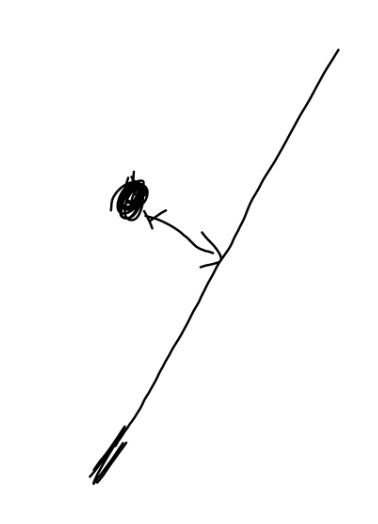

## PostgreSQL PostGIS 的5种空间距离排序(knn)算法  
                                                               
### 作者                                                               
digoal                                                               
                                                               
### 日期                                                               
2018-06-04                                                             
                                                               
### 标签                                                               
PostgreSQL , PostGIS , operator , ops , knn     
                                                               
----                                                               
                                                               
## 背景        
PostgreSQL GiST索引支持排序接口，可以支撑空间、标准、数组、文本向量、文本等类型的排序。  
  
分别表示：  
  
1、给定一空间位置，按空间距离排序输出  
  
2、给定一数组、全文检索值、字符串，按数组、全文检索、字符串相似度排序输出  
  
3、给定一标准类型的值，按标准类型的距离排序  
  
数据库目前支持哪些排序操作符，可以参考：[《PostgreSQL 如何确定某个opclass支持哪些操作符(支持索引)，JOIN方法，排序》](../201805/20180530_02.md)     
  
  
```  
postgres=# select oprleft::regtype,oprright::regtype,oprresult::regtype,oprname,oprkind,oprcode from pg_operator where oid in (select amopopr  from pg_amop where amopsortfamily<>0);    
           oprleft           |          oprright           |    oprresult     | oprname | oprkind |              oprcode                 
-----------------------------+-----------------------------+------------------+---------+---------+------------------------------------  
 point                       | point                       | double precision | <->     | b       | point_distance  
 circle                      | point                       | double precision | <->     | b       | dist_cpoint  
 polygon                     | point                       | double precision | <->     | b       | dist_polyp  
 geometry                    | geometry                    | double precision | <->     | b       | geometry_distance_centroid  
 geometry                    | geometry                    | double precision | <#>     | b       | geometry_distance_box  
 geometry                    | geometry                    | double precision | <<->>   | b       | geometry_distance_centroid_nd  
 geometry                    | geometry                    | double precision | |=|     | b       | geometry_distance_cpa  
 geography                   | geography                   | double precision | <->     | b       | geography_distance_knn  
  
oprcode是这个操作符对应的函数，要知道操作符的算法，可以下载postgis源码根据函数找到其C代码。
```  
  
安装了PostGIS后，对于空间排序，目前支持5种算法  
  
## PostGIS 空间排序算法  
  
1、2D平面，两个对象实际距离    
  
```
<-> — Returns the 2D distance between A and B.    
```
  
  
  
  
  
2、计算两条有效轨迹类型的距离（如果两个轨迹没有交集, 返回空）  
  
```
|=| — Returns the distance between A and B trajectories at their closest point of approach.  
```
  
  
  
  
  
3、2D平面，两个对象bound box实面的距离(所以如果BOUND BOX与另一对象 相交，包含，说明距离为0)  
  
```
<#> — Returns the 2D distance between A and B bounding boxes.    
```
  
  
  
  
  
4、与1类似，多维对象，返回两个bound box 中心点的距离  
  
```
<<->> — Returns the n-D distance between the centroids of A and B bounding boxes.  
```
  
5、与3类似，多维对象，返回两个bound box 实体的距离  
  
```
<<#>> — Returns the n-D distance between A and B bounding boxes.  
```  
  
### 例子  
  
1、点和线段的实际距离  
  
```  
postgres=# select st_setsrid(st_makepoint(1,2),4326) <-> st_setsrid(ST_MakeLine(ST_MakePoint(0,0.9), ST_MakePoint(3,4)),4326);  
      ?column?        
--------------------  
 0.0463614285010702  
(1 row)  
```  
  
2、点和线段（BOUND BOX实体）的距离  
  
```  
postgres=# select st_setsrid(st_makepoint(1,2),4326) <#> st_setsrid(ST_MakeLine(ST_MakePoint(0,0.9), ST_MakePoint(3,4)),4326);  
 ?column?   
----------  
        0  
(1 row)  
```  
  
3、两个不相交轨迹（范围没有相交）的距离  
  
```  
postgres=# WITH inp AS ( SELECT  
  ST_AddMeasure('LINESTRING Z (0 0 0, 10 0 5)'::geometry,  
    extract(epoch from '2015-05-26 10:01'::timestamptz),  
    extract(epoch from '2015-05-26 11:01'::timestamptz)  
  ) a,  
  ST_AddMeasure('LINESTRING Z (0 2 10, 12 1 2)'::geometry,  
    extract(epoch from '2015-05-25 01:00'::timestamptz),  
    extract(epoch from '2015-05-25 13:00'::timestamptz)  
  ) b  
)  
SELECT ST_DistanceCPA(a,b) distance FROM inp;  
 distance   
----------  
           
(1 row)  
```  
  
4、两个有相交（范围有交集）的距离  (lower1~upper1 与 lower2~upper2 有相交)  
  
```  
postgres=# WITH inp AS ( SELECT  
  ST_AddMeasure('LINESTRING Z (0 0 0, 10 0 5)'::geometry,  
    extract(epoch from '2015-05-26 10:01'::timestamptz),   -- lower  
    extract(epoch from '2015-05-26 11:01'::timestamptz)    -- upper  
  ) a,  
  ST_AddMeasure('LINESTRING Z (0 2 10, 12 1 2)'::geometry,  
    extract(epoch from '2015-05-25 01:00'::timestamptz),   -- lower  
    extract(epoch from '2015-05-26 13:00'::timestamptz)    -- upper  
  ) b  
)  
SELECT ST_DistanceCPA(a,b) distance FROM inp;  
     distance       
------------------  
 3.07479618495659  
(1 row)  
```  
  
5、两个有相交（范围有交集）的距离  
  
```  
postgres=# WITH inp AS ( SELECT  
  ST_AddMeasure('LINESTRING Z (0 0 0, 10 0 5)'::geometry,  
    extract(epoch from '2015-05-26 10:01'::timestamptz),  
    extract(epoch from '2015-05-26 11:01'::timestamptz)  
  ) a,  
  ST_AddMeasure('LINESTRING Z (0 2 10, 12 1 2)'::geometry,  
    extract(epoch from '2015-05-25 01:00'::timestamptz),  
    extract(epoch from '2015-05-26 10:10'::timestamptz)  
  ) b  
)  
SELECT ST_DistanceCPA(a,b) distance FROM inp;  
    distance       
-----------------  
 10.621322893124  
(1 row)  
```  
  
## 排序用法
  
```
select * from tbl order by geom <-> 某个空间对象常量; 
```
  
## 参考  
http://workshops.boundlessgeo.com/postgis-intro/knn.html  
  
http://postgis.net/docs/manual-2.4/reference.html#Operators  
  
http://postgis.net/docs/manual-2.4/geometry_distance_cpa.html  
  
http://postgis.net/docs/manual-2.4/ST_DistanceCPA.html  
  
[《PostgreSQL 如何确定某个opclass支持哪些操作符(支持索引)，JOIN方法，排序》](../201805/20180530_02.md)      
  
  
  
  
  
  
  
  
  
  
  
  
  
  
  
  
  
  
  
  
  
  
  
  
  
  
  
  
  
  
  
  
  
  
  
  
  
  
  
  
  
  
  
  
  
  
  
  
  
  
  
  
  
  
  
  
  
  
  
  
  
  
  
  
  
  
  
  
  
  
  
  
  
  
#### [PostgreSQL 许愿链接](https://github.com/digoal/blog/issues/76 "269ac3d1c492e938c0191101c7238216")
您的愿望将传达给PG kernel hacker、数据库厂商等, 帮助提高数据库产品质量和功能, 说不定下一个PG版本就有您提出的功能点. 针对非常好的提议，奖励限量版PG文化衫、纪念品、贴纸、PG热门书籍等，奖品丰富，快来许愿。[开不开森](https://github.com/digoal/blog/issues/76 "269ac3d1c492e938c0191101c7238216").  
  
  
#### [9.9元购买3个月阿里云RDS PostgreSQL实例](https://www.aliyun.com/database/postgresqlactivity "57258f76c37864c6e6d23383d05714ea")
  
  
#### [PostgreSQL 解决方案集合](https://yq.aliyun.com/topic/118 "40cff096e9ed7122c512b35d8561d9c8")
  
  
#### [德哥 / digoal's github - 公益是一辈子的事.](https://github.com/digoal/blog/blob/master/README.md "22709685feb7cab07d30f30387f0a9ae")
  
  

  
  
#### [PolarDB 学习图谱: 训练营、培训认证、在线互动实验、解决方案、生态合作、写心得拿奖品](https://www.aliyun.com/database/openpolardb/activity "8642f60e04ed0c814bf9cb9677976bd4")
  
  
#### [购买PolarDB云服务折扣活动进行中, 55元起](https://www.aliyun.com/activity/new/polardb-yunparter?userCode=bsb3t4al "e0495c413bedacabb75ff1e880be465a")
  
  
#### [About 德哥](https://github.com/digoal/blog/blob/master/me/readme.md "a37735981e7704886ffd590565582dd0")
  
