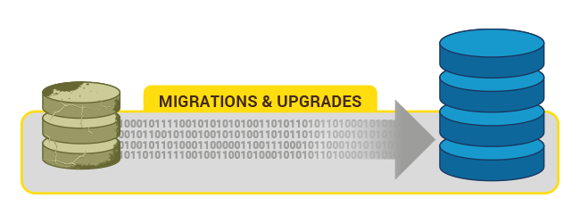
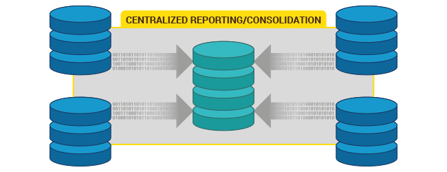
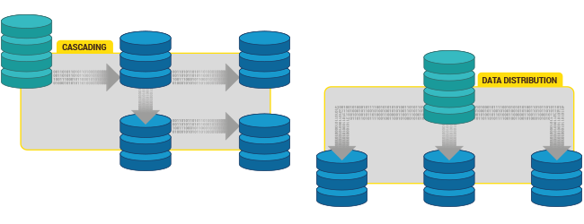
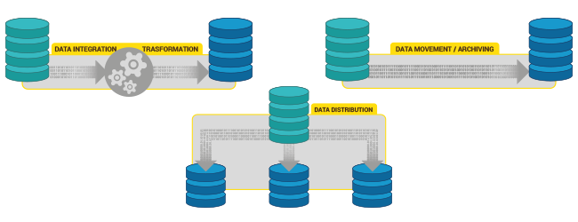

## [未完待续] PostgreSQL pglogical 逻辑复制实现跨版本升级 
                                                         
### 作者                                                         
digoal                                                         
                                                         
### 日期                                                         
2018-06-19                                                      
                                                         
### 标签                                                         
PostgreSQL , 跨版本升级 , pg_upgrade , pglogical
                                                         
----                                                         
                                                         
## 背景  

## 升级步骤
兼容性评估（业务DDL，SQL，类型，插件）

1、列出9.4 已安装插件

2、评估存储空间、表空间

3、安装PG 10

4、安装插件

5、初始化实例

6、初始化表空间

7、迁移DDL

8、配置9.4 逻辑复制

9、9.4,10 安装pglogical 

10、配置pglogical

11、全量复制

12、增量复制

13、中断业务

14、比对数据一致性

15、切换业务

## 小结

逻辑复制

pg_upgrade

pglogical 除了可以用来实现跨版本升级，还能用来做多实例数据汇聚，数据分散，单元化等。

## 参考
https://www.2ndquadrant.com/en/resources/pglogical/

[《PostgreSQL 快速大版本升级多种方案 - 含重点介绍fast & safe upgrade to PostgreSQL 9.4 use pg_upgrade & zfs》](../201412/20141219_01.md)  

[《PostgreSQL pg_upgrade 9.3 improve and example》](../201305/20130520_01.md)  
  
  
  
  
  
  
  
  
## [digoal's 大量PostgreSQL文章入口](https://github.com/digoal/blog/blob/master/README.md "22709685feb7cab07d30f30387f0a9ae")
  
