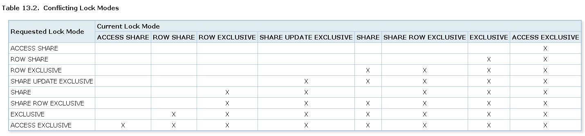

## PostgreSQL 锁等待排查实践 - 珍藏级 - process xxx1 acquired RowExclusiveLock on relation xxx2 of database xxx3 after xxx4 ms at xxx  
                                                           
### 作者                                                           
digoal                                                           
                                                           
### 日期                                                           
2018-06-22                                                         
                                                           
### 标签                                                           
PostgreSQL , 锁等待 , ddl , 大锁 , 雪崩 , lock_timeout , deadlock_timeout , AB表切换 , 分区表    
                                                           
----                                                           
                                                           
## 背景        
当SQL请求锁等待超过deadlock_timeout指定的时间时，报类似如下日志：  
  
```  
LOG: process xxx1 acquired RowExclusiveLock on relation xxx2 of database xxx3 after xxx4 ms at xxx  
STATEMENT: INSERT ...........  
```  
  
解释：  
  
xxx1进程请求位于数据库xxx3中的xxx2对象的RowExclusiveLock锁，已等待xxx4秒。  
  
同学们可能会纳闷，怎么insert也会等待？  
  
其实不管什么操作，都有可能出现等待，只要请求的锁与已有或已经在队列中的LOCK级别有冲突就会出现等待。  
  
  
  
https://www.postgresql.org/docs/10/static/explicit-locking.html  
  
src/include/storage/lockdefs.h  
  
```  
/* NoLock is not a lock mode, but a flag value meaning "don't get a lock" */  
#define NoLock                                  0  
  
#define AccessShareLock                 1       /* SELECT */  
#define RowShareLock                    2       /* SELECT FOR UPDATE/FOR SHARE */  
#define RowExclusiveLock                3       /* INSERT, UPDATE, DELETE */  
#define ShareUpdateExclusiveLock 4      /* VACUUM (non-FULL),ANALYZE, CREATE INDEX  
                                                                         * CONCURRENTLY */  
#define ShareLock                               5       /* CREATE INDEX (WITHOUT CONCURRENTLY) */  
#define ShareRowExclusiveLock   6       /* like EXCLUSIVE MODE, but allows ROW  
                                                                         * SHARE */  
#define ExclusiveLock                   7       /* blocks ROW SHARE/SELECT...FOR UPDATE */  
#define AccessExclusiveLock             8       /* ALTER TABLE, DROP TABLE, VACUUM FULL,  
                                                                         * and unqualified LOCK TABLE */  
```  
  
## 如何分析? - 实例讲解  
请参考万能文章：  
  
[《PostgreSQL 锁等待监控 珍藏级SQL - 谁堵塞了谁》](../201705/20170521_01.md)    
  
1、开启审计日志  
  
```  
log_destination = 'csvlog'  
logging_collector = on  
log_truncate_on_rotation = on  
log_statement = 'all'  
```  
  
2、psql 挂一个打印锁等待的窗口  
  
```  
psql  
  
with      
t_wait as      
(      
  select a.mode,a.locktype,a.database,a.relation,a.page,a.tuple,a.classid,a.granted,     
  a.objid,a.objsubid,a.pid,a.virtualtransaction,a.virtualxid,a.transactionid,a.fastpath,      
  b.state,b.query,b.xact_start,b.query_start,b.usename,b.datname,b.client_addr,b.client_port,b.application_name     
    from pg_locks a,pg_stat_activity b where a.pid=b.pid and not a.granted     
),     
t_run as     
(     
  select a.mode,a.locktype,a.database,a.relation,a.page,a.tuple,a.classid,a.granted,     
  a.objid,a.objsubid,a.pid,a.virtualtransaction,a.virtualxid,a.transactionid,a.fastpath,     
  b.state,b.query,b.xact_start,b.query_start,b.usename,b.datname,b.client_addr,b.client_port,b.application_name     
    from pg_locks a,pg_stat_activity b where a.pid=b.pid and a.granted     
),     
t_overlap as     
(     
  select r.* from t_wait w join t_run r on     
  (     
    r.locktype is not distinct from w.locktype and     
    r.database is not distinct from w.database and     
    r.relation is not distinct from w.relation and     
    r.page is not distinct from w.page and     
    r.tuple is not distinct from w.tuple and     
    r.virtualxid is not distinct from w.virtualxid and     
    r.transactionid is not distinct from w.transactionid and     
    r.classid is not distinct from w.classid and     
    r.objid is not distinct from w.objid and     
    r.objsubid is not distinct from w.objsubid and     
    r.pid <> w.pid     
  )      
),      
t_unionall as      
(      
  select r.* from t_overlap r      
  union all      
  select w.* from t_wait w      
)      
select locktype,datname,relation::regclass,page,tuple,virtualxid,transactionid::text,classid::regclass,objid,objsubid,     
string_agg(     
'Pid: '||case when pid is null then 'NULL' else pid::text end||chr(10)||     
'Lock_Granted: '||case when granted is null then 'NULL' else granted::text end||' , Mode: '||case when mode is null then 'NULL' else mode::text end||' , FastPath: '||case when fastpath is null then 'NULL' else fastpath::text end||' , VirtualTransaction: '||case when virtualtransaction is null then 'NULL' else virtualtransaction::text end||' , Session_State: '||case when state is null then 'NULL' else state::text end||chr(10)||     
'Username: '||case when usename is null then 'NULL' else usename::text end||' , Database: '||case when datname is null then 'NULL' else datname::text end||' , Client_Addr: '||case when client_addr is null then 'NULL' else client_addr::text end||' , Client_Port: '||case when client_port is null then 'NULL' else client_port::text end||' , Application_Name: '||case when application_name is null then 'NULL' else application_name::text end||chr(10)||      
'Xact_Start: '||case when xact_start is null then 'NULL' else xact_start::text end||' , Query_Start: '||case when query_start is null then 'NULL' else query_start::text end||' , Xact_Elapse: '||case when (now()-xact_start) is null then 'NULL' else (now()-xact_start)::text end||' , Query_Elapse: '||case when (now()-query_start) is null then 'NULL' else (now()-query_start)::text end||chr(10)||      
'SQL (Current SQL in Transaction): '||chr(10)||    
case when query is null then 'NULL' else query::text end,      
chr(10)||'--------'||chr(10)      
order by      
  (  case mode      
    when 'INVALID' then 0     
    when 'AccessShareLock' then 1     
    when 'RowShareLock' then 2     
    when 'RowExclusiveLock' then 3     
    when 'ShareUpdateExclusiveLock' then 4     
    when 'ShareLock' then 5     
    when 'ShareRowExclusiveLock' then 6     
    when 'ExclusiveLock' then 7     
    when 'AccessExclusiveLock' then 8     
    else 0     
  end  ) desc,     
  (case when granted then 0 else 1 end)    
) as lock_conflict    
from t_unionall     
group by     
locktype,datname,relation,page,tuple,virtualxid,transactionid::text,classid,objid,objsubid ;    
  
\watch 0.2  
```  
  
3、tail 挂一个日志观测窗口  
  
```  
for ((i=1;i>0;i=1)); do grep RowExclusiveLock *.csv ; sleep 0.2; done  
  
或  
  
for ((i=1;i>0;i=1)); do grep acquired *.csv ; sleep 0.2; done  
```  
  
4、发现问题  
  
在业务运行过程中，如果问题复现，一定能观测到日志。  
  
通过锁等待的窗口，观测到其中一个会话对表xxx持有了```accessExclusiveLock```，也就是排他锁。通过前面的锁冲突表，你会发现这个锁和所有锁都冲突（实际上```DDL，VACUUM FULL```等操作都会持有排它锁，或者人为的发出```lock table xxx in access exclusive mode;```）  
  
所以，当然会堵塞其他对该表的INSERT操作了。  
  
4\.1、根据锁等待的窗口拿到持有锁的PID，到审计日志里面查看这个PID在当前事务中，前面都发起了什么SQL。  
  
4\.2、找到问题根源，原来这个事务发起了```ALTER TABLE XXX RENAME TO XXXXX;```的动作。  
  
**这个事件也引起了INSERT变慢（实际上是锁等待，实践都花在了等待上面）的问题。**  
  
很显然，业务上应该经常会有一些触发改表名的动作，比如为了防止一个表太大，经常做AB表切换的动作。  
  
虽然切换表名只是修改元数据，但是这个瞬间的锁，在高并发的业务场景中，也会带来堵塞危害。  
  
建议用户采用分区表，而不要在高并发业务中频繁使用DDL这样的大锁高危操作。  
  
## 小结  
本文讲解了锁等待问题的排查方法。原因实际上是用户在业务中使用了AB表切换，虽然切换表名只是修改元数据，但是这个瞬间的锁，在高并发的业务场景中，也会带来堵塞危害。  
  
建议用户采用分区表，而不要在高并发业务中频繁使用DDL这样的大锁高危操作。  
  
[《PostgreSQL 9.x, 10, 11 hash分区表 用法举例》](../201805/20180524_05.md)    
  
[《PostgreSQL 11 preview - 分区表 增强 汇总》](../201805/20180519_01.md)    
  
[《PostgreSQL 查询涉及分区表过多导致的性能问题 - 性能诊断与优化(大量BIND, spin lock, SLEEP进程)》](../201801/20180124_01.md)    
  
[《PostgreSQL 商用版本EPAS(阿里云ppas(Oracle 兼容版)) - 分区表性能优化 (堪比pg_pathman)》](../201801/20180122_03.md)    
  
[《PostgreSQL 传统 hash 分区方法和性能》](../201711/20171122_02.md)    
  
[《PostgreSQL 10 内置分区 vs pg_pathman perf profiling》](../201710/20171015_01.md)    
  
[《PostgreSQL 10.0 preview 功能增强 - 内置分区表》](../201612/20161215_01.md)    
  
[《PostgreSQL 9.5+ 高效分区表实现 - pg_pathman》](../201610/20161024_01.md)    
  
另外。大锁操作，一定要注意防止雪崩。  
  
最后，遇到问题要冷静思考，不要轻易认为数据库有问题。  
  
  
## 参考  
[《PostgreSQL 锁等待监控 珍藏级SQL - 谁堵塞了谁》](../201705/20170521_01.md)    
  
[《PostgreSQL 设置单条SQL的执行超时 - 防雪崩》](201712/20171211_02.md)    
  
[《如何防止数据库雪崩(泛洪 flood)》](201609/20160909_01.md)    
  
  
  
<a rel="nofollow" href="http://info.flagcounter.com/h9V1"  ></a>  
  
  
  
  
  
  
## [digoal's 大量PostgreSQL文章入口](https://github.com/digoal/blog/blob/master/README.md "22709685feb7cab07d30f30387f0a9ae")
  
