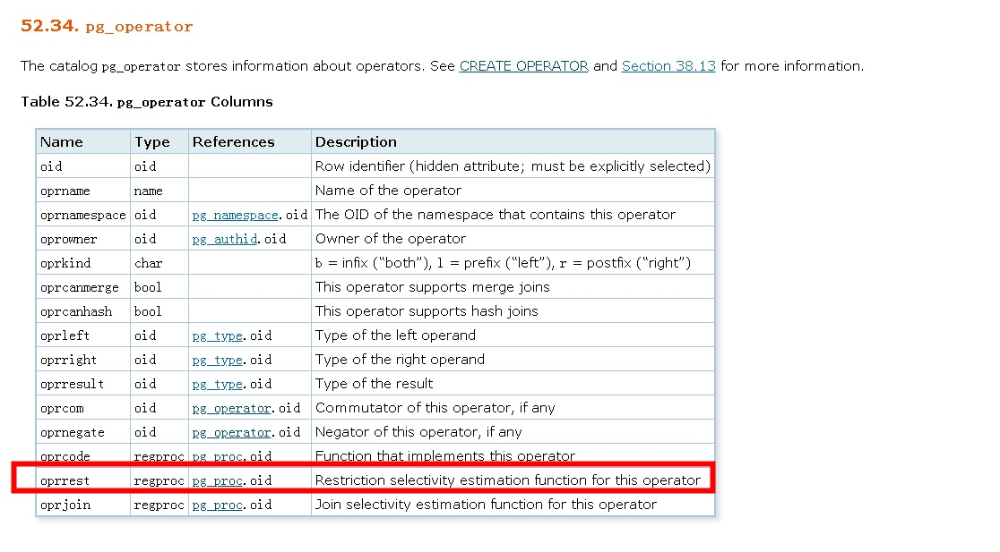

## PostgreSQL 自定义函数表达式选择性评估算法 - Statistics, Cardinality, Selectivity, Estimate  
                                                           
### 作者                                                           
digoal                                                           
                                                           
### 日期                                                           
2018-06-25                                                         
                                                           
### 标签                                                           
PostgreSQL , 表达式 , 自定义函数 , 选择性 , Statistics , Cardinality , Selectivity , Estimate  
                                                           
----                                                           
                                                           
## 背景      
在数据库中，统计信息是估算成本（选择性）的重要基础，目前在PG中统计信息的内容要么是单列，要么是自定义的多列统计信息，要么是表达式索引的统计信息( [《PostgreSQL 11 preview - 表达式索引柱状图buckets\STATISTICS\default_statistics_target可设置》](../201805/20180519_07.md)  )。   
  
并不会针对没有创建索引的表达式构建统计信息。  
  
那么当输入条件的一端是表达式（并且没有索引）时，如何评估表达式与操作符发生计算时的选择性呢？  
  
## 选择性计算的代码  
https://www.postgresql.org/docs/devel/static/row-estimation-examples.html  
  
For those interested in further details, estimation of the size of a table (before any WHERE clauses) is done in src/backend/optimizer/util/plancat.c. The generic logic for clause selectivities is in src/backend/optimizer/path/clausesel.c. The operator-specific selectivity functions are mostly found in src/backend/utils/adt/selfuncs.c.  
  
### 打开debug效果  
  
src/backend/optimizer/path/clausesel.c  
  
```  
Selectivity  
clause_selectivity(PlannerInfo *root,  
                                   Node *clause,  
                                   int varRelid,  
                                   JoinType jointype,  
                                   SpecialJoinInfo *sjinfo)  
{  
  
  
......  
  
  
// 注释一下，方便输出选择性的值  
  
  
//#ifdef SELECTIVITY_DEBUG  
        elog(DEBUG4, "clause_selectivity: s1 %f", s1);  
//#endif   
```  
  
```  
make  
make install  
  
  
重启  
```  
  
### 测试  
  
```  
create table a (id int);  
insert into a select generate_series(1,10000000);  
vacuum analyze a;  
```  
  
创建自定义函数  
  
```  
CREATE OR REPLACE FUNCTION public.f1(integer)  
 RETURNS integer  
 LANGUAGE sql  
 STRICT  
AS $function$  
  select case when $1<1000 then 100000 else 200000 end ;  
$function$;  
```  
  
### 打开DEBUG，测试选择性  
1、普通字段的选择性，算法对应=操作符pg_operator.oprrest字段对应的代码。  
  
普通字段，选择性评估精准  
  
```  
postgres=# set client_min_messages ='debug5';  
  
postgres=# explain select * from a where id=1;  
DEBUG:  StartTransaction(1) name: unnamed; blockState: DEFAULT; state: INPROGRESS, xid/subid/cid: 0/1/0  
DEBUG:  clause_selectivity: s1 0.000000  
DEBUG:  CommitTransaction(1) name: unnamed; blockState: STARTED; state: INPROGRESS, xid/subid/cid: 0/1/0  
                             QUERY PLAN                               
--------------------------------------------------------------------  
 Gather  (cost=1000.00..76498.03 rows=1 width=4)   -- rows=1很准确  
   Workers Planned: 4  
   ->  Parallel Seq Scan on a  (cost=0.00..75497.93 rows=1 width=4)  
         Filter: (id = 1)  
(4 rows)  
```  
  
  
2、改成自定义函数表达式如下，自定义表达式由于没有统计信息，所以表达式的估值行数很不准确。  
  
```  
postgres=# explain select * from a where f1(id)=1;  
DEBUG:  StartTransaction(1) name: unnamed; blockState: DEFAULT; state: INPROGRESS, xid/subid/cid: 0/1/0  
DEBUG:  clause_selectivity: s1 0.005000    // 注意  
DEBUG:  CommitTransaction(1) name: unnamed; blockState: STARTED; state: INPROGRESS, xid/subid/cid: 0/1/0  
                        QUERY PLAN                           
-----------------------------------------------------------  
 Seq Scan on a  (cost=0.00..2669241.96 rows=50000 width=4)   -- rows=50000一点不准确  
   Filter: (f1(id) = 1)  
 JIT:  
   Functions: 2  
   Inlining: true  
   Optimization: true  
(6 rows)  
```  
  
## gdb找到估值计算用到的sel函数  
  
```  
digoal@iZbp13nu0s9j3x3op4zpd4Z-> psql  
psql (11beta1)  
Type "help" for help.  
  
postgres=# select pg_backend_pid();  
 pg_backend_pid   
----------------  
          53160  
(1 row)  
```  
  
```  
gdb -p 53160  
  
b restriction_selectivity  
```  
  
对应代码  
  
```  
src/backend/optimizer/path/clausesel.c  
  
  
Selectivity  
clause_selectivity(PlannerInfo *root,  
                                   Node *clause,  
                                   int varRelid,  
                                   JoinType jointype,  
                                   SpecialJoinInfo *sjinfo)  
{  
  
...........  
        else if (is_opclause(clause) || IsA(clause, DistinctExpr))  
        {  
                OpExpr     *opclause = (OpExpr *) clause;  
                Oid                     opno = opclause->opno;  
  
                if (treat_as_join_clause(clause, rinfo, varRelid, sjinfo))  
                {  
                        /* Estimate selectivity for a join clause. */  
                        s1 = join_selectivity(root, opno,  
                                                                  opclause->args,  
                                                                  opclause->inputcollid,  
                                                                  jointype,  
                                                                  sjinfo);  
                }  
                else  
                {  
                        /* Estimate selectivity for a restriction clause. */ -- 评估算法如下  
                        s1 = restriction_selectivity(root, opno,  
                                                                                 opclause->args,  
                                                                                 opclause->inputcollid,  
                                                                                 varRelid);  
                }  
  
                /*  
                 * DistinctExpr has the same representation as OpExpr, but the  
                 * contained operator is "=" not "<>", so we must negate the result.  
                 * This estimation method doesn't give the right behavior for nulls,  
                 * but it's better than doing nothing.  
                 */  
                if (IsA(clause, DistinctExpr))  
                        s1 = 1.0 - s1;  
        }  
```  
  
restriction_selectivity对应代码如下，我们为了查看选择性，同样这里也加一个ELOG输出。  
  
src/backend/optimizer/util/plancat.c  
  
```  
/*  
 * restriction_selectivity  
 *  
 * Returns the selectivity of a specified restriction operator clause.  
 * This code executes registered procedures stored in the  
 * operator relation, by calling the function manager.  
 *  
 * See clause_selectivity() for the meaning of the additional parameters.  
 */  
Selectivity  
restriction_selectivity(PlannerInfo *root,  
                                                Oid operatorid,  
                                                List *args,  
                                                Oid inputcollid,  
                                                int varRelid)  
{  
        RegProcedure oprrest = get_oprrest(operatorid);  
        float8          result;  
  
        /*  
         * if the oprrest procedure is missing for whatever reason, use a  
         * selectivity of 0.5  
         */  
        if (!oprrest)  
                return (Selectivity) 0.5;  
  
        result = DatumGetFloat8(OidFunctionCall4Coll(oprrest,  
                                                                                                 inputcollid,  
                                                                                                 PointerGetDatum(root),  
                                                                                                 ObjectIdGetDatum(operatorid),  
                                                                                                 PointerGetDatum(args),  
                                                                                                 Int32GetDatum(varRelid)));  
// 加入如下代码，打印restriction_selectivity函数计算得到的选择性  
//#ifdef SELECTIVITY_DEBUG  
        elog(DEBUG4, "restriction_selectivity: result %f", result);  
//#endif   
  
        if (result < 0.0 || result > 1.0)  
                elog(ERROR, "invalid restriction selectivity: %f", result);  
  
        return (Selectivity) result;  
}  
```  
  
  
```  
make  
make install  
  
  
重启  
```  
  
  
  
  
https://www.postgresql.org/docs/devel/static/catalog-pg-operator.html  
  
  
explain时输出DEBUG信息如下，可以看到自定义函数的选择性为0.005，自定义函数值没有统计信息柱状图，是不准确的根源。  
  
```  
postgres=# set client_min_messages ='debug5';  
DEBUG:  CommitTransaction(1) name: unnamed; blockState: STARTED; state: INPROGRESS, xid/subid/cid: 0/1/0  
SET  
postgres=# explain select * from a where f1(id)=1;  
DEBUG:  StartTransaction(1) name: unnamed; blockState: DEFAULT; state: INPROGRESS, xid/subid/cid: 0/1/0  
DEBUG:  restriction_selectivity: result 0.005000  
DEBUG:  clause_selectivity: s1 0.005000  
DEBUG:  CommitTransaction(1) name: unnamed; blockState: STARTED; state: INPROGRESS, xid/subid/cid: 0/1/0  
                        QUERY PLAN                          
----------------------------------------------------------  
 Seq Scan on a  (cost=0.00..219247.60 rows=50000 width=4)  
   Filter: (f1(id) = 1)  
 JIT:  
   Functions: 2  
   Inlining: false  
   Optimization: false  
(6 rows)  
  
postgres=# explain select * from a where id=1;  
DEBUG:  StartTransaction(1) name: unnamed; blockState: DEFAULT; state: INPROGRESS, xid/subid/cid: 0/1/0  
DEBUG:  restriction_selectivity: result 0.000000  
DEBUG:  clause_selectivity: s1 0.000000  
DEBUG:  CommitTransaction(1) name: unnamed; blockState: STARTED; state: INPROGRESS, xid/subid/cid: 0/1/0  
                             QUERY PLAN                               
--------------------------------------------------------------------  
 Gather  (cost=1000.00..76498.03 rows=1 width=4)  
   Workers Planned: 4  
   ->  Parallel Seq Scan on a  (cost=0.00..75497.93 rows=1 width=4)  
         Filter: (id = 1)  
(4 rows)  
```  
  
## 自定义函数（表达式）柱状图统计信息收集  
  
前面的例子，自定义函数值没有统计信息柱状图，是不准确的根源。  
  
那么自定义表达式如何收集统计信息呢？  
  
实际上PG支持表达式索引，索引中包含了表达式的值，以及对应的HEAP TABLE 行号，有了表达式的值，实际上就可以作为统计信息收集的要素。  
  
如下：  
  
1、创建表达式索引   
  
```  
postgres=# create index idx_a_1 on a(f1(id));  
```  
  
2、收集统计信息  
  
```  
postgres=# vacuum analyze a;  
```  
  
3、通过索引名称定位，查看pg_stats内部是否有表达式的统计信息了，没错，以及有了。  
  
```  
postgres=# select attname from pg_stats where tablename='idx_a_1';  
  
 attname   
---------  
 f1  
(1 row)  
```  
  
完备的统计信息格式与内容请参考：   
  
[《PostgreSQL 统计信息pg_statistic格式及导入导出dump_stat - 兼容Oracle》](../201710/20171030_02.md)  
  
4、再次查看执行计划，选择性正确了。  
  
  
```  
postgres=# explain select * from a where f1(id)=1;  
                           QUERY PLAN                              
-----------------------------------------------------------------  
 Index Scan using idx_a_1 on a  (cost=0.43..2.65 rows=1 width=4)  
   Index Cond: (f1(id) = 1)  
(2 rows)  
  
postgres=# explain select * from a where id=1;  
                             QUERY PLAN                               
--------------------------------------------------------------------  
 Gather  (cost=1000.00..76498.03 rows=1 width=4)  
   Workers Planned: 4  
   ->  Parallel Seq Scan on a  (cost=0.00..75497.93 rows=1 width=4)  
         Filter: (id = 1)  
(4 rows)  
  
  
postgres=# explain (analyze,verbose,timing,costs,buffers) select * from a where f1(id)=1;  
                                                    QUERY PLAN                                                      
------------------------------------------------------------------------------------------------------------------  
 Index Scan using idx_a_1 on public.a  (cost=0.43..2.65 rows=1 width=4) (actual time=0.105..0.105 rows=0 loops=1)  
   Output: id  
   Index Cond: (f1(a.id) = 1)  
   Buffers: shared read=3  
 Planning Time: 0.112 ms  
 Execution Time: 0.128 ms  
(6 rows)  
```  
  
## 小结  
当WHERE 条件中的表达式并非普通列，而是表达式时，在表达式没有索引的情况下，表达式的选择性可能是非常不准确的。  
  
为了得到更好的统计信息，可以创建索引，因为索引内包含了这个表达式的结果值，索引创建完后，就可以收集这个表达式的统计信息了。有了统计信息，表达式的评估，选择性计算就会非常准确。  
  
[《PostgreSQL 11 preview - 表达式索引柱状图buckets\STATISTICS\default_statistics_target可设置》](../201805/20180519_07.md)    
    
不管是什么表达式，评估选择性都用到了restriction_selectivity，本文通过对PG的选择性代码添加elog，开启DEBUG可以打印输出当时的选择性。  
  
For those interested in further details, estimation of the size of a table (before any WHERE clauses) is done in src/backend/optimizer/util/plancat.c. The generic logic for clause selectivities is in src/backend/optimizer/path/clausesel.c. The operator-specific selectivity functions are mostly found in src/backend/utils/adt/selfuncs.c.  
  
## 参考  
https://www.postgresql.org/docs/devel/static/row-estimation-examples.html  
  
https://www.postgresql.org/docs/devel/static/catalog-pg-operator.html  
  
[《PostgreSQL 多值列的选择性 - Statistics, Cardinality, Selectivity, Estimate》](../201806/20180625_01.md)    
  
[《PostgreSQL 11 preview - 表达式索引柱状图buckets\STATISTICS\default_statistics_target可设置》](../201805/20180519_07.md)    
  
[《PostgreSQL 统计信息pg_statistic格式及导入导出dump_stat - 兼容Oracle》](../201710/20171030_02.md)  
  
  
<a rel="nofollow" href="http://info.flagcounter.com/h9V1"  ></a>  
  
  
  
  
  
  
## [digoal's 大量PostgreSQL文章入口](https://github.com/digoal/blog/blob/master/README.md "22709685feb7cab07d30f30387f0a9ae")
  
