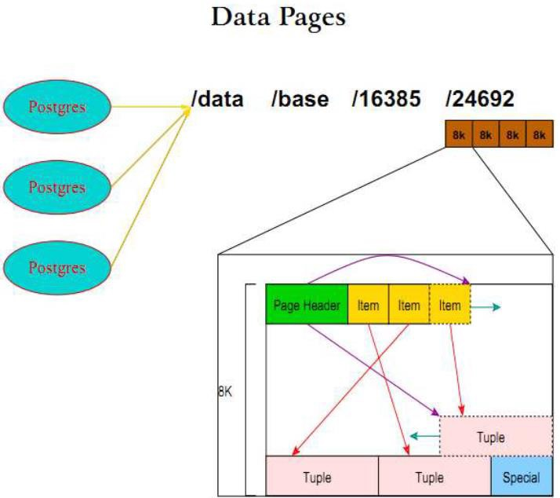
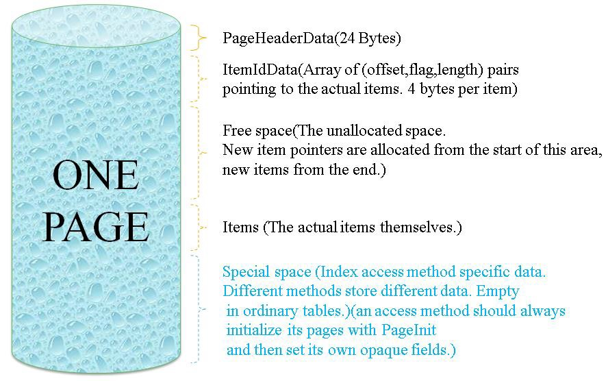
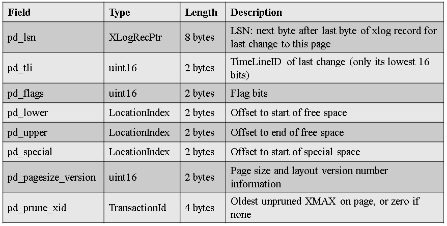
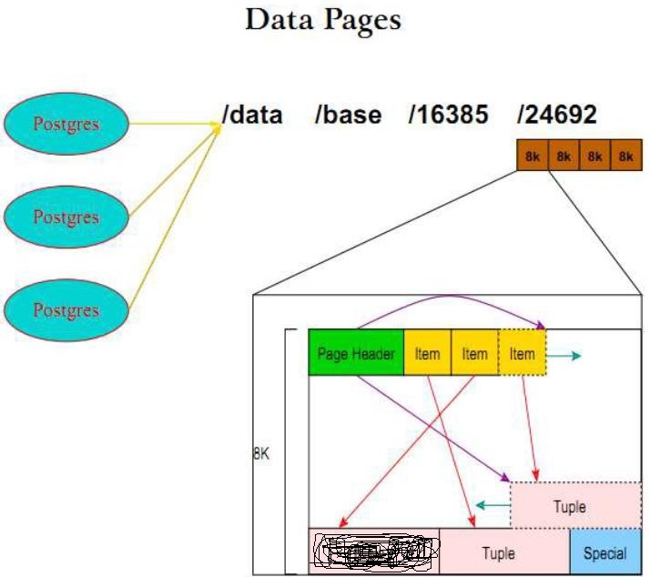

## PostgreSQL vacuum 的页内tuple move收缩空间    
                                                           
### 作者                                                           
digoal                                                           
                                                           
### 日期                                                           
2018-06-29                                                         
                                                           
### 标签                                                           
PostgreSQL , vacuum  , tuple move , 压缩空间 , 收缩空间 , 空洞     
                                                           
----                                                           
                                                           
## 背景     
当往数据库内插入记录时，PostgreSQL heap page内部的空间分配是这样的，lp内容为对应tuple在当前页的OFFSET，lp的位置固定长度固定（固定page head后面就是lp），lp固定方便tuple的搜索（例如ctid的第二个部分就是lp信息）。  
  
  
  
  
  
  
  
lp从page head开始分配，tuple从page tail开始分配，lp指向对应tuple的开始位置。  
  
当一个PAGE内部的tuple有部分被删除后，会不会出现PAGE内部空间的空洞呢？  如图：  
  
  
  
vacuum垃圾回收时，会不会对tuple做move处理，收缩空间呢？  
  
会。  
  
## 例子  
1、创建测试表  
  
```  
postgres=# create table c (id int, info text);  
CREATE TABLE  
```  
  
2、创建PAGE查看插件  
  
```  
postgres=# create extension pageinspect;  
CREATE TABLE  
```  
  
3、插入20条测试数据  
  
```  
postgres=# insert into c select id, repeat(md5(random()::text), 16) from generate_series(1,20) t(id);  
INSERT 0 20  
```  
  
4、每列变长字段大小516字节。  
  
```  
postgres=# select pg_column_size(repeat(md5(random()::text), 16));  
 pg_column_size   
----------------  
            516  
(1 row)  
```  
  
5、查看第一页（已用满）  
  
lp已分配到80字节处  
  
lp offset已分配到576字节处。  
  
剩余只有不到496字节的空间。  
  
```  
postgres=# SELECT * FROM page_header(get_raw_page('c', 0));  
     lsn     | checksum | flags | lower | upper | special | pagesize | version | prune_xid   
-------------+----------+-------+-------+-------+---------+----------+---------+-----------  
 3A/28D007F0 |        0 |     0 |    80 |   576 |    8192 |     8192 |       4 |         0  
(1 row)  
```  
  
6、查看每一条记录tuple在page内部的offset  
  
```  
postgres=# select lp,lp_off from heap_page_items(get_raw_page('c', 0));  
 lp | lp_off   
----+--------  
  1 |   7648  
  2 |   7104  
  3 |   6560  
  4 |   6016  
  5 |   5472  
  6 |   4928  
  7 |   4384  
  8 |   3840  
  9 |   3296  
 10 |   2752  
 11 |   2208  
 12 |   1664  
 13 |   1120  
 14 |    576  
(14 rows)  
```  
  
  
7、查看详细的page内的tuple信息  
  
```  
postgres=# select * from heap_page_items(get_raw_page('c', 0));  
 lp | lp_off | lp_flags | lp_len |  t_xmin   | t_xmax | t_field3 | t_ctid | t_infomask2 | t_infomask | t_hoff | t_bits | t_oid |                                                                                                               
                                                                                                                                                                                                                                               
                                                                                                                                                                             t_data                                                            
                                                                                                                                                                                                                                               
                                                                                                                                                                                                                                  
----+--------+----------+--------+-----------+--------+----------+--------+-------------+------------+--------+--------+-------+-------------------------------------------------------------------------------------------------------------  
---------------------------------------------------------------------------------------------------------------------------------------------------------------------------------------------------------------------------------------------  
---------------------------------------------------------------------------------------------------------------------------------------------------------------------------------------------------------------------------------------------  
---------------------------------------------------------------------------------------------------------------------------------------------------------------------------------------------------------------------------------------------  
--------------------------------------------------------------------------------------------------------------------------------------------------------------------------------------------------------------------------------  
  1 |   7648 |        1 |    544 | 210387734 |      0 |        0 | (0,1)  |           2 |       2306 |     24 |        |       | \x0100000010080000343065376462383965383461323564613363623466366133613739613739303334306537646238396538346132  
356461336362346636613361373961373930333430653764623839653834613235646133636234663661336137396137393033343065376462383965383461323564613363623466366133613739613739303334306537646238396538346132356461336362346636613361373961373930333430653  
764623839653834613235646133636234663661336137396137393033343065376462383965383461323564613363623466366133613739613739303334306537646238396538346132356461336362346636613361373961373930333430653764623839653834613235646133636234663661336137  
396137393033343065376462383965383461323564613363623466366133613739613739303334306537646238396538346132356461336362346636613361373961373930333430653764623839653834613235646133636234663661336137396137393033343065376462383965383461323564613  
3636234663661336137396137393033343065376462383965383461323564613363623466366133613739613739303334306537646238396538346132356461336362346636613361373961373930333430653764623839653834613235646133636234663661336137396137393033  
  2 |   7104 |        1 |    544 | 210387734 |      0 |        0 | (0,2)  |           2 |       2306 |     24 |        |       | \x0200000010080000316630613130346132663938623737623237383037646264343564363061303731663061313034613266393862  
373762323738303764626434356436306130373166306131303461326639386237376232373830376462643435643630613037316630613130346132663938623737623237383037646264343564363061303731663061313034613266393862373762323738303764626434356436306130373166306  
131303461326639386237376232373830376462643435643630613037316630613130346132663938623737623237383037646264343564363061303731663061313034613266393862373762323738303764626434356436306130373166306131303461326639386237376232373830376462643435  
643630613037316630613130346132663938623737623237383037646264343564363061303731663061313034613266393862373762323738303764626434356436306130373166306131303461326639386237376232373830376462643435643630613037316630613130346132663938623737623  
2373830376462643435643630613037316630613130346132663938623737623237383037646264343564363061303731663061313034613266393862373762323738303764626434356436306130373166306131303461326639386237376232373830376462643435643630613037  
  3 |   6560 |        1 |    544 | 210387734 |      0 |        0 | (0,3)  |           2 |       2306 |     24 |        |       | \x0300000010080000613361386662303965343066303763366562663839323234656564633666333761336138666230396534306630  
376336656266383932323465656463366633376133613866623039653430663037633665626638393232346565646336663337613361386662303965343066303763366562663839323234656564633666333761336138666230396534306630376336656266383932323465656463366633376133613  
866623039653430663037633665626638393232346565646336663337613361386662303965343066303763366562663839323234656564633666333761336138666230396534306630376336656266383932323465656463366633376133613866623039653430663037633665626638393232346565  
646336663337613361386662303965343066303763366562663839323234656564633666333761336138666230396534306630376336656266383932323465656463366633376133613866623039653430663037633665626638393232346565646336663337613361386662303965343066303763366  
5626638393232346565646336663337613361386662303965343066303763366562663839323234656564633666333761336138666230396534306630376336656266383932323465656463366633376133613866623039653430663037633665626638393232346565646336663337  
  4 |   6016 |        1 |    544 | 210387734 |      0 |        0 | (0,4)  |           2 |       2306 |     24 |        |       | \x0400000010080000313536333031663433393935336533343937313065616437326265633266336331353633303166343339393533  
653334393731306561643732626563326633633135363330316634333939353365333439373130656164373262656332663363313536333031663433393935336533343937313065616437326265633266336331353633303166343339393533653334393731306561643732626563326633633135363  
330316634333939353365333439373130656164373262656332663363313536333031663433393935336533343937313065616437326265633266336331353633303166343339393533653334393731306561643732626563326633633135363330316634333939353365333439373130656164373262  
656332663363313536333031663433393935336533343937313065616437326265633266336331353633303166343339393533653334393731306561643732626563326633633135363330316634333939353365333439373130656164373262656332663363313536333031663433393935336533343  
9373130656164373262656332663363313536333031663433393935336533343937313065616437326265633266336331353633303166343339393533653334393731306561643732626563326633633135363330316634333939353365333439373130656164373262656332663363  
  5 |   5472 |        1 |    544 | 210387734 |      0 |        0 | (0,5)  |           2 |       2306 |     24 |        |       | \x0500000010080000316338343165353030336530396232626661636330623766376662386334356331633834316535303033653039  
623262666163633062376637666238633435633163383431653530303365303962326266616363306237663766623863343563316338343165353030336530396232626661636330623766376662386334356331633834316535303033653039623262666163633062376637666238633435633163383  
431653530303365303962326266616363306237663766623863343563316338343165353030336530396232626661636330623766376662386334356331633834316535303033653039623262666163633062376637666238633435633163383431653530303365303962326266616363306237663766  
623863343563316338343165353030336530396232626661636330623766376662386334356331633834316535303033653039623262666163633062376637666238633435633163383431653530303365303962326266616363306237663766623863343563316338343165353030336530396232626  
6616363306237663766623863343563316338343165353030336530396232626661636330623766376662386334356331633834316535303033653039623262666163633062376637666238633435633163383431653530303365303962326266616363306237663766623863343563  
  6 |   4928 |        1 |    544 | 210387734 |      0 |        0 | (0,6)  |           2 |       2306 |     24 |        |       | \x0600000010080000316238636461623434303265636161373465613536336661656164383563366331623863646162343430326563  
616137346561353633666165616438356336633162386364616234343032656361613734656135363366616561643835633663316238636461623434303265636161373465613536336661656164383563366331623863646162343430326563616137346561353633666165616438356336633162386  
364616234343032656361613734656135363366616561643835633663316238636461623434303265636161373465613536336661656164383563366331623863646162343430326563616137346561353633666165616438356336633162386364616234343032656361613734656135363366616561  
643835633663316238636461623434303265636161373465613536336661656164383563366331623863646162343430326563616137346561353633666165616438356336633162386364616234343032656361613734656135363366616561643835633663316238636461623434303265636161373  
4656135363366616561643835633663316238636461623434303265636161373465613536336661656164383563366331623863646162343430326563616137346561353633666165616438356336633162386364616234343032656361613734656135363366616561643835633663  
  7 |   4384 |        1 |    544 | 210387734 |      0 |        0 | (0,7)  |           2 |       2306 |     24 |        |       | \x0700000010080000626263336163623666626237373361383930633939343533383833646234646162626333616362366662623737  
336138393063393934353338383364623464616262633361636236666262373733613839306339393435333838336462346461626263336163623666626237373361383930633939343533383833646234646162626333616362366662623737336138393063393934353338383364623464616262633  
361636236666262373733613839306339393435333838336462346461626263336163623666626237373361383930633939343533383833646234646162626333616362366662623737336138393063393934353338383364623464616262633361636236666262373733613839306339393435333838  
336462346461626263336163623666626237373361383930633939343533383833646234646162626333616362366662623737336138393063393934353338383364623464616262633361636236666262373733613839306339393435333838336462346461626263336163623666626237373361383  
9306339393435333838336462346461626263336163623666626237373361383930633939343533383833646234646162626333616362366662623737336138393063393934353338383364623464616262633361636236666262373733613839306339393435333838336462346461  
  8 |   3840 |        1 |    544 | 210387734 |      0 |        0 | (0,8)  |           2 |       2306 |     24 |        |       | \x0800000010080000303465326439363635383635343566336262313338363165656535616365643630346532643936363538363534  
356633626231333836316565653561636564363034653264393636353836353435663362623133383631656565356163656436303465326439363635383635343566336262313338363165656535616365643630346532643936363538363534356633626231333836316565653561636564363034653  
264393636353836353435663362623133383631656565356163656436303465326439363635383635343566336262313338363165656535616365643630346532643936363538363534356633626231333836316565653561636564363034653264393636353836353435663362623133383631656565  
356163656436303465326439363635383635343566336262313338363165656535616365643630346532643936363538363534356633626231333836316565653561636564363034653264393636353836353435663362623133383631656565356163656436303465326439363635383635343566336  
2623133383631656565356163656436303465326439363635383635343566336262313338363165656535616365643630346532643936363538363534356633626231333836316565653561636564363034653264393636353836353435663362623133383631656565356163656436  
  9 |   3296 |        1 |    544 | 210387734 |      0 |        0 | (0,9)  |           2 |       2306 |     24 |        |       | \x0900000010080000386639333738633365313135653934323538366666336138323133656664306138663933373863336531313565  
393432353836666633613832313365666430613866393337386333653131356539343235383666663361383231336566643061386639333738633365313135653934323538366666336138323133656664306138663933373863336531313565393432353836666633613832313365666430613866393  
337386333653131356539343235383666663361383231336566643061386639333738633365313135653934323538366666336138323133656664306138663933373863336531313565393432353836666633613832313365666430613866393337386333653131356539343235383666663361383231  
336566643061386639333738633365313135653934323538366666336138323133656664306138663933373863336531313565393432353836666633613832313365666430613866393337386333653131356539343235383666663361383231336566643061386639333738633365313135653934323  
5383666663361383231336566643061386639333738633365313135653934323538366666336138323133656664306138663933373863336531313565393432353836666633613832313365666430613866393337386333653131356539343235383666663361383231336566643061  
 10 |   2752 |        1 |    544 | 210387734 |      0 |        0 | (0,10) |           2 |       2306 |     24 |        |       | \x0a00000010080000643962373365636264636538633333666634656638306362393966306138373264396237336563626463653863  
333366663465663830636239396630613837326439623733656362646365386333336666346566383063623939663061383732643962373365636264636538633333666634656638306362393966306138373264396237336563626463653863333366663465663830636239396630613837326439623  
733656362646365386333336666346566383063623939663061383732643962373365636264636538633333666634656638306362393966306138373264396237336563626463653863333366663465663830636239396630613837326439623733656362646365386333336666346566383063623939  
663061383732643962373365636264636538633333666634656638306362393966306138373264396237336563626463653863333366663465663830636239396630613837326439623733656362646365386333336666346566383063623939663061383732643962373365636264636538633333666  
6346566383063623939663061383732643962373365636264636538633333666634656638306362393966306138373264396237336563626463653863333366663465663830636239396630613837326439623733656362646365386333336666346566383063623939663061383732  
 11 |   2208 |        1 |    544 | 210387734 |      0 |        0 | (0,11) |           2 |       2306 |     24 |        |       | \x0b00000010080000633836333663333930336636613531383165356338303136316363376137633563383633366333393033663661  
353138316535633830313631636337613763356338363336633339303366366135313831653563383031363163633761376335633836333663333930336636613531383165356338303136316363376137633563383633366333393033663661353138316535633830313631636337613763356338363  
336633339303366366135313831653563383031363163633761376335633836333663333930336636613531383165356338303136316363376137633563383633366333393033663661353138316535633830313631636337613763356338363336633339303366366135313831653563383031363163  
633761376335633836333663333930336636613531383165356338303136316363376137633563383633366333393033663661353138316535633830313631636337613763356338363336633339303366366135313831653563383031363163633761376335633836333663333930336636613531383  
1653563383031363163633761376335633836333663333930336636613531383165356338303136316363376137633563383633366333393033663661353138316535633830313631636337613763356338363336633339303366366135313831653563383031363163633761376335  
 12 |   1664 |        1 |    544 | 210387734 |      0 |        0 | (0,12) |           2 |       2306 |     24 |        |       | \x0c00000010080000616665666266363465626661633431373230323364653736633335633033633761666566626636346562666163  
343137323032336465373663333563303363376166656662663634656266616334313732303233646537366333356330336337616665666266363465626661633431373230323364653736633335633033633761666566626636346562666163343137323032336465373663333563303363376166656  
662663634656266616334313732303233646537366333356330336337616665666266363465626661633431373230323364653736633335633033633761666566626636346562666163343137323032336465373663333563303363376166656662663634656266616334313732303233646537366333  
356330336337616665666266363465626661633431373230323364653736633335633033633761666566626636346562666163343137323032336465373663333563303363376166656662663634656266616334313732303233646537366333356330336337616665666266363465626661633431373  
2303233646537366333356330336337616665666266363465626661633431373230323364653736633335633033633761666566626636346562666163343137323032336465373663333563303363376166656662663634656266616334313732303233646537366333356330336337  
 13 |   1120 |        1 |    544 | 210387734 |      0 |        0 | (0,13) |           2 |       2306 |     24 |        |       | \x0d00000010080000323639636238656166623238383663666236623866326466616436643938656132363963623865616662323838  
366366623662386632646661643664393865613236396362386561666232383836636662366238663264666164366439386561323639636238656166623238383663666236623866326466616436643938656132363963623865616662323838366366623662386632646661643664393865613236396  
362386561666232383836636662366238663264666164366439386561323639636238656166623238383663666236623866326466616436643938656132363963623865616662323838366366623662386632646661643664393865613236396362386561666232383836636662366238663264666164  
366439386561323639636238656166623238383663666236623866326466616436643938656132363963623865616662323838366366623662386632646661643664393865613236396362386561666232383836636662366238663264666164366439386561323639636238656166623238383663666  
2366238663264666164366439386561323639636238656166623238383663666236623866326466616436643938656132363963623865616662323838366366623662386632646661643664393865613236396362386561666232383836636662366238663264666164366439386561  
 14 |    576 |        1 |    544 | 210387734 |      0 |        0 | (0,14) |           2 |       2306 |     24 |        |       | \x0e00000010080000313866653965363530616635383164623735326363306433303530633765363931386665396536353061663538  
316462373532636330643330353063376536393138666539653635306166353831646237353263633064333035306337653639313866653965363530616635383164623735326363306433303530633765363931386665396536353061663538316462373532636330643330353063376536393138666  
539653635306166353831646237353263633064333035306337653639313866653965363530616635383164623735326363306433303530633765363931386665396536353061663538316462373532636330643330353063376536393138666539653635306166353831646237353263633064333035  
306337653639313866653965363530616635383164623735326363306433303530633765363931386665396536353061663538316462373532636330643330353063376536393138666539653635306166353831646237353263633064333035306337653639313866653965363530616635383164623  
7353263633064333035306337653639313866653965363530616635383164623735326363306433303530633765363931386665396536353061663538316462373532636330643330353063376536393138666539653635306166353831646237353263633064333035306337653639  
(14 rows)  
```  
  
8、插队删除记录13条  
  
```  
postgres=# delete from c where ctid not in ('(0,1)','(0,3)','(0,5)','(0,7)','(0,9)','(0,11)','(0,13)');  
DELETE 13  
```  
  
9、查看删除后的page 内部记录信息，现在还没有垃圾回收，所以看到他们都还占用空间  
  
```  
postgres=# select * from heap_page_items(get_raw_page('c', 0));  
 lp | lp_off | lp_flags | lp_len |  t_xmin   |  t_xmax   | t_field3 | t_ctid | t_infomask2 | t_infomask | t_hoff | t_bits | t_oid |                                                                                                            
                                                                                                                                                                                                                                               
                                                                                                                                                                                t_data                                                         
                                                                                                                                                                                                                                               
                                                                                                                                                                                                                                     
----+--------+----------+--------+-----------+-----------+----------+--------+-------------+------------+--------+--------+-------+----------------------------------------------------------------------------------------------------------  
---------------------------------------------------------------------------------------------------------------------------------------------------------------------------------------------------------------------------------------------  
---------------------------------------------------------------------------------------------------------------------------------------------------------------------------------------------------------------------------------------------  
---------------------------------------------------------------------------------------------------------------------------------------------------------------------------------------------------------------------------------------------  
-----------------------------------------------------------------------------------------------------------------------------------------------------------------------------------------------------------------------------------  
  1 |   7648 |        1 |    544 | 210387734 |         0 |        0 | (0,1)  |           2 |       2306 |     24 |        |       | \x0100000010080000343065376462383965383461323564613363623466366133613739613739303334306537646238396538346  
132356461336362346636613361373961373930333430653764623839653834613235646133636234663661336137396137393033343065376462383965383461323564613363623466366133613739613739303334306537646238396538346132356461336362346636613361373961373930333430  
653764623839653834613235646133636234663661336137396137393033343065376462383965383461323564613363623466366133613739613739303334306537646238396538346132356461336362346636613361373961373930333430653764623839653834613235646133636234663661336  
137396137393033343065376462383965383461323564613363623466366133613739613739303334306537646238396538346132356461336362346636613361373961373930333430653764623839653834613235646133636234663661336137396137393033343065376462383965383461323564  
6133636234663661336137396137393033343065376462383965383461323564613363623466366133613739613739303334306537646238396538346132356461336362346636613361373961373930333430653764623839653834613235646133636234663661336137396137393033  
  2 |   7104 |        1 |    544 | 210387734 | 210387736 |        0 | (0,2)  |        8194 |        258 |     24 |        |       | \x0200000010080000316630613130346132663938623737623237383037646264343564363061303731663061313034613266393  
862373762323738303764626434356436306130373166306131303461326639386237376232373830376462643435643630613037316630613130346132663938623737623237383037646264343564363061303731663061313034613266393862373762323738303764626434356436306130373166  
306131303461326639386237376232373830376462643435643630613037316630613130346132663938623737623237383037646264343564363061303731663061313034613266393862373762323738303764626434356436306130373166306131303461326639386237376232373830376462643  
435643630613037316630613130346132663938623737623237383037646264343564363061303731663061313034613266393862373762323738303764626434356436306130373166306131303461326639386237376232373830376462643435643630613037316630613130346132663938623737  
6232373830376462643435643630613037316630613130346132663938623737623237383037646264343564363061303731663061313034613266393862373762323738303764626434356436306130373166306131303461326639386237376232373830376462643435643630613037  
  3 |   6560 |        1 |    544 | 210387734 |         0 |        0 | (0,3)  |           2 |       2306 |     24 |        |       | \x0300000010080000613361386662303965343066303763366562663839323234656564633666333761336138666230396534306  
630376336656266383932323465656463366633376133613866623039653430663037633665626638393232346565646336663337613361386662303965343066303763366562663839323234656564633666333761336138666230396534306630376336656266383932323465656463366633376133  
613866623039653430663037633665626638393232346565646336663337613361386662303965343066303763366562663839323234656564633666333761336138666230396534306630376336656266383932323465656463366633376133613866623039653430663037633665626638393232346  
565646336663337613361386662303965343066303763366562663839323234656564633666333761336138666230396534306630376336656266383932323465656463366633376133613866623039653430663037633665626638393232346565646336663337613361386662303965343066303763  
3665626638393232346565646336663337613361386662303965343066303763366562663839323234656564633666333761336138666230396534306630376336656266383932323465656463366633376133613866623039653430663037633665626638393232346565646336663337  
  4 |   6016 |        1 |    544 | 210387734 | 210387736 |        0 | (0,4)  |        8194 |        258 |     24 |        |       | \x0400000010080000313536333031663433393935336533343937313065616437326265633266336331353633303166343339393  
533653334393731306561643732626563326633633135363330316634333939353365333439373130656164373262656332663363313536333031663433393935336533343937313065616437326265633266336331353633303166343339393533653334393731306561643732626563326633633135  
363330316634333939353365333439373130656164373262656332663363313536333031663433393935336533343937313065616437326265633266336331353633303166343339393533653334393731306561643732626563326633633135363330316634333939353365333439373130656164373  
262656332663363313536333031663433393935336533343937313065616437326265633266336331353633303166343339393533653334393731306561643732626563326633633135363330316634333939353365333439373130656164373262656332663363313536333031663433393935336533  
3439373130656164373262656332663363313536333031663433393935336533343937313065616437326265633266336331353633303166343339393533653334393731306561643732626563326633633135363330316634333939353365333439373130656164373262656332663363  
  5 |   5472 |        1 |    544 | 210387734 |         0 |        0 | (0,5)  |           2 |       2306 |     24 |        |       | \x0500000010080000316338343165353030336530396232626661636330623766376662386334356331633834316535303033653  
039623262666163633062376637666238633435633163383431653530303365303962326266616363306237663766623863343563316338343165353030336530396232626661636330623766376662386334356331633834316535303033653039623262666163633062376637666238633435633163  
383431653530303365303962326266616363306237663766623863343563316338343165353030336530396232626661636330623766376662386334356331633834316535303033653039623262666163633062376637666238633435633163383431653530303365303962326266616363306237663  
766623863343563316338343165353030336530396232626661636330623766376662386334356331633834316535303033653039623262666163633062376637666238633435633163383431653530303365303962326266616363306237663766623863343563316338343165353030336530396232  
6266616363306237663766623863343563316338343165353030336530396232626661636330623766376662386334356331633834316535303033653039623262666163633062376637666238633435633163383431653530303365303962326266616363306237663766623863343563  
  6 |   4928 |        1 |    544 | 210387734 | 210387736 |        0 | (0,6)  |        8194 |        258 |     24 |        |       | \x0600000010080000316238636461623434303265636161373465613536336661656164383563366331623863646162343430326  
563616137346561353633666165616438356336633162386364616234343032656361613734656135363366616561643835633663316238636461623434303265636161373465613536336661656164383563366331623863646162343430326563616137346561353633666165616438356336633162  
386364616234343032656361613734656135363366616561643835633663316238636461623434303265636161373465613536336661656164383563366331623863646162343430326563616137346561353633666165616438356336633162386364616234343032656361613734656135363366616  
561643835633663316238636461623434303265636161373465613536336661656164383563366331623863646162343430326563616137346561353633666165616438356336633162386364616234343032656361613734656135363366616561643835633663316238636461623434303265636161  
3734656135363366616561643835633663316238636461623434303265636161373465613536336661656164383563366331623863646162343430326563616137346561353633666165616438356336633162386364616234343032656361613734656135363366616561643835633663  
  7 |   4384 |        1 |    544 | 210387734 |         0 |        0 | (0,7)  |           2 |       2306 |     24 |        |       | \x0700000010080000626263336163623666626237373361383930633939343533383833646234646162626333616362366662623  
737336138393063393934353338383364623464616262633361636236666262373733613839306339393435333838336462346461626263336163623666626237373361383930633939343533383833646234646162626333616362366662623737336138393063393934353338383364623464616262  
633361636236666262373733613839306339393435333838336462346461626263336163623666626237373361383930633939343533383833646234646162626333616362366662623737336138393063393934353338383364623464616262633361636236666262373733613839306339393435333  
838336462346461626263336163623666626237373361383930633939343533383833646234646162626333616362366662623737336138393063393934353338383364623464616262633361636236666262373733613839306339393435333838336462346461626263336163623666626237373361  
3839306339393435333838336462346461626263336163623666626237373361383930633939343533383833646234646162626333616362366662623737336138393063393934353338383364623464616262633361636236666262373733613839306339393435333838336462346461  
  8 |   3840 |        1 |    544 | 210387734 | 210387736 |        0 | (0,8)  |        8194 |        258 |     24 |        |       | \x0800000010080000303465326439363635383635343566336262313338363165656535616365643630346532643936363538363  
534356633626231333836316565653561636564363034653264393636353836353435663362623133383631656565356163656436303465326439363635383635343566336262313338363165656535616365643630346532643936363538363534356633626231333836316565653561636564363034  
653264393636353836353435663362623133383631656565356163656436303465326439363635383635343566336262313338363165656535616365643630346532643936363538363534356633626231333836316565653561636564363034653264393636353836353435663362623133383631656  
565356163656436303465326439363635383635343566336262313338363165656535616365643630346532643936363538363534356633626231333836316565653561636564363034653264393636353836353435663362623133383631656565356163656436303465326439363635383635343566  
3362623133383631656565356163656436303465326439363635383635343566336262313338363165656535616365643630346532643936363538363534356633626231333836316565653561636564363034653264393636353836353435663362623133383631656565356163656436  
  9 |   3296 |        1 |    544 | 210387734 |         0 |        0 | (0,9)  |           2 |       2306 |     24 |        |       | \x0900000010080000386639333738633365313135653934323538366666336138323133656664306138663933373863336531313  
565393432353836666633613832313365666430613866393337386333653131356539343235383666663361383231336566643061386639333738633365313135653934323538366666336138323133656664306138663933373863336531313565393432353836666633613832313365666430613866  
393337386333653131356539343235383666663361383231336566643061386639333738633365313135653934323538366666336138323133656664306138663933373863336531313565393432353836666633613832313365666430613866393337386333653131356539343235383666663361383  
231336566643061386639333738633365313135653934323538366666336138323133656664306138663933373863336531313565393432353836666633613832313365666430613866393337386333653131356539343235383666663361383231336566643061386639333738633365313135653934  
3235383666663361383231336566643061386639333738633365313135653934323538366666336138323133656664306138663933373863336531313565393432353836666633613832313365666430613866393337386333653131356539343235383666663361383231336566643061  
 10 |   2752 |        1 |    544 | 210387734 | 210387736 |        0 | (0,10) |        8194 |        258 |     24 |        |       | \x0a00000010080000643962373365636264636538633333666634656638306362393966306138373264396237336563626463653  
863333366663465663830636239396630613837326439623733656362646365386333336666346566383063623939663061383732643962373365636264636538633333666634656638306362393966306138373264396237336563626463653863333366663465663830636239396630613837326439  
623733656362646365386333336666346566383063623939663061383732643962373365636264636538633333666634656638306362393966306138373264396237336563626463653863333366663465663830636239396630613837326439623733656362646365386333336666346566383063623  
939663061383732643962373365636264636538633333666634656638306362393966306138373264396237336563626463653863333366663465663830636239396630613837326439623733656362646365386333336666346566383063623939663061383732643962373365636264636538633333  
6666346566383063623939663061383732643962373365636264636538633333666634656638306362393966306138373264396237336563626463653863333366663465663830636239396630613837326439623733656362646365386333336666346566383063623939663061383732  
 11 |   2208 |        1 |    544 | 210387734 |         0 |        0 | (0,11) |           2 |       2306 |     24 |        |       | \x0b00000010080000633836333663333930336636613531383165356338303136316363376137633563383633366333393033663  
661353138316535633830313631636337613763356338363336633339303366366135313831653563383031363163633761376335633836333663333930336636613531383165356338303136316363376137633563383633366333393033663661353138316535633830313631636337613763356338  
363336633339303366366135313831653563383031363163633761376335633836333663333930336636613531383165356338303136316363376137633563383633366333393033663661353138316535633830313631636337613763356338363336633339303366366135313831653563383031363  
163633761376335633836333663333930336636613531383165356338303136316363376137633563383633366333393033663661353138316535633830313631636337613763356338363336633339303366366135313831653563383031363163633761376335633836333663333930336636613531  
3831653563383031363163633761376335633836333663333930336636613531383165356338303136316363376137633563383633366333393033663661353138316535633830313631636337613763356338363336633339303366366135313831653563383031363163633761376335  
 12 |   1664 |        1 |    544 | 210387734 | 210387736 |        0 | (0,12) |        8194 |        258 |     24 |        |       | \x0c00000010080000616665666266363465626661633431373230323364653736633335633033633761666566626636346562666  
163343137323032336465373663333563303363376166656662663634656266616334313732303233646537366333356330336337616665666266363465626661633431373230323364653736633335633033633761666566626636346562666163343137323032336465373663333563303363376166  
656662663634656266616334313732303233646537366333356330336337616665666266363465626661633431373230323364653736633335633033633761666566626636346562666163343137323032336465373663333563303363376166656662663634656266616334313732303233646537366  
333356330336337616665666266363465626661633431373230323364653736633335633033633761666566626636346562666163343137323032336465373663333563303363376166656662663634656266616334313732303233646537366333356330336337616665666266363465626661633431  
3732303233646537366333356330336337616665666266363465626661633431373230323364653736633335633033633761666566626636346562666163343137323032336465373663333563303363376166656662663634656266616334313732303233646537366333356330336337  
 13 |   1120 |        1 |    544 | 210387734 |         0 |        0 | (0,13) |           2 |       2306 |     24 |        |       | \x0d00000010080000323639636238656166623238383663666236623866326466616436643938656132363963623865616662323  
838366366623662386632646661643664393865613236396362386561666232383836636662366238663264666164366439386561323639636238656166623238383663666236623866326466616436643938656132363963623865616662323838366366623662386632646661643664393865613236  
396362386561666232383836636662366238663264666164366439386561323639636238656166623238383663666236623866326466616436643938656132363963623865616662323838366366623662386632646661643664393865613236396362386561666232383836636662366238663264666  
164366439386561323639636238656166623238383663666236623866326466616436643938656132363963623865616662323838366366623662386632646661643664393865613236396362386561666232383836636662366238663264666164366439386561323639636238656166623238383663  
6662366238663264666164366439386561323639636238656166623238383663666236623866326466616436643938656132363963623865616662323838366366623662386632646661643664393865613236396362386561666232383836636662366238663264666164366439386561  
 14 |    576 |        1 |    544 | 210387734 | 210387736 |        0 | (0,14) |        8194 |        258 |     24 |        |       | \x0e00000010080000313866653965363530616635383164623735326363306433303530633765363931386665396536353061663  
538316462373532636330643330353063376536393138666539653635306166353831646237353263633064333035306337653639313866653965363530616635383164623735326363306433303530633765363931386665396536353061663538316462373532636330643330353063376536393138  
666539653635306166353831646237353263633064333035306337653639313866653965363530616635383164623735326363306433303530633765363931386665396536353061663538316462373532636330643330353063376536393138666539653635306166353831646237353263633064333  
035306337653639313866653965363530616635383164623735326363306433303530633765363931386665396536353061663538316462373532636330643330353063376536393138666539653635306166353831646237353263633064333035306337653639313866653965363530616635383164  
6237353263633064333035306337653639313866653965363530616635383164623735326363306433303530633765363931386665396536353061663538316462373532636330643330353063376536393138666539653635306166353831646237353263633064333035306337653639  
(14 rows)  
```  
  
10、查看lp信息和lp offset信息，现在还没有垃圾回收掉。  
  
```  
postgres=# select lp,lp_off from heap_page_items(get_raw_page('c', 0));  
 lp | lp_off   
----+--------  
  1 |   7648  
  2 |   7104  
  3 |   6560  
  4 |   6016  
  5 |   5472  
  6 |   4928  
  7 |   4384  
  8 |   3840  
  9 |   3296  
 10 |   2752  
 11 |   2208  
 12 |   1664  
 13 |   1120  
 14 |    576  
(14 rows)  
```  
  
11、垃圾回收  
  
```  
postgres=# vacuum verbose c;  
INFO:  vacuuming "public.c"  
INFO:  "c": removed 13 row versions in 2 pages  
INFO:  "c": found 13 removable, 7 nonremovable row versions in 2 out of 2 pages  
DETAIL:  0 dead row versions cannot be removed yet, oldest xmin: 210387737  
There were 0 unused item pointers.  
Skipped 0 pages due to buffer pins, 0 frozen pages.  
0 pages are entirely empty.  
CPU: user: 0.00 s, system: 0.00 s, elapsed: 0.00 s.  
INFO:  "c": truncated 2 to 1 pages  
DETAIL:  CPU: user: 0.06 s, system: 0.00 s, elapsed: 0.06 s  
INFO:  vacuuming "pg_toast.pg_toast_228988"  
INFO:  index "pg_toast_228988_index" now contains 0 row versions in 1 pages  
DETAIL:  0 index row versions were removed.  
0 index pages have been deleted, 0 are currently reusable.  
CPU: user: 0.00 s, system: 0.00 s, elapsed: 0.00 s.  
INFO:  "pg_toast_228988": found 0 removable, 0 nonremovable row versions in 0 out of 0 pages  
DETAIL:  0 dead row versions cannot be removed yet, oldest xmin: 210387738  
There were 0 unused item pointers.  
Skipped 0 pages due to buffer pins, 0 frozen pages.  
0 pages are entirely empty.  
CPU: user: 0.00 s, system: 0.00 s, elapsed: 0.00 s.  
VACUUM  
```  
  
12、垃圾回收后，lp信息都还在，但是，请注意lp里面存储的offset发生了变化，被回收的tuple，发生了MOVE，变紧凑了，并没有出现空洞。  
  
被删除的tuple对应的lp, offset全部变成了0。  
  
```  
postgres=# select lp,lp_off from heap_page_items(get_raw_page('c', 0));  
 lp | lp_off   
----+--------  
  1 |   7648  
  2 |      0  
  3 |   7104  
  4 |      0  
  5 |   6560  
  6 |      0  
  7 |   6016  
  8 |      0  
  9 |   5472  
 10 |      0  
 11 |   4928  
 12 |      0  
 13 |   4384  
 14 |      0  
(14 rows)  
```  
  
13、观察page内tuple详细信息  
  
```  
postgres=# select * from heap_page_items(get_raw_page('c', 0));  
 lp | lp_off | lp_flags | lp_len |  t_xmin   | t_xmax | t_field3 | t_ctid | t_infomask2 | t_infomask | t_hoff | t_bits | t_oid |                                                                                                               
                                                                                                                                                                                                                                               
                                                                                                                                                                             t_data                                                            
                                                                                                                                                                                                                                               
                                                                                                                                                                                                                                  
----+--------+----------+--------+-----------+--------+----------+--------+-------------+------------+--------+--------+-------+-------------------------------------------------------------------------------------------------------------  
---------------------------------------------------------------------------------------------------------------------------------------------------------------------------------------------------------------------------------------------  
---------------------------------------------------------------------------------------------------------------------------------------------------------------------------------------------------------------------------------------------  
---------------------------------------------------------------------------------------------------------------------------------------------------------------------------------------------------------------------------------------------  
--------------------------------------------------------------------------------------------------------------------------------------------------------------------------------------------------------------------------------  
  1 |   7648 |        1 |    544 | 210387734 |      0 |        0 | (0,1)  |           2 |       2306 |     24 |        |       | \x0100000010080000343065376462383965383461323564613363623466366133613739613739303334306537646238396538346132  
356461336362346636613361373961373930333430653764623839653834613235646133636234663661336137396137393033343065376462383965383461323564613363623466366133613739613739303334306537646238396538346132356461336362346636613361373961373930333430653  
764623839653834613235646133636234663661336137396137393033343065376462383965383461323564613363623466366133613739613739303334306537646238396538346132356461336362346636613361373961373930333430653764623839653834613235646133636234663661336137  
396137393033343065376462383965383461323564613363623466366133613739613739303334306537646238396538346132356461336362346636613361373961373930333430653764623839653834613235646133636234663661336137396137393033343065376462383965383461323564613  
3636234663661336137396137393033343065376462383965383461323564613363623466366133613739613739303334306537646238396538346132356461336362346636613361373961373930333430653764623839653834613235646133636234663661336137396137393033  
  2 |      0 |        0 |      0 |           |        |          |        |             |            |        |        |       |   
  3 |   7104 |        1 |    544 | 210387734 |      0 |        0 | (0,3)  |           2 |       2306 |     24 |        |       | \x0300000010080000613361386662303965343066303763366562663839323234656564633666333761336138666230396534306630  
376336656266383932323465656463366633376133613866623039653430663037633665626638393232346565646336663337613361386662303965343066303763366562663839323234656564633666333761336138666230396534306630376336656266383932323465656463366633376133613  
866623039653430663037633665626638393232346565646336663337613361386662303965343066303763366562663839323234656564633666333761336138666230396534306630376336656266383932323465656463366633376133613866623039653430663037633665626638393232346565  
646336663337613361386662303965343066303763366562663839323234656564633666333761336138666230396534306630376336656266383932323465656463366633376133613866623039653430663037633665626638393232346565646336663337613361386662303965343066303763366  
5626638393232346565646336663337613361386662303965343066303763366562663839323234656564633666333761336138666230396534306630376336656266383932323465656463366633376133613866623039653430663037633665626638393232346565646336663337  
  4 |      0 |        0 |      0 |           |        |          |        |             |            |        |        |       |   
  5 |   6560 |        1 |    544 | 210387734 |      0 |        0 | (0,5)  |           2 |       2306 |     24 |        |       | \x0500000010080000316338343165353030336530396232626661636330623766376662386334356331633834316535303033653039  
623262666163633062376637666238633435633163383431653530303365303962326266616363306237663766623863343563316338343165353030336530396232626661636330623766376662386334356331633834316535303033653039623262666163633062376637666238633435633163383  
431653530303365303962326266616363306237663766623863343563316338343165353030336530396232626661636330623766376662386334356331633834316535303033653039623262666163633062376637666238633435633163383431653530303365303962326266616363306237663766  
623863343563316338343165353030336530396232626661636330623766376662386334356331633834316535303033653039623262666163633062376637666238633435633163383431653530303365303962326266616363306237663766623863343563316338343165353030336530396232626  
6616363306237663766623863343563316338343165353030336530396232626661636330623766376662386334356331633834316535303033653039623262666163633062376637666238633435633163383431653530303365303962326266616363306237663766623863343563  
  6 |      0 |        0 |      0 |           |        |          |        |             |            |        |        |       |   
  7 |   6016 |        1 |    544 | 210387734 |      0 |        0 | (0,7)  |           2 |       2306 |     24 |        |       | \x0700000010080000626263336163623666626237373361383930633939343533383833646234646162626333616362366662623737  
336138393063393934353338383364623464616262633361636236666262373733613839306339393435333838336462346461626263336163623666626237373361383930633939343533383833646234646162626333616362366662623737336138393063393934353338383364623464616262633  
361636236666262373733613839306339393435333838336462346461626263336163623666626237373361383930633939343533383833646234646162626333616362366662623737336138393063393934353338383364623464616262633361636236666262373733613839306339393435333838  
336462346461626263336163623666626237373361383930633939343533383833646234646162626333616362366662623737336138393063393934353338383364623464616262633361636236666262373733613839306339393435333838336462346461626263336163623666626237373361383  
9306339393435333838336462346461626263336163623666626237373361383930633939343533383833646234646162626333616362366662623737336138393063393934353338383364623464616262633361636236666262373733613839306339393435333838336462346461  
  8 |      0 |        0 |      0 |           |        |          |        |             |            |        |        |       |   
  9 |   5472 |        1 |    544 | 210387734 |      0 |        0 | (0,9)  |           2 |       2306 |     24 |        |       | \x0900000010080000386639333738633365313135653934323538366666336138323133656664306138663933373863336531313565  
393432353836666633613832313365666430613866393337386333653131356539343235383666663361383231336566643061386639333738633365313135653934323538366666336138323133656664306138663933373863336531313565393432353836666633613832313365666430613866393  
337386333653131356539343235383666663361383231336566643061386639333738633365313135653934323538366666336138323133656664306138663933373863336531313565393432353836666633613832313365666430613866393337386333653131356539343235383666663361383231  
336566643061386639333738633365313135653934323538366666336138323133656664306138663933373863336531313565393432353836666633613832313365666430613866393337386333653131356539343235383666663361383231336566643061386639333738633365313135653934323  
5383666663361383231336566643061386639333738633365313135653934323538366666336138323133656664306138663933373863336531313565393432353836666633613832313365666430613866393337386333653131356539343235383666663361383231336566643061  
 10 |      0 |        0 |      0 |           |        |          |        |             |            |        |        |       |   
 11 |   4928 |        1 |    544 | 210387734 |      0 |        0 | (0,11) |           2 |       2306 |     24 |        |       | \x0b00000010080000633836333663333930336636613531383165356338303136316363376137633563383633366333393033663661  
353138316535633830313631636337613763356338363336633339303366366135313831653563383031363163633761376335633836333663333930336636613531383165356338303136316363376137633563383633366333393033663661353138316535633830313631636337613763356338363  
336633339303366366135313831653563383031363163633761376335633836333663333930336636613531383165356338303136316363376137633563383633366333393033663661353138316535633830313631636337613763356338363336633339303366366135313831653563383031363163  
633761376335633836333663333930336636613531383165356338303136316363376137633563383633366333393033663661353138316535633830313631636337613763356338363336633339303366366135313831653563383031363163633761376335633836333663333930336636613531383  
1653563383031363163633761376335633836333663333930336636613531383165356338303136316363376137633563383633366333393033663661353138316535633830313631636337613763356338363336633339303366366135313831653563383031363163633761376335  
 12 |      0 |        0 |      0 |           |        |          |        |             |            |        |        |       |   
 13 |   4384 |        1 |    544 | 210387734 |      0 |        0 | (0,13) |           2 |       2306 |     24 |        |       | \x0d00000010080000323639636238656166623238383663666236623866326466616436643938656132363963623865616662323838  
366366623662386632646661643664393865613236396362386561666232383836636662366238663264666164366439386561323639636238656166623238383663666236623866326466616436643938656132363963623865616662323838366366623662386632646661643664393865613236396  
362386561666232383836636662366238663264666164366439386561323639636238656166623238383663666236623866326466616436643938656132363963623865616662323838366366623662386632646661643664393865613236396362386561666232383836636662366238663264666164  
366439386561323639636238656166623238383663666236623866326466616436643938656132363963623865616662323838366366623662386632646661643664393865613236396362386561666232383836636662366238663264666164366439386561323639636238656166623238383663666  
2366238663264666164366439386561323639636238656166623238383663666236623866326466616436643938656132363963623865616662323838366366623662386632646661643664393865613236396362386561666232383836636662366238663264666164366439386561  
 14 |      0 |        0 |      0 |           |        |          |        |             |            |        |        |       |   
(14 rows)  
```  
  
14、使用一个大tuple插入，再次验证垃圾回收后，page内的tuple已紧凑。  
  
```  
postgres=# select pg_column_size(repeat(md5(random()::text), 128));  
 pg_column_size   
----------------  
           4100  
(1 row)  
```  
  
```  
postgres=# insert into c select 100, repeat(md5(random()::text), 128);  
INSERT 0 1  
```  
  
```  
postgres=# select * from heap_page_items(get_raw_page('c', 0));  
 lp | lp_off | lp_flags | lp_len |  t_xmin   | t_xmax | t_field3 | t_ctid | t_infomask2 | t_infomask | t_hoff | t_bits | t_oid |                                                                                                               
                                                                                                                                                                                                                                               
                                                                                                                                                                             t_data                                                            
                                                                                                                                                                                                                                               
                                                                                                                                                                                                                                  
----+--------+----------+--------+-----------+--------+----------+--------+-------------+------------+--------+--------+-------+-------------------------------------------------------------------------------------------------------------  
---------------------------------------------------------------------------------------------------------------------------------------------------------------------------------------------------------------------------------------------  
---------------------------------------------------------------------------------------------------------------------------------------------------------------------------------------------------------------------------------------------  
---------------------------------------------------------------------------------------------------------------------------------------------------------------------------------------------------------------------------------------------  
--------------------------------------------------------------------------------------------------------------------------------------------------------------------------------------------------------------------------------  
  1 |   7648 |        1 |    544 | 210387734 |      0 |        0 | (0,1)  |           2 |       2306 |     24 |        |       | \x0100000010080000343065376462383965383461323564613363623466366133613739613739303334306537646238396538346132  
356461336362346636613361373961373930333430653764623839653834613235646133636234663661336137396137393033343065376462383965383461323564613363623466366133613739613739303334306537646238396538346132356461336362346636613361373961373930333430653  
764623839653834613235646133636234663661336137396137393033343065376462383965383461323564613363623466366133613739613739303334306537646238396538346132356461336362346636613361373961373930333430653764623839653834613235646133636234663661336137  
396137393033343065376462383965383461323564613363623466366133613739613739303334306537646238396538346132356461336362346636613361373961373930333430653764623839653834613235646133636234663661336137396137393033343065376462383965383461323564613  
3636234663661336137396137393033343065376462383965383461323564613363623466366133613739613739303334306537646238396538346132356461336362346636613361373961373930333430653764623839653834613235646133636234663661336137396137393033  
  2 |   4264 |        1 |    119 | 210387738 |      0 |        0 | (0,2)  |           2 |       2050 |     24 |        |       | \x640000006e01000000100000003363646235333964003466333238313033003538373535346139003035333037336639ff0f20ff0f  
20ff0f20ff0f20ff0f20ff0f20ff0f20ff0f20ff7f0f20ff0f20ff0f20ff0f20ff0f20ff0f20ff0f20e0  
  3 |   7104 |        1 |    544 | 210387734 |      0 |        0 | (0,3)  |           2 |       2306 |     24 |        |       | \x0300000010080000613361386662303965343066303763366562663839323234656564633666333761336138666230396534306630  
376336656266383932323465656463366633376133613866623039653430663037633665626638393232346565646336663337613361386662303965343066303763366562663839323234656564633666333761336138666230396534306630376336656266383932323465656463366633376133613  
866623039653430663037633665626638393232346565646336663337613361386662303965343066303763366562663839323234656564633666333761336138666230396534306630376336656266383932323465656463366633376133613866623039653430663037633665626638393232346565  
646336663337613361386662303965343066303763366562663839323234656564633666333761336138666230396534306630376336656266383932323465656463366633376133613866623039653430663037633665626638393232346565646336663337613361386662303965343066303763366  
5626638393232346565646336663337613361386662303965343066303763366562663839323234656564633666333761336138666230396534306630376336656266383932323465656463366633376133613866623039653430663037633665626638393232346565646336663337  
  4 |      0 |        0 |      0 |           |        |          |        |             |            |        |        |       |   
  5 |   6560 |        1 |    544 | 210387734 |      0 |        0 | (0,5)  |           2 |       2306 |     24 |        |       | \x0500000010080000316338343165353030336530396232626661636330623766376662386334356331633834316535303033653039  
623262666163633062376637666238633435633163383431653530303365303962326266616363306237663766623863343563316338343165353030336530396232626661636330623766376662386334356331633834316535303033653039623262666163633062376637666238633435633163383  
431653530303365303962326266616363306237663766623863343563316338343165353030336530396232626661636330623766376662386334356331633834316535303033653039623262666163633062376637666238633435633163383431653530303365303962326266616363306237663766  
623863343563316338343165353030336530396232626661636330623766376662386334356331633834316535303033653039623262666163633062376637666238633435633163383431653530303365303962326266616363306237663766623863343563316338343165353030336530396232626  
6616363306237663766623863343563316338343165353030336530396232626661636330623766376662386334356331633834316535303033653039623262666163633062376637666238633435633163383431653530303365303962326266616363306237663766623863343563  
  6 |      0 |        0 |      0 |           |        |          |        |             |            |        |        |       |   
  7 |   6016 |        1 |    544 | 210387734 |      0 |        0 | (0,7)  |           2 |       2306 |     24 |        |       | \x0700000010080000626263336163623666626237373361383930633939343533383833646234646162626333616362366662623737  
336138393063393934353338383364623464616262633361636236666262373733613839306339393435333838336462346461626263336163623666626237373361383930633939343533383833646234646162626333616362366662623737336138393063393934353338383364623464616262633  
361636236666262373733613839306339393435333838336462346461626263336163623666626237373361383930633939343533383833646234646162626333616362366662623737336138393063393934353338383364623464616262633361636236666262373733613839306339393435333838  
336462346461626263336163623666626237373361383930633939343533383833646234646162626333616362366662623737336138393063393934353338383364623464616262633361636236666262373733613839306339393435333838336462346461626263336163623666626237373361383  
9306339393435333838336462346461626263336163623666626237373361383930633939343533383833646234646162626333616362366662623737336138393063393934353338383364623464616262633361636236666262373733613839306339393435333838336462346461  
  8 |      0 |        0 |      0 |           |        |          |        |             |            |        |        |       |   
  9 |   5472 |        1 |    544 | 210387734 |      0 |        0 | (0,9)  |           2 |       2306 |     24 |        |       | \x0900000010080000386639333738633365313135653934323538366666336138323133656664306138663933373863336531313565  
393432353836666633613832313365666430613866393337386333653131356539343235383666663361383231336566643061386639333738633365313135653934323538366666336138323133656664306138663933373863336531313565393432353836666633613832313365666430613866393  
337386333653131356539343235383666663361383231336566643061386639333738633365313135653934323538366666336138323133656664306138663933373863336531313565393432353836666633613832313365666430613866393337386333653131356539343235383666663361383231  
336566643061386639333738633365313135653934323538366666336138323133656664306138663933373863336531313565393432353836666633613832313365666430613866393337386333653131356539343235383666663361383231336566643061386639333738633365313135653934323  
5383666663361383231336566643061386639333738633365313135653934323538366666336138323133656664306138663933373863336531313565393432353836666633613832313365666430613866393337386333653131356539343235383666663361383231336566643061  
 10 |      0 |        0 |      0 |           |        |          |        |             |            |        |        |       |   
 11 |   4928 |        1 |    544 | 210387734 |      0 |        0 | (0,11) |           2 |       2306 |     24 |        |       | \x0b00000010080000633836333663333930336636613531383165356338303136316363376137633563383633366333393033663661  
353138316535633830313631636337613763356338363336633339303366366135313831653563383031363163633761376335633836333663333930336636613531383165356338303136316363376137633563383633366333393033663661353138316535633830313631636337613763356338363  
336633339303366366135313831653563383031363163633761376335633836333663333930336636613531383165356338303136316363376137633563383633366333393033663661353138316535633830313631636337613763356338363336633339303366366135313831653563383031363163  
633761376335633836333663333930336636613531383165356338303136316363376137633563383633366333393033663661353138316535633830313631636337613763356338363336633339303366366135313831653563383031363163633761376335633836333663333930336636613531383  
1653563383031363163633761376335633836333663333930336636613531383165356338303136316363376137633563383633366333393033663661353138316535633830313631636337613763356338363336633339303366366135313831653563383031363163633761376335  
 12 |      0 |        0 |      0 |           |        |          |        |             |            |        |        |       |   
 13 |   4384 |        1 |    544 | 210387734 |      0 |        0 | (0,13) |           2 |       2306 |     24 |        |       | \x0d00000010080000323639636238656166623238383663666236623866326466616436643938656132363963623865616662323838  
366366623662386632646661643664393865613236396362386561666232383836636662366238663264666164366439386561323639636238656166623238383663666236623866326466616436643938656132363963623865616662323838366366623662386632646661643664393865613236396  
362386561666232383836636662366238663264666164366439386561323639636238656166623238383663666236623866326466616436643938656132363963623865616662323838366366623662386632646661643664393865613236396362386561666232383836636662366238663264666164  
366439386561323639636238656166623238383663666236623866326466616436643938656132363963623865616662323838366366623662386632646661643664393865613236396362386561666232383836636662366238663264666164366439386561323639636238656166623238383663666  
2366238663264666164366439386561323639636238656166623238383663666236623866326466616436643938656132363963623865616662323838366366623662386632646661643664393865613236396362386561666232383836636662366238663264666164366439386561  
 14 |      0 |        0 |      0 |           |        |          |        |             |            |        |        |       |   
(14 rows)  
```  
  
由于超过2K后，变长字段压缩了，实际上存到toast里面了，tuple上存的是指向toast的地址。  
  
占用空间并不大，2号lp被用起来了。  
  
```  
postgres=# select lp,lp_off from heap_page_items(get_raw_page('c', 0));  
 lp | lp_off   
----+--------  
  1 |   7648  
  2 |   4264  
  3 |   7104  
  4 |      0  
  5 |   6560  
  6 |      0  
  7 |   6016  
  8 |      0  
  9 |   5472  
 10 |      0  
 11 |   4928  
 12 |      0  
 13 |   4384  
 14 |      0  
(14 rows)  
```  
  
重新来一个小于2K长度的变成值进行插入。  
  
```  
postgres=# select pg_column_size(repeat(md5(random()::text), 60));  
 pg_column_size   
----------------  
           1924  
(1 row)  
```  
  
```  
postgres=# insert into c select 100, repeat(md5(random()::text), 60);  
INSERT 0 1  
```  
  
```  
postgres=# select * from heap_page_items(get_raw_page('c', 0));  
 lp | lp_off | lp_flags | lp_len |  t_xmin   | t_xmax | t_field3 | t_ctid | t_infomask2 | t_infomask | t_hoff | t_bits | t_oid |                                                                                                               
                                                                                                                                                                                                                                               
                                                                                                                                                                                                                                               
                                                                                                                                                                                                                                               
                                                                                                                                                                                                                                               
                                                                                                                                                                                                                                               
                                                                                                                                                                                                                                               
                                                                                                                                                                                                                                               
                                                                                                                                                               t_data                                                                          
                                                                                                                                                                                                                                               
                                                                                                                                                                                                                                               
                                                                                                                                                                                                                                               
                                                                                                                                                                                                                                               
                                                                                                                                                                                                                                               
                                                                                                                                                                                                                                               
                                                                                                                                                                                                                                               
                                                                                                                                                                                                      
----+--------+----------+--------+-----------+--------+----------+--------+-------------+------------+--------+--------+-------+-------------------------------------------------------------------------------------------------------------  
---------------------------------------------------------------------------------------------------------------------------------------------------------------------------------------------------------------------------------------------  
---------------------------------------------------------------------------------------------------------------------------------------------------------------------------------------------------------------------------------------------  
---------------------------------------------------------------------------------------------------------------------------------------------------------------------------------------------------------------------------------------------  
---------------------------------------------------------------------------------------------------------------------------------------------------------------------------------------------------------------------------------------------  
---------------------------------------------------------------------------------------------------------------------------------------------------------------------------------------------------------------------------------------------  
---------------------------------------------------------------------------------------------------------------------------------------------------------------------------------------------------------------------------------------------  
---------------------------------------------------------------------------------------------------------------------------------------------------------------------------------------------------------------------------------------------  
---------------------------------------------------------------------------------------------------------------------------------------------------------------------------------------------------------------------------------------------  
---------------------------------------------------------------------------------------------------------------------------------------------------------------------------------------------------------------------------------------------  
---------------------------------------------------------------------------------------------------------------------------------------------------------------------------------------------------------------------------------------------  
---------------------------------------------------------------------------------------------------------------------------------------------------------------------------------------------------------------------------------------------  
---------------------------------------------------------------------------------------------------------------------------------------------------------------------------------------------------------------------------------------------  
---------------------------------------------------------------------------------------------------------------------------------------------------------------------------------------------------------------------------------------------  
---------------------------------------------------------------------------------------------------------------------------------------------------------------------------------------------------------------------------------------------  
---------------------------------------------------------------------------------------------------------------------------------------------------------------------------------------------------------------------------------------------  
----------------------------------------------------------------------------------------------------------------------------------------------------------------------------------------------------  
  1 |   7648 |        1 |    544 | 210387734 |      0 |        0 | (0,1)  |           2 |       2306 |     24 |        |       | \x0100000010080000343065376462383965383461323564613363623466366133613739613739303334306537646238396538346132  
356461336362346636613361373961373930333430653764623839653834613235646133636234663661336137396137393033343065376462383965383461323564613363623466366133613739613739303334306537646238396538346132356461336362346636613361373961373930333430653  
764623839653834613235646133636234663661336137396137393033343065376462383965383461323564613363623466366133613739613739303334306537646238396538346132356461336362346636613361373961373930333430653764623839653834613235646133636234663661336137  
396137393033343065376462383965383461323564613363623466366133613739613739303334306537646238396538346132356461336362346636613361373961373930333430653764623839653834613235646133636234663661336137396137393033343065376462383965383461323564613  
3636234663661336137396137393033343065376462383965383461323564613363623466366133613739613739303334306537646238396538346132356461336362346636613361373961373930333430653764623839653834613235646133636234663661336137396137393033  
  2 |   4264 |        1 |    119 | 210387738 |      0 |        0 | (0,2)  |           2 |       2050 |     24 |        |       | \x640000006e01000000100000003363646235333964003466333238313033003538373535346139003035333037336639ff0f20ff0f  
20ff0f20ff0f20ff0f20ff0f20ff0f20ff0f20ff7f0f20ff0f20ff0f20ff0f20ff0f20ff0f20ff0f20e0  
  3 |   7104 |        1 |    544 | 210387734 |      0 |        0 | (0,3)  |           2 |       2306 |     24 |        |       | \x0300000010080000613361386662303965343066303763366562663839323234656564633666333761336138666230396534306630  
376336656266383932323465656463366633376133613866623039653430663037633665626638393232346565646336663337613361386662303965343066303763366562663839323234656564633666333761336138666230396534306630376336656266383932323465656463366633376133613  
866623039653430663037633665626638393232346565646336663337613361386662303965343066303763366562663839323234656564633666333761336138666230396534306630376336656266383932323465656463366633376133613866623039653430663037633665626638393232346565  
646336663337613361386662303965343066303763366562663839323234656564633666333761336138666230396534306630376336656266383932323465656463366633376133613866623039653430663037633665626638393232346565646336663337613361386662303965343066303763366  
5626638393232346565646336663337613361386662303965343066303763366562663839323234656564633666333761336138666230396534306630376336656266383932323465656463366633376133613866623039653430663037633665626638393232346565646336663337  
  4 |   2312 |        1 |   1952 | 210387739 |      0 |        0 | (0,4)  |           2 |       2050 |     24 |        |       | \x64000000101e0000336232373137396164343632313263616566393836336537616434356133636633623237313739616434363231  
326361656639383633653761643435613363663362323731373961643436323132636165663938363365376164343561336366336232373137396164343632313263616566393836336537616434356133636633623237313739616434363231326361656639383633653761643435613363663362323  
731373961643436323132636165663938363365376164343561336366336232373137396164343632313263616566393836336537616434356133636633623237313739616434363231326361656639383633653761643435613363663362323731373961643436323132636165663938363365376164  
343561336366336232373137396164343632313263616566393836336537616434356133636633623237313739616434363231326361656639383633653761643435613363663362323731373961643436323132636165663938363365376164343561336366336232373137396164343632313263616  
566393836336537616434356133636633623237313739616434363231326361656639383633653761643435613363663362323731373961643436323132636165663938363365376164343561336366336232373137396164343632313263616566393836336537616434356133636633623237313739  
616434363231326361656639383633653761643435613363663362323731373961643436323132636165663938363365376164343561336366336232373137396164343632313263616566393836336537616434356133636633623237313739616434363231326361656639383633653761643435613  
363663362323731373961643436323132636165663938363365376164343561336366336232373137396164343632313263616566393836336537616434356133636633623237313739616434363231326361656639383633653761643435613363663362323731373961643436323132636165663938  
363365376164343561336366336232373137396164343632313263616566393836336537616434356133636633623237313739616434363231326361656639383633653761643435613363663362323731373961643436323132636165663938363365376164343561336366336232373137396164343  
632313263616566393836336537616434356133636633623237313739616434363231326361656639383633653761643435613363663362323731373961643436323132636165663938363365376164343561336366336232373137396164343632313263616566393836336537616434356133636633  
623237313739616434363231326361656639383633653761643435613363663362323731373961643436323132636165663938363365376164343561336366336232373137396164343632313263616566393836336537616434356133636633623237313739616434363231326361656639383633653  
761643435613363663362323731373961643436323132636165663938363365376164343561336366336232373137396164343632313263616566393836336537616434356133636633623237313739616434363231326361656639383633653761643435613363663362323731373961643436323132  
636165663938363365376164343561336366336232373137396164343632313263616566393836336537616434356133636633623237313739616434363231326361656639383633653761643435613363663362323731373961643436323132636165663938363365376164343561336366336232373  
137396164343632313263616566393836336537616434356133636633623237313739616434363231326361656639383633653761643435613363663362323731373961643436323132636165663938363365376164343561336366336232373137396164343632313263616566393836336537616434  
356133636633623237313739616434363231326361656639383633653761643435613363663362323731373961643436323132636165663938363365376164343561336366336232373137396164343632313263616566393836336537616434356133636633623237313739616434363231326361656  
639383633653761643435613363663362323731373961643436323132636165663938363365376164343561336366336232373137396164343632313263616566393836336537616434356133636633623237313739616434363231326361656639383633653761643435613363663362323731373961  
643436323132636165663938363365376164343561336366336232373137396164343632313263616566393836336537616434356133636633623237313739616434363231326361656639383633653761643435613363663362323731373961643436323132636165663938363365376164343561336  
366336232373137396164343632313263616566393836336537616434356133636633623237313739616434363231326361656639383633653761643435613363663362323731373961643436323132636165663938363365376164343561336366  
  5 |   6560 |        1 |    544 | 210387734 |      0 |        0 | (0,5)  |           2 |       2306 |     24 |        |       | \x0500000010080000316338343165353030336530396232626661636330623766376662386334356331633834316535303033653039  
623262666163633062376637666238633435633163383431653530303365303962326266616363306237663766623863343563316338343165353030336530396232626661636330623766376662386334356331633834316535303033653039623262666163633062376637666238633435633163383  
431653530303365303962326266616363306237663766623863343563316338343165353030336530396232626661636330623766376662386334356331633834316535303033653039623262666163633062376637666238633435633163383431653530303365303962326266616363306237663766  
623863343563316338343165353030336530396232626661636330623766376662386334356331633834316535303033653039623262666163633062376637666238633435633163383431653530303365303962326266616363306237663766623863343563316338343165353030336530396232626  
6616363306237663766623863343563316338343165353030336530396232626661636330623766376662386334356331633834316535303033653039623262666163633062376637666238633435633163383431653530303365303962326266616363306237663766623863343563  
  6 |      0 |        0 |      0 |           |        |          |        |             |            |        |        |       |   
  7 |   6016 |        1 |    544 | 210387734 |      0 |        0 | (0,7)  |           2 |       2306 |     24 |        |       | \x0700000010080000626263336163623666626237373361383930633939343533383833646234646162626333616362366662623737  
336138393063393934353338383364623464616262633361636236666262373733613839306339393435333838336462346461626263336163623666626237373361383930633939343533383833646234646162626333616362366662623737336138393063393934353338383364623464616262633  
361636236666262373733613839306339393435333838336462346461626263336163623666626237373361383930633939343533383833646234646162626333616362366662623737336138393063393934353338383364623464616262633361636236666262373733613839306339393435333838  
336462346461626263336163623666626237373361383930633939343533383833646234646162626333616362366662623737336138393063393934353338383364623464616262633361636236666262373733613839306339393435333838336462346461626263336163623666626237373361383  
9306339393435333838336462346461626263336163623666626237373361383930633939343533383833646234646162626333616362366662623737336138393063393934353338383364623464616262633361636236666262373733613839306339393435333838336462346461  
  8 |      0 |        0 |      0 |           |        |          |        |             |            |        |        |       |   
  9 |   5472 |        1 |    544 | 210387734 |      0 |        0 | (0,9)  |           2 |       2306 |     24 |        |       | \x0900000010080000386639333738633365313135653934323538366666336138323133656664306138663933373863336531313565  
393432353836666633613832313365666430613866393337386333653131356539343235383666663361383231336566643061386639333738633365313135653934323538366666336138323133656664306138663933373863336531313565393432353836666633613832313365666430613866393  
337386333653131356539343235383666663361383231336566643061386639333738633365313135653934323538366666336138323133656664306138663933373863336531313565393432353836666633613832313365666430613866393337386333653131356539343235383666663361383231  
336566643061386639333738633365313135653934323538366666336138323133656664306138663933373863336531313565393432353836666633613832313365666430613866393337386333653131356539343235383666663361383231336566643061386639333738633365313135653934323  
5383666663361383231336566643061386639333738633365313135653934323538366666336138323133656664306138663933373863336531313565393432353836666633613832313365666430613866393337386333653131356539343235383666663361383231336566643061  
 10 |      0 |        0 |      0 |           |        |          |        |             |            |        |        |       |   
 11 |   4928 |        1 |    544 | 210387734 |      0 |        0 | (0,11) |           2 |       2306 |     24 |        |       | \x0b00000010080000633836333663333930336636613531383165356338303136316363376137633563383633366333393033663661  
353138316535633830313631636337613763356338363336633339303366366135313831653563383031363163633761376335633836333663333930336636613531383165356338303136316363376137633563383633366333393033663661353138316535633830313631636337613763356338363  
336633339303366366135313831653563383031363163633761376335633836333663333930336636613531383165356338303136316363376137633563383633366333393033663661353138316535633830313631636337613763356338363336633339303366366135313831653563383031363163  
633761376335633836333663333930336636613531383165356338303136316363376137633563383633366333393033663661353138316535633830313631636337613763356338363336633339303366366135313831653563383031363163633761376335633836333663333930336636613531383  
1653563383031363163633761376335633836333663333930336636613531383165356338303136316363376137633563383633366333393033663661353138316535633830313631636337613763356338363336633339303366366135313831653563383031363163633761376335  
 12 |      0 |        0 |      0 |           |        |          |        |             |            |        |        |       |   
 13 |   4384 |        1 |    544 | 210387734 |      0 |        0 | (0,13) |           2 |       2306 |     24 |        |       | \x0d00000010080000323639636238656166623238383663666236623866326466616436643938656132363963623865616662323838  
366366623662386632646661643664393865613236396362386561666232383836636662366238663264666164366439386561323639636238656166623238383663666236623866326466616436643938656132363963623865616662323838366366623662386632646661643664393865613236396  
362386561666232383836636662366238663264666164366439386561323639636238656166623238383663666236623866326466616436643938656132363963623865616662323838366366623662386632646661643664393865613236396362386561666232383836636662366238663264666164  
366439386561323639636238656166623238383663666236623866326466616436643938656132363963623865616662323838366366623662386632646661643664393865613236396362386561666232383836636662366238663264666164366439386561323639636238656166623238383663666  
2366238663264666164366439386561323639636238656166623238383663666236623866326466616436643938656132363963623865616662323838366366623662386632646661643664393865613236396362386561666232383836636662366238663264666164366439386561  
 14 |      0 |        0 |      0 |           |        |          |        |             |            |        |        |       |   
(14 rows)  
```  
  
现在插进去的是正确的了，4号lp被用起来了，OFFSET到了2312字节。  
  
```  
postgres=# select lp,lp_off from heap_page_items(get_raw_page('c', 0));  
 lp | lp_off   
----+--------  
  1 |   7648  
  2 |   4264  
  3 |   7104  
  4 |   2312  
  5 |   6560  
  6 |      0  
  7 |   6016  
  8 |      0  
  9 |   5472  
 10 |      0  
 11 |   4928  
 12 |      0  
 13 |   4384  
 14 |      0  
(14 rows)  
```  
  
## 小结  
1、垃圾回收时，lp本身不变，这样索引可以保持不变。  
  
2、页内move row ， 只是lp offset 变化， 好处是PAGE内部不会膨胀，提高空间利用率。  
  
## 参考  
page inspect  
  
vacuum 代码  
  
  
<a rel="nofollow" href="http://info.flagcounter.com/h9V1"  ></a>  
  
  
  
  
  
  
## [digoal's 大量PostgreSQL文章入口](https://github.com/digoal/blog/blob/master/README.md "22709685feb7cab07d30f30387f0a9ae")
  
