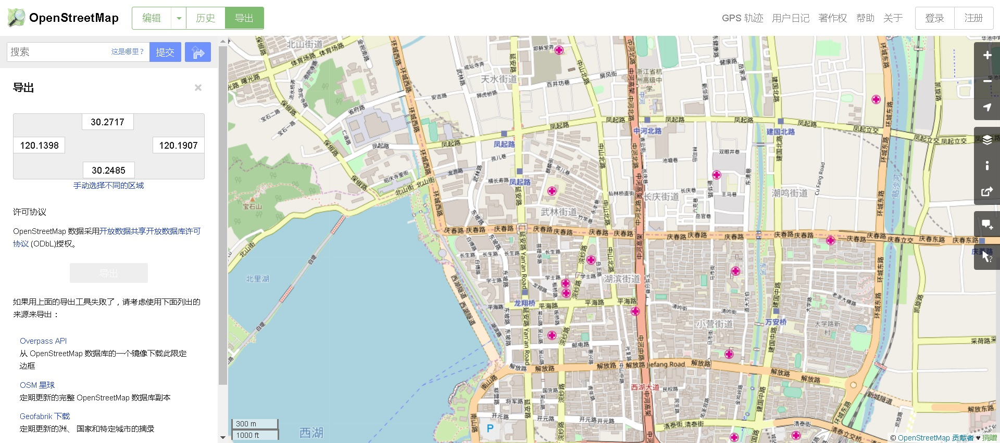

## PostgreSQL 空间位置(geometry 经纬、点、线、面...)、行政地址(门牌、商圈、行政区...) 相互转换方法  
                                                           
### 作者                                                           
digoal                                                           
                                                           
### 日期                                                           
2018-07-25                                                         
                                                           
### 标签                                                           
PostgreSQL , openstreetmap , 空间位置 , 点 , 线 , 面 , 行政地址 , 转换 , osm2pgsql , poi , 门牌 , 商圈 , 行政区      
                                                           
----                                                           
                                                           
## 背景     
空间位置(geometry 经纬、点、线、面...)、行政地址(门牌、商圈、行政区...) 相互转换需求，如果你有这方面的素材库，在PostgreSQL里面转换，性能是非常高效的。  
  
例如输入任意一个空间对象，扫描出附近的空间对象，或者包含它的对象，或者它包含的对象。（构图）  
  
输入任意一个空间对象，搜索离他最近的空间对象。  
  
输入任意一个空间对象，以及其他的非空间过滤条件(使用btree_gist插件)，搜索出附近的空间对象，或者包含它的对象，或者它包含的对象。或离他最近的空间对象。  
  
  
## DEMO  
1、建表，存储空间、实体映射信息。  
  
```  
create table tbl_loc (  
  id int8 primary key,    
  level int2,     -- 空间对象的级别（国、省、市、区、县、街道、建筑、街道）  
  pos geometry,   -- 空间对象的位置(多边形、线段、点)  
  loc_name text   -- 空间对象的描述  
);  
```  
  
2、创建空间+级别复合索引  
  
```  
create extension btree_gist;  
  
create index idx_tbl_loc_1 on tbl_loc using gist(level, pos);  
```  
  
3、创建UDF接口函数  
  
```  
create or replace function get_loc_name(  
  int2,  -- 级别（国、省、市、区、县、街道、建筑、街道）  
  geometry    -- 输入一个空间对象（点、线段、多边形），找在某个级别内，离他最近的空间对象，并找出它的描述  
) returns tbl_loc as $$  
select tbl_loc from tbl_loc where level=$1 order by pos <-> $2 limit 1;  
$$ language sql strict;  
```  
  
4、查看UDF接口函数执行计划  
  
```  
load 'auto_explain';  
set auto_explain.log_analyze =on;  
set auto_explain.log_buffers =on;  
set auto_explain.log_min_duration =0;  
set auto_explain.log_nested_statements =on;  
set auto_explain.log_timing =on;  
set auto_explain.log_verbose =on;  
set client_min_messages =log;  
  
postgres=# select * from get_loc_name(1::int2,st_setsrid(st_makepoint(110+random()*10,30+random()*10),4326));  
LOG:  duration: 0.171 ms  plan:  
Query Text:   
select tbl_loc from tbl_loc where level=$1 order by pos <-> $2 limit 1;  
  
Limit  (cost=0.42..0.96 rows=1 width=107) (actual time=0.168..0.168 rows=1 loops=1)  
  Output: tbl_loc.*, ((pos <-> $2))  
  Buffers: shared hit=6  
  ->  Index Scan using idx_tbl_loc_1 on public.tbl_loc  (cost=0.42..2455327.73 rows=4586107 width=107) (actual time=0.167..0.167 rows=1 loops=1)  
        Output: tbl_loc.*, (pos <-> $2)  
        Index Cond: (tbl_loc.level = $1)  
        Order By: (tbl_loc.pos <-> $2)  
        Buffers: shared hit=6  
LOG:  duration: 0.466 ms  plan:  
Query Text: select * from get_loc_name(1::int2,st_setsrid(st_makepoint(110+random()*10,30+random()*10),4326));  
Function Scan on public.get_loc_name  (cost=0.27..0.28 rows=1 width=74) (actual time=0.451..0.451 rows=1 loops=1)  
  Output: id, level, pos, loc_name  
  Function Call: get_loc_name('1'::smallint, st_setsrid(st_makepoint(('110'::double precision + (random() * '10'::double precision)), ('30'::double precision + (random() * '10'::double precision))), 4326))  
  Buffers: shared hit=6  
    id     | level |                        pos                         |             loc_name               
-----------+-------+----------------------------------------------------+----------------------------------  
 333848315 |     1 | 0101000020E610000000001C7BA1735C400000F03DF1984040 | 8cbcf713c4210ca4bbc09cd4c039c230  
(1 row)  
```  
  
5、空间位置(geometry 经纬、点、线、面...)、行政地址(门牌、商圈、行政区...) 相互转换压测  
  
首先写入一批随机空间对象数据（以点为例，写入约1亿个点  122536913）   
  
```  
vi test.sql  
  
\set id random(1,2000000000)  
\set level random(1,10)  
insert into tbl_loc values (:id, :level, st_setsrid(st_makepoint(110+random()*10, 30+random()*10), 4326), md5(random()::text)) on conflict(id) do nothing;  
  
  
pgbench -M prepared -n -r -P 1 -f ./test.sql -c 32 -j 32 -T 600  
```  
  
压测  
  
```  
vi test.sql  
  
select * from get_loc_name(1::int2,st_setsrid(st_makepoint(110+random()*10, 30+random()*10),4326));  
  
pgbench -M prepared -n -r -P 1 -f ./test.sql -c 56 -j 56 -T 120  
```  
  
性能，TPS： 10.3万。       
  
```  
transaction type: ./test.sql  
scaling factor: 1  
query mode: prepared  
number of clients: 56  
number of threads: 56  
duration: 120 s  
number of transactions actually processed: 12377402  
latency average = 0.543 ms  
latency stddev = 0.171 ms  
tps = 103143.196980 (including connections establishing)  
tps = 103153.166730 (excluding connections establishing)  
script statistics:  
 - statement latencies in milliseconds:  
         0.543  select * from get_loc_name(1::int2,st_setsrid(st_makepoint(110+random()*10, 30+random()*10),4326));  
```  
  
使用PG的流复制，可以很容易把请求吞吐做上去，哪怕是对外提供高并发的转换类接口服务也是很轻松的。  
  
## 如何得到 空间位置(geometry 经纬、点、线、面...)、行政地址(门牌、商圈、行政区...) 对应关系  
一种方法是通过openstreetmap得到，openstreetmap是开放的，自由的，社会人都可以维护、获取的一个开源空间素材库。  
  
1、导出映射关系  
  
https://www.openstreetmap.org/  
  
  
  
https://www.openstreetmap.org/export#map=15/30.2601/120.1653  
  
2、将空间位置(geometry 经纬、点、线、面...)、行政地址(门牌、商圈、行政区...) 对应关系导入到PostgreSQL  
  
https://github.com/openstreetmap/osm2pgsql/releases  
  
```  
sudo yum install -y cmake3 make gcc-c++ boost-devel expat-devel zlib-devel \  
  bzip2-devel postgresql10-devel proj-devel proj-epsg lua-devel   
  
wget wget https://github.com/openstreetmap/osm2pgsql/archive/0.96.0.tar.gz  
tar -zxvf 0.96.0.tar.gz   
cd osm2pgsql-0.96.0/  
  
alias cmake=cmake3  
  
mkdir build && cd build  
cmake .. -G "Unix Makefiles" -DCMAKE_BUILD_TYPE=Debug -DBUILD_TESTS=ON  
make  
make install  
  
Install the project...  
-- Install configuration: "Debug"  
-- Installing: /usr/local/bin/osm2pgsql  
-- Set runtime path of "/usr/local/bin/osm2pgsql" to ""  
-- Installing: /usr/local/share/man/man1/osm2pgsql.1  
-- Installing: /usr/local/share/osm2pgsql/default.style  
-- Installing: /usr/local/share/osm2pgsql/empty.style  
```  
  
3、导入到数据  
  
```  
osm2pgsql -d postgres -E 4326 ./map.osm    
```  
  
```  
 public | planet_osm_line       | table | postgres  
 public | planet_osm_point      | table | postgres  
 public | planet_osm_polygon    | table | postgres  
 public | planet_osm_roads      | table | postgres  
```  
  
4、查询导入的一些对象  
  
```  
postgres=# select name,way,st_astext(way) from planet_osm_point limit 5;  
  name  |                        way                         |           st_astext             
--------+----------------------------------------------------+-------------------------------  
 湘湖   | 0101000020E6100000924149DCBE0E5E40F67CCD72D92A3E40 | POINT(120.2303992 30.1673805)  
 江虹路 | 0101000020E6100000741200D26D0C5E4030B6B52A2E2F3E40 | POINT(120.1942029 30.1842982)  
 江晖路 | 0101000020E6100000C0C469D2370D5E409862B3C81B2F3E40 | POINT(120.2065321 30.1840177)  
 西兴   | 0101000020E6100000EB1F9FEBD60D5E40433866D993303E40 | POINT(120.2162427 30.189756)  
 滨康路 | 0101000020E6100000E1F725D1810E5E400E034CCFAA2F3E40 | POINT(120.2266734 30.1862001)  
(5 rows)  
```  
  
## 参考  
  
https://www.openstreetmap.org/  
  
https://github.com/openstreetmap/osm2pgsql/releases  
  
http://postgis.net/  
  
[《OSM(OpenStreetMap) poi、路网 数据导入 PostgreSQL》](../201801/20180118_01.md)    
  
[《GIS术语 - POI、AOI、LOI、路径、轨迹》](../201712/20171204_01.md)    
  
[《HTAP数据库 PostgreSQL 场景与性能测试之 47 - (OLTP) 空间应用 - 高并发空间位置更新、多属性KNN搜索并测（含空间索引）末端配送类项目》](../201711/20171107_48.md)    
  
[《[未完待续] HTAP数据库 PostgreSQL 场景与性能测试之 44 - (OLTP) 空间应用 - 空间包含查询(输入多边形 包含 表内空间对象)》](../201711/20171107_45.md)    
  
[《HTAP数据库 PostgreSQL 场景与性能测试之 29 - (OLTP) 空间应用 - 高并发空间位置更新（含空间索引）》](../201711/20171107_30.md)    
  
[《HTAP数据库 PostgreSQL 场景与性能测试之 6 - (OLTP) 空间应用 - KNN查询（搜索附近对象，由近到远排序输出）》](../201711/20171107_07.md)    
  
[《HTAP数据库 PostgreSQL 场景与性能测试之 5 - (OLTP) 空间应用 - 空间包含查询(表内多边形 包含 输入空间对象)》](../201711/20171107_06.md)    
  
  
<a rel="nofollow" href="http://info.flagcounter.com/h9V1"  ></a>  
  
  
  
  
  
  
## [digoal's 大量PostgreSQL文章入口](https://github.com/digoal/blog/blob/master/README.md "22709685feb7cab07d30f30387f0a9ae")
  
