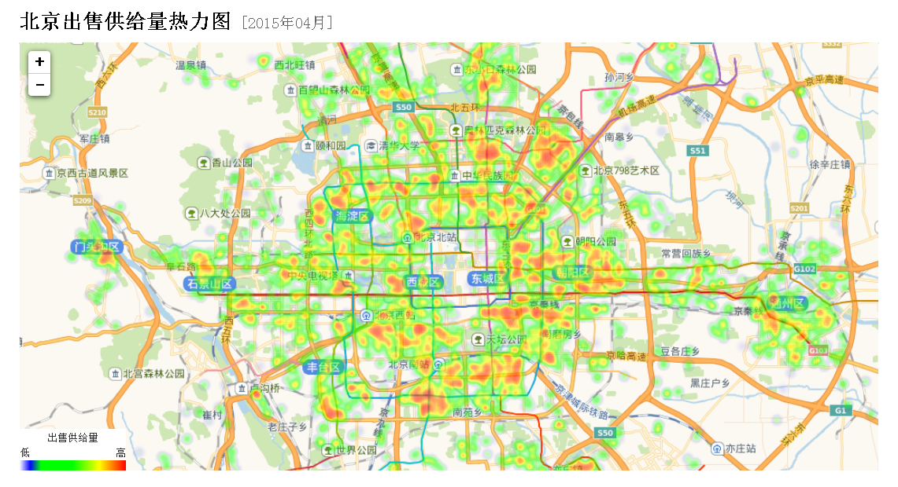

## PostgreSQL 生成空间热力图  
                                                             
### 作者                                                             
digoal                                                             
                                                             
### 日期                                                             
2018-07-25                                                           
                                                             
### 标签                                                             
PostgreSQL , 热力图 , 空间切割 , 并行计算 , parallel safe  
                                                             
----                                                             
                                                             
## 背景       
结合空间数据，计算基于地理位置信息的热力图，在空间数据可视化场景中是一个非常常见的需求。  
  
  
  
结合流计算，可以实现实时的热力图计算。  
  
结合并行计算，可以高效率的对海量数据进行热力图计算。  
  
## 计算热力图中bucket的方法  
  
https://www.postgresql.org/docs/devel/static/functions-math.html  
  
```  
width_bucket(operand dp, b1 dp, b2 dp, count int)	  
int	  
return the bucket number to which operand would be assigned in a histogram having count equal-width buckets spanning the range b1 to b2;   
returns 0 or count+1 for an input outside the range	  
width_bucket(5.35, 0.024, 10.06, 5)	  
3  
  
width_bucket(operand numeric, b1 numeric, b2 numeric, count int)	  
int	  
return the bucket number to which operand would be assigned in a histogram having count equal-width buckets spanning the range b1 to b2;   
returns 0 or count+1 for an input outside the range	  
width_bucket(5.35, 0.024, 10.06, 5)	  
3  
```  
  
例如  
  
```  
postgres=# select width_bucket(1,1,10,10);  
 width_bucket   
--------------  
            1  
(1 row)  
  
postgres=# select width_bucket(0,1,10,10);  
 width_bucket   
--------------  
            0  
(1 row)  
  
postgres=# select width_bucket(10,1,10,10);  
 width_bucket   
--------------  
           11  
(1 row)  
  
postgres=# select width_bucket(9.9,1,10,10);  
 width_bucket   
--------------  
           10  
(1 row)  
```  
  
```  
width_bucket(  
  p1 -- 输入值  
  p2 -- 边界值（最小，包含）  
  p3 -- 边界值（最大，不包含）  
  p4 -- 切割份数  
)  
  
当小于最小边界值时，返回0  
当大于等于最大边界值时，返回p4+1  
```  
  
  
例如x轴的边界是1,10000，y轴的边界是1,10000。  
  
x,y两个方向分别切割为50个bucket，一共2500个bucket，求一个点落在哪个bucket：  
  
```  
width_bucket(pos[0], 1, 10001, 50),  -- x轴落在哪列bucket  
width_bucket(pos[1], 1, 10001, 50),  -- y轴落在哪列bucket  
```  
  
## 例子  
1、建表  
  
```  
create table tbl_pos(  
  id int,    
  info text,   -- 信息  
  val float8,  -- 取值  
  pos point    -- 位置  
);  
```  
  
2、写入1亿个点  
  
```  
vi test.sql  
insert into tbl_pos values ( random()*100000, md5(random()::text), random()*1000, point((random()*10000::int), (random()*10000::int)) );  
  
  
  
pgbench -M prepared -n -r -P 1 -f ./test.sql -c 50 -j 50 -t 2000000  
```  
  
3、热力图计算  
  
强制并行计算  
  
```  
postgres=# set min_parallel_table_scan_size =0;  
SET  
postgres=# set min_parallel_index_scan_size =0;  
SET  
postgres=# set parallel_setup_cost =0;  
SET  
postgres=# set parallel_tuple_cost =0;  
SET  
postgres=# set max_parallel_workers_per_gather =28;  
SET  
postgres=# alter table tbl_pos set (parallel_workers =28);  
ALTER TABLE  
```  
  
热力图计算SQL，效率还不错：  
  
```  
select   
  width_bucket(pos[0], 0, 10001, 50),  -- x轴落在哪列bucket  
  width_bucket(pos[1], 0, 10001, 50),  -- y轴落在哪列bucket  
  avg(val),  
  min(val),  
  max(val),  
  stddev(val),  
  count(*)  
from tbl_pos  
  group by 1,2;  
  
  
                                                                                      QUERY PLAN                                                                                         
---------------------------------------------------------------------------------------------------------------------------------------------------------------------------------------  
 Finalize GroupAggregate  (cost=1252812.00..1252928.00 rows=200 width=48) (actual time=2632.324..2672.909 rows=2500 loops=1)  
   Group Key: (width_bucket(pos[0], '0'::double precision, '10001'::double precision, 50)), (width_bucket(pos[1], '0'::double precision, '10001'::double precision, 50))  
   ->  Sort  (cost=1252812.00..1252826.00 rows=5600 width=96) (actual time=2632.290..2648.544 rows=72500 loops=1)  
         Sort Key: (width_bucket(pos[0], '0'::double precision, '10001'::double precision, 50)), (width_bucket(pos[1], '0'::double precision, '10001'::double precision, 50))  
         Sort Method: external merge  Disk: 9824kB  
         ->  Gather  (cost=1252460.37..1252463.37 rows=5600 width=96) (actual time=2532.132..2564.905 rows=72500 loops=1)  
               Workers Planned: 28  
               Workers Launched: 28  
               ->  Partial HashAggregate  (cost=1252460.37..1252463.37 rows=200 width=96) (actual time=2522.428..2523.559 rows=2500 loops=29)  
                     Group Key: width_bucket(pos[0], '0'::double precision, '10001'::double precision, 50), width_bucket(pos[1], '0'::double precision, '10001'::double precision, 50)  
                     ->  Parallel Seq Scan on tbl_pos  (cost=0.00..1189951.79 rows=3571919 width=16) (actual time=0.030..1302.462 rows=3448276 loops=29)  
 Planning time: 0.154 ms  
 Execution time: 2676.288 ms  
(13 rows)  
```  
  
样本  
  
```  
postgres=# select                   
  width_bucket(pos[0], 0, 10001, 10),  -- x轴落在哪列bucket  
  width_bucket(pos[1], 0, 10001, 10),  -- y轴落在哪列bucket  
  avg(val),  
  min(val),  
  max(val),  
  stddev(val),  
  count(*)  
from tbl_pos  
  group by 1,2;  
 width_bucket | width_bucket |       avg        |         min          |       max        |      stddev      |  count    
--------------+--------------+------------------+----------------------+------------------+------------------+---------  
            1 |            1 | 499.638668709335 | 0.000637955963611603 | 999.998900108039 | 288.562996477433 | 1002686  
            1 |            2 | 499.772206697849 |  0.00113388523459435 | 999.999452847987 | 288.505295714968 | 1000891  
            1 |            3 |  500.44455454312 |  0.00135181471705437 | 999.997937120497 |  288.45102360668 |  999911  
            1 |            4 | 500.234164866407 |  0.00214902684092522 | 999.999100342393 | 288.707167816157 | 1000473  
            1 |            5 | 499.793710464008 | 0.000125262886285782 | 999.999575316906 | 288.672382834812 |  999036  
            1 |            6 | 500.366854944369 |  0.00212574377655983 | 999.999585561454 | 288.558891852102 |  998866  
            1 |            7 | 499.825623783545 | 0.000547617673873901 | 999.999700114131 | 288.582317248892 | 1000902  
            1 |            8 | 499.393569281915 |  0.00330200418829918 | 999.999083112925 | 288.561094278074 | 1000193  
            1 |            9 | 499.713056248083 |  0.00243959948420525 | 999.999618623406 | 288.709997455837 | 1000017  
            1 |           10 | 500.312448499828 |  0.00238511711359024 | 999.999850522727 | 288.865560266629 |  998469  
            2 |            1 | 499.848655048635 |  0.00146497040987015 | 999.999508261681 | 288.639402346948 | 1000917  
            2 |            2 | 500.084846394446 |   0.0005294568836689 | 999.999178107828 | 288.704696698903 |  997594  
            2 |            3 |  499.99258346144 |  0.00163912773132324 |  999.99839020893 | 288.507497234907 | 1001310  
            2 |            4 | 499.817295558208 |  0.00184541568160057 | 999.997940845788 | 288.767308817191 | 1000607  
            2 |            5 |  499.87314410326 |  0.00135786831378937 | 999.999302905053 | 288.593077096809 |  998588  
            2 |            6 | 499.825467223571 | 0.000847037881612778 | 999.998526647687 | 288.789326889728 | 1000426  
            2 |            7 |  499.50907809986 |  7.4971467256546e-05 |   999.9989871867 | 288.535982009648 | 1001179  
            2 |            8 | 499.850422744194 | 0.000966247171163559 | 999.999921303242 | 288.516738657089 | 1000745  
            2 |            9 | 500.110417044655 | 0.000320374965667725 | 999.999660998583 |  288.77420504779 |  999978  
            2 |           10 | 500.135548004555 | 0.000233296304941177 | 999.999852851033 | 288.520964728395 |  998363  
........  
```  
  
取出数据，即可渲染。  
  
结合流计算，可以在FEED数据写入时，实时的进行计算。而不是QUERY发起时计算。参考本文末尾的文档。  
  
## 小结  
PostgreSQL非常适合于时空数据的分析，包括本文提到的热力图分析。  
  
使用并行计算，即查即算，1亿个点，差不多耗时2.7秒。   
  
如果使用流式计算，写入时即算，查询时查的是结果，效率更高。  
  
## 参考  
  
1、求bucket值  
  
https://www.postgresql.org/docs/devel/static/functions-math.html  
  
```  
width_bucket(operand dp, b1 dp, b2 dp, count int)	  
int	  
return the bucket number to which operand would be assigned in a histogram having count equal-width buckets spanning the range b1 to b2;   
returns 0 or count+1 for an input outside the range	  
width_bucket(5.35, 0.024, 10.06, 5)	  
3  
  
width_bucket(operand numeric, b1 numeric, b2 numeric, count int)	  
int	  
return the bucket number to which operand would be assigned in a histogram having count equal-width buckets spanning the range b1 to b2;   
returns 0 or count+1 for an input outside the range	  
width_bucket(5.35, 0.024, 10.06, 5)	  
3  
```  
  
2、求geometry对象的x,y,z值  
  
http://postgis.net/docs/manual-2.4/reference.html  
  
```  
ST_X — Return the X coordinate of the point, or NULL if not available. Input must be a point.  
ST_XMax — Returns X maxima of a bounding box 2d or 3d or a geometry.  
ST_XMin — Returns X minima of a bounding box 2d or 3d or a geometry.  
ST_Y — Return the Y coordinate of the point, or NULL if not available. Input must be a point.  
ST_YMax — Returns Y maxima of a bounding box 2d or 3d or a geometry.  
ST_YMin — Returns Y minima of a bounding box 2d or 3d or a geometry.  
ST_Z — Return the Z coordinate of the point, or NULL if not available. Input must be a point.  
ST_ZMax — Returns Z minima of a bounding box 2d or 3d or a geometry.  
ST_Zmflag — Returns ZM (dimension semantic) flag of the geometries as a small int. Values are: 0=2d, 1=3dm, 2=3dz, 3=4d.  
ST_ZMin — Returns Z minima of a bounding box 2d or 3d or a geometry.  
```  
  
3、求point对象的x,y值  
  
```  
point[0]  
  
point[1]  
```  
  
4、PostgreSQL 并行计算  
  
[《PostgreSQL 11 preview - 并行计算 增强 汇总》](../201805/20180519_02.md)    
  
[《PostgreSQL 单表并行bulkload的extend file lock 冲突问题解决》](../201805/20180515_03.md)    
  
[《阿里云RDS PostgreSQL OSS 外部表实践 - (dblink异步调用封装并行) 从OSS并行导入数据》](../201804/20180427_01.md)    
  
[《PostgreSQL 变态并行拉取单表的方法 - 按块并行(按行号(ctid)并行) + dblink 异步调用》](../201804/20180410_03.md)    
  
[《PostgreSQL 11 preview - 多阶段并行聚合array_agg, string_agg》](../201803/20180322_11.md)    
  
[《PostgreSQL 11 preview - 分区表智能并行聚合、分组计算(已类似MPP架构，性能暴增)》](../201803/20180322_07.md)    
  
[《PostgreSQL Oracle 兼容性之 - 自定义并行聚合函数 PARALLEL_ENABLE AGGREGATE》](../201803/20180312_03.md)    
  
[《PostgreSQL VOPS 向量计算 + DBLINK异步并行 - 单实例 10亿 聚合计算跑进2秒》](../201802/20180210_01.md)    
  
[《PostgreSQL 相似搜索分布式架构设计与实践 - dblink异步调用与多机并行(远程 游标+记录 UDF实例)》](../201802/20180205_03.md)    
  
[《PostgreSQL 11 preview - Parallel Append(包括 union all\分区查询) (多表并行计算) sharding架构并行计算核心功能之一》](../201802/20180204_03.md)    
  
[《PostgreSQL 11 preview - 并行排序、并行索引 (性能线性暴增) 单实例100亿TOP-K仅40秒》](../201802/20180204_01.md)    
  
[《PostgreSQL 11 preview - 分区表智能并行JOIN (已类似MPP架构，性能暴增)》](../201802/20180202_02.md)    
  
[《PostgreSQL dblink异步调用实现 并行hash分片JOIN - 含数据交、并、差 提速案例 - 含dblink VS pg 11 parallel hash join VS pg 11 智能分区JOIN》](../201802/20180201_02.md)    
  
[《PostgreSQL 10 自定义并行计算聚合函数的原理与实践 - (含array_agg合并多个数组为单个一元数组的例子)》](../201801/20180119_04.md)    
  
[《惊天性能！单RDS PostgreSQL实例 支撑 2000亿 - 实时标签透视案例 (含dblink异步并行调用)》](../201712/20171223_01.md)    
  
[《HTAP数据库 PostgreSQL 场景与性能测试之 23 - (OLAP) 并行计算》](../201711/20171107_24.md)    
  
[《PostgreSQL 如何让 列存（外部列存） 并行起来》](../201710/20171014_01.md)    
  
[《阿里云RDS PostgreSQL OSS 外部表实践 - (dblink异步调用封装并行) 数据并行导出到OSS》](../201709/20170906_01.md)    
  
[《PostgreSQL 并行写入堆表，如何保证时序线性存储 - BRIN索引优化》](../201706/20170611_02.md)    
  
[《PostgreSQL 10.0 preview 功能增强 - 逻辑复制支持并行COPY初始化数据》](../201703/20170328_01.md)    
  
[《PostgreSQL 10.0 preview 多核并行增强 - 控制集群并行度》](../201703/20170313_12.md)    
  
[《PostgreSQL 10.0 preview 多核并行增强 - 索引扫描、子查询、VACUUM、fdw/csp钩子》](../201703/20170313_08.md)    
  
[《PostgreSQL 10.0 preview sharding增强 - 支持Append节点并行》](../201703/20170312_11.md)    
  
[《PostgreSQL 10.0 preview 多核并行增强 - 并行hash join支持shared hashdata, 节约哈希表内存提高效率》](../201703/20170312_08.md)    
  
[《PostgreSQL 10.0 preview sharding增强 - postgres_fdw 多节点异步并行执行》](../201703/20170312_07.md)    
  
[《PostgreSQL 10.0 preview 多核并行增强 - tuplesort 多核并行创建索引》](../201703/20170312_05.md)    
  
[《PostGIS 地理信息、栅格数据 多核并行处理(st_memunion, st_union)》](../201703/20170307_03.md)    
  
[《分析加速引擎黑科技 - LLVM、列存、多核并行、算子复用 大联姻 - 一起来开启PostgreSQL的百宝箱》](../201612/20161216_01.md)    
  
[《PostgreSQL 并行计算tpc-h测试和优化分析》](../201611/20161108_01.md)    
  
[《PostgreSQL 9.6 并行计算 在 xfs, ext4 下的表现对比》](../201610/20161002_02.md)    
  
[《PostgreSQL 9.6 并行计算 优化器算法浅析 - 以及如何强制并行度》](../201610/20161002_01.md)    
  
[《PostgreSQL 9.6 引领开源数据库攻克多核并行计算难题》](../201610/20161001_01.md)    
  
[《PostgreSQL 9.6 并行计算 优化器算法浅析》](../201608/20160816_02.md)    
  
5、流计算  
  
[《PostgreSQL 流式处理应用实践 - 二手商品实时归类(异步消息notify/listen、阅后即焚)》](../201807/20180713_03.md)    
  
[《PostgreSQL 流计算插件pipelinedb sharding 集群版原理介绍 - 一个全功能的分布式流计算引擎》](../201803/20180314_04.md)    
  
[《[未完待续] PostgreSQL 流式fft傅里叶变换 (plpython + numpy + 数据库流式计算)》](../201803/20180307_01.md)    
  
[《PostgreSQL count-min sketch top-n 概率计算插件 cms_topn (结合窗口实现同比、环比、滑窗分析等) - 流计算核心功能之一》](../201803/20180301_03.md)    
  
[《阿里云RDS PostgreSQL varbitx实践 - 流式标签 (阅后即焚流式批量计算) - 万亿级，任意标签圈人，毫秒响应》](../201712/20171212_01.md)    
  
[《HTAP数据库 PostgreSQL 场景与性能测试之 32 - (OLTP) 高吞吐数据进出(堆存、行扫、无需索引) - 阅后即焚(JSON + 函数流式计算)》](../201711/20171107_33.md)    
  
[《HTAP数据库 PostgreSQL 场景与性能测试之 31 - (OLTP) 高吞吐数据进出(堆存、行扫、无需索引) - 阅后即焚(读写大吞吐并测)》](../201711/20171107_32.md)    
  
[《HTAP数据库 PostgreSQL 场景与性能测试之 27 - (OLTP) 物联网 - FEED日志, 流式处理 与 阅后即焚 (CTE)》](../201711/20171107_28.md)    
  
[《[未完待续] 流式机器学习(online machine learning) - pipelineDB with plR and plPython》](../201711/20171107_01.md)    
  
[《[未完待续] PostgreSQL 分布式流式计算 最佳实践》](../201710/20171030_01.md)    
  
[《打造云端流计算、在线业务、数据分析的业务数据闭环 - 阿里云RDS、HybridDB for PostgreSQL最佳实践》](../201707/20170728_01.md)    
  
[《PostgreSQL 10.0 preview 性能增强 - libpq支持pipeline batch模式减少网络交互提升性能》](../201703/20170312_15.md)    
  
[《流计算风云再起 - PostgreSQL携PipelineDB力挺IoT》](../201612/20161220_01.md)    
  
[《在PostgreSQL中实现update | delete limit - CTID扫描实践  (高效阅后即焚)》](../201608/20160827_01.md)    
  
[《PostgreSQL Oracle 兼容性之 - PL/SQL pipelined》](../201603/20160318_01.md)    
  
[《PostgreSQL 流计算指 pipelinedb 实时处理Kafka消息流》](../201510/20151021_02.md)    
    
  
<a rel="nofollow" href="http://info.flagcounter.com/h9V1"  ></a>  
  
  
  
  
  
  
## [digoal's 大量PostgreSQL文章入口](https://github.com/digoal/blog/blob/master/README.md "22709685feb7cab07d30f30387f0a9ae")
  
