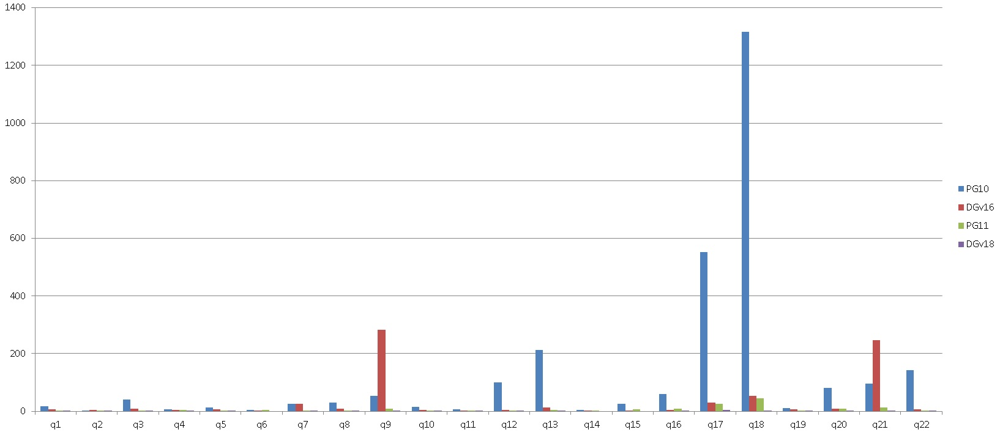

## (TPC-H测试 SF=10,SF=200) PostgreSQL 11 vs 10 vs Deepgreen  
                                                           
### 作者                                                           
digoal                                                           
                                                           
### 日期                                                           
2018-08-23                                                         
                                                           
### 标签                                                           
PostgreSQL , TPC-H , HTAP    
                                                           
----                                                           
                                                           
## 背景    
去年测的PostgreSQL 10 vs Deepgreen.   
  
[《TPC-H测试 - PostgreSQL 10 vs Deepgreen(Greenplum)》](../201707/20170714_01.md)    
  
PG每年发一个大版本，此次PostgreSQL 11即将release，对PostgreSQL 11 beta3 vs Deepgreen v18 测试的TPC-H结果如下。  
  
事实证明PG的AP能力又有了质的飞越，OLAP已无限接近MPP数据库deepgreen的性能。同时拥有单实例百万级QPS的OLTP能力，应该是目前覆盖业务场景可以做到最广泛的数据库(PG的TAG:全栈数据库 无疑)。      
  
## 测试 环境 
ECS , 32核 , 本地SSD 8TB.    
  
PostgreSQL 11 beta3  
  
Deepgreen v18 (16 segments)
  
SF=10   
  
## deepgreen部署quick guide
http://vitessedata.com/products/deepgreen-db/download/   
  
以os用户digoal为例, 部署deepgreen(6个segment)  
  
```
# 部署目录
mkdir -p /data01/dp/dbfast0
mkdir -p /data01/dp/dbfast1
mkdir -p /data01/dp/dbfast2
mkdir -p /data02/dp/dbfast1
mkdir -p /data02/dp/dbfast2
mkdir -p /data03/dp/dbfast1
mkdir -p /data03/dp/dbfast2
chown -R digoal:digoal /data01/dp
chown -R digoal:digoal /data02/dp
chown -R digoal:digoal /data03/dp
```
    
```
su - digoal

wget  https://s3.amazonaws.com/vitessedata/download/deepgreendb.18.08.rh7.x86_64.180823.bin   

chmod  +x deepgreendb.18.08.rh7.x86_64.180823.bin

./deepgreendb.18.08.rh7.x86_64.180823.bin

vi ./deepgreendb/greenplum_path.sh

#追加
# 使用实际目录
export MASTER_DATA_DIRECTORY=/data01/dp/dbfast0/dg-1
export PGDATA=$MASTER_DATA_DIRECTORY
export PGHOST=127.0.0.1
export PGPORT=15432
# 使用os用户名
export PGUSER=digoal
export PGPASSWORD=123
export PGDATABASE=postgres
  
. ./deepgreendb/greenplum_path.sh

echo "`hostname`" > hostfile

gpssh-exkeys -h localhost

gpssh-exkeys -h `hostname`
  

cat > cluster.conf <<HEREHERE

ARRAY_NAME="mpp1 cluster"
CLUSTER_NAME="mpp1 cluster"
MACHINE_LIST_FILE=hostfile
SEG_PREFIX=dg
DATABASE_PREFIX=dg
PORT_BASE=25432
declare -a DATA_DIRECTORY=(/data01/dp/dbfast1 /data01/dp/dbfast2 /data02/dp/dbfast1 /data02/dp/dbfast2 /data03/dp/dbfast1 /data03/dp/dbfast2)
MASTER_HOSTNAME=`hostname`
MASTER_DIRECTORY=/data01/dp/dbfast0
MASTER_PORT=15432
IP_ALLOW=0.0.0.0/0
TRUSTED_SHELL=/usr/bin/ssh
CHECK_POINT_SEGMENTS=8
ENCODING=UNICODE
export MASTER_DATA_DIRECTORY
export TRUSTED_SHELL
DEFAULT_QD_MAX_CONNECT=25
QE_CONNECT_FACTOR=5

HEREHERE


gpinitsystem -c cluster.conf -h hostfile
```
  
## 测试过程  
  
PG 11(未使用分区表), DP v18(使用分区表,1个月1分区).  
  
1、对所有列加索引  
  
[《PostgreSQL 快速给指定表每个字段创建索引》](../201808/20180822_01.md)    
  
```  
do language plpgsql $$    
declare    
  tables name[] := array['customer','lineitem','nation','orders','part','partsupp','region','supplier'];     
  n name;     
  x name;     
  i int;    
  sql text;    
  ts1 timestamp;    
  ts2 timestamp;    
begin    
  set max_parallel_maintenance_workers=24;   -- 创建索引时的并行度    
      
  set max_parallel_workers=32;    
  set max_parallel_workers_per_gather=32;    
  set maintenance_work_mem='4GB';    
    
  set min_parallel_table_scan_size=0;    
  set min_parallel_index_scan_size=0;    
  set parallel_setup_cost=0;    
  set parallel_tuple_cost=0;    
    
  foreach n in array tables loop    
    i := 1;      
    for x in select attname from pg_attribute where attrelid=n::regclass and attnum>=1 and not attisdropped loop    
      sql := format('create index IF NOT EXISTS idx_%s__%s on %s (%s) tablespace tbs1', n, i, n, x);   -- 封装创建索引的SQL    
      ts1 := clock_timestamp();    
      raise notice '% start execute: %', ts1, sql;    
      execute sql;  -- 创建索引      
      commit;  -- pg 11已支持procedure, do里面开子事务  
      ts2 := clock_timestamp();    
      raise notice '% end execute: % , duration: %', ts2, sql, ts2-ts1;    
      i:=i+1;    
    end loop;    
    execute format('analyze %s', n);     
  end loop;    
end;    
$$;   
```  
  
**多轮测试后得到实际使用的索引(包括pk, uk在内), 使用下面的CODE替换之前的所有索引。**       
  
```
select string_agg(pg_get_indexdef(indexrelname::regclass),';') from pg_stat_all_indexes  where relname = any(array['customer','lineitem','nation','orders','part','partsupp','region','supplier']) and idx_scan<>0;
```
  
```
do language plpgsql $$
declare
  tables name[] := array['customer','lineitem','nation','orders','part','partsupp','region','supplier'];
  n name;
  idx_sql text;
  ts1 timestamp;
  ts2 timestamp;
  sql text;
begin
  set max_parallel_maintenance_workers=24;   -- 创建索引时的并行度

  set max_parallel_workers=32;
  set max_parallel_workers_per_gather=32;
  set maintenance_work_mem='4GB';

  set min_parallel_table_scan_size=0;
  set min_parallel_index_scan_size=0;
  set parallel_setup_cost=0;
  set parallel_tuple_cost=0;

  -- set default_tablespace='tbs1';  -- 是否使用其他表空间

  idx_sql := 'CREATE UNIQUE INDEX IF NOT EXISTS customer_pkey ON public.customer USING btree (c_custkey);CREATE INDEX IF NOT EXISTS idx1 ON public.lineitem USING btree (l_orderkey) WHERE (l_commitdate < l_receiptdate);CREATE INDEX IF NOT EXISTS idx_lineitem__11 ON public.lineitem USING btree (l_shipdate);CREATE INDEX IF NOT EXISTS idx_lineitem__2 ON public.lineitem USING btree (l_partkey);CREATE INDEX IF NOT EXISTS idx_lineitem__3 ON public.lineitem USING btree (l_suppkey);CREATE INDEX IF NOT EXISTS idx_lineitem_orderkey ON public.lineitem USING btree (l_orderkey);CREATE INDEX IF NOT EXISTS idx_lineitem_shipdate ON public.lineitem USING btree (l_shipdate, l_discount, l_quantity);CREATE UNIQUE INDEX IF NOT EXISTS lineitem_pkey ON public.lineitem USING btree (l_orderkey, l_linenumber);CREATE INDEX IF NOT EXISTS idx6 ON public.nation USING btree (n_nationkey, n_regionkey);CREATE INDEX IF NOT EXISTS idx_nation_regionkey ON public.nation USING btree (n_regionkey);CREATE UNIQUE INDEX IF NOT EXISTS nation_pkey ON public.nation USING btree (n_nationkey);CREATE INDEX IF NOT EXISTS idx_orders__6 ON public.orders USING btree (o_orderpriority);CREATE INDEX IF NOT EXISTS idx_orders_custkey ON public.orders USING btree (o_custkey);CREATE INDEX IF NOT EXISTS idx_orders_orderdate ON public.orders USING btree (o_orderdate);CREATE UNIQUE INDEX IF NOT EXISTS orders_pkey ON public.orders USING btree (o_orderkey);CREATE INDEX IF NOT EXISTS idx_part_1 ON public.part USING btree (p_container, p_brand);CREATE INDEX IF NOT EXISTS idx_part__5 ON public.part USING btree (p_type);CREATE INDEX IF NOT EXISTS idx_part__6 ON public.part USING btree (p_size);CREATE UNIQUE INDEX IF NOT EXISTS part_pkey ON public.part USING btree (p_partkey);CREATE INDEX IF NOT EXISTS idx ON public.partsupp USING btree (ps_partkey, ps_suppkey, ps_supplycost);CREATE INDEX IF NOT EXISTS idx_partsupp__4 ON public.partsupp USING btree (ps_supplycost);CREATE INDEX IF NOT EXISTS idx_partsupp_partkey ON public.partsupp USING btree (ps_partkey);CREATE INDEX IF NOT EXISTS idx_partsupp_suppkey ON public.partsupp USING btree (ps_suppkey);CREATE UNIQUE INDEX IF NOT EXISTS partsupp_pkey ON public.partsupp USING btree (ps_partkey, ps_suppkey);CREATE INDEX IF NOT EXISTS idx5 ON public.region USING btree (r_name, r_regionkey);CREATE UNIQUE INDEX IF NOT EXISTS region_pkey ON public.region USING btree (r_regionkey);CREATE INDEX IF NOT EXISTS idx4 ON public.supplier USING btree (s_suppkey, s_nationkey);CREATE INDEX IF NOT EXISTS idx_supplier_nation_key ON public.supplier USING btree (s_nationkey);CREATE UNIQUE INDEX IF NOT EXISTS supplier_pkey ON public.supplier USING btree (s_suppkey);';

  for sql in select regexp_split_to_table(idx_sql, ';') 
  loop
    ts1 := clock_timestamp();
    raise notice '% start execute: %', ts1, sql;
    execute sql; 
    commit;  -- pg 11已支持procedure, do里面开子事务
    ts2 := clock_timestamp();
    raise notice '% end execute: % , duration: %', ts2, sql, ts2-ts1;
  end loop;
  
  foreach n in array tables loop
    execute format('analyze %s', n);
  end loop;
end;
$$;
```
  
2、强制测试过程中，使用并行查询  
  
```  
alter role postgres set enable_nestloop=off;  
alter role postgres set enable_mergejoin=off;  
alter role postgres set work_mem ='8GB';  
  
alter role postgres set max_parallel_workers_per_gather=24;  
alter role postgres set parallel_setup_cost=0;  
alter role postgres set parallel_tuple_cost=0;  
alter role postgres set min_parallel_table_scan_size=0;  
alter role postgres set min_parallel_index_scan_size=0;  
alter role postgres set geqo_threshold=100;
  
alter table customer set (parallel_workers=24);  
alter table lineitem set (parallel_workers=24);  
alter table nation set (parallel_workers=24);  
alter table orders set (parallel_workers=24);  
alter table part set (parallel_workers=24);  
alter table partsupp set (parallel_workers=24);  
alter table region set (parallel_workers=24);  
alter table supplier set (parallel_workers=24);  
```  
  
3、Q17，加了一个索引  
  
```  
create index idx_part_1 on part (p_container,p_brand);  
```  
  
4、PG 11校对了成本因子  
  
[《优化器成本因子校对 - PostgreSQL explain cost constants alignment to timestamp》](../201311/20131126_03.md)    
  
```
postgresql.auto.conf

cpu_tuple_cost=0.00018884145574257426  
cpu_index_tuple_cost = 0.00433497085216479990  
cpu_operator_cost = 0.00216748542608239995  
seq_page_cost=0.014329  
random_page_cost =0.016
```
    
```
postgresql.conf

listen_addresses = '0.0.0.0'
port = 1921
max_connections = 2000
superuser_reserved_connections = 3
unix_socket_directories = '., /var/run/postgresql, /tmp'
tcp_keepalives_idle = 60
tcp_keepalives_interval = 10
tcp_keepalives_count = 10
shared_buffers = 48GB
max_prepared_transactions = 2000
work_mem = 4GB
maintenance_work_mem = 2GB
dynamic_shared_memory_type = posix
vacuum_cost_delay = 0
bgwriter_delay = 10ms
bgwriter_lru_maxpages = 1000
bgwriter_lru_multiplier = 10.0
effective_io_concurrency = 4
max_worker_processes = 128
max_parallel_maintenance_workers = 16
max_parallel_workers_per_gather = 24
parallel_leader_participation = on
max_parallel_workers = 32
wal_level = minimal  
synchronous_commit = off
wal_writer_delay = 10ms
checkpoint_timeout = 35min
max_wal_size = 96GB
min_wal_size = 24GB
checkpoint_completion_target = 0.1
max_wal_senders = 0
random_page_cost = 1.1
effective_cache_size = 400GB
default_statistics_target = 1000
log_destination = 'csvlog'
logging_collector = on
log_directory = 'log'
log_filename = 'postgresql-%a.log'
log_truncate_on_rotation = on
log_rotation_age = 1d
log_rotation_size = 0
log_checkpoints = on 
log_connections = on
log_disconnections = on
log_error_verbosity = verbose 
log_line_prefix = '%m [%p] '
log_timezone = 'PRC'
log_autovacuum_min_duration = 0
autovacuum_freeze_max_age = 1200000000
autovacuum_multixact_freeze_max_age = 1400000000
autovacuum_vacuum_cost_delay = 0ms
vacuum_freeze_table_age = 1150000000
vacuum_multixact_freeze_table_age = 1150000000
datestyle = 'iso, mdy'
timezone = 'PRC'
lc_messages = 'C'
lc_monetary = 'C'
lc_numeric = 'C'
lc_time = 'C'
default_text_search_config = 'pg_catalog.english'
```
  
5、deepgreen v18  
  
http://vitessedata.com/products/deepgreen-db/download/install/  
  
```  
gp_vmem_protect_limit=16384;  
```  
    
## TPC-H (SF=10) 性能对比  
  
  
数据库 | q1 | q2 | q3 | q4 | q5 | q6 | q7 | q8 | q9 | q10 | q11 | q12 | q13 | q14 | q15 | q16 | q17 | q18 | q19 | q20 | q21 | q22  
---|---|---|---|---|---|---|---|---|---|---|---|---|---|---|---|---|---|---|---|---|---|---  
PostgreSQL 10 | 17 | 2 | 41 | 6 | 14 | 4 | 27 | 31 | 54 | 16 | 7 | 100 | 213 | 4 | 25 | 60 | 552 | 1317 | 11 | 82 | 95 | 143  
PostgreSQL 11beta3 | 3 | 2 | 2 | 5 | 3 | 4 | 2 | 2 | 9 | 3 | 1 | 2 | 4 | 2 | 6 | 10 | 27 | 46 | 2 | 10 | 13 | 2  
DeepGreen v16 | 6 | 4 | 10 | 4 | 7 | 1 | 27 | 10 | 283 | 5 | 2 | 5 | 14 | 1 | 2 | 5 | 31 | 53 | 6 | 10 | 246 | 7   
DeepGreen v18 | 2 | 1 | 1 | 1 | 1 | 0 | 3 | 1 | 3 | 2 | 1 | 2 | 2 | 0 | 0 | 1 | 5 | 3 | 2 | 1 | 3 | 1   
  
# SF=200
  
## SF=200 Deepgreen on ECS(64c, 512G, 8*2TB(ssd) lvm strip)(33 segments)
```
2018-08-25 15:03:59 [1535180639] : running TPC-H benchmark
2018-08-25 15:03:59 [1535180639] : running queries defined in TPC-H benchmark
2018-08-25 15:03:59 [1535180639] :   running query 1
2018-08-25 15:03:59 [1535180639] : run explain
2018-08-25 15:03:59 [1535180639] : run the query on background
2018-08-25 15:04:12 [1535180652] :     query 1 finished OK (12 seconds)
2018-08-25 15:04:12 [1535180652] :   running query 2
2018-08-25 15:04:12 [1535180652] : run explain
2018-08-25 15:04:12 [1535180652] : run the query on background
2018-08-25 15:04:15 [1535180655] :     query 2 finished OK (3 seconds)
2018-08-25 15:04:15 [1535180655] :   running query 3
2018-08-25 15:04:15 [1535180655] : run explain
2018-08-25 15:04:15 [1535180655] : run the query on background
2018-08-25 15:04:27 [1535180667] :     query 3 finished OK (11 seconds)
2018-08-25 15:04:27 [1535180667] :   running query 4
2018-08-25 15:04:27 [1535180667] : run explain
2018-08-25 15:04:27 [1535180667] : run the query on background
2018-08-25 15:04:34 [1535180674] :     query 4 finished OK (7 seconds)
2018-08-25 15:04:34 [1535180674] :   running query 5
2018-08-25 15:04:34 [1535180674] : run explain
2018-08-25 15:04:34 [1535180674] : run the query on background
2018-08-25 15:04:47 [1535180687] :     query 5 finished OK (12 seconds)
2018-08-25 15:04:47 [1535180687] :   running query 6
2018-08-25 15:04:47 [1535180687] : run explain
2018-08-25 15:04:47 [1535180687] : run the query on background
2018-08-25 15:04:48 [1535180688] :     query 6 finished OK (1 seconds)
2018-08-25 15:04:48 [1535180688] :   running query 7
2018-08-25 15:04:48 [1535180688] : run explain
2018-08-25 15:04:48 [1535180688] : run the query on background
2018-08-25 15:05:21 [1535180721] :     query 7 finished OK (32 seconds)
2018-08-25 15:05:21 [1535180721] :   running query 8
2018-08-25 15:05:21 [1535180721] : run explain
2018-08-25 15:05:21 [1535180721] : run the query on background
2018-08-25 15:05:32 [1535180732] :     query 8 finished OK (11 seconds)
2018-08-25 15:05:32 [1535180732] :   running query 9
2018-08-25 15:05:32 [1535180732] : run explain
2018-08-25 15:05:32 [1535180732] : run the query on background
2018-08-25 15:06:02 [1535180762] :     query 9 finished OK (29 seconds)
2018-08-25 15:06:02 [1535180762] :   running query 10
2018-08-25 15:06:02 [1535180762] : run explain
2018-08-25 15:06:02 [1535180762] : run the query on background
2018-08-25 15:06:11 [1535180771] :     query 10 finished OK (9 seconds)
2018-08-25 15:06:11 [1535180771] :   running query 11
2018-08-25 15:06:11 [1535180771] : run explain
2018-08-25 15:06:11 [1535180771] : run the query on background
2018-08-25 15:06:14 [1535180774] :     query 11 finished OK (2 seconds)
2018-08-25 15:06:14 [1535180774] :   running query 12
2018-08-25 15:06:14 [1535180774] : run explain
2018-08-25 15:06:14 [1535180774] : run the query on background
2018-08-25 15:06:23 [1535180783] :     query 12 finished OK (9 seconds)
2018-08-25 15:06:23 [1535180783] :   running query 13
2018-08-25 15:06:23 [1535180783] : run explain
2018-08-25 15:06:23 [1535180783] : run the query on background
2018-08-25 15:06:41 [1535180801] :     query 13 finished OK (17 seconds)
2018-08-25 15:06:41 [1535180801] :   running query 14
2018-08-25 15:06:41 [1535180801] : run explain
2018-08-25 15:06:41 [1535180801] : run the query on background
2018-08-25 15:06:42 [1535180802] :     query 14 finished OK (1 seconds)
2018-08-25 15:06:42 [1535180802] :   running query 15
2018-08-25 15:06:42 [1535180802] : run explain
2018-08-25 15:06:42 [1535180802] : run the query on background
2018-08-25 15:06:46 [1535180806] :     query 15 finished OK (4 seconds)
2018-08-25 15:06:46 [1535180806] :   running query 16
2018-08-25 15:06:46 [1535180806] : run explain
2018-08-25 15:06:46 [1535180806] : run the query on background
2018-08-25 15:06:56 [1535180816] :     query 16 finished OK (9 seconds)
2018-08-25 15:06:56 [1535180816] :   running query 17
2018-08-25 15:06:56 [1535180816] : run explain
2018-08-25 15:06:56 [1535180816] : run the query on background
2018-08-25 15:08:06 [1535180886] :     query 17 finished OK (69 seconds)
2018-08-25 15:08:06 [1535180886] :   running query 18
2018-08-25 15:08:06 [1535180886] : run explain
2018-08-25 15:08:06 [1535180886] : run the query on background
2018-08-25 15:08:30 [1535180910] :     query 18 finished OK (24 seconds)
2018-08-25 15:08:30 [1535180910] :   running query 19
2018-08-25 15:08:30 [1535180910] : run explain
2018-08-25 15:08:31 [1535180911] : run the query on background
2018-08-25 15:08:42 [1535180922] :     query 19 finished OK (11 seconds)
2018-08-25 15:08:42 [1535180922] :   running query 20
2018-08-25 15:08:42 [1535180922] : run explain
2018-08-25 15:08:42 [1535180922] : run the query on background
2018-08-25 15:08:55 [1535180936] :     query 20 finished OK (13 seconds)
2018-08-25 15:08:56 [1535180936] :   running query 21
2018-08-25 15:08:56 [1535180936] : run explain
2018-08-25 15:08:56 [1535180936] : run the query on background
2018-08-25 15:09:16 [1535180956] :     query 21 finished OK (20 seconds)
2018-08-25 15:09:16 [1535180956] :   running query 22
2018-08-25 15:09:16 [1535180956] : run explain
2018-08-25 15:09:16 [1535180956] : run the query on background
2018-08-25 15:09:26 [1535180966] :     query 22 finished OK (9 seconds)
2018-08-25 15:09:26 [1535180966] : finished TPC-H benchmark
```
  
## SF=200 PG 11
使用HINT改几条慢SQL。   
  
```
gp_tpch/dss/queries/2.sql

17.sql

18.sql
```
  
[《PostgreSQL 开启with-llvm(JIT)后，新增插件异常(clang: Command not found)处理》](../201808/20180825_01.md)    
  
[《关键时刻HINT出彩 - PG优化器的参数优化、执行计划固化CASE》](../201607/20160723_02.md)    
  
### Q2  
  
```
/*+ Leading((partsupp ((nation region) supplier))) Leading((part (((nation region) supplier) partsupp))) */         
select
        s_acctbal,
        s_name,
        n_name,
        p_partkey,
        p_mfgr,
        s_address,
        s_phone,
        s_comment
from
        part,
        supplier,
        partsupp,
        nation,
        region
where
        p_partkey = ps_partkey
        and s_suppkey = ps_suppkey
        and p_size = 47
        and p_type like '%NICKEL'
        and s_nationkey = n_nationkey
        and n_regionkey = r_regionkey
        and r_name = 'ASIA'
        and ps_supplycost = (
                select
                        min(ps_supplycost)
                from
                        partsupp,
                        supplier,
                        nation,
                        region
                where
                        p_partkey = ps_partkey
                        and s_suppkey = ps_suppkey
                        and s_nationkey = n_nationkey
                        and n_regionkey = r_regionkey
                        and r_name = 'ASIA'
        )
order by
        s_acctbal desc,
        n_name,
        s_name,
        p_partkey
LIMIT 100;
```
  
```
                                                                QUERY PLAN                                                                 
-------------------------------------------------------------------------------------------------------------------------------------------
 Limit  (cost=4589445377.60..4589445377.60 rows=1 width=198)
   ->  Sort  (cost=4589445377.60..4589445377.60 rows=1 width=198)
         Sort Key: supplier.s_acctbal DESC, nation.n_name, supplier.s_name, part.p_partkey
         ->  Hash Join  (cost=225752.90..4589445377.59 rows=1 width=198)
               Hash Cond: ((part.p_partkey = partsupp.ps_partkey) AND ((SubPlan 1) = partsupp.ps_supplycost))
               ->  Gather  (cost=0.00..18775.09 rows=158816 width=34)
                     Workers Planned: 28
                     ->  Parallel Seq Scan on part  (cost=0.00..18775.09 rows=5672 width=34)
                           Filter: (((p_type)::text ~~ '%NICKEL'::text) AND (p_size = 47))
               ->  Hash  (cost=69355.84..69355.84 rows=31998515 width=180)
                     ->  Gather  (cost=69220.57..69355.84 rows=31998515 width=180)
                           Workers Planned: 28
                           ->  Parallel Hash Join  (cost=69220.57..69355.84 rows=1142804 width=180)
                                 Hash Cond: (supplier.s_suppkey = partsupp.ps_suppkey)
                                 ->  Parallel Hash Join  (cost=858.16..861.87 rows=14286 width=172)
                                       Hash Cond: (nation.n_nationkey = supplier.s_nationkey)
                                       ->  Parallel Hash Join  (cost=0.02..0.03 rows=1 width=34)
                                             Hash Cond: (nation.n_regionkey = region.r_regionkey)
                                             ->  Parallel Seq Scan on nation  (cost=0.00..0.01 rows=1 width=42)
                                             ->  Parallel Hash  (cost=0.01..0.01 rows=1 width=8)
                                                   ->  Parallel Seq Scan on region  (cost=0.00..0.01 rows=1 width=8)
                                                         Filter: (r_name = 'ASIA'::bpchar)
                                       ->  Parallel Hash  (cost=689.83..689.83 rows=71429 width=154)
                                             ->  Parallel Seq Scan on supplier  (cost=0.00..689.83 rows=71429 width=154)
                                 ->  Parallel Hash  (cost=54898.31..54898.31 rows=5714021 width=24)
                                       ->  Parallel Seq Scan on partsupp  (cost=0.00..54898.31 rows=5714021 width=24)
               SubPlan 1
                 ->  Aggregate  (cost=1806.01..1806.01 rows=1 width=8)
                       ->  Hash Join  (cost=1804.89..1806.00 rows=7 width=8)
                             Hash Cond: (partsupp_1.ps_suppkey = supplier_1.s_suppkey)
                             ->  Index Scan using idx_partsupp_partkey on partsupp partsupp_1  (cost=0.49..1.48 rows=37 width=16)
                                   Index Cond: (part.p_partkey = ps_partkey)
                             ->  Hash  (cost=861.87..861.87 rows=400000 width=8)
                                   ->  Gather  (cost=858.16..861.87 rows=400000 width=8)
                                         Workers Planned: 28
                                         ->  Parallel Hash Join  (cost=858.16..861.87 rows=14286 width=8)
                                               Hash Cond: (nation_1.n_nationkey = supplier_1.s_nationkey)
                                               ->  Parallel Hash Join  (cost=0.02..0.03 rows=1 width=8)
                                                     Hash Cond: (nation_1.n_regionkey = region_1.r_regionkey)
                                                     ->  Parallel Seq Scan on nation nation_1  (cost=0.00..0.01 rows=1 width=16)
                                                     ->  Parallel Hash  (cost=0.01..0.01 rows=1 width=8)
                                                           ->  Parallel Seq Scan on region region_1  (cost=0.00..0.01 rows=1 width=8)
                                                                 Filter: (r_name = 'ASIA'::bpchar)
                                               ->  Parallel Hash  (cost=689.83..689.83 rows=71429 width=16)
                                                     ->  Parallel Seq Scan on supplier supplier_1  (cost=0.00..689.83 rows=71429 width=16)
 JIT:
   Functions: 98
   Inlining: true
   Optimization: true
(49 rows)
```
  
#### 更新
Q2 建议加这个索引, 使用nestloop join    
  
```
create index idx on partsupp (ps_partkey,ps_suppkey,ps_supplycost);
set enable_nestloop=on;

or

/*+ Set(enable_nestloop on) */ select                                                                                                           
        s_acctbal,
        s_name,   
        n_name,
        p_partkey,
        p_mfgr,   
        s_address,
        s_phone,  
        s_comment
from             
        part,
        supplier,
        partsupp,
        nation,  
        region 
where         
        p_partkey = ps_partkey
        and s_suppkey = ps_suppkey
        and p_size = 47           
        and p_type like '%NICKEL'
        and s_nationkey = n_nationkey
        and n_regionkey = r_regionkey
        and r_name = 'ASIA'          
        and ps_supplycost = (
                select       
                        min(ps_supplycost)
                from                      
                        partsupp,
                        supplier,
                        nation,  
                        region 
                where         
                        p_partkey = ps_partkey
                        and s_suppkey = ps_suppkey
                        and s_nationkey = n_nationkey
                        and n_regionkey = r_regionkey
                        and r_name = 'ASIA'          
        )                                  
order by 
        s_acctbal desc,
        n_name,        
        s_name,
        p_partkey
LIMIT 100;
   
Time: 5345.093 ms (00:05.345)

                                                                        QUERY PLAN                                                                        
----------------------------------------------------------------------------------------------------------------------------------------------------------
 Limit  (cost=2807136.16..2807136.16 rows=1 width=198)
   ->  Sort  (cost=2807136.16..2807136.16 rows=1 width=198)
         Sort Key: supplier.s_acctbal DESC, nation.n_name, supplier.s_name, part.p_partkey
         ->  Nested Loop  (cost=17.90..2807136.15 rows=1 width=198)
               Join Filter: (nation.n_nationkey = supplier.s_nationkey)
               ->  Nested Loop  (cost=17.88..2807135.97 rows=6 width=180)
                     ->  Nested Loop  (cost=17.51..2807133.70 rows=6 width=42)
                           ->  Index Scan using idx_part__6 on part  (cost=0.49..15906.04 rows=160623 width=34)
                                 Index Cond: (p_size = 47)
                                 Filter: ((p_type)::text ~~ '%NICKEL'::text)
                           ->  Index Only Scan using idx on partsupp  (cost=17.02..17.38 rows=1 width=24)
                                 Index Cond: ((ps_partkey = part.p_partkey) AND (ps_supplycost = (SubPlan 1)))
                                 SubPlan 1
                                   ->  Aggregate  (cost=16.52..16.52 rows=1 width=8)
                                         ->  Hash Join  (cost=0.91..16.51 rows=8 width=8)
                                               Hash Cond: (supplier_1.s_nationkey = nation_1.n_nationkey)
                                               ->  Nested Loop  (cost=0.86..16.34 rows=38 width=16)
                                                     ->  Index Scan using idx_partsupp_partkey on partsupp partsupp_1  (cost=0.49..0.78 rows=38 width=16)
                                                           Index Cond: (part.p_partkey = ps_partkey)
                                                     ->  Index Scan using supplier_pkey on supplier supplier_1  (cost=0.37..0.41 rows=1 width=16)
                                                           Index Cond: (s_suppkey = partsupp_1.ps_suppkey)
                                               ->  Hash  (cost=0.03..0.03 rows=5 width=8)
                                                     ->  Gather  (cost=0.02..0.03 rows=5 width=8)
                                                           Workers Planned: 28
                                                           ->  Parallel Hash Join  (cost=0.02..0.03 rows=1 width=8)
                                                                 Hash Cond: (nation_1.n_regionkey = region_1.r_regionkey)
                                                                 ->  Parallel Seq Scan on nation nation_1  (cost=0.00..0.01 rows=1 width=16)
                                                                 ->  Parallel Hash  (cost=0.01..0.01 rows=1 width=8)
                                                                       ->  Parallel Seq Scan on region region_1  (cost=0.00..0.01 rows=1 width=8)
                                                                             Filter: (r_name = 'ASIA'::bpchar)
                     ->  Index Scan using supplier_pkey on supplier  (cost=0.37..0.38 rows=1 width=154)
                           Index Cond: (s_suppkey = partsupp.ps_suppkey)
               ->  Materialize  (cost=0.02..0.06 rows=5 width=34)
                     ->  Gather  (cost=0.02..0.03 rows=5 width=34)
                           Workers Planned: 28
                           ->  Parallel Hash Join  (cost=0.02..0.03 rows=1 width=34)
                                 Hash Cond: (nation.n_regionkey = region.r_regionkey)
                                 ->  Parallel Seq Scan on nation  (cost=0.00..0.01 rows=1 width=42)
                                 ->  Parallel Hash  (cost=0.01..0.01 rows=1 width=8)
                                       ->  Parallel Seq Scan on region  (cost=0.00..0.01 rows=1 width=8)
                                             Filter: (r_name = 'ASIA'::bpchar)
 JIT:
   Functions: 67
   Inlining: true
   Optimization: true
(45 rows)
```
  
### Q4
```
create index idx1 on lineitem (l_orderkey) where l_commitdate < l_receiptdate;
```
  
### Q17
```
/*+ Set(work_mem 12GB) Set(max_parallel_workers_per_gather 28) */ explain select
        sum(l_extendedprice) / 7.0 as avg_yearly
from
        lineitem,
        part,
        (SELECT l_partkey AS agg_partkey, 0.2 * avg(l_quantity) AS avg_quantity FROM lineitem GROUP BY l_partkey) part_agg
where
        p_partkey = l_partkey
        and agg_partkey = l_partkey
        and p_brand = 'Brand#11'
        and p_container = 'SM PKG'
        and l_quantity < avg_quantity
LIMIT 1;
```
  
```
                                                            QUERY PLAN                                                             
-----------------------------------------------------------------------------------------------------------------------------------
 Limit  (cost=6130644.31..6130644.31 rows=1 width=8)
   ->  Aggregate  (cost=6130644.31..6130644.31 rows=1 width=8)
         ->  Hash Join  (cost=5647079.65..6129794.97 rows=391854 width=8)
               Hash Cond: (part.p_partkey = lineitem_1.l_partkey)
               Join Filter: (lineitem.l_quantity < (('0.2'::double precision * avg(lineitem_1.l_quantity))))
               ->  Gather  (cost=11834.33..491832.73 rows=1193799 width=32)
                     Workers Planned: 28
                     ->  Parallel Hash Join  (cost=11834.33..491832.73 rows=42636 width=32)
                           Hash Cond: (lineitem.l_partkey = part.p_partkey)
                           ->  Parallel Seq Scan on lineitem  (cost=0.00..382461.00 rows=42857385 width=24)
                           ->  Parallel Hash  (cost=11830.99..11830.99 rows=1421 width=8)
                                 ->  Parallel Bitmap Heap Scan on part  (cost=427.06..11830.99 rows=1421 width=8)
                                       Recheck Cond: ((p_container = 'SM PKG'::bpchar) AND (p_brand = 'Brand#11'::bpchar))
                                       ->  Bitmap Index Scan on idx_part_1  (cost=0.00..418.44 rows=39794 width=0)
                                             Index Cond: ((p_container = 'SM PKG'::bpchar) AND (p_brand = 'Brand#11'::bpchar))
               ->  Hash  (cost=5542429.84..5542429.84 rows=39389900 width=16)
                     ->  Finalize HashAggregate  (cost=5356798.88..5534991.39 rows=39389900 width=16)
                           Group Key: lineitem_1.l_partkey
                           ->  Gather  (cost=568246.52..575684.96 rows=1102917200 width=40)
                                 Workers Planned: 28
                                 ->  Partial HashAggregate  (cost=568246.52..575684.96 rows=39389900 width=40)
                                       Group Key: lineitem_1.l_partkey
                                       ->  Parallel Seq Scan on lineitem lineitem_1  (cost=0.00..382461.00 rows=42857385 width=16)
 JIT:
   Functions: 44
   Inlining: true
   Optimization: true
(27 rows)
```
  
### Q18
```
/*+ Leading( ((lineitem (customer orders)) ANY_subquery) ) */  explain select
        c_name,
        c_custkey,
        o_orderkey,
        o_orderdate,
        o_totalprice,
        sum(l_quantity)
from
        customer,
        orders,
        lineitem
where
        o_orderkey in (
                select
                        l_orderkey
                from
                        lineitem
                group by
                        l_orderkey having
                                sum(l_quantity) > 312
        )
        and c_custkey = o_custkey
        and o_orderkey = l_orderkey
group by
        c_name,
        c_custkey,
        o_orderkey,
        o_orderdate,
        o_totalprice
order by
        o_totalprice desc,
        o_orderdate
LIMIT 100;
```
  
```
                                                               QUERY PLAN                                                                
-----------------------------------------------------------------------------------------------------------------------------------------
 Limit  (cost=5094012.87..5094013.09 rows=100 width=55)
   ->  Sort  (cost=5094012.87..5104543.55 rows=4858479 width=55)
         Sort Key: orders.o_totalprice DESC, orders.o_orderdate
         ->  HashAggregate  (cost=4932105.34..4933022.83 rows=4858479 width=55)
               Group Key: customer.c_custkey, orders.o_orderkey
               ->  Hash Join  (cost=1182913.25..4900513.30 rows=4858479 width=55)
                     Hash Cond: (orders.o_orderkey = lineitem_1.l_orderkey)
                     ->  Gather  (cost=160021.94..1146574.91 rows=1200006784 width=63)
                           Workers Planned: 28
                           ->  Parallel Hash Join  (cost=160021.94..1146574.91 rows=42857385 width=63)
                                 Hash Cond: (lineitem.l_orderkey = orders.o_orderkey)
                                 ->  Parallel Seq Scan on lineitem  (cost=0.00..382461.00 rows=42857385 width=16)
                                 ->  Parallel Hash  (cost=134775.97..134775.97 rows=10714120 width=47)
                                       ->  Parallel Hash Join  (cost=108506.79..134775.97 rows=10714120 width=47)
                                             Hash Cond: (customer.c_custkey = orders.o_custkey)
                                             ->  Parallel Seq Scan on customer  (cost=0.00..11101.38 rows=1071468 width=27)
                                             ->  Parallel Hash  (cost=83260.82..83260.82 rows=10714120 width=28)
                                                   ->  Parallel Seq Scan on orders  (cost=0.00..83260.82 rows=10714120 width=28)
                     ->  Hash  (cost=1020029.33..1020029.33 rows=1214594 width=8)
                           ->  Finalize HashAggregate  (cost=1011214.02..1019799.96 rows=1214594 width=8)
                                 Group Key: lineitem_1.l_orderkey
                                 Filter: (sum(lineitem_1.l_quantity) > '312'::double precision)
                                 ->  Gather  (cost=568246.52..568934.61 rows=102025924 width=16)
                                       Workers Planned: 28
                                       ->  Partial HashAggregate  (cost=568246.52..568934.61 rows=3643783 width=16)
                                             Group Key: lineitem_1.l_orderkey
                                             ->  Parallel Seq Scan on lineitem lineitem_1  (cost=0.00..382461.00 rows=42857385 width=16)
(27 rows)
```
  
### SF=200 pg 11 结果
```
2018-08-25 19:46:22 [1535197582] : running TPC-H benchmark
2018-08-25 19:46:22 [1535197582] : running queries defined in TPC-H benchmark
2018-08-25 19:46:22 [1535197582] :   running query 1
2018-08-25 19:46:22 [1535197582] : run explain
2018-08-25 19:46:22 [1535197582] : run the query on background
2018-08-25 19:46:40 [1535197600] :     query 1 finished OK (18 seconds)
2018-08-25 19:46:40 [1535197600] :   running query 2
2018-08-25 19:46:40 [1535197600] : run explain
2018-08-25 19:46:40 [1535197600] : run the query on background
2018-08-25 19:47:19 [1535197639] :     query 2 finished OK (38 seconds)
2018-08-25 19:47:19 [1535197639] :   running query 3
2018-08-25 19:47:19 [1535197639] : run explain
2018-08-25 19:47:21 [1535197641] : run the query on background
2018-08-25 19:47:46 [1535197666] :     query 3 finished OK (25 seconds)
2018-08-25 19:47:46 [1535197666] :   running query 4
2018-08-25 19:47:46 [1535197666] : run explain
2018-08-25 19:47:47 [1535197667] : run the query on background
2018-08-25 19:48:19 [1535197699] :     query 4 finished OK (32 seconds)
2018-08-25 19:48:19 [1535197699] :   running query 5
2018-08-25 19:48:19 [1535197699] : run explain
2018-08-25 19:48:19 [1535197699] : run the query on background
2018-08-25 19:49:16 [1535197756] :     query 5 finished OK (57 seconds)
2018-08-25 19:49:17 [1535197757] :   running query 6
2018-08-25 19:49:17 [1535197757] : run explain
2018-08-25 19:49:17 [1535197757] : run the query on background
2018-08-25 19:49:25 [1535197765] :     query 6 finished OK (8 seconds)
2018-08-25 19:49:25 [1535197765] :   running query 7
2018-08-25 19:49:25 [1535197765] : run explain
2018-08-25 19:49:25 [1535197765] : run the query on background
2018-08-25 19:50:17 [1535197817] :     query 7 finished OK (52 seconds)
2018-08-25 19:50:17 [1535197817] :   running query 8
2018-08-25 19:50:18 [1535197818] : run explain
2018-08-25 19:50:18 [1535197818] : run the query on background
2018-08-25 19:50:42 [1535197842] :     query 8 finished OK (24 seconds)
2018-08-25 19:50:42 [1535197842] :   running query 9
2018-08-25 19:50:42 [1535197842] : run explain
2018-08-25 19:50:42 [1535197842] : run the query on background
2018-08-25 19:51:49 [1535197909] :     query 9 finished OK (66 seconds)
2018-08-25 19:51:49 [1535197909] :   running query 10
2018-08-25 19:51:49 [1535197909] : run explain
2018-08-25 19:51:49 [1535197909] : run the query on background
2018-08-25 19:52:27 [1535197947] :     query 10 finished OK (38 seconds)
2018-08-25 19:52:27 [1535197947] :   running query 11
2018-08-25 19:52:27 [1535197947] : run explain
2018-08-25 19:52:28 [1535197948] : run the query on background
2018-08-25 19:52:52 [1535197972] :     query 11 finished OK (24 seconds)
2018-08-25 19:52:52 [1535197972] :   running query 12
2018-08-25 19:52:52 [1535197972] : run explain
2018-08-25 19:52:52 [1535197972] : run the query on background
2018-08-25 19:53:18 [1535197998] :     query 12 finished OK (26 seconds)
2018-08-25 19:53:18 [1535197998] :   running query 13
2018-08-25 19:53:18 [1535197998] : run explain
2018-08-25 19:53:19 [1535197999] : run the query on background
2018-08-25 19:54:58 [1535198098] :     query 13 finished OK (98 seconds)
2018-08-25 19:54:58 [1535198098] :   running query 14
2018-08-25 19:54:58 [1535198098] : run explain
2018-08-25 19:54:58 [1535198098] : run the query on background
2018-08-25 19:55:11 [1535198111] :     query 14 finished OK (13 seconds)
2018-08-25 19:55:11 [1535198111] :   running query 15
2018-08-25 19:55:11 [1535198111] : run explain
2018-08-25 19:55:11 [1535198111] : run the query on background
2018-08-25 19:56:10 [1535198170] :     query 15 finished OK (58 seconds)
2018-08-25 19:56:10 [1535198170] :   running query 16
2018-08-25 19:56:10 [1535198170] : run explain
2018-08-25 19:56:10 [1535198170] : run the query on background
2018-08-25 19:58:05 [1535198285] :     query 16 finished OK (114 seconds)
2018-08-25 19:58:05 [1535198285] :   running query 17
2018-08-25 19:58:05 [1535198285] : run explain
2018-08-25 19:58:07 [1535198287] : run the query on background
2018-08-25 20:10:21 [1535199021] :     query 17 finished OK (732 seconds)
2018-08-25 20:10:21 [1535199021] :   running query 18
2018-08-25 20:10:21 [1535199021] : run explain
2018-08-25 20:10:22 [1535199022] : run the query on background
2018-08-25 20:20:19 [1535199619] :     query 18 finished OK (595 seconds)
2018-08-25 20:20:19 [1535199619] :   running query 19
2018-08-25 20:20:19 [1535199619] : run explain
2018-08-25 20:20:19 [1535199619] : run the query on background
2018-08-25 20:20:31 [1535199631] :     query 19 finished OK (12 seconds)
2018-08-25 20:20:31 [1535199631] :   running query 20
2018-08-25 20:20:31 [1535199631] : run explain
2018-08-25 20:20:34 [1535199634] : run the query on background
2018-08-25 20:24:08 [1535199848] :     query 20 finished OK (213 seconds)
2018-08-25 20:24:08 [1535199848] :   running query 21
2018-08-25 20:24:08 [1535199848] : run explain
2018-08-25 20:24:08 [1535199848] : run the query on background
2018-08-25 20:26:13 [1535199973] :     query 21 finished OK (124 seconds)
2018-08-25 20:26:13 [1535199973] :   running query 22
2018-08-25 20:26:13 [1535199973] : run explain
2018-08-25 20:26:14 [1535199974] : run the query on background
2018-08-25 20:26:28 [1535199988] :     query 22 finished OK (14 seconds)
2018-08-25 20:26:28 [1535199988] : finished TPC-H benchmark
```
  
SF=200  
  
数据库 | q1 | q2 | q3 | q4 | q5 | q6 | q7 | q8 | q9 | q10 | q11 | q12 | q13 | q14 | q15 | q16 | q17 | q18 | q19 | q20 | q21 | q22  
---|---|---|---|---|---|---|---|---|---|---|---|---|---|---|---|---|---|---|---|---|---|---  
PostgreSQL 11beta3 | 18 | 38 | 25 | 32 | 57 | 8 | 52 | 24 | 66 | 38 | 24 | 26 | 98 | 13 | 58 | 114 | 732 | 595 | 12 | 213 | 124 | 14  
DeepGreen v18 | 12 | 3 | 11 | 7 | 12 | 1 | 32 | 11 | 29 | 9 | 2 | 9 | 17 | 1 | 4 | 9 | 69 | 24 | 11 | 13 | 20 | 9   
  
  
## 小结  
PostgreSQL 11 parallel hash agg, parallel hash join的性能有了质的飞跃。  
  
同时PostgreSQL 11在创建索引时，也支持了PARALLEL，创建索引的速度有了飞跃。  
  
(SF=10)相比PostgreSQL 10，PostgreSQL 11版本AP能力得到了极大增强。在“没有使用列存储、没有使用分区表的”情况下，已接近Deepgreen(Greenplum原班人马)。ck, 田丰老师   .   
  
PostgreSQL 11优化器还有可以加强的地方，在TPC-H的一些SQL中，执行计划并不是最好的，比如通过aqo提高优化器的能力。    
  
https://github.com/postgrespro/aqo   
  
PostgreSQL实现HTAP是必然的趋势。将来还可以结合citus插件实现sharding, （同时引入列存功能）。   
  
## 参考  
[《TPC-H测试 - PostgreSQL 10 vs Deepgreen(Greenplum)》](../201707/20170714_01.md)    
  
https://github.com/digoal/gp_tpch  
  
[《PostgreSQL 10 + PostGIS + Sharding(pg_pathman) + MySQL(fdw外部表) on ECS 部署指南(适合新用户) - 珍藏级》](../201710/20171018_01.md)    
  
[《PostgreSQL on ECS多云盘的部署、快照备份和恢复》](../201708/20170812_01.md)    
  
  
<a rel="nofollow" href="http://info.flagcounter.com/h9V1"  ></a>  
  
  
  
  
  
  
## [digoal's 大量PostgreSQL文章入口](https://github.com/digoal/blog/blob/master/README.md "22709685feb7cab07d30f30387f0a9ae")
  
