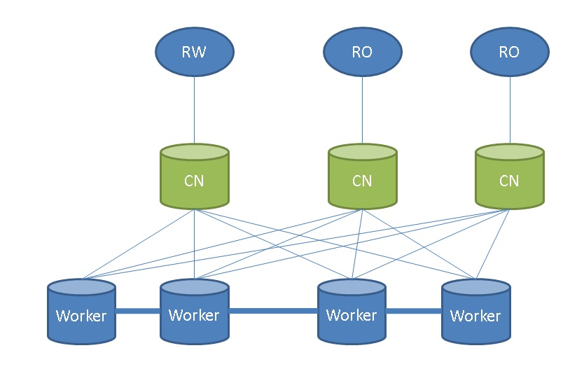
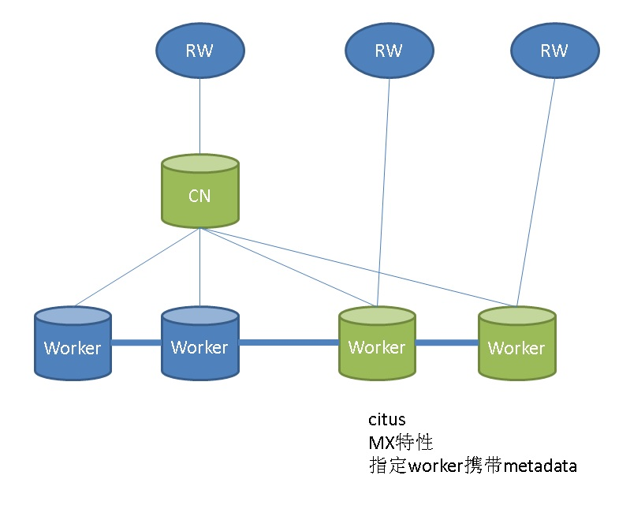
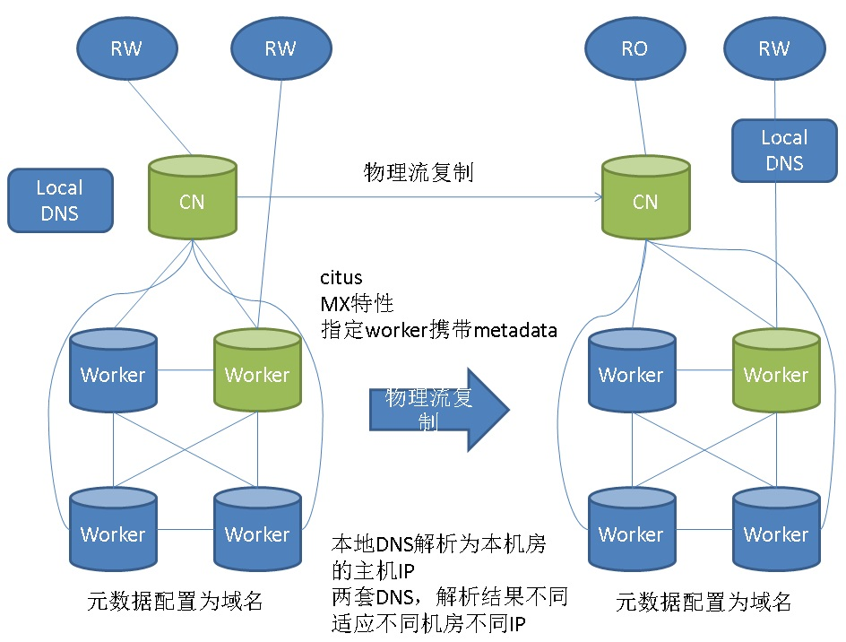

## PostgreSQL sharding : citus 系列1 - 多机部署（含OLTP(TPC-B)测试）  
                                                           
### 作者                                                           
digoal                                                           
                                                           
### 日期                                                           
2018-08-24                                                         
                                                           
### 标签                                                           
PostgreSQL , citus , tpc-b , cn mx   
                                                           
----                                                           
                                                           
## 背景    
[《(TPC-H测试 SF=10) PostgreSQL 11 vs 10 vs Deepgreen》](../201808/20180823_01.md)  测试结果证明PG已经是一个HTAP数据库，可以同时满足OLTP，OLAP的需求。  
  
citus是PG的一个sharding插件，可以把PG变成一个分布式数据库。目前在苏宁有大量的生产应用跑在citus+pg的环境中。  
  
本文是多机部署与简单的测试。  
  
后面的篇章陆续添加:  HA，备份，容灾。最佳实践。性能测试。   
  
期望citus可以具备良好的TP能力，同时AP能力可以像GPDB一样扩展，使得PG如虎添翼。   
  
重点看结果：  
  
OLTP: citus(multi node) vs pg(single)  
  
OLAP: citus(multi node) vs Greenplum(multi node)   
  
  
## 环境  
(ECS 32核，128G内存，2TB 云盘) \* 9  
  
```  
host all all xxx.xxx.xxx.228/32 trust # coordinator node   
host all all xxx.xxx.xxx.224/32 trust # worker(data) node   
host all all xxx.xxx.xxx.230/32 trust # worker(data) node   
host all all xxx.xxx.xxx.231/32 trust # worker(data) node   
host all all xxx.xxx.xxx.225/32 trust # worker(data) node   
host all all xxx.xxx.xxx.227/32 trust # worker(data) node   
host all all xxx.xxx.xxx.232/32 trust # worker(data) node   
host all all xxx.xxx.xxx.226/32 trust # worker(data) node   
host all all xxx.xxx.xxx.229/32 trust # worker(data) node   
```  
  
CentOS 7.x x64  
  
PostgreSQL 10  
  
Citus 7.5  
  
## 一、OS 配置  
[《PostgreSQL 10 + PostGIS + Sharding(pg_pathman) + MySQL(fdw外部表) on ECS 部署指南(适合新用户) - 珍藏级》](../201710/20171018_01.md)    
  
### 1 sysctl    
    
注意某些参数，根据内存大小配置（已说明）    
    
含义详见      
      
[《DBA不可不知的操作系统内核参数》](../201608/20160803_01.md)      
    
```    
cat >>/etc/sysctl.conf  <<EOOF
    
# add by digoal.zhou    
fs.aio-max-nr = 1048576    
fs.file-max = 76724600    
    
# 可选：kernel.core_pattern = /data01/corefiles/core_%e_%u_%t_%s.%p             
# /data01/corefiles 事先建好，权限777，如果是软链接，对应的目录修改为777    
    
kernel.sem = 4096 2147483647 2147483646 512000        
# 信号量, ipcs -l 或 -u 查看，每16个进程一组，每组信号量需要17个信号量。    
    
kernel.shmall = 107374182          
# 所有共享内存段相加大小限制 (建议内存的80%)，单位为页。    
kernel.shmmax = 274877906944       
# 最大单个共享内存段大小 (建议为内存一半), >9.2的版本已大幅降低共享内存的使用，单位为字节。    
kernel.shmmni = 819200             
# 一共能生成多少共享内存段，每个PG数据库集群至少2个共享内存段    
    
net.core.netdev_max_backlog = 10000    
net.core.rmem_default = 262144           
# The default setting of the socket receive buffer in bytes.    
net.core.rmem_max = 4194304              
# The maximum receive socket buffer size in bytes    
net.core.wmem_default = 262144           
# The default setting (in bytes) of the socket send buffer.    
net.core.wmem_max = 4194304              
# The maximum send socket buffer size in bytes.    
net.core.somaxconn = 4096    
net.ipv4.tcp_max_syn_backlog = 4096    
net.ipv4.tcp_keepalive_intvl = 20    
net.ipv4.tcp_keepalive_probes = 3    
net.ipv4.tcp_keepalive_time = 60    
net.ipv4.tcp_mem = 8388608 12582912 16777216    
net.ipv4.tcp_fin_timeout = 5    
net.ipv4.tcp_synack_retries = 2    
net.ipv4.tcp_syncookies = 1        
# 开启SYN Cookies。当出现SYN等待队列溢出时，启用cookie来处理，可防范少量的SYN攻击    
net.ipv4.tcp_timestamps = 1        
# 减少time_wait    
net.ipv4.tcp_tw_recycle = 0        
# 如果=1则开启TCP连接中TIME-WAIT套接字的快速回收，但是NAT环境可能导致连接失败，建议服务端关闭它    
net.ipv4.tcp_tw_reuse = 1          
# 开启重用。允许将TIME-WAIT套接字重新用于新的TCP连接    
net.ipv4.tcp_max_tw_buckets = 262144    
net.ipv4.tcp_rmem = 8192 87380 16777216    
net.ipv4.tcp_wmem = 8192 65536 16777216    
    
net.nf_conntrack_max = 1200000    
net.netfilter.nf_conntrack_max = 1200000    
    
vm.dirty_background_bytes = 409600000           
#  系统脏页到达这个值，系统后台刷脏页调度进程 pdflush（或其他） 自动将(dirty_expire_centisecs/100）秒前的脏页刷到磁盘    
#  默认为10%，大内存机器建议调整为直接指定多少字节    
    
vm.dirty_expire_centisecs = 3000                 
#  比这个值老的脏页，将被刷到磁盘。3000表示30秒。    
vm.dirty_ratio = 95                              
#  如果系统进程刷脏页太慢，使得系统脏页超过内存 95 % 时，则用户进程如果有写磁盘的操作（如fsync, fdatasync等调用），则需要主动把系统脏页刷出。    
#  有效防止用户进程刷脏页，在单机多实例，并且使用CGROUP限制单实例IOPS的情况下非常有效。      
    
vm.dirty_writeback_centisecs = 100                
#  pdflush（或其他）后台刷脏页进程的唤醒间隔， 100表示1秒。    
    
vm.swappiness = 0    
#  不使用交换分区    
    
vm.mmap_min_addr = 65536    
vm.overcommit_memory = 0         
#  在分配内存时，允许少量over malloc, 如果设置为 1, 则认为总是有足够的内存，内存较少的测试环境可以使用 1 .      
    
vm.overcommit_ratio = 90         
#  当overcommit_memory = 2 时，用于参与计算允许指派的内存大小。    
vm.swappiness = 0                
#  关闭交换分区    
vm.zone_reclaim_mode = 0         
# 禁用 numa, 或者在vmlinux中禁止.     
net.ipv4.ip_local_port_range = 40000 65535        
# 本地自动分配的TCP, UDP端口号范围    
fs.nr_open=20480000    
# 单个进程允许打开的文件句柄上限    
    
# 以下参数请注意    
# vm.extra_free_kbytes = 4096000    
# vm.min_free_kbytes = 2097152    
# 如果是小内存机器，以上两个值不建议设置    
# vm.nr_hugepages = 66536        
#  建议shared buffer设置超过64GB时 使用大页，页大小 /proc/meminfo Hugepagesize    
# vm.lowmem_reserve_ratio = 1 1 1    
# 对于内存大于64G时，建议设置，否则建议默认值 256 256 32    
EOOF
```    
    
生效配置    
    
```    
sysctl -p    
```    
      
### 2 配置OS资源限制    
```    
cat >>/etc/security/limits.conf  <<EOOF
    
# nofile超过1048576的话，一定要先将sysctl的fs.nr_open设置为更大的值，并生效后才能继续设置nofile.    
    
* soft    nofile  1024000    
* hard    nofile  1024000    
* soft    nproc   unlimited    
* hard    nproc   unlimited    
* soft    core    unlimited    
* hard    core    unlimited    
* soft    memlock unlimited    
* hard    memlock unlimited    
EOOF
```    
      
最好再关注一下/etc/security/limits.d目录中的文件内容，会覆盖/etc/security/limits.conf的配置。        
      
已有进程的ulimit请查看/proc/pid/limits，例如    
    
```    
Limit                     Soft Limit           Hard Limit           Units         
Max cpu time              unlimited            unlimited            seconds       
Max file size             unlimited            unlimited            bytes         
Max data size             unlimited            unlimited            bytes         
Max stack size            10485760             unlimited            bytes         
Max core file size        0                    unlimited            bytes         
Max resident set          unlimited            unlimited            bytes         
Max processes             11286                11286                processes     
Max open files            1024                 4096                 files         
Max locked memory         65536                65536                bytes         
Max address space         unlimited            unlimited            bytes         
Max file locks            unlimited            unlimited            locks         
Max pending signals       11286                11286                signals       
Max msgqueue size         819200               819200               bytes         
Max nice priority         0                    0                        
Max realtime priority     0                    0                        
Max realtime timeout      unlimited            unlimited            us    
```    
    
如果你要启动其他进程，建议退出SHELL再进一遍，确认ulimit环境配置已生效，再启动。    
    
### 3 配置OS防火墙    
（建议按业务场景设置，这里先清掉）         
      
```    
iptables -F    
```    
      
配置范例：       
       
```    
# 私有网段    
-A INPUT -s 192.168.0.0/16 -j ACCEPT    
-A INPUT -s 10.0.0.0/8 -j ACCEPT    
-A INPUT -s 172.16.0.0/16 -j ACCEPT    
```    
      
### 4 selinux    
如果没有这方面的需求，建议禁用      
      
```    
# vi /etc/sysconfig/selinux     
    
SELINUX=disabled    
SELINUXTYPE=targeted    
```     
    
### 5 关闭透明大页    
grub2代，可以使用rc.local。    
    
```    
chmod +x /etc/rc.d/rc.local    
    
cat >> /etc/rc.local  <<EOOF
     
if test -f /sys/kernel/mm/transparent_hugepage/enabled; then    
   echo never > /sys/kernel/mm/transparent_hugepage/enabled    
fi    
EOOF
```    
    
当场生效：    
    
```    
echo never > /sys/kernel/mm/transparent_hugepage/enabled    
```    
  
## 二、soft 配置  
  
```  
yum clean all  
```  
  
1、安装EPEL    
    
http://fedoraproject.org/wiki/EPEL    
    
    
```    
wget https://dl.fedoraproject.org/pub/epel/epel-release-latest-7.noarch.rpm    
    
rpm -ivh epel-release-latest-7.noarch.rpm     
```    
    
2、安装PostgreSQL yum    
    
https://yum.postgresql.org/repopackages.php  
    
```    
wget https://download.postgresql.org/pub/repos/yum/10/redhat/rhel-7-x86_64/pgdg-centos10-10-2.noarch.rpm  
    
rpm -ivh pgdg-centos10-10-2.noarch.rpm     
  
yum install -y postgresql10*  
```   
  
3、citus  
  
```  
echo "nameserver 8.8.8.8" >>/etc/resolv.conf   
  
curl https://install.citusdata.com/community/rpm.sh | sudo bash  
  
yum install -y citus75_10*  
```  
  
  
## disk  
  
```  
parted -s /dev/vdb mklabel gpt    
parted -s /dev/vdb mkpart primary 1MiB 100%    
  
mkfs.ext4 /dev/vdb1 -m 0 -O extent,uninit_bg -E lazy_itable_init=1 -T largefile -L data01    
  
mkdir /data01    
  
echo "LABEL=data01 /data01     ext4        defaults,noatime,nodiratime,nodelalloc,barrier=0,data=writeback    0 0" >> /etc/fstab    
  
mount -a    
  
  
mkdir /data01/pg10  
chown postgres:postgres /data01/pg10  
```  
  
## 三、env 配置  
  
```  
cat >>/var/lib/pgsql/.bash_profile <<EOOOF
export PS1="\$USER@\`/bin/hostname -s\`-> "    
export PGPORT=1921    
export PGDATA=/data01/pg10/pg_root\$PGPORT    
export LANG=en_US.utf8    
export PGHOME=/usr/pgsql-10  
export LD_LIBRARY_PATH=\$PGHOME/lib:/lib64:/usr/lib64:/usr/local/lib64:/lib:/usr/lib:/usr/local/lib:\$LD_LIBRARY_PATH    
export DATE=\`date +"%Y%m%d%H%M"\`  
export PATH=\$PGHOME/bin:\$PATH:.    
export MANPATH=\$PGHOME/share/man:\$MANPATH    
export PGHOST=\$PGDATA    
export PGUSER=postgres    
export PGDATABASE=postgres    
alias rm='rm -i'    
alias ll='ls -lh'    
unalias vi   
EOOOF
  
  
cat >/var/lib/pgsql/env.sh <<EOOOF
export PS1="\$USER@\`/bin/hostname -s\`-> "    
export PGPORT=1921    
export PGDATA=/data01/pg10/pg_root\$PGPORT    
export LANG=en_US.utf8    
export PGHOME=/usr/pgsql-10  
export LD_LIBRARY_PATH=\$PGHOME/lib:/lib64:/usr/lib64:/usr/local/lib64:/lib:/usr/lib:/usr/local/lib:\$LD_LIBRARY_PATH    
export DATE=\`date +"%Y%m%d%H%M"\`  
export PATH=\$PGHOME/bin:\$PATH:.    
export MANPATH=\$PGHOME/share/man:\$MANPATH    
export PGHOST=\$PGDATA    
export PGUSER=postgres    
export PGDATABASE=postgres    
alias rm='rm -i'    
alias ll='ls -lh'    
unalias vi   
EOOOF
```  
  
## 四、database 配置  
  
### 1 init  
  
```  
su - postgres -c "initdb -D \$PGDATA -U postgres --locale=en_US.UTF8 -E UTF8"  
```  
  
### 2 pg_hba.conf  
  
```  
cat >>/data01/pg10/pg_root1921/pg_hba.conf <<EOF
# citus 相关配置  
host all all xxx.xxx.xxx.228/32 trust  
host all all xxx.xxx.xxx.224/32 trust  
host all all xxx.xxx.xxx.230/32 trust  
host all all xxx.xxx.xxx.231/32 trust  
host all all xxx.xxx.xxx.225/32 trust  
host all all xxx.xxx.xxx.227/32 trust  
host all all xxx.xxx.xxx.232/32 trust  
host all all xxx.xxx.xxx.226/32 trust  
host all all xxx.xxx.xxx.229/32 trust  
EOF
```  
  
### 3 postgresql.auto.conf  
  
```  
cat >/data01/pg10/pg_root1921/postgresql.auto.conf <<EOOOF
listen_addresses = '0.0.0.0'  
port = 1921  
max_connections = 2000  
superuser_reserved_connections = 3  
unix_socket_directories = '/var/run/postgresql, /tmp, .'  
tcp_keepalives_idle = 60  
tcp_keepalives_interval = 10  
tcp_keepalives_count = 10  
shared_buffers = 32GB  
max_prepared_transactions = 2000  
work_mem = 64MB  
maintenance_work_mem = 1GB  
dynamic_shared_memory_type = posix  
shared_preload_libraries = 'citus,pg_stat_statements'  # citus 相关配置  
vacuum_cost_delay = 0  
bgwriter_delay = 10ms  
bgwriter_lru_maxpages = 1000  
bgwriter_lru_multiplier = 10.0  
effective_io_concurrency = 0  
max_worker_processes = 128  
max_parallel_workers_per_gather = 8  
max_parallel_workers = 24  
wal_level = minimal   
synchronous_commit = off  
wal_writer_delay = 10ms  
checkpoint_timeout = 35min  
max_wal_size = 64GB  
min_wal_size = 16GB  
checkpoint_completion_target = 0.1  
max_wal_senders = 0  
random_page_cost = 1.1  
log_destination = 'csvlog'  
logging_collector = on  
log_directory = 'log'  
log_filename = 'postgresql-%a.log'  
log_truncate_on_rotation = on  
log_rotation_age = 1d  
log_rotation_size = 0  
log_checkpoints = on  
log_connections = on  
log_disconnections = on  
log_error_verbosity = verbose  
log_line_prefix = '%m [%p] '  
log_statement = 'ddl'  
log_timezone = 'PRC'  
track_io_timing = on  
track_activity_query_size = 4096  
log_autovacuum_min_duration = 0  
autovacuum_freeze_max_age = 1200000000  
autovacuum_multixact_freeze_max_age = 1400000000  
vacuum_freeze_table_age = 1150000000  
vacuum_multixact_freeze_table_age = 1150000000  
datestyle = 'iso, mdy'  
timezone = 'PRC'  
lc_messages = 'en_US.UTF8'  
lc_monetary = 'en_US.UTF8'  
lc_numeric = 'en_US.UTF8'  
lc_time = 'en_US.UTF8'  
default_text_search_config = 'pg_catalog.english'  
citus.shard_count=128  # citus 相关配置  
EOOOF
```  
  
### 4 start  
```  
su - postgres -c "pg_ctl start"  
```  
  
## 五、citus 插件配置  
  
### 1 extension  
  
```  
su - postgres -c "psql -c 'create extension citus;'"  
```  
  
### 2 add worker (execute only on coordinator node)  
  
```  
su - postgres -c "psql -c \"SELECT * from master_add_node('xxx.xxx.xxx.224', 1921);\""  
su - postgres -c "psql -c \"SELECT * from master_add_node('xxx.xxx.xxx.230', 1921);\""  
su - postgres -c "psql -c \"SELECT * from master_add_node('xxx.xxx.xxx.231', 1921);\""  
su - postgres -c "psql -c \"SELECT * from master_add_node('xxx.xxx.xxx.225', 1921);\""  
su - postgres -c "psql -c \"SELECT * from master_add_node('xxx.xxx.xxx.227', 1921);\""  
su - postgres -c "psql -c \"SELECT * from master_add_node('xxx.xxx.xxx.232', 1921);\""  
su - postgres -c "psql -c \"SELECT * from master_add_node('xxx.xxx.xxx.226', 1921);\""  
su - postgres -c "psql -c \"SELECT * from master_add_node('xxx.xxx.xxx.229', 1921);\""  
  
postgres=# SELECT * FROM master_get_active_worker_nodes();  
   node_name    | node_port   
----------------+-----------  
 xxx.xxx.xxx.227 |      1921  
 xxx.xxx.xxx.229 |      1921  
 xxx.xxx.xxx.231 |      1921  
 xxx.xxx.xxx.225 |      1921  
 xxx.xxx.xxx.224 |      1921  
 xxx.xxx.xxx.226 |      1921  
 xxx.xxx.xxx.230 |      1921  
 xxx.xxx.xxx.232 |      1921  
(8 rows)  
```  
  
## 六、PostgreSQL auto start  
  
```  
chmod +x /etc/rc.d/rc.local  
chmod +x /etc/rc.local  
  
cat >>/etc/rc.local <<EOF
su - postgres -c "pg_ctl start"  
EOF
```  
  
## 七、quick usage (only on coordinator node)  
  
1、初始化1亿数据  
  
```  
pgbench -i -s 1000  
```  
  
2、将tpc-b涉及的4张表转换为sharding表（128个shard）  
  
```  
set citus.shard_count =128;  
  
postgres=# select create_distributed_table('pgbench_accounts','aid');  
NOTICE:  Copying data from local table...  
 create_distributed_table   
--------------------------  
   
(1 row)  
  
  
select create_distributed_table('pgbench_branches','bid');  
select create_distributed_table('pgbench_tellers','tid');  
select create_distributed_table('pgbench_history','aid');  
  
  
postgres=# SELECT pg_size_pretty(citus_total_relation_size('pgbench_accounts'));  
 pg_size_pretty   
----------------  
 15 GB  
(1 row)  
```  
  
## 八、pgbench OLTP(TPC-B) 压测 - shard 8 VS 128 VS 本地库  
  
### 1 shard=128  
1、只读  
  
```  
pgbench -M prepared -v -r -P 1 -c 128 -j 128 -T 120 -S  
  
  
transaction type: <builtin: select only>  
scaling factor: 1000  
query mode: prepared  
number of clients: 128  
number of threads: 128  
duration: 120 s  
number of transactions actually processed: 19658912  
latency average = 0.781 ms  
latency stddev = 1.471 ms  
tps = 163798.762192 (including connections establishing)  
tps = 163838.927010 (excluding connections establishing)  
script statistics:  
 - statement latencies in milliseconds:  
         0.002  \set aid random(1, 100000 * :scale)  
         0.783  SELECT abalance FROM pgbench_accounts WHERE aid = :aid;  
  
  
coordinator CPU (0% IDLE)  
datanode cpu (91% IDLE)  
```  
  
2、读写  
  
```  
pgbench -M prepared -v -r -P 1 -c 128 -j 128 -T 120   
  
transaction type: <builtin: TPC-B (sort of)>  
scaling factor: 1000  
query mode: prepared  
number of clients: 128  
number of threads: 128  
duration: 120 s  
number of transactions actually processed: 1335463  
latency average = 11.502 ms  
latency stddev = 17.679 ms  
tps = 11115.397826 (including connections establishing)  
tps = 11118.596481 (excluding connections establishing)  
script statistics:  
 - statement latencies in milliseconds:  
         0.003  \set aid random(1, 100000 * :scale)  
         0.001  \set bid random(1, 1 * :scale)  
         0.001  \set tid random(1, 10 * :scale)  
         0.001  \set delta random(-5000, 5000)  
         0.089  BEGIN;  
         0.985  UPDATE pgbench_accounts SET abalance = abalance + :delta WHERE aid = :aid;  
         0.522  SELECT abalance FROM pgbench_accounts WHERE aid = :aid;  
         0.979  UPDATE pgbench_tellers SET tbalance = tbalance + :delta WHERE tid = :tid;  
         1.468  UPDATE pgbench_branches SET bbalance = bbalance + :delta WHERE bid = :bid;  
         0.485  INSERT INTO pgbench_history (tid, bid, aid, delta, mtime) VALUES (:tid, :bid, :aid, :delta, CURRENT_TIMESTAMP);  
         6.970  END;  
  
coordinator CPU (36% IDLE)  
datanode cpu (91% IDLE)  
```  
  
### 2 shard=8  
对比shard=8 (刚好每台物理机每个PG实例一个shard)  
  
```  
drop table pgbench_accounts;  
drop table pgbench_branches;  
drop table pgbench_tellers;  
drop table pgbench_history;  
  
pgbench -i -s 1000  
  
set citus.shard_count =8;  
  
select create_distributed_table('pgbench_accounts','aid');  
select create_distributed_table('pgbench_branches','bid');  
select create_distributed_table('pgbench_tellers','tid');  
select create_distributed_table('pgbench_history','aid');  
```  
  
1、只读  
  
```  
pgbench -M prepared -v -r -P 1 -c 128 -j 128 -T 120 -S  
  
transaction type: <builtin: select only>  
scaling factor: 1000  
query mode: prepared  
number of clients: 128  
number of threads: 128  
duration: 120 s  
number of transactions actually processed: 19587094  
latency average = 0.784 ms  
latency stddev = 1.376 ms  
tps = 163197.269113 (including connections establishing)  
tps = 163240.601455 (excluding connections establishing)  
script statistics:  
 - statement latencies in milliseconds:  
         0.002  \set aid random(1, 100000 * :scale)  
         0.786  SELECT abalance FROM pgbench_accounts WHERE aid = :aid;  
  
  
coordinator CPU (0% IDLE)  
datanode cpu (92% IDLE)  
```  
  
2、读写  
  
```  
pgbench -M prepared -v -r -P 1 -c 128 -j 128 -T 120   
  
transaction type: <builtin: TPC-B (sort of)>  
scaling factor: 1000  
query mode: prepared  
number of clients: 128  
number of threads: 128  
duration: 120 s  
number of transactions actually processed: 1542327  
latency average = 9.959 ms  
latency stddev = 13.876 ms  
tps = 12837.180912 (including connections establishing)  
tps = 12840.837336 (excluding connections establishing)  
script statistics:  
 - statement latencies in milliseconds:  
         0.003  \set aid random(1, 100000 * :scale)  
         0.001  \set bid random(1, 1 * :scale)  
         0.001  \set tid random(1, 10 * :scale)  
         0.001  \set delta random(-5000, 5000)  
         0.088  BEGIN;  
         0.982  UPDATE pgbench_accounts SET abalance = abalance + :delta WHERE aid = :aid;  
         0.525  SELECT abalance FROM pgbench_accounts WHERE aid = :aid;  
         0.970  UPDATE pgbench_tellers SET tbalance = tbalance + :delta WHERE tid = :tid;  
         1.266  UPDATE pgbench_branches SET bbalance = bbalance + :delta WHERE bid = :bid;  
         0.485  INSERT INTO pgbench_history (tid, bid, aid, delta, mtime) VALUES (:tid, :bid, :aid, :delta, CURRENT_TIMESTAMP);  
         5.639  END;  
  
coordinator CPU (45% IDLE)  
datanode cpu (91% IDLE)  
```  
  
### 3 本地节点(非citus节点, 跨ECS网络测试)  
  
```  
create database testdb;  
  
pgbench -i -s 1000 testdb  
```  
  
1、只读  
  
```  
pgbench -M prepared -v -r -P 1 -c 128 -j 128 -T 120 -h xxx.xxx.xxx.xxx -S testdb  
  
transaction type: <builtin: select only>  
scaling factor: 1000  
query mode: prepared  
number of clients: 128  
number of threads: 128  
duration: 120 s  
number of transactions actually processed: 58786788  
latency average = 0.261 ms  
latency stddev = 0.077 ms  
tps = 489836.391089 (including connections establishing)  
tps = 490056.663695 (excluding connections establishing)  
script statistics:  
 - statement latencies in milliseconds:  
         0.001  \set aid random(1, 100000 * :scale)  
         0.261  SELECT abalance FROM pgbench_accounts WHERE aid = :aid;  
  
  
CPU (0% IDLE)  
```  
  
2、读写  
  
```  
pgbench -M prepared -v -r -P 1 -c 32 -j 32 -T 120 -h xxx.xxx.xxx.xxx testdb  
  
transaction type: <builtin: TPC-B (sort of)>  
scaling factor: 1000  
query mode: prepared  
number of clients: 128  
number of threads: 128  
duration: 120 s  
number of transactions actually processed: 4695712  
latency average = 3.270 ms  
latency stddev = 1.897 ms  
tps = 39108.352039 (including connections establishing)  
tps = 39120.606464 (excluding connections establishing)  
script statistics:  
 - statement latencies in milliseconds:  
         0.001  \set aid random(1, 100000 * :scale)  
         0.001  \set bid random(1, 1 * :scale)  
         0.001  \set tid random(1, 10 * :scale)  
         0.000  \set delta random(-5000, 5000)  
         0.277  BEGIN;  
         0.378  UPDATE pgbench_accounts SET abalance = abalance + :delta WHERE aid = :aid;  
         0.302  SELECT abalance FROM pgbench_accounts WHERE aid = :aid;  
         0.443  UPDATE pgbench_tellers SET tbalance = tbalance + :delta WHERE tid = :tid;  
         0.711  UPDATE pgbench_branches SET bbalance = bbalance + :delta WHERE bid = :bid;  
         0.564  INSERT INTO pgbench_history (tid, bid, aid, delta, mtime) VALUES (:tid, :bid, :aid, :delta, CURRENT_TIMESTAMP);  
         0.592  END;  
  
  
CPU (0% IDLE)  
```  
  
### OLTP(TPC-B)性能对比小结  
  
环境 | test case | TPS | coordinator 节点CPU资源消耗 | worker节点CPU资源消耗   
---|---|---|---|---  
citus(1+8) shard=8 | 1亿 tpc-b 只读 | 16.3万 | (0% IDLE) | (92% IDLE)  
citus(1+8) shard=128 | 1亿 tpc-b 只读 | 16.4万 | (0% IDLE) | (91% IDLE)  
local PG | 1亿 tpc-b 只读 | 49万 | - | (0% IDLE)  
citus(1+8) shard=8 | 1亿 tpc-b 读写 | 1.28万 | (45% IDLE) | (91% IDLE)  
citus(1+8) shard=128 | 1亿 tpc-b 读写 | 1.11万 | (36% IDLE) | (91% IDLE)  
local PG | 1亿 tpc-b 读写 | 3.98万 | - | (0% IDLE)  
  
## 九、简单AP测试  
主要测试AP能力，以及执行计划。  
  
1、建表，写入25.6亿数据  
  
```  
create table test (id int, c1 int, c2 int, c3 int, info text, crt_time timestamp);  
select create_distributed_table('test','id');  
insert into test select id, random()*100, random()*100, random()*100, md5(random()::text), clock_timestamp() from generate_series(1,10000000) t(id);  
insert into test select * from test;  
......  
insert into test select * from test;  
  
  
postgres=# select pg_size_pretty(citus_relation_size('test'));  
 pg_size_pretty   
----------------  
 222 GB  
(1 row)  
  
Time: 44.249 ms  
```  
  
2、执行计划  
  
limit 下推  
  
```  
postgres=# explain select * from test limit 1;  
                                             QUERY PLAN                                                
-----------------------------------------------------------------------------------------------------  
 Limit  (cost=0.00..0.00 rows=0 width=0)  
   ->  Custom Scan (Citus Real-Time)  (cost=0.00..0.00 rows=0 width=0)  
         Task Count: 128  
         Tasks Shown: One of 128  
         ->  Task  
               Node: host=172.24.211.224 port=1921 dbname=postgres  
               ->  Limit  (cost=0.00..0.02 rows=1 width=57)  
                     ->  Seq Scan on test_103068 test  (cost=0.00..428722.72 rows=20067872 width=57)  
(8 rows)  
```  
  
优化器识别分区键，同时where条件下推  
  
```  
postgres=# explain select * from test where id=1;  
                                            QUERY PLAN                                              
--------------------------------------------------------------------------------------------------  
 Custom Scan (Citus Router)  (cost=0.00..0.00 rows=0 width=0)  
   Task Count: 1  
   Tasks Shown: All  
   ->  Task  
         Node: host=172.24.211.232 port=1921 dbname=postgres  
         ->  Gather  (cost=1000.00..274755.04 rows=226 width=57)  
               Workers Planned: 5  
               ->  Parallel Seq Scan on test_103075 test  (cost=0.00..273732.44 rows=45 width=57)  
                     Filter: (id = 1)  
(9 rows)  
```  
  
目标端依旧可以使用并行，25.6亿记录，COUNT大概4.2秒。  
  
```  
postgres=# explain (analyze,verbose,timing,costs,buffers) select count(*) from test ;  
                                                                                   QUERY PLAN                                                                                      
---------------------------------------------------------------------------------------------------------------------------------------------------------------------------------  
 Aggregate  (cost=0.00..0.00 rows=0 width=0) (actual time=4153.954..4153.955 rows=1 loops=1)  
   Output: COALESCE((pg_catalog.sum(remote_scan.count))::bigint, '0'::bigint)  
   ->  Custom Scan (Citus Real-Time)  (cost=0.00..0.00 rows=0 width=0) (actual time=4153.893..4153.911 rows=128 loops=1)  
         Output: remote_scan.count  
         Task Count: 128  
         Tasks Shown: One of 128  
         ->  Task  
               Node: host=172.24.211.224 port=1921 dbname=postgres  
               ->  Finalize Aggregate  (cost=273906.25..273906.26 rows=1 width=8) (actual time=1149.156..1149.156 rows=1 loops=1)  
                     Output: count(*)  
                     Buffers: shared hit=228044  
                     ->  Gather  (cost=273905.73..273906.24 rows=5 width=8) (actual time=1149.078..1194.615 rows=6 loops=1)  
                           Output: (PARTIAL count(*))  
                           Workers Planned: 5  
                           Workers Launched: 5  
                           Buffers: shared hit=228044  
                           ->  Partial Aggregate  (cost=272905.73..272905.74 rows=1 width=8) (actual time=1145.740..1145.740 rows=1 loops=6)  
                                 Output: PARTIAL count(*)  
                                 Buffers: shared hit=228044  
                                 Worker 0: actual time=1144.474..1144.474 rows=1 loops=1  
                                   Buffers: shared hit=38016  
                                 Worker 1: actual time=1144.908..1144.909 rows=1 loops=1  
                                   Buffers: shared hit=38102  
                                 Worker 2: actual time=1145.096..1145.096 rows=1 loops=1  
                                   Buffers: shared hit=37952  
                                 Worker 3: actual time=1145.389..1145.389 rows=1 loops=1  
                                   Buffers: shared hit=38037  
                                 Worker 4: actual time=1145.818..1145.818 rows=1 loops=1  
                                   Buffers: shared hit=38199  
                                 ->  Parallel Seq Scan on public.test_103068 test  (cost=0.00..263933.38 rows=3588938 width=0) (actual time=0.016..747.409 rows=3344640 loops=6)  
                                       Buffers: shared hit=228044  
                                       Worker 0: actual time=0.015..747.436 rows=3345408 loops=1  
                                         Buffers: shared hit=38016  
                                       Worker 1: actual time=0.015..747.257 rows=3352944 loops=1  
                                         Buffers: shared hit=38102  
                                       Worker 2: actual time=0.016..748.296 rows=3339776 loops=1  
                                         Buffers: shared hit=37952  
                                       Worker 3: actual time=0.016..747.316 rows=3347256 loops=1  
                                         Buffers: shared hit=38037  
                                       Worker 4: actual time=0.017..747.354 rows=3361512 loops=1  
                                         Buffers: shared hit=38199  
                   Planning time: 0.327 ms  
                   Execution time: 1194.669 ms  
 Planning time: 2.564 ms  
 Execution time: 4154.213 ms  
(45 rows)  
```  
  
非分布键的GROUP BY，会分成两个阶段执行，类似Greenplum  
  
[《HybridDB PostgreSQL "Sort、Group、distinct 聚合、JOIN" 不惧怕数据倾斜的黑科技和原理 - 多阶段聚合》](../201711/20171123_01.md)    
  
多阶段聚合的原理可参考:  
  
[《PostgreSQL Oracle 兼容性之 - 自定义并行聚合函数 PARALLEL_ENABLE AGGREGATE》](../201803/20180312_03.md)    
  
[《Postgres-XC customized aggregate introduction》](../201305/20130502_01.md)    
  
[《PostgreSQL aggregate function customize》](../201212/20121218_02.md)    
  
```  
postgres=# explain select count(*) from test group by c1;  
                                                          QUERY PLAN                                                            
------------------------------------------------------------------------------------------------------------------------------  
 HashAggregate  (cost=0.00..0.00 rows=0 width=0)  
   Group Key: remote_scan.worker_column_2  
   ->  Custom Scan (Citus Real-Time)  (cost=0.00..0.00 rows=0 width=0)  
         Task Count: 128  
         Tasks Shown: One of 128  
         ->  Task  
               Node: host=172.24.211.224 port=1921 dbname=postgres  
               ->  Finalize GroupAggregate  (cost=289321.80..289326.60 rows=101 width=12)  
                     Group Key: c1  
                     ->  Sort  (cost=289321.80..289323.06 rows=505 width=12)  
                           Sort Key: c1  
                           ->  Gather  (cost=289247.61..289299.12 rows=505 width=12)  
                                 Workers Planned: 5  
                                 ->  Partial HashAggregate  (cost=288247.61..288248.62 rows=101 width=12)  
                                       Group Key: c1  
                                       ->  Parallel Seq Scan on test_103068 test  (cost=0.00..268179.74 rows=4013574 width=4)  
(16 rows)  
```  
  
非分布键的分组聚合，25.6亿数据，耗时约7秒  
  
```  
postgres=# select c1,count(*) from test group by c1 order by count(*) desc limit 10;  
 c1 |  count     
----+----------  
 93 | 25761280  
 63 | 25748992  
 86 | 25743104  
 55 | 25741056  
 36 | 25730048  
 33 | 25724928  
 53 | 25722880  
 84 | 25701632  
 81 | 25699072  
 57 | 25692928  
(10 rows)  
  
Time: 6948.230 ms (00:06.948)  
```  
  
```  
postgres=# select count(*) from test;  
   count      
------------  
 2560000000  
(1 row)  
  
Time: 3806.089 ms (00:03.806)  
```  
  
每秒的扫描速度约58.4GB  
  
```  
postgres=# select 222/3.8  
postgres-# ;  
      ?column?         
---------------------  
 58.4210526315789474  
(1 row)  
```  
  
  
TPC-H 后面再测试。  
  
  
主要瓶颈，IO（SSD云盘的最大问题还是读写带宽上，大概只有200多MB/s，本地SSD盘可以达到4GB/s）    
    
## OLTP 优化  
  
2阶段，单条SQL涉及9个SHARD.  
  
```  
su - postgres -c "echo \"alter system set citus.multi_shard_commit_protocol='2pc'; select pg_reload_conf();\"|psql -f -"  
  
transaction type: ./test.sql  
scaling factor: 1  
query mode: prepared  
number of clients: 128  
number of threads: 128  
duration: 120 s  
number of transactions actually processed: 1436979  
latency average = 10.691 ms  
latency stddev = 10.136 ms  
tps = 11954.269803 (including connections establishing)  
tps = 11957.251498 (excluding connections establishing)  
script statistics:  
 - statement latencies in milliseconds:  
         0.002  \set id random(1,1000000000)  
        10.691  insert into test values (:id),(:id+1),(:id+2),(:id+3),(:id+4),(:id+5),(:id+6),(:id+7),(:id+8);  
```  
  
1阶段(但是最后还是要等所有SHARD操作完成后再commit，只不过不是2PC而已，所以可以看到worker上很多idle in transaction的状态)  
  
```  
su - postgres -c "echo \"alter system set citus.multi_shard_commit_protocol='1pc'; select pg_reload_conf();\"|psql -f -"  
```  
  
1阶段，单条SQL涉及9个shard  
  
```  
transaction type: ./test.sql  
scaling factor: 1  
query mode: prepared  
number of clients: 128  
number of threads: 128  
duration: 120 s  
number of transactions actually processed: 2449586  
latency average = 6.269 ms  
latency stddev = 4.968 ms  
tps = 20407.507503 (including connections establishing)  
tps = 20412.584813 (excluding connections establishing)  
script statistics:  
 - statement latencies in milliseconds:  
         0.002  \set id random(1,1000000000)  
         6.269  insert into test values (:id),(:id+1),(:id+2),(:id+3),(:id+4),(:id+5),(:id+6),(:id+7),(:id+8);  
```  
  
  
  
1阶段，涉及2个shard。单个QUERY涉及的SHARD越多，效率越低。  
  
```  
transaction type: ./test.sql  
scaling factor: 1  
query mode: prepared  
number of clients: 128  
number of threads: 128  
duration: 120 s  
number of transactions actually processed: 7894772  
latency average = 1.945 ms  
latency stddev = 2.312 ms  
tps = 65769.534466 (including connections establishing)  
tps = 65784.907845 (excluding connections establishing)  
script statistics:  
 - statement latencies in milliseconds:  
         0.002  \set id random(1,1000000000)  
         1.946  insert into test values (:id),(:id),(:id),(:id),(:id),(:id),(:id),(:id),(:id+8);  
```  
  
  
1阶段，涉及1个shard。效率最高。(如果客户端能够拿到分布算法，分布键，键值，并按SHARD将多次写入封装在一条SQL中，可以轻松达到几百万行/s的写入性能。)    
  
```  
transaction type: ./test.sql  
scaling factor: 1  
query mode: prepared  
number of clients: 128  
number of threads: 128  
duration: 120 s  
number of transactions actually processed: 22410273  
latency average = 0.685 ms  
latency stddev = 8.487 ms  
tps = 186717.144028 (including connections establishing)  
tps = 186761.579753 (excluding connections establishing)  
script statistics:  
 - statement latencies in milliseconds:  
         0.002  \set id random(1,1000000000)  
         0.688  insert into test values (:id),(:id),(:id),(:id),(:id),(:id),(:id),(:id),(:id);  
```  
  
单个QUERY，单个shard，单条记录。  
  
```  
transaction type: ./test.sql  
scaling factor: 1  
query mode: prepared  
number of clients: 128  
number of threads: 128  
duration: 120 s  
number of transactions actually processed: 29441284  
latency average = 0.522 ms  
latency stddev = 0.762 ms  
tps = 245299.791043 (including connections establishing)  
tps = 245362.383416 (excluding connections establishing)  
script statistics:  
 - statement latencies in milliseconds:  
         0.001  \set id random(1,1000000000)  
         0.522  insert into test values (:id);  
```  
  
### OLTP 优化小结  
  
1、尽量不要使用运算符(包括函数)，建议使用常量。  
  
因为所有运算符(包括函数)的计算都在coordinator节点完成。  
  
2、不需要2PC的话尽量不要使用。  
  
```  
su - postgres -c "echo \"alter system set citus.multi_shard_commit_protocol='1pc'; select pg_reload_conf();\"|psql -f -"  
```  
  
3、批量使用单条SQL批量操作（多SQL没有意义）。如果客户端能够拿到分布算法，分布键，键值，并按SHARD将多次写入封装在一条SQL中，可以轻松达到几百万行/s的写入性能。     
  
### CN MX : OLTP 读、写能力扩展
  
1、读能力扩展，增加coordinator节点。通过物理流复制 可以复制若干个COORDINATOR 节点(TP场景worker节点的资源使用率较低，coordinator节点可以在每个worker节点上放一个。)，只读QUERY可以分摊到不同的coordinator节点执行。  
  
2、写能力扩展，增加coordinator节点。可以使用mx功能(隐藏功能，实际上读能力也可以使用这种方法扩展)。  
  
CN节点执行  
  
```  
su - postgres -c "echo \"alter system set citus.replication_model='streaming'; select pg_reload_conf();\"|psql -f -"  
```  
  
添加要同步元数据的WORKER  
  
```  
select * from master_add_node('xxxxx.224',1921);  
  
select * from master_add_node('xxxxx.230',1921);  
```  
  
开启同步到元数据。  
  
```  
select start_metadata_sync_to_node('xxxxx.224',1921);  
select start_metadata_sync_to_node('xxxxx.230',1921);  
```  
  
包含元数据的节点，hasmetadata标记位TRUE。  
  
```  
postgres=# select * from pg_dist_node;  
 nodeid | groupid |    nodename    | nodeport | noderack | hasmetadata | isactive | noderole | nodecluster   
--------+---------+----------------+----------+----------+-------------+----------+----------+-------------  
      3 |       3 | xxxxx.231 |     1921 | default  | f           | t        | primary  | default  
      4 |       4 | xxxxx.225 |     1921 | default  | f           | t        | primary  | default  
      5 |       5 | xxxxx.227 |     1921 | default  | f           | t        | primary  | default  
      6 |       6 | xxxxx.232 |     1921 | default  | f           | t        | primary  | default  
      7 |       7 | xxxxx.226 |     1921 | default  | f           | t        | primary  | default  
      8 |       8 | xxxxx.229 |     1921 | default  | f           | t        | primary  | default  
      2 |       2 | xxxxx.230 |     1921 | default  | t           | t        | primary  | default  
      1 |       1 | xxxxx.224 |     1921 | default  | t           | t        | primary  | default  
(8 rows)  
```  
  
仅针对开启同步后，创建的SHARD表，在worker节点才有元数据，之前已经创建的SHARD表，不会自动把元数据同步过去。  
  
对应的worker可以当成cn来使用。  
  
```  
postgres=# explain select * from test5;  
                                    QUERY PLAN                                       
-----------------------------------------------------------------------------------  
 Custom Scan (Citus Real-Time)  (cost=0.00..0.00 rows=0 width=0)  
   Task Count: 128  
   Tasks Shown: One of 128  
   ->  Task  
         Node: host=172.24.211.224 port=1921 dbname=postgres  
         ->  Seq Scan on test5_103740 test5  (cost=0.00..22.70 rows=1270 width=36)  
(6 rows)  
  
postgres=# explain select * from test6;  
                                    QUERY PLAN                                       
-----------------------------------------------------------------------------------  
 Custom Scan (Citus Real-Time)  (cost=0.00..0.00 rows=0 width=0)  
   Task Count: 128  
   Tasks Shown: One of 128  
   ->  Task  
         Node: host=172.24.211.224 port=1921 dbname=postgres  
         ->  Seq Scan on test6_103868 test6  (cost=0.00..22.70 rows=1270 width=36)  
(6 rows)  
```  
   
### 启用CN MX后，1+8 的集群，读写能力如何？
(首先启用MX后，实际上所有节点都可以作为写节点，可用性大幅度提升。另一方面，只要做好每个节点的HA，全局视角的可用性可靠性也可以有保障。)  
  
#### 1 TPC-B (select only)
```
pgbench -M prepared -n -r -P 1 -c 96 -j 96 -T 120 -S

CN tps: 127378  

WORKERs tps: 58473+55709+63161+63510+62721+66301+59628+65486

总 tps: 622367  

worker平均剩余cpu 2.5%
```
  
#### 2 TPC-B (read write)
```
CN: pgbench -M prepared -n -r -P 1 -c 96 -j 96 -T 120 
WORKER: pgbench -M prepared -n -r -P 1 -c 48 -j 48 -T 120 

CN tps: 18207

WORKERs tps: 7467+7368+7287+7391+7316+7442+7661+7440

总 tps: 77579

worker平均剩余cpu 14%  
``` 
   
## citus 读写能力扩展架构
1、cn流复制，扩展读能力。   
  
  
  
2、citus MX特性，指定worker节点携带metadata，扩展读写能力。  
  
  
  
3、流复制，异地容灾。使用不同的dns，解决两套集群IP不同的问题。扩展容灾能力。   
  
  
  
## citus reference  
  
https://docs.citusdata.com/en/v7.5/develop/api.html  
  
配合haproxy,lvs，citus mx功能(前面已提到如何配置)，可以实现对业务完全透明的读写负载均衡。  
  
https://severalnines.com/blog/postgresql-load-balancing-using-haproxy-keepalived   
  
http://docs.citusdata.com/en/stable/cloud/additional_mx.html   
  
配合jdbc或libpq的mulit-host功能，citus mx功能，可以实现对业务完全透明的读写负载均衡。 
  
[《PostgreSQL jdbc multi-host 配置与简单HA、Load Balance实现》](../201806/20180614_02.md)  
    
[《PostgreSQL libpq multi-host 配置与简单HA实现》](../201806/20180614_01.md)  
  
[《PostgreSQL 10.0 preview 功能增强 - libpq支持多主机连接(failover,LB)让数据库HA和应用配合更紧密》](../201704/20170420_01.md)  
  
  
<a rel="nofollow" href="http://info.flagcounter.com/h9V1"  ></a>  
  
  
  
  
  
  
## [digoal's 大量PostgreSQL文章入口](https://github.com/digoal/blog/blob/master/README.md "22709685feb7cab07d30f30387f0a9ae")
  
