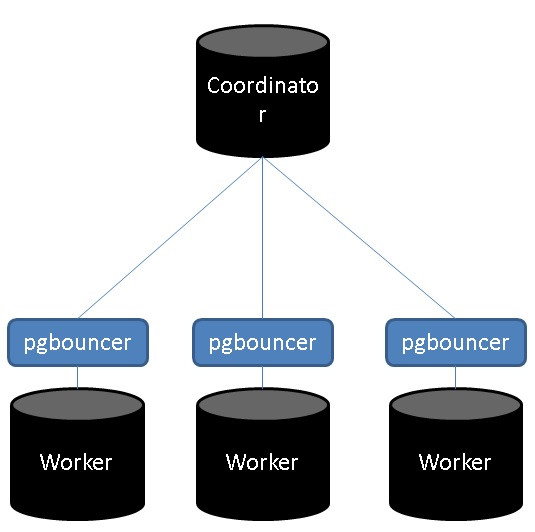

## PostgreSQL sharding : citus 系列5 - worker节点网络优化     
                                                               
### 作者                                                               
digoal                                                               
                                                               
### 日期                                                               
2018-09-05                                                             
                                                               
### 标签                                                               
PostgreSQL , citus , pgbouncer , 网络优化 , worker节点       
                                                               
----                                                               
                                                               
## 背景        
citus 节点间的网络需求：  
  
1、cn节点访问所有worker节点。oltp业务的访问较频繁。  
  
2、重分布数据时，worker节点间相互访问。访问频度不大，OLAP业务常见，一旦有可能数据交换吞吐较大。  
  
citus的cn节点连worker节点为有两种模式，  
  
一种为事务级保持连接模式（每条SQL发起时建立连接，SQL结束后释放连接(除非在事务中，否则SQL结束立即释放连接)。），    
  
另一种为会话级保持连接模式（会话发起时建立连接，会话结束后释放连接。）。    
  
1、跑OLAP类的SQL时，使用的是第一种即时连接模式（OLAP场景并发不高，建立连接带来的额外开销不明显）  
  
可以在worker节点打开参数进行跟踪  
  
```  
postgres=# show log_connections ;  
 log_connections   
-----------------  
 on  
(1 row)  
  
postgres=# show log_disconnections ;  
 log_disconnections   
--------------------  
 on  
(1 row)  
```  
  
例子，  
  
以下两条SQL均为即时短连接模式(```Custom Scan (Citus Task-Tracker)  Custom Scan (Citus Real-Time)```)。  
  
```  
postgres=# set citus.task_executor_type =task;  
ERROR:  invalid value for parameter "citus.task_executor_type": "task"  
HINT:  Available values: real-time, task-tracker.  
  
  
postgres=# set citus.task_executor_type ='task-tracker';  
SET  
postgres=# explain select count(*) from pgbench_accounts ;  
                                                     QUERY PLAN                                                        
---------------------------------------------------------------------------------------------------------------------  
 Aggregate  (cost=0.00..0.00 rows=0 width=0)  
   ->  Custom Scan (Citus Task-Tracker)  (cost=0.00..0.00 rows=0 width=0)  
         Task Count: 128  
         Tasks Shown: One of 128  
         ->  Task  
               Node: host=172.24.211.224 port=1921 dbname=postgres  
               ->  Aggregate  (cost=231.85..231.86 rows=1 width=8)  
                     ->  Seq Scan on pgbench_accounts_106812 pgbench_accounts  (cost=0.00..212.48 rows=7748 width=0)  
(8 rows)  
  
  
postgres=# set citus.task_executor_type ='real-time';  
  
postgres=# explain select count(*) from pgbench_accounts ;  
                                                     QUERY PLAN                                                        
---------------------------------------------------------------------------------------------------------------------  
 Aggregate  (cost=0.00..0.00 rows=0 width=0)  
   ->  Custom Scan (Citus Real-Time)  (cost=0.00..0.00 rows=0 width=0)  
         Task Count: 128  
         Tasks Shown: One of 128  
         ->  Task  
               Node: host=172.24.211.224 port=1921 dbname=postgres  
               ->  Aggregate  (cost=231.85..231.86 rows=1 width=8)  
                     ->  Seq Scan on pgbench_accounts_106812 pgbench_accounts  (cost=0.00..212.48 rows=7748 width=0)  
(8 rows)  
```  
  
2、跑OLTP查询时（通常并发很高，前端有连接池（保持会话）），为会话级保持连接模式（```Custom Scan (Citus Router)```）。  
  
以下SQL为长连接模式（不会立即释放，而是等会再释放，以降低高并发时连接带来的开销）  
  
```  
postgres=# explain select * from pgbench_accounts where aid=5;  
                                                                QUERY PLAN                                                                  
------------------------------------------------------------------------------------------------------------------------------------------  
 Custom Scan (Citus Router)  (cost=0.00..0.00 rows=0 width=0)  
   Task Count: 1  
   Tasks Shown: All  
   ->  Task  
         Node: host=172.24.211.224 port=1921 dbname=postgres  
         ->  Index Scan using pgbench_accounts_pkey_106836 on pgbench_accounts_106836 pgbench_accounts  (cost=0.28..2.50 rows=1 width=97)  
               Index Cond: (aid = 5)  
(7 rows)  
```  
  
看以上两种场景，CITUS应该说设计得已经很不错了。既能满足TP也能满足AP。  
  
但是前面也说了，连接保持是在事务或会话层面的，如果查询量大，或者用户使用了短连接，建立连接的开销就会很凸显。  
  
```  
newdb=> \c postgres postgres  
You are now connected to database "postgres" as user "postgres".  
  
postgres=# select * from pgbench_accounts where aid=1;  
 aid | bid | abalance |                                        filler                                          
-----+-----+----------+--------------------------------------------------------------------------------------  
   1 |   1 |     7214 |                                                                                       
(1 row)  
  
Time: 11.264 ms  -- 包括新建连接的开销  
  
postgres=# select * from pgbench_accounts where aid=1;  
 aid | bid | abalance |                                        filler                                          
-----+-----+----------+--------------------------------------------------------------------------------------  
   1 |   1 |     7214 |                                                                                       
(1 row)  
  
Time: 0.905 ms  -- 已建立连接  
```  
  
## 使用pgbouncer，解决建立连接的开销  
  
  
在worker节点上，部署pgbouncer，所有与worker节点建立的连接都通过pgbouncer连接池，以此来保持住连接，降低worker节点频繁新建连接的开销。  
  
部署方法  
  
### 1、所有worker节点  
  
pgbouncer  
  
```  
yum install -y pgbouncer  
```  
  
配置  
  
```  
vi /etc/pgbouncer/pgb.ini  
  
[databases]  
newdb = host=/tmp dbname=newdb port=1921 user=digoal pool_size=128 reserve_pool=10  
[pgbouncer]  
logfile = /var/log/pgbouncer/pgbouncer.log  
pidfile = /var/run/pgbouncer/pgbouncer.pid  
listen_addr = 0.0.0.0  
listen_port = 8001  
auth_type = any  
auth_file = /etc/pgbouncer/userlist.txt  
pool_mode = session  
server_reset_query = DISCARD ALL  
max_client_conn = 5000  
default_pool_size = 128  
; 最大不要超过4倍CPU数  
```  
  
启动  
  
```  
pgbouncer -d -u pgbouncer /etc/pgbouncer/pgb.ini  
```  
  
在一个citus集群中，可以同时存在直连worker或者通过pgbouncer连接worker。  
  
不同的database可以有不同的配置。  
  
以下例子，新建一个database，使用pgbouncer连接worker.  
  
  
### 2、所有节点（包括cn, worker）  
新建数据库，插件  
  
```  
su - postgres  
psql -c "create role digoal login;"  
psql -c "create database newdb;"  
psql -c "grant all on database newdb to digoal;"  
psql -U postgres newdb -c "create extension citus;"  
```  
  
### cn节点  
将worker添加到集群配置，使用pgbouncer的连接端口  
  
```  
su - postgres -c "psql -U postgres newdb -c \"SELECT * from master_add_node('xxx.xxx.xxx.224', 8001);\""      
su - postgres -c "psql -U postgres newdb -c \"SELECT * from master_add_node('xxx.xxx.xxx.230', 8001);\""      
su - postgres -c "psql -U postgres newdb -c \"SELECT * from master_add_node('xxx.xxx.xxx.231', 8001);\""      
su - postgres -c "psql -U postgres newdb -c \"SELECT * from master_add_node('xxx.xxx.xxx.225', 8001);\""      
su - postgres -c "psql -U postgres newdb -c \"SELECT * from master_add_node('xxx.xxx.xxx.227', 8001);\""      
su - postgres -c "psql -U postgres newdb -c \"SELECT * from master_add_node('xxx.xxx.xxx.232', 8001);\""      
su - postgres -c "psql -U postgres newdb -c \"SELECT * from master_add_node('xxx.xxx.xxx.226', 8001);\""      
su - postgres -c "psql -U postgres newdb -c \"SELECT * from master_add_node('xxx.xxx.xxx.229', 8001);\""     
```  
  
MX配置，同样，将worker节点添加到元数据同步中。  
  
```  
psql newdb postgres  
```  
  
```    
select * from master_add_node('xxx.xxx.xxx.224',8001);    
select * from master_add_node('xxx.xxx.xxx.230',8001);    
```    
    
开启同步到元数据。    
    
```    
select start_metadata_sync_to_node('xxx.xxx.xxx.224',8001);    
select start_metadata_sync_to_node('xxx.xxx.xxx.230',8001);    
```    
  
### 测试  
1、tpc-b 长连接测试   
  
```  
pgbench -i -s -U digoal newdb  
```  
  
```  
psql -U digoal newdb  
  
select create_distributed_table('pgbench_accounts','aid');  
select create_distributed_table('pgbench_branches','bid');    
select create_distributed_table('pgbench_tellers','tid');    
select create_distributed_table('pgbench_history','aid');  
```  
  
```  
pgbench -M prepared -v -r -P 1 -c 64 -j 64 -T 120 -U digoal newdb -S  
```  
  
性能与不使用pgbouncer差不多，因为使用了长连接测试简单SQL（本身citus就使用了会话级连接保持，没有短连接问题）。  
  
## citus第一次QUERY的隐藏耗时  
  
在一个新建的会话中，第一次查询总是需要需要耗费更多的时间（如果没有建立连接，那么包括建立连接的时间。即使已建立连接，也需要耗费额外的一些时间）（具体原因可以跟踪分析一下code）。    
  
以下使用的是pgbouncer连接worker，因此第一次QUERY不包含建立连接的时间。  
  
```  
newdb=> \q  
postgres@digoal-citus-gpdb-test001-> psql newdb digoal  
psql (10.5)  
Type "help" for help.  
  
\timing  
  
newdb=> select * from pgbench_accounts where aid=5;  
 aid | bid | abalance |                                        filler                                          
-----+-----+----------+--------------------------------------------------------------------------------------  
   5 |   1 |        0 |                                                                                       
(1 row)  
  
Time: 6.016 ms  -- 不包括新建连接（已使用pgbouncer建立），但是也多了几毫秒  
-- 但是相比未使用pgbouncer，已经降低了5毫秒左右的延迟。
  
newdb=> select * from pgbench_accounts where aid=5;  
 aid | bid | abalance |                                        filler                                          
-----+-----+----------+--------------------------------------------------------------------------------------  
   5 |   1 |        0 |                                                                                       
(1 row)  
  
Time: 0.989 ms  
```  
  
多出的几毫秒，我们社区的小伙伴邓彪、王健给出了原因如下，很多地方需要检查安装的citus版本与citus.control控制文件的版本是否兼容(比如加载分布式TABLE的RELCACHE时，第一次访问就是这个问题)，不兼容报错：   
  
详见代码  
  
https://github.com/citusdata/citus/blob/3fa04d8f2c8f27b1377fe4c1468ee47358117e3c/src/backend/distributed/utils/metadata_cache.c   
  
```
/*
 * CheckAvailableVersion compares CITUS_EXTENSIONVERSION and the currently
 * available version from the citus.control file. If they are not compatible,
 * this function logs an error with the specified elevel and returns false,
 * otherwise it returns true.
 */
bool
CheckAvailableVersion(int elevel)
{
	char *availableVersion = NULL;

	if (!EnableVersionChecks)
	{
		return true;
	}

	availableVersion = AvailableExtensionVersion();

	if (!MajorVersionsCompatible(availableVersion, CITUS_EXTENSIONVERSION))
	{
		ereport(elevel, (errmsg("loaded Citus library version differs from latest "
								"available extension version"),
						 errdetail("Loaded library requires %s, but the latest control "
								   "file specifies %s.", CITUS_MAJORVERSION,
								   availableVersion),
						 errhint("Restart the database to load the latest Citus "
								 "library.")));
		return false;
	}

	return true;
}
 

/*
 * AvailableExtensionVersion returns the Citus version from citus.control file. It also
 * saves the result, thus consecutive calls to CitusExtensionAvailableVersion will
 * not read the citus.control file again.
 */
static char *
AvailableExtensionVersion(void)
{
	ReturnSetInfo *extensionsResultSet = NULL;
	TupleTableSlot *tupleTableSlot = NULL;
	FunctionCallInfoData *fcinfo = NULL;
	FmgrInfo *flinfo = NULL;
	int argumentCount = 0;
	EState *estate = NULL;

	bool hasTuple = false;
	bool goForward = true;
	bool doCopy = false;
	char *availableExtensionVersion;

	InitializeCaches();

	estate = CreateExecutorState();
	extensionsResultSet = makeNode(ReturnSetInfo);
	extensionsResultSet->econtext = GetPerTupleExprContext(estate);
	extensionsResultSet->allowedModes = SFRM_Materialize;

	fcinfo = palloc0(sizeof(FunctionCallInfoData));
	flinfo = palloc0(sizeof(FmgrInfo));

	fmgr_info(F_PG_AVAILABLE_EXTENSIONS, flinfo);
	InitFunctionCallInfoData(*fcinfo, flinfo, argumentCount, InvalidOid, NULL,
							 (Node *) extensionsResultSet);

	/* pg_available_extensions returns result set containing all available extensions */
	(*pg_available_extensions)(fcinfo);

	tupleTableSlot = MakeSingleTupleTableSlot(extensionsResultSet->setDesc);
	hasTuple = tuplestore_gettupleslot(extensionsResultSet->setResult, goForward, doCopy,
									   tupleTableSlot);
	while (hasTuple)
	{
		Datum extensionNameDatum = 0;
		char *extensionName = NULL;
		bool isNull = false;

		extensionNameDatum = slot_getattr(tupleTableSlot, 1, &isNull);
		extensionName = NameStr(*DatumGetName(extensionNameDatum));
		if (strcmp(extensionName, "citus") == 0)
		{
			MemoryContext oldMemoryContext = NULL;
			Datum availableVersion = slot_getattr(tupleTableSlot, 2, &isNull);

			/* we will cache the result of citus version to prevent catalog access */
			oldMemoryContext = MemoryContextSwitchTo(CacheMemoryContext);

			availableExtensionVersion = text_to_cstring(DatumGetTextPP(availableVersion));

			MemoryContextSwitchTo(oldMemoryContext);

			ExecClearTuple(tupleTableSlot);
			ExecDropSingleTupleTableSlot(tupleTableSlot);

			return availableExtensionVersion;
		}

		ExecClearTuple(tupleTableSlot);
		hasTuple = tuplestore_gettupleslot(extensionsResultSet->setResult, goForward,
										   doCopy, tupleTableSlot);
	}

	ExecDropSingleTupleTableSlot(tupleTableSlot);

	ereport(ERROR, (errcode(ERRCODE_OBJECT_NOT_IN_PREREQUISITE_STATE),
					errmsg("citus extension is not found")));

	return NULL;
}
```
  
  
## pgbouncer连接池连接worker的好处  
1、对于业务层短连接会有比较好的效果。可以降低至少5毫秒左右的延迟。     
  
2、对于大量复杂查询（需要motion的查询），可以减少节点间的连接数。  
  
### 同时也需要注意pgbouncer瓶颈：带宽，QPS（单核，单个pgbouncer进程峰值QPS约5万）  
  
## 参考  
man 1 pgbouncer  
  
man 5 pgbouncer  
  
[《PostgreSQL 连接池 pgbouncer 使用》](../201005/20100511_03.md)    
     
  
<a rel="nofollow" href="http://info.flagcounter.com/h9V1"  ></a>  
  
  
  
  
  
  
## [digoal's 大量PostgreSQL文章入口](https://github.com/digoal/blog/blob/master/README.md "22709685feb7cab07d30f30387f0a9ae")
  
