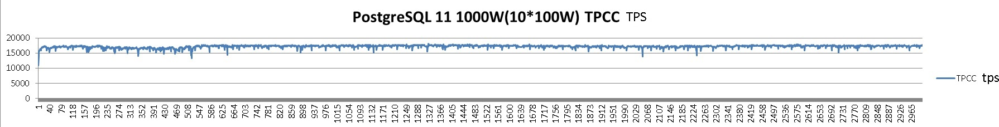

## PostgreSQL 11 tpcc 测试(103万tpmC on ECS) - use sysbench-tpcc by Percona-Lab  
                                                           
### 作者                                                           
digoal                                                           
                                                           
### 日期                                                           
2018-09-13                                                         
                                                           
### 标签                                                           
PostgreSQL , tpcc   
                                                           
----                                                           
                                                           
## 背景    
  
  
  
## 环境  
阿里云虚拟机  
  
```  
[root@pg11-test ~]# lscpu  
Architecture:          x86_64  
CPU op-mode(s):        32-bit, 64-bit  
Byte Order:            Little Endian  
CPU(s):                64  
On-line CPU(s) list:   0-63  
Thread(s) per core:    2  
Core(s) per socket:    32  
Socket(s):             1  
NUMA node(s):          1  
Vendor ID:             GenuineIntel  
CPU family:            6  
Model:                 85  
Model name:            Intel(R) Xeon(R) Platinum 8163 CPU @ 2.50GHz  
Stepping:              4  
CPU MHz:               2500.008  
BogoMIPS:              5000.01  
Hypervisor vendor:     KVM  
Virtualization type:   full  
L1d cache:             32K  
L1i cache:             32K  
L2 cache:              1024K  
L3 cache:              33792K  
NUMA node0 CPU(s):     0-63  
Flags:                 fpu vme de pse tsc msr pae mce cx8 apic sep mtrr pge mca cmov pat pse36 clflush mmx fxsr sse sse2 ss ht syscall nx pdpe1gb rdtscp lm constant_tsc rep_good nopl eagerfpu pni pclmulqdq ssse3 fma cx16 pcid sse4_1 sse4_2 x2apic movbe popcnt tsc_deadline_timer aes xsave avx f16c rdrand hypervisor lahf_lm abm 3dnowprefetch fsgsbase tsc_adjust bmi1 hle avx2 smep bmi2 erms invpcid rtm mpx avx512f avx512dq rdseed adx smap avx512cd avx512bw avx512vl xsaveopt xsavec xgetbv1  
```  
  
```  
[root@pg11-test ~]# free -g  
              total        used        free      shared  buff/cache   available  
Mem:            503          12         216          65         274         423  
Swap:             0           0           0  
```  
  
```  
uname -a  
Linux pg11-test 3.10.0-693.2.2.el7.x86_64 #1 SMP Tue Sep 12 22:26:13 UTC 2017 x86_64 x86_64 x86_64 GNU/Linux  
```  
  
## 配置ECS SSD盘存储  
1、卷管理  
  
```  
dd if=/dev/zero of=/dev/vdb bs=1024 count=1024  
dd if=/dev/zero of=/dev/vdc bs=1024 count=1024  
dd if=/dev/zero of=/dev/vdd bs=1024 count=1024  
dd if=/dev/zero of=/dev/vde bs=1024 count=1024  
dd if=/dev/zero of=/dev/vdf bs=1024 count=1024  
dd if=/dev/zero of=/dev/vdg bs=1024 count=1024  
dd if=/dev/zero of=/dev/vdh bs=1024 count=1024  
dd if=/dev/zero of=/dev/vdi bs=1024 count=1024  
  
  
pvcreate /dev/vd[b-i]  
  
  
vgcreate -A y -s 128M vgdata01 /dev/vd[b-i]  
  
  
lvcreate -A y -i 8 -I 8 -L 4096GiB -n lv01 vgdata01  
lvcreate -A y -i 8 -I 8 -L 4096GiB -n lv02 vgdata01  
lvcreate -A y -i 8 -I 8 -L 4096GiB -n lv03 vgdata01  
```  
  
2、文件系统条带  
  
```  
mkfs.ext4 /dev/mapper/vgdata01-lv01 -m 0 -O extent,uninit_bg -E lazy_itable_init=1,stride=2,stripe_width=16 -b 4096 -T largefile -L lv01  
mkfs.ext4 /dev/mapper/vgdata01-lv02 -m 0 -O extent,uninit_bg -E lazy_itable_init=1,stride=2,stripe_width=16 -b 4096 -T largefile -L lv02  
mkfs.ext4 /dev/mapper/vgdata01-lv03 -m 0 -O extent,uninit_bg -E lazy_itable_init=1,stride=2,stripe_width=16 -b 4096 -T largefile -L lv03  
```  
  
3、mount  
  
```  
vi /etc/fstab   
LABEL=lv01 /data01 ext4 defaults,noatime,nodiratime,nodelalloc,barrier=0,data=writeback 0 0  
LABEL=lv02 /data02 ext4 defaults,noatime,nodiratime,nodelalloc,barrier=0,data=writeback 0 0  
LABEL=lv03 /data03 ext4 defaults,noatime,nodiratime,nodelalloc,barrier=0,data=writeback 0 0  
  
  
mkdir /data01  
mkdir /data02  
mkdir /data03  
  
  
mount -a  
```  
  
## 配置ECS虚拟机OS参数  
1、内核参数  
  
```  
vi /etc/sysctl.conf  
  
# add by digoal.zhou      
fs.aio-max-nr = 1048576      
fs.file-max = 76724600      
      
# 可选：kernel.core_pattern = /data01/corefiles/core_%e_%u_%t_%s.%p               
# /data01/corefiles 事先建好，权限777，如果是软链接，对应的目录修改为777      
      
kernel.sem = 4096 2147483647 2147483646 512000          
# 信号量, ipcs -l 或 -u 查看，每16个进程一组，每组信号量需要17个信号量。      
      
kernel.shmall = 107374182            
# 所有共享内存段相加大小限制 (建议内存的80%)，单位为页。      
kernel.shmmax = 274877906944         
# 最大单个共享内存段大小 (建议为内存一半), >9.2的版本已大幅降低共享内存的使用，单位为字节。      
kernel.shmmni = 819200               
# 一共能生成多少共享内存段，每个PG数据库集群至少2个共享内存段      
      
net.core.netdev_max_backlog = 10000      
net.core.rmem_default = 262144             
# The default setting of the socket receive buffer in bytes.      
net.core.rmem_max = 4194304                
# The maximum receive socket buffer size in bytes      
net.core.wmem_default = 262144             
# The default setting (in bytes) of the socket send buffer.      
net.core.wmem_max = 4194304                
# The maximum send socket buffer size in bytes.      
net.core.somaxconn = 4096      
net.ipv4.tcp_max_syn_backlog = 4096      
net.ipv4.tcp_keepalive_intvl = 20      
net.ipv4.tcp_keepalive_probes = 3      
net.ipv4.tcp_keepalive_time = 60      
net.ipv4.tcp_mem = 8388608 12582912 16777216      
net.ipv4.tcp_fin_timeout = 5      
net.ipv4.tcp_synack_retries = 2      
net.ipv4.tcp_syncookies = 1          
# 开启SYN Cookies。当出现SYN等待队列溢出时，启用cookie来处理，可防范少量的SYN攻击      
net.ipv4.tcp_timestamps = 1          
# 减少time_wait      
net.ipv4.tcp_tw_recycle = 0          
# 如果=1则开启TCP连接中TIME-WAIT套接字的快速回收，但是NAT环境可能导致连接失败，建议服务端关闭它      
net.ipv4.tcp_tw_reuse = 1            
# 开启重用。允许将TIME-WAIT套接字重新用于新的TCP连接      
net.ipv4.tcp_max_tw_buckets = 262144      
net.ipv4.tcp_rmem = 8192 87380 16777216      
net.ipv4.tcp_wmem = 8192 65536 16777216      
      
net.nf_conntrack_max = 1200000      
net.netfilter.nf_conntrack_max = 1200000      
      
vm.dirty_background_bytes = 409600000             
#  系统脏页到达这个值，系统后台刷脏页调度进程 pdflush（或其他） 自动将(dirty_expire_centisecs/100）秒前的脏页刷到磁盘      
#  默认为10%，大内存机器建议调整为直接指定多少字节      
      
vm.dirty_expire_centisecs = 3000                   
#  比这个值老的脏页，将被刷到磁盘。3000表示30秒。      
vm.dirty_ratio = 95                                
#  如果系统进程刷脏页太慢，使得系统脏页超过内存 95 % 时，则用户进程如果有写磁盘的操作（如fsync, fdatasync等调用），则需要主动把系统脏页刷出。      
#  有效防止用户进程刷脏页，在单机多实例，并且使用CGROUP限制单实例IOPS的情况下非常有效。        
      
vm.dirty_writeback_centisecs = 100                  
#  pdflush（或其他）后台刷脏页进程的唤醒间隔， 100表示1秒。      
      
vm.swappiness = 0      
#  不使用交换分区      
      
vm.mmap_min_addr = 65536      
vm.overcommit_memory = 0           
#  在分配内存时，允许少量over malloc, 如果设置为 1, 则认为总是有足够的内存，内存较少的测试环境可以使用 1 .        
      
vm.overcommit_ratio = 90           
#  当overcommit_memory = 2 时，用于参与计算允许指派的内存大小。      
vm.swappiness = 0                  
#  关闭交换分区      
vm.zone_reclaim_mode = 0           
# 禁用 numa, 或者在vmlinux中禁止.       
net.ipv4.ip_local_port_range = 40000 65535          
# 本地自动分配的TCP, UDP端口号范围      
fs.nr_open=20480000      
# 单个进程允许打开的文件句柄上限      
      
# 以下参数请注意      
# vm.extra_free_kbytes = 4096000      
# vm.min_free_kbytes = 2097152      
# 如果是小内存机器，以上两个值不建议设置      
# vm.nr_hugepages = 66536          
#  建议shared buffer设置超过64GB时 使用大页，页大小 /proc/meminfo Hugepagesize      
# vm.lowmem_reserve_ratio = 1 1 1      
# 对于内存大于64G时，建议设置，否则建议默认值 256 256 32  
```  
  
2、资源限制  
  
```  
vi /etc/security/limits.conf  
  
# nofile超过1048576的话，一定要先将sysctl的fs.nr_open设置为更大的值，并生效后才能继续设置nofile.      
      
* soft    nofile  1024000      
* hard    nofile  1024000      
* soft    nproc   unlimited      
* hard    nproc   unlimited      
* soft    core    unlimited      
* hard    core    unlimited      
* soft    memlock unlimited      
* hard    memlock unlimited     
```  
  
3、关闭透明大页  
  
```  
vi /etc/rc.local  
  
touch /var/lock/subsys/local  
       
if test -f /sys/kernel/mm/transparent_hugepage/enabled; then      
   echo never > /sys/kernel/mm/transparent_hugepage/enabled      
fi      
su - postgres -c "pg_ctl start"    
```  
  
## 部署PostgreSQL 11  
  
https://yum.postgresql.org/repopackages.php#pg11  
  
```  
rpm -ivh https://download.postgresql.org/pub/repos/yum/11/redhat/rhel-7-x86_64/pgdg-centos11-11-2.noarch.rpm  
  
rpm -ivh https://dl.fedoraproject.org/pub/epel/epel-release-latest-7.noarch.rpm   
  
yum -y install coreutils glib2 lrzsz dstat sysstat e4fsprogs xfsprogs ntp readline-devel zlib-devel openssl-devel pam-devel libxml2-devel libxslt-devel python-devel tcl-devel gcc gcc-c++ make smartmontools flex bison perl-devel perl-ExtUtils* openldap-devel jadetex  openjade bzip2   
  
yum install -y postgresql11*  
```  
  
环境变量  
  
```  
su - postgres  
  
vi .bash_profile  
  
export PS1="$USER@`/bin/hostname -s`-> "      
export PGPORT=1921      
export PGDATA=/data01/pg11/pg_root$PGPORT      
export LANG=en_US.utf8      
export PGHOME=/usr/pgsql-11    
export LD_LIBRARY_PATH=$PGHOME/lib:/lib64:/usr/lib64:/usr/local/lib64:/lib:/usr/lib:/usr/local/lib:$LD_LIBRARY_PATH      
export DATE=`date +"%Y%m%d%H%M"`    
export PATH=$PGHOME/bin:$PATH:.      
export MANPATH=$PGHOME/share/man:$MANPATH      
export PGHOST=$PGDATA      
export PGUSER=postgres      
export PGDATABASE=postgres      
alias rm='rm -i'      
alias ll='ls -lh'      
unalias vi   
```  
  
## 初始化PostgreSQL 11数据库  
  
```  
mkdir /data01/pg11  
mkdir /data02/pg11  
chown postgres:postgres /data01/pg11  
chown postgres:postgres /data02/pg11  
```  
  
```  
su - postgres  
  
initdb -D $PGDATA -X /data02/pg11/pg_wal1921 -U postgres -E SQL_ASCII --locale=C  
```  
  
## 配置PostgreSQL 11数据库参数  
  
```  
vi $PGDATA/postgresql.auto.conf  
  
  
listen_addresses = '0.0.0.0'  
port = 1921  
max_connections = 2000  
superuser_reserved_connections = 3  
unix_socket_directories = '., /var/run/postgresql, /tmp'  
tcp_keepalives_idle = 60  
tcp_keepalives_interval = 10  
tcp_keepalives_count = 10  
shared_buffers = 64GB  
max_prepared_transactions = 2000  
work_mem = 8MB  
maintenance_work_mem = 2GB  
dynamic_shared_memory_type = posix  
vacuum_cost_delay = 0  
bgwriter_delay = 10ms  
bgwriter_lru_maxpages = 1000  
bgwriter_lru_multiplier = 10.0  
effective_io_concurrency = 0  
max_worker_processes = 128  
max_parallel_maintenance_workers = 6  
max_parallel_workers_per_gather = 0  
parallel_leader_participation = on  
max_parallel_workers = 32  
wal_level = minimal    
synchronous_commit = off  
wal_writer_delay = 10ms  
checkpoint_timeout = 35min  
max_wal_size = 128GB  
min_wal_size = 32GB  
checkpoint_completion_target = 0.1  
max_wal_senders = 0  
effective_cache_size = 400GB  
log_destination = 'csvlog'  
logging_collector = on  
log_directory = 'log'  
log_filename = 'postgresql-%a.log'  
log_truncate_on_rotation = on  
log_rotation_age = 1d  
log_rotation_size = 0  
log_checkpoints = on   
log_connections = on  
log_disconnections = on  
log_error_verbosity = verbose   
log_line_prefix = '%m [%p] '  
log_timezone = 'PRC'  
log_autovacuum_min_duration = 0  
autovacuum_max_workers = 16  
autovacuum_freeze_max_age = 1200000000  
autovacuum_multixact_freeze_max_age = 1400000000  
autovacuum_vacuum_cost_delay = 0ms  
vacuum_freeze_table_age = 1150000000  
vacuum_multixact_freeze_table_age = 1150000000  
datestyle = 'iso, mdy'  
timezone = 'PRC'  
lc_messages = 'C'  
lc_monetary = 'C'  
lc_numeric = 'C'  
lc_time = 'C'  
default_text_search_config = 'pg_catalog.english'  
jit = off  
cpu_tuple_cost=0.00018884145574257426    
cpu_index_tuple_cost = 0.00433497085216479990    
cpu_operator_cost = 0.00216748542608239995    
seq_page_cost=0.014329    
random_page_cost = 0.016  
```  
  
启动数据库  
  
```  
pg_ctl start  
```  
  
  
## 部署sysbench 1.x  
  
### 1 推荐 使用yum 安装  
https://github.com/akopytov/sysbench  
  
```  
curl -s https://packagecloud.io/install/repositories/akopytov/sysbench/script.rpm.sh | sudo bash  
sudo yum -y install sysbench  
```  
  
### 2 编译安装  
  
```  
yum -y install make automake libtool pkgconfig libaio-devel  
  
git clone https://github.com/akopytov/sysbench  
  
cd sysbench  
  
./autogen.sh  
  
./configure --prefix=/var/lib/pgsql/sysbench --with-pgsql --without-mysql --with-pgsql-includes=/usr/pgsql-11/include --with-pgsql-libs=/usr/pgsql-11/lib  
  
make -j 128  
  
make install  
```  
  
## tpc-c 测试(本例使用prepared statement版本lua以降低SQL硬解析开销)  
可以把sysbench部署在本地或异机进行测试。本例使用本机测试。  
  
1、准备tpcc lua脚本(使用如下git ps版本，由于PostgreSQL优化器与Oracle类似都较为复杂，建议使用prepared statement降低CPU开销)  
  
https://github.com/digoal/sysbench-tpcc  
  
  
```  
git clone https://github.com/digoal/sysbench-tpcc  
```  
  
2、数据库连接示例  
  
```  
unixsocket_dir='/tmp'  
port=1921  
user=postgres  
dbname=postgres  
```  
  
### 测试  
  
### 1 PostgreSQL: prepare data and tables  
```
cd sysbench-tpcc

chmod 700 *.lua
```
  
```  
./tpcc.lua --pgsql-host=/tmp --pgsql-port=1921 --pgsql-user=postgres --pgsql-db=postgres --threads=64 --tables=10 --scale=100 --trx_level=RC --db-ps-mode=auto --db-driver=pgsql prepare  
```  
  
目前sysbench insert数据已使用bulk insert  
  
```  
insert into tbl (x,x,..) values (),(),(),...();  
```  
  
### 2 PostgreSQL: Run benchmark  
  
```  
./tpcc.lua --pgsql-host=/tmp --pgsql-port=1921 --pgsql-user=postgres --pgsql-db=postgres --threads=64 --tables=10 --scale=100 --trx_level=RC --db-ps-mode=auto --db-driver=pgsql --time=3000 --report-interval=1 run  
```  
  
### 3 PostgreSQL: Cleanup  
  
```  
./tpcc.lua --pgsql-host=/tmp --pgsql-port=1921 --pgsql-user=postgres --pgsql-db=postgres --threads=64 --tables=10 --scale=100 --trx_level=RC --db-driver=pgsql cleanup  
```  
  
## PostgreSQL 11 1000W(10*100W) tpcc 3000秒 测试结果  
1、测试开始  
  
```  
postgres@pg11-test-> ./tpcc.lua --pgsql-host=/tmp --pgsql-port=1921 --pgsql-user=postgres --pgsql-db=postgres --time=3000 --threads=64 --report-interval=1 --tables=10 --scale=100 --trx_level=RC --db-ps-mode=auto --db-driver=pgsql run  
sysbench 1.0.15 (using bundled LuaJIT 2.1.0-beta2)  
  
Running the test with following options:  
Number of threads: 64  
Report intermediate results every 1 second(s)  
Initializing random number generator from current time  
  
  
Initializing worker threads...  
  
Threads started!  
```  
  
2、中间结果  
  
```  
[ 1s ] thds: 64 tps: 10848.89 qps: 338713.05 (r/w/o: 139980.50/145087.73/53644.82) lat (ms,95%): 15.00 err/s 54.69 reconn/s: 0.00  
[ 2s ] thds: 64 tps: 14145.17 qps: 405842.53 (r/w/o: 185145.95/192406.24/28290.34) lat (ms,95%): 11.24 err/s 58.22 reconn/s: 0.00  
[ 3s ] thds: 64 tps: 15556.07 qps: 437546.11 (r/w/o: 199541.96/206892.00/31112.15) lat (ms,95%): 10.09 err/s 69.00 reconn/s: 0.00  
[ 4s ] thds: 64 tps: 15749.37 qps: 443252.50 (r/w/o: 202278.79/209473.96/31499.75) lat (ms,95%): 9.91 err/s 73.00 reconn/s: 0.00  
[ 5s ] thds: 64 tps: 15919.52 qps: 455430.67 (r/w/o: 207796.44/215797.19/31837.04) lat (ms,95%): 9.73 err/s 57.98 reconn/s: 0.00  
[ 6s ] thds: 64 tps: 15992.56 qps: 458874.12 (r/w/o: 209319.81/217568.19/31986.11) lat (ms,95%): 9.56 err/s 79.03 reconn/s: 0.00  
[ 7s ] thds: 64 tps: 16176.76 qps: 461788.59 (r/w/o: 210620.85/218814.23/32353.51) lat (ms,95%): 9.56 err/s 53.00 reconn/s: 0.00  
[ 8s ] thds: 64 tps: 16450.87 qps: 467366.17 (r/w/o: 213272.25/221191.19/32902.73) lat (ms,95%): 9.39 err/s 80.00 reconn/s: 0.00  
[ 9s ] thds: 64 tps: 15862.17 qps: 452484.21 (r/w/o: 206426.15/214335.73/31722.33) lat (ms,95%): 9.73 err/s 64.00 reconn/s: 0.00  
[ 10s ] thds: 64 tps: 16492.73 qps: 472949.95 (r/w/o: 215464.54/224497.94/32987.46) lat (ms,95%): 9.39 err/s 54.00 reconn/s: 0.00  
[ 11s ] thds: 64 tps: 16660.95 qps: 475135.93 (r/w/o: 216847.28/224967.76/33320.89) lat (ms,95%): 9.39 err/s 73.00 reconn/s: 0.00  
[ 12s ] thds: 64 tps: 16775.06 qps: 475670.07 (r/w/o: 217046.72/225072.23/33551.12) lat (ms,95%): 9.22 err/s 80.01 reconn/s: 0.00  
[ 13s ] thds: 64 tps: 16906.01 qps: 477886.83 (r/w/o: 218090.01/225984.81/33812.02) lat (ms,95%): 9.22 err/s 66.96 reconn/s: 0.00  
[ 14s ] thds: 64 tps: 16908.88 qps: 482703.49 (r/w/o: 220326.70/228559.03/33817.76) lat (ms,95%): 9.22 err/s 78.04 reconn/s: 0.00  
[ 15s ] thds: 64 tps: 17015.05 qps: 479408.28 (r/w/o: 218798.81/226580.37/34029.10) lat (ms,95%): 9.39 err/s 65.00 reconn/s: 0.00  
[ 16s ] thds: 64 tps: 16834.45 qps: 480909.86 (r/w/o: 219310.87/227931.10/33667.90) lat (ms,95%): 9.22 err/s 60.00 reconn/s: 0.00  
[ 17s ] thds: 64 tps: 17083.44 qps: 485663.48 (r/w/o: 221645.70/229846.91/34170.88) lat (ms,95%): 9.06 err/s 66.00 reconn/s: 0.00  
[ 18s ] thds: 64 tps: 17195.95 qps: 487005.36 (r/w/o: 221943.49/230672.96/34388.91) lat (ms,95%): 9.06 err/s 78.00 reconn/s: 0.00  
...............  
...............  
[ 2990s ] thds: 64 tps: 17542.80 qps: 496350.64 (r/w/o: 226691.34/234572.70/35086.60) lat (ms,95%): 9.06 err/s 78.00 reconn/s: 0.00  
[ 2991s ] thds: 64 tps: 17309.25 qps: 496647.58 (r/w/o: 226609.23/235418.85/34619.51) lat (ms,95%): 9.06 err/s 81.00 reconn/s: 0.00  
[ 2992s ] thds: 64 tps: 16584.81 qps: 472614.59 (r/w/o: 215667.53/223777.44/33169.62) lat (ms,95%): 9.22 err/s 81.00 reconn/s: 0.00  
[ 2993s ] thds: 64 tps: 17224.50 qps: 495915.40 (r/w/o: 226332.57/235134.83/34448.00) lat (ms,95%): 9.22 err/s 62.00 reconn/s: 0.00  
[ 2994s ] thds: 64 tps: 17445.25 qps: 497437.54 (r/w/o: 226739.24/235807.81/34890.50) lat (ms,95%): 9.22 err/s 66.99 reconn/s: 0.00  
[ 2995s ] thds: 64 tps: 17554.56 qps: 498410.55 (r/w/o: 227378.10/235922.34/35110.11) lat (ms,95%): 8.90 err/s 75.01 reconn/s: 0.00  
[ 2996s ] thds: 64 tps: 17495.41 qps: 493823.41 (r/w/o: 225246.43/233586.15/34990.82) lat (ms,95%): 9.06 err/s 70.00 reconn/s: 0.00  
[ 2997s ] thds: 64 tps: 17510.83 qps: 493703.35 (r/w/o: 225073.65/233608.05/35021.66) lat (ms,95%): 9.06 err/s 61.00 reconn/s: 0.00  
[ 2998s ] thds: 64 tps: 17393.22 qps: 496557.75 (r/w/o: 226414.86/235357.44/34785.45) lat (ms,95%): 9.06 err/s 68.99 reconn/s: 0.00  
[ 2999s ] thds: 64 tps: 17533.23 qps: 502571.93 (r/w/o: 229456.19/238048.28/35067.46) lat (ms,95%): 8.90 err/s 79.01 reconn/s: 0.00  
[ 3000s ] thds: 64 tps: 17632.80 qps: 495850.27 (r/w/o: 226004.39/234582.29/35263.59) lat (ms,95%): 9.06 err/s 78.00 reconn/s: 0.00  
```  
  
[详情](20180913_01_doc_001.txt)  
  
3、统计结果  
  
```  
SQL statistics:  
    queries performed:  
        read:                            669057449  
        write:                           694400833  
        other:                           103206774  
        total:                           1466665056  
    transactions:                        51587354 (17194.37 per sec.)  
    queries:                             1466665056 (488848.22 per sec.)  
    ignored errors:                      223749 (74.58 per sec.)  
    reconnects:                          0      (0.00 per sec.)  
  
General statistics:  
    total time:                          3000.2437s  
    total number of events:              51587354  
  
Latency (ms):  
         min:                                    0.29  
         avg:                                    3.72  
         max:                                 1007.85  
         95th percentile:                        9.22  
         sum:                            191863975.40  
  
Threads fairness:  
    events (avg/stddev):           806052.4062/4085.80  
    execution time (avg/stddev):   2997.8746/0.05  
```  
  
### 资源消耗  
  
1、top  
  
```  
top -c -u postgres  
  
top - 15:11:18 up 1 day,  2:56,  4 users,  load average: 54.04, 22.42, 31.39  
Tasks: 604 total,  56 running, 548 sleeping,   0 stopped,   0 zombie  
%Cpu(s): 65.7 us, 19.3 sy,  0.0 ni, 14.9 id,  0.1 wa,  0.0 hi,  0.0 si,  0.0 st  
KiB Mem : 52819500+total, 18716296+free, 13114144 used, 32791788+buff/cache  
KiB Swap:        0 total,        0 free,        0 used. 44386240+avail Mem   
  
  PID USER      PR  NI    VIRT    RES    SHR S  %CPU %MEM     TIME+ COMMAND                                                                                                                                                                    
54047 postgres  20   0 4399344  71384   3104 S 893.8  0.0  14:53.76 sysbench ./tpcc.lua --pgsql-host=/tmp --pgsql-port=1921 --pgsql-user=postgres --pgsql-db=postgres --time=3000 --threads=64 --report-interval=1 --tables=10 --scale=100 +   
54126 postgres  20   0 65.867g 9.910g 9.892g R  81.2  2.0   1:13.00 postgres: postgres postgres [local] idle in transaction  
54129 postgres  20   0 65.867g 9.872g 9.854g R  81.2  2.0   1:12.65 postgres: postgres postgres [local] idle in transaction  
54143 postgres  20   0 65.867g 9.933g 9.915g R  81.2  2.0   1:12.74 postgres: postgres postgres [local] EXECUTE              
54150 postgres  20   0 65.867g 9.887g 9.869g R  81.2  2.0   1:12.57 postgres: postgres postgres [local] idle in transaction  
54154 postgres  20   0 65.867g 0.010t 0.010t R  81.2  2.0   1:12.70 postgres: postgres postgres [local] idle in transaction  
54158 postgres  20   0 65.867g 0.010t 0.010t R  81.2  2.0   1:13.61 postgres: postgres postgres [local] EXECUTE              
54168 postgres  20   0 65.867g 0.010t 9.991g R  81.2  2.0   1:13.47 postgres: postgres postgres [local] EXECUTE              
54174 postgres  20   0 65.867g 9.879g 9.861g S  81.2  2.0   1:12.61 postgres: postgres postgres [local] idle in transaction  
53350 postgres  20   0 65.846g 0.060t 0.060t R  75.0 12.2  36:43.87 postgres: background writer                              
54113 postgres  20   0 65.867g 0.010t 9.995g R  75.0  2.0   1:12.65 postgres: postgres postgres [local] idle                 
54118 postgres  20   0 65.867g 9.889g 9.871g R  75.0  2.0   1:12.83 postgres: postgres postgres [local] EXECUTE              
54119 postgres  20   0 65.867g 0.010t 9.987g R  75.0  2.0   1:12.96 postgres: postgres postgres [local] EXECUTE              
54120 postgres  20   0 65.867g 9.968g 9.950g R  75.0  2.0   1:13.02 postgres: postgres postgres [local] idle in transaction  
54121 postgres  20   0 65.867g 9.938g 9.920g R  75.0  2.0   1:12.96 postgres: postgres postgres [local] EXECUTE              
54123 postgres  20   0 65.867g 0.010t 9.992g R  75.0  2.0   1:12.97 postgres: postgres postgres [local] EXECUTE              
54131 postgres  20   0 65.867g 9.915g 9.897g S  75.0  2.0   1:12.78 postgres: postgres postgres [local] EXECUTE              
54133 postgres  20   0 65.867g 0.010t 0.010t R  75.0  2.0   1:12.74 postgres: postgres postgres [local] EXECUTE              
54134 postgres  20   0 65.867g 9.957g 9.939g R  75.0  2.0   1:13.17 postgres: postgres postgres [local] EXECUTE              
54135 postgres  20   0 65.867g 9.986g 9.968g R  75.0  2.0   1:12.87 postgres: postgres postgres [local] idle in transaction  
54139 postgres  20   0 65.867g 0.010t 0.010t R  75.0  2.0   1:13.60 postgres: postgres postgres [local] EXECUTE              
54140 postgres  20   0 65.867g 0.010t 0.010t S  75.0  2.0   1:12.91 postgres: postgres postgres [local] idle in transaction  
54141 postgres  20   0 65.867g 9.926g 9.908g S  75.0  2.0   1:12.86 postgres: postgres postgres [local] EXECUTE              
54142 postgres  20   0 65.867g 9.979g 9.961g R  75.0  2.0   1:12.74 postgres: postgres postgres [local] EXECUTE transaction  
54144 postgres  20   0 65.867g 9.966g 9.947g R  75.0  2.0   1:12.94 postgres: postgres postgres [local] idle in transaction  
```  
  
  
2、iotop  
  
```  
Total DISK READ :       0.00 B/s | Total DISK WRITE :    1110.48 M/s  
Actual DISK READ:       0.00 B/s | Actual DISK WRITE:    1087.77 M/s  
  TID  PRIO  USER     DISK READ  DISK WRITE  SWAPIN     IO>    COMMAND                                                                                                                                                                         
53351 be/4 postgres    0.00 B/s  495.03 M/s  0.00 % 14.21 % postgres: walwriter  
54165 be/4 postgres    0.00 B/s    5.68 M/s  0.00 %  0.03 % postgres: postgres postgres [local] idle in transaction  
54127 be/4 postgres    0.00 B/s    6.57 M/s  0.00 %  0.02 % postgres: postgres postgres [local] EXECUTE waiting  
51622 be/4 root        0.00 B/s    0.00 B/s  0.00 %  0.02 % [kworker/u128:0]  
54167 be/4 postgres    0.00 B/s    5.32 M/s  0.00 %  0.02 % postgres: postgres postgres [local] idle in transaction  
54120 be/4 postgres    0.00 B/s    6.10 M/s  0.00 %  0.02 % postgres: postgres postgres [local] idle in transaction  
54135 be/4 postgres    0.00 B/s    6.17 M/s  0.00 %  0.01 % postgres: postgres postgres [local] idle in transaction  
54128 be/4 postgres    0.00 B/s    6.09 M/s  0.00 %  0.01 % postgres: postgres postgres [local] EXECUTE              
54157 be/4 postgres    0.00 B/s    6.14 M/s  0.00 %  0.01 % postgres: postgres postgres [local] EXECUTE  
54145 be/4 postgres    0.00 B/s    6.23 M/s  0.00 %  0.01 % postgres: postgres postgres [local] idle in transaction  
54132 be/4 postgres    0.00 B/s    5.38 M/s  0.00 %  0.01 % postgres: postgres postgres [local] idle in transaction  
54122 be/4 postgres    0.00 B/s    5.64 M/s  0.00 %  0.01 % postgres: postgres postgres [local] EXECUTE  
54151 be/4 postgres    0.00 B/s    6.55 M/s  0.00 %  0.01 % postgres: postgres postgres [local] EXECUTE              
54174 be/4 postgres    0.00 B/s    7.20 M/s  0.00 %  0.01 % postgres: postgres postgres [local] idle in transaction  
54118 be/4 postgres    0.00 B/s    5.81 M/s  0.00 %  0.01 % postgres: postgres postgres [local] EXECUTE              
54114 be/4 postgres    0.00 B/s    5.31 M/s  0.00 %  0.01 % postgres: postgres postgres [local] idle in transaction  
54142 be/4 postgres    0.00 B/s    5.56 M/s  0.00 %  0.00 % postgres: postgres postgres [local] idle in transaction  
54117 be/4 postgres    0.00 B/s    5.94 M/s  0.00 %  0.00 % postgres: postgres postgres [local] idle in transaction  
54158 be/4 postgres    0.00 B/s    6.15 M/s  0.00 %  0.00 % postgres: postgres postgres [local] EXECUTE              
54161 be/4 postgres    0.00 B/s    5.72 M/s  0.00 %  0.00 % postgres: postgres postgres [local] EXECUTE  
54124 be/4 postgres    0.00 B/s    5.67 M/s  0.00 %  0.00 % postgres: postgres postgres [local] EXECUTE              
54113 be/4 postgres    0.00 B/s    5.49 M/s  0.00 %  0.00 % postgres: postgres postgres [local] EXECUTE              
53350 be/4 postgres    0.00 B/s  236.05 M/s  0.00 %  0.00 % postgres: background writer  
54164 be/4 postgres    0.00 B/s    5.44 M/s  0.00 %  0.00 % postgres: postgres postgres [local] idle in transaction  
54115 be/4 postgres    0.00 B/s    5.86 M/s  0.00 %  0.00 % postgres: postgres postgres [local] idle in transaction  
54149 be/4 postgres    0.00 B/s    5.49 M/s  0.00 %  0.00 % postgres: postgres postgres [local] idle in transaction  
```  
  
3、io统计  
  
```  
avg-cpu:  %user   %nice %system %iowait  %steal   %idle  
          71.36    0.00   15.57    0.00    0.00   13.07  
  
Device:         rrqm/s   wrqm/s     r/s     w/s    rkB/s    wkB/s avgrq-sz avgqu-sz   await r_await w_await  svctm  %util  
vda               0.00     0.00    0.00    0.00     0.00     0.00     0.00     0.00    0.00    0.00    0.00   0.00   0.00  
vdb               0.00   417.00    0.00 12851.00     0.00 106080.00    16.51     2.85    0.22    0.00    0.22   0.04  49.40  
vdc               0.00   439.00    0.00 13091.00     0.00 108164.00    16.52     3.00    0.23    0.00    0.23   0.04  49.60  
vdd               0.00   434.00    0.00 12941.00     0.00 106964.00    16.53     3.11    0.24    0.00    0.24   0.04  50.10  
vde               0.00   433.00    1.00 13040.00     4.00 107736.00    16.52     3.23    0.25    0.00    0.25   0.04  50.50  
vdf               0.00   434.00    0.00 13040.00     0.00 107760.00    16.53     3.28    0.25    0.00    0.25   0.04  51.10  
vdg               0.00   448.00    0.00 12806.00     0.00 105996.00    16.55     3.47    0.27    0.00    0.27   0.04  52.20  
vdh               0.00   438.00    0.00 13179.00     0.00 108896.00    16.53     3.76    0.29    0.00    0.29   0.04  52.30  
vdi               0.00   459.00    0.00 12933.00     0.00 107072.00    16.56     3.75    0.29    0.00    0.29   0.04  51.80  
dm-0              0.00     0.00    1.00 107284.00     4.00 857876.00    15.99    27.50    0.26    0.00    0.26   0.01  62.60  
dm-1              0.00     0.00    0.00    0.00     0.00     0.00     0.00     0.00    0.00    0.00    0.00   0.00   0.00  
dm-2              0.00     0.00    0.00   99.00     0.00   792.00    16.00     0.00    0.02    0.00    0.02   0.03   0.30  
```  
  
  
## 附录  
PostgreSQL 12可能会支持force prepare，类似Oracle force cursor的特性  
  
```  
wget https://www.postgresql.org/message-id/attachment/64449/autoprepare-11.patch  
patch -p1 < ../autoprepare-11.patch  
make  
make install  
```  
  
```  
patching file doc/src/sgml/autoprepare.sgml  
patching file doc/src/sgml/catalogs.sgml  
Hunk #1 succeeded at 8223 (offset -8 lines).  
Hunk #2 succeeded at 9539 (offset -8 lines).  
patching file doc/src/sgml/filelist.sgml  
patching file doc/src/sgml/postgres.sgml  
patching file src/backend/catalog/system_views.sql  
patching file src/backend/commands/prepare.c  
patching file src/backend/nodes/nodeFuncs.c  
patching file src/backend/tcop/postgres.c  
Hunk #9 succeeded at 4616 (offset 6 lines).  
Hunk #10 succeeded at 5441 (offset 6 lines).  
patching file src/backend/tcop/utility.c  
patching file src/backend/utils/cache/inval.c  
patching file src/backend/utils/misc/guc.c  
Hunk #1 succeeded at 475 (offset -8 lines).  
Hunk #2 succeeded at 2126 (offset -8 lines).  
patching file src/include/catalog/pg_proc.dat  
patching file src/include/commands/prepare.h  
patching file src/include/nodes/nodeFuncs.h  
patching file src/include/tcop/pquery.h  
patching file src/include/utils/guc.h  
patching file src/test/regress/expected/autoprepare.out  
patching file src/test/regress/expected/date_1.out  
patching file src/test/regress/expected/rules.out  
patching file src/test/regress/parallel_schedule  
patching file src/test/regress/serial_schedule  
patching file src/test/regress/sql/autoprepare.sql  
```  
  
```  
/*  
 * Threshold for implicit preparing of frequently executed queries  
 */  
{  
        {"autoprepare_threshold", PGC_USERSET, QUERY_TUNING_OTHER,  
         gettext_noop("Threshold for autopreparing query."),  
         gettext_noop("0 value disables autoprepare.")  
        },  
        &autoprepare_threshold,  
        0, 0, INT_MAX,  
        NULL, NULL, NULL  
},  
{  
        {"autoprepare_limit", PGC_USERSET, QUERY_TUNING_OTHER,  
         gettext_noop("Maximal number of autoprepared queries."),  
         gettext_noop("0 means unlimited number of autoprepared queries.   
	 Too large number of prepared queries can cause backend memory overflow   
	 and slowdown execution speed (because of increased lookup time)")  
        },  
        &autoprepare_limit,  
        113, 0, INT_MAX,  
        NULL, NULL, NULL  
},  
{  
        {"autoprepare_memory_limit", PGC_USERSET, QUERY_TUNING_OTHER,  
         gettext_noop("Maximal size of memory used by autoprepared queries."),  
         gettext_noop("0 means that there is no memory limit. Calculating memory used by prepared queries adds somme extra overhead, "  
                                  "so non-zero value of this parameter may cause some slowdown.   
				  autoprepare_limit is much faster way to limit number of autoprepared statements"),  
         GUC_UNIT_KB  
        },  
        &autoprepare_memory_limit,  
        0, 0, INT_MAX,  
        NULL, NULL, NULL  
},  
```  
  
如果支持内部ps，则测试时，不再需要使用prepare statement   
  
```  
./tpcc.lua --pgsql-host=/tmp --pgsql-port=8001 --pgsql-user=postgres --pgsql-db=postgres --threads=64 --tables=10 --scale=100 --db-driver=pgsql prepare  
  
./tpcc.lua --pgsql-host=/tmp --pgsql-port=8001 --pgsql-user=postgres --pgsql-db=postgres --threads=64 --tables=10 --scale=100 --time=3000 --report-interval=1 --trx_level=RC --db-ps-mode=auto --db-driver=pgsql run  
  
./tpcc.lua --pgsql-host=/tmp --pgsql-port=8001 --pgsql-user=postgres --pgsql-db=postgres --threads=64 --tables=10 --scale=100 --db-driver=pgsql cleanup  
```  
  
## 小结  
1、PostgreSQL 11 beta3版本，1000W tpc-c，在ECS虚拟机下测试，性能已达到 103万 tpmC。     
  
    
  
2、PostgreSQL 11 beta3版本，200G tpc-h，在ECS虚拟机下测试(未过多优化)，总耗时在30分钟左右（还有巨大优化空间）。      
  
[《(TPC-H测试 SF=10,SF=200) PostgreSQL 11 vs 10 vs Deepgreen》](../201808/20180823_01.md)    
  
SF=10   
  
数据库 | q1 | q2 | q3 | q4 | q5 | q6 | q7 | q8 | q9 | q10 | q11 | q12 | q13 | q14 | q15 | q16 | q17 | q18 | q19 | q20 | q21 | q22  
---|---|---|---|---|---|---|---|---|---|---|---|---|---|---|---|---|---|---|---|---|---|---  
PostgreSQL 11beta3 | 3 | 2 | 2 | 5 | 3 | 4 | 2 | 2 | 9 | 3 | 1 | 2 | 4 | 2 | 6 | 10 | 27 | 46 | 2 | 10 | 13 | 2  
  
SF=200    
    
数据库 | q1 | q2 | q3 | q4 | q5 | q6 | q7 | q8 | q9 | q10 | q11 | q12 | q13 | q14 | q15 | q16 | q17 | q18 | q19 | q20 | q21 | q22  
---|---|---|---|---|---|---|---|---|---|---|---|---|---|---|---|---|---|---|---|---|---|---  
PostgreSQL 11beta3 | 18 | 38 | 25 | 32 | 57 | 8 | 52 | 24 | 66 | 38 | 24 | 26 | 98 | 13 | 58 | 114 | 732 | 595 | 12 | 213 | 124 | 14  
  
  
PostgreSQL 在oltp, olap混合场景下有着出色的表现，再加上对Oracle兼容性的加持，以及**阿里、平安集团、邮储、国家电网、中兴、华为、铁总、苏宁、去哪儿、探探等PG企业用户的背书**，已成为市场去O的标志性替代产品，帮助企业实现几乎无痛的去O。  
  
**[阿里云ADAM 去O 专版 PPAS(PostgreSQL高级版)](https://promotion.aliyun.com/ntms/act/ppasadam.html) 提供免费去O评估。**    
  
**[Ora2pg](http://ora2pg.darold.net/) 开源去O产品.**  
  
[《Oracle migration to Greenplum - (含 Ora2pg)》](../201804/20180423_02.md)    
  
## 参考  
https://github.com/digoal/sysbench-tpcc  
  
https://github.com/digoal/sysbench-1  
  
https://github.com/Percona-Lab/sysbench-tpcc  
  
https://github.com/akopytov/sysbench  
  
http://dimitrik.free.fr/blog/archives/2018/05/mysql-performence-80-ga-and-tpcc-workloads.html?utm_source=tuicool&utm_medium=referral  
  
[《(TPC-H测试 SF=10,SF=200) PostgreSQL 11 vs 10 vs Deepgreen》](../201808/20180823_01.md)    
  
[《数据库界的华山论剑 tpc.org》](../201701/20170125_01.md)    
   
  
<a rel="nofollow" href="http://info.flagcounter.com/h9V1"  ></a>  
  
  
## [digoal's 大量PostgreSQL文章入口](https://github.com/digoal/blog/blob/master/README.md "22709685feb7cab07d30f30387f0a9ae")
  
