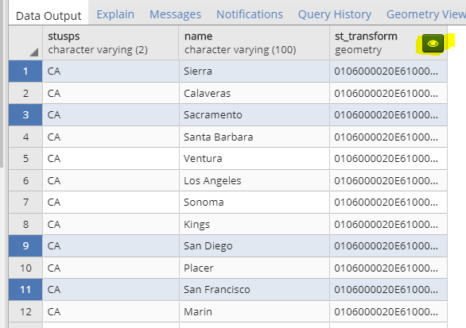
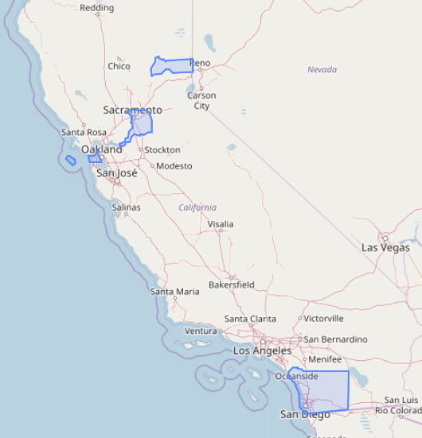
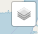
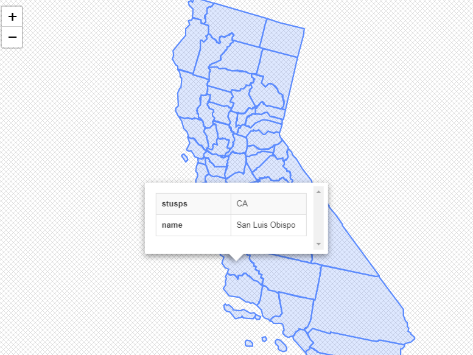

## PostgreSQL GUI pgadmin4 v3.3 支持 gis geometry 数据编辑、显示   
                                                             
### 作者                                                             
digoal                                                             
                                                             
### 日期                                                             
2018-09-13                                                           
                                                             
### 标签                                                             
PostgreSQL , pgadmin , gis , 编辑   
                                                             
----                                                             
                                                             
## 背景      
pgadmin 4 v3.3 开始支持geometry 类型的展示。  
  
https://www.postgresql.org/ftp/pgadmin/pgadmin4/v3.3/windows/  
  
如果geometry使用的是SRID 4326 (WGS 84 lon/lat)坐标系，则pgadmin会自动从OpenStreetMap 加载图层，作为背景。  
  
如果使用的是其他坐标系，则没有背景。  
  
pgadmin加入对geometry类型的支持，大大提升了用户GIS数据可视化效果的能力。  
  
## 原文    
http://www.bostongis.com/blog/index.php?/archives/272-pgAdmin4-now-offers-PostGIS-geometry-viewer.html  
  
## 例子  
SELECT s.stusps, c.name, ST_Transform(c.the_geom,4326)  
FROM tiger.county AS c INNER JOIN tiger.state AS s ON c.statefp = s.statefp   
WHERE s.stusps IN('CA');  
  
getometry 列上显示了一个眼睛图标  
  
  
  
点击眼睛图标，展示空间数据  
  
  
  
如果geometry列为SRID 4326 (WGS 84 lon/lat)坐标系数据，则会多出一个图层按钮，点击这个按钮，pgadmin会自动从OpenStreetMap 加载图层，作为背景。  
  
点击图像中的geometry数据，会展示该行对应的其他列上的数据。  
  
  
    
## 参考    
http://www.bostongis.com/blog/index.php?/archives/272-pgAdmin4-now-offers-PostGIS-geometry-viewer.html  
  
  
  
  
  
## [digoal's 大量PostgreSQL文章入口](https://github.com/digoal/blog/blob/master/README.md "22709685feb7cab07d30f30387f0a9ae")
  
