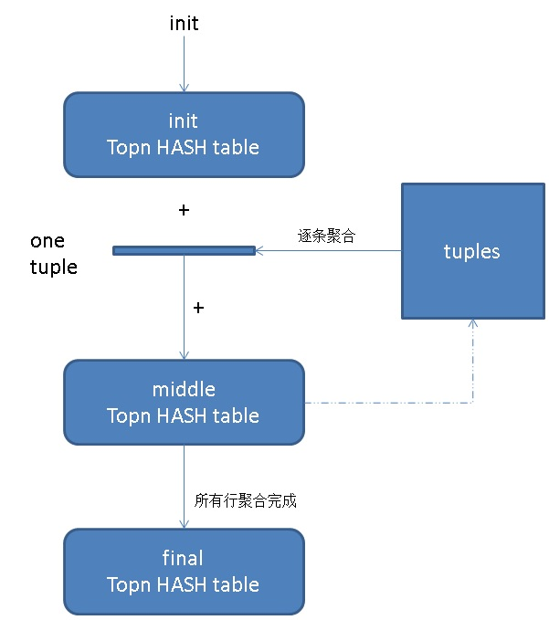

## PostgreSQL sharding : citus 系列7 - topn 加速(```count(*) group by order by count(*) desc limit x```) (use 估值插件 topn)    
                                                                 
### 作者                                                                 
digoal                                                                 
                                                                 
### 日期                                                                 
2018-09-14                                                               
                                                                 
### 标签                                                                 
PostgreSQL , topn , topn.number_of_counters , ```count(*) group by order by count(*) desc limit x```    
                                                                 
----                                                                 
                                                                 
## 背景      
```count(*) group by order by count(*) desc limit x``` 用来统计 topn。  
  
topn是运营的重要指标，比如排行前10的活跃用户。  
  
如果数据量非常庞大，统计会比较耗时，citus提供了一个topn插件，与HLL类似，核心是使用少量空间存储聚合过程中的数据，同时返回一个固定大小（参数设置topn.number_of_counters）的JSONB，可用于下次聚合。(注意，PostgreSQL 11支持更强大的hashagg parallel后，聚合大数据量已不是问题)  
  
topn插件聚合过程如图。  
  
  
  
对topn的结果使用topn_union_agg可以再次聚合。   
  
```  
postgres=# \df topn*  
                              List of functions  
 Schema |       Name       | Result data type  | Argument data types |  Type    
--------+------------------+-------------------+---------------------+--------  
 public | topn             | SETOF topn_record | jsonb, integer      | normal  
 public | topn_add         | jsonb             | jsonb, text         | normal  
 public | topn_add_agg     | jsonb             | text                | agg  
 public | topn_add_trans   | internal          | internal, text      | normal  
 public | topn_pack        | jsonb             | internal            | normal  
 public | topn_union       | jsonb             | jsonb, jsonb        | normal  
 public | topn_union_agg   | jsonb             | jsonb               | agg  
 public | topn_union_trans | internal          | internal, jsonb     | normal  
(8 rows)  
```  
  
```  
-- starting from nothing, record that we saw an "a"  
select topn_add('{}', 'a');  
-- => {"a": 1}  
  
-- record the sighting of another "a"  
select topn_add(topn_add('{}', 'a'), 'a');  
-- => {"a": 2}  
  
-- for normal_rand  
create extension tablefunc;  
  
-- count values from a normal distribution  
SELECT topn_add_agg(floor(abs(i))::text)  
  FROM normal_rand(1000, 5, 0.7) i;  
-- => {"2": 1, "3": 74, "4": 420, "5": 425, "6": 77, "7": 3}  
```  
  
从topn jsonb中直接获取topn的值  
  
```  
postgres=# select  (topn(topn_union_agg(agg_prodid),5)).* from reviews_by_prodid;  
  item  | frequency   
--------+-----------  
 509594 |        66  
 497599 |        59  
 505217 |        58  
 461257 |        58  
 403111 |        57  
(5 rows)  
```  
  
## 使用topn  
1、所有节点（包括coordinator, worker）安装topn软件  
  
  
```  
cd ~   
. /var/lib/pgsql/.bash_profile  
git clone https://github.com/citusdata/postgresql-topn  
cd postgresql-topn  
USE_PGXS=1 make  
USE_PGXS=1 make install  
```  
  
2、安装插件(coordinator)  
  
```  
postgres=# create extension topn;  
CREATE EXTENSION  
```  
  
3、安装插件(worker)，在coordinator中调用run_command_on_workers，在所有worker中执行。  
  
```  
postgres=# select run_command_on_workers('create extension topn;');  
           run_command_on_workers             
--------------------------------------------  
 (xxx.xxx.xxx.224,1921,t,"CREATE EXTENSION")  
 (xxx.xxx.xxx.225,1921,t,"CREATE EXTENSION")  
 (xxx.xxx.xxx.226,1921,t,"CREATE EXTENSION")  
 (xxx.xxx.xxx.227,1921,t,"CREATE EXTENSION")  
 (xxx.xxx.xxx.229,1921,t,"CREATE EXTENSION")  
 (xxx.xxx.xxx.230,1921,t,"CREATE EXTENSION")  
 (xxx.xxx.xxx.231,1921,t,"CREATE EXTENSION")  
 (xxx.xxx.xxx.232,1921,t,"CREATE EXTENSION")  
(8 rows)  
```  
  
### 测试  
1、测试表  
  
```  
create table tbl(id serial8,gid int, prodid int, c1 int, c2 int);  
  
postgres=# \d tbl  
                            Table "public.tbl"  
 Column |  Type   | Collation | Nullable |             Default               
--------+---------+-----------+----------+---------------------------------  
 id     | bigint  |           | not null | nextval('tbl_id_seq'::regclass)  
 gid    | integer |           |          |   
 prodid | integer |           |          |   
 c1     | integer |           |          |   
 c2     | integer |           |          |   
  
postgres=# alter sequence tbl_id_seq cache 10000;  
ALTER SEQUENCE  
```  
  
2、写入2亿测试数据  
  
```  
vi test.sql  
\set gid random_gaussian(1,1000,2.5)  
\set prodid random_gaussian(1,1000000,2.5)  
\set c1 random(1,3000)  
\set c2 random(1,100000000)  
insert into tbl(gid,prodid,c1,c2) values (:gid,:prodid,:c1,:c2);  
  
pgbench -M prepared -n -r -P 1 -f ./test.sql -c 64 -j 64 -T 1200  
```  
  
```  
postgres=# select count(*) from tbl;  
   count     
-----------  
 216524755  
(1 row)  
  
Time: 421.860 ms  
```  
  
3、几组真实的TOPN数据  
  
```  
postgres=# select gid,count(*) from tbl group by gid order by count(*) desc limit 10;  
 gid | count    
-----+--------  
 494 | 438102  
 499 | 438017  
 514 | 437929  
 506 | 437852  
 511 | 437546  
 509 | 437469  
 495 | 437458  
 490 | 437320  
 496 | 437257  
 500 | 437239  
(10 rows)  
  
postgres=# select c1,count(*) from tbl group by c1 order by count(*) desc limit 10;  
  c1  | count   
------+-------  
 1370 | 73175  
  168 | 73121  
 1016 | 73114  
 1816 | 73045  
 1463 | 73020  
  585 | 72986  
 1529 | 72974  
 1857 | 72944  
 2580 | 72930  
  298 | 72917  
(10 rows)  
  
postgres=# select prodid,count(*) from tbl group by prodid order by count(*) desc limit 10;  
 prodid | count   
--------+-------  
 516916 |   534  
 481914 |   534  
 520680 |   527  
 530544 |   526  
 449685 |   523  
 493560 |   523  
 520464 |   523  
 502098 |   522  
 495170 |   522  
 501695 |   522  
(10 rows)  
```  
  
4、gid维度估值topn (gid唯一值个数小于等于参数```topn.number_of_counters```)  
  
结果精准  
  
```  
CREATE TABLE reviews_by_gid  
(    
  agg jsonb  
);  
  
SELECT create_reference_table('reviews_by_gid');  
  
INSERT INTO reviews_by_gid  
  SELECT topn_add_agg(gid::text)  
  FROM tbl;  
  
postgres=# select  (topn(agg,5)).* from reviews_by_gid;  
 item | frequency   
------+-----------  
 494  |    438102  
 499  |    438017  
 514  |    437929  
 506  |    437852  
 511  |    437546  
(5 rows)  
```  
  
5、prodid维度估值topn (prodid唯一值个数远远大于等于参数```topn.number_of_counters```)   
  
结果偏差非常大。  
  
```  
CREATE TABLE reviews_by_prodid  
(  
  agg_prodid jsonb  
);  
  
SELECT create_reference_table('reviews_by_prodid');  
  
INSERT INTO reviews_by_prodid  
  SELECT topn_add_agg(prodid::text)  
  FROM tbl;  
  
  
postgres=# select  (topn(agg_prodid,5)).* from reviews_by_prodid;  
  item  | frequency   
--------+-----------  
 470098 |        36  
 531880 |        35  
 451724 |        34  
 420093 |        34  
 522676 |        33  
(5 rows)  
```  
  
6、c1维度估值topn (c1唯一值个数略大于等于参数```topn.number_of_counters```)   
  
结果不精准。  
  
```  
CREATE TABLE reviews_by_c1  
(  
  aggc1 jsonb  
);  
  
SELECT create_reference_table('reviews_by_c1');  
  
INSERT INTO reviews_by_c1  
  SELECT topn_add_agg(c1::text)  
  FROM tbl;  
  
  
postgres=# select  (topn(aggc1,5)).* from reviews_by_c1;  
 item | frequency   
------+-----------  
 2580 |     37073  
 1016 |     36162  
 1983 |     35311  
 1752 |     35285  
 2354 |     34740  
(5 rows)  
```  
  
## 精度、截断  
造成以上精准度偏差的原因：  
  
当topn hashtable已满，有新值写入时，会导致清除hashtable中一半的元素（item, count）pairs(指按count排序后，较小的一半)。  
  
The TopN approximation algorithm keeps a predefined number of frequent items and counters. If a new item already exists among these frequent items, the algorithm increases the item's frequency counter. Else, the algorithm inserts the new item into the counter list when there is enough space. If there isn't enough space, the algorithm evicts the bottom half of all counters. Since we typically keep counters for many more items (e.g. 100*N) than we are actually interested in, the actual top N items are unlikely to get evicted and will typically have accurate counts.  
  
You can increase the algoritm's accuracy by increasing the predefined number of frequent items/counters.  
  
对应代码  
  
```  
/*  
 * PruneHashTable removes some items from the HashTable to decrease its size. It finds  
 * minimum and maximum frequencies first and removes the items which have lower frequency  
 * than the average of them.  
 */  
static void  
PruneHashTable(HTAB *hashTable, int itemLimit, int numberOfRemainingElements)  
{  
	Size topnArraySize = 0;  
	int topnIndex = 0;  
	FrequentTopnItem *sortedTopnArray = NULL;  
	bool itemAlreadyHashed = false;  
	HASH_SEQ_STATUS status;  
	FrequentTopnItem *currentTask = NULL;  
	FrequentTopnItem *frequentTopnItem = NULL;  
	int index = 0;  
	int hashTableSize = hash_get_num_entries(hashTable);  
  
	if (hashTableSize <= itemLimit)  
	{  
		return;  
	}  
  
	/* create an array to copy top-n items and sort them later */  
	topnArraySize = sizeof(FrequentTopnItem) * hashTableSize;  
	sortedTopnArray = (FrequentTopnItem *) palloc0(topnArraySize);  
  
	hash_seq_init(&status, hashTable);  
  
	while ((currentTask = (FrequentTopnItem *) hash_seq_search(&status)) != NULL)  
	{  
		frequentTopnItem = palloc0(sizeof(FrequentTopnItem));  
		memcpy(frequentTopnItem->key, currentTask->key,  
			   sizeof(frequentTopnItem->key));  
		frequentTopnItem->frequency = currentTask->frequency;  
		sortedTopnArray[topnIndex] = *frequentTopnItem;  
  
		topnIndex++;  
	}  
  
	qsort(sortedTopnArray, hashTableSize, sizeof(FrequentTopnItem),  
		  compareFrequentTopnItem);  
  
	for (index = numberOfRemainingElements; index < hashTableSize; index++)  
	{  
		FrequentTopnItem *topnItem = &(sortedTopnArray[index]);  
  
		hash_search(hashTable, (void *) topnItem->key, HASH_REMOVE,  
					&itemAlreadyHashed);  
	}  
}  
```  
  
## 如何修改hash table size  
  
```  
postgres=# load 'topn';  
LOAD  
postgres=# show topn.number_of_counters ;  
 topn.number_of_counters   
-------------------------  
 1000  
(1 row)  
  
set topn.number_of_counters =20000;  
```  
  
需要在所有节点（coordinator+worker）操作，例如。  
  
```  
postgresql.conf  
  
shared_preload_libraries='citus,topn,pg_stat_statements'  
topn.number_of_counters=10000  
```  
  
## 小结  
### 最佳实践  
  
1、建议阶段性聚合，并且保证每个阶段被聚合的字段，唯一值个数小于```topn.number_of_counters```，否则会失真。  
  
例如每小时有1万个活跃用户，那么```topn.number_of_counters```，建议设置为1万或更大，并且按小时聚合。每个小时存一个聚合后的jsonb结果。需要统计天的结果时，再将全天的jsonb进行聚合。  
  
2、元素个数大于```topn.number_of_counters```时，会导致topn结果失真。  
  
## 参考  
https://github.com/citusdata/postgresql-topn  
  
https://docs.citusdata.com/en/v7.5/develop/reference_sql.html  
    
[《PostgreSQL count-min sketch top-n 概率计算插件 cms_topn (结合窗口实现同比、环比、滑窗分析等) - 流计算核心功能之一》](../201803/20180301_03.md)    
  
    
  
<a rel="nofollow" href="http://info.flagcounter.com/h9V1"  ></a>  
  
  
## [digoal's 大量PostgreSQL文章入口](https://github.com/digoal/blog/blob/master/README.md "22709685feb7cab07d30f30387f0a9ae")
  
