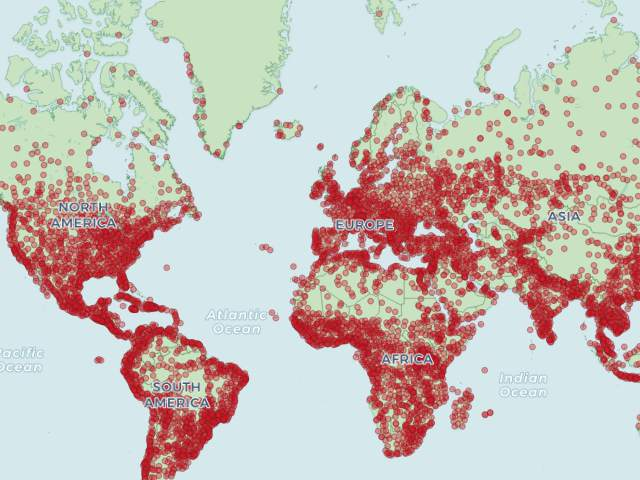

## PostgreSQL PostGIS point join polygon (by ST_xxxx) - pglz_decompress 性能优化     
                                                             
### 作者                                                             
digoal                                                             
                                                             
### 日期                                                             
2018-10-01                                                           
                                                             
### 标签                                                             
PostgreSQL , postgis , pglz_decompress , perf , tuning        
                                                             
----                                                             
                                                             
## 背景     
在空间数据中，通常会有轨迹、点、面的数据，假设有两张表，一张为面的表，一张为点的表，使用包含 ST_xxxx(c.geom, p.geom) 来进行JOIN（例如以面为单位，聚合统计点的数量）。  
  
   
  
本文介绍了空间JOIN的性能分析，瓶颈分析，优化方法。  
  
## 原文  
http://blog.cleverelephant.ca/2018/09/postgis-external-storage.html  
  
## 例子  
测试数据：  
  
  
Setup  
  
First download some polygons and some points.  
  
[Admin 0 - Countries](https://www.naturalearthdata.com/http//www.naturalearthdata.com/download/10m/cultural/ne_10m_admin_0_countries.zip)  
  
[Populated Places](https://www.naturalearthdata.com/http//www.naturalearthdata.com/download/10m/cultural/ne_10m_populated_places.zip)  
  
Load the shapes into your database.  
  
```  
shp2pgsql -s 4326 -D -I ne_10m_admin_0_countries.shp countries | psql performance  
  
shp2pgsql -s 4326 -D -I ne_10m_populated_places.shp places | psql performance  
```  
  
包含大量POINT的空间对象  
  
```  
SELECT count(*)   
  FROM countries   
  WHERE ST_NPoints(geom) > (8192 / 16);  
```  
  
1、使用默认的压缩格式时，这个空间JOIN查询，耗时25秒。  
  
```  
SELECT count(*), c.name   
  FROM countries c   
  JOIN places p   
  ON ST_Intersects(c.geom, p.geom)   
  GROUP BY c.name;  
```  
  
使用PERF或oprofile跟踪其耗时的代码  
  
[《PostgreSQL 代码性能诊断之 - OProfile & Systemtap》](../201505/20150509_01.md)    
    
[《PostgreSQL 源码性能诊断(perf profiling)指南 - 珍藏级》](../201611/20161129_01.md)     
  
发现问题是解压缩的pglz_decompress 接口造成的。  
  
[《TOAST,The Oversized-Attribute Storage Technique - 暨存储格式main, extended, external, plain介绍》](../201103/20110329_01.md)    
  
2、将空间字段改成非压缩格式，耗时降到4秒。  
  
```  
-- Change the storage type  
ALTER TABLE countries  
  ALTER COLUMN geom  
  SET STORAGE EXTERNAL;  
  
-- Force the column to rewrite  
UPDATE countries  
  SET geom = ST_SetSRID(geom, 4326);  
  
vacuum full countries;   
  
-- Re-run the query    
SELECT count(*), c.name   
  FROM countries c   
  JOIN places p   
  ON ST_Intersects(c.geom, p.geom)   
  GROUP BY c.name;  
```  
  
## 小结  
1、代码层面的性能瓶颈分析方法，perf.   
  
[《PostgreSQL 源码性能诊断(perf profiling)指南 - 珍藏级》](../201611/20161129_01.md)     
  
2、PostGIS空间相关计算函数  
  
http://postgis.net/docs/manual-dev/reference.html  
  
3、数据库表级存储格式包括4种：  
  
对于定长的字段类型，存储格式如下：    
    
```    
PLAIN     
prevents either compression or out-of-line storage; furthermore it disables use of single-byte headers for varlena types. This is the only possible strategy for columns of non-TOAST-able data types.    
```    
    
对于变长的字段类型，除了可以使用PLAIN格式，还可以使用如下存储格式：    
    
```    
EXTENDED     
allows both compression and out-of-line storage.     
This is the default for most TOAST-able data types.     
Compression will be attempted first, then out-of-line storage if the row is still too big.    
    
EXTERNAL     
allows out-of-line storage but not compression.     
Use of EXTERNAL will make substring operations on wide text and bytea columns faster (at the penalty of increased storage space) because these operations are optimized to fetch only the required parts of the out-of-line value when it is not compressed.    
    
MAIN     
allows compression but not out-of-line storage.     
(Actually, out-of-line storage will still be performed for such columns, but only as a last resort when there is no other way to make the row small enough to fit on a page.)    
```    
  
4、本文发现的瓶颈为变长字段，压缩后，解压缩的pglz_decompress 接口，所以将字段的存储格式改为非压缩格式，即提升了大量的性能。   
    
## 参考  
http://blog.cleverelephant.ca/2018/09/postgis-external-storage.html  
  
http://postgis.net/docs/manual-dev/reference.html  
  
[《TOAST,The Oversized-Attribute Storage Technique - 暨存储格式main, extended, external, plain介绍》](../201103/20110329_01.md)    
    
[《PostgreSQL 源码性能诊断(perf profiling)指南 - 珍藏级》](../201611/20161129_01.md)     
  
[《PostgreSQL 代码性能诊断之 - OProfile & Systemtap》](../201505/20150509_01.md)    
    
  
  
  
  
  
  
  
  
  
  
  
  
  
  
  
  
  
  
  
  
  
  
  
  
  
  
  
  
  
  
  
  
  
  
  
  
  
  
  
  
  
  
  
  
  
  
  
  
  
  
  
  
  
  
  
  
  
  
  
  
  
  
  
  
  
  
  
  
  
#### [PostgreSQL 许愿链接](https://github.com/digoal/blog/issues/76 "269ac3d1c492e938c0191101c7238216")
您的愿望将传达给PG kernel hacker、数据库厂商等, 帮助提高数据库产品质量和功能, 说不定下一个PG版本就有您提出的功能点. 针对非常好的提议，奖励限量版PG文化衫、纪念品、贴纸、PG热门书籍等，奖品丰富，快来许愿。[开不开森](https://github.com/digoal/blog/issues/76 "269ac3d1c492e938c0191101c7238216").  
  
  
#### [9.9元购买3个月阿里云RDS PostgreSQL实例](https://www.aliyun.com/database/postgresqlactivity "57258f76c37864c6e6d23383d05714ea")
  
  
#### [PostgreSQL 解决方案集合](https://yq.aliyun.com/topic/118 "40cff096e9ed7122c512b35d8561d9c8")
  
  
#### [德哥 / digoal's github - 公益是一辈子的事.](https://github.com/digoal/blog/blob/master/README.md "22709685feb7cab07d30f30387f0a9ae")
  
  

  
  
#### [PolarDB 学习图谱: 训练营、培训认证、在线互动实验、解决方案、生态合作、写心得拿奖品](https://www.aliyun.com/database/openpolardb/activity "8642f60e04ed0c814bf9cb9677976bd4")
  
  
#### [购买PolarDB云服务折扣活动进行中, 55元起](https://www.aliyun.com/activity/new/polardb-yunparter?userCode=bsb3t4al "e0495c413bedacabb75ff1e880be465a")
  
  
#### [About 德哥](https://github.com/digoal/blog/blob/master/me/readme.md "a37735981e7704886ffd590565582dd0")
  
