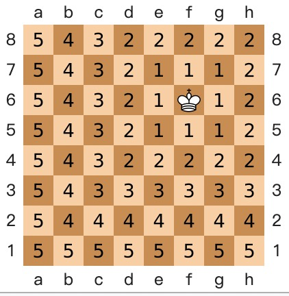

## PostgreSQL 相似人群圈选，人群扩选，向量相似 使用实践 - cube  
                                                           
### 作者                                                           
digoal                                                           
                                                           
### 日期                                                           
2018-10-11                                                         
                                                           
### 标签                                                           
PostgreSQL , cube , imgsmlr , 相似人群 , 人群扩选 , 精准营销 , 人群画像 , 推荐系统   
                                                           
----                                                           
                                                           
## 背景     
PostgreSQL 相似插件非常多，插件的功能以及用法如下：  
  
[《PostgreSQL 相似搜索插件介绍大汇总 (cube,rum,pg_trgm,smlar,imgsmlr,pg_similarity) (rum,gin,gist)》](../201809/20180904_01.md)    
  
相似人群分析在精准营销，推荐系统中的需求很多。  
  
人的属性可以使用向量来表达，每个值代表一个属性的权重值，通过向量相似，可以得到一群相似的人群。  
  
例如   
  
```  
create table tt (  
  uid int8 primary key,  
  att1 float4,  -- 属性1 的权重值   
  att2 float4,  -- 属性2 的权重值  
  att3 float4,  -- 属性3 的权重值  
  ...  
  attn float4   -- 属性n 的权重值  
);  
```  
  
使用cube表示属性  
  
```  
create table tt (  
  uid int8 primary key,  
  att cube  -- 属性  
);  
```  
  
使用cube或imgsmlr可以达到类似的目的。  
  
```  
a <-> b	float8	Euclidean distance between a and b.  
a <#> b	float8	Taxicab (L-1 metric) distance between a and b.  
a <=> b	float8	Chebyshev (L-inf metric) distance between a and b.  
```  
  
但是如果向量很大(比如属性很多)，建议使用一些方法抽象出典型的特征值，压缩向量。  类似图层，图片压缩。实际上imgsmlr就是这么做的：  
  
  
  
例如256\*256的像素，压缩成4\*4的像素，存储为特征值。  
  
## 例子  
  
1、创建插件  
  
```  
create extension cube;  
```  
  
2、创建测试表  
  
```  
create table tt (id int , c1 cube);  
```  
  
3、创建GIST索引  
  
```  
create index idx_tt_1 on tt using gist(c1);  
```  
  
4、创建生成随机CUBE的函数  
  
```  
create or replace function gen_rand_cube(int,int) returns cube as $$  
  select ('('||string_agg((random()*$2)::text, ',')||')')::cube from generate_series(1,$1);  
$$ language sql strict;  
```  
  
5、CUBE最多存100个维度  
  
```  
postgres=# \set VERBOSITY verbose  
  
postgres=# select gen_rand_cube(1000,10);  
  
ERROR:  22P02: invalid input syntax for cube  
DETAIL:  A cube cannot have more than 100 dimensions.  
CONTEXT:  SQL function "gen_rand_cube" statement 1  
LOCATION:  cube_yyparse, cubeparse.y:111  
```  
  
6、写入测试数据  
  
```  
insert into tt select id, gen_rand_cube(16, 10) from generate_series(1,10000) t(id);  
```  
  
7、通过单个特征值CUBE查询相似人群，以点搜群  
  
```  
select * from tt order by c1 <-> '(1,2,3,4,5,6,7)' limit x;  -- 个体搜群体  
```  
  
  
  
8、通过多个特征值CUBE查询相似人群，以群搜群  
  
```  
select * from tt order by c1 <-> '[(1,2,3,4,5,6,7),(1,3,4,5,6,71,3), ...]' limit x; -- 群体搜群体  
```  
  
```  
postgres=# explain select * from tt order by c1 <-> '[(1,2,3),(2,3,4)]' limit 1;  
                                QUERY PLAN                                  
--------------------------------------------------------------------------  
 Limit  (cost=0.11..0.14 rows=1 width=44)  
   ->  Index Scan using idx_tt_1 on tt  (cost=0.11..0.16 rows=2 width=44)  
         Order By: (c1 <-> '(1, 2, 3),(2, 3, 4)'::cube)  
(3 rows)  
```  
  
9、如果需要再计算压缩前的特征值的相似性，可以使用原始值再计算一遍。  
  
[《PostgreSQL 遗传学应用 - 矩阵相似距离计算 (欧式距离,...XX距离)》](../201712/20171227_01.md)    
  
```  
select *,   
  c1 <-> ?1,   -- c1表示压缩后的特征值浮点数向量，比如（4*4）  
  distance_udf(detail_c1,?2)   -- deatil_c1 表示原始特征值浮点数向量(比如128*128)    
from tt order by c1 <-> ?1 limit xx;  
```  
  
## Euclidean distance , Taxicab distance , Chebyshev distance
Euclidean distance  
   
  
Taxicab distance  
  
  
Chebyshev distance  
  
  
## 参考  
https://www.postgresql.org/docs/devel/static/cube.html  
  
https://github.com/postgrespro/imgsmlr  
  
https://github.com/eulerto/pg_similarity  
  
https://en.wikipedia.org/wiki/Euclidean_distance  
  
https://en.wikipedia.org/wiki/Chebyshev_distance  
  
https://en.wikipedia.org/wiki/Taxicab_geometry  
  
[《PostgreSQL 相似搜索插件介绍大汇总 (cube,rum,pg_trgm,smlar,imgsmlr,pg_similarity) (rum,gin,gist)》](../201809/20180904_01.md)    
    
[《PostgreSQL 11 相似图像搜索插件 imgsmlr 性能测试与优化 3 - citus 8机128shard (4亿图像)》](../201809/20180904_04.md)    
    
[《PostgreSQL 11 相似图像搜索插件 imgsmlr 性能测试与优化 2 - 单机分区表 (dblink 异步调用并行) (4亿图像)》](../201809/20180904_03.md)    
    
[《PostgreSQL 11 相似图像搜索插件 imgsmlr 性能测试与优化 1 - 单机单表 (4亿图像)》](../201809/20180904_02.md)    
    
  
  
  
  
  
  
  
  
  
  
  
  
  
  
  
  
  
  
  
  
  
  
  
  
  
  
  
  
  
  
  
  
  
  
  
  
  
  
  
  
  
  
  
  
  
  
  
  
  
  
  
  
  
  
  
  
  
  
  
  
  
  
  
  
  
  
  
  
  
#### [PostgreSQL 许愿链接](https://github.com/digoal/blog/issues/76 "269ac3d1c492e938c0191101c7238216")
您的愿望将传达给PG kernel hacker、数据库厂商等, 帮助提高数据库产品质量和功能, 说不定下一个PG版本就有您提出的功能点. 针对非常好的提议，奖励限量版PG文化衫、纪念品、贴纸、PG热门书籍等，奖品丰富，快来许愿。[开不开森](https://github.com/digoal/blog/issues/76 "269ac3d1c492e938c0191101c7238216").  
  
  
#### [9.9元购买3个月阿里云RDS PostgreSQL实例](https://www.aliyun.com/database/postgresqlactivity "57258f76c37864c6e6d23383d05714ea")
  
  
#### [PostgreSQL 解决方案集合](https://yq.aliyun.com/topic/118 "40cff096e9ed7122c512b35d8561d9c8")
  
  
#### [德哥 / digoal's github - 公益是一辈子的事.](https://github.com/digoal/blog/blob/master/README.md "22709685feb7cab07d30f30387f0a9ae")
  
  

  
  
#### [PolarDB 学习图谱: 训练营、培训认证、在线互动实验、解决方案、生态合作、写心得拿奖品](https://www.aliyun.com/database/openpolardb/activity "8642f60e04ed0c814bf9cb9677976bd4")
  
  
#### [购买PolarDB云服务折扣活动进行中, 55元起](https://www.aliyun.com/activity/new/polardb-yunparter?userCode=bsb3t4al "e0495c413bedacabb75ff1e880be465a")
  
  
#### [About 德哥](https://github.com/digoal/blog/blob/master/me/readme.md "a37735981e7704886ffd590565582dd0")
  
