## 阿里云ppas 逻辑备份(导出)、还原 - 导出到本地、从本地导入  
                                                               
### 作者                                                               
digoal                                                               
                                                               
### 日期                                                               
2018-10-18                                                            
                                                               
### 标签                                                               
PostgreSQL , ppas , enterprisedb , edb   
                                                               
----                                                               
                                                               
## 背景          
阿里云RDS PPAS是PG的企业版本，兼容PG同时兼容Oracle。  
  
由于ppas做了很多兼容ORACLE的工作，所以元数据与PG社区版本有很大不同，那么用户在使用RDS PPAS时，如果有导出、导入的需求，请使用EDB 的pg_dump, pg_restore，请不要使用pg社区版本的pg_dump与pg_restore导出导入。  
  
https://www.enterprisedb.com/  
  
https://www.enterprisedb.com/software-downloads-welcome?resource=210381&campaign=70138000000eZKmAAM&anid=1255608&ma_formid=1048  
  
### 安装edb提供的数据库软件（内置pgadmin, pg_dump, pg_restore）  
  
注册edb账号  
  
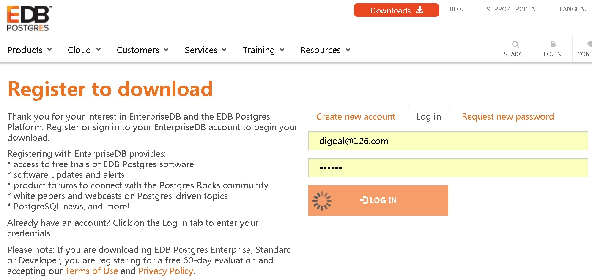  
  
下载edb提供数据库软件包  
  
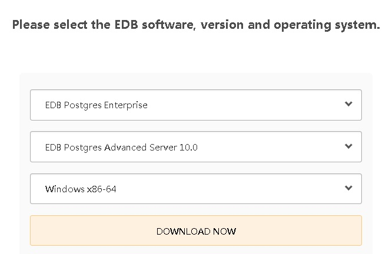  
  
  
edb-as10-server-10.5.12-1-windows-x64.exe  
  
同一edb的许可  
  
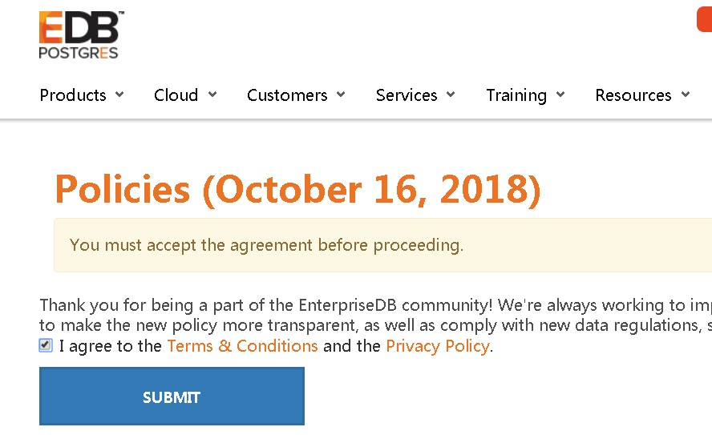  
  
安装  
  
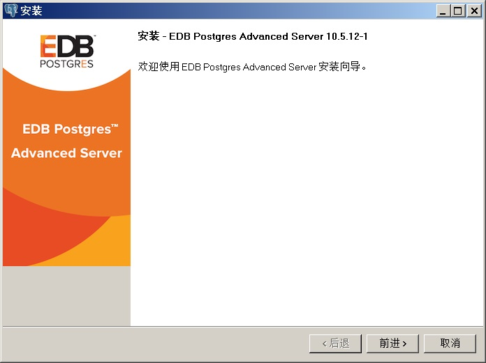  
  
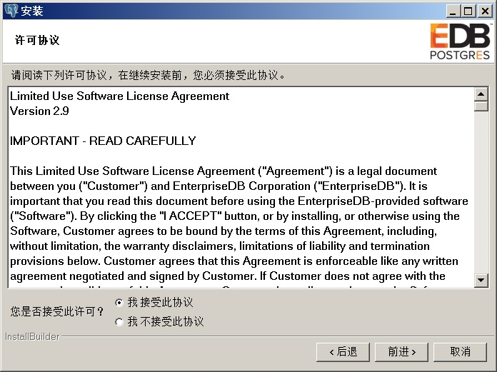  
  
指定目录，记住目录，回头可能要配置pgadmin的BIN路径  
  
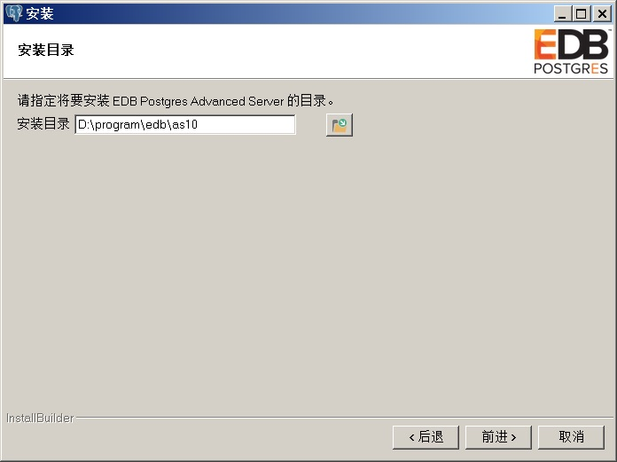  
  
安装勾选，如果只需要图形化管理软件pgadmin以及客户端命令，勾选如下  
  
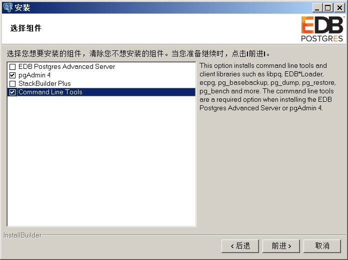  
  
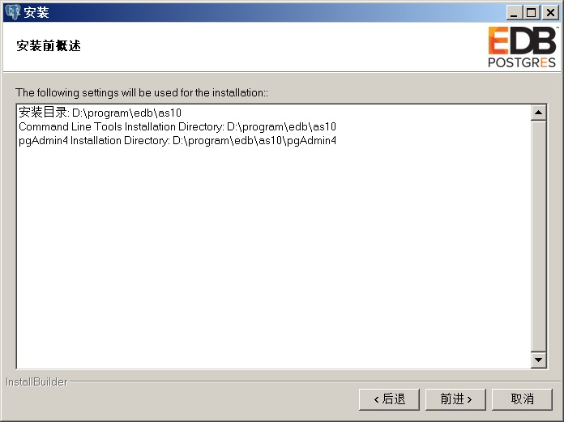  
  
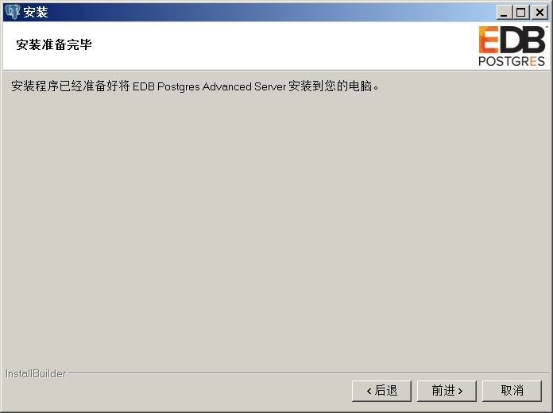  
  
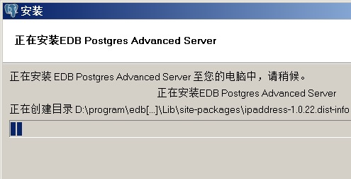  
  
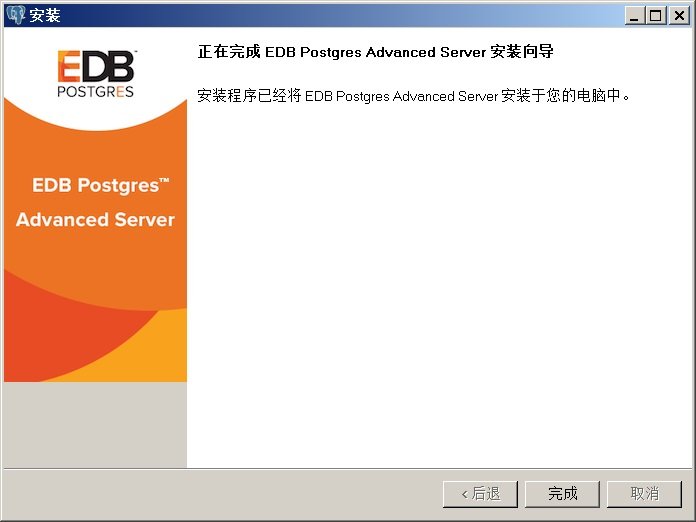  
  
如果需要安装数据库软件，插件等，则勾选另外两个。  
  
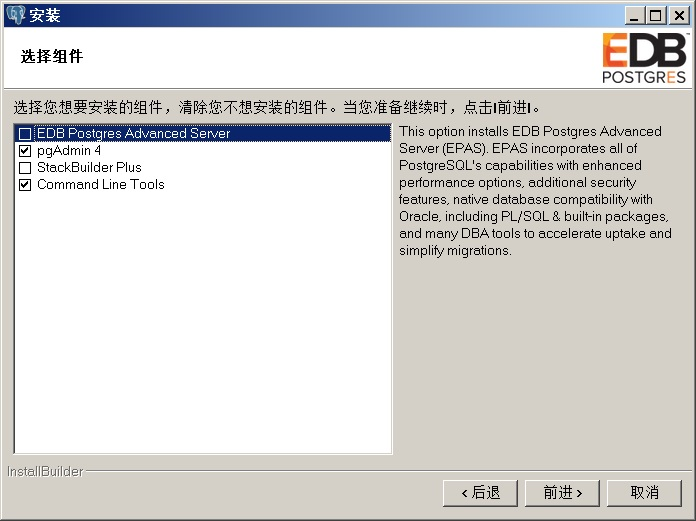  
  
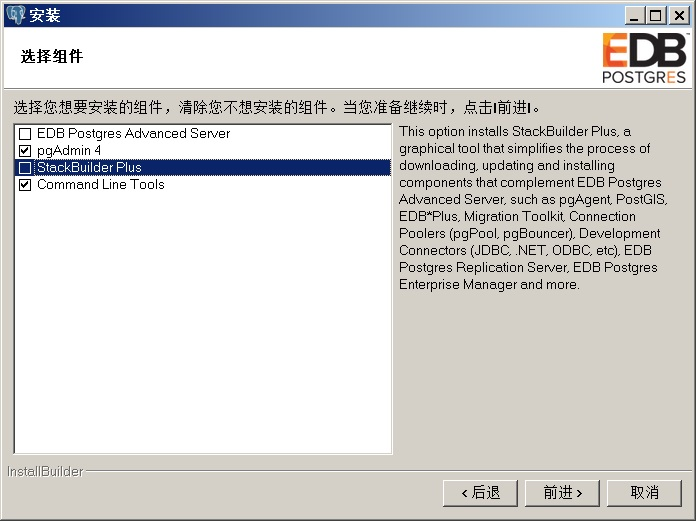  
  
## 导出、备份ppas  
直接使用edb pg_dump命令行导出，或者使用pgadmin图形化导出  
  
pgadmin导出  
  
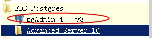  
  
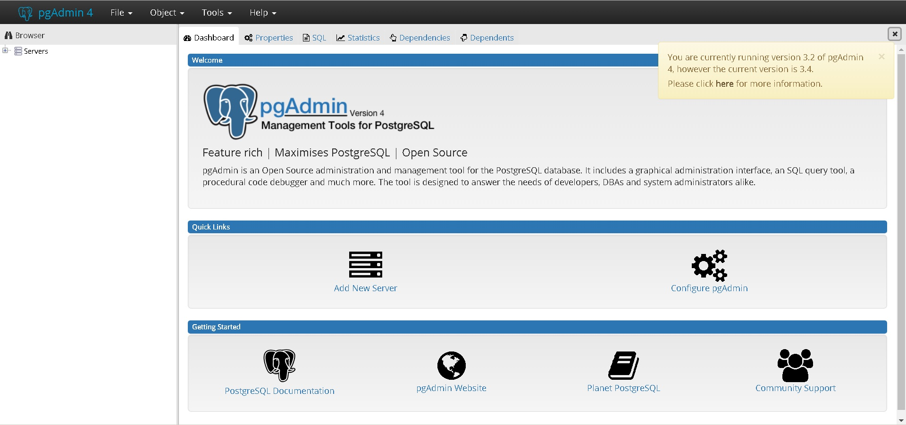  
  
配置，并连接到目标库  
  
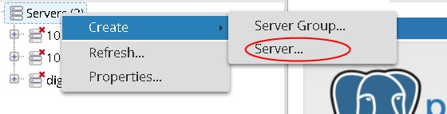  
  
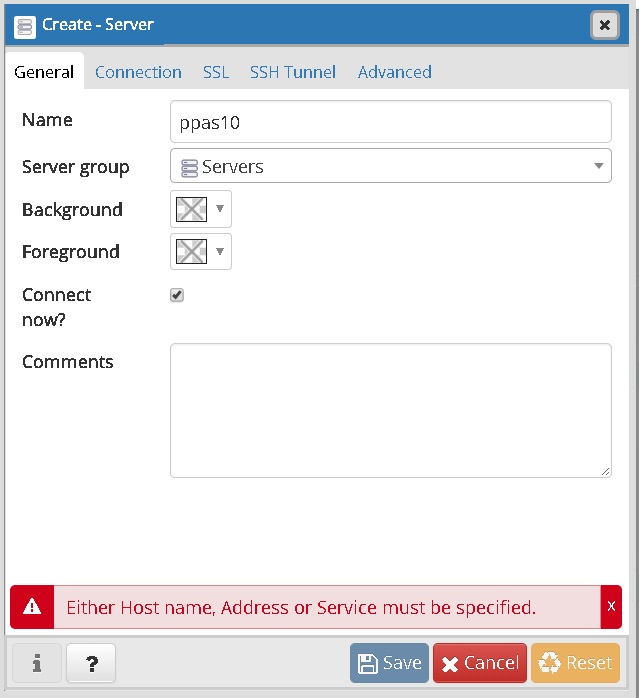  
  
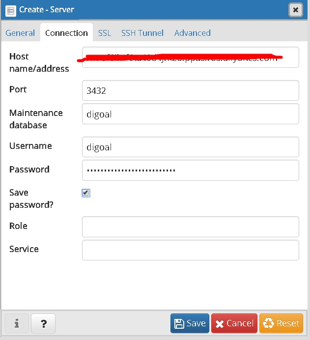  
  
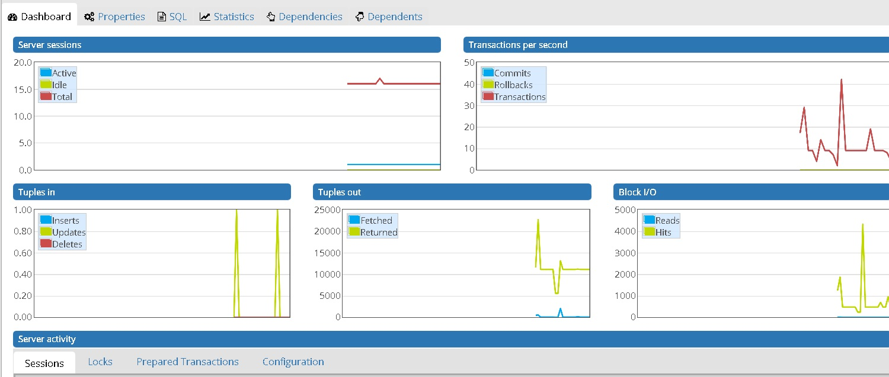  
  
配置edb pg_dump bin目录  
  
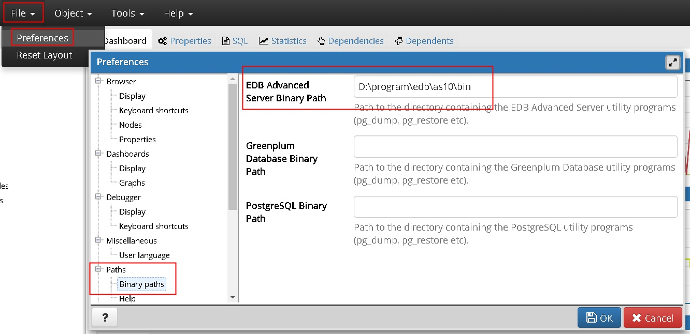  
  
备份指定数据库  
  
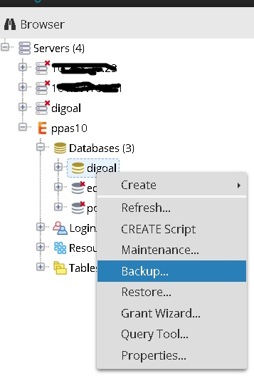  
  
指定备份的输出文件名，其他参数建dump options里面的设置，或者参考pg_dump的帮助文件  
  
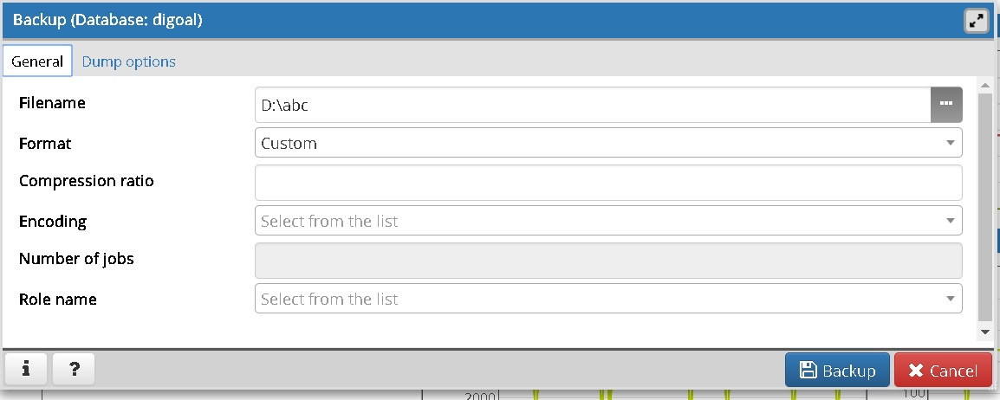  
  
开始备份  
  
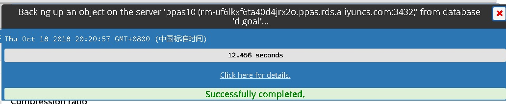  
  
## 导入、还原ppas  
直接使用edb pg_restore命令行导入，或者使用psql客户端执行SQL文件执行方式导入，或者使用pgadmin图形化导入  
  
pgadmin导入、还原  
  
创建目标库（连接到目标库）  
  
restore  
  
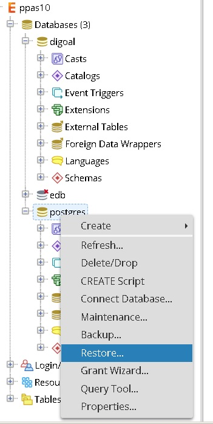  
  
指定restore的源备份文件名  
  
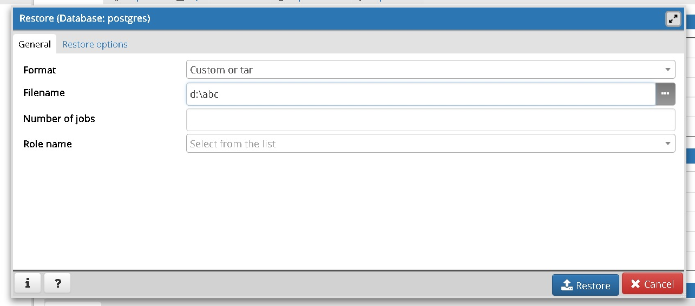  
  
还原进度  
  
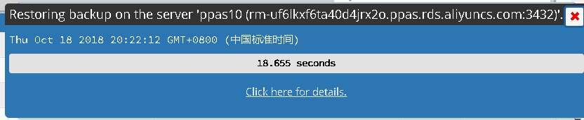  
  
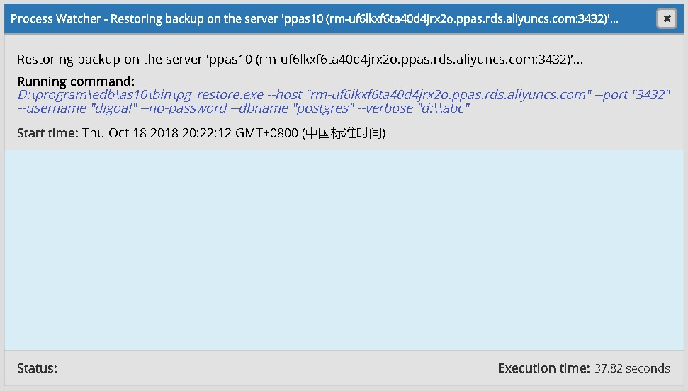  
  
## 注意  
阿里云RDS PPAS的postgres库里面有一些超级用户的表，在导出时不会有问题，但是导入时可能遇到一些权限分配告警，可以忽略。  
  
但是建议用户在使用RDS PPAS时，业务上不要使用postgres数据库，用户可以为业务创建业务库，例如app1, app2等DB。  
  
## 参考  
  
https://www.enterprisedb.com/  
  
man pg_dump  
  
pg_dump --help  
  
```  
pg_dump dumps a database as a text file or to other formats.  
  
Usage:  
  pg_dump [OPTION]... [DBNAME]  
  
General options:  
  -f, --file=FILENAME          output file or directory name  
  -F, --format=c|d|t|p         output file format (custom, directory, tar,  
                               plain text (default))  
  -j, --jobs=NUM               use this many parallel jobs to dump  
  -v, --verbose                verbose mode  
  -V, --version                output version information, then exit  
  -Z, --compress=0-9           compression level for compressed formats  
  --lock-wait-timeout=TIMEOUT  fail after waiting TIMEOUT for a table lock  
  --no-sync                    do not wait for changes to be written safely to disk  
  -?, --help                   show this help, then exit  
  
Options controlling the output content:  
  -a, --data-only              dump only the data, not the schema  
  -b, --blobs                  include large objects in dump  
  -B, --no-blobs               exclude large objects in dump  
  -c, --clean                  clean (drop) database objects before recreating  
  -C, --create                 include commands to create database in dump  
  -E, --encoding=ENCODING      dump the data in encoding ENCODING  
  -n, --schema=SCHEMA          dump the named schema(s) only  
  -N, --exclude-schema=SCHEMA  do NOT dump the named schema(s)  
  -o, --oids                   include OIDs in dump  
  -O, --no-owner               skip restoration of object ownership in  
                               plain-text format  
  -s, --schema-only            dump only the schema, no data  
  -S, --superuser=NAME         superuser user name to use in plain-text format  
  -t, --table=TABLE            dump the named table(s) only  
  -T, --exclude-table=TABLE    do NOT dump the named table(s)  
  -x, --no-privileges          do not dump privileges (grant/revoke)  
  --binary-upgrade             for use by upgrade utilities only  
  --column-inserts             dump data as INSERT commands with column names  
  --disable-dollar-quoting     disable dollar quoting, use SQL standard quoting  
  --disable-triggers           disable triggers during data-only restore  
  --enable-row-security        enable row security (dump only content user has  
                               access to)  
  --exclude-table-data=TABLE   do NOT dump data for the named table(s)  
  --if-exists                  use IF EXISTS when dropping objects  
  --inserts                    dump data as INSERT commands, rather than COPY  
  --no-publications            do not dump publications  
  --no-security-labels         do not dump security label assignments  
  --no-subscriptions           do not dump subscriptions  
  --no-synchronized-snapshots  do not use synchronized snapshots in parallel jobs  
  --no-tablespaces             do not dump tablespace assignments  
  --no-unlogged-table-data     do not dump unlogged table data  
  --quote-all-identifiers      quote all identifiers, even if not key words  
  --section=SECTION            dump named section (pre-data, data, or post-data)  
  --serializable-deferrable    wait until the dump can run without anomalies  
  --snapshot=SNAPSHOT          use given snapshot for the dump  
  --strict-names               require table and/or schema include patterns to  
                               match at least one entity each  
  --use-set-session-authorization  
                               use SET SESSION AUTHORIZATION commands instead of  
                               ALTER OWNER commands to set ownership  
  
Connection options:  
  -d, --dbname=DBNAME      database to dump  
  -h, --host=HOSTNAME      database server host or socket directory  
  -p, --port=PORT          database server port number  
  -U, --username=NAME      connect as specified database user  
  -w, --no-password        never prompt for password  
  -W, --password           force password prompt (should happen automatically)  
  --role=ROLENAME          do SET ROLE before dump  
  
If no database name is supplied, then the PGDATABASE environment  
variable value is used.  
  
Report bugs to <support@enterprisedb.com>.  
```  
    
  
<a rel="nofollow" href="http://info.flagcounter.com/h9V1"  ></a>  
  
  
## [digoal's 大量PostgreSQL文章入口](https://github.com/digoal/blog/blob/master/README.md "22709685feb7cab07d30f30387f0a9ae")
  
