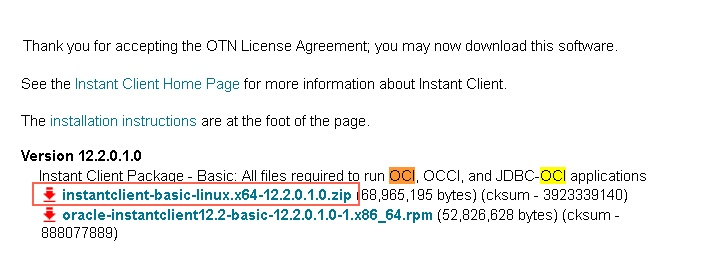

## PostgreSQL(PPAS 兼容Oracle) 从零开始入门手册 - 珍藏版   
                                                                       
### 作者                                                                       
digoal                                                                       
                                                                       
### 日期                                                                       
2018-11-02                                                                    
                                                                       
### 标签                                                                       
PostgreSQL , edb , ppas , Oracle 兼容    
                                                                       
----                                                                       
                                                                       
## 背景       
[云数据库PPAS版](https://www.aliyun.com/product/rds/ppas)，是阿里云与EnterpriseDB公司(简称EDB)合作基于PostgreSQL高度兼容Oracle语法的数据库服务，为用户提供易于操作的迁移工具，兼容范围涵盖：PL/SQL、数据类型、高级函数、表分区等。  
  
用户可以直接在阿里云[购买PPAS](https://www.aliyun.com/product/rds/ppas)进行使用。  
  
如果在购买PPAS前，想试用一下，可以去EDB网站下载，并部署相关的插件。  
  
# 一、测试环境安装部署EDB  
## 服务器  
  
以阿里云ECS为例。  
  
1、CPU  
  
```  
# lscpu  
Architecture:          x86_64  
CPU op-mode(s):        32-bit, 64-bit  
Byte Order:            Little Endian  
CPU(s):                64  
On-line CPU(s) list:   0-63  
Thread(s) per core:    2  
Core(s) per socket:    32  
Socket(s):             1  
NUMA node(s):          1  
Vendor ID:             GenuineIntel  
CPU family:            6  
Model:                 85  
Model name:            Intel(R) Xeon(R) Platinum 8163 CPU @ 2.50GHz  
Stepping:              4  
CPU MHz:               2500.008  
BogoMIPS:              5000.01  
Hypervisor vendor:     KVM  
Virtualization type:   full  
L1d cache:             32K  
L1i cache:             32K  
L2 cache:              1024K  
L3 cache:              33792K  
NUMA node0 CPU(s):     0-63  
Flags:                 fpu vme de pse tsc msr pae mce cx8 apic sep mtrr pge mca cmov pat pse36 clflush mmx fxsr sse sse2 ss ht syscall nx pdpe1gb rdtscp lm constant_tsc rep_good nopl eagerfpu pni pclmulqdq ssse3 fma cx16 pcid sse4_1 sse4_2 x2apic movbe popcnt tsc_deadline_timer aes xsave avx f16c rdrand hypervisor lahf_lm abm 3dnowprefetch fsgsbase tsc_adjust bmi1 hle avx2 smep bmi2 erms invpcid rtm mpx avx512f avx512dq rdseed adx smap avx512cd avx512bw avx512vl xsaveopt xsavec xgetbv1  
```  
  
2、DISK  
  
```  
# lsblk  
NAME            MAJ:MIN RM  SIZE RO TYPE MOUNTPOINT  
vda             253:0    0  200G  0 disk   
└─vda1          253:1    0  200G  0 part /  
vdb             253:16   0  1.8T  0 disk   
├─vgdata01-lv01 252:0    0    4T  0 lvm  /data01  
├─vgdata01-lv02 252:1    0    4T  0 lvm  /data02  
├─vgdata01-lv03 252:2    0    4T  0 lvm  /data03  
└─vgdata01-lv04 252:3    0    2T  0 lvm  /data04  
vdc             253:32   0  1.8T  0 disk   
├─vgdata01-lv01 252:0    0    4T  0 lvm  /data01  
├─vgdata01-lv02 252:1    0    4T  0 lvm  /data02  
├─vgdata01-lv03 252:2    0    4T  0 lvm  /data03  
└─vgdata01-lv04 252:3    0    2T  0 lvm  /data04  
vdd             253:48   0  1.8T  0 disk   
├─vgdata01-lv01 252:0    0    4T  0 lvm  /data01  
├─vgdata01-lv02 252:1    0    4T  0 lvm  /data02  
├─vgdata01-lv03 252:2    0    4T  0 lvm  /data03  
└─vgdata01-lv04 252:3    0    2T  0 lvm  /data04  
vde             253:64   0  1.8T  0 disk   
├─vgdata01-lv01 252:0    0    4T  0 lvm  /data01  
├─vgdata01-lv02 252:1    0    4T  0 lvm  /data02  
├─vgdata01-lv03 252:2    0    4T  0 lvm  /data03  
└─vgdata01-lv04 252:3    0    2T  0 lvm  /data04  
vdf             253:80   0  1.8T  0 disk   
├─vgdata01-lv01 252:0    0    4T  0 lvm  /data01  
├─vgdata01-lv02 252:1    0    4T  0 lvm  /data02  
├─vgdata01-lv03 252:2    0    4T  0 lvm  /data03  
└─vgdata01-lv04 252:3    0    2T  0 lvm  /data04  
vdg             253:96   0  1.8T  0 disk   
├─vgdata01-lv01 252:0    0    4T  0 lvm  /data01  
├─vgdata01-lv02 252:1    0    4T  0 lvm  /data02  
├─vgdata01-lv03 252:2    0    4T  0 lvm  /data03  
└─vgdata01-lv04 252:3    0    2T  0 lvm  /data04  
vdh             253:112  0  1.8T  0 disk   
├─vgdata01-lv01 252:0    0    4T  0 lvm  /data01  
├─vgdata01-lv02 252:1    0    4T  0 lvm  /data02  
├─vgdata01-lv03 252:2    0    4T  0 lvm  /data03  
└─vgdata01-lv04 252:3    0    2T  0 lvm  /data04  
vdi             253:128  0  1.8T  0 disk   
├─vgdata01-lv01 252:0    0    4T  0 lvm  /data01  
├─vgdata01-lv02 252:1    0    4T  0 lvm  /data02  
├─vgdata01-lv03 252:2    0    4T  0 lvm  /data03  
└─vgdata01-lv04 252:3    0    2T  0 lvm  /data04  
```  
  
3、MEM  
  
```  
# free -m  
              total        used        free      shared  buff/cache   available  
Mem:         515815      318010      109199           8       88605      194736  
Swap:             0           0           0  
```  
  
## 操作系统  
  
以CentOS 7.x x64为例。  
  
1、存储  
  
```    
dd if=/dev/zero of=/dev/vdb bs=1024 count=1024    
dd if=/dev/zero of=/dev/vdc bs=1024 count=1024    
dd if=/dev/zero of=/dev/vdd bs=1024 count=1024    
dd if=/dev/zero of=/dev/vde bs=1024 count=1024    
dd if=/dev/zero of=/dev/vdf bs=1024 count=1024    
dd if=/dev/zero of=/dev/vdg bs=1024 count=1024    
dd if=/dev/zero of=/dev/vdh bs=1024 count=1024    
dd if=/dev/zero of=/dev/vdi bs=1024 count=1024    
    
    
pvcreate /dev/vd[b-i]    
    
    
vgcreate -A y -s 128M vgdata01 /dev/vd[b-i]    
    
    
lvcreate -A y -i 8 -I 8 -L 4096GiB -n lv01 vgdata01    
lvcreate -A y -i 8 -I 8 -L 4096GiB -n lv02 vgdata01    
lvcreate -A y -i 8 -I 8 -L 4096GiB -n lv03 vgdata01    
```    
  
2、文件系统  
  
```    
mkfs.ext4 /dev/mapper/vgdata01-lv01 -m 0 -O extent,uninit_bg -E lazy_itable_init=1,stride=2,stripe_width=16 -b 4096 -T largefile -L lv01    
mkfs.ext4 /dev/mapper/vgdata01-lv02 -m 0 -O extent,uninit_bg -E lazy_itable_init=1,stride=2,stripe_width=16 -b 4096 -T largefile -L lv02    
mkfs.ext4 /dev/mapper/vgdata01-lv03 -m 0 -O extent,uninit_bg -E lazy_itable_init=1,stride=2,stripe_width=16 -b 4096 -T largefile -L lv03    
```    
  
```    
vi /etc/fstab     
LABEL=lv01 /data01 ext4 defaults,noatime,nodiratime,nodelalloc,barrier=0,data=writeback 0 0    
LABEL=lv02 /data02 ext4 defaults,noatime,nodiratime,nodelalloc,barrier=0,data=writeback 0 0    
LABEL=lv03 /data03 ext4 defaults,noatime,nodiratime,nodelalloc,barrier=0,data=writeback 0 0    
    
    
mkdir /data01    
mkdir /data02    
mkdir /data03    
    
    
mount -a    
```    
  
3、内核参数  
  
```    
vi /etc/sysctl.conf    
    
# add by digoal.zhou        
fs.aio-max-nr = 1048576        
fs.file-max = 76724600        
        
# 可选：kernel.core_pattern = /data01/corefiles/core_%e_%u_%t_%s.%p                 
# /data01/corefiles 事先建好，权限777，如果是软链接，对应的目录修改为777        
        
kernel.sem = 4096 2147483647 2147483646 512000            
# 信号量, ipcs -l 或 -u 查看，每16个进程一组，每组信号量需要17个信号量。        
        
kernel.shmall = 107374182              
# 所有共享内存段相加大小限制 (建议内存的80%)，单位为页。        
kernel.shmmax = 274877906944           
# 最大单个共享内存段大小 (建议为内存一半), >9.2的版本已大幅降低共享内存的使用，单位为字节。        
kernel.shmmni = 819200                 
# 一共能生成多少共享内存段，每个PG数据库集群至少2个共享内存段        
        
net.core.netdev_max_backlog = 10000        
net.core.rmem_default = 262144               
# The default setting of the socket receive buffer in bytes.        
net.core.rmem_max = 4194304                  
# The maximum receive socket buffer size in bytes        
net.core.wmem_default = 262144               
# The default setting (in bytes) of the socket send buffer.        
net.core.wmem_max = 4194304                  
# The maximum send socket buffer size in bytes.        
net.core.somaxconn = 4096        
net.ipv4.tcp_max_syn_backlog = 4096        
net.ipv4.tcp_keepalive_intvl = 20        
net.ipv4.tcp_keepalive_probes = 3        
net.ipv4.tcp_keepalive_time = 60        
net.ipv4.tcp_mem = 8388608 12582912 16777216        
net.ipv4.tcp_fin_timeout = 5        
net.ipv4.tcp_synack_retries = 2        
net.ipv4.tcp_syncookies = 1            
# 开启SYN Cookies。当出现SYN等待队列溢出时，启用cookie来处理，可防范少量的SYN攻击        
net.ipv4.tcp_timestamps = 1            
# 减少time_wait        
net.ipv4.tcp_tw_recycle = 0            
# 如果=1则开启TCP连接中TIME-WAIT套接字的快速回收，但是NAT环境可能导致连接失败，建议服务端关闭它        
net.ipv4.tcp_tw_reuse = 1              
# 开启重用。允许将TIME-WAIT套接字重新用于新的TCP连接        
net.ipv4.tcp_max_tw_buckets = 262144        
net.ipv4.tcp_rmem = 8192 87380 16777216        
net.ipv4.tcp_wmem = 8192 65536 16777216        
        
net.nf_conntrack_max = 1200000        
net.netfilter.nf_conntrack_max = 1200000        
        
vm.dirty_background_bytes = 409600000               
#  系统脏页到达这个值，系统后台刷脏页调度进程 pdflush（或其他） 自动将(dirty_expire_centisecs/100）秒前的脏页刷到磁盘        
#  默认为10%，大内存机器建议调整为直接指定多少字节        
        
vm.dirty_expire_centisecs = 3000                     
#  比这个值老的脏页，将被刷到磁盘。3000表示30秒。        
vm.dirty_ratio = 95                                  
#  如果系统进程刷脏页太慢，使得系统脏页超过内存 95 % 时，则用户进程如果有写磁盘的操作（如fsync, fdatasync等调用），则需要主动把系统脏页刷出。        
#  有效防止用户进程刷脏页，在单机多实例，并且使用CGROUP限制单实例IOPS的情况下非常有效。          
        
vm.dirty_writeback_centisecs = 100                    
#  pdflush（或其他）后台刷脏页进程的唤醒间隔， 100表示1秒。        
        
vm.swappiness = 0        
#  不使用交换分区        
        
vm.mmap_min_addr = 65536        
vm.overcommit_memory = 0             
#  在分配内存时，允许少量over malloc, 如果设置为 1, 则认为总是有足够的内存，内存较少的测试环境可以使用 1 .          
        
vm.overcommit_ratio = 90             
#  当overcommit_memory = 2 时，用于参与计算允许指派的内存大小。        
vm.swappiness = 0                    
#  关闭交换分区        
vm.zone_reclaim_mode = 0             
# 禁用 numa, 或者在vmlinux中禁止.         
net.ipv4.ip_local_port_range = 40000 65535            
# 本地自动分配的TCP, UDP端口号范围        
fs.nr_open=20480000        
# 单个进程允许打开的文件句柄上限        
net.ipv4.tcp_max_syn_backlog = 16384
net.core.somaxconn = 16384
        
# 以下参数请注意        
# vm.extra_free_kbytes = 4096000        
# vm.min_free_kbytes = 2097152    # vm.min_free_kbytes 建议每32G内存分配1G vm.min_free_kbytes    
# 如果是小内存机器，以上两个值不建议设置        
# vm.nr_hugepages = 66536            
#  建议shared buffer设置超过64GB时 使用大页，页大小 /proc/meminfo Hugepagesize        
# vm.lowmem_reserve_ratio = 1 1 1        
# 对于内存大于64G时，建议设置，否则建议默认值 256 256 32    
```   
  
```  
sysctl -p  
```  
  
4、资源限制  
  
```    
vi /etc/security/limits.d/20-nproc.conf  
    
# nofile超过1048576的话，一定要先将sysctl的fs.nr_open设置为更大的值，并生效后才能继续设置nofile.        
        
* soft    nofile  1024000        
* hard    nofile  1024000        
* soft    nproc   unlimited        
* hard    nproc   unlimited        
* soft    core    unlimited        
* hard    core    unlimited        
* soft    memlock unlimited        
* hard    memlock unlimited       
```  
  
5、关闭透明大页    
    
```    
vi /etc/rc.local    
    
touch /var/lock/subsys/local    
         
if test -f /sys/kernel/mm/transparent_hugepage/enabled; then        
   echo never > /sys/kernel/mm/transparent_hugepage/enabled        
fi        
su - postgres -c "pg_ctl start"      
```   
  
6、防火墙  
  
```  
iptables 配置，略  
```  
  
7、selinux  
  
```  
vi /etc/selinux/config   
  
SELINUX=disabled  
SELINUXTYPE=targeted  
```  
  
```  
# setenforce 0  
setenforce: SELinux is disabled  
```  
  
8、依赖包  
  
  
```  
yum -y install coreutils glib2 lrzsz dstat sysstat e4fsprogs xfsprogs ntp readline-devel zlib-devel openssl-devel pam-devel libxml2-devel libxslt-devel python-devel tcl-devel gcc gcc-c++ make smartmontools flex bison perl-devel perl-ExtUtils* openldap-devel jadetex  openjade bzip2 iotop perf cmake3   
```  
  
建议重启一下机器。  
  
## EDB 数据库软件  
EDB EPAS 11版本开始，只支持YUM资源安装，无法直接下载二进制。   
  
11开始的版本参考如下文档配置YUM进行安装(```yum install -y edb-as11-server```)：   
  
[《MTK使用 - PG,PPAS,oracle,mysql,ms sql,sybase 迁移到 PG, PPAS (支持跨版本升级)》](../201812/20181226_01.md)  
  
下面以10.5 版本为例，介绍edb epas 10的安装过程。  
  
1、下载软件  
  
https://www.enterprisedb.com/advanced-downloads  
  
OPTION A - EDB POSTGRES™ ADVANCED SERVER  
  
v10.5 , Linux x86-64 , Interactive Installer   
  
注意：  
  
Note: For the Enterprise subscription , choose EDB Postgres™ Advanced Server.   
  
For the Standard subscription, choose PostgreSQL.   
  
For the Developer subscription, choose either database.   
  
The Developer subscription is for use in non-production environments only.   
  
```  
wget https://get.enterprisedb.com/advstacks/edb-as10-server-10.5.12-1-linux-x64.run  
```  
  
  
2、安装软件  
  
```  
su - root  
  
chmod 700 edb-as10-server-10.5.12-1-linux-x64.run   
  
./edb-as10-server-10.5.12-1-linux-x64.run   
  
Press [Enter] to continue:  
Do you accept this license? [y/n]: y  
  
同意许可。  
  
指定EDB软件安装目录  
  
Installation Directory [/opt/edb/as10]:   
  
----------------------------------------------------------------------------  
Select the components you want to install; clear the components you do not want   
to install. Click Next when you are ready to continue.  
  
选择要安装的组件  
  
EDB Postgres Advanced Server [Y/n] :Y  
  
pgAdmin 4 [Y/n] :n  
  
StackBuilder Plus [Y/n] :n  
  
Command Line Tools [Y/n] :Y  
  
Is the selection above correct? [Y/n]: Y  
```  
  
2\.1、数据、REDO目录  
  
```  
# mkdir /data04/ppas10  
  
# mkdir /data04/ppas10_wal  
```  
  
2\.2、  
  
```  
----------------------------------------------------------------------------  
Additional Directories  
  
指定数据、REDO目录  
  
Please select a directory under which to store your data.  
  
Data Directory [/opt/edb/as10/data]: /data04/ppas10  
  
Please select a directory under which to store your Write-Ahead Logs.  
  
Write-Ahead Log (WAL) Directory [/opt/edb/as10/data/pg_wal]: /data04/ppas10_wal  
  
----------------------------------------------------------------------------  
Advanced Server Dialect  
  
EDB Postgres Advanced Server can be configured in one of two "Dialects" - 1) Compatible with Oracle or 2) Compatible with Postgres.  
  
If you select Compatible with Oracle, Advanced Server will be configured with appropriate data type conversions,   
time and date formats, Oracle-styled operators, dictionary views and more.   
This makes it easier to migrate or write new applications that are more compatible with the Oracle database.  
  
If you select Compatible with Postgres, Advanced Server will be configured with standard PostgeSQL data types, time/date formats and operators.  
  
指定兼容PostgreSQL还是兼容Oracle模式。  
  
Advanced Server Dialect  
  
[1] Compatible with Oracle  
[2] Compatible with Postgres  
Please choose an option [1] : 1  
  
----------------------------------------------------------------------------  
Please provide a password for the database superuser (enterprisedb). A locked   
Unix user account (enterprisedb) will be created if not present.  
  
设置数据库超级用户enterprisedb的密码  
  
Password :   
Retype Password :  
----------------------------------------------------------------------------  
 Additional Configuration  
  
Please select the port number the server should listen on.  
  
设置数据库监听端口  
  
Port [5444]: 4001    
  
Select the locale to be used by the new database cluster.  
  
Locale  
  
[1] [Default locale]  
....  
[232] en_US  
[233] en_US.iso88591  
[234] en_US.iso885915  
[235] en_US.utf8  
...  
[762] zh_CN  
[763] zh_CN.gb2312  
[764] zh_CN.utf8  
[765] zh_HK.utf8  
[766] zh_SG  
[767] zh_SG.gb2312  
[768] zh_SG.utf8  
[769] zh_TW.euctw  
[770] zh_TW.utf8  
[771] zu_ZA  
[772] zu_ZA.iso88591  
[773] zu_ZA.utf8  
  
设置location, 字符集  
  
Please choose an option [1] : 235  
  
Would you like to install sample tables and procedures?  
  
是否安装样例模板  
  
Install sample tables and procedures. [Y/n]: n  
  
  
----------------------------------------------------------------------------  
Dynatune Dynamic Tuning:  
Server Utilization  
  
Please select the type of server to determine the amount of system resources   
that may be utilized:  
  
  
配置数据库所在服务器的属性（独占，开发模式，混合模式）。  
  
[1] Development (e.g. a developer's laptop)  
[2] General Purpose (e.g. a web or application server)  
[3] Dedicated (a server running only Advanced Server)  
Please choose an option [2] : 3  
  
----------------------------------------------------------------------------  
Dynatune Dynamic Tuning:  
Workload Profile  
  
Please select the type of workload this server will be used for:  
  
  
设置数据库的使用场景，OLTP或OLAP或混合模式  
  
[1] Transaction Processing (OLTP systems)  
[2] General Purpose (OLTP and reporting workloads)  
[3] Reporting (Complex queries or OLAP workloads)  
Please choose an option [1] : 2  
  
----------------------------------------------------------------------------  
Pre Installation Summary  
  
The following settings will be used for the installation::  
  
再次确认配置  
  
Installation Directory: /opt/edb/as10  
Server Installation Directory: /opt/edb/as10  
Data Directory: /data04/ppas10  
WAL Directory: /data04/ppas10_wal  
Database Port: 4001  
Database Superuser: enterprisedb  
Operating System Account: enterprisedb  
Database Service: edb-as-10  
Command Line Tools Installation Directory: /opt/edb/as10  
  
Press [Enter] to continue:  
  
----------------------------------------------------------------------------  
Setup is now ready to begin installing EDB Postgres Advanced Server on your   
computer.  
  
  
开始安装  
  
Do you want to continue? [Y/n]: Y  
  
----------------------------------------------------------------------------  
Please wait while Setup installs EDB Postgres Advanced Server on your computer.  
  
 Installing EDB Postgres Advanced Server   
 0% ______________ 50% ______________ 100%  
 ########################################  
```  
  
  
  
3、配置enterprisedb用户环境变量  
  
```  
修改软件目录OWNER  
  
# chown -R enterprisedb:enterprisedb /opt/edb/as10  
  
配置enterprisedb用户的环境变量  
  
# vi /opt/edb/as10/.bash_profile  
  
export PS1="$USER@`/bin/hostname -s`-> "  
export PGPORT=4001  
export PGDATA=/data04/ppas10  
export LANG=en_US.utf8  
export PGHOME=/opt/edb/as10  
export LD_LIBRARY_PATH=$PGHOME/lib:/lib64:/usr/lib64:/usr/local/lib64:/lib:/usr/lib:/usr/local/lib:$LD_LIBRARY_PATH  
export DATE=`date +"%Y%m%d%H%M"`  
export PATH=$PGHOME/bin:$PATH:.  
export MANPATH=$PGHOME/share/man:$MANPATH  
export PGHOST=$PGDATA  
export PGUSER=enterprisedb  
export PGDATABASE=postgres  
alias rm='rm -i'  
alias ll='ls -lh'  
alias cmake=cmake3  
unalias vi    
```  
  
  
4、初始化数据库集群(安装软件时已初始化，以下略)  
  
如果你需要在一台服务器上初始化多个数据库实例，可以参照执行：  
  
数据目录与WAL日志目录(注意，这些是数据和redo日志目录，所以必须有别于其他数据库实例已经存在的目录。)  
  
```  
# mkdir ppas10_8001  
  
# mkdir /data04/ppas10_wal_8001  
  
# chown -R enterprisedb:enterprisedb /data04/ppas10*  
  
# chmod 700 /data04/ppas10_wal_8001  
  
su - enterprisedb  
```  
  
如果你想兼容Oracle，使用如下手段初始化  
  
```  
initdb -D ppas10_8001 -E UTF8 --lc-collate=C --lc-ctype=en_US.utf8 -U enterprisedb -W -X /data04/ppas10_wal_8001 --redwood-like   
```  
  
如果你想兼容PostgreSQL，使用如下手段初始化  
  
```  
initdb -D ppas10_8001 -E UTF8 --lc-collate=C --lc-ctype=en_US.utf8 -U enterprisedb -W -X /data04/ppas10_wal_8001  
```  
  
当然，在初始化后，还可以通过修改参数来实现兼容Oracle或PostgreSQL  
  
[《EDB PPAS (PostgreSQL plus advanced server) 10 参数模板 - 珍藏级》](../201805/20180522_04.md)    
  
  
5、安装Oracle OCI(可选)  
  
安装Oracle OCI      
  
[《PostgreSQL 商用版本EPAS(阿里云ppas) - 测试环境部署(EPAS 安装、配置、管理、Oracle DBLINK、外表)》](../201801/20180119_01.md)    
       
安装Oracle OCI。这样才可以在EDB数据库中建立ORACLE的DBLINK。       
       
http://www.oracle.com/technetwork/database/features/instant-client/index-097480.html       
       
选择下载包含OCI的包（ 需要输入Oracle的账号密码，可以免费注册。）       
       
       
       
       
       
将安装包上传到服务器，解压，放到EDB的PGHOME目录(本文/opt/edb/as10)，并建立软链。详情参考       
       
https://www.enterprisedb.com/docs/en/10.0/Ora_Compat_Dev_Guide/Database_Compatibility_for_Oracle_Developers_Guide.1.124.html#       
       
操作如下       
       
```       
# cd /opt/edb/as10  
[root@digoal ~]# mkdir oci       
[root@digoal ~]# mv instantclient-basic-linux.x64-12.2.0.1.0.zip oci/       
[root@digoal ~]# cd oci       
[root@digoal oci]# ll       
total 67356       
-rw-r--r-- 1 root root 68965195 Jan 19 11:00 instantclient-basic-linux.x64-12.2.0.1.0.zip       
[root@digoal oci]# unzip instantclient-basic-linux.x64-12.2.0.1.0.zip        
Archive:  instantclient-basic-linux.x64-12.2.0.1.0.zip       
  inflating: instantclient_12_2/adrci         
  inflating: instantclient_12_2/BASIC_README         
  inflating: instantclient_12_2/genezi         
  inflating: instantclient_12_2/libclntshcore.so.12.1         
  inflating: instantclient_12_2/libclntsh.so.12.1         
  inflating: instantclient_12_2/libipc1.so         
  inflating: instantclient_12_2/libmql1.so         
  inflating: instantclient_12_2/libnnz12.so         
  inflating: instantclient_12_2/libocci.so.12.1         
  inflating: instantclient_12_2/libociei.so         
  inflating: instantclient_12_2/libocijdbc12.so         
  inflating: instantclient_12_2/libons.so         
  inflating: instantclient_12_2/liboramysql12.so         
  inflating: instantclient_12_2/ojdbc8.jar         
  inflating: instantclient_12_2/uidrvci         
  inflating: instantclient_12_2/xstreams.jar         
[root@digoal oci]# ll       
total 67360       
drwxr-xr-x 2 root root     4096 Jan 19 11:02 instantclient_12_2       
-rw-r--r-- 1 root root 68965195 Jan 19 11:00 instantclient-basic-linux.x64-12.2.0.1.0.zip       
  
[root@digoal oci]# cd instantclient_12_2/       
[root@digoal instantclient_12_2]# ll       
total 216696       
-rwxrwxr-x 1 root root     44220 Jan 26  2017 adrci       
-rw-rw-r-- 1 root root       363 Jan 26  2017 BASIC_README       
-rwxrwxr-x 1 root root     57272 Jan 26  2017 genezi       
-rwxrwxr-x 1 root root   8033199 Jan 26  2017 libclntshcore.so.12.1       
-rwxrwxr-x 1 root root  71638263 Jan 26  2017 libclntsh.so.12.1       
-r-xr-xr-x 1 root root   2981501 Jan 26  2017 libipc1.so       
-r-xr-xr-x 1 root root    539065 Jan 26  2017 libmql1.so       
-r-xr-xr-x 1 root root   6568149 Jan 26  2017 libnnz12.so       
-rwxrwxr-x 1 root root   2218687 Jan 26  2017 libocci.so.12.1       
-rwxrwxr-x 1 root root 124771800 Jan 26  2017 libociei.so       
-r-xr-xr-x 1 root root    158543 Jan 26  2017 libocijdbc12.so       
-r-xr-xr-x 1 root root    380996 Jan 26  2017 libons.so       
-rwxrwxr-x 1 root root    116563 Jan 26  2017 liboramysql12.so       
-r--r--r-- 1 root root   4036257 Jan 26  2017 ojdbc8.jar       
-rwxrwxr-x 1 root root    240476 Jan 26  2017 uidrvci       
-rw-rw-r-- 1 root root     74230 Jan 26  2017 xstreams.jar       
       
[root@digoal instantclient_12_2]# cp libclntsh.so.12.1 /opt/edb/as10/lib/       
[root@digoal instantclient_12_2]# cd /opt/edb/as10/lib       
[root@digoal lib]# ln -s libclntsh.so.12.1 libclntsh.so       
```   
  
6、创建DBLINK，创建ORACLE外部表，略。参考上面的连接。  
  
7、配置数据库参数  
  
```  
su - enterprisedb  
  
cd $PGDATA  
  
vi postgresql.conf  
  
listen_addresses = '0.0.0.0'  
port = 4001   # 多实例时，不同的数据库端口必须不同。  
max_connections = 4000  
superuser_reserved_connections = 13  
unix_socket_directories = '.,/tmp'  
unix_socket_permissions = 0700  
row_security = on  
tcp_keepalives_idle = 45  
tcp_keepalives_interval = 10  
tcp_keepalives_count = 10  
shared_buffers = 32GB  
huge_pages = try  
max_prepared_transactions = 4000  
work_mem = 8MB  
maintenance_work_mem = 2GB  
autovacuum_work_mem = 2GB  
max_stack_depth = 4MB  
dynamic_shared_memory_type = posix  
shared_preload_libraries = '$libdir/dbms_pipe,$libdir/edb_gen,$libdir/dbms_aq'  
vacuum_cost_delay = 0  
bgwriter_delay = 10ms  
bgwriter_lru_maxpages = 1000  
bgwriter_lru_multiplier = 5.0  
effective_io_concurrency = 0  
max_worker_processes = 64  
max_parallel_workers_per_gather = 8  
max_parallel_workers = 24  
wal_level = replica  
synchronous_commit = off   # 异步提交  
full_page_writes = on  # 如果文件系统支持COW，可以关闭。如果块设备支持8K（block_size决定）原子写，也可以关闭。开启有一定性能影响  
wal_buffers = 64MB  
wal_writer_delay = 10ms  
wal_writer_flush_after = 1MB  
checkpoint_timeout = 35min  
max_wal_size = 64GB  
min_wal_size = 16GB  
checkpoint_completion_target = 0.1  
archive_mode = on  
archive_command = '/usr/bin/true'  
max_wal_senders = 16  
wal_keep_segments = 2048  
wal_sender_timeout = 30s  
max_replication_slots = 16  
hot_standby = on  
max_standby_archive_delay = 300s  
max_standby_streaming_delay = 300s  
wal_receiver_status_interval = 1s  
wal_receiver_timeout = 30s  
max_logical_replication_workers = 16  
max_sync_workers_per_subscription = 4  
random_page_cost = 1.1  
effective_cache_size = 400GB  
log_destination = 'csvlog'  
logging_collector = on  
log_truncate_on_rotation = on  
log_min_duration_statement = 10s  
log_checkpoints = on  
log_connections = on  
log_disconnections = on  
log_error_verbosity = verbose    
log_line_prefix = '%t '  
log_lock_waits = on  
log_statement = 'ddl'  
log_temp_files = 0  
log_timezone = 'PRC'  
track_io_timing = on  # 如果不需要跟踪IO的时间，可以关闭，开启有一定性能影响  
track_functions = all    
track_activity_query_size = 2048  
autovacuum = on  
log_autovacuum_min_duration = 0  
autovacuum_max_workers = 6  
autovacuum_freeze_max_age = 1200000000  
autovacuum_multixact_freeze_max_age = 1400000000  
autovacuum_vacuum_cost_delay = 0  
statement_timeout = 300s  
lock_timeout = 15s                                
idle_in_transaction_session_timeout = 60s  
vacuum_freeze_table_age = 1150000000  
vacuum_multixact_freeze_table_age = 1150000000  
datestyle = 'redwood,show_time'  
timezone = 'PRC'  
lc_messages = 'en_US.utf8'  
lc_monetary = 'en_US.utf8'  
lc_numeric = 'en_US.utf8'  
lc_time = 'en_US.utf8'  
default_text_search_config = 'pg_catalog.english'  
edb_redwood_date = on  
edb_redwood_greatest_least = on  
edb_redwood_strings = on  
db_dialect = 'redwood'                
edb_dynatune = 100  
edb_dynatune_profile = mixed  
timed_statistics = off  
```  
  
8、数据库防火墙配置  
  
```  
su - enterprisedb  
  
cd $PGDATA  
  
vi pg_hba.conf  
  
# TYPE  DATABASE        USER            ADDRESS                 METHOD  
  
# "local" is for Unix domain socket connections only  
local   all             all                                     trust  
# IPv4 local connections:  
host    all             all             127.0.0.1/32            trust  
# IPv6 local connections:  
host    all             all             ::1/128                 trust  
# Allow replication connections from localhost, by a user with the  
# replication privilege.  
local   replication     all                                     trust  
host    replication     all             127.0.0.1/32            trust  
host    replication     all             ::1/128                 trust  
  
host all all 0.0.0.0/0 md5  
```  
  
9、重启数据库  
  
```  
pg_ctl restart -m fast  
```  
  
# 二、IDE  
  
## cli  
  
https://www.postgresql.org/docs/current/static/app-psql.html  
  
```  
enterprisedb@pg11-test-> psql  
psql.bin (10.5.12)  
Type "help" for help.  
  
postgres=# \dt  
Did not find any relations.  
postgres=# \l  
                                          List of databases  
   Name    |    Owner     | Encoding |  Collate   |   Ctype    | ICU |       Access privileges         
-----------+--------------+----------+------------+------------+-----+-------------------------------  
 edb       | enterprisedb | UTF8     | en_US.utf8 | en_US.utf8 |     |   
 postgres  | enterprisedb | UTF8     | en_US.utf8 | en_US.utf8 |     |   
 template0 | enterprisedb | UTF8     | en_US.utf8 | en_US.utf8 |     | =c/enterprisedb              +  
           |              |          |            |            |     | enterprisedb=CTc/enterprisedb  
 template1 | enterprisedb | UTF8     | en_US.utf8 | en_US.utf8 |     | =c/enterprisedb              +  
           |              |          |            |            |     | enterprisedb=CTc/enterprisedb  
(4 rows)  
```  
  
  
## gui  
  
1、pem (Enterprisedb提供的GUI工具)  
  
https://www.enterprisedb.com/software-downloads-postgres  
  
2、pgadmin  
  
https://www.pgadmin.org/  
  
[《阿里云ppas 逻辑备份(导出)、还原 - 导出到本地、从本地导入》](../201810/20181018_03.md)    
  
# 三、压测  
  
## TPC-B  
```  
su - enterprisedb  
```  
  
初始化1亿TPC-B数据  
  
```  
pgbench -i -s 1000  
```  
  
只读测试  
  
```  
pgbench -M prepared -n -r -P 1 -c 64 -j 64 -T 120 -S  
  
transaction type: <builtin: select only>  
scaling factor: 1000  
query mode: prepared  
number of clients: 64  
number of threads: 64  
duration: 120 s  
number of transactions actually processed: 125854784  
latency average = 0.061 ms  
latency stddev = 0.062 ms  
tps = 1048623.422874 (including connections establishing)  
tps = 1048713.313561 (excluding connections establishing)  
script statistics:  
 - statement latencies in milliseconds:  
         0.001  \set aid random(1, 100000 * :scale)  
         0.060  SELECT abalance FROM pgbench_accounts WHERE aid = :aid;  
```  
  
读写混合测试  
  
```  
pgbench -M prepared -n -r -P 1 -c 64 -j 64 -T 120   
  
transaction type: <builtin: TPC-B (sort of)>  
scaling factor: 1000  
query mode: prepared  
number of clients: 64  
number of threads: 64  
duration: 120 s  
number of transactions actually processed: 10363880  
latency average = 0.741 ms  
latency stddev = 1.315 ms  
tps = 86351.412706 (including connections establishing)  
tps = 86359.549707 (excluding connections establishing)  
script statistics:  
 - statement latencies in milliseconds:  
         0.002  \set aid random(1, 100000 * :scale)  
         0.001  \set bid random(1, 1 * :scale)  
         0.001  \set tid random(1, 10 * :scale)  
         0.001  \set delta random(-5000, 5000)  
         0.050  BEGIN;  
         0.155  UPDATE pgbench_accounts SET abalance = abalance + :delta WHERE aid = :aid;  
         0.077  SELECT abalance FROM pgbench_accounts WHERE aid = :aid;  
         0.109  UPDATE pgbench_tellers SET tbalance = tbalance + :delta WHERE tid = :tid;  
         0.102  UPDATE pgbench_branches SET bbalance = bbalance + :delta WHERE bid = :bid;  
         0.083  INSERT INTO pgbench_history (tid, bid, aid, delta, mtime) VALUES (:tid, :bid, :aid, :delta, CURRENT_TIMESTAMP);  
         0.162  END;  
```  
  
## TPC-C    
  
参考  
  
[《PostgreSQL 11 tpcc 测试(103万tpmC on ECS) - use sysbench-tpcc by Percona-Lab》](../201809/20180913_01.md)    
  
# 四、插件  
  
https://www.enterprisedb.com/advanced-downloads  
  
插件介绍、安装、使用  
  
## 图像  
  
```  
[root@pg11-test ~]# cd  
[root@pg11-test ~]# . /opt/edb/as10/.bash_profile   
-bash: unalias: vi: not found  
  
root@pg11-test-> git clone https://github.com/postgrespro/imgsmlr  
Cloning into 'imgsmlr'...  
remote: Enumerating objects: 146, done.  
remote: Total 146 (delta 0), reused 0 (delta 0), pack-reused 146  
Receiving objects: 100% (146/146), 241.11 KiB | 149.00 KiB/s, done.  
Resolving deltas: 100% (69/69), done.  
root@pg11-test-> cd imgsmlr  
root@pg11-test-> USE_PGXS=1 make clean  
rm -f imgsmlr.so   libimgsmlr.a  libimgsmlr.pc  
rm -f imgsmlr.o imgsmlr_idx.o  
rm -rf data/*.hex  
rm -rf results/ regression.diffs regression.out tmp_check/ tmp_check_iso/ log/ output_iso/  
root@pg11-test-> USE_PGXS=1 make  
gcc -Wall -Wmissing-prototypes -Wpointer-arith -Wdeclaration-after-statement -Wendif-labels -Wmissing-format-attribute -Wformat-security -fno-strict-aliasing -fwrapv -g -DLINUX_OOM_ADJ=0 -O2 -DMAP_HUGETLB=0x40000 -fPIC -I. -I./ -I/opt/edb/as10/include/server -I/opt/edb/as10/include/internal -I/opt/local/Current/include -D_GNU_SOURCE -I/opt/local/20160428/649c6f94-f2c0-4703-b065-99d58ae4acc6/include/libxml2 -I/opt/local/20160428/649c6f94-f2c0-4703-b065-99d58ae4acc6/include  -I/opt/local/Current/include/libxml2 -I/opt/local/Current/include -I/mnt/hgfs/edb-postgres.auto/server/source/libmm-edb.linux-x64/inst/include  -c -o imgsmlr.o imgsmlr.c  
gcc -Wall -Wmissing-prototypes -Wpointer-arith -Wdeclaration-after-statement -Wendif-labels -Wmissing-format-attribute -Wformat-security -fno-strict-aliasing -fwrapv -g -DLINUX_OOM_ADJ=0 -O2 -DMAP_HUGETLB=0x40000 -fPIC -I. -I./ -I/opt/edb/as10/include/server -I/opt/edb/as10/include/internal -I/opt/local/Current/include -D_GNU_SOURCE -I/opt/local/20160428/649c6f94-f2c0-4703-b065-99d58ae4acc6/include/libxml2 -I/opt/local/20160428/649c6f94-f2c0-4703-b065-99d58ae4acc6/include  -I/opt/local/Current/include/libxml2 -I/opt/local/Current/include -I/mnt/hgfs/edb-postgres.auto/server/source/libmm-edb.linux-x64/inst/include  -c -o imgsmlr_idx.o imgsmlr_idx.c  
gcc -Wall -Wmissing-prototypes -Wpointer-arith -Wdeclaration-after-statement -Wendif-labels -Wmissing-format-attribute -Wformat-security -fno-strict-aliasing -fwrapv -g -DLINUX_OOM_ADJ=0 -O2 -DMAP_HUGETLB=0x40000 -fPIC -shared -o imgsmlr.so imgsmlr.o imgsmlr_idx.o -L/opt/edb/as10/lib   -L/opt/local/20160428/649c6f94-f2c0-4703-b065-99d58ae4acc6/lib -L/opt/local/20160428/649c6f94-f2c0-4703-b065-99d58ae4acc6/lib  -L/opt/local/Current/lib -L/mnt/hgfs/edb-postgres.auto/server/source/libmm-edb.linux-x64/inst/lib -Wl,--as-needed -Wl,-rpath,'/opt/edb/as10/lib',--enable-new-dtags  -lgd   
root@pg11-test-> USE_PGXS=1 make install  
/bin/mkdir -p '/opt/edb/as10/lib'  
/bin/mkdir -p '/opt/edb/as10/share/extension'  
/bin/mkdir -p '/opt/edb/as10/share/extension'  
/usr/bin/install -c -m 755  imgsmlr.so '/opt/edb/as10/lib/imgsmlr.so'  
/usr/bin/install -c -m 644 .//imgsmlr.control '/opt/edb/as10/share/extension/'  
/usr/bin/install -c -m 644 .//imgsmlr--1.0.sql  '/opt/edb/as10/share/extension/'  
  
root@pg11-test-> psql  
psql.bin (10.5.12)  
Type "help" for help.  
  
postgres=# create extension imgsmlr;  
CREATE EXTENSION  
```  
  
用法  
  
[《PostgreSQL 11 相似图像搜索插件 imgsmlr 性能测试与优化 1 - 单机单表 (4亿图像)》](../201809/20180904_02.md)    
  
## 中文分词  
  
```  
[root@pg11-test ~]# cd  
[root@pg11-test ~]# . /opt/edb/as10/.bash_profile   
-bash: unalias: vi: not found  
  
  
  
  
git clone https://github.com/jaiminpan/pg_jieba  
  
cd pg_jieba  
  
git submodule update --init --recursive  
  
  
mkdir build  
cd build  
  
cmake3 -DCMAKE_PREFIX_PATH=/opt/edb/as10 ..  
  
make  
make install   
  
  
vi $PGDATA/postgresql.conf  
  
shared_preload_libraries = '$libdir/pg_jieba.so,$libdir/dbms_pipe,$libdir/edb_gen,$libdir/dbms_aq'  
```  
  
  
重启数据库  
  
```  
pg_ctl restart -m fast  
  
  
postgres=# create extension pg_jieba;  
CREATE EXTENSION  
postgres=# select * from to_tsvector('jiebacfg', '小明硕士毕业于中国科学院计算所，后在日本京都大学深造');  
                                   to_tsvector                                      
----------------------------------------------------------------------------------  
 '中国科学院':5 '小明':1 '日本京都大学':10 '毕业':3 '深造':11 '硕士':2 '计算所':6  
(1 row)  
  
postgres=# select * from to_tsvector('jiebacfg', '李小福是创新办主任也是云计算方面的专家');  
                            to_tsvector                              
-------------------------------------------------------------------  
 '专家':11 '主任':5 '云计算':8 '创新':3 '办':4 '方面':9 '李小福':1  
(1 row)  
```  
  
用法  
  
[《如何加快PostgreSQL结巴分词pg_jieba加载速度》](../201607/20160725_02.md)    
  
  
## 流计算  
  
[《PostgreSQL pipelinedb 流计算插件 - IoT应用 - 实时轨迹聚合》](../201811/20181101_02.md)    
  
## job  
  
https://www.enterprisedb.com/thank-you-4?anid=1256127  
  
  
## 内置插件  
  
```  
postgres=# create extension 这里按tab键补齐，口可以看到当前支持的插件。  
  
  
  
  
adminpack            chkpass              dict_xsyn            hstore               insert_username      ltree_plpython2u     pg_buffercache       pgstattuple          plpython3u           sslinfo              tsm_system_time  
amcheck              citext               earthdistance        hstore_plperl        intagg               ltree_plpython3u     pgcrypto             pg_trgm              pltcl                sslutils             unaccent  
autoinc              cube                 edb_cloneschema      hstore_plperlu       intarray             ltree_plpythonu      pg_freespacemap      pg_visibility        pltclu               tablefunc            "uuid-ossp"  
bloom                dblink               edb_sharedplancache  hstore_plpython2u    isn                  moddatetime          pg_prewarm           pljava               postgres_fdw         tcn                  xml2  
btree_gin            dbms_scheduler       file_fdw             hstore_plpython3u    lo                   pageinspect          pgrowlocks           plperl               refint               timetravel             
btree_gist           dict_int             fuzzystrmatch        hstore_plpythonu     ltree                parallel_clone       pg_stat_statements   plperlu              seg                  tsm_system_rows      
```  
  
  
数据库内置插件，以及介绍  
  
https://www.postgresql.org/docs/current/static/contrib.html  
  
  
# 五、物理结构  
PPT内有介绍物理结构  
  
[《阿里云 PostgreSQL 产品生态；案例、开发实践、管理实践、数据库原理、学习资料、学习视频 - 珍藏级》](../201801/20180121_01.md)    
  
# 六、逻辑结构  
  
[《PostgreSQL 逻辑结构 和 权限体系 介绍》](../201605/20160510_01.md)    
  
  
# 七、使用  
  
1、连接数据库  
  
```  
psql -h HOST_OR_IP -p PORT -U DBUSER -d DBNAME   
```  
  
2、创建用户  
  
```  
create role rolename1 login encrypted password 'pwd';  
```  
  
3、创建数据库  
  
```  
create database newdb with template template0 encoding 'UTF8' lc_collate 'C' lc_ctype 'en_US.utf8';  
```  
  
4、克隆数据  
  
```  
create database clonedb1 with template postgres;  
```  
  
5、基本使用  
  
http://www.postgresqltutorial.com/  
  
6、高级用法  
  
[《PostgreSQL SELECT 的高级用法(CTE, LATERAL, ORDINALITY, WINDOW, SKIP LOCKED, DISTINCT, GROUPING SETS, ...) - 珍藏级》](../201802/20180226_05.md)    
  
7、应用场景  
  
[《PostgreSQL、Greenplum 《如来神掌》 - 目录 - 珍藏级》](../201706/20170601_02.md)    
  
8、参考  
  
https://www.postgresql.org/docs/current/static/index.html  
  
  
# 八、继续阅读   
  
1、HA  
  
patroni  
  
2、只读节点  
  
流复制  
  
[《PostgreSQL 11 1000亿 tpcb、1000W tpcc 性能测试 - on 阿里云ECS + ESSD (含quorum based 0丢失多副本配置与性能测试)》](../201809/20180917_01.md)    
  
[《PostgreSQL 一主多从(多副本,强同步)简明手册 - 配置、压测、监控、切换、防脑裂、修复、0丢失 - 珍藏级》](../201803/20180326_01.md)    
  
3、容灾节点  
  
[《PostgreSQL 10 on ECS 实施 流复制备库镜像+自动快照备份+自动备份验证+自动清理备份与归档 - 珍藏级》](../201711/20171129_02.md)    
  
4、持续增量备份  
  
[《PostgreSQL 10 on ECS 实施 流复制备库镜像+自动快照备份+自动备份验证+自动清理备份与归档 - 珍藏级》](../201711/20171129_02.md)    
  
5、恢复到时间点  
  
[《阿里云ApsaraDB RDS for PostgreSQL 最佳实践 - 6 任意时间点恢复》](../201512/20151220_06.md)    
  
6、逻辑备份  
  
pg_dump  
  
psql copy  
  
```  
Command:     COPY  
Description: copy data between a file and a table  
Syntax:  
COPY table_name [ ( column_name [, ...] ) ]  
    FROM { 'filename' | PROGRAM 'command' | STDIN }  
    [ [ WITH ] ( option [, ...] ) ]  
  
COPY { table_name [ ( column_name [, ...] ) ] | ( query ) }  
    TO { 'filename' | PROGRAM 'command' | STDOUT }  
    [ [ WITH ] ( option [, ...] ) ]  
  
where option can be one of:  
  
    FORMAT format_name  
    OIDS [ boolean ]  
    FREEZE [ boolean ]  
    DELIMITER 'delimiter_character'  
    NULL 'null_string'  
    HEADER [ boolean ]  
    QUOTE 'quote_character'  
    ESCAPE 'escape_character'  
    FORCE_QUOTE { ( column_name [, ...] ) | * }  
    FORCE_NOT_NULL ( column_name [, ...] )  
    FORCE_NULL ( column_name [, ...] )  
    ENCODING 'encoding_name'  
```  
  
7、逻辑恢复  
  
pg_restore  
  
或  
  
sql文档直接执行  
  
或  
  
copy  
  
8、回收站  
  
[《PostgreSQL Oracle 兼容性之 - 事件触发器实现类似Oracle的回收站功能》](../201504/20150429_01.md)    
  
[《PostgreSQL 回收站功能 - 基于HOOK的recycle bin pgtrashcan》](../201404/20140403_01.md)    
  
9、闪回  
  
[《PostgreSQL flashback(闪回) 功能实现与介绍》](../201710/20171010_01.md)    
  
[《PostgreSQL 闪回 - flash back query emulate by trigger》](../201408/20140828_01.md)    
  
10、审计  
  
[《PostgreSQL 事件触发器应用 - DDL审计记录 + 异步通知(notify)》](../201709/20170925_02.md)    
  
[《PostgreSQL 审计 - pg_audit module》](../201505/20150515_01.md)    
  
[《PostgreSQL 开启“审计日志、时间记录”带来的性能影响有多少？》](../201806/20180616_01.md)    
  
# 九、参考文档  
https://www.enterprisedb.com/advanced-downloads  
  
[阿里云ppas(兼容Oracle)](https://www.aliyun.com/product/rds/ppas)  
  
[阿里云adam Oracle评估、迁移](https://promotion.aliyun.com/ntms/act/ppasadam.html)  
  
https://www.postgresql.org/docs/current/static/app-psql.html  
  
https://www.postgresql.org/docs/current/static/pgbench.html  
  
  
    
  
  
  
  
  
  
  
  
  
  
  
  
  
  
  
  
  
  
  
  
  
  
  
  
  
  
  
  
  
  
  
  
  
  
  
  
  
  
  
  
  
  
  
  
  
  
  
  
  
  
  
  
  
  
  
  
  
  
  
  
  
  
  
  
  
  
  
  
  
#### [PostgreSQL 许愿链接](https://github.com/digoal/blog/issues/76 "269ac3d1c492e938c0191101c7238216")
您的愿望将传达给PG kernel hacker、数据库厂商等, 帮助提高数据库产品质量和功能, 说不定下一个PG版本就有您提出的功能点. 针对非常好的提议，奖励限量版PG文化衫、纪念品、贴纸、PG热门书籍等，奖品丰富，快来许愿。[开不开森](https://github.com/digoal/blog/issues/76 "269ac3d1c492e938c0191101c7238216").  
  
  
#### [9.9元购买3个月阿里云RDS PostgreSQL实例](https://www.aliyun.com/database/postgresqlactivity "57258f76c37864c6e6d23383d05714ea")
  
  
#### [PostgreSQL 解决方案集合](https://yq.aliyun.com/topic/118 "40cff096e9ed7122c512b35d8561d9c8")
  
  
#### [德哥 / digoal's github - 公益是一辈子的事.](https://github.com/digoal/blog/blob/master/README.md "22709685feb7cab07d30f30387f0a9ae")
  
  

  
  
#### [PolarDB 学习图谱: 训练营、培训认证、在线互动实验、解决方案、生态合作、写心得拿奖品](https://www.aliyun.com/database/openpolardb/activity "8642f60e04ed0c814bf9cb9677976bd4")
  
  
#### [购买PolarDB云服务折扣活动进行中, 55元起](https://www.aliyun.com/activity/new/polardb-yunparter?userCode=bsb3t4al "e0495c413bedacabb75ff1e880be465a")
  
  
#### [About 德哥](https://github.com/digoal/blog/blob/master/me/readme.md "a37735981e7704886ffd590565582dd0")
  
