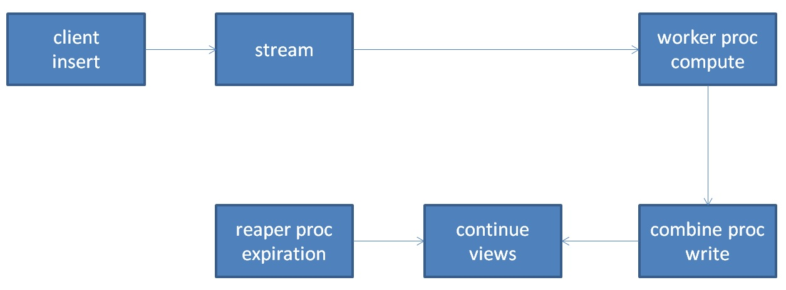

## PostgreSQL 流计算插件 - pipelinedb 1.x 参数配置介绍  
                                                                                 
### 作者                                                                                 
digoal                                                                                 
                                                                                 
### 日期                                                                                 
2018-11-20                                                                             
                                                                                 
### 标签                                                                                 
PostgreSQL , 流计算 , pipelinedb        
                                                                                 
----                                                                                 
                                                                                 
## 背景      
  
## 术语  
  
1、stream，流。数据写入流中，流不落盘。流通常会接continue view或continue transform，用于存储实时计算的结果(continue view)，或者定义对流数据进行处理的规则(continue transform)。  
  
2、continue view，经过实时计算后的结果，存入continue view，注意只有主动查询continue view时，continue view的内容才会被持久化（或者等内部INTERVAL调度）。  
  
3、continue transform，定义对流数据进行处理的规则，当流中的数据记录满足continue transform QUERY定义的条件时，触发规则。常用于流监控，事件触发。  
  
4、滑窗 continue view，属于continue view的一种。例如定义滑窗为1小时，那么这个视图就是最近一小时的统计，为了得到这个统计值，必须实时老化一小时前的数据，保持统计是最近一小时的。怎么做到的呢？  
  
实际上pipelinedb内部通过定义比滑窗更小粒度窗口的实时统计，把窗口切成更小的窗口，查询时对小粒度窗口进行汇聚产生大窗口的数据。  
  
例如定义的窗口为1小时，那么可以按分钟的粒度进行统计，查询时，汇聚最近的60个窗口的数据，得到小时的窗口数据。  
  
5、worker，计算。  
  
6、combiner，合并worker的计算结果并持久化到磁盘。  
  
7、queue proc，当数据从STREAM取出（worker和combiner批量消费、计算stream内的数据，并将结果持久化到磁盘，然后从stream中清掉对应的流数据。整个过程需要queue process，确保做这一系列动作的时候，不影响用户持续将数据写入stream。）  
  
8、reaper proc，清除设置了TTL的continue view的过期数据。  
  
  
  
## 参数配置详解  
由于pipelinedb这类流数据库本身就是重计算的，不必有太高的可靠性，可以建议性能优先的设置。  
  
### 1、pipelinedb.stream_insert_level  
性能最佳，可以设置为async，数据写入内存即响应写入客户端。  
  
性能适中，设置为sync_receive，数据被worker process接收后响应写入客户端。  
  
Determines when a client INSERT operation will return. Its options are:  
  
async: return as soon as the inserts have been loaded into the server’s memory  
sync_receive (default): return as soon as the inserts have been received by a worker process  
sync_commit: return only when the downstream combiner has committed all changes resulting from the inserted rows  
  
#### Note  
  
sync_commit is primarly used for testing purposes and is not meant for production workloads due to significantly increased write latency.  
  
### 2、pipelinedb.num_combiners  
有多少个combiner进程。由于combiner进程负责将计算好的结果数据合并落盘，所以当设置的COMBINER进程个数足够达到IO瓶颈时为宜。  
  
设置取决于IO能力。  
  
Sets the number of parallel continuous query combiner processes to use for each database. A higher number will utilize multiple cores and increase throughput until we’re I/O bound. Default: 1.  
  
### 3、pipelinedb.commit_interval  
每个combiner进程，会先将合并的结果数据HOLD在combiner_work_mem，以提高性能。commit_interval表示间隔多长时间刷提交结果。  
  
Sets the number of milliseconds that combiners will keep combining in memory before committing the result. A longer commit interval will increase performance at the expense of less frequent continuous view updates and more potential data loss. Default: 50ms.  
  
### 4、pipelinedb.num_workers  
worker进程负责计算STREAM上定义的continue view, continue transform。  
  
设置取决于有多少STREAM，有多少continue view, continue transform，有多少CPU能力。  
  
Sets the number of parallel continuous query worker processes to use for each database. A higher number will utilize multiple cores and increase throughput until we’re CPU bound. Default: 1.  
  
### 5、pipelinedb.num_queues  
当数据从STREAM取出（worker和combiner批量消费、计算stream内的数据，并将结果持久化到磁盘，然后从stream中清掉对应的流数据。整个过程需要queue process，确保做这一系列动作的时候，不影响用户持续将数据写入stream。）  
  
设置取决于num_workers，num_combiners。  
  
Sets the number of parallel continuous query queue processes to use for each database. Queues are used when workers and combiners are writing out results to streams, necessitating an IPC queue to prevent stalls. Default: 1.  
  
### 6、pipelinedb.num_reapers  
reaper进程，用于清除设置了TTL的continue view的过期数据。  
  
类似于后台定时任务进程。不需要太多，设置取决于有多少设置了TTL的continue view。  
  
Sets the number of parallel reaper processes to use for each database. Reaper processes handle Time-to-Live (TTL) Expiration. Default: 1.  
  
### 7、pipelinedb.ttl_expiration_batch_size  
清除设置了TTL的continue view的过期数据。  
  
一个事务中，最多清理多少条数据，主要防止长事务。  
  
Sets the maximum number of rows that a reaper will delete from a continuous view per transaction. This is designed to minimize long-running transactions. A value of 0 means an unlimited number of rows can be deleted in a given transaction. Default: 10000.  
  
### 8、pipelinedb.ttl_expiration_threshold  
当超出设置阈值多少后，开始清理过期数据。  
  
例如设置TTL为2天，设置ttl_expiration_threshold为5%。  
  
那么当数据过期达到 (2 + 5%*2) 天后，才开始触发清理。  
  
也可以理解为TTL continue view的膨胀率。  
  
Sets the percentage of a TTL that must have elapsed since a reaper last deleted rows from a continuous view before attempting to delete from it again. A lower percentage will yield more aggressive expiration at the expensive of more delete transactions on the continuous view. Default: 5%.  
  
### 9、pipelinedb.batch_size  
当查询continuous view时，会触发PIPELINEDB对continuous view的结果进行持久化。  
  
batch_size设置，表示执行continuous view查询前，最多允许多少个events堆积(例如insert stream的条数)。  
  
设置越大，可能增加查询continuous view的响应延迟，或者当数据库CRASH时丢掉更多数据。  
  
Sets the maximum number of events to accumulate before executing a continuous query plan on them. A higher value usually yields less frequent continuous view updates, but adversely affects latency and can cause more data loss in case of process crashes. Default: 10000.  
  
### 10、pipelinedb.combiner_work_mem  
每个combiner的工作内存大小。combiner process在合并WORKER计算结果时用于排序，HASH TABLE等。  
  
如果combiner使用内存超出这个设置，则使用磁盘。  
  
Sets the maximum memory to be used for combining partial results for continuous queries. This much memory can be used by each combiner processes’s internal sort operation and hash table before switching to temporary disk files. Default: 256mb.  
  
### 11、pipelinedb.anonymous_update_checks  
  
Toggles whether PipelineDB should anonymous check if a new version is available. Default: true.  
  
### 12、pipelinedb.matrels_writable  
是否允许continue view被直接修改。（直接通过SQL修改，而不是仅被combiner进程修改）  
  
Toggles whether changes can be directly made to materialization tables. Default: false.  
  
### 13、pipelinedb.ipc_hwm  
  
Sets the high watermark for IPC messages between worker and combiner processes. Default: 10.  
  
### 14、pipelinedb.max_wait  
与pipelinedb.batch_size含义类似，只是时间度量。  
  
执行continuous view查询前，最多允许等多长时间。  
  
Sets the time a continuous query process will wait for a batch to accumulate. A higher value usually yields less frequent continuous view updates, but adversely affects latency and can cause more data loss in case of process crashes. Default: 10ms.  
  
### 15、pipelinedb.fillfactor  
continue view的fillfactor，由于流计算的结果continue view需要经常被combiner更新，所以多数为更新操作，那么设置合理的fillfactor可以使得更容易HOT（避免索引膨胀）。  
  
HOT的条件，新版本在同一个PAGE，同时所有索引字段的值都没有发生变化。  
  
[《PostgreSQL Heap Only Tuple - HOT (降低UPDATE引入的索引写IO放大)》](../201809/20180925_02.md)    
  
Sets the default fillfactor to use for materialization tables. Default: 50.  
  
### 16、pipelinedb.sliding_window_step_factor  
滑窗continue view的小窗颗粒度。  
  
例如定义滑窗为1小时，那么这个视图就是最近一小时的统计，为了得到这个统计值，必须实时老化一小时前的数据，保持统计是最近一小时的。怎么做到的呢？  
  
实际上pipelinedb内部通过定义比滑窗更小粒度窗口的实时统计，把窗口切成更小的窗口，查询时对小粒度窗口进行汇聚产生大窗口的数据。  
  
例如定义的窗口为1小时，那么可以按分钟的粒度进行统计，查询时，汇聚最近的60个窗口的数据，得到小时的窗口数据。  
  
颗粒度为5，表示5%的颗粒。例如定义窗口为1小时，那么颗粒就是```5%*60min = 3min```，也就是说会3分钟统计一个值，最后查询时汇聚为1小时的窗口值。  
  
Sets the default step size for a sliding window query as a percentage of the window size. A higher number will improve performance but tradeoff refresh interval. Default: 5.  
  
  
## 参考  
http://docs.pipelinedb.com/conf.html  
    
  
  
  
  
  
  
  
  
  
  
  
  
  
  
  
  
  
  
  
  
  
  
  
  
  
  
  
  
  
  
  
  
  
  
  
  
  
  
  
  
  
  
  
  
  
  
  
  
  
  
  
  
  
  
  
  
  
  
  
  
  
  
  
  
  
  
  
  
  
#### [PostgreSQL 许愿链接](https://github.com/digoal/blog/issues/76 "269ac3d1c492e938c0191101c7238216")
您的愿望将传达给PG kernel hacker、数据库厂商等, 帮助提高数据库产品质量和功能, 说不定下一个PG版本就有您提出的功能点. 针对非常好的提议，奖励限量版PG文化衫、纪念品、贴纸、PG热门书籍等，奖品丰富，快来许愿。[开不开森](https://github.com/digoal/blog/issues/76 "269ac3d1c492e938c0191101c7238216").  
  
  
#### [9.9元购买3个月阿里云RDS PostgreSQL实例](https://www.aliyun.com/database/postgresqlactivity "57258f76c37864c6e6d23383d05714ea")
  
  
#### [PostgreSQL 解决方案集合](https://yq.aliyun.com/topic/118 "40cff096e9ed7122c512b35d8561d9c8")
  
  
#### [德哥 / digoal's github - 公益是一辈子的事.](https://github.com/digoal/blog/blob/master/README.md "22709685feb7cab07d30f30387f0a9ae")
  
  

  
  
#### [PolarDB 学习图谱: 训练营、培训认证、在线互动实验、解决方案、生态合作、写心得拿奖品](https://www.aliyun.com/database/openpolardb/activity "8642f60e04ed0c814bf9cb9677976bd4")
  
  
#### [购买PolarDB云服务折扣活动进行中, 55元起](https://www.aliyun.com/activity/new/polardb-yunparter?userCode=bsb3t4al "e0495c413bedacabb75ff1e880be465a")
  
  
#### [About 德哥](https://github.com/digoal/blog/blob/master/me/readme.md "a37735981e7704886ffd590565582dd0")
  
