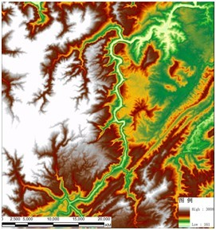

## PostgreSQL 空间聚合性能 - 行政区、电子围栏 空间聚合 - 时间、空间热力图   
                                                                                     
### 作者                                                                                     
digoal                                                                                     
                                                                                     
### 日期                                                                                     
2018-11-22                                                                                 
                                                                                     
### 标签                                                                                     
PostgreSQL , 空间聚合 , 空间热力图 , 行政区 , 电子围栏      
                                                                                     
----                                                                                     
                                                                                     
## 背景    
某个时间区间(或其他条件)，出现在某些围栏、行政区(多边形信息)中的对象(空间点信息)有多少，按颜色深浅渲染这些多边形。  
  
例如  
  
  
  
## 例子  
1、面数据 - 围栏、行政区(多边形信息)  
  
生成1万个面数据  
  
```  
create table t1 (  
  gid int,   -- 多边形ID（用户定义的围栏、行政区）  
  face box   -- 空间信息，实际使用时，可以使用PostGIS的geometry类型  
);  
  
insert into t1 select row_number() over(), box (point(x,y),point(x+1,y+1)) from generate_series(0,99) t1(x),generate_series(0,99) t2(y);  
  
create index idx_t1_face on t1 using gist(face);  
```  
  
2、点数据，空间对象的位置信息  
  
生成1000万点数据  
  
```  
create table t2 (  
  id int,   -- 对象ID  
  pos point,   -- 位置，实际使用时，可以使用PostGIS的geometry类型  
  att text   -- 其他属性，可以有更多其他属性  
);  
  
insert into t2 select id, point(random()*100, random()*100) from generate_series(1,10000000) t(id);  
```  
  
3、创建函数，输入点的值，获得面的值。  
  
支持并行SQL  
  
```  
create or replace function get_gid(point) returns int as $$  
  select gid from t1 where face @> box($1,$1) limit 1;  
$$ language sql strict immutable parallel safe;  
```  
  
4、按GID空间聚合的SQL如下  
  
```  
select gid, count(*) from t1 join t2 on (t1.face @> box(t2.pos,t2.pos)) group by gid;  
  
或  
  
select get_gid(pos) as gid, count(*) from t2 group by 1;  
```  
  
5、使用PG 并行聚合  
  
```  
postgres=# show max_worker_processes ;  
 max_worker_processes   
----------------------  
 128  
(1 row)  
  
  
set max_parallel_workers=128;  
set max_parallel_workers_per_gather =28;  
set enable_sort=off;  
set parallel_tuple_cost =0;  
set parallel_setup_cost =0;  
set min_parallel_table_scan_size =0;  
set min_parallel_index_scan_size =0;  
set work_mem ='2GB';  
alter table t1 set (parallel_workers =28);  
alter table t2 set (parallel_workers =28);  
analyze t1;  
analyze t2;  
```  
  
### 1000万点，1万面，空间聚合性能  
**5.6 秒**  
  
```  
postgres=# explain analyze select get_gid(pos) as gid, count(*) from t2 group by 1;  
                                                               QUERY PLAN                                                                  
-----------------------------------------------------------------------------------------------------------------------------------------  
 Finalize HashAggregate  (cost=86550.79..86594.18 rows=200 width=12) (actual time=5592.898..5594.204 rows=10000 loops=1)  
   Group Key: (get_gid(pos))  
   ->  Gather  (cost=86483.13..86526.52 rows=5600 width=12) (actual time=5485.528..5536.356 rows=290000 loops=1)  
         Workers Planned: 28  
         Workers Launched: 28  
         ->  Partial HashAggregate  (cost=86483.13..86526.52 rows=200 width=12) (actual time=5443.795..5445.860 rows=10000 loops=29)  
               Group Key: get_gid(pos)  
               ->  Parallel Seq Scan on t2  (cost=0.00..84806.71 rows=386720 width=4) (actual time=1.014..5311.532 rows=344828 loops=29)  
 Planning Time: 0.118 ms  
 Execution Time: 5595.278 ms  
(10 rows)  
```  
  
### 100万点，1万面，空间聚合性能  
**690 毫秒**  
  
```  
truncate t2;  
insert into t2 select id, point(random()*100, random()*100) from generate_series(1,1000000) t(id);  
  
postgres=# explain analyze select get_gid(pos) as gid, count(*) from t2 group by 1;  
                                                             QUERY PLAN                                                                
-------------------------------------------------------------------------------------------------------------------------------------  
 Finalize HashAggregate  (cost=8061.46..8104.85 rows=200 width=12) (actual time=687.602..688.897 rows=10000 loops=1)  
   Group Key: (get_gid(pos))  
   ->  Gather  (cost=7993.80..8037.18 rows=5600 width=12) (actual time=582.986..632.877 rows=280419 loops=1)  
         Workers Planned: 28  
         Workers Launched: 28  
         ->  Partial HashAggregate  (cost=7993.80..8037.18 rows=200 width=12) (actual time=541.534..543.355 rows=9670 loops=29)  
               Group Key: get_gid(pos)  
               ->  Parallel Seq Scan on t2  (cost=0.00..7838.98 rows=35714 width=4) (actual time=1.010..527.932 rows=34483 loops=29)  
 Planning Time: 0.130 ms  
 Execution Time: 689.867 ms  
(10 rows)  
```  
  
## 如果预先聚合 - 速度更快
比如数据写入时，就把GID算出来，写入T2表的GID字段里，直接按GID聚合。速度会飞起来。   
  
1000万点，258毫秒。   
  
```
postgres=# alter table t2 add column gid int;
ALTER TABLE
  
-- 假设GID已提前算好（比如insert时直接设置为get_gid(pos)，这里只是为了测试，一次性全部更新掉）
postgres=# update t2 set gid = get_gid(pos);
UPDATE 10000000
postgres=# vacuum full t2;
VACUUM


postgres=# explain analyze select gid,count(*) from t2 group by gid;
                                                              QUERY PLAN                                                              
--------------------------------------------------------------------------------------------------------------------------------------
 Finalize HashAggregate  (cost=3882.87..3884.76 rows=9983 width=12) (actual time=255.763..257.094 rows=10000 loops=1)
   Group Key: gid
   ->  Gather  (cost=2669.26..2671.14 rows=279524 width=12) (actual time=135.953..200.398 rows=290000 loops=1)
         Workers Planned: 28
         Workers Launched: 28
         ->  Partial HashAggregate  (cost=2669.26..2671.14 rows=9983 width=12) (actual time=98.026..99.585 rows=10000 loops=29)
               Group Key: gid
               ->  Parallel Seq Scan on t2  (cost=0.00..1121.05 rows=357143 width=4) (actual time=0.005..30.248 rows=344828 loops=29)
 Planning Time: 0.078 ms
 Execution Time: 258.268 ms
(10 rows)
```
  
## 参考  
PostGIS 比 内置geometry 操作符稍慢。  
  
[《PostgreSQL Oracle 兼容性之 - 自定义并行聚合函数 PARALLEL_ENABLE AGGREGATE》](../201803/20180312_03.md)    
  
[《HTAP数据库 PostgreSQL 场景与性能测试之 23 - (OLAP) 并行计算》](../201711/20171107_24.md)    
  
https://www.postgresql.org/docs/11/functions-geometry.html  
  
http://postgis.net/  
  
  
<a rel="nofollow" href="http://info.flagcounter.com/h9V1"  ></a>  
  
  
## [digoal's 大量PostgreSQL文章入口](https://github.com/digoal/blog/blob/master/README.md "22709685feb7cab07d30f30387f0a9ae")
  
  
## [免费领取阿里云RDS PostgreSQL实例、ECS虚拟机](https://free.aliyun.com/ "57258f76c37864c6e6d23383d05714ea")
  
