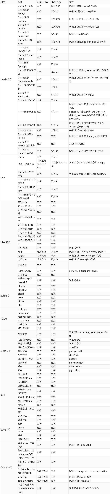

## PostgreSQL vs PPAS 差异 - Oracle评估、迁移、验证、性能调优 
                                                                 
### 作者                                                                 
digoal                                                                 
                                                                 
### 日期                                                                 
2018-12-10                                                             
                                                                 
### 标签                                                                 
PostgreSQL , PPAS , 阿里云        
                                                                 
----                                                                 
                                                                 
## 背景   
  
1、ppas手册(高度兼容Oracle)：      
  
https://www.enterprisedb.com/docs/en/11.0/EPAS_Oracompat_Ref_Guide_v11/toc.html  
  
[阿里云Oracle评估、迁移、验证、性能调优工具ADAM(免费)](https://promotion.aliyun.com/ntms/act/ppasadam.html)  
  
2、PostgreSQL 特征矩阵(PPAS完全包含PG特性)：   
  
https://www.postgresql.org/about/featurematrix/  
  
PostgreSQL Oracle不兼容SQL的改写方法请参考 :    
  
https://github.com/digoal/blog/blob/master/README.md   
  
搜索Oracle.   
  
## PPAS vs PostgreSQL 社区版：   
  
  
  
  
  
  
  
  
  
  
  
  
  
  
#### [digoal's PostgreSQL文章入口](https://github.com/digoal/blog/blob/master/README.md "22709685feb7cab07d30f30387f0a9ae")
  
  

  
  
  
  
  
  
  
  
#### [免费领取阿里云RDS PostgreSQL实例、ECS虚拟机](https://www.aliyun.com/database/postgresqlactivity "57258f76c37864c6e6d23383d05714ea")
  
