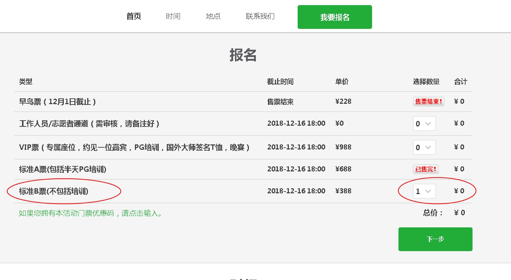
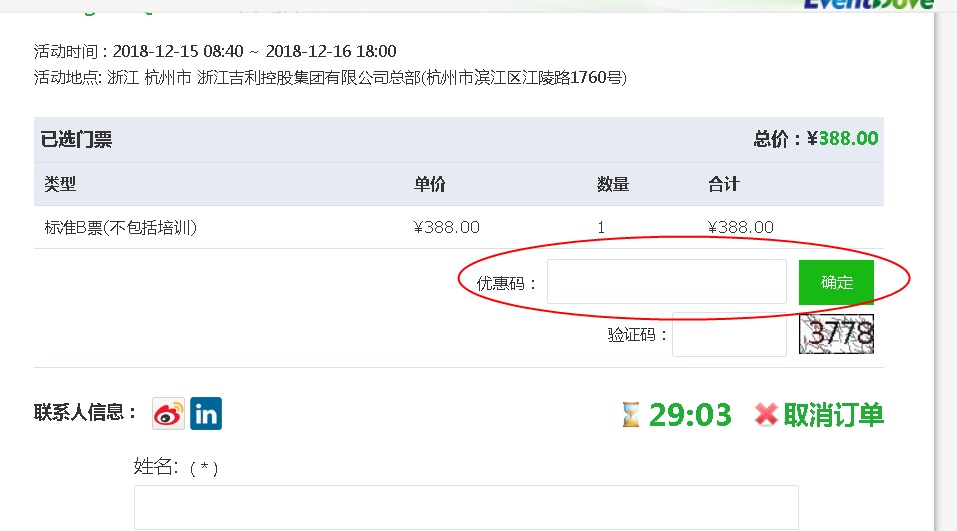
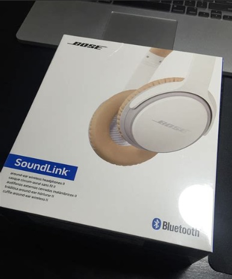
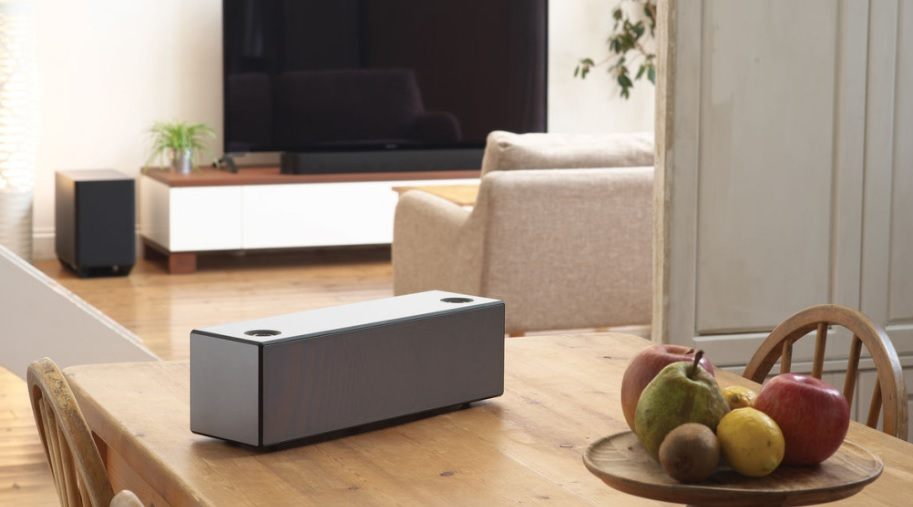

## PostgreSQL 2018 全国峰会报名 - 有机会获得老婆大人贡献的 BeoPlay A1 , BOSE SoundLink , SONY SRS-X99  
                                                                   
### 作者                                                                   
digoal                                                                   
                                                                   
### 日期                                                                   
2018-12-11                                                               
                                                                   
### 标签                                                                   
PostgreSQL , PPAS , 阿里云          
                                                                   
----                                                                   
                                                                   
## 背景     
Postgres中国用户大会 2018（大象汇）”将于2018年12月15、16日在浙江吉利控股集团有限公司总部(杭州市滨江区江陵路1760号)举行。  
  
### 报名链接：  
  
http://pgconfcn2018.eventdove.com/event/145963  
  
使用如下任意优惠码报名(选择B票)，可减免门票费。  
  
```  
plusPGC20    
  
plusPGB20        
  
plusPGA20      
  
YunqiPG2018    
  
PG2018dig50B   
  
PG2018dig50A   
```  
  
  
  
  
  
最后几天报名啦，感谢老婆大人给PG大会送的福利如下：  
  
**大伙加了个油，快报名，快传播，赢取奖品的机会大大**  
  
1、第800名报名参会者，赠送 BeoPlay A1 一台（现场赠与，不来参会没有）。    
  
  
  
2、参会签到人数超过1111人，赠送 BOSE SoundLink 蓝牙耳机一副（现场从参会者中随机抽签）。   
  
  
  
3、参会签到人数超过1600人，赠送 SONY SRS-X99 一台（现场从参会者中随机抽签）。   
  
  
    
欢迎参会。  
    
  
  
  
  
  
  
  
  
  
  
  
  
  
  
  
  
  
  
  
  
  
  
  
  
  
  
  
  
  
  
  
  
  
  
  
  
  
  
  
  
  
  
  
  
  
  
  
  
  
  
  
  
  
  
  
  
  
  
  
  
  
  
  
  
  
  
  
  
  
#### [PostgreSQL 许愿链接](https://github.com/digoal/blog/issues/76 "269ac3d1c492e938c0191101c7238216")
您的愿望将传达给PG kernel hacker、数据库厂商等, 帮助提高数据库产品质量和功能, 说不定下一个PG版本就有您提出的功能点. 针对非常好的提议，奖励限量版PG文化衫、纪念品、贴纸、PG热门书籍等，奖品丰富，快来许愿。[开不开森](https://github.com/digoal/blog/issues/76 "269ac3d1c492e938c0191101c7238216").  
  
  
#### [9.9元购买3个月阿里云RDS PostgreSQL实例](https://www.aliyun.com/database/postgresqlactivity "57258f76c37864c6e6d23383d05714ea")
  
  
#### [PostgreSQL 解决方案集合](https://yq.aliyun.com/topic/118 "40cff096e9ed7122c512b35d8561d9c8")
  
  
#### [德哥 / digoal's github - 公益是一辈子的事.](https://github.com/digoal/blog/blob/master/README.md "22709685feb7cab07d30f30387f0a9ae")
  
  

  
  
#### [PolarDB 学习图谱: 训练营、培训认证、在线互动实验、解决方案、生态合作、写心得拿奖品](https://www.aliyun.com/database/openpolardb/activity "8642f60e04ed0c814bf9cb9677976bd4")
  
  
#### [购买PolarDB云服务折扣活动进行中, 55元起](https://www.aliyun.com/activity/new/polardb-yunparter?userCode=bsb3t4al "e0495c413bedacabb75ff1e880be465a")
  
  
#### [About 德哥](https://github.com/digoal/blog/blob/master/me/readme.md "a37735981e7704886ffd590565582dd0")
  
