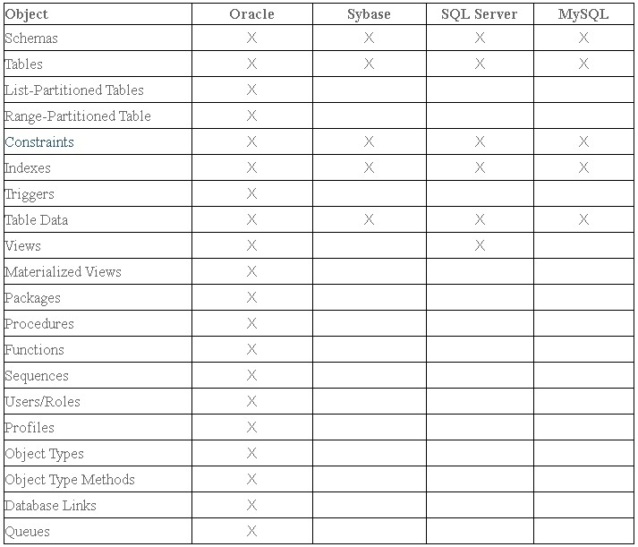
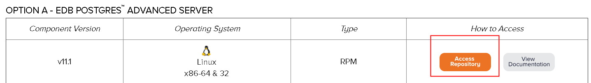
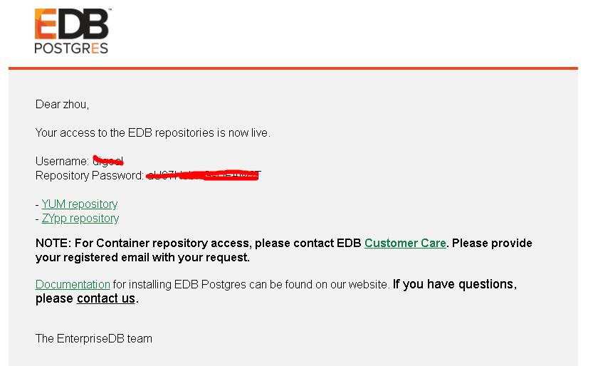
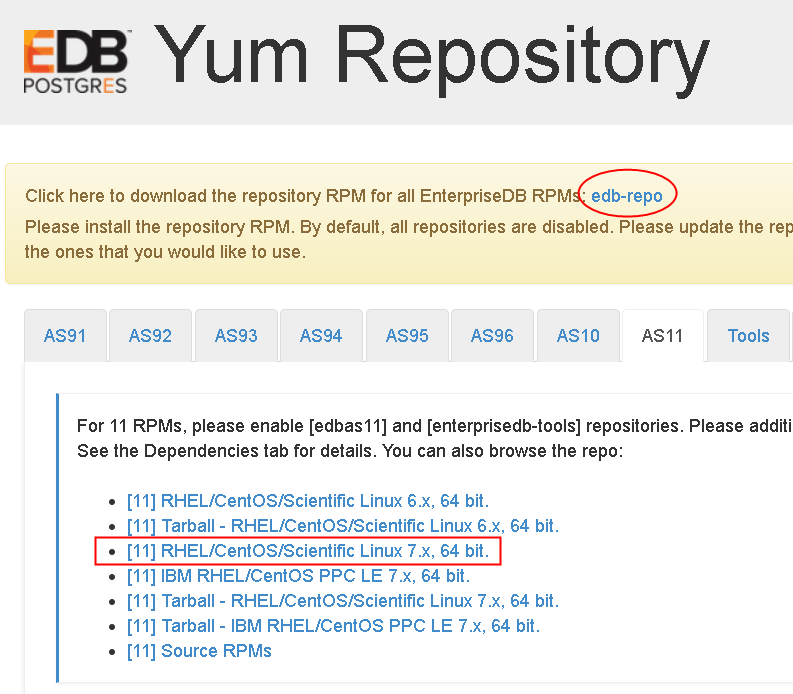
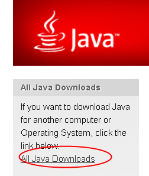
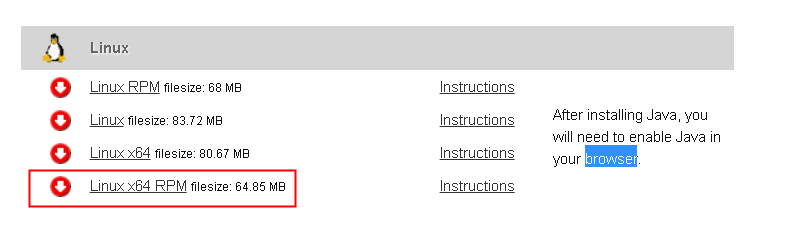
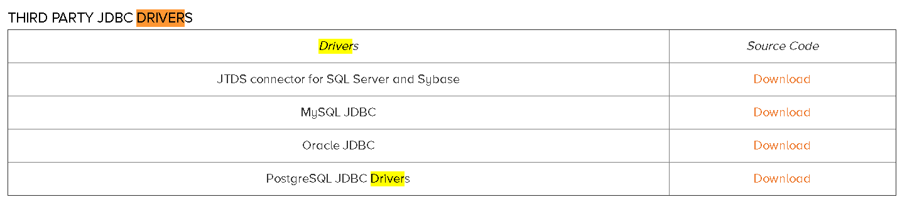

## MTK使用 - PG,PPAS,oracle,mysql,ms sql,sybase 迁移到 PG, PPAS (支持跨版本升级)  
                                                                         
### 作者                                                                         
digoal                                                                         
                                                                         
### 日期                                                                         
2018-12-26                                                                      
                                                                         
### 标签                                                                         
PostgreSQL , PPAS , 迁移 , 跨版本升级 , oracle , mysql , SQL Server , Sybase , 同步   
                                                                         
----                                                                         
                                                                         
## 背景       
使用EDB的MTK工具，可以完成异构迁移，同构迁移，异平台迁移，版本升级等动作例如：  
  
1、PG, PPAS, oracle, mysql, ms sql, sybase 迁移到 PG, PPAS。  
  
2、小型机平台迁移到X86平台。   
  
3、PG,PPAS的跨版本升级。   
  
迁移效率高(可以达到百万行/s的迁移速度，本例实测299万行/s)，支持的数据源多，迁移配置灵活。  
  
支持的版本  
  
```
PostgreSQL versions 9.4, 9.5, 9.6, 10, and 11

Advanced Server versions 9.4, 9.5, 9.6, 10, and 11

Oracle 10g Release 2

Oracle 11g Release 2

Oracle 12c Release 1

SQL Server 2008

SQL Server 2012

SQL Server 2014

MySQL 5.5.36

Sybase Adaptive Server Enterprise 15.7
```
  
支持的迁移对象，（X表示支持）.   
  
  
  
# 使用举例  
首先需要准备一台主机，例如阿里云ECS，要求：  
  
1、可以连通源库、目标库，连数据库的网络一定要好，网络决定了迁移速度。  
  
2、可以访问公网，下载并安装edb mtk tools.  
  
3、建议使用CentOS 7.x x64系统。   
  
## 1、注册edb账号  
https://www.enterprisedb.com/  
  
## 2、下载mtk  
https://www.enterprisedb.com/advanced-downloads  
  
选中v11.1点击查询yum仓库配置  
  
  
  
会发一封邮件到您注册的账号邮箱中，包含了YUM仓库的用户密码  
  
  
  
打开你的有些，搜索enterprisedb找到edb发过来的yum仓库用户密码如下  
  
  
  
## 3、点击YUM repository 打开下载链接   
  
http://go.enterprisedb.com/gJ0EC2n0700zLB0iA000KYu   
  
  
  
需要安装V 11的yum仓库配置  
  
## 4、安装yum  
  
```  
rpm -ivh https://yum.enterprisedb.com/edbrepos/edb-repo-latest.noarch.rpm  
```  
  
## 5、打开yum  
  
允许以下三个REPO，修改为enable=1，填入edb邮件发送给你的用户密码。  
  
```  
vi /etc/yum.repos.d/edb.repo  
  
[edbas11]  
name=EnterpriseDB Advanced Server 11 $releasever - $basearch  
baseurl=https://用户:密码@yum.enterprisedb.com/11/redhat/rhel-$releasever-$basearch  
enabled=1  
gpgcheck=1  
gpgkey=file:///etc/pki/rpm-gpg/ENTERPRISEDB-GPG-KEY  
[enterprisedb-tools]  
name=EnterpriseDB Tools $releasever - $basearch  
baseurl=https://用户:密码@yum.enterprisedb.com/tools/redhat/rhel-$releasever-$basearch  
enabled=1  
gpgcheck=1  
gpgkey=file:///etc/pki/rpm-gpg/ENTERPRISEDB-GPG-KEY  
  
[enterprisedb-dependencies]  
name=EnterpriseDB Dependencies $releasever - $basearch  
baseurl=https://用户:密码@yum.enterprisedb.com/dependencies/redhat/rhel-$releasever-$basearch  
enabled=1  
gpgcheck=1  
gpgkey=file:///etc/pki/rpm-gpg/ENTERPRISEDB-GPG-KEY  
```  
  
## 6、检查YUM是否配置正确  
  
```  
# yum search all enterprisedb  
  
edb-as11-pgagent.x86_64 : Job scheduler for EnterpriseDB Advanced Server  
edb-as11-server-cloneschema.x86_64 : clone_remote_schema is a module for EnterpriseDB Advanced Server  
edb-as11-server-edb-modules.x86_64 : EDB-Modules for EnterpriseDB Advanced Server  
edb-as11-server-parallel-clone.x86_64 : parallel_clone is a module for EnterpriseDB Advanced Server  
edb-oci.x86_64 : EnterpriseDB Advanced Server Open Client Library  
MigrationWizard.noarch : MySQL to PostgreSQL Migration Wizard  
edb-as11-edbplus.x86_64 : EDB*Plus by EnterpriseDB  
edb-as11-mongo_fdw.x86_64 : Provides EnterpriseDB Advanced Server foreign data wrapper for MongoDB.  
edb-as11-mysql5_fdw.x86_64 : Provides EnterpriseDB Advanced Server foreign data wrapper for MySQL.  
edb-as11-mysql8_fdw.x86_64 : Provides EnterpriseDB Advanced Server foreign data wrapper for MySQL.  
edb-as11-pgsnmpd.x86_64 : SNMPD for EnterpriseDB Advanced Server  
edb-as11-pljava.x86_64 : PL/Java for EnterpriseDB Advanced Server  
edb-as11-server.x86_64 : EnterpriseDB Advanced Server Client and Server Components  
edb-as11-server-core.x86_64 : The core programs needed to create and run a EnterpriseDB Advanced Server  
edb-as11-server-indexadvisor.x86_64 : Index Advisor for EnterpriseDB Advanced Server  
edb-as11-server-sqlprofiler.x86_64 : SQL profiler for EnterpriseDB Advanced Server  
edb-as11-server-sqlprotect.x86_64 : SQL Protect for EnterpriseDB Advanced Server  
edb-as11-server-sslutils.x86_64 : SSL Utils for EnterpriseDB Advanced Server  
edb-efm30.x86_64 : EnterpriseDB Failover Manager  
edb-efm31.x86_64 : EnterpriseDB Failover Manager  
edb-efm32.x86_64 : EnterpriseDB Failover Manager  
edb-efm33.x86_64 : EnterpriseDB Failover Manager  
edb-jdbc.x86_64 : JDBC driver for EnterpriseDB Advanced Server  
edb-migrationtoolkit.x86_64 : Migration Toolkit by EnterpriseDB  
edb-odbc.x86_64 : EnterpriseDB Advanced Server ODBC driver  
edb-pem.x86_64 : PostgreSQL Enterprise Manager  
edb-pgpool35.x86_64 : Pgpool is a connection pooling/replication server for EnterpriseDB Advanced Server  
edb-pgpool36.x86_64 : Pgpool is a connection pooling/replication server for EnterpriseDB Advanced Server  
edb-pgpool37.x86_64 : Pgpool is a connection pooling/replication server for EnterpriseDB Advanced Server  
edb-pgpool40.x86_64 : Pgpool is a connection pooling/replication server for EnterpriseDB Advanced Server  
edb-repo.noarch : EnterpriseDB RPMs for RHEL - Yum Repository Configuration  
efm20.x86_64 : EnterpriseDB Failover Manager  
efm21.x86_64 : EnterpriseDB Failover Manager  
ppas-oci.x86_64 : Postgres Plus Advanced Server Open Client Library  
edb-as11.x86_64 : Meta RPM for EDBAS  
edb-as11-hdfs_fdw.x86_64 : Provides EnterpriseDB Advanced Server foreign data wrapper for HDFS.  
edb-as11-pgpool37-extensions.x86_64 : The server extension modules for pgpool  
edb-as11-pgpool40-extensions.x86_64 : The server extension modules for pgpool  
edb-as11-server-client.x86_64 : The client software required to access EDBAS server.  
edb-as11-server-contrib.x86_64 : Contributed source and binaries distributed with EDBAS  
edb-as11-server-devel.x86_64 : EDBAS development header files and libraries  
edb-as11-server-docs.x86_64 : Extra documentation for EDBAS  
edb-as11-server-libs.x86_64 : The shared libraries required for any EDBAS clients  
edb-as11-server-llvmjit.x86_64 : Just-In-Time compilation support for EDBAS  
edb-as11-server-pldebugger.x86_64 : PL/pgSQL debugger server-side code  
edb-as11-server-plperl.x86_64 : The Perl procedural language for EDBAS  
edb-as11-server-plpython.x86_64 : The Python procedural language for EDBAS  
edb-as11-server-pltcl.x86_64 : The Tcl procedural language for EDBAS  
edb-as11-slony-replication.x86_64 : A "master to multiple slaves" replication system with cascading and failover  
edb-as11-slony-replication-core.x86_64 : The core portions of Slony-I  
edb-as11-slony-replication-docs.x86_64 : Documentation for Slony-I  
edb-as11-slony-replication-tools.x86_64 : The altperl tools of Slony-I  
edb-bart.x86_64 : Backup and Restore Utility for PostgreSQL and EDB Advanced Server  
edb-bart20.x86_64 : Backup and Restore Utility for PostgreSQL and Postgres Plus Advanced Server  
edb-oci-devel.x86_64 : Files needed for development  
edb-odbc-devel.x86_64 : Files needed for development  
edb-pem-agent.x86_64 : PEM Server Components  
edb-pem-docs.x86_64 : Documentation for PEM  
edb-pem-server.x86_64 : PEM Server Components  
edb-pgbouncer17.x86_64 : Lightweight connection pooler for PostgreSQL  
edb-pgbouncer19.x86_64 : Lightweight connection pooler for PostgreSQL  
hdfs_fdw_11.x86_64 : PostgreSQL Foreign Data Wrapper (FDW) for the hdfs  
hdfs_fdw_11-debuginfo.x86_64 : Debug information for package hdfs_fdw_11  
mysql_fdw_11.x86_64 : PostgreSQL Foreign Data Wrapper (FDW) for the MySQL  
mysql_fdw_11-debuginfo.x86_64 : Debug information for package mysql_fdw_11  
pg_catcheck11.x86_64 : Tool for diagnosing PostgreSQL system catalog corruption  
pg_catcheck11-debuginfo.x86_64 : Debug information for package pg_catcheck11  
ppas-jdbc.x86_64 : JDBC driver for Postgres Plus Advanced Server  
ppas-oci-devel.x86_64 : Files needed for development  
ppas-odbc.x86_64 : Postgres Plus Advanced Server ODBC driver  
ppas-odbc-devel.x86_64 : Files needed for development  
ppas-pgbouncer.x86_64 : Lightweight connection pooler for PostgreSQL  
ppas-pgbouncer16.x86_64 : Lightweight connection pooler for PostgreSQL  
ppas-pgpool.x86_64 : Pgpool is a connection pooling/replication server for Postgres Plus Advanced Server  
ppas-pgpool34.x86_64 : Pgpool is a connection pooling/replication server for Postgres Plus Advanced Server  
```  
  
## 7、安装mtk  
  
```  
# yum install -y edb-migrationtoolkit  
```  
  
查看安装好的文件在哪个目录中  
  
```  
# rpm -ql edb-migrationtoolkit  
/etc/sysconfig/edb/migrationtoolkit/edb-migrationtoolkit-52.config  
/usr/edb/migrationtoolkit/bin/edb-migrationtoolkit.jar  
/usr/edb/migrationtoolkit/bin/runJavaApplication.sh  
/usr/edb/migrationtoolkit/bin/runMTK.sh  
/usr/edb/migrationtoolkit/edb-migrationtoolkit_license.txt  
/usr/edb/migrationtoolkit/etc/toolkit.properties  
/usr/edb/migrationtoolkit/lib/commons-lang3-3.1.jar  
/usr/edb/migrationtoolkit/lib/edb-commons.jar  
/usr/edb/migrationtoolkit/lib/edb-jdbc17.jar  
/usr/edb/migrationtoolkit/lib/log4j-1.2.17.jar  
```  
  
## 8、安装java 1.7.0以上版本  
https://www.java.com/en/download/  
  
  
  
https://www.java.com/en/download/manual.jsp#lin  
  
  
  
安装java1.7.0以上版本  
  
```  
wget https://javadl.oracle.com/webapps/download/AutoDL?BundleId=235716_2787e4a523244c269598db4e85c51e0c  
  
rpm -ivh AutoDL\?BundleId\=235716_2787e4a523244c269598db4e85c51e0c   
```  
  
检查安装目录  
  
```  
rpm -ql jre1.8-1.8.0_191|grep ext  
  
/usr/java/jre1.8.0_191-amd64/lib/deploy/ffjcext.zip  
/usr/java/jre1.8.0_191-amd64/lib/desktop/icons/HighContrast/16x16/mimetypes/gnome-mime-text-x-java.png  
/usr/java/jre1.8.0_191-amd64/lib/desktop/icons/HighContrast/48x48/mimetypes/gnome-mime-text-x-java.png  
/usr/java/jre1.8.0_191-amd64/lib/desktop/icons/HighContrastInverse/16x16/mimetypes/gnome-mime-text-x-java.png  
/usr/java/jre1.8.0_191-amd64/lib/desktop/icons/HighContrastInverse/48x48/mimetypes/gnome-mime-text-x-java.png  
/usr/java/jre1.8.0_191-amd64/lib/desktop/icons/LowContrast/16x16/mimetypes/gnome-mime-text-x-java.png  
/usr/java/jre1.8.0_191-amd64/lib/desktop/icons/LowContrast/48x48/mimetypes/gnome-mime-text-x-java.png  
/usr/java/jre1.8.0_191-amd64/lib/desktop/icons/hicolor/16x16/mimetypes/gnome-mime-text-x-java.png  
/usr/java/jre1.8.0_191-amd64/lib/desktop/icons/hicolor/48x48/mimetypes/gnome-mime-text-x-java.png  
/usr/java/jre1.8.0_191-amd64/lib/ext  
/usr/java/jre1.8.0_191-amd64/lib/ext/cldrdata.jar  
/usr/java/jre1.8.0_191-amd64/lib/ext/dnsns.jar  
/usr/java/jre1.8.0_191-amd64/lib/ext/jaccess.jar  
/usr/java/jre1.8.0_191-amd64/lib/ext/jfxrt.jar  
/usr/java/jre1.8.0_191-amd64/lib/ext/localedata.jar  
/usr/java/jre1.8.0_191-amd64/lib/ext/localedata.pack  
/usr/java/jre1.8.0_191-amd64/lib/ext/meta-index  
/usr/java/jre1.8.0_191-amd64/lib/ext/nashorn.jar  
/usr/java/jre1.8.0_191-amd64/lib/ext/sunec.jar  
/usr/java/jre1.8.0_191-amd64/lib/ext/sunjce_provider.jar  
/usr/java/jre1.8.0_191-amd64/lib/ext/sunpkcs11.jar  
/usr/java/jre1.8.0_191-amd64/lib/ext/zipfs.jar  
```  
  
## 9、查看MTK使用帮助文档  
  
https://get.enterprisedb.com/docs/EDB_Postgres_Migration_Guide_v52.0.0.pdf  
  
https://www.enterprisedb.com/resources/product-documentation  
  
  
## 10、安装数据源java驱动  
  
需要被迁移的数据库，需要下载对应的jdbc驱动。  
  
https://www.enterprisedb.com/docs/en/52.0.0/MTK_Guide/EDB_Postgres_Migration_Guide_v52.0.0.1.12.html#  
  
https://www.enterprisedb.com/advanced-downloads  
  
  
  
例如，下载PG的驱动。  
  
```  
wget https://jdbc.postgresql.org/download/postgresql-42.2.5.jar  
```  
  
驱动拷贝到 JAVA_HOME/jre/lib/ext ，从jre的安装路径获取路径  
  
```  
mv postgresql-42.2.5.jar /usr/java/jre1.8.0_191-amd64/lib/ext/  
```  
  
## 11、mtk命令行帮助  
  
```  
/usr/edb/migrationtoolkit/bin/runMTK.sh -help  
  
Running EnterpriseDB Migration Toolkit (Build 52.0.0) ...  
  
EnterpriseDB Migration Toolkit (Build 52.0.0)  
  
Usage: runMTK [-options] SCHEMA  
  
If no option is specified, the complete schema will be imported.  
  
where options include:  
-help           Display the application command-line usage.  
-version        Display the application version information.  
-verbose [on|off] Display application log messages on standard output (default: on).  
  
-schemaOnly     Import the schema object definitions only.  
-dataOnly       Import the table data only. When -tables is in place, it imports data only for the selected tables. Note: If there are any FK constraints defined on target tables, use -truncLoad option along with this option.  
  
-sourcedbtype db_type The -sourcedbtype option specifies the source database type. db_type may be one of the following values: mysql, oracle, sqlserver, sybase, postgresql, enterprisedb. db_type is case-insensitive. By default, db_type is oracle.  
-targetdbtype db_type The -targetdbtype option specifies the target database type. db_type may be one of the following values: oracle, sqlserver, postgresql, enterprisedb. db_type is case-insensitive. By default, db_type is enterprisedb.  
  
-allTables      Import all tables.  
-tables LIST    Import comma-separated list of tables.  
-constraints    Import the table constraints.  
-indexes        Import the table indexes.  
-triggers       Import the table triggers.  
-allViews       Import all Views.  
-views LIST     Import comma-separated list of Views.  
-allProcs       Import all stored procedures.  
-procs LIST     Import comma-separated list of stored procedures.  
-allFuncs       Import all functions.  
-funcs LIST     Import comma-separated list of functions.  
-allPackages    Import all packages.  
-packages LIST Import comma-separated list of packages.  
-allSequences   Import all sequences.  
-sequences LIST Import comma-separated list of sequences.  
-targetSchema NAME Name of the target schema (default: target schema is named after source schema).  
-allDBLinks     Import all Database Links.  
-allSynonyms    It enables the migration of all public and private synonyms from an Oracle database to an Advanced Server database.  If a synonym with the same name already exists in the target database, the existing synonym will be replaced with the migrated version.  
-allPublicSynonyms      It enables the migration of all public synonyms from an Oracle database to an Advanced Server database.  If a synonym with the same name already exists in the target database, the existing synonym will be replaced with the migrated version.  
-allPrivateSynonyms     It enables the migration of all private synonyms from an Oracle database to an Advanced Server database.  If a synonym with the same name already exists in the target database, the existing synonym will be replaced with the migrated version.  
-allQueues      Import all queues from the source database.  
-queues LIST    Import the selected queues from the source database. LIST is a comma-separated list of queue names.  
-skipUserSchemaCreation This option prevents implicit schema creation for a migrated Oracle user.   
  
-dropSchema [true|false] Drop the schema if it already exists in the target database (default: false).  
-truncLoad      It disables any constraints on target table and truncates the data from the table before importing new data. This option can only be used with -dataOnly.  
-safeMode       Transfer data in safe mode using plain SQL statements.  
-copyDelimiter  Specify a single character to be used as delimiter in copy command when loading table data. Default is \t  
-batchSize      Specify the Batch Size to be used by the bulk inserts. Valid values are  1-50000, default batch size is 1000, reduce if you run into Out of Memory exception  
-cpBatchSize     Specify the Batch Size in MB, to be used in the Copy Command. Valid value is from 1 to 1024, default batch size is 8 MB.  
-fetchSize       Specify fetch size in terms of number of rows should be fetched in result set at a time. This option can be used when tables contain millions of rows and you want to avoid out of memory errors.  
-filterProp     The properties file that contains table where clause.  
-skipFKConst    Skip migration of FK constraints.  
-skipCKConst    Skip migration of Check constraints.  
-skipColDefaultClause    Omit the migration of the column DEFAULT clause. The -skipColDefaultClause cannot be specified with -dataOnly option.  
-ignoreCheckConstFilter By default MTK does not migrate Check constraints and Default clauses from Sybase, use this option to turn off this filter.  
-fastCopy       Bypass WAL logging to perform the COPY operation in an optimized way, default disabled.  
-customColTypeMapping LIST      Use custom type mapping represented by a semi-colon separated list, where each entry is specified using COL_NAME_REG_EXPR=TYPE pair. e.g. .*ID=INTEGER  
-customColTypeMappingFile PROP_FILE     The custom type mapping represented by a properties file, where each entry is specified using COL_NAME_REG_EXPR=TYPE pair. e.g. .*ID=INTEGER  
-offlineMigration [PATH] This performs offline migration and saves the DDL/DML scripts in files for a later execution. By default the script files will be saved under user home folder, if required follow -offlineMigration option with a custom path.   
-logDir LOG_PATH Specify a custom path to save the log file. By default, on Linux the logs will be saved under folder $HOME/.enterprisedb/migration-toolkit/logs. In case of Windows logs will be saved under folder %HOMEDRIVE%%HOMEPATH%\.enterprisedb\migration-toolkit\logs.  
-copyViaDBLinkOra This option can be used to copy data using dblink_ora COPY command. This option can only be used in Oracle to EnterpriseDB migration mode.  
-singleDataFile Use single SQL file for offline data storage for all tables. This option cannot be used in COPY format.  
-allUsers Import all users and roles from the source database.  
-users LIST Import the selected users/roles from the source database. LIST is a comma-separated list of user/role names e.g. -users MTK,SAMPLE  
-allProfiles Import all profiles from the source database.  
-profiles LIST Import the selected profiles from the source database. LIST is a comma-separated list of profile names e.g. -profiles USER_PROFILE,ADMIN_PROFILE  
-allRules Import all rules from the source database.  
-rules LIST Import the selected rules from the source database. LIST is a comma-separated list of rule names e.g. -rules high_sal_emp,low_sal_emp  
-allGroups Import all groups from the source database.  
-groups LIST Import the selected groups from the source database. LIST is a comma-separated list of group names e.g. -groups acct_emp,mkt_emp  
-allDomains Import all domain, enumeration and composite types from the source database.  
-domains LIST Import the selected domain, enumeration and composite types from the source database. LIST is a comma-separated list of domain names e.g. -domains d_email,d_dob, mood  
-objecttypes    Import the user-defined object types.  
-replaceNullChar <CHAR> If null character is part of a column value, the data migration fails over JDBC protocol. This option can be used to replace null character with a user-specified character.  
-importPartitionAsTable [LIST] Use this option to import Oracle Partitioned table as a normal table in EnterpriseDB. To apply the rule on a selected set of tables, follow the option by a comma-separated list of table names.  
-enableConstBeforeDataLoad Use this option to re-enable constraints (and triggers) before data load. This is useful in the scenario when the migrated table is mapped to a partition table in EnterpriseDB.  
-checkFunctionBodies [true|false] When set to false, it disables validation of the function body during function creation, this is to avoid errors if function contains forward references. Applicable when target database is Postgres/EnterpriseDB, default is true.  
-retryCount VALUE       Specify the number of re-attempts performed by MTK to migrate objects that failed due to cross-schema dependencies. The VALUE parameter should be greater than 0, default is 2.  
-analyze        It invokes ANALYZE operation against a target Postgres or Postgres Plus Advanced Server database. The ANALYZE collects statistics for the migrated tables that are utilized for efficient query plans.  
-vacuumAnalyze  It invokes VACUUM and ANALYZE operations against a target Postgres or Postgres Plus Advanced Server database. The VACUUM reclaims dead tuple storage whereas ANALYZE collects statistics for the migrated tables that are utilized for efficient query plans.  
-loaderCount VALUE      Specify the number of jobs (threads) to perform data load in parallel. The VALUE parameter should be greater than 0, default is 1.  
-logFileSize VALUE      It represents the maximum file size limit (in MB) before rotating to a new log file, defaults to 50MB.  
-logFileCount VALUE     It represents the number of files to maintain in log file rotation history, defaults to 20. Specify a value of zero to disable log file rotation.  
-useOraCase     It preserves the identifier case while migrating from Oracle, except for functions, procedures and packages unless identifier names are given in quotes.   
-logBadSQL      It saves the DDL scripts for the objects that fail to migrate, in a .sql file in log folder.  
-targetDBVersion        It represents the major.minor version of the target database. This option is applicable for offline migration mode and is used to validate certain migration options as per target db version [default is 11.0 for EnterpriseDB database].  
  
Database Connection Information:  
The application will read the connectivity information for the source and target database servers from toolkit.properties file.  
Refer to MTK readme document for more information.  
```  
  
## 12、迁移举例  
https://www.enterprisedb.com/docs/en/52.0.0/MTK_Guide/EDB_Postgres_Migration_Guide_v52.0.0.1.15.html#  
  
源端PostgreSQL 9.4  
  
目标端 PostgreSQL 11  
  
1、配置toolkit.properties  
  
```  
vi /usr/edb/migrationtoolkit/etc/toolkit.properties   
  
SRC_DB_URL=jdbc:postgresql://ip:port/dbname  
SRC_DB_USER=username  
SRC_DB_PASSWORD=pwd  
   
TARGET_DB_URL=jdbc:postgresql://ip:port/dbname  
TARGET_DB_USER=username   
TARGET_DB_PASSWORD=pwd  
```  
  
2、迁移命令例子  
  
2\.1、迁移整个public schema    
  
```  
/usr/edb/migrationtoolkit/bin/runMTK.sh -sourcedbtype postgresql -targetdbtype postgresql -batchSize 50000 -cpBatchSize 64 -fetchSize 100000 -loaderCount 24 public     
```  
  
2\.2、迁移public schema下的两张表tbl1,tbl2   
  
```  
/usr/edb/migrationtoolkit/bin/runMTK.sh -sourcedbtype postgresql -targetdbtype postgresql -batchSize 50000 -cpBatchSize 64 -fetchSize 100000 -loaderCount 24 -tables tbl1,tbl2 public     
```  
  
2\.3、删除目标端的public schema，然后将数据迁入   
  
```  
/usr/edb/migrationtoolkit/bin/runMTK.sh -sourcedbtype postgresql -targetdbtype postgresql -batchSize 50000 -cpBatchSize 64 -fetchSize 100000 -loaderCount 24 -dropSchema true public  
```  
  
2\.4、迁移源库的public schema到目标库的abc schema   
  
```  
/usr/edb/migrationtoolkit/bin/runMTK.sh -sourcedbtype postgresql -targetdbtype postgresql -batchSize 50000 -cpBatchSize 64 -fetchSize 100000 -loaderCount 24 -targetSchema abc public  
```  
  
更多用法请参考命令行帮助  
  
## 13、实测迁移性能
环境：  
  
```
源库阿里云RDS PPAS
16核128G
ppas.x8.2xlarge.2

目标库阿里云RDS PPAS
60核470G
rds.ppas.st.h43
  
MTK ECS
同RDS VPC，200万PPS网络配置机器
```
  
1、创建迁移源库，并生成源库128张表，每张表100万记录，一共1.28亿记录。  
  
```
create database db1;
\c db1 digoal
create schema digoal;

do language plpgsql $$
declare
begin
  for i in 1..128 loop
    execute format('create unlogged table tbl%s (id int primary key, info text, crt_time timestamp)', i);
    execute format('insert into tbl%s select generate_series(1,1000000),md5(random()::text), clock_timestamp()', i);
  end loop;
end;
$$;
```
  
2、创建迁移目标库  
  
```
create database db1;
```
  
3、配置toolkit.properties  
  
```
vi /usr/edb/migrationtoolkit/etc/toolkit.properties

SRC_DB_URL=jdbc:postgresql://host1:port1/db1
SRC_DB_USER=digoal
SRC_DB_PASSWORD=abc

TARGET_DB_URL=jdbc:postgresql://host2:port2/db1
TARGET_DB_USER=digoal
TARGET_DB_PASSWORD=abc
```
  
4、迁移（开32个并行）  
  
```
/usr/edb/migrationtoolkit/bin/runMTK.sh -sourcedbtype postgresql -targetdbtype postgresql -batchSize 50000 -dropSchema false -cpBatchSize 128 -fetchSize 100000 -loaderCount 32 digoal 
```
  
5、速度：  
  
```
Data Load Summary: Total Time (sec): 42.787 Total Rows: 128000000 Total Size(MB): 8347.127

Schema digoal imported successfully.


Migration process completed successfully.

Migration logs have been saved to /root/.enterprisedb/migration-toolkit/logs

******************** Migration Summary ********************
Tables: 128 out of 128
Constraints: 128 out of 128
Functions: 2 out of 2

Total objects: 258
Successful count: 258
Failed count: 0
Invalid count: 0

*************************************************************
```
  
6、迁移速度取决于网络带宽和数据库性能，可以达到100万行/s+。  
  
实测迁移速度，每秒299万行。   
  
  
## 附录: EDB PPAS 11软件
部署edb ppas 11软件，与上面类似，需要配置yum repo。  
  
EDB PG 11  
  
1、repo  
  
```  
[edbas11]  
[enterprisedb-tools]  
[enterprisedb-dependencies]  
[edb-repos]  
[enterprisedb-xdb60]  
```  
  
2、install  
  
```  
yum install -y edb-as11-server  
```  
  
3、bash  
  
```  
# su - enterprisedb  
  
  
cat .bash_profile   
  
export PS1="$USER@`/bin/hostname -s`-> "      
export PGPORT=4000  
export PGDATA=/data04/ppas11/pg_root4000  
export LANG=en_US.utf8   
export PGHOME=/usr/edb/as11  
export LD_LIBRARY_PATH=$PGHOME/lib:/lib64:/usr/lib64:/usr/local/lib64:/lib:/usr/lib:/usr/local/lib:$LD_LIBRARY_PATH      
export DATE=`date +"%Y%m%d%H%M"`    
export PATH=$PGHOME/bin:$PATH:.      
export MANPATH=$PGHOME/share/man:$MANPATH      
export PGHOST=127.0.0.1   
export PGUSER=postgres  
export PGDATABASE=postgres      
alias rm='rm -i'      
alias ll='ls -lh'      
unalias vi   
```  
  
  
## 参考
https://get.enterprisedb.com/docs/EDB_Postgres_Migration_Guide_v52.0.0.pdf  
  
https://www.enterprisedb.com/resources/product-documentation  
  
  
  
  
  
  
  
  
  
  
  
  
  
  
  
  
  
  
  
  
  
  
  
  
  
  
  
  
  
  
  
  
  
  
  
  
  
  
  
  
  
  
  
  
  
  
  
  
  
  
  
  
  
  
  
  
  
  
  
  
  
  
  
  
  
  
  
  
  
  
#### [PostgreSQL 许愿链接](https://github.com/digoal/blog/issues/76 "269ac3d1c492e938c0191101c7238216")
您的愿望将传达给PG kernel hacker、数据库厂商等, 帮助提高数据库产品质量和功能, 说不定下一个PG版本就有您提出的功能点. 针对非常好的提议，奖励限量版PG文化衫、纪念品、贴纸、PG热门书籍等，奖品丰富，快来许愿。[开不开森](https://github.com/digoal/blog/issues/76 "269ac3d1c492e938c0191101c7238216").  
  
  
#### [9.9元购买3个月阿里云RDS PostgreSQL实例](https://www.aliyun.com/database/postgresqlactivity "57258f76c37864c6e6d23383d05714ea")
  
  
#### [PostgreSQL 解决方案集合](https://yq.aliyun.com/topic/118 "40cff096e9ed7122c512b35d8561d9c8")
  
  
#### [德哥 / digoal's github - 公益是一辈子的事.](https://github.com/digoal/blog/blob/master/README.md "22709685feb7cab07d30f30387f0a9ae")
  
  

  
  
#### [PolarDB 学习图谱: 训练营、培训认证、在线互动实验、解决方案、生态合作、写心得拿奖品](https://www.aliyun.com/database/openpolardb/activity "8642f60e04ed0c814bf9cb9677976bd4")
  
  
#### [购买PolarDB云服务折扣活动进行中, 55元起](https://www.aliyun.com/activity/new/polardb-yunparter?userCode=bsb3t4al "e0495c413bedacabb75ff1e880be465a")
  
  
#### [About 德哥](https://github.com/digoal/blog/blob/master/me/readme.md "a37735981e7704886ffd590565582dd0")
  
