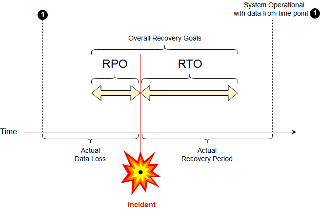

## 一些灾难恢复术语 - Disaster recovery
                                                                         
### 作者                                                                         
digoal                                                                         
                                                                         
### 日期                                                                         
2018-12-30                                                                      
                                                                         
### 标签                                                                         
PostgreSQL , rpo , rto , 灾难恢复 , dr , mttr , mtbf , mttf 
                                                                         
----                                                                         
                                                                         
## 背景       
https://en.wikipedia.org/wiki/Mean_time_to_repair  
  
https://en.wikipedia.org/wiki/MTTR   
  
https://en.wikipedia.org/wiki/Disaster_recovery  
  
  
  
  
  
  
  
  
  
  
  
  
  
  
#### [digoal's PostgreSQL文章入口](https://github.com/digoal/blog/blob/master/README.md "22709685feb7cab07d30f30387f0a9ae")
  
  

  
  
  
  
  
  
  
  
#### [免费领取阿里云RDS PostgreSQL实例、ECS虚拟机](https://www.aliyun.com/database/postgresqlactivity "57258f76c37864c6e6d23383d05714ea")
  
