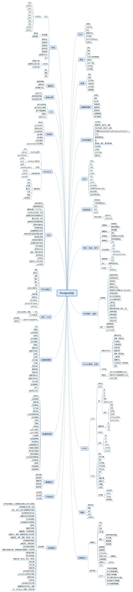

## PostgreSQL 11 2天培训(含全面的PG知识图谱、含Oracle迁移到PG知识点) - 含视频讲解    
                                                                             
### 作者                                                                             
digoal                                                                             
                                                                             
### 日期                                                                             
2019-01-05                                                                          
                                                                             
### 标签                                                                             
PostgreSQL , 培训 , 去O , DBA , 开发者 , 架构师 , 运维 , 决策者 , CTO , adam , PPAS , 阿里云      
                                                                             
----                                                                             
                                                                             
## 背景      
2天，带练习的PostgreSQL培训大纲，分为十五章。    
  
### 知识图谱
  
    
#### 目标群体：    
    
开发者、DBA、运维、架构师、企业去O决策者。    
  
本课程已在PG技术进阶钉钉群开始直播，每周一讲，感兴趣的同学可以加群学习，二维码如下。   
  
  
  
如果企业有PG培训的需求，也欢迎联系我。  
  
  
    
#### 课程目标：    
学完本课程，可以掌握：    
    
1、从PG的历史、社区、架构、客户群、应用场景、生态角度了解PG，同时对于PG与其他企业级商用数据库产品有一个大致的差异化理解，了解PG的学习资料，技术交流圈子。    
    
2、熟悉PostgreSQL在Linux中的软件安装    
    
3、熟悉数据库初始化、架构、参数、防火墙、权限体系、逻辑结构。    
    
4、学习掌握数据库的使用，数据类型、操作符、对象类型内置函数，高级SQL用法。    
    
5、学习掌握PG的btree,hash,gin,gist,spgist,brin,bloom,rum索引接口，以及应用场景。    
    
6、学习掌握数据库的工业通用、定制压测方法。    
    
7、了解数据库的持续备份、时间点恢复，导入、导出。    
    
8、了解数据库的HA架构，流复制备库，quorum based多副本架构，读写分离。    
    
9、学习掌握PG的逻辑订阅功能，了解通过MTK从其他数据库（Oracle, mysql, sybase, mssql）迁移到PG，了解异构数据库增量同步到PG。      
    
10、了解PG的sharding的使用、生态    
    
11、学习掌握PG的SQL审计配置、PG的日常维护，监控，排错，PG的优化方法。    
    
12、学习掌握PG的ORACLE兼容插件，PLPGSQL的开发，了解PG的其他存储过程语言，了解PG的商用版本PPAS的ORACLE兼容性，差异性。    
    
13、学习掌握ADAM去O方法论。    
    
14、学习掌握PG的OLTP,OLAP混合负载的场景，并行计算算法    
    
15、学习掌握为什么需要连接池，以及连接池的配置和用法    
    
16、了解PG的多模应用    
    
17、了解PG的应用案例    
    
18、了解数据库原理    
    
19、了解数据库开发、管理规约    
    
20、了解PG的技术圈子，继续学习PG的方法    
    
### 第一章：掀开 PostgreSQL 的盖头    
[观看视频回放](https://yq.aliyun.com/live/919)  
    
#### 课时：1.5    
    
#### 内容概要：    
1、历史介绍    
2、社区介绍    
3、特性介绍    
4、常见部署架构介绍    
5、国内外常见客户介绍    
6、常见应用场景介绍    
7、流行衍生产品介绍(gpdb, citus, agensgraph, pipelinedb)    
8、基于PG的数据库(antddb, 瀚高数据库) 、云厂商介绍(阿里云\aws)   
9、相比其他开源、商业数据库差异化介绍    
10、技术交流圈子、学习资料介绍    
    
#### 目标：    
1、从PG的历史、社区、架构、客户群、应用场景、生态角度了解PG，同时对于PG与其他企业级商用数据库产品有一个大致的差异化理解，了解PG的学习资料，技术交流圈子。    
    
#### 参考：  
[《中国 PostgreSQL 生态构建思考 - 安全合规、自主可控、去O战略》](../197001/20181218_02.md)    
  
[《Oracle DBA 增值 PostgreSQL,Greenplum 学习计划 - 珍藏级》](../201804/20180425_01.md)    
  
[《阿里云 PostgreSQL 产品生态；案例、开发实践、管理实践、数据库原理、学习资料、学习视频 - 珍藏级》](../201801/20180121_01.md)    
  
https://wiki.postgresql.org/wiki/PostgreSQL_derived_databases    
    
#### 练习：    
无    
    
---     
    
### 第二章：安装    
[观看视频回放](https://yq.aliyun.com/live/931)  
    
#### 课时：1    
    
#### 内容概要：    
1、介绍Linux环境的数据库相关内核参数、存储、文件系统、资源限制、CGROUP资源隔离等相关配置与优化    
2、介绍Linux下PostgreSQL的编译安装    
3、介绍Linux下PostgreSQL的rpm安装    
    
#### 目标：    
1、熟悉PostgreSQL在Linux中的软件安装    
  
#### 参考：  
[《DBA不可不知的操作系统内核参数》](../201608/20160803_01.md)    
  
[《PostgreSQL on Linux 最佳部署手册 - 珍藏级》](../201611/20161121_01.md)    
  
[《PostgreSQL Huge Page 使用建议 - 大内存主机、实例注意》](../201803/20180325_02.md)    
  
[《PostgreSQL 10 + PostGIS + Sharding(pg_pathman) + MySQL(fdw外部表) on ECS 部署指南(适合新用户) - 珍藏级》](../201710/20171018_01.md)    
    
#### 练习：    
在自己的环境中，比如Windows、Linux、MAC中安装PostgreSQL软件。    
    
---     
    
### 第三章：实例初始化、基本配置    
[观看第1节视频回放](https://yq.aliyun.com/live/946)    
[观看第2节视频回放](https://yq.aliyun.com/live/966)  
    
#### 课时：1    
    
#### 内容概要：    
1、初始化数据库实例    
2、数据库架构    
3、PG参数介绍、优化    
4、数据库防火墙介绍与配置    
5、数据库权限体系、逻辑结构介绍    
6、连接数据库    
7、PG 11 新特性
    
#### 目标：    
1、熟悉数据库初始化、架构、参数、防火墙、权限体系、逻辑结构。    
  
2、了解PG 11 新特性。   
  
#### 参考：  
https://www.postgresql.org/docs/11/app-initdb.html  
  
http://www.interdb.jp/pg/  
  
[《PostgreSQL 逻辑结构 和 权限体系 介绍》](../201605/20160510_01.md)    
    
[《阿里云 PostgreSQL 产品生态；案例、开发实践、管理实践、数据库原理、学习资料、学习视频 - 珍藏级》](../201801/20180121_01.md)    
  
[《PostgreSQL 11 参数模板 - 珍藏级》](../201812/20181203_01.md)    
  
https://www.postgresql.org/docs/11/auth-pg-hba-conf.html  
  
https://www.postgresql.org/docs/11/app-psql.html  
  
https://www.pgadmin.org/  
  
http://www.navicat.com.cn/  
  
https://www.postgresql.org/docs/11/release-11.html  
  
#### 练习：    
1、初始化数据库实例    
2、完成参数配置    
3、远程连接数据库    
    
---     
    
### 第四章：应用开发者指南    
[观看第1节视频回放](https://yq.aliyun.com/live/974)    
[观看第2节视频回放](https://yq.aliyun.com/live/996)  
[观看第3节视频回放](https://yq.aliyun.com/live/1040)  
[观看第4节视频回放](https://yq.aliyun.com/live/1075)  
[观看第5节视频回放](https://yq.aliyun.com/live/1092)  
[观看第6节视频回放](https://yq.aliyun.com/live/1106)  
[观看第7节视频回放](https://yq.aliyun.com/live/1123)  
[观看第8节视频回放](https://yq.aliyun.com/live/1132)  
[观看第9节视频回放](https://yq.aliyun.com/live/1148)  
[观看第10节视频回放](https://yq.aliyun.com/live/1204)  
    
#### 课时：1.5    
    
#### 内容概要：    
1、基本SQL语句用法    
2、数据类型、操作符    
3、数据库对象类型    
4、内置函数    
5、自定义函数sql, plpgsql    
6、高级SQL用法与应用场景    
7、事务隔离级别   
8、锁   
9、触发器、事件触发器、规则   
10、分区表   
11、异步消息    
    
#### 目标：    
1、学习数据库的使用，数据类型、操作符、对象类型内置函数，高级SQL用法、事务隔离级别和锁。    
2、掌握触发器，事件触发器的使用。  
3、掌握分区表的使用，异步消息的使用。  
    
#### 参考：  
https://www.postgresql.org/docs/11/sql.html  
  
[《PostgreSQL SELECT 的高级用法(CTE, LATERAL, ORDINALITY, WINDOW, SKIP LOCKED, DISTINCT, GROUPING SETS, ...) - 珍藏级》](../201802/20180226_05.md)    
  
http://www.postgresqltutorial.com/  
  
https://www.postgresql.org/docs/11/plpgsql.html   
  
https://www.postgresql.org/docs/11/mvcc.html   
  
[《PostgreSQL 闪回 - flash back query emulate by trigger》](../201408/20140828_01.md)    
  
[《PostgreSQL 触发器应用 - use trigger audit record which column modified, insert, delete.》](../201412/20141214_01.md)    
  
[《PostgreSQL 触发器 用法详解 2》](../201303/20130311_02.md)    
  
[《PostgreSQL 触发器 用法详解 1》](../201303/20130311_01.md)    
  
[《PostgreSQL 流式处理应用实践 - 二手商品实时归类(异步消息notify/listen、阅后即焚)》](../201807/20180713_03.md)    
  
[《PostgreSQL 谁堵塞了谁（锁等待检测）- pg_blocking_pids, pg_safe_snapshot_blocking_pids》](../201902/20190201_02.md)  
  
[《PostgreSQL 锁等待监控 珍藏级SQL - 谁堵塞了谁》](../201705/20170521_01.md)  
  
#### 练习：    
1、建表，写入测试数据，聚合查询，递归查询，分解查询，自定义函数，自定义并行函数。    
2、配置死锁检测，模拟死锁。  
3、使用rc, rr隔离级别。  
4、使用ADLOCK，解决秒杀场景问题。  
5、自定义触发器，实现特定数据审计。  
6、自定义事件触发器，控制某些用户没有DDL权限。  
7、自定义分区表。   
8、自定义触发器，使用异步消息，用于异常数据的检测。    
    
---     
    
### 第五章：索引应用、性能压测    
    
#### 课时：1.5    
    
#### 内容概要：    
1、索引、索引内窥插件pageinspect、以及索引应用场景介绍    
2、数据库压测(tpcc,tpcb,tpch,自定义压测,存储测试,时钟测试)    
3、快速构建海量逼真数据    
    
#### 目标：    
1、学习PG的btree,hash,gin,gist,spgist,brin,bloom,rum索引接口，以及应用场景。    
2、学习数据库的工业通用、定制压测方法。    
    
#### 参考：  
https://www.postgresql.org/docs/11/pageinspect.html  
  
[《PostgreSQL SQL自动优化案例 - 极简，自动推荐索引》](../201801/20180111_02.md)    
  
[《自动选择正确索引访问接口(btree,hash,gin,gist,sp-gist,brin,bitmap...)的方法》](../201706/20170617_01.md)    
  
[《PostgreSQL pageinspect 诊断与优化GIN (倒排) 索引合并延迟导致的查询性能下降问题》](../201809/20180919_02.md)    
  
[《PostgreSQL 黑科技 - 空间聚集存储, 内窥GIN, GiST, SP-GiST索引》](../201709/20170905_01.md)    
  
[《通过空间思想理解GiST索引的构造》](../201708/20170825_01.md)    
  
https://www.postgresql.org/docs/11/pgbench.html  
  
https://www.postgresql.org/docs/11/pgtestfsync.html  
  
https://www.postgresql.org/docs/11/pgtesttiming.html  
  
[《fio测试IO性能》](../201604/20160407_01.md)    
  
[《PostgreSQL 11 tpcc 测试(103万tpmC on ECS) - use sysbench-tpcc by Percona-Lab》](../201809/20180913_01.md)    
  
[《(TPC-H测试 SF=10,SF=200) PostgreSQL 11 vs 10 vs Deepgreen》](../201808/20180823_01.md)    
  
[《PostgreSQL 如何快速构建 海量 逼真 测试数据》](../201711/20171121_01.md)    
  
[《HTAP 数据库 - 多场景 - 自定义压测》](../201711/readme.md)  
  
[《数据库界的华山论剑 tpc.org》](../201701/20170125_01.md)  
  
#### 练习：    
1、构建离散测试数据，调出index onlyscan，对比index scan，观察explain (analyze,verbose,timing,costs,buffers) 差异    
2、构建用于hash,gin,gist,brin查询的数据，同时使用explain (analyze,verbose,timing,costs,buffers) 观察索引扫描。    
3、表达式索引的使用。  
4、WHERE索引的使用。  
    
---     
    
### 第六章：备份、恢复、容灾    
    
#### 课时：1.5    
    
#### 内容概要：    
1、备份的几种方式（逻辑全量、数据文件+归档，数据文件增量，快照）介绍    
2、异地持续备份（pg_receivewal、standby）    
3、异地容灾    
4、还原点概念    
5、时间点恢复    
6、pg_dump逻辑备份、导出，服务端COPY和客户端COPY    
7、TOC概念，pg_restore数据导入、批量数据入库(insert批量，服务端和客户端COPY批量)    
    
#### 目标：    
1、了解数据库的持续备份、时间点恢复，导入、导出。    
    
#### 参考：  
https://www.postgresql.org/docs/11/app-pgreceivewal.html  
  
[《PostgreSQL 10 on ECS 实施 流复制备库镜像+自动快照备份+自动备份验证+自动清理备份与归档 - 珍藏级》](../201711/20171129_02.md)    
  
[《PostgreSQL on ECS多云盘的部署、快照备份和恢复》](../201708/20170812_01.md)    
  
[《PostgreSQL 最佳实践 - 块级增量备份(ZFS篇)验证 - recovery test script for zfs snapshot clone + postgresql stream replication + archive》](../201608/20160823_09.md)    
  
[《PostgreSQL 最佳实践 - 块级增量备份(ZFS篇)双机HA与块级备份部署》](../201608/20160823_08.md)    
  
[《PostgreSQL 最佳实践 - 块级增量备份(ZFS篇)单个数据库采用多个zfs卷(如表空间)时如何一致性备份》](../201608/20160823_07.md)    
  
[《PostgreSQL 最佳实践 - 块级增量备份(ZFS篇)备份集有效性自动校验》](../201608/20160823_06.md)    
  
[《PostgreSQL 最佳实践 - 块级增量备份(ZFS篇)方案与实战》](../201608/20160823_05.md)    
  
[《PostgreSQL 最佳实践 - 任意时间点恢复源码分析》](../201608/20160823_04.md)    
  
[《PostgreSQL 最佳实践 - 在线增量备份与任意时间点恢复》](../201608/20160823_03.md)    
  
[《PostgreSQL 最佳实践 - 冷备份与还原介绍》](../201608/20160823_02.md)    
  
[《PostgreSQL 最佳实践 - 在线逻辑备份与恢复介绍》](../201608/20160823_01.md)    
  
[《PostgreSQL Logical Backup's TOC File》](../201204/20120412_01.md)    
  
[《PostgreSQL 服务端COPY和客户端COPY - 暨PG有哪些服务端操作接口》](../201805/20180516_03.md)    
  
[《PostgreSQL copy (quote,DELIMITER,...) single byte char 的输入》](../201805/20180510_01.md)    
  
[《PostgreSQL 如何实现批量更新、删除、插入》](../201704/20170424_05.md)    
  
[《PostgreSQL 使用逻辑decode实现异步主从切换后，时间线分歧变化量补齐》](../201901/20190129_01.md)  
  
[《PostgreSQL pg_rewind，时间线修复，脑裂修复 - 从库开启读写后，回退为只读从库。异步主从发生角色切换后，主库rewind为新主库的从库》](../201901/20190128_02.md)  
  
#### 练习：    
1、配置数据库参数，并完成一次全量备份，归档备份。    
2、对数据库进行一些读写，记录时间，XID，创建恢复点，完成一次时间点恢复。    
3、完成一次服务端COPY导入导出。    
4、完成一次客户端COPY导入导出。    
5、完成一次逻辑备份全库，并恢复到目标库。    
    
---     
    
### 第七章：replica(流复制)、多副本、读写分离、HA  
    
#### 课时：2    
    
#### 内容概要：    
1、HA架构（基于流复制，基于共享存储），常用的HA软件(patroni, rhcs)。     
2、基于流复制的active standby    
3、多副本，两地三中心环境部署介绍    
4、基于pgpool的透明读写分离    
    
#### 目标：    
1、了解数据库的HA架构，流复制备库，quorum based多副本架构，读写分离。    
    
#### 参考：  
[《[转载] PostgreSQL HA patroni》](../201901/20190105_02.md)    
  
[《PostgreSQL 一主多从(多副本,强同步)简明手册 - 配置、压测、监控、切换、防脑裂、修复、0丢失 - 珍藏级》](../201803/20180326_01.md)    
  
[《PostgreSQL 最佳实践 - 读写分离》](../201608/20160824_03.md)    
  
[《PostgreSQL 时间点恢复（PITR）在异步流复制主从模式下，如何避免主备切换后PITR恢复走错时间线(timeline , history , partial , restore_command , recovery.conf)》](../201901/20190120_03.md)   
  
#### 练习：    
1、搭建一个流复制备库    
2、搭建一个quorum based的流复制备库，并模拟一个、多个备库DOWN机，观察同步事务的状态    
3、压测，观察同步复制带来的延迟、异步复制带来的延迟    
    
---     
    
### 第八章：单元化、逻辑订阅，同构、异构迁移、同步    
    
#### 课时：1.5    
    
#### 内容概要：    
1、基于流复制协议的逻辑订阅    
2、多向复制(multi-master)的方法    
3、异构数据库迁移 (mtk)    
4、异构数据库增量准实时同步（xDB replication server）    
    
#### 目标：    
1、学习PG的逻辑订阅功能，了解通过MTK从其他数据库（Oracle, mysql, sybase, mssql）迁移到PG，了解使用xDB replication server实施异构、同构数据库增量同步到PG。      
    
#### 参考：  
[《multi-master - 多主 - 多写 - 如何在多写中避免数据复制打环(死循环)》](../201811/20181119_01.md)    
  
[《使用PostgreSQL逻辑订阅实现multi-master》](../201706/20170624_01.md)    
  
[《PostgreSQL 10 流式物理、逻辑主从 最佳实践》](../201707/20170711_01.md)    
  
[《PostgreSQL 10.0 preview 逻辑订阅 - 原理与最佳实践》](../201702/20170227_01.md)    
  
[《MTK - PG,PPAS,oracle,mysql,ms sql,sybase 迁移到 PG, PPAS (跨版本升级)》](../201812/20181226_01.md)    
  
edb replication server:   
  
https://www.enterprisedb.com/advanced-downloads  
  
https://www.enterprisedb.com/edb-replication-server-62-linux64  
  
[《xDB Replication Server - PostgreSQL, MySQL, Oracle, SQL Server, PPAS 全量、增量(redo log based, or trigger based)同步（支持single-master, mult-master同步, 支持DDL）》](../201902/20190203_01.md)    
  
https://www.postgresql.org/docs/11/logical-replication.html  
  
#### 练习：    
1、建立两个PG实例，练习使用逻辑订阅，发布表、订阅表。    
  
2、练习使用MTK实施同构、异构迁移。  
  
3、练习使用xDB replication server实施同构、异构迁移、增量同步。  
    
---     
    
### 第九章：sharding    
    
#### 课时：1    
    
#### 内容概要：    
1、PG的sharding用法、不同sharding用法的差异、应用场景：plproxy, citus, antdb, sharding sphere, pg-xl, gpdb     
    
#### 目标：    
1、了解PG的sharding的使用、生态    
  
#### 参考：  
[《PostgreSQL 最佳实践 - 水平分库(基于plproxy)》](../201608/20160824_02.md)    
  
[《阿里云ApsaraDB RDS for PostgreSQL 最佳实践 - 4 水平分库(plproxy) 之 节点扩展》](../201512/20151220_04.md)    
  
[《阿里云ApsaraDB RDS for PostgreSQL 最佳实践 - 3 水平分库(plproxy) vs 单机 性能》](../201512/20151220_03.md)    
  
[《阿里云ApsaraDB RDS for PostgreSQL 最佳实践 - 2 教你RDS PG的水平分库(plproxy)》](../201512/20151220_02.md)    
  
[《PostgreSQL sharding : citus 系列7 - topn 加速(```count(*) group by order by count(*) desc limit x```) (use 估值插件 topn)》](../201809/20180914_01.md)    
  
[《PostgreSQL sharding : citus 系列6 - count(distinct xx) 加速 (use 估值插件 hll|hyperloglog)》](../201809/20180913_04.md)    
  
[《PostgreSQL sharding : citus 系列5 - worker节点网络优化》](../201809/20180905_02.md)    
  
[《PostgreSQL sharding : citus 系列4 - DDL 操作规范 (新增DB，TABLE，SCHEMA，UDF，OP，用户等)》](../201809/20180905_01.md)    
  
[《PostgreSQL sharding : citus 系列3 - 窗口函数调用限制 与 破解之法(套用gpdb执行树,分步执行)》](../201809/20180902_01.md)    
  
[《PostgreSQL sharding : citus 系列2 - TPC-H》](../201808/20180829_01.md)    
  
[《PostgreSQL sharding : citus 系列1 - 多机部署（含OLTP(TPC-B)测试）》](../201808/20180824_02.md)    
  
https://github.com/ADBSQL/AntDB  
  
https://github.com/greenplum-db/gpdb  
  
https://www.postgres-xl.org/  
  
https://www.citusdata.com/product  
  
https://plproxy.github.io/  
    
#### 练习：    
1、配置和使用citus    
    
---     
    
### 第十章：日常维护、监控、排错、优化    
    
#### 课时：1.5    
    
#### 内容概要：    
1、配置审计，以及审计日志的报告用法(pgBadger)    
2、PG的日常维护    
3、连接池的介绍，为什么需要连接池，会话级缓存（长连接，分区表需要注意的问题）    
4、监控指标，常用监控软件（pgmetric, pgstatsinfo, nagios, zabbix等）    
5、排错    
6、PG的优化方法    
    
#### 目标：    
1、学习PG的SQL审计配置、PG的日常维护，连接池，监控，排错，PG的优化方法。    
    
#### 参考：  
[《PostgreSQL Oracle 兼容性之 - performance insight - AWS performance insight 理念与实现解读 - 珍藏级》](../201901/20190125_02.md)   
  
[《EnterpriseDB & PostgreSQL RLS & Oracle VPD》](../201602/20160203_03.md)    
  
https://www.postgresql.org/docs/11/maintenance.html  
  
[《PostgreSQL 实时健康监控 大屏 - 低频指标 - 珍藏级》](../201806/20180613_04.md)    
  
[《PostgreSQL 实时健康监控 大屏 - 高频指标(服务器) - 珍藏级》](../201806/20180613_03.md)    
  
[《PostgreSQL 实时健康监控 大屏 - 高频指标 - 珍藏级》](../201806/20180613_02.md)    
  
[《PostgreSQL pgmetrics - 多版本、健康监控指标采集、报告》](../201810/20181001_03.md)    
  
[《PostgreSQL relcache在长连接应用中的内存霸占"坑"》](../201607/20160709_01.md)    
  
[《阿里云 RDS PostgreSQL 高并发特性 vs 社区版本 (1.6万并发: 3倍吞吐，240倍响应速度)》](../201805/20180505_07.md)    
  
[《PostgresPro buildin pool(内置连接池)版本 原理与测试》](../201805/20180521_03.md)    
  
[《PostgreSQL 连接池 pgbouncer 使用》](../201005/20100511_03.md)    
  
[《阿里云 PostgreSQL 产品生态；案例、开发实践、管理实践、数据库原理、学习资料、学习视频 - 珍藏级》](../201801/20180121_01.md)    
  
#### 练习：    
1、配置审计日志，观察审计日志。    
2、观察膨胀，垃圾回收，在线索引重建，DDL操作防雪崩，AB表切换。    
3、性能压测，同时观察TOP SQL。    
4、制造一些错误，观察报错的源码。    
    
---     
    
### 第十一章：Oracle兼容、迁移    
    
#### 课时：1.5    
    
#### 内容概要：    
1、Oracle 兼容插件orafce    
2、plpgsql存储过程介绍，pl/sql转换到PLPGSQL的例子    
3、其他存储过程语言(pljava, plperl, pltcl, pllua等)    
4、PG兼容ORACLE的商用版本PPAS 介绍，兼容点有哪些，有哪些差异化特色。    
5、ADAM 去O方法论    
    
#### 目标：    
1、学习PG的ORACLE兼容插件，PLPGSQL的开发，了解PG的其他存储过程语言，了解PG的商用版本PPAS的ORACLE兼容性，差异性。    
2、学习ADAM去O方法论。    
    
#### 参考：  
[《PostgreSQL Oracle 兼容性之 - orafce介绍》](../201512/20151221_01.md)    
  
https://promotion.aliyun.com/ntms/act/ppasadam.html  
  
https://www.postgresql.org/docs/11/plpgsql.html  
  
[《PostgreSQL vs PPAS 差异 - Oracle评估、迁移、验证、性能调优》](../201812/20181210_01.md)    
  
[《PostgreSQL(PPAS 兼容Oracle) 从零开始入门手册 - 珍藏版》](../201811/20181102_02.md)    
  
[《EDB PPAS (PostgreSQL plus advanced server) 10 参数模板 - 珍藏级》](../201805/20180522_04.md)    
  
[《EDB PPAS(Oracle 兼容版) Oracle与PostgreSQL 兼容模式的参数配置切换 - 珍藏级》](../201804/20180411_02.md)    
  
[《PostgreSQL 商用版本EPAS(阿里云ppas(Oracle 兼容版)) - 分区表性能优化 (堪比pg_pathman)》](../201801/20180122_03.md)    
  
[《PostgreSQL 商用版本EPAS(阿里云ppas) - 测试环境部署(EPAS 安装、配置、管理、Oracle DBLINK、外表)》](../201801/20180119_01.md)    
  
[《PostgreSQL 商用版本EPAS(阿里云ppas(Oracle 兼容版)) 自定义custom plan次数》](../201801/20180118_04.md)    
  
[《PostgreSQL 商用版本EPAS(阿里云ppas(Oracle 兼容版)) SQL防火墙使用（白名单管理、防SQL注入、防DDL等）》](../201801/20180116_02.md)    
  
[《PostgreSQL 商用版本EPAS(阿里云ppas(Oracle 兼容版)) NUMA 架构spin锁等待优化》](../201801/20180113_04.md)    
  
[《PostgreSQL 商用版本EPAS(阿里云ppas(Oracle 兼容版)) 自动(postgresql.conf)参数计算与适配功能》](../201801/20180113_03.md)    
  
[《PostgreSQL 商用版本EPAS(阿里云ppas(Oracle 兼容版)) 索引推荐功能使用》](../201801/20180113_02.md)    
  
[《PostgreSQL 商用版本EPAS(阿里云ppas(Oracle 兼容版)) HTAP功能之资源隔离管理 - CPU与刷脏资源组管理》](../201801/20180113_01.md)    
  
[《如何生成和阅读EnterpriseDB (PPAS(Oracle 兼容版)) AWR诊断报告》](../201606/20160628_01.md)    
  
[《MTK - PG,PPAS,oracle,mysql,ms sql,sybase 迁移到 PG, PPAS (跨版本升级)》](../201812/20181226_01.md)  
  
#### 练习：    
1、安装ppas    
2、配置PPAS的PG兼容模式和ORACLE兼容模式    
3、使用ADAM评估去O。    
    
---     
    
### 第十二章：创新能力（HTAP、混合负载、多模）、应用案例    
    
#### 课时：1.5    
    
#### 内容概要：    
1、介绍PG的混合负载配置（并行计算相关的参数配置），并行计算的并行度算法    
2、介绍PG的多模插件（多维、中文分词、模糊查询、图像查询、相似搜索、时空、时序、空间、流计算、列存、机器学习、异构数据外部表、GPU加速），阿里云的ganos, varbitx, roaringbitmap, 冷热分离oss_fdw等插件。    
3、案例介绍(场景、应用案例，包括cloud native特性：ganos,adam,varbitx,oss_fdw冷暖数据分离等案例)    
    
#### 目标：    
1、学习PG的OLTP,OLAP混合负载的场景，并行计算算法。    
2、了解PG的多模应用    
3、了解PG的应用案例    
  
#### 参考：  
https://www.postgresql.org/docs/11/parallel-query.html  
  
[《PostgreSQL 9.6 并行计算 优化器算法浅析 - 以及如何强制并行度》](../201610/20161002_01.md)    
  
[《PostgreSQL 11 并行计算算法，参数，强制并行度设置》](../201812/20181218_01.md)    
  
[《阿里云 PostgreSQL 产品生态；案例、开发实践、管理实践、数据库原理、学习资料、学习视频 - 珍藏级》](../201801/20180121_01.md)    
    
#### 练习：    
1、强制并行计算练习    
2、练习中文分词插件的安装和使用，    
3、练习多维向量相似搜索的使用，    
4、练习模糊查询的使用，    
5、练习流计算的使用，    
6、练习GIS的使用。    
    
---     
    
### 第十三章：PG数据库原理    
    
#### 课时：1.5    
    
#### 内容概要：    
1、堆存储原理    
2、记录存储原理    
3、类型压缩原理    
4、切片存储原理    
5、索引数据结构、存储结构    
6、扫描\JOIN方法    
7、HINT    
8、垃圾回收原理    
    
#### 目标：    
1、了解数据库原理    
  
#### 参考：  
http://www.interdb.jp/pg/  
  
[《阿里云 PostgreSQL 产品生态；案例、开发实践、管理实践、数据库原理、学习资料、学习视频 - 珍藏级》](../201801/20180121_01.md)    
    
#### 练习：    
1、优化器开关，观察不同的扫描、JOIN方法    
2、观察垃圾回收的详情    
    
---     
    
### 第十四章：管理、开发规约    
    
#### 课时：1    
    
#### 内容概要：    
1、规约    
2、社区官网、官微、PG钉钉技术群（每周直播、专家问答）、讲师微信、学习资料(git)    
3、问答    
    
#### 目标：    
1、了解数据库开发、管理规约    
2、了解PG的技术圈子，继续学习PG的方法    
  
#### 参考：  
[《PostgreSQL 数据库开发规范》](../201609/20160926_01.md)    
    
#### 练习：    
无    
    
### 第十五章：考试  
考试通道：可以使用云栖考试通道，出题，考试。       
    
考试覆盖内容：本次培训内容，PostgreSQL官网手册内容，PG内核相关内容。     
    
考试时长：90 min     
      
## 参考  
[《阿里云 PostgreSQL 产品生态；案例、开发实践、管理实践、数据库原理、学习资料、学习视频 - 珍藏级》](../201801/20180121_01.md)    
  
[《PostgreSQL 案例、开发、管理实践、架构、原理、诊断、调优 PDF》](../201801/20180121_01_pdf_001.pdf)        
      
[《PG 生态与社区工作汇报》](../201801/20180121_01_pdf_002.pdf)  
    
[《Oracle DBA 增值 PostgreSQL,Greenplum 学习计划 - 珍藏级》](../201804/20180425_01.md)    
  
[《PostgreSQL、Greenplum 《如来神掌》 - 目录 - 珍藏级》](../201706/20170601_02.md)    
    
[《PostgreSQL 多场景 沙箱实验》](../201805/20180524_02.md)    
    
[About me](../me/readme.md)     
    
    
<a rel="nofollow" href="http://info.flagcounter.com/h9V1"  ></a>    
    
    
## [digoal's 大量PostgreSQL文章入口](https://github.com/digoal/blog/blob/master/README.md "22709685feb7cab07d30f30387f0a9ae")  
    
    
## [免费领取阿里云RDS PostgreSQL实例、ECS虚拟机](https://free.aliyun.com/ "57258f76c37864c6e6d23383d05714ea")  
    
