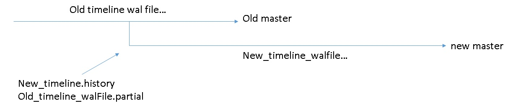

## PostgreSQL 时间点恢复（PITR）在异步流复制主从模式下，如何避免主备切换后PITR恢复(备库、容灾节点、只读节点)走错时间线(timeline , history , partial , restore_command , recovery.conf)    
                      
### 作者                      
digoal                      
                      
### 日期                      
2019-01-20                      
                      
### 标签                      
PostgreSQL , 恢复 , 时间点恢复 , PITR , restore_command , recovery.conf , partial , history , 任意时间点恢复 , timeline , 时间线      
                  
----                
                  
## 背景             
政治正确非常重要，对于数据库来说亦如此，一个基于流复制的HA架构的集群，如果还有一堆只读节点，当HA集群发生了主备切换后，这些只读节点能否与新的主节点保持同步关系（类似与政治正确），很重要。  
  
基于流复制的主从库模式，主库和从库都可以归档WAL日志。如果使用的是异步复制，主库和从库可能存在一定的WAL差异，如果从库激活，会启用新的时间线。  
  
意味着老的时间线上的WAL并没有全部同步到新的主库新的时间线上。归档也会存在差异。  
  
如何配置PITR恢复，才不会走老路，一直紧跟新的时间线呢？  
  
取决于PITR时，在走错WAL前，是否先发现新时间线的HISTORY文件。  
  
## 例子  
  
图  
  
  
  
  
  
### 测试环境  
  
单一主机，不同实例使用不同监听端口。  
  
1、主库端口8001（TL=1）  
  
/data01/digoal/pg_root8001  
  
2、从库1端口8000（激活后，TL=2）  
  
/data01/digoal/pg_root8000  
  
3、PITR实例端口8002（使用restore_command，一直恢复到最新TL）  
  
/data01/digoal/pg_root8002  
  
4、从库1激活后，基于它创建的从库2端口8003（激活后，TL=3）  
  
/data01/digoal/pg_root8003  
  
5、归档目录  
  
/data01/digoal/wal  
  
### 环境变量  
  
```  
.bash_profile  
  
export PS1="$USER@`/bin/hostname -s`-> "      
export PGPORT=8001      
export PGDATA=/data01/digoal/pg_root$PGPORT      
export LANG=en_US.utf8      
export PGHOME=/home/digoal/pgsql11.1  
export LD_LIBRARY_PATH=$PGHOME/lib:/lib64:/usr/lib64:/usr/local/lib64:/lib:/usr/lib:/usr/local/lib:$LD_LIBRARY_PATH      
export DATE=`date +"%Y%m%d%H%M"`    
export PATH=$PGHOME/bin:$PATH:.      
export MANPATH=$PGHOME/share/man:$MANPATH      
export PGHOST=$PGDATA      
export PGUSER=postgres      
export PGDATABASE=postgres      
alias rm='rm -i'      
alias ll='ls -lh'      
unalias vi  
```  
  
### 建主库  
  
```  
initdb -D $PGDATA -U postgres -E UTF8 --lc-collate=C --lc-ctype=en_US.utf8  
```  
  
### 配置参数  
  
```  
postgresql.conf  
  
本例测试场景的关键配置  
  
listen_addresses = '0.0.0.0'  
port = 8001  
max_connections = 1000  
unix_socket_directories = '.,/tmp'  
max_worker_processes = 128  
wal_level = replica    
archive_mode = on     # 如果配置为always 则从库也归档日志   
archive_command = 'cp -n %p /data01/digoal/wal/%f'    # 拷贝WAL到指定目录, 包括激活时产生的 partial，history 文件，-n 避免重复拷贝  
max_wal_senders = 8  
hot_standby = on  
wal_receiver_status_interval = 1s  
```  
  
### 配置HBA  
  
  
```  
pg_hba.conf  
  
确保流复制可用  
  
# "local" is for Unix domain socket connections only  
local   all             all                                     trust  
# IPv4 local connections:  
host    all             all             127.0.0.1/32            trust  
# IPv6 local connections:  
host    all             all             ::1/128                 trust  
# Allow replication connections from localhost, by a user with the  
# replication privilege.  
local   replication     all                                     trust  
host    replication     all             127.0.0.1/32            trust  
host    replication     all             ::1/128                 trust  
```  
  
### 配置recovery.done  
  
```  
recovery.done  
  
  
restore_command = 'cp /data01/digoal/wal/%f %p'  
recovery_target_timeline = 'latest'  
standby_mode = on  
primary_conninfo = 'host=localhost port=8001 user=postgres'  
```  
  
### 创建从库1  
  
```  
pg_basebackup -D /data01/digoal/pg_root8000 -F p -c fast -h 127.0.0.1 -p 8001 -U postgres  
```  
  
配置参数  
  
```  
postgresql.conf  
  
port = 8000  
```  
  
改recovery.done文件名  
  
```  
mv recovery.done recovery.conf  
```  
  
启动从库1  
  
```  
pg_ctl start -D /data01/digoal/pg_root8000  
```  
  
确保主从开始正常同步  
  
```  
查询主库  
  
postgres=# select * from pg_stat_replication ;  
```  
  
所有实例（主，从）将wal归档到同一个ftp目录或NAS目录，方便PITR恢复时取文件。    
  
### 备份主库  
  
```  
pg_basebackup -D /data01/digoal/pg_root8002 -F p -c fast -h 127.0.0.1 -p 8001 -U postgres  
```  
  
### 压测主库  
  
```  
pgbench -i -s 100  
  
pgbench -M prepared -n -r -P 1 -c 16 -j 16 -T 30  
```  
  
### 确保主从同步  
  
```  
查询主库，确保主从WAL完全已同步  
  
postgres=# select * from pg_stat_replication ;  
```  
  
### 激活从库1  
激活从库，从库变可读可写，脱离于主库的同步关系。  
  
```  
pg_ctl promote -D /data01/digoal/pg_root8000  
```  
  
从库采用新时间线2  
  
```  
digoal@pg11-test-> pg_controldata -D /data01/digoal/pg_root8000|grep -i timeline  
Latest checkpoint's TimeLineID:       2  
Latest checkpoint's PrevTimeLineID:   2  
Min recovery ending loc's timeline:   0  
```  
  
老的主库依旧在使用TL 1  
  
```  
digoal@pg11-test-> pg_controldata -D /data01/digoal/pg_root8001|grep -i timeline  
Latest checkpoint's TimeLineID:       1  
Latest checkpoint's PrevTimeLineID:   1  
Min recovery ending loc's timeline:   0  
```  
  
激活时，产生的文件  
  
  
  
```  
cd /data01/digoal/pg_root8000/pg_wal  
  
三个文件：  
  
patial  
  
history  
  
新时间线WAL文件  
  
如下：  
  
-rw------- 1 digoal digoal  42 Jan 20 18:11 00000002.history  
-rw------- 1 digoal digoal 16M Jan 20 18:11 000000010000000200000058.partial  
-rw------- 1 digoal digoal 16M Jan 20 18:11 000000020000000200000058  
```  
  
主库上，有一个文件000000010000000200000058，是完整的。这里激活从库时，000000010000000200000058文件还没有写完，所以会生成一个000000010000000200000058.partial文件，与主库上的文件名不冲突，同时生成一个新时间线文件00000002.history，这个文件中记录了这个时间线是从哪个WAL位置开始生成的。  
  
另外，新时间线下的WAL会从000000010000000200000058.partial中拷贝已写内容，并以新时间线重新命名，前8个字符以新时间线开始，由于时间线不一样，文件名与老的主库也不会冲突。  
  
时间线文件内容  
  
```  
digoal@pg11-test-> cat 00000002.history  
1       2/58FE0B80      no recovery target specified  
```  
  
老时间线下的partial wal，以及新时间线下的WAL文件  
  
```  
digoal@pg11-test-> md5sum 000000010000000200000058.partial  
163531112a802bb152e7a57c9b06d62d  000000010000000200000058.partial  
  
  
digoal@pg11-test-> md5sum 000000020000000200000058  
1b4e44ffa9e3f5025ddb260a1d117f5e  000000020000000200000058  
```  
  
老主库的000000010000000200000058文件，由于后面还继续在写老主库，所以时间线1上，还有其他WAL文件产生，与TL2产生了WAL分歧。  
  
```  
digoal@pg11-test-> md5sum 000000010000000200000058  
e0193410858e5f0440d1a3f9404edcd4  000000010000000200000058  
```  
  
注意，激活从库时，这个激活时的WAL文件，partial内容（部分内容，即在TL1上产生的WAL内容）在三个文件中是一致的。  
  
从库1：  
  
```  
digoal@pg11-test-> pg_waldump 000000010000000200000058.partial|head -n 5  
rmgr: Heap2       len (rec/tot):     58/    58, tx:          0, lsn: 2/58000030, prev 2/57FFFFB8, desc: CLEAN remxid 130039429, blkref #0: rel 1663/13285/16515 blk 26035  
rmgr: Heap        len (rec/tot):     72/    72, tx:  130184523, lsn: 2/58000070, prev 2/58000030, desc: HOT_UPDATE off 114 xmax 130184523 ; new off 115 xmax 130184523, blkref #0: rel 1663/13285/16516 blk 48  
rmgr: Heap        len (rec/tot):     74/    74, tx:  130184538, lsn: 2/580000B8, prev 2/58000070, desc: HOT_UPDATE off 9 xmax 130184538 ; new off 88 xmax 0, blkref #0: rel 1663/13285/16515 blk 26035  
rmgr: Heap        len (rec/tot):     72/    72, tx:  130184530, lsn: 2/58000108, prev 2/580000B8, desc: HOT_UPDATE off 107 xmax 130184530 ; new off 116 xmax 0, blkref #0: rel 1663/13285/16516 blk 48  
rmgr: Heap        len (rec/tot):     72/    72, tx:  130184531, lsn: 2/58000150, prev 2/58000108, desc: HOT_UPDATE off 113 xmax 130184531 ; new off 117 xmax 0, blkref #0: rel 1663/13285/16516 blk 48  
digoal@pg11-test-> pg_waldump 000000020000000200000058|head -n 5  
rmgr: Heap2       len (rec/tot):     58/    58, tx:          0, lsn: 2/58000030, prev 2/57FFFFB8, desc: CLEAN remxid 130039429, blkref #0: rel 1663/13285/16515 blk 26035  
rmgr: Heap        len (rec/tot):     72/    72, tx:  130184523, lsn: 2/58000070, prev 2/58000030, desc: HOT_UPDATE off 114 xmax 130184523 ; new off 115 xmax 130184523, blkref #0: rel 1663/13285/16516 blk 48  
rmgr: Heap        len (rec/tot):     74/    74, tx:  130184538, lsn: 2/580000B8, prev 2/58000070, desc: HOT_UPDATE off 9 xmax 130184538 ; new off 88 xmax 0, blkref #0: rel 1663/13285/16515 blk 26035  
rmgr: Heap        len (rec/tot):     72/    72, tx:  130184530, lsn: 2/58000108, prev 2/580000B8, desc: HOT_UPDATE off 107 xmax 130184530 ; new off 116 xmax 0, blkref #0: rel 1663/13285/16516 blk 48  
rmgr: Heap        len (rec/tot):     72/    72, tx:  130184531, lsn: 2/58000150, prev 2/58000108, desc: HOT_UPDATE off 113 xmax 130184531 ; new off 117 xmax 0, blkref #0: rel 1663/13285/16516 blk 48  
```  
  
老主库：  
  
```  
digoal@pg11-test-> pg_waldump 000000010000000200000058|head -n 5  
rmgr: Heap2       len (rec/tot):     58/    58, tx:          0, lsn: 2/58000030, prev 2/57FFFFB8, desc: CLEAN remxid 130039429, blkref #0: rel 1663/13285/16515 blk 26035  
rmgr: Heap        len (rec/tot):     72/    72, tx:  130184523, lsn: 2/58000070, prev 2/58000030, desc: HOT_UPDATE off 114 xmax 130184523 ; new off 115 xmax 130184523, blkref #0: rel 1663/13285/16516 blk 48  
rmgr: Heap        len (rec/tot):     74/    74, tx:  130184538, lsn: 2/580000B8, prev 2/58000070, desc: HOT_UPDATE off 9 xmax 130184538 ; new off 88 xmax 0, blkref #0: rel 1663/13285/16515 blk 26035  
rmgr: Heap        len (rec/tot):     72/    72, tx:  130184530, lsn: 2/58000108, prev 2/580000B8, desc: HOT_UPDATE off 107 xmax 130184530 ; new off 116 xmax 0, blkref #0: rel 1663/13285/16516 blk 48  
rmgr: Heap        len (rec/tot):     72/    72, tx:  130184531, lsn: 2/58000150, prev 2/58000108, desc: HOT_UPDATE off 113 xmax 130184531 ; new off 117 xmax 0, blkref #0: rel 1663/13285/16516 blk 48  
```  
  
### 继续压测老主库，新主库  
让老主库在TL1上，新主库在TL2时间线上，都继续产生WAL文件，在两个时间线上继续产生WAL文件。  
  
### PITR恢复验证，从备份恢复到新时间线  
从TL1的备份集恢复，持续恢复到TL2。  
  
机制：restore_command 如果发现history 文件，则优先拷贝partial文件，走新时间线分支。因此会采用000000010000000200000058.partial 而不会采用 000000010000000200000058  
  
配置 recovery.conf 时，必须禁止primary_conninfo连接到老主库，否则会走TL1的时间线，并出现分歧后，走不到TL2这个时间线。只能使用restore_command来进行恢复，才能走到TL2的时间线。  
  
原因很简单，因为使用流的方式，会把整个WAL文件都接收完，从而走上老路。而实际上应该使用TL2时间线开端（即激活时刻）的WAL文件（这个WAL文件只有部分内容是TL1的，剩余的内容是激活后产生的）。  
  
  
```  
recovery.conf  
  
  
restore_command = 'cp /data01/digoal/wal/%f %p'  
recovery_target_timeline = 'latest'  # 这一条一定要配置，才会走新时间线  
standby_mode = on  
# primary_conninfo = 'host=localhost port=8001 user=postgres'   # 注释这一条即可，或者改成指向新的主库，但是建议不要改，直接注释最好，因为主备可能经常切换。    
```  
  
如果就只想恢复到老时间线怎么做？配置recovery_target_timeline即可。   
  
  
什么情况下，会走错时间线？  
  
1、流式恢复，并连接了老的主库  
  
2、将老的主库的切换时的wal文件拷贝到了目标集的pg_wal目录（例如本例的000000010000000200000058文件）  
  
  
#### 配置PITR   
  
```  
cd /data01/digoal/pg_root8002  
```  
  
配置参数  
  
```  
postgresql.conf  
  
port = 8002  
```  
  
改recovery.done文件名  
  
```  
mv recovery.done recovery.conf  
```  
  
修改内容  
  
```  
recovery.conf  
  
  
restore_command = 'cp /data01/digoal/wal/%f %p'  
recovery_target_timeline = 'latest'  # 这一条一定要配置，才会走新时间线  
standby_mode = on  
# primary_conninfo = 'host=localhost port=8001 user=postgres'   # 注释这一条即可，或者改成指向新的主库，但是建议不要改，直接注释最好，因为主备可能经常切换。    
```  
  
启动PITR恢复实例  
  
```  
pg_ctl start -D /data01/digoal/pg_root8002  
```  
  
可以看到PITR恢复实例，正确的恢复到了TL2时间线上。  
  
  
### 创建新主库(之前的从库1)的从库2  
  
创建从库2  
  
```  
pg_basebackup -D /data01/digoal/pg_root8003 -F p -c fast -h 127.0.0.1 -p 8000 -U postgres  
```  
  
配置参数  
  
```  
postgresql.conf  
  
port = 8003  
```  
  
改recovery.done文件名  
  
```  
mv recovery.done recovery.conf  
  
vi recovery.conf  
  
  
restore_command = 'cp /data01/digoal/wal/%f %p'  
recovery_target_timeline = 'latest'     # 这一条一定要配置，才会走新时间线  
standby_mode = on  
primary_conninfo = 'host=localhost port=8000 user=postgres'     
```  
  
启动从库2  
  
```  
pg_ctl start -D /data01/digoal/pg_root8003  
```  
  
确保主从开始正常同步  
  
```  
查询主库8000  
  
postgres=# select * from pg_stat_replication ;  
```  
  
  
压测新主库（原从库1）  
  
```  
pgbench -M prepared -n -r -P 1 -c 16 -j 16 -T 120 -h 127.0.0.1 -p 8000  
```  
  
确保新主库的从库同步正常  
  
```  
查询主库8000  
  
postgres=# select * from pg_stat_replication ;  
```  
  
激活新主库的从库(即从库2)  
  
```  
pg_ctl promote -D /data01/digoal/pg_root8003  
  
时间线现在是TL3  
```  
  
压测新主库的从库  
  
```  
pgbench -M prepared -n -r -P 1 -c 16 -j 16 -T 120 -h 127.0.0.1 -p 8003  
```  
  
压测结束后，切换WAL文件，确保PITR使用restore_command可以恢复到最后的WAL  
  
```  
psql -h 127.0.0.1 -p 8003 -U postgres  
  
checkpoint;  
select pg_switch_wal();  
checkpoint;  
select pg_switch_wal();  
```  
  
检查PITR恢复实例，是否恢复到了新新主库（即老的从库2）  
  
```  
digoal@pg11-test-> psql -h 127.0.0.1 -p 8003  
psql (11.1)  
Type "help" for help.  
  
postgres=# select count(*) from pgbench_history ;  
  count    
---------  
 9319998  
(1 row)  
  
postgres=# \q  
digoal@pg11-test-> psql -h 127.0.0.1 -p 8002  
psql (11.1)  
Type "help" for help.  
  
postgres=# select count(*) from pgbench_history ;  
  count    
---------  
 9319998  
(1 row)  
```  
  
完全一致  
  
查看TL，也已经到3了。  
  
```  
digoal@pg11-test-> pg_controldata -D /data01/digoal/pg_root8002|grep -i timeline  
Latest checkpoint's TimeLineID:       2  
Latest checkpoint's PrevTimeLineID:   2  
Min recovery ending loc's timeline:   3  
  
digoal@pg11-test-> pg_controldata -D /data01/digoal/pg_root8003|grep -i timeline  
Latest checkpoint's TimeLineID:       3  
Latest checkpoint's PrevTimeLineID:   3  
Min recovery ending loc's timeline:   0  
  
  
PITR实例，做完检查点就打通了  
  
digoal@pg11-test-> psql -h 127.0.0.1 -p 8002  
psql (11.1)  
Type "help" for help.  
  
postgres=# checkpoint;  
CHECKPOINT  
postgres=# \q  
digoal@pg11-test-> pg_controldata -D /data01/digoal/pg_root8002|grep -i timeline  
Latest checkpoint's TimeLineID:       3  
Latest checkpoint's PrevTimeLineID:   3  
Min recovery ending loc's timeline:   3  
```  
  
  
## 小结  
### 如何让PITR实例可以一直跟到最新时间线  
1、recovery.conf 使用restore command , 不要使用 stream   
  
2、激活后，尽快归档history文件。  
  
### 什么情况下，会走错时间线？  
1、流式恢复，并连接了老的主库  
  
2、将老的主库的切换时的wal文件拷贝到了目标集的pg_wal目录（例如本例的000000010000000200000058文件）  
  
### 如果就只想恢复到老时间线怎么做？  
配置recovery_target_timeline即可。     
  
## 参考  
[《PostgreSQL standby recover的源码分析 (walreceiver唤醒时机？ 为什么standby crash后walreceiver不会立即被唤醒?)》](../201612/20161229_01.md)    
  
[《PostgreSQL recovery target introduce》](../201301/20130130_01.md)    
  
[《PostgreSQL 时间点恢复(PITR)时查找wal record的顺序 - loop(pg_wal, restore_command, stream)》](../201805/20180516_04.md)    
    
  
  
  
  
  
  
  
  
  
  
  
  
  
  
  
  
  
  
  
  
  
  
  
  
  
  
  
  
  
  
  
  
  
  
  
  
  
  
  
  
  
  
  
  
  
  
  
  
  
  
  
  
  
  
  
  
  
  
  
  
  
  
  
  
  
  
  
  
  
#### [PostgreSQL 许愿链接](https://github.com/digoal/blog/issues/76 "269ac3d1c492e938c0191101c7238216")
您的愿望将传达给PG kernel hacker、数据库厂商等, 帮助提高数据库产品质量和功能, 说不定下一个PG版本就有您提出的功能点. 针对非常好的提议，奖励限量版PG文化衫、纪念品、贴纸、PG热门书籍等，奖品丰富，快来许愿。[开不开森](https://github.com/digoal/blog/issues/76 "269ac3d1c492e938c0191101c7238216").  
  
  
#### [9.9元购买3个月阿里云RDS PostgreSQL实例](https://www.aliyun.com/database/postgresqlactivity "57258f76c37864c6e6d23383d05714ea")
  
  
#### [PostgreSQL 解决方案集合](https://yq.aliyun.com/topic/118 "40cff096e9ed7122c512b35d8561d9c8")
  
  
#### [德哥 / digoal's github - 公益是一辈子的事.](https://github.com/digoal/blog/blob/master/README.md "22709685feb7cab07d30f30387f0a9ae")
  
  

  
  
#### [PolarDB 学习图谱: 训练营、培训认证、在线互动实验、解决方案、生态合作、写心得拿奖品](https://www.aliyun.com/database/openpolardb/activity "8642f60e04ed0c814bf9cb9677976bd4")
  
  
#### [购买PolarDB云服务折扣活动进行中, 55元起](https://www.aliyun.com/activity/new/polardb-yunparter?userCode=bsb3t4al "e0495c413bedacabb75ff1e880be465a")
  
  
#### [About 德哥](https://github.com/digoal/blog/blob/master/me/readme.md "a37735981e7704886ffd590565582dd0")
  
