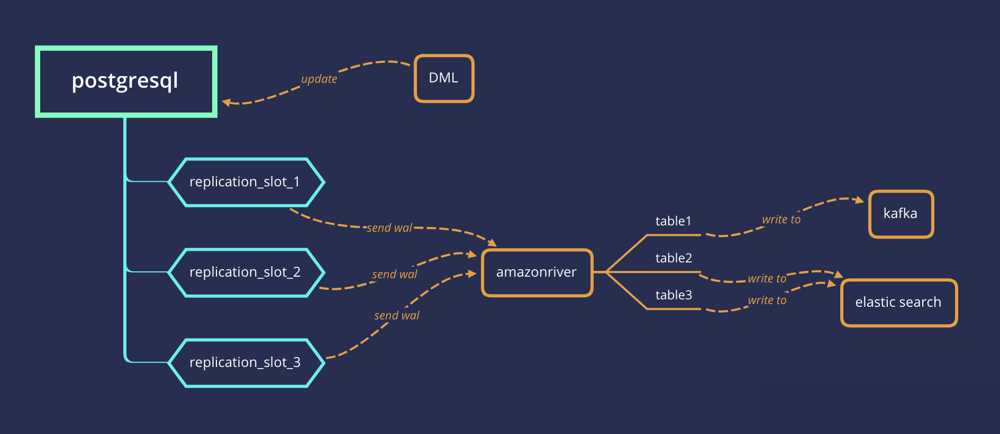

## PostgreSQL 逻辑复制、增量复制、逻辑订阅、增量订阅中间件 amazonriver - HelloBike开源 - 同步到elastic search , kafka   
                        
### 作者                        
digoal                        
                        
### 日期                        
2019-01-22                        
                        
### 标签                        
PostgreSQL , 逻辑复制 , 流复制 , testdecoding , amazonriver , hellobike      
                    
----                  
                    
## 背景    
    
amazonriver 是一个将postgresql的实时数据同步到es或kafka的服务。由hellobike开源。      
    
版本支持   
  
```
Postgresql 9.4 or later    
Kafka 0.8 or later    
ElasticSearch 5.x    
```
  
## 架构图    
    
    
## 原理    
    
amazonriver 利用pg内部的逻辑复制功能,通过在pg创建逻辑复制槽,接收数据库的逻辑变更,通过解析test_decoding特定格式的消息,得到逻辑数据    
    
## 安装使用    
    
### 安装    
    
```shell    
$git clone https://github.com/hellobike/amazonriver    
$cd amazonriver    
$glide install    
$go install    
```    
    
### 使用    
    
```    
amazonriver -config config.json    
```    
    
## PG 配置    
    
PG数据库需要预先开启逻辑复制[pg配置](https://github.com/hellobike/amazonriver/blob/master/doc/pg.md)    
    
## amazonriver 配置    
    
### 监控    
    
amazonriver支持使用prometheus来监控同步数据状态,[配置Grafana监控](https://github.com/hellobike/amazonriver/blob/master/doc/prometheus.md)    
    
### 同步到 elasticsearch    
    
[同步到elasticsearch](https://github.com/hellobike/amazonriver/blob/master/doc/es.md)    
    
### 同步到 kafka    
    
[同步到kafka](https://github.com/hellobike/amazonriver/blob/master/doc/kafka.md)    
    
## 性能测试    
    
[性能测试](https://github.com/hellobike/amazonriver/blob/master/doc/test.md)    
    
## 许可    
    
amazonriver 使用 Apache License 2 许可    
    
## 感谢hellobike  
    
## 参考  
go语言版本  
  
https://github.com/hellobike/amazonriver    
  
java语言版本  
  
https://github.com/hellobike/tunnel    
  
## logical decoding在主从架构下的切换逻辑处理问题
1、判断slot是否存在

2、如果slot不存在，新建slot（这一步说明发生了切换，从库没有slot信息，新建slot，从新的slot继续消费。会有一些数据丢失。）

3、如果slot已经存在，从slot继续消费。
  
[《PostgreSQL 使用逻辑decode实现异步主从切换后，时间线分歧变化量补齐、修复》](../201901/20190129_01.md)  
  
[《PostgreSQL 暂时不支持replication slot信息的主从同步》](../201905/20190503_06.md)  
  
[《PostgreSQL Failover slot - 支持将slot信息发送给物理备库》](../201805/20180516_01.md)  
  
0丢失还是需要内核层面支持slot failover，同时结合同步复制来实现。  
  
  
  
  
  
  
  
  
  
  
  
  
  
  
  
  
  
  
  
  
  
  
  
  
  
  
  
  
  
  
  
  
  
  
  
  
  
  
  
  
  
  
  
  
  
  
  
  
  
  
  
  
  
  
  
  
  
  
  
  
  
  
  
  
  
  
  
  
  
#### [PostgreSQL 许愿链接](https://github.com/digoal/blog/issues/76 "269ac3d1c492e938c0191101c7238216")
您的愿望将传达给PG kernel hacker、数据库厂商等, 帮助提高数据库产品质量和功能, 说不定下一个PG版本就有您提出的功能点. 针对非常好的提议，奖励限量版PG文化衫、纪念品、贴纸、PG热门书籍等，奖品丰富，快来许愿。[开不开森](https://github.com/digoal/blog/issues/76 "269ac3d1c492e938c0191101c7238216").  
  
  
#### [9.9元购买3个月阿里云RDS PostgreSQL实例](https://www.aliyun.com/database/postgresqlactivity "57258f76c37864c6e6d23383d05714ea")
  
  
#### [PostgreSQL 解决方案集合](https://yq.aliyun.com/topic/118 "40cff096e9ed7122c512b35d8561d9c8")
  
  
#### [德哥 / digoal's github - 公益是一辈子的事.](https://github.com/digoal/blog/blob/master/README.md "22709685feb7cab07d30f30387f0a9ae")
  
  

  
  
#### [PolarDB 学习图谱: 训练营、培训认证、在线互动实验、解决方案、生态合作、写心得拿奖品](https://www.aliyun.com/database/openpolardb/activity "8642f60e04ed0c814bf9cb9677976bd4")
  
  
#### [购买PolarDB云服务折扣活动进行中, 55元起](https://www.aliyun.com/activity/new/polardb-yunparter?userCode=bsb3t4al "e0495c413bedacabb75ff1e880be465a")
  
  
#### [About 德哥](https://github.com/digoal/blog/blob/master/me/readme.md "a37735981e7704886ffd590565582dd0")
  
